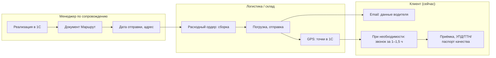
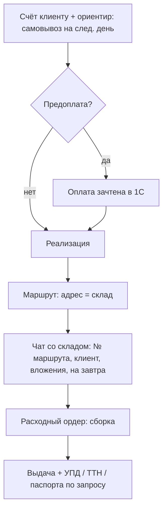
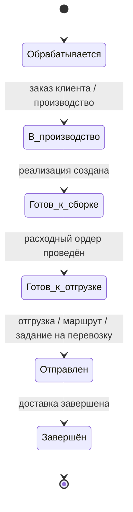

<!-- buildin-source: ЧТЗ/03_доставка.md -->

# ЧТЗ: Доставка

**Статус:** актуально
**Источники:** Понимание задачи, саммари интервью 2026-02-24 (процесс заказа JTBD), 2026-03-04 (доставка, бонусы, цены), 2026-03-13 (1С обмен данными), [демо прототипов 2026-04-15](../Интервью%20и%20встречи/Саммари/2026-04-15_демо_прототипов_саммари.md) (п. 4.6 — вопросы к созвону), **уточнение Palizh по самовывозу со склада (2026-06-02)**, ЧТЗ 09 (интеграция с 1С).  
**As-is / To-be:** as-is — как есть сейчас, **без** витрины и ЛК (правила в 1С, клиент узнаёт о дате доставки от менеджера; после отгрузки — email с данными водителя). to-be — с новым сайтом и ЛК (раздел 4, предупреждение в корзине, статусы в ЛК).

---

## 1. Назначение

Описывает правила выбора способа получения груза (**своя машина** / **ТК** / **самовывоз со склада**), расчёт стоимости и бесплатной доставки, планирование маршрута в 1С, информирование клиента о дате/статусе доставки и выдачу документов при приёмке. Цель — прозрачность для клиента: порог бесплатной доставки, ориентировочная дата, адрес самовывоза, контакты водителя и трекинг при доставке ТК.

---

## 2. Термины (общие)

| Термин | Описание |
|--------|----------|
| Плановая машина | Рейс по графику маршрутов (1С); от 120 тыс. руб. — бесплатная доставка своей машиной |
| Маршрут | Документ 1С: заказ, реализация, дата планируемой отправки, **адрес доставки или адрес склада** (при самовывозе); сигнал логистам / складу |
| Самовывоз со склада | Клиент забирает груз на складе Palizh; **адрес выдачи:** г. Ижевск, ул. Салютовская, 31 (завод Palizh) |
| Расходный ордер | Документ 1С: сборка/комплектация; статусы — сформирован / скомплектован и готов к отправке |
| Точка прохождения маршрута | Документ в 1С по данным GPS: водитель проехал точку; для контроля при спорах |

---

## 3. As-is: доставка сейчас (без витрины и ЛК)

Правила доставки хранятся в 1С (от 120 тыс. — бесплатно своей машиной; иначе — добрать или ТК). Клиент не видит порог на «корзине» — его озвучивает менеджер. График маршрутов на год формируют логисты в 1С; клиенты спрашивают «когда плановая машина» — менеджеры отвечают по памяти. После отгрузки клиенту шлют email с данными водителя; часть просит звонок за 1–1,5 ч — звонит водитель. При приёмке вручают УПД, по запросу — ТТН, паспорт качества.

### 3.1 От реализации до приёмки (сейчас)

### 3.3 As-is: самовывоз со склада (уточнение Palizh, 2026-06-02)

Согласовано с заказчиком (2026-06-02).

**Адрес склада выдачи:** **г. Ижевск, ул. Салютовская, 31** (завод Palizh). Часы ориентира для клиента — как у точки контактов (пн–пт 8:30–17:00, МСК+1); точное окно выдачи согласует менеджер.

| Шаг | Действие |
|-----|----------|
| 1 | Менеджер заводит заказ в 1С; **счёт** уходит клиенту (в to-be — также в ЛК). |
| 2 | При **предоплате** отгрузку в 1С не проводят, пока оплата не зачтена. |
| 3 | **Реализация** — факт продажи; склад комплектует партию. |
| 4 | **Маршрут** в 1С: для самовывоза в качестве адреса указывают **адрес склада** (Салютовская, 31). |
| 5 | **Расходный ордер** — сборка; статусы «сформирован» / «готов к отправке» (готов к выдаче). |
| 6 | **Клиенту** при **выставлении счёта** сообщают, что при самовывозе забрать можно **на следующий день** (устно / мессенджер / email). **Складу** пишут **после** трёх условий: **оплата получена**, **реализация проведена**, **маршрут проведён**. Сообщение — в **общий чат со складом**: **номер маршрута**, **наименование клиента**, **вложение** (доверенность на водителя клиента **или** накладная на курьера/ТК), просьба **подготовить на завтра** (пример). Автоматического слота самовывоза нет. |
| 7 | **Выдача:** клиент (или уполномоченный представитель) получает груз. **Документы от Palizh:** **УПД** (обязательно), **ТТН** и **паспорта качества** — по запросу / признаку клиента. **Документы от заказчика:** для **водителя ТК** — **накладная**; для **водителя клиента** — **доверенность** на водителя. |

### 3.2 To-be: статусы доставки для отображения в ЛК

В ЛК используется **единая верхнеуровневая цепочка из 6 статусов заказа** (см. ЧТЗ 08 и ЧТЗ 09): `Обрабатывается` → `В производство / производится` → `Готов к сборке` → `Готов к отгрузке` → `Отправлен` → `Завершён`.

Для блока доставки это означает:

- отдельные события `маршрут создан`, `назначен водитель`, `передан трек-номер`, `машина в пути` не становятся самостоятельными верхнеуровневыми статусами ЛК;
- они отображаются как **детали доставки внутри заказа**: ориентировочная дата, способ доставки, маршрут/задание на перевозку, контакты водителя, трек-номер ТК;
- источником этих деталей остаются документы и события 1С.

---

## 4. To-be: требования

### 4.1 Правила доставки

- Порог бесплатной доставки своей машиной для `MVP` задаётся как **настройка платформы в админке**. Текущее рабочее значение: **120 тыс. руб.** по заказу, но параметр должен быть редактируемым без изменения интеграции с `1С`.
- **Решение по источнику истины (2026-03-25, вариант A):** для отображения порога и подсказок в корзине/оформлении **первична платформа** (админка). В `1С` передаётся **уже согласованный** с клиентом на платформе заказ (включая выбранный способ доставки в рамках показанных правил). При расхождении с внутренними правилами/справочниками `1С` операционная обработка остаётся в контуре `1С`, но **клиентский UX и текст в ЛК** опираются на настройки платформы до отдельного согласования контракта обмена.
- **Основные причины использования ТК** (по интервью): **срочность** и **недобор по сумме заказа** (меньше 120 тыс.). Ориентир по соотношению своя машина / ТК: ~70–80% / 20–30%.
- В корзине и на шаге оформления: предупреждение `Доберите до N ₽ для бесплатной доставки`, где `N` берётся из настройки платформы.
- Выбор способа получения на платформе (**MVP**, п. 4.7): **доставка Palizh** (своя машина, при пороге), **ТК** (за счёт клиента) или **самовывоз со склада**. Сценарий **«забор на маршруте»** / встреча с водителем вне склада — **вне scope текущего этапа** (п. 4.6). При отказе от своей доставки до адреса — выбор ТК (ПЭК, Деловые линии и др.; **СДЭК не планируется**). **Распоряжения ПЭО** как отдельный документ для проекта платформы **не используются**: порог и пользовательские правила в корзине задаются **в админке** и не тянутся из внешнего регламента в обмене. Delivery-данные и маршрут остаются в контуре `1С`; передача на платформу — по согласованному **JSON API** (ЧТЗ 09). Расчёт стоимости и трекинг — по интеграции с ТК (виджеты для предварительного расчёта — уточнить в MVP: нужны ли или достаточно трек-номеров и подсказок). См. Понимание задачи.
- **Адрес доставки до клиента (решение 2026-06-02):** при способах Palizh и ТК адрес вводится через **DaData** на фронтенде (одна строка, выбор из подсказок); в заказ и в 1С передаётся отформатированная строка. Детали — ЧТЗ 01 §4.1.2, ЧТЗ 09 §4.8.

### 4.2 График маршрутов

- График маршрутов формируется логистами в 1С на год, редко меняется. В ЛК клиенту: возможность показать «ближайшая плановая машина в ваш регион — ориентировочно дата» (если данные доступны из 1С) — уточнить с заказчиком.
- Уведомление клиенту о дате/слоте доставки: сейчас менеджеры «держат в голове» и отвечают на запросы. Целевое поведение: после создания маршрута отправлять клиенту уведомление **по email** (ЧТЗ 10) с ориентировочной датой и далее — с контактами водителя; SMS/push платформой на текущем этапе не планируются.

### 4.3 Своя машина: статусы и контроль

- Для своей доставки события в 1С: реализация → маршрут → расходный ордер (сборка/готов к отправке) → отгрузка. GPS: ночью считываются точки прохождения маршрута, в 1С создаётся документ «Точка прохождения маршрута».
- В ЛК эти события не образуют отдельную вторую шкалу статусов, а наполняют карточку заказа деталями внутри верхнеуровневых статусов `Готов к отгрузке`, `Отправлен`, `Завершён`.
- Контакты водителя: рассылка по email с данными водителя (паспорт, телефон); часть клиентов просит звонок за час–полтора — звонит водитель. В ЛК отображать контакт водителя и дату/статус, когда они известны из 1С.
- Для корректной интеграции нужно согласовать, какие именно сущности и идентификаторы 1С участвуют в доставке: реализация, маршрут, задание на перевозку, точка прохождения маршрута, а также какие из них доступны платформе по API (см. ЧТЗ 09, раздел «Идентификаторы и связывание сущностей», и вопрос №37 реестра открытых вопросов).

### 4.4 Транспортные компании

- Активно работают с **Деловые линии** и **Байкал Сервис**. **СДЭК не планируется** (саммари 2026-03-04).
- **Процесс оформления заявки в ТК** (as-is, саммари 2026-03-04):
  1. Заказ клиента оформляется в 1С.
  2. Заказ передают логисту.
  3. Логист ставит заказ в рейс и заполняет предварительную заявку (Excel).
  4. Заявка передаётся в ТК; ТК создаёт её в своём ЛК.
  5. После передачи груза на терминал ТК перевешивает груз и присваивает **номер накладной**.
  6. Номер накладной передаётся клиенту → он отслеживает груз на сайте ТК (там же видит статусы и данные водителя).
- **Роль клиента:** заявку в ТК оформляет **логист**, а не клиент.
- **Для MVP в ЛК** достаточно отображать **номер накладной ТК** по заказу; клиент по нему самостоятельно отслеживает статус на сайте ТК.
- Виджеты ТК для предварительного расчёта стоимости/сроков — уточнить для MVP: нужны ли или достаточно трек-номеров и подсказок по ценам.
- Полноценное оформление заявки клиентом через виджет ТК **не требуется** (дублирует работу логиста).
- Отдельное ЧТЗ на интеграцию с ТК при детализации.

### 4.5 Документы при приёмке и выдаче

- При **доставке до адреса** клиенту вручают **УПД** (обязательно), по запросу — **ТТН**, **паспорт качества**.
- При **самовывозе со склада** (as-is, п. 3.3): от Palizh — **УПД**, **ТТН** и **паспорта качества** по запросу; от заказчика — **доверенность на водителя** (свой водитель) или **накладная** (водитель ТК).
- После отгрузки документы должны быть доступны в ЛК (см. ЧТЗ «Документооборот»).

### 4.7 Самовывоз со склада (to-be, MVP)

- На шаге **оформления заказа** клиент выбирает способ **«Самовывоз»**.
- Платформа **явно показывает адрес пункта выдачи:** **г. Ижевск, ул. Салютовская, 31** (значение из настроек контактов / админки; канон — `contacts:address` в `public-http-openapi.yaml`).
- В **заказе** и **карточке заказа в ЛК** способ и **адрес самовывоза** отображаются явно (не подменяются адресом доставки клиента).
- В состав заказа, уходящего в 1С, передаётся выбранный способ доставки; для самовывоза в 1С в маршруте фиксируется **адрес склада** (as-is, п. 3.3).
- При появлении **счёта** в ЛК (или в email по ЧТЗ 10) — текстовый ориентир: при самовывозе забрать можно **на следующий рабочий день** после выполнения условий на стороне Palizh (оплата при предоплате, реализация, маршрут); точное время — по согласованию с менеджером (как сейчас).
- Загрузка **доверенности** / **накладной на курьера** в ЛК до выдачи — **не в MVP** (сейчас менеджер передаёт вложения в чат склада); зафиксировать как развитие при необходимости.

### 4.6 Забор на маршруте — вне scope текущего этапа

**Решение (2026-06-02):** сценарии **встречи с водителем на трассе**, **забора груза с плановой машины без довоза до адреса** и аналогичные варианты **не реализуются** на платформе на **текущем этапе** (MVP и ближайшие релизы).

- В оформлении заказа и ЛК **нет** отдельного способа «заберу на маршруте» / «встреча с водителем».
- Операционно Palizh может по-прежнему договариваться с клиентом **вне платформы** (как as-is при сумме &lt; 120 тыс. — забор с машины); это **не дублируется** в цифровом контуре.
- **Самовывоз со склада** (п. 3.3, 4.7) — **единственный** вариант самовывоза в продукте на этом этапе.
- Возврат к теме — только по отдельному решению заказчика после MVP (ранее обсуждалось на [демо прототипов 2026-04-15](../Интервью%20и%20встречи/Саммари/2026-04-15_демо_прототипов_саммари.md)).

---

## 5. Открытые вопросы

- Нужен ли в ЛК календарь/слот «ближайшая плановая машина в ваш регион» или достаточно предупреждения в корзине и уведомления после создания маршрута?
- ~~Передача delivery-событий из 1С на платформу~~ — для MVP зафиксирована передача статической delivery-информации (дата, контакты водителя); детализация событий маршрута вынесена в дальнейшую спецификацию.
- Какие внешние идентификаторы маршрута, задания на перевозку и доставки платформа должна хранить для карточки заказа, трекинга и уведомлений.

---

## 6. Связь с другими ЧТЗ

| Блок | Связь |
|------|--------|
| Процесс оформления заказа | Порог 120 тыс. в корзине; создание маршрута после реализации (ЧТЗ 01) |
| Документооборот | УПД, ТТН, паспорт качества при приёмке (ЧТЗ 02) |
| Претензии | Довоз/забор при претензии — своей машиной или ТК (ЧТЗ 04) |
| Интеграция с 1С | Правила доставки, маршрут, статусы своей доставки, данные водителя и трек-данные (ЧТЗ 09) |
| Саммари интервью | [2026-03-04 доставка/бонусы/цены](../Интервью%20и%20встречи/Саммари/2026-03-04_доставка_бонусы_цены_уведомления_поиск_саммари.md) — правила ТК, процесс логиста, виджеты |
