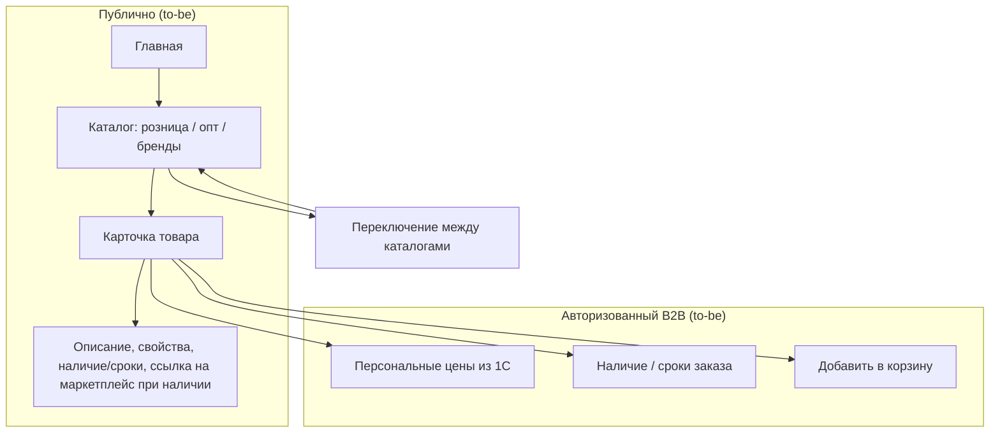

<!-- buildin-source: ЧТЗ/06_витрина_каталог.md -->

# ЧТЗ: Витрина и каталог

**Статус:** актуально
**Источники:** Понимание задачи, саммари интервью 2026-02-24, 2026-03-02, 2026-03-03 (маркетинг, витрина, каталог, обучение), 2026-03-04 (цены, поиск), [2026-05-19 маркетинг — дизайн-концепция / акции и баннеры](../Интервью%20и%20встречи/Саммари/2026-05-19_маркетинг_дизайн_концепция_саммари.md), Инфарх (информационная архитектура), ЧТЗ 09 (интеграция с 1С).  
**As-is / To-be:** as-is — как сейчас клиент получает информацию о товарах **без** новой B2B‑платформы: есть витринные каталоги на текущем сайте (`https://palizh.com/catalog/` для B2C и `https://palizh.com/catalog-industry/` для B2B) **без цен**, а каталог и цены для работы менеджеров живут в 1С, прайсы/предложения присылаются по запросу. to-be — новый сайт B2B‑платформы с витриной и каталогами (раздел 4), интегрированный с 1С и ЛК.

---

## 1. Назначение

Описывает публичную часть и каталоги платформы: главная, каталоги (розница, опт, по брендам), карточка товара, фильтры, сортировки. **Каталог «по брендам» — это альтернативное представление того же ассортимента, где навигация начинается с бренда/производителя (не отдельный B2C/B2B‑контур).** Мастер-данные — 1С (PIM); на платформе отображаются остатки, сроки производства, для авторизованного клиента — персональные цены. Цель — единая витрина с переключением между каталогами и корректным отображением ассортимента и условий.

---

## 2. Термины (общие)

| Термин | Описание |
|--------|----------|
| PIM | 1С — хранение и обработка информации о товарах: фото, описания, свойства, категории |
| Каталог (розница / опт / бренды) | Отдельные представления ассортимента с своими категориями, свойствами и набором товаров. **«По брендам»** — представление, где первый уровень навигации/группировки — **бренд/производитель** |
| Архивная / снятая с производства номенклатура | Товар, который больше не должен участвовать в обычной витрине как актуальная позиция, но может сохраняться в истории заказов и, если есть остаток, оставаться доступным к заказу |
| Сроки производства | Для номенклатур «свыше складской программы» — когда товар будет доступен |

---

## 3. As-is: как клиент узнаёт о товарах сейчас (без витрины B2B‑платформы)

Отдельной витрины **B2B‑платформы** сейчас нет. Есть текущий сайт Palizh с витринными каталогами товаров **без цен**:

- для B2C — `https://palizh.com/catalog/`;
- для B2B — `https://palizh.com/catalog-industry/`.

Эти каталоги используются как ознакомительная витрина ассортимента; для фактической работы с заказами и ценами основной источник — 1С. Каталог и цены для менеджеров хранятся в 1С; клиент получает актуальную информацию через менеджера: прайсы, предложения по email/Telegram, обсуждение по телефону. Персональные цены и условия — в 1С по контрагенту; заказ формируется разрозненно (см. ЧТЗ 01 as-is).

### 3.1 To-be: целевая витрина и доступ (новый сайт)

На новом сайте будет главная, каталоги (розница / опт / бренды), карточка товара.

- **Гости (незарегистрированные):** видят открытую витрину **без цен**; доступно название товара, описание, свойства, остатки/сроки, если это допустимо по бизнес-правилам. **Корзина и оформление заказа недоступны**. Для B2B‑продукции — кнопка `Уточнить оптовые условия` / переход в форму/чат. Если из `1С` по товару приходит ссылка на маркетплейс, гость может перейти на маркетплейс прямо из карточки товара.  
- **Авторизованный B2B‑клиент:** персональные цены из 1С по своему соглашению, наличие, кнопка `В корзину`.  

Переключение между каталогами без потери контекста.

---

## 4. To-be: требования

### 4.1 Главная и навигация

- Главная: витрина, переключение языка (на старте — русский; заложить мультиязычность), форма обращений, новости, о компании — по Инфарх и Пониманию задачи.
- **Баннерная зона на главной:** управляемые баннеры (маркетинг) для анонса новинок, акций, событий, обучающих мероприятий; по клику — переход на страницу акции / обучения / раздел «Акции» **или сразу в каталог по целевой ссылке** (в т.ч. URL с сохранённым состоянием фильтров). **MVP по промо:** на hero **нет динамической ленты карточек товаров** — визуал акции задаётся **статическими изображениями** (учесть desktop/mobile и шаблоны под кнопки); см. §4.5.1.
- Навигация между каталогами (розница, опт, по брендам) — кросс-платформенное переключение без потери контекста (по возможности).

### 4.2 Каталоги

- Несколько каталогов: розничный, оптовый, по брендам. У каждого — свои категории, свойства и ассортимент (источник — 1С).
- **Фильтры и сортировки** — см. **§4.2.0** (атрибуты из 1С, публичный API). Дополнительно: категория, бренд, цена, сортировка.
- **Фильтры по цвету / оттенкам (согласование с прототипом и встречей 2026-05-19):** в интерфейсе для пользователя — формулировки вроде **«оттенки цвета»** (внутренне может использоваться HEX и группировка по диапазонам/кластерам из данных 1С); полный выпадающий список всех оттенков сразу **не целиться** — ориентир: **поиск/автодополнение после нескольких символов** и визуальные группы; окончательная маппинг-логика (в т.ч. Color Index vs HEX vs текст названия) — **после реальной выгрузки** номенклатуры из 1С.
- При первом заходе — **поисковая строка** по каталогу; должна поддерживать запросы вида «для полиуретана» и т.п. (поиск по наименованию/артикулу/свойствам; детали — см. ЧТЗ 11).

### 4.2.0 Фильтры каталога и атрибуты (MVP, 2026-06-26)

**Принято:** состав фильтров на витрине **гибкий** — задаётся справочником атрибутов из 1С, а не фиксированным списком полей в шапке товара. Бизнес-группы из макетов («тип работ», «сфера применения», «специальные свойства» и т.д.) отображаются как **`label`** соответствующих атрибутов; технический идентификатор — **`code`** (например `worktype`, `surface`, `special` — см. примеры в `входящие/incoming-hooks.md`).

**Обмен 1С → платформа** (ЧТЗ 09, [`Модель_данных_каталог_1С_обмен.md`](../Техническая%20часть/Модель_данных_каталог_1С_обмен.md)):

| Слой | Содержание |
|------|------------|
| Справочник атрибутов | Событие **`sync.product-attributes`**: `code`, `label`, `valueType`, `filterType` (`select` / `range` / …), `isFilterable`, `isMulti`, `categories`, `unit`, `subvalueOptions` |
| Значения на товаре | В **`sync.products`** — массив **`attributes[]`**: `{ code, values[] }` |
| Устарело | Отдельные поля **`applicationScope`** / **`workType`** в шапке товара — **не использовать** |

**Публичный HTTP API** (канон стенда — [`public-http-openapi.yaml`](../Техническая%20часть/public-http-openapi.yaml)):

- **`GET /products/filters?categorySlug=…`** — список доступных фильтров для категории (схема `ProductFilter`: `code`, `label`, `filterType`, опции или `range`).
- **`GET /products`** — применение фильтров query-параметрами **`attr[<code>][]=<optionId>`** (select) и **`attrRange[<code>][from|to]`** (range); также `categorySlug`, `priceFrom`/`priceTo`, сортировка.

**Рабочий набор кодов атрибутов MVP (принято 2026-06-26):** до первой полной выгрузки из 1С в документах и примерах hooks используем перечень ниже; **новые коды** допускаются без смены API (гибкая модель).

| `code` | Label (пример UI) | `filterType` | Примечание |
|--------|-------------------|--------------|------------|
| `worktype` | Типы работ | select, multi | Бывш. «тип работ» в макетах |
| `surface` | Обрабатываемая поверхность | select, multi | |
| `special` | Специальные свойства | select, multi | |
| `compatibility` | Совместимость | select, multi | `subvalueOptions` (compatible / unknown) |
| `tintingMethod` | Способ колерования | select, multi | |
| `density` | Плотность | range | `unit`: г/см³; может быть привязан к категории |

Подписи **`label`** в UI могут уточняться с **Натальей** (макеты); **коды** — стабильный контракт для 1С и API.

**Открыто (реестр №54):** только **заполнение** справочника и значений на реальной номенклатуре в 1С; техническая модель и перечень кодов MVP **зафиксированы**.

**Устаревшие поля обмена** `applicationScope` / `workType` в документах и саммари — заменены моделью **`attributes[]`** (решение 2026-06-02, актуализация ЧТЗ 2026-06-26).

### 4.2.1 Архивная номенклатура и публикация товара

- Платформа должна различать:
  - активную номенклатуру для обычной витрины;
  - архивную / снятую с производства номенклатуру;
  - историческую номенклатуру, которая нужна для истории заказов и повторного заказа.
- Рабочая логика для MVP:
  - если товар снят с производства, но из `1С` приходит, что остаток **больше 0**, позиция может оставаться доступной к заказу;
  - если товар архивный / снятый с производства и остаток **0**, платформа может убирать его из активной витрины в архив;
  - если на стороне `1С` архивная пометка снята, платформа должна уметь возвращать товар из архива в активный каталог.
- Архивный статус товара не должен разрывать связь с историей заказов клиента: позиция должна оставаться идентифицируемой по внешнему ID `1С`.

### 4.2.2 Персональная номенклатура (один контрагент; требование заказчика 2026-04)

- Некоторые позиции в 1С могут быть помечены как доступные **только одному** контрагенту: в обмен **`sync.products`** передаётся **`counterpartiesGuid`**; на платформе и в публичном API — **`exclusiveCounterpartyGuid`** (маппинг — [`Маппинг_API_1С.md`](../Техническая%20часть/Маппинг_API_1С.md)). Канон HTTP стенда — [`public-http-openapi.yaml`](../Техническая%20часть/public-http-openapi.yaml); исходящий контракт 1С — `1c-http-openapi.yaml`.
- **Поведение:** товар **не** показывается в листинге, поиске и карточке **другим** B2B-компаниям и **гостю**; отображается и доступен к заказу **только** у сессии, у которой `GUID` контрагента совпадает с пришедшим из 1С. Позиция **без** такого `GUID` ведёт себя как обычный общий ассортимент (в пределах прочих правил каталога).
- **Корзина / оформление:** подстановка в корзину «чужой» персональной позиции блокируется на API (см. ЧТЗ 01). **Поиск и листинг:** позиции, недоступные текущему зрителю, **не** в выдаче (те же правила видимости, что `GET /products`; ЧТЗ 11 §5.7).

### 4.2.3 Цены и персональные скидки

- Из 1С на платформу приходят **виды цен** и **процент персональной скидки** для контрагента. **MVP (2026-06-02):** на позицию — **три** вида цены: **розница**, **опт**, **за коробку**; в номенклатуре — **шт. в коробке** (`unitsPerBox`). См. [`Модель_данных_каталог_1С_обмен.md`](../Техническая%20часть/Модель_данных_каталог_1С_обмен.md), реестр №56.
- **Персональная скидка** контрагента (% из соглашения) применяется к розничным **`amount`** и **`amountPerBox`** в `ProductPrice` → `discountedAmount` / `discountedAmountPerBox`. **Не** к опту (`WHOLESALE`) и **не** к отдельному виду цены **`BOX`** в `sync.prices` (это не то же самое, что поле `amountPerBox` для кратности).
- Для **гостей**:
  - цены в каталоге и карточке товара **не отображаются**;
  - корзина и оформление заказа недоступны, скидки не применяются;
  - если из `1С` по товару приходит ссылка на маркетплейс, в карточке товара может отображаться переход на соответствующий маркетплейс.
- Для **авторизованных B2B‑клиентов**:
  - отображаются цены по согласованным видам (розница / опт / коробка — по правилам соглашения и кратности);
  - скидка из соглашения — к **рознице**; логика корзины и подсказки кратности — **§4.2.4**, **ЧТЗ 01 §4.2.4**.
- **Подпись цены в карточке:** при кратности упаковки — **«цена / уп.»**; для штучных позиций — **«цена / шт»**.
- Детальные правила по зонам UI — **§4.2.4**.

### 4.2.4 Отображение цен в UI (MVP, 2026-06-27)

**Источник данных:** в **каталоге** платформа **не пересчитывает** цены — показывает значения из канона [`public-http-openapi.yaml`](../Техническая%20часть/public-http-openapi.yaml): `amount`, `amountPerBox`, `discountedAmount`, `discountedAmountPerBox`, `priceTypeCode`, `unitsPerBox`. В **корзине** `unitPrice` / `lineTotal` пересчитывает **backend** по **ЧТЗ 01 §4.2.4 (вариант A)**. Виды цен из 1С: `RETAIL`, `WHOLESALE`, `BOX` (реестр №56; `BOX` — **за коробку целиком**).

**Общие правила (авторизованный B2B):**

- **Основная цена** — по виду цены из соглашения контрагента (розница / опт; маппинг кодов — №56, `Маппинг_API_1С.md`).
- **Персональная скидка** — к розничным `amount` и `amountPerBox`; в API — `discountedAmount` / `discountedAmountPerBox`. Если по соглашению **наценка**, а не скидка — **не** акцентировать формулировку «скидка» (ЧТЗ 01).
- **Подписи единицы:** `unitsPerBox > 1` → **«цена / уп.»** (или «за коробку», если показывается `BOX` / `amountPerBox`); иначе — **«цена / шт»**.
- **Гость** — цен нет (§4.2.3).

| Зона | Что показываем |
|------|----------------|
| **Листинг каталога** | Одна **основная** актуальная цена для контрагента (с учётом `discountedAmount`, если применимо). При `unitsPerBox` и наличии цены за коробку — **вторичная строка** «цена за коробку» (`amountPerBox` или `BOX`) — опционально, если не перегружает плитку. |
| **Карточка товара** | Основная цена + подпись единицы; при `unitsPerBox` — пояснение кратности («в коробке N шт.»); блок «цена за коробку», если пришла из API. Зачёркнутая базовая + итоговая — при персональной скидке на розницу. |
| **Корзина** | `unitPrice` (средняя), `lineTotal`, `packagingMode`, `fullBoxesCount`, `remainderQuantity`; расчёт **смешанной строки** — **ЧТЗ 01 §4.2.4** (целые коробки × `amountPerBox` + остаток × `amount`). Подсказка при `mixed` / `non_multiple`. |

**Открыто для дизайна (реестр №30):** точная визуальная иерархия двух строк цен (рядом / tooltip / аккордеон); нужно ли в листинге одновременно показывать розницу и опт при соглашении с оптом — уточнить с заказчиком на макете.

### 4.3 Карточка товара

- Отображение: фото, описание, свойства, остатки по складской программе, сроки производства для номенклатур «свыше складской программы».
- Для **гостей**: цены не отображаются; вместо кнопки `В корзину` — `Войти` / `Стать клиентом` и, при необходимости, `Уточнить оптовые условия`. Если для товара из `1С` приходит ссылка на маркетплейс, гость может перейти на маркетплейс из карточки товара.
- Для **авторизованного клиента**: персональные цены по соглашению, наличие или сроки формирования заказа. Кнопка «В корзину» (см. ЧТЗ 01).
- SEO: метатеги, ЧПУ, микроразметка Schema.org — по Пониманию задачи.

### 4.4 Принятые решения по разделам (интервью 2026-03-03)

- **Раздел «Вопрос-ответ» / FAQ:** **не делаем** отдельный раздел. Часть сценариев (где взять документы, статусы и т.п.) покрывается через чат с менеджером и встроенные подсказки по месту в интерфейсе.
- **Раздел «Услуги и сервисы»:** **не нужен** — соответствующие сценарии (обучение, сервисы) покрываются разделом «Обучение» и чат-каналом.
- **Раздел «Новости»:** подтверждён; детали объёма и частоты наполнения — на стороне маркетинга.
- **Акции B2C → B2B:** акции, считающиеся B2C, должны быть **видны и клиентам B2B** — единый пул акций к просмотру; условия применимости задаются в карточке акции и/или в договорных условиях.
- **Мотивация регистрации:** отдельной «маркетинговой мотивации» не требуется; информация подаётся через баннеры (преимущества заказа через платформу).

### 4.5 Маркетинговые разделы (акции, новости, контент)

- **Раздел «Акции»:**
  - Список действующих и, опционально, архивных акций.
  - Карточка акции: заголовок, описание, период действия, условия участия, применимость (категории/товары, при необходимости — тип клиента), ссылка/кнопка перехода в каталог или ЛК.
  - Связь с баннерами на главной: баннер → страница акции, общий список «Акции» **или напрямую в каталог** по целевой ссылке (`targetUrl` / deeplink фильтров).
- **Публичный HTTP API витрины (канон GitLab `docs/public-http-openapi.yaml`, копия в `Техническая часть/public-http-openapi.yaml`):**
  - `GET /banners` — активные баннеры: изображение (`imageUrl`), переход (`targetUrl`), опционально заголовок/подзаголовок (`title`, `subtitle`).
  - `GET /promotions` — пагинированный список **активных** акций (`page`, `perPage` до 100): на стороне API учитываются флаг активности и границы периода (`starts_at` / `ends_at`), фиксированная сортировка — в описании операции в YAML.
  - `GET /promotions/{slug}` — детальная акция; неактивная акция отдаёт **404**.
  - В схемах `PromotionListItem` и `Promotion` поле **`ctaUrl`** — абсолютный или относительный URL для кнопки перехода (каталог с query-параметрами фильтров, лендинг акции и т.д.). Отдельной «ленты SKU» в ответе API нет — согласуется с подходом «текст условий + переход по ссылке».
  - В спецификации для ряда операций каталога/обучения в `summary` отмечено **«❗»** (метод не реализован / в работе) — ориентир для статуса бэкенда, не для смены продуктовых требований без отдельного решения.
- **Новости и статьи:**
  - Лента новостей с возможностью перехода на страницу новости.
  - Поддержка анонсов материалов с основного сайта/блога (`palizh.com`, в т.ч. [блог](https://palizh.com/blog/)): в новости указывается краткое описание и ссылка «Читать на сайте Palizh».
  - Отдельный большой раздел «Статьи» на платформе не обязателен; базовый сценарий — анонсы + ссылки наружу.

### 4.5.1 Акции и промо-баннеры — граница MVP (встреча 2026-05-19)

Сводка решений из [саммари маркетинга и дизайн-концепции](../Интервью%20и%20встречи/Саммари/2026-05-19_маркетинг_дизайн_концепция_саммари.md):

- **Конструктор акции** (ручное перечисление SKU в админке, отдельная «таблица акции» без связи с живым каталогом) и **динамическая лента товаров на главном баннере** — **не входят в текущий MVP**; при необходимости выносятся в **отдельное ТЗ** после запуска и сбора реальных кейсов.
- **Статический промо-баннер на главной:** коммуникация акции через **изображения** (отдельно проработать **desktop и mobile**, шаблоны под кнопки и заголовки). Тексты на баннере — **короткие**; развёрнутые условия — на **странице акции**.
- **Ссылка в каталог:** состояние фильтров можно передавать **deeplink URL** (`ctaUrl` / целевая ссылка баннера); это остаётся основным способом «показать подборку товаров акции» без конструктора.
- **Цены:** на баннере и в любом быстром превью промо **не показывать итоговую/«акционную» цену как обещание** — учёт персональных скидок, суммирования акций и бонусов для MVP не доведён до консистентной автоматики; достаточно **информирования текстом + переход в каталог**, где считаются реальные условия.
- **Сложные механики** (например, «2 % бонусов за образец непокупаемой новинки», комбинации нескольких автоматических скидок на превью) — **не автоматизируются в MVP**; описываются в тексте акции и отрабатываются с участием менеджера до появления отдельной продуктовой спеки.
- **Индикация «акционный товар»** в **листинге/КТ** (плашка у позиции) — **вне текущего объёма MVP**; маркетинг сохраняет идею как возможное развитие после запуска — отдельное решение и синхронизация с 1С/каталогом (отдельно от отказа от **hero-ленты** SKU).

Процессный момент **без финального решения:** обязательна ли **всегда** отдельная страница акции перед переходом в каталог или допускается **только `ctaUrl` в каталог** — обсуждалось как настройка контента в админке; см. §5 ниже.

### 4.6 Интеграция с 1С и управление контентом

- **Из 1С на платформу приходят** (события `POST /exchange`, см. ЧТЗ 09 и `входящие/incoming-hooks.md`):
  - **справочник атрибутов** (`sync.product-attributes`) и **значения на товаре** (`attributes[]` в `sync.products`);
  - типы номенклатуры, характеристики типа, **номенклатура (товары)**, категории витрины, остатки, цены;
  - цены и индивидуальные условия (см. ЧТЗ 10, 09); для гостей цены не отображаются, для авторизованных клиентов — вид цены из соглашения;
  - основное (первое) фото товара, базовые описания (по мере доработки 1С);
  - данные об остатках и сроках производства;
  - признак состояния номенклатуры для витрины / истории / повторного заказа (`активна`, `архивна`, `помечена`, `доступна к заказу` — точный контракт уточняется с `1С`).
- Для корректной интеграции нужно отдельно зафиксировать:
  - какие поля 1С являются обязательными для публикации товара на платформе;
  - какие внешние ID/GUID номенклатуры и категорий платформа хранит у себя;
  - как обновляются **номенклатура и категории** (согласование с заказчиком: **push из 1С**, полная выгрузка по команде, далее дельты) и **цены, остатки, атрибуты** (часто — сочетание расписания и событий — см. ЧТЗ 09);
  - как именно передаётся архивность / снятие с производства / пометка на удаление, чтобы платформа могла корректно скрывать товар из витрины, но не терять его в истории заказов.
- **Через админку платформы управляются:**
  - баннеры и промо‑блоки (главная, каталог, карточки);
  - новости, анонсы статей, описания обучающих программ;
  - дополнительные изображения (применение, иллюстрации), если они не могут храниться в 1С;
  - маркетинговые ссылки и вспомогательные материалы, которые не входят в клиентский документооборот ЛК.
- Платформа **не является источником истины по ассортименту и ценам** — эти данные задаёт 1С; админка используется для маркетинговых и вспомогательных материалов. Если `TDS/MSDS`, `СГР`, паспорта безопасности и аналогичные документы должны отображаться в ЛК клиента, они должны выдаваться через 1С; админка не должна становиться альтернативным источником клиентских документов. Детальное разделение ролей и прав в админке — см. ЧТЗ 12.

---

## 5. Открытые вопросы

- ~~Кто отвечает за наполнение: категории, фото, тексты~~ — зафиксировано: владелец контента на стороне маркетинга.
- Какие признаки/поля в 1С определяют публикацию товара в конкретном каталоге, состав карточки товара и доступность товара для B2B/B2C витрины.
- ~~Оборудование и «некаталоговая» номенклатура~~ — в MVP через заявку менеджеру, без отдельного каталожного раздела.
- ~~**Акции:** дифференциация по B2B/B2C и минимальный набор данных в карточке~~ — закрыты: см. §4.5 и §4.5.1 и контракт `public-http-openapi.yaml` (**`GET /promotions`**, **`GET /promotions/{slug}`**, схемы `Promotion*`). Открытый процессный момент: **обязательна ли отдельная страница акции** перед переходом в каталог или допускается **только `ctaUrl` в каталог** — см. §4.5.1 и **реестр №26**.
- **Контент маркетинга:** какой контент маркетинг планирует публиковать на новой площадке: новости, акции, анонсы статей/обучения; какие материалы остаются только на основном сайте/блоге, кто ведёт и с какой частотой обновления?
- ~~**Каталоги и прайсы:** какие каталоги можно показывать публично (B2C), какие — только действующим B2B‑клиентам в ЛК; в каком виде и в каких точках интерфейса может быть доступ к прайс‑листам, если он вообще нужен на платформе~~ — **закрыто (2026-06-29):** в MVP **нет** кнопки «скачать прайс»; клиент видит персональные цены в каталоге и **`lineTotal`** по строке корзины (**ЧТЗ 01 §4.2.4**, §4.2.3). **Выгрузка прайса / таблицы цен — только по запросу** (менеджер, email/Telegram — as-is; не self-service на платформе в MVP). Post-MVP: заказ файлом / шаблон Excel — ЧТЗ 01 §4.2.3.
- Какой состав данных по товару приходит из 1С для поиска и каталога: артикулы, коды поиска, номенклатура контрагента, атрибуты, изображения, публикационные флаги.
- Каким именно полем / набором полей `1С` будет передавать архивность / снятие с производства / пометку на удаление, чтобы платформа корректно управляла активной витриной и сценарием `повтор заказа`.
- **Фильтры:** ~~фиксированное или гибкое число групп~~ — **технически гибкая модель**, **рабочий набор кодов MVP** — §4.2.0 (2026-06-26); открыто только **наполнение** данными в 1С (реестр №54).
- ~~**Цена за коробку:** сумма за упаковку или за штуку~~ — **закрыто (2026-06-02):** в обмене цена **за коробку целиком** (`BOX` / поле 1С «цена за коробку»).

---

## 6. Связь с другими ЧТЗ

| Блок | Связь |
|------|--------|
| Процесс оформления заказа | Корзина, оформление, порог доставки (ЧТЗ 01) |
| Интеграция с 1С | Товары, цены, остатки, категории (ЧТЗ 09) |
| Система управления | Контент, баннеры, маркетинговые материалы; клиентские документы для ЛК не должны обходить 1С (ЧТЗ 12) |
| Поиск | Поиск по каталогу (ЧТЗ 11) |
| Саммари интервью | [2026-03-03 маркетинг/витрина/каталог/обучение](../Интервью%20и%20встречи/Саммари/2026-03-03_маркетинг_витрина_каталог_обучение_саммари.md) — FAQ, «Услуги», акции B2C→B2B, обучение, TDS/СГР; [2026-05-19 маркетинг — дизайн-концепция](../Интервью%20и%20встречи/Саммари/2026-05-19_маркетинг_дизайн_концепция_саммари.md) — граница MVP промо и баннеров, фильтры/цвет |
