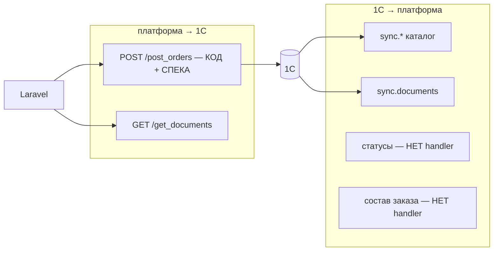

# 1С — обмен, post_orders, риски

<!-- buildin-source: Аудит/Аудит_готовности_1С_2026-08-17.md -->

# Аудит готовности 1С: данные, спеки, контур обмена (подробный)

**Дата:** 2026-08-17  
**Платформа (код):** `gitlab/main` **`ad55296`**  
**Сводный отчёт:** [`Аудит_готовности_2026-08-17.md`](Аудит_готовности_2026-08-17.md)  
**Предыдущий аудит:** [`архив/Аудит_готовности_1С_2026-08-07.md`](../архив/Аудит_готовности_1С_2026-08-07.md) (`3eb790d`)  
**Что должно быть в 1С для теста обмена:** [`Готовность_данных_в_1С.md`](Готовность_данных_в_1С.md)

**Итоговая оценка контура 1С: ~50–55%** (без прироста к 08-07).  
Контракт outbound выровнен; **подтверждённого E2E и inbound статусов нет**. Узкое место недели — **данные + `post_orders`**, не новые поля API.

---

## 1. Направления обмена

Платформа **не подписывает** `/exchange` (HMAC нет) — для 1С это значит: стенд примет любой payload с тем же контрактом, prod без HMAC опасен.

---

## 2. post_orders — контракт (без регресса)

| Поле / ответ | Статус |
|--------------|--------|
| `externalGuid` = GUID «Заказ клиента» в 1С | Канон D11 ✓ |
| items: `productGuid` + `productCharacteristicGuid` | ✓ |
| `priceBase` / `priceFinal` string | ✓ |
| Ответ `orderNumber` → `order.number` на платформе | ✓ в коде BE |
| Идемпотентность по `externalGuid` | **Должна быть в 1С**; E2E ☐ |
| `comment` / дата доставки | Риск строк **`'null'` с фронта** |

**Возможная ошибка E2E:** заказ в ЛК создаётся, job падает или в ERP дата/комментарий = текст `null`. Это не баг 1С в первую очередь — но **ломает приёмку обмена**.

---

## 3. Inbound: что платформа реально ест

Обрабатывается: продукты, атрибуты, типы, характеристики типов, остатки, цены, категории, контрагенты, документы.

**Не обрабатывается (400 / нет handler):**

- смена статуса / доставка заказа;
- полный snapshot ТЧ заказа (`sync.order-items` — постановка в аналитике, кода нет).

Рассинхрон с ЧТЗ/ЛК: пользователь ждёт live-статус после отгрузки — **платформа не обновит**, даже если 1С уже шлёт event.

---

## 4. Данные и типичные ошибки выгрузки

Перечень сущностей, документов к заказу, статусов и объёмов — в [`Готовность_данных_в_1С.md`](Готовность_данных_в_1С.md). Кратко риски:

| Тема | Что сломает витрину / демо |
|------|----------------------------|
| **Категории** | `sync.categories` как список товаров, не дерево папок → фильтр `categorySlug` пустой/ложный |
| **Характеристики** | Нет `productCharacteristicGuid` / пустые оттенки → заказ без строки или без цвета |
| **Цены/остатки** | Не привязаны к контрагенту тестового B2B → «нет цен» у залогиненного |
| **Контрагенты** | Нет 2 тестовых юрлиц / пользователь не связан → checkout 403/пустая корзина |
| **Документы** | Нет `sync.documents` / `relatedEntityGuid` ≠ GUID заказа → даже после UI documents пусто |
| **Объём** | Мало SKU / нет 15 оттенков 5×3 — нечем показать фильтры и КТ |

---

## 5. Рассинхроны 1С с FE / BE / аналитикой

| С кем | Суть |
|-------|------|
| Backend | Handler-набор уже списка событий; новые event 1С «в воздух» |
| Backend | HMAC в решениях — в коде нет (1С может слать «как в спеке», платформа не проверяет) |
| Frontend | `'null'` в comment/date |
| Frontend | Оттенки на моках — даже идеальный HEX из 1С фильтр FE не использует |
| Frontend | Документы в ЛК не рисуются из API |
| Аналитика | Задание `sync.order-items` и статусы — вперёд кода |
| Тест | E2E #47 / стенд: **не зафиксирован pass** в этом аудите |

---

## 6. P0 / P1 1С

| Pri | Задача |
|-----|--------|
| P0 | Датасет по [`Готовность_данных_в_1С.md`](Готовность_данных_в_1С.md) + корректный `sync.categories` (дерево) |
| P0 | Рабочий `POST /post_orders` + идемпотентность `externalGuid` |
| P0 | Связка тестового пользователя платформы с контрагентом |
| P1 | `sync.documents` / `get_documents` (счёт к заказу) |
| P1 | Согласовать **имя event** статусов — затем handler на бэке |
| P1 | Состав заказа — только после задания `sync.order-items` на бэке |
| P2 | Не обещать live delivery на демо |

---

*Платформа: `WebhookHandlerFactory`, `ExchangeController` @ `ad55296`. Контракт outbound без изменения канона 08-07.*
