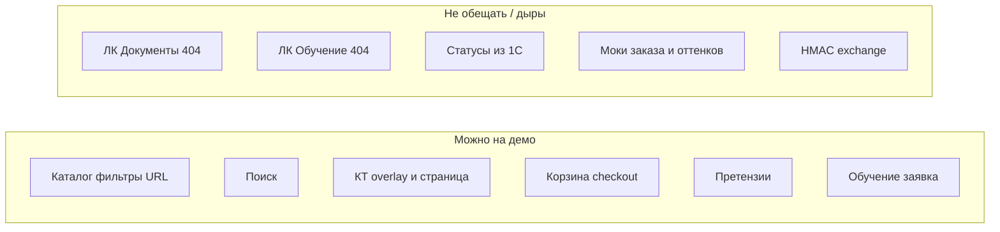

# Статус готовности к демо (2026-08-17)

<!-- buildin-source: Аудит/Статус_готовности_демо_2026-08-17.md -->

# Статус готовности к демо и тестированию

**Дата:** 2026-08-17  
**Снимок кода:** [gitlab.com/nutnet/palizh](https://gitlab.com/nutnet/palizh) `main` @ **`ad55296`** (2026-08-14).  
**Еженедельный аудит готовности (собрание):** [`Аудит_готовности_2026-08-17.md`](Аудит_готовности_2026-08-17.md) (сводка + FE / BE / 1С).  
**Цель:** собрание команды, подготовка к демо и smoke/E2E-тестированию.  
**Предыдущие опоры:** [`Аудит_согласованности_ЧТЗ_2026-08-11.md`](Аудит_согласованности_ЧТЗ_2026-08-11.md) (`917c1c4`); архив готовности 2026-08-07; [`Готовность_данных_в_1С.md`](Готовность_данных_в_1С.md).

**Фокус:** что можно показать, где рассинхрон/баги, что доделать, чеклист тестов. Не полный пересчёт % готовности слоёв.

---

## 1. Сводка по слоям

| Слой | К демо | Главный вывод |
|------|--------|---------------|
| **Frontend** | Можно показать витрину, поиск, КТ (overlay + страница), корзину→заказ, претензии, публичное обучение | Битые пункты ЛК «Документы»/«Обучение»; моки в карточке заказа и оттенках; нестандарт без API; checkout шлёт `'null'` |
| **Backend** | Auth, каталог, корзина, заказы, claims API, documents API, training API, `SendOrderJob` → `post_orders` | Нет HMAC на `/exchange`; нет inbound статусов/состава заказа; claims без ownership заказа |
| **1С** | Демо упирается в данные + `post_orders` + корректный каталог | Дерево категорий / E2E стенд; статусы в ЛК live — **не обещать** |
| **Сквозной E2E** | Корзина→заказ→1С **в коде**; статусы/документы в UI — частично/нет | Нужен заполненный датасет (см. чеклист 1С) |

---

## 2. Что сдвинулось с аудита 08-11 / `2ff8366`

| Тема | Коммит / фича | Эффект для демо |
|------|---------------|-----------------|
| URL-фильтры каталога + modal routing | `#87038` | Шаринг листинга с фильтрами; overlay меняет адрес на `/catalog/{slug}` |
| Страница КТ | `#87014` | `/catalog/[slug]` + SEO |
| Поиск витрины | `#87025` | UI поиска (раньше был только API) |
| Training request form | `#87023` | Публичная заявка на обучение |
| Claims UI / stats | `#86964` / `#86987` / `#87036` | Список + форма претензий |
| `SendOrderJob` + `orderNumber` | ранее | Номер заказа из 1С в ЛК (если HTTP 1С жив) |

---

## 3. Рассинхроны и ошибки (`ad55296`, сверено)

### 3.1. BUG / риск

| ID | Тема | Доказательство | Влияние на тест |
|----|------|----------------|-----------------|
| **B1** | Претензия: нет ownership заказа | `CreateClaimRequest`: `order_id` → `exists:orders,id` без контрагента; `ClaimService` пишет `order_id` как есть | Можно создать претензию к чужому заказу |
| **B2** | `ClaimService`: `find($id)->order_id` | NPE при несуществующем item; слабое `==` | Падение / неверные позиции |
| **B3** | Checkout: строки `'null'` | `frontend/app/pages/order.vue`: `date: 'null'`, `comment: 'null'` | Порча полей доставки/комментария в BE/1С |

### 3.2. FE ↔ BE desync

| Тема | Backend | Frontend | Вердикт |
|------|---------|----------|---------|
| Документы | `GET /documents`, download | Меню `/account/documents` — **страницы нет** | 404 в ЛК |
| Обучение в ЛК | training API + requests | Меню `/account/training` — **страницы нет** | 404; публичное `/learning-programs` работает |
| Оттенки | Характеристики/HEX из 1С (если выгружены) | `FilterPanel` — **`mockColorGroups`** | Select-фильтры с API — ок; цвет — мок |
| Карточка заказа | Documents API; delivery inbound нет | Моки extras / tracking / passport | Не для приёмки |
| Нестандарт | Endpoint под drawer не замкнут | `RequestDrawer.submit` → success без API | UI-only |
| Статусы заказа | `statusTransitions` на модели | Нет live из 1С | Статус после create = platform; дальше не обновляется |

### 3.3. GAP интеграции 1С

| Тема | Статус |
|------|--------|
| Inbound `sync.order-status` / delivery | Handler **нет** (`WebhookHandlerFactory` — только каталог + documents) |
| Inbound состав заказа (`sync.order-items`) | Постановка есть отдельно; в коде **нет** |
| HMAC `/exchange` | **Нет** в `ExchangeController` |
| `post_orders` | Job на платформе есть; E2E зависит от публикации 1С |
| Категории | Риск «товары вместо папок» — см. чеклист данных 1С |

---

## 4. Дорожная карта до стабильного теста

### Frontend (P0 / P1)

| Pri | Задача |
|-----|--------|
| P0 | Убрать `'null'` в checkout (`date` / `comment`) |
| P0 | Скрыть или реализовать пункты меню Документы / Обучение |
| P0 | Подключить документы/трек в карточке заказа без моков (или явный empty-state) |
| P1 | Реальные группы оттенков вместо `mockColorGroups` |
| P1 | Нестандарт: API + история или убрать success-заглушку |
| P1 | Consent ПДн на регистрации (если требуется на демо юр.контур) |

### Backend (P0 / P1)

| Pri | Задача |
|-----|--------|
| P0 | Ownership claims (заказ своего контрагента; items только этого заказа) |
| P0 | HMAC + allowlist на `/exchange` (для prod/stage) |
| P1 | Inbound статусов заказа (после фиксации event с 1С) |
| P1 | Inbound состава заказа (см. задание `sync.order-items`) |
| P1 | Null-safe items в ClaimService |

### 1С (P0 / P1)

| Pri | Задача |
|-----|--------|
| P0 | Датасет каталога + контрагенты (см. [Готовность данных в 1С](Готовность_данных_в_1С.md)) |
| P0 | Корректный `sync.categories` (дерево папок) |
| P0 | Рабочий `POST /post_orders` + идемпотентность по `externalGuid` |
| P1 | `sync.documents` / `get_documents` (счёт) |
| P1 | Inbound статусов — **после** согласования event; до этого не обещать на демо |

---

## 5. Чеклист тестирования команды

Отмечать ☐ / ☑. Предусловие: стенд с очередью, тестовый B2B-пользователь, данные по чеклисту 1С.

### 5.1. Гость — витрина

| № | Сценарий | Ожидание | ☐ |
|---|----------|----------|---|
| G1 | Главная → каталог | Листинг открывается | |
| G2 | Выбор категории | URL `?categorySlug=…`, товары категории | |
| G3 | Select-фильтры (worktype и т.п.) | URL с `attr[…][]`; refresh сохраняет набор | |
| G4 | Сортировка | Меняет выдачу; default не обязан быть в URL | |
| G5 | Поиск в шапке | Подсказки / результаты по каталогу | |
| G6 | Клик по карточке | Overlay; в адресной строке `/catalog/{slug}` | |
| G7 | Copy URL при overlay | У другого открывается **страница** КТ | |
| G8 | F5 на `/catalog/{slug}` | Страница КТ, не пустой каталог | |
| G9 | Цены у гостя | Не показываются (по ЧТЗ) | |

### 5.2. Auth

| № | Сценарий | Ожидание | ☐ |
|---|----------|----------|---|
| A1 | Login | Вход в ЛК / сессия | |
| A2 | Registration | Заявка уходит (email / 1С job) | |
| A3 | Recovery / reset | Письмо / смена пароля | |

### 5.3. B2B — корзина и заказ

| № | Сценарий | Ожидание | ☐ |
|---|----------|----------|---|
| O1 | Цены в каталоге / КТ | Видны персональные / по соглашению | |
| O2 | В корзину, кратность (`unitsPerBox`) | Подсказки; `lineTotal` сходится | |
| O3 | Checkout → confirm → success | `POST /orders` 201; **без** строк `'null'` в payload | |
| O4 | Номер заказа | После синка — `order.number` из 1С (`orderNumber`) | |
| O5 | В 1С | Документ «Заказ клиента» с GUID = `externalGuid` | |

### 5.4. ЛК

| № | Сценарий | Ожидание | ☐ |
|---|----------|----------|---|
| L1 | История заказов | Список, поиск/фильтр статуса | |
| L2 | Карточка заказа | Состав, статус platform; **не** требовать live delivery/docs | |
| L3 | Претензия на **свой** заказ | Создаётся, в списке «Отправлена» | |
| L4 | Избранное | Add/remove | |
| L5 | Меню «Документы» / «Обучение» | **Известный дефект** — 404; не включать в pass демо | |

### 5.5. Обучение (публичное)

| № | Сценарий | Ожидание | ☐ |
|---|----------|----------|---|
| T1 | `/learning-programs` | Список / карточка | |
| T2 | Заявка авторизованным | `POST /training/requests`, success | |

### 5.6. Негатив / не тестировать как pass

| Тема | Почему |
|------|--------|
| Live-смена статуса заказа из 1С | Нет inbound handler |
| Фильтр «Оттенки» как продуктовый | FE на `mockColorGroups` |
| Нестандартная заявка «сохранилась» | Нет API |
| Документы в ЛК / паспорт в заказе | UI/моки |
| Претензия к чужому `order_id` | BUG ownership — не для приёмки, для фикса |

---

## 6. Критерии «демо прошло» vs «готово к приёмке»

### Демо прошло (минимум)

- Гость: каталог + фильтры URL + КТ overlay/страница + поиск.
- B2B: цены → корзина → оформление → заказ в ЛК (номер — если 1С отвечает).
- Претензия на свой заказ (happy path).
- Публичная заявка на обучение.
- Команда знает список «не нажимать / не обещать» (§5.6).

### Готово к приёмке MVP (ещё нужно)

- Закрыты B1–B3 (ownership claims, checkout null).
- Документы в ЛК **или** пункт меню скрыт до готовности.
- Карточка заказа без моков extras (данные из 1С или честный empty).
- HMAC `/exchange`; inbound статусов согласован и реализован.
- Датасет 1С по чеклисту; категории — дерево; E2E `post_orders` стабилен.
- Оттенки с реальных HEX + группы в админке (не mock).
- Нестандарт: API + история **или** выведен из scope демо/приёмки явно.

---

## 7. Ссылки

| Документ | Зачем |
|----------|--------|
| [`Готовность_данных_в_1С.md`](Готовность_данных_в_1С.md) | Что должно быть в 1С для теста обмена |
| [`Задание_1С_незакрытые_блоки_MVP.md`](../Техническая%20часть/Задание_1С_незакрытые_блоки_MVP.md) | Незакрытые блоки ERP |
| [`Задание_sync_order_items_изменение_состава.md`](../Техническая%20часть/Задание_sync_order_items_изменение_состава.md) | Состав заказа из 1С (gap) |
| [`Задание_фронтенд_URL_фильтры_и_КТ.md`](../Техническая%20часть/Задание_фронтенд_URL_фильтры_и_КТ.md) | Правила URL (частично уже в коде) |
| [`Аудит_согласованности_ЧТЗ_2026-08-11.md`](Аудит_согласованности_ЧТЗ_2026-08-11.md) | Предыдущий аудит FE↔BE |

---

*Сверка точечных багов: `CreateClaimRequest` / `ClaimService`, `order.vue` `'null'`, `account-menu.ts`, `FilterPanel` mocks, `WebhookHandlerFactory` — `gitlab/main` @ `ad55296`.*
