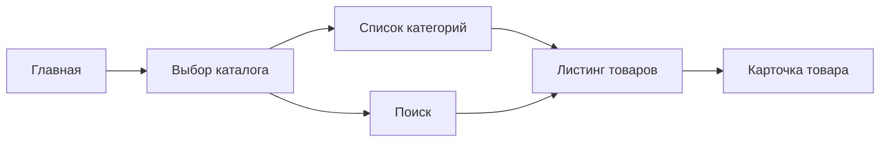

<!-- buildin-source: Техническая часть/openapi_mvp_catalog_product.md -->

# OpenAPI MVP: Catalog And Product

> **MVP / стенд (2026-06-26):** канон каталога и фильтров — **`public-http-openapi.yaml`** (`GET /products`, `GET /products/filters`, `attr`/`attrRange`). Этот документ описывает **устаревшую для стенда** модель `/catalogs/{catalogCode}/…`; сохранён до post-MVP выравнивания. См. [`OpenAPI_индекс.md`](OpenAPI_индекс.md).

Рабочий артефакт для фиксации `MVP`-контракта по публичному каталогу, карточке товара и базовому поиску по каталогу.

Этот документ описывает пользовательский и API-слой для:

- списка каталогов;
- дерева категорий;
- списка товаров;
- карточки товара;
- поисковой выдачи в каталоге.

**Импорт каталога из 1С на платформу** (full/delta, server-to-server) — в [`openapi_mvp_integration_1c.md`](openapi_mvp_integration_1c.md) и **`POST /exchange`** в [`openapi_1c_inbound_mvp.yaml`](openapi_1c_inbound_mvp.yaml) (`event`: `sync.products`, `sync.categories`, `sync.counterparties`). Расширенные post-MVP сценарии по витрине/каталогу — в [`openapi_mvp_post_mvp.yaml`](openapi_mvp_post_mvp.yaml), если понадобятся отдельно от MVP. Публичные `GET` каталога — [`openapi_client_mvp.yaml`](openapi_client_mvp.yaml); см. [`OpenAPI_индекс.md`](OpenAPI_индекс.md).

---

## 1. Базовые решения

- **Интеграция 1С ↔ платформа (2026-04-21, уточнение с заказчиком):** **отдельная реализация «полной выгрузки» не планируется** — тот же **инкрементальный** обмен; при **первичном наполнении** 1С **последовательно** отдаёт пакеты **по команде**; в работе — **дельты**, которые **1С сама отправляет** **при изменениях** в 1С (**не** регламентное «расписание» импорта каталога со стороны платформы). Приём — **`POST /exchange`** (`sync.*`) в OpenAPI. Публичные `GET` ниже — для витрины и ЛК; **не** дублируют протокол импорта из 1С.
- **Атрибуты товаров:** в ответе по товару передаются **идентификаторы атрибутов и значения**; отдельный endpoint **«справочник атрибутов»** (`ProductAttributes` и т.п.) **не обязателен**, если метаданные атрибутов (название, тип) включены в ответ **`GET /products/{id}`** / листинга — так проще для контракта с 1С; иначе можно оставить отдельный метод для кэша метаданных на платформе.
- Каталог и карточка товара доступны гостю и авторизованному пользователю.
- Для гостя цены **не отображаются**.
- Для авторизованного клиента в ответах могут приходить ценовые данные по его соглашению.
- Из `1С` на платформу приходят:
  - товары;
  - категории;
  - свойства;
  - остатки;
  - сроки производства / поступления;
  - состояние номенклатуры;
  - при наличии ссылка на маркетплейс.
- Платформа не является источником истины по ассортименту и ценам.
- **Персональная номенклатура (заказчик 2026-04):** в данных из 1С может быть `exclusiveCounterpartyGuid` — `GUID` **единственного** контрагента; листинг, поиск и `GET /products/{id}` **фильтруют** ответы по текущему зрителю; корзина — см. `PUT /cart/items/{productId}` в `openapi_client_mvp.yaml`.

---

## 2. Scope MVP

### 2.1 Входит в контракт

- `GET /catalogs`
- `GET /catalogs/{catalogCode}/categories`
- `GET /catalogs/{catalogCode}/products`
- `GET /products/{productId}`
- `GET /search/products`

### 2.2 Не входит в этот слой

- корзина и `add to cart`;
- избранное;
- подбор аналогов;
- сложные рекомендации;
- редактирование контента каталога из API админки.

---

## 3. Канонический пользовательский поток

---

## 4. Endpoint matrix

| Метод и path | Назначение | Auth | Комментарий |
| ------------ | ---------- | ---- | ----------- |
| `GET /catalogs` | Получить список доступных каталогов | Нет / опционально | Публично доступны каталоги витрины |
| `GET /catalogs/{catalogCode}/categories` | Получить дерево категорий каталога | Нет / опционально | Для навигации и фильтров |
| `GET /catalogs/{catalogCode}/products` | Получить листинг товаров | Нет / опционально | С фильтрами, сортировкой, пагинацией |
| `GET /products/{productId}` | Получить карточку товара | Нет / опционально | Ценовой блок зависит от auth |
| `GET /search/products` | Поиск товаров по каталогу | Нет / опционально | По наименованию, артикулу, свойствам |

---

## 5. Контракт по видимости данных

### 5.1 Для гостя

| Блок | Поведение |
| ---- | --------- |
| Каталоги | Видны |
| Категории | Видны |
| Товары | Видны, **кроме** персональной номенклатуры с `exclusiveCounterpartyGuid` (такие позиции гостю **не** отдаются) |
| Фото / описание / свойства | Видны (для видимых позиций) |
| Остатки / сроки | Допустимы, если это разрешено бизнес-правилами |
| Цены | Не показываются |
| Marketplace link | Может показываться, если пришёл из `1С` |

### 5.2 Для авторизованного B2B-клиента

| Блок | Поведение |
| ---- | --------- |
| Каталоги | Видны |
| Категории | Видны |
| Товары | Видны только строки **без** `exclusiveCounterpartyGuid` **или** с `exclusiveCounterpartyGuid`, совпадающим с контрагентом сессии |
| Фото / описание / свойства | Видны (для видимых позиций) |
| Остатки / сроки | Видны (для видимых позиций) |
| Цены | Приходят по соглашению / виду цены (для видимых позиций) |
| Marketplace link | Может приходить, но основной сценарий для B2B — работа с карточкой товара |

---

## 6. Базовые схемы данных

### 6.1 CatalogSummary

| Поле | Тип | Комментарий |
| ---- | --- | ----------- |
| `code` | `string` | Уникальный код каталога |
| `name` | `string` | Название каталога |
| `isPublic` | `boolean` | Доступен ли гостю |
| `sortOrder` | `integer` | Порядок отображения |

### 6.2 CategoryNode

| Поле | Тип | Комментарий |
| ---- | --- | ----------- |
| `id` | `string` | ID категории |
| `parentId` | `string or null` | Родитель |
| `name` | `string` | Название |
| `slug` | `string` | URL slug |
| `children` | `array` | Дочерние категории |

### 6.3 ProductCardSummary

| Поле | Тип | Комментарий |
| ---- | --- | ----------- |
| `id` | `string` | ID товара платформы |
| `nomenclatureGuid` | `string` | ID товара в `1С` |
| `sku` | `string` | Артикул / код поиска |
| `name` | `string` | Наименование |
| `slug` | `string` | URL slug |
| `brand` | `string or null` | Бренд |
| `imageUrl` | `string or null` | Основное изображение |
| `isArchived` | `boolean` | Архивность / снятие с производства |
| `isAvailableForOrder` | `boolean` | Доступность к заказу |
| `stockQty` | `number or null` | Остаток |
| `productionLeadTime` | `string or null` | Срок производства / поступления |
| `marketplaceUrl` | `string or null` | Ссылка на маркетплейс |
| `price` | `object or null` | Только для авторизованного клиента |
| `exclusiveCounterpartyGuid` | `string (uuid) or null` | `null` — общий ассортимент; иначе только для указанного контрагента 1С |

### 6.4 ProductDetailResponse

| Поле | Тип | Комментарий |
| ---- | --- | ----------- |
| `id` | `string` | ID товара |
| `catalogs` | `array` | В каких каталогах участвует |
| `categories` | `array` | Категории товара |
| `name` | `string` | Наименование |
| `description` | `string or null` | Описание |
| `attributes` | `array` | Атрибуты товара |
| `images` | `array` | Галерея |
| `availability` | `object` | Остатки / сроки / доступность |
| `price` | `object or null` | Ценовой блок только для авторизованного |
| `marketplaceUrl` | `string or null` | Внешняя ссылка |
| `exclusiveCounterpartyGuid` | `string (uuid) or null` | Как в §6.3 |

---

## 7. Query parameters

### 7.1 Для `GET /catalogs/{catalogCode}/products`

| Параметр | Тип | Назначение |
| -------- | --- | ---------- |
| `categoryId` | `string` | Фильтр по категории |
| `q` | `string` | Поиск по каталогу |
| `page` | `integer` | Страница |
| `perPage` | `integer` | Размер страницы |
| `sort` | `string` | Сортировка |
| `filters[...]` | `string/array` | Атрибутные фильтры |
| `includeArchived` | `boolean` | Для внутренних / специальных сценариев; по умолчанию `false` |

### 7.2 Для `GET /search/products`

| Параметр | Тип | Назначение |
| -------- | --- | ---------- |
| `q` | `string` | Поисковый запрос |
| `catalogCode` | `string` | Ограничение конкретным каталогом |
| `page` | `integer` | Страница |
| `perPage` | `integer` | Размер страницы |

---

## 8. Особые правила API

### 8.1 Архивная номенклатура

- Товар с архивным статусом и остатком `0` не должен попадать в обычную активную витрину.
- При этом связь с товаром не должна теряться на уровне ID и истории заказов.
- Для API полезно иметь два отдельных поля:
  - `isArchived`;
  - `isAvailableForOrder`.

### 8.2 Цены

- Канон для стенда и каталога: **`public-http-openapi.yaml`** (`ProductPrice`: `amount`, `amountPerBox`, `discountedAmount*`).
- Корзинный пересчёт (смешанная кратность) — **`CartItem`**, **ЧТЗ 01 §4.2.4**; см. [`openapi_mvp_cart_checkout_orders.md`](openapi_mvp_cart_checkout_orders.md) §5.3.
- Устаревшая модель `/catalogs/{catalogCode}/…` в этом файле **не** описывает корзину.

### 8.3 Marketplace link

- Поле `marketplaceUrl` опционально.
- Для гостя оно может быть основным CTA вместо покупки.
- Для авторизованного B2B-клиента это поле остаётся вспомогательным.

### 8.4 Персональная номенклатура (один контрагент)

- **Имя поля (канон):** `exclusiveCounterpartyGuid` — как в `1c-http-openapi.yaml` / `Product` и в этом документе; **ровно один** `GUID` или `null` (решению заказчика зафиксировано).
- Ограничение задаётся на **базовой** номенклатуре (`Product` в 1С HTTP), **не** на варианте.
- Семантика согласована с импортом **`POST /exchange`** (`sync.products` / `sync.categories`).
- Прямой запрос `GET /products/{productId}` на «чужую» персональную позицию: **404** (как у несуществующей), без раскрытия факта существования другому контрагенту.
- **Поиск и листинг:** недоступные зрителю позиции **не** попадают в выдачу (каталог и `GET /search/products`; правила — ЧТЗ 11 §5.7).

---

## 9. Открытые вопросы

| Вопрос | Влияние на API |
| ------ | -------------- |
| Какой точный состав атрибутов нужно возвращать в фильтры и карточку товара | Влияет на `attributes` и filter schema |
| Какой enum сортировок нужен в `MVP` | Влияет на `sort` |
| Нужно ли выделять отдельную endpoint для filter facets | Может добавить `GET /catalogs/{catalogCode}/filters` |
| Нужно ли возвращать гостю остатки и сроки во всех сценариях | Влияет на `availability` |
| Какой точный контракт для поля marketplace link приходит из `1С` | Влияет на `marketplaceUrl` |

---

## 10. Связанные документы

- `ЧТЗ/06_витрина_каталог.md`
- `ЧТЗ/11_поиск.md`
- `Инфарх/состав-и-задачи-страниц.md`
- `Техническая часть/1С_contract_matrix.md`
- `Техническая часть/openapi_client_mvp.yaml`
