# ЧТЗ проекта Palizh (полный комплект)

_Автособорка для NotebookLM. Правки вносить в исходные файлы репозитория, затем пересобрать bundle._


---

<!-- notebooklm-source: ЧТЗ/Оглавление.md -->

# Оглавление ЧТЗ

Список технических заданий по блокам проекта. Один файл — один блок. В документах ЧТЗ используются диаграммы Mermaid для визуализации бизнес-процессов. В каждом ЧТЗ явно разделены блоки **as-is** и **to-be**; понятия не смешивать:

- **As-is** — как есть **сейчас**, без нового сайта и ЛК (витрины и личного кабинета пока нет): текущие процессы компании (менеджеры, 1С, Telegram/email, выдача документов по запросу и т.д.).
- **To-be** — целевое состояние **с** новым сайтом и ЛК: требования к проектируемой системе.

**Глоссарий:** [Глоссарий.md](Глоссарий.md) — единый справочник терминов с указанием связи с документами ЧТЗ.

**Сводки и матрицы:**

- [Матрица_статусов_и_источников.md](Матрица_статусов_и_источников.md) — сводная таблица по объектам, статусам и источникам данных (1С / платформа / ТК / внутренние процессы компании) с привязкой к ЧТЗ; §7 — вводные с демо 2026-04-15 (адреса доставки в заказе, две цены кратно/некратно).
- [Сводка_онбординг_и_идентификаторы.md](Сводка_онбординг_и_идентификаторы.md) — краткое описание потока онбординга, GUID заявки, флага активности в 1С и связи с учётными записями в ЛК.

**Сквозная зависимость:** [09_интеграция_1С.md](09_интеграция_1С.md) — базовый зависимый документ для ЧТЗ `01`, `02`, `03`, `04`, `05`, `06`, `07`, `08`, `10`, `11`, `12`, а также для **`13` (НФТ)** — требования к доступности интеграции, ретраям, окнам обслуживания 1С; для **`14` (обучение)** — в MVP обмен с 1С по обучению не используется, в post-MVP при появлении интеграции нужно согласовать с ЧТЗ 09 и 10. При изменениях по `1С` нужно проверять не только `ЧТЗ 09`, но и связанные блоки: заказ, документы, доставка, онбординг, каталог, ЛК, уведомления, поиск, админка, при необходимости НФТ.

| № | Файл | Краткое описание |
| -- | ---- | ---------------- |
| 01 | [01_процесс_оформления_заказа.md](01_процесс_оформления_заказа.md) | Корзина → оформление → счёт → оплата → обработка заказа в 1С; 6 верхнеуровневых статусов заказа и delivery-детали в ЛК |
| 02 | [02_документооборот.md](02_документооборот.md) | Счёт, УПД, ТТН, паспорт качества, акты сверки; формирование в 1С, доступ в ЛК и email; хронология при претензиях |
| 03 | [03_доставка.md](03_доставка.md) | Порог бесплатной доставки и подсказки в корзине (админка); операционные данные маршрута из 1С, delivery-детали в заказе, уведомления клиенту, ТК и трекинг |
| 04 | [04_претензии.md](04_претензии.md) | Типы претензий (бой, недопоставка, излишек, некачественный продукт), форма на базе служебной записки, компактные статусы в ЛК, документы исполнения через 1С |
| 05 | [05_регистрация_онбординг.md](05_регистрация_онбординг.md) | Заявка «стать клиентом» → менеджер заводит в 1С (контрагент, договор, соглашение) → подписание → одобрение доступа к ЛК |
| 06 | [06_витрина_каталог.md](06_витрина_каталог.md) | Главная, каталоги (розница/опт/бренды), карточка товара, остатки и сроки производства, персональные цены для авторизованных |
| 07 | [07_ЛК_профиль_компания.md](07_ЛК_профиль_компания.md) | Профиль пользователя (данные, пароль, уведомления); профиль компании (реквизиты, коммерческие параметры из 1С) |
| 08 | [08_ЛК_заказы_статусы.md](08_ЛК_заказы_статусы.md) | История заказов, детализация, повтор заказа (выбор из списка), 6 статусов заказа, delivery-детали, трекинг, контакты водителя |
| 09 | [09_интеграция_1С.md](09_интеграция_1С.md) | Обмен с 1С: товары, цены, контрагенты, заказы, статусы, документы, операционные данные доставки (маршрут, delivery-детали); порог бесплатной доставки для UI — админка (ЧТЗ 03). Направления и формат. **Сквозной документ**, влияющий на остальные ЧТЗ |
| 10 | [10_уведомления.md](10_уведомления.md) | События по статусам заказа, delivery-деталям, документам и претензиям; **канал платформы — только email**; чат-виджет — уведомления вне платформы; настройки в ЛК |
| 11 | [11_поиск.md](11_поиск.md) | Поиск по каталогу на платформе: поля §5.5, ранжирование, UX, API; без внешнего движка (Ensi) |
| 12 | [12_система_управления.md](12_система_управления.md) | Админка: пользователи ЛК, контент (новости, страницы), настройки уведомлений, **маршрутизация email по типам форм**; тикет-система обращений в MVP не входит (опционально — журнал) |
| 13 | [13_нефункциональные_требования.md](13_нефункциональные_требования.md) | SLA, RPO/RTO, производительность, безопасность (152-ФЗ, HTTPS, JWT, OWASP), инфраструктура, мониторинг |
| 14 | [14_обучение_академия.md](14_обучение_академия.md) | Обучение (MVP): публичная витрина (включая колористику), карточки/контент в админке; «Оставить заявку» только авторизованному → заявка менеджеру (email‑маршрутизация); обработка вне платформы; в ЛК — история «Заявки на обучение» со статусом `Отправлено` (не меняется, без 1С). Развитие (слоты/оплата/интеграция с 1С) — post-MVP |

## Планируемые блоки (ориентировочно)

- Интеграция с ЭДО (Контур)
- Интеграция с ТК (ПЭК, Деловые линии и др.; **СДЭК не планируется** — см. ЧТЗ 03)
- Мобильное приложение

После появления новых ЧТЗ таблица выше дополняется ссылками и описаниями.


---

<!-- notebooklm-source: ЧТЗ/Глоссарий.md -->

# Глоссарий ЧТЗ

Единый справочник терминов проекта Palizh B2B-платформы. Термины собраны из текстов ЧТЗ 01–14 (включая нефункциональные требования и обучение); для каждого указана связь с документами ЧТЗ и — где уместно — с технической частью.

**Как пользоваться:** при чтении любого ЧТЗ можно сверяться с этим глоссарием для единой трактовки. При изменении формулировок в ЧТЗ — обновлять описание и здесь.

---

## Связь глоссария с документами ЧТЗ

| Документ | Файл | Термины из глоссария |
|----------|------|----------------------|
| Процесс оформления заказа | [01_процесс_оформления_заказа.md](01_процесс_оформления_заказа.md) | Заказ клиента, Реализация, Соглашение, Региональный менеджер, Менеджер по сопровождению |
| Документооборот | [02_документооборот.md](02_документооборот.md) | УПД, ТТН, Паспорт качества, ЭДО, Акты сверки |
| Доставка | [03_доставка.md](03_доставка.md) | Плановая машина, Маршрут, Расходный ордер, Точка прохождения маршрута, Правила доставки |
| Претензии | [04_претензии.md](04_претензии.md) | Претензия, Mass Project, Служебная записка, Отдел качества, Лаборатория; типы: Бой, Недопоставка, Излишек, Некачественный продукт |
| Регистрация и онбординг | [05_регистрация_онбординг.md](05_регистрация_онбординг.md) | Партнёр, Контрагент, Договор, Соглашение, Менеджер по сопровождению |
| Витрина и каталог | [06_витрина_каталог.md](06_витрина_каталог.md) | PIM, Каталог (розница/опт/бренды), Сроки производства, Персональная номенклатура (контрагент-эксклюзив) |
| ЛК: профиль и компания | [07_ЛК_профиль_компания.md](07_ЛК_профиль_компания.md) | Профиль пользователя, Профиль компании, Соглашение |
| ЛК: заказы и статусы | [08_ЛК_заказы_статусы.md](08_ЛК_заказы_статусы.md) | История заказов, Повторить заказ, Статусы доставки |
| Интеграция с 1С | [09_интеграция_1С.md](09_интеграция_1С.md) | Контрагент, Заказ клиента, Правила доставки, Договор, Соглашение |
| Уведомления | [10_уведомления.md](10_уведомления.md) | Событие, Канал |
| Поиск | [11_поиск.md](11_поиск.md) | Поиск по каталогу на платформе: поля §5.5, API `GET /search/products`; внешние движки (Ensi и др.) — не MVP |
| Система управления | [12_система_управления.md](12_система_управления.md) | Админка, Контент витрины |
| Нефункциональные требования | [13_нефункциональные_требования.md](13_нефункциональные_требования.md) | SLA, RPO, RTO, Uptime, 152-ФЗ, OWASP Top-10, Белый список IP |
| Обучение и Академия | [14_обучение_академия.md](14_обучение_академия.md) | Заявка на обучение, Карточка программы |

---

## Термины (по алфавиту)

### А

**Акты сверки**  
Документы, запрашиваемые клиентом; формирует менеджер по сопровождению в 1С. Ожидание формирования — типичная боль клиента (выходной, очередь). В перспективе — генерация и отправка в ЭДО.  
→ ЧТЗ [02](02_документооборот.md), [09](09_интеграция_1С.md)

**Админка**  
Веб-интерфейс системы управления платформой для сотрудников компании (не для клиентов): пользователи ЛК, контент, настройки уведомлений.  
→ ЧТЗ [12](12_система_управления.md)

---

### Б

**Белый список IP / IP allowlist**  
Список IP-адресов, которым разрешён доступ к защищённому сервису. В проекте используется с обеих сторон интеграции с 1С: заказчик (команда 1С) разрешает только исходящие IP платформы; платформа разрешает входящие вебхуки только с исходящих IP 1С. Подход без VPN согласован в 2026-04.  
→ ЧТЗ [09](09_интеграция_1С.md), Техническая часть: [Интеграция_1С.md §4.4](../Техническая%20часть/Интеграция_1С.md)

**Бой**  
Тип претензии: повреждение продукции, чаще при доставке. Для сценария с транспортной компанией может требоваться коммерческий акт ТК. Разбирает отдел качества; по ситуации подключаются логистика и ТК.  
→ ЧТЗ [04](04_претензии.md)

---

### В

**Внешний справочник ИНН**  
Внешний сервис / справочник для проверки ИНН клиентов при онбординге и в профиле компании. Используется платформой как источник первичной валидации реквизитов до заведения контрагента в 1С.  
→ ЧТЗ [05](05_регистрация_онбординг.md), [07](07_ЛК_профиль_компания.md)

**DaData (адреса доставки)**  
Внешний сервис подсказок и стандартизации **адресов доставки** груза. На **фронтенде** — виджет Suggest (`suggest/address`): пользователь вводит адрес одной строкой и **выбирает** вариант из списка. На бэкенд передаётся отформатированная строка (`unrestricted_value`) и опционально `fias_id`. **Не** используется для юридического адреса компании из 1С.  
→ ЧТЗ [01 §4.1.2](01_процесс_оформления_заказа.md), [03](03_доставка.md), [07 §4.2.1](07_ЛК_профиль_компания.md), [09 §4.8](09_интеграция_1С.md)

**VPN (в контексте 1С)**  
Ранее рассматривалось как способ доступа платформы к 1С. **Не используется:** в 2026-04 согласован вариант без VPN — с IP allowlist на обеих сторонах. Ссылки на VPN в документации помечены как устаревшие.  
→ ЧТЗ [09](09_интеграция_1С.md), Техническая часть: [Интеграция_1С.md §4.1, §4.4](../Техническая%20часть/Интеграция_1С.md)

---

### Д

**Две цены (кратно / некратно упаковке)**
Две цены в одной строке корзины: полные упаковки × `amountPerBox`, остаток штук × `amount`; персональный % на оба (розница). Округление RUB 2 знака. **ЧТЗ 01 §4.2.4**, `Принятые_решения` §4.

**DLQ (Dead-Letter Queue)**  
«Очередь мёртвых писем»: обособленная очередь для задач/событий, которые не удалось обработать после максимального числа ретраев. В проекте применяется к входящим вебхукам от 1С и исходящим операциям в 1С. Требует алертов и возможности ручного re-drive из админки.  
→ Техническая часть: [Backend_архитектура.md §3.2, §3.4](../Техническая%20часть/Backend_архитектура.md), [Интеграция_1С.md §4.3](../Техническая%20часть/Интеграция_1С.md)

**Договор**  
Справочник/документ в 1С: привязка к контрагенту, отсылка к месту ведения взаиморасчётов (соглашение). Для доступа к платформе клиенту нужны заведённые в 1С контрагент, договор и соглашение.  
→ ЧТЗ [05](05_регистрация_онбординг.md), [07](07_ЛК_профиль_компания.md), [09](09_интеграция_1С.md)

---

### З

**Заказ клиента**  
Документ 1С — заявка на покупку (в 1С — «фантик», не факт продажи); резервирование по возможности. После обработки создаётся реализация и маршрут.  
→ ЧТЗ [01](01_процесс_оформления_заказа.md), [09](09_интеграция_1С.md)

---

### И

**`integrationSyncState`**  
Техническое поле в API платформы, отражающее состояние синхронизации заказа с 1С (принят, принимается, ошибка синхронизации и т.п.). Используется в ЛК для отображения блока / баннера при задержке или сбое передачи заказа в 1С и для построения уведомлений.  
→ ЧТЗ [08 §3.1](08_ЛК_заказы_статусы.md), [09](09_интеграция_1С.md); Техническая часть: `openapi_client_mvp.yaml` (`OrderIntegrationSyncState`)

**История заказов**  
Список заказов клиента (контрагента), в т.ч. выполненные до запуска ЛК — при наличии выгрузки из 1С. Отображается в разделе ЛК «Заказы».  
→ ЧТЗ [08](08_ЛК_заказы_статусы.md), [09](09_интеграция_1С.md)

---

### К

**Канал (уведомлений)**  
Способ доставки уведомления **с платформы Palizh** на текущем этапе: **только email**. SMS и push платформой не планируются до отдельного решения; уведомления в контуре **чат-виджета** — у поставщика виджета.  
→ ЧТЗ [10](10_уведомления.md)

**Каталог (розница / опт / бренды)**  
Отдельные представления ассортимента с своими категориями, свойствами и набором товаров. **Каталог «по брендам» — это представление ассортимента с группировкой по бренду/производителю (не отдельный B2C/B2B‑контур).** Переключение между каталогами — кросс-платформенное. Источник данных — 1С.  
→ ЧТЗ [06](06_витрина_каталог.md), [09](09_интеграция_1С.md)

**Качество (претензия по)**  
Тип претензии: некачественный продукт / несоответствие качества. Разбирает отдел качества, при необходимости подключается лаборатория; итог — замена, корректировка, возврат, зачёт или отказ.  
→ ЧТЗ [04](04_претензии.md)

**Контрагент**  
Справочник 1С: реквизиты (ИНН, КПП, наименование, банк), взаиморасчёты. Вместе с договором и соглашением определяет условия оплаты и доставки; привязка пользователя ЛК к контрагенту обязательна для заказов.  
→ ЧТЗ [05](05_регистрация_онбординг.md), [07](07_ЛК_профиль_компания.md), [09](09_интеграция_1С.md)

**Контент витрины**  
Новости, страницы «О компании», баннеры (если есть), тексты форм. Управляется в системе управления (админка).  
→ ЧТЗ [12](12_система_управления.md), [06](06_витрина_каталог.md)

---

### М

**Маршрут**  
Документ 1С: заказ, реализация, дата планируемой отправки, адрес доставки. Сигнал логистам для задания на перевозку и складу для расходного ордера.  
→ ЧТЗ [03](03_доставка.md), [01](01_процесс_оформления_заказа.md), [09](09_интеграция_1С.md)

**Менеджер по сопровождению**  
Сотрудник: заведение заказа и документов в 1С (реализация, маршрут, печатные формы), заведение контрагента/договора/соглашения при онбординге, формирование актов сверки. Согласование с клиентом, одобрение доступа к ЛК.  
→ ЧТЗ [01](01_процесс_оформления_заказа.md), [02](02_документооборот.md), [05](05_регистрация_онбординг.md)

**Mass Project**  
Внутренняя система компании, в которой менеджер запускает бизнес-процесс претензии, прикладывает служебную записку и вложения. Для платформы и ЛК `Mass Project` не является прямой интеграцией; клиентские статусы и документы должны отражаться через `1С` и платформу.  
→ ЧТЗ [04](04_претензии.md)

**mTLS**  
Mutual TLS — взаимная аутентификация по TLS-сертификатам. Опциональный вариант защиты канала между платформой и 1С в дополнение к IP allowlist. Решение по применению — в связке с выбором схемы аутентификации (токен / Basic / mTLS), открытый вопрос реестра.  
→ ЧТЗ [09 §5](09_интеграция_1С.md); Техническая часть: [Интеграция_1С.md](../Техническая%20часть/Интеграция_1С.md)

---

### Н

**Недопоставка**  
Тип претензии: клиент получил меньше товара, чем ожидалось. По итогам принятия претензии обычно формируется новая реализация / новая отгрузка на недостающее количество.  
→ ЧТЗ [04](04_претензии.md)

---

### О

**Отдел качества**  
Подразделение, владелец бизнес-процесса по претензиям; рассматривает материалы, формирует итоговое решение, при необходимости подключает лабораторию, логистику и другие участки.  
→ ЧТЗ [04](04_претензии.md)

---

### П

**Партнёр**  
Справочник 1С: публичное название организации, признак (клиент, поставщик и т.д.). Используется при онбординге вместе с контрагентом и договором.  
→ ЧТЗ [05](05_регистрация_онбординг.md)

**Персональная номенклатура (контрагент-эксклюзив)**  
Позиция ассортимента (номенклатура), для которой в 1С задан **ровно один** контрагент-владелец: на платформе товар **не** виден гостю и **другим** B2B, отображается и доступен к заказу только при совпадении `GUID` контрагента сессии с переданным из 1С (`exclusiveCounterpartyGuid` в API). **Не путать** с *номенклатурой контрагента* в смысле **«коды клиента»** (свой SKU клиента на стандартную позицию) — это отдельная сущность в обмене.  
→ ЧТЗ [06](06_витрина_каталог.md), [09](09_интеграция_1С.md), [01](01_процесс_оформления_заказа.md); Техническая часть: `openapi_client_mvp.yaml`, `openapi_1c_inbound_mvp.yaml`, `1c-http-openapi.yaml`

**Паспорт качества**  
Документ на партию продукции; формируется в 1С, с печатью/подписью (факсимиле). Выдаётся по запросу или по признаку клиента; в ЛК — кнопка «Получить паспорта качества» по заказу/отгрузке.  
→ ЧТЗ [02](02_документооборот.md), [03](03_доставка.md)

**Плановая машина**  
Рейс по графику маршрутов (1С). От 120 тыс. руб. по заказу — бесплатная доставка своей машиной. График формируют логисты на год.  
→ ЧТЗ [03](03_доставка.md), [01](01_процесс_оформления_заказа.md)

**Повторить заказ**  
Копирование состава выбранного заказа в корзину одной кнопкой; выбор заказа из списка (не только последний).  
→ ЧТЗ [08](08_ЛК_заказы_статусы.md), [01](01_процесс_оформления_заказа.md)

**Правила доставки**  
Условия доставки своей машиной vs ТК, связанные ограничения и отображаемый порог бесплатной доставки. Для `MVP` порог бесплатной доставки в корзине/оформлении задаётся в админке платформы (**первична платформа для UI**); в `1С` уходит согласованный заказ; delivery-данные и операционные события поступают из `1С`.  
→ ЧТЗ [03](03_доставка.md), [09](09_интеграция_1С.md), [01](01_процесс_оформления_заказа.md)

**Претензия**  
Любое возражение по продукции или отгрузке: бой, недопоставка, излишек, некачественный продукт и т.д. Клиент подаёт претензию через форму на платформе; текущая основа формы — служебная записка. В `MVP` карточка претензии в ЛК создаётся со статусом `Отправлена` и сохраняется в истории, а дальнейший разбор и исполнение происходят вне платформы. Возврат статусов исполнения и документов в ЛК рассматривается после `MVP`.  
→ ЧТЗ [04](04_претензии.md), [02](02_документооборот.md)

**Профиль компании**  
Раздел ЛК: реквизиты юрлица и коммерческие параметры из договора/соглашения (лимиты, отсрочки, скидки, бонусы, признак постоплаты). Данные из 1С; изменение условий — через менеджера/договор. **Бонусы в `MVP`:** типы, условия и баланс из 1С; история операций в ЛК не показывается.  
→ ЧТЗ [07](07_ЛК_профиль_компания.md), [09](09_интеграция_1С.md)

**Профиль пользователя**  
Раздел ЛК: учётная запись — ФИО, email, телефон, смена пароля, настройки уведомлений.  
→ ЧТЗ [07](07_ЛК_профиль_компания.md), [10](10_уведомления.md)

**PIM**  
Product Information Management. В проекте — 1С: хранение и обработка информации о товарах (фото, описания, свойства, категории). Источник данных для витрины и поиска.  
→ ЧТЗ [06](06_витрина_каталог.md), [09](09_интеграция_1С.md)

---

### Р

**Расходный ордер**  
Документ 1С: сборка/комплектация заказа. Статусы — сформирован / скомплектован и готов к отправке. Создаётся после маршрута для склада.  
→ ЧТЗ [03](03_доставка.md)

**Реализация**  
Документ 1С, подтверждающий факт продажи (не «фантик» заказа). Создаётся после оплаты (при предоплате) или по решению менеджера (при постоплате). После реализации создаётся маршрут.  
→ ЧТЗ [01](01_процесс_оформления_заказа.md), [03](03_доставка.md)

**Региональный менеджер**  
Сотрудник: приём заказа от клиента, связь с клиентом, согласование (наличие, замена позиций, счёт). Не заводит документы в 1С — это делает менеджер по сопровождению.  
→ ЧТЗ [01](01_процесс_оформления_заказа.md)

**Излишек**  
Тип претензии: клиент получил больше товара, чем должен был. Дальнейший сценарий зависит от решения: товар может остаться у клиента или запускается возврат / корректировка.  
→ ЧТЗ [04](04_претензии.md)

---

### С

**Событие (уведомления)**  
Триггер отправки уведомления клиенту: новый заказ принят, счёт готов, оплата поступила, изменился один из 6 верхнеуровневых статусов заказа, появились значимые детали доставки (дата, трек-номер, контакты водителя), претензия (статус), акт сверки готов и т.д.  
→ ЧТЗ [10](10_уведомления.md)

**Соглашение**  
Справочник 1С: этапы оплаты, способ оплаты (предоплата/постоплата), проценты, даты сдвига (отсрочка). Определяет, когда возможна реализация и что видит клиент в ЛК по условиям.  
→ ЧТЗ [01](01_процесс_оформления_заказа.md), [05](05_регистрация_онбординг.md), [07](07_ЛК_профиль_компания.md), [09](09_интеграция_1С.md)

**Сроки производства**  
Для номенклатур «свыше складской программы» — когда товар будет доступен. Отображаются на витрине и в ЛК; источник — 1С.  
→ ЧТЗ [06](06_витрина_каталог.md), [08](08_ЛК_заказы_статусы.md), [09](09_интеграция_1С.md)

**Статусы доставки**  
В проекте используется единая верхнеуровневая цепочка из 6 статусов заказа в ЛК: `Обрабатывается`, `В производство / производится`, `Готов к сборке`, `Готов к отгрузке`, `Отправлен`, `Завершён`. Доставка не создаёт отдельную вторую шкалу статусов: маршрут, водитель, трек-номер и события в пути показываются как детали заказа на основании данных 1С.  
→ ЧТЗ [08](08_ЛК_заказы_статусы.md), [03](03_доставка.md), [09](09_интеграция_1С.md)

**Синонимы (поиск)**  
Варианты наименований товара: как называют клиенты, артикулы, альтернативные названия. Используются поисковым сервисом для улучшения выдачи.  
→ ЧТЗ [11](11_поиск.md), [06](06_витрина_каталог.md)

---

### Т

**Служебная записка**  
Внутренняя структурированная форма по претензии, которую сейчас заполняет менеджер на основе данных клиента. Рассматривается как основа будущей формы претензии в ЛК.  
→ ЧТЗ [04](04_претензии.md)

**Товароведы склада**  
Сотрудники склада, которые могут участвовать в корректировках и исполнении претензий по количеству / отгрузке в `1С`.  
→ ЧТЗ [04](04_претензии.md)

**Точка прохождения маршрута**  
Документ в 1С по данным GPS: водитель проехал точку маршрута. Используется для контроля (например, при споре «был/не был водитель»).  
→ ЧТЗ [03](03_доставка.md)

**ТТН**  
Товарно-транспортная накладная. Формируется в 1С по запросу клиента; отдельный документ от УПД. Вручается при приёмке по запросу; доступ в ЛК — при наличии.  
→ ЧТЗ [02](02_документооборот.md), [03](03_доставка.md)

---

### У

**УПД**  
Универсальный передаточный документ. Обязателен при отгрузке; остаётся у клиента и водителя. После отгрузки, отражённой в `1С`, в ЛК — получение по запросу в `1С` (файл на платформе не хранится), единый UX.  
→ ЧТЗ [02](02_документооборот.md), [03](03_доставка.md), [04](04_претензии.md)

---

### Э

**Egress IP**  
Исходящий IP-адрес платформы при вызовах во внешние системы (в первую очередь — 1С). Фиксируется отдельно для окружений dev / stage / prod. Участвует в IP allowlist на стороне 1С; процедура изменения — согласование с заказчиком ≥ 3 рабочих дня.  
→ Техническая часть: [Интеграция_1С.md §4.4](../Техническая%20часть/Интеграция_1С.md), [Инфраструктура_и_CI-CD.md](../Техническая%20часть/Инфраструктура_и_CI-CD.md)

**ЭДО**  
Электронный документооборот. На старте не используется массово; в перспективе — счета, акты сверки (Контур). Законодательство к концу 2026 года — ожидается обязательность ЭДО для части документов.  
→ ЧТЗ [02](02_документооборот.md)

**Ensi Cloud Search**  
Рассматривался как внешний поисковый сервис; **на текущем этапе не внедряется.** Поиск — на платформе (ЧТЗ 11 §5.5).  

**SearchBooster** (и аналоги)  
Рассматривались на ранних этапах; **к выбору решения не относятся.**

→ ЧТЗ [11](11_поиск.md), [06](06_витрина_каталог.md)

---

*При добавлении новых ЧТЗ и терминов — дополнять глоссарий и таблицу связи в начале документа.*


---

<!-- notebooklm-source: ЧТЗ/Матрица_статусов_и_источников.md -->

# Матрица статусов и источников данных

Сводная таблица по основным объектам и статусам платформы: откуда берутся статусы, какие системы являются источником истины и с какими ЧТЗ связаны.

## 1. Заказ и оплата

| Объект | Статус в ЛК / событие | Источник данных | Где описано |
|--------|------------------------|-----------------|-------------|
| Заказ | Создан / принят | Платформа (создание), подтверждение в 1С (документ «Заказ клиента») | ЧТЗ 01, ЧТЗ 09 |
| Счёт | Счёт выставлен / готов | 1С (формирование счёта) | ЧТЗ 01, ЧТЗ 02, ЧТЗ 09 |
| Оплата | Оплачен / частично оплачен / не оплачен | 1С (банковские выписки, разнесение платежей) | ЧТЗ 01, ЧТЗ 02, ЧТЗ 09 |

## 1.1 Верхнеуровневые статусы заказа в ЛК

| Статус в ЛК | Источник / событие 1С | Где описано |
|-------------|------------------------|-------------|
| Обрабатывается | Создан `Заказ клиента` | ЧТЗ 08, ЧТЗ 09 |
| В производство / производится | Создан заказ на производство | ЧТЗ 08, ЧТЗ 09 |
| Готов к сборке | Создана реализация, расходный ордер ещё не проведён | ЧТЗ 08, ЧТЗ 09 |
| Готов к отгрузке | Расходный ордер проведён, партия скомплектована | ЧТЗ 03, ЧТЗ 08, ЧТЗ 09 |
| Отправлен | Отгрузка начата; есть маршрут / задание на перевозку / отправка через ТК | ЧТЗ 03, ЧТЗ 08, ЧТЗ 09 |
| Завершён | Доставка завершена / заказ закрыт | ЧТЗ 03, ЧТЗ 08, ЧТЗ 09 |

## 2. Доставка (своя машина и ТК)

| Объект | Статус в ЛК / этап | Источник данных | Где описано |
|--------|--------------------|-----------------|-------------|
| Заказ / отгрузка | Готов к отгрузке | 1С (реализация, расходный ордер) | ЧТЗ 01, ЧТЗ 03, ЧТЗ 09 |
| Доставка своей машиной | Детали внутри статуса `Отправлен`: маршрут, задание на перевозку, точки прохождения | 1С (маршрут, задание на перевозку, точки прохождения маршрута) | ЧТЗ 03, ЧТЗ 08, ЧТЗ 09 |
| Доставка ТК | Детали внутри статуса `Отправлен`: трек-номер, ссылка на отслеживание, итог доставки | 1С как источник типа доставки и трека; статус ТК может дополняться данными перевозчика | ЧТЗ 03, ЧТЗ 08, ЧТЗ 09 |
| Контакты водителя | Доступны / недоступны | 1С (задание на перевозку, данные водителя) | ЧТЗ 03, ЧТЗ 08, ЧТЗ 09 |

## 3. Документы

| Документ | Статус / событие | Источник данных | Где описано |
|----------|------------------|-----------------|-------------|
| Счёт | Готов к скачиванию / отправлен | 1С (печатная форма), платформа (доставка по email/в ЛК) | ЧТЗ 02, ЧТЗ 10, ЧТЗ 09 |
| УПД | Доступен по запросу | 1С (формирование по запросу, без хранения на платформе) | ЧТЗ 02, ЧТЗ 09 |
| ТТН | Доступна по запросу | 1С (печатная форма) | ЧТЗ 02, ЧТЗ 03 |
| Паспорт качества | Доступен по заказу/партии | 1С (формирование / хранение) | ЧТЗ 02, ЧТЗ 03, ЧТЗ 09 |
| Акт сверки | Запрошен / сформирован | 1С (формирование по заявке из ЛК) | ЧТЗ 02, ЧТЗ 09; уточнение потока инициации — п. 4.8 ЧТЗ 02 (после созвона) |

## 4. Претензии

| Объект | Статус в ЛК | Источник данных | Где описано |
|--------|-------------|-----------------|-------------|
| Претензия | Отправлена | Платформа (факт подачи и сохранение карточки претензии в ЛК); дальнейшие этапы ведутся вне платформы | ЧТЗ 04, ЧТЗ 12 |

## 5. Онбординг и доступ в ЛК

| Объект | Статус / событие | Источник данных | Где описано |
|--------|------------------|-----------------|-------------|
| Заявка «Стать клиентом» | Отправлена / На рассмотрении | Платформа (заявка с GUID, контакты); **ИНН → внешний справочник** → наименование/КПП (автоподстановка, см. ЧТЗ 05 п. 4.1) | ЧТЗ 05 |
| Контрагент | Активен / неактивен для платформы | 1С (справочник контрагентов, флаг активности, внешний GUID заявки) | ЧТЗ 05, ЧТЗ 09 |
| Доступ в ЛК | Одобрен / не одобрен | Платформа (создание учётной записи по email после активации контрагента в 1С) | ЧТЗ 05, ЧТЗ 07 |

## 6. Уведомления

| Событие | Каналы (по умолчанию) | Источник триггера | Где описано |
|---------|------------------------|-------------------|-------------|
| Заказ принят | Email | Платформа / 1С (создание заказа) | ЧТЗ 01, ЧТЗ 10 |
| Счёт готов | Email | 1С (формирование счёта) | ЧТЗ 02, ЧТЗ 10, ЧТЗ 09 |
| Статус заказа изменён | Email | 1С (переход в один из 6 статусов ЛК) | ЧТЗ 08, ЧТЗ 09, ЧТЗ 10 |
| Детали доставки обновлены | Email | 1С (дата доставки, маршрут, задание на перевозку, трек, водитель) | ЧТЗ 03, ЧТЗ 08, ЧТЗ 10 |
| Доступ в ЛК одобрен | Email | Платформа (создание учётной записи) | ЧТЗ 05, ЧТЗ 07, ЧТЗ 10 |
| Претензия отправлена | Email (внутренние адресаты из админки) | Платформа (создание карточки претензии и маршрутизация) | ЧТЗ 04, ЧТЗ 10, ЧТЗ 12 |

## 7. Вводные с демо прототипов (2026-04-15)

| Объект | Смысл | Источник данных | Где описано |
|--------|--------|-----------------|-------------|
| Адрес доставки в заказе | Сохранённые адреса и/или новый через **DaData**; выбор при оформлении | **Платформа** (хранение списка, формат строки), передача в `1С` с заказом | ЧТЗ 01 §4.1.2, ЧТЗ 07 §4.2.1, ЧТЗ 08, ЧТЗ 03, ЧТЗ 09 §4.8 |
| Цена позиции в корзине (кратность) | Смешанная строка: целые коробки × `amountPerBox` + остаток × `amount`; скидка % на розницу | **Цены из `1С`** (`sync.prices`); **расчёт `lineTotal` — backend платформы** (вариант A) | ЧТЗ 01 §4.2.4, ЧТЗ 06 §4.2.4, ЧТЗ 09 §3.2 |

## 8. Сетевой доступ к 1С (согласовано 2026-04)

Согласовано в 2026-04 с командой клиента: **без VPN**, с IP allowlist с обеих сторон и HMAC-подписью вебхуков. Ниже — сводка источников и маршрутов.

| Объект | Смысл | Источник / хранение | Где описано |
|--------|--------|---------------------|-------------|
| IP allowlist на стороне 1С | Разрешает только исходящие IP платформы (по одному на окружение dev / stage / prod) | ИТ-служба заказчика; реестр IP — на стороне платформы | [Интеграция_1С.md §4.4](../Техническая%20часть/Интеграция_1С.md), [ЧТЗ 09 §4.1, §4.3, §5](09_интеграция_1С.md) |
| IP allowlist на стороне платформы | Разрешает только исходящие IP 1С для входящего вебхука `POST /exchange` | Конфигурация платформы (инфраструктура + секреты) | [Интеграция_1С.md §4.3, §4.4](../Техническая%20часть/Интеграция_1С.md), [Инфраструктура_и_CI-CD.md](../Техническая%20часть/Инфраструктура_и_CI-CD.md) |
| Входящий вебхук от 1С | Событийные обновления (статусы заказа, документы, delivery-детали, контрагент) | **1С → платформа**; приём в `integration_inbox`, обработка по очереди; DLQ при провале | [Интеграция_1С.md §4.3](../Техническая%20часть/Интеграция_1С.md), [ЧТЗ 09 §4.3](09_интеграция_1С.md) |
| HMAC-подпись вебхука | Подтверждение подлинности тела запроса, защита от replay | Общий секрет (Secrets Manager); разные секреты для test/prod | [Интеграция_1С.md §4.3](../Техническая%20часть/Интеграция_1С.md) |
| Аутентификация платформа → 1С | Токен / Basic / mTLS (финальная схема — отдельное решение) | Хранение — Secrets Manager платформы; настройки — 1С | [ЧТЗ 09 §5](09_интеграция_1С.md), реестр открытых вопросов №48 |
| Процедура изменения egress IP | Уведомление заказчика ≥ 3 рабочих дня, тестовый переход, откат | Эксплуатация платформы + ИТ-служба заказчика | [Интеграция_1С.md §4.4](../Техническая%20часть/Интеграция_1С.md) |


---

<!-- notebooklm-source: ЧТЗ/Сводка_онбординг_и_идентификаторы.md -->

# Сводка: онбординг, GUID и идентификаторы

Краткое сводное описание того, как связаны между собой заявка на регистрацию, контрагент в 1С, флаг активности, учётная запись в ЛК и внешние идентификаторы.

## 1. Поток онбординга (to-be)

1. Клиент на платформе заполняет форму **«Стать клиентом»** (без пароля): наименование, ИНН, КПП, контакты, email, телефон.
2. Платформа **генерирует GUID заявки** и сохраняет заявку; уведомление менеджеру (`EMAIL_INTERNAL_BECOME_CLIENT`).
3. Менеджер в 1С: контрагент, договор, соглашение, **GUID** в карточке, флаг **«активность»**.
4. После активации в 1С платформа создаёт **учётную запись** (логин = email из заявки) и отправляет **`EMAIL_ACCESS_GRANTED`** — ссылка на **установку пароля** (`POST /auth/invitations/accept`, TTL **7 дней**).
5. Клиент задаёт пароль по ссылке и входит в ЛК.

## 2. Роли 1С и платформы

- **1С** — источник истины по контрагентам, договорам, соглашениям; GUID заявки и флаг активности.
- **Платформа** — заявки с GUID; учётные записи **после** активации в 1С; связка через внешний ID.

## 2.1 Рабочее допущение по хранению идентификаторов

- `GUID заявки` и флаг `активность` — в **карточке контрагента** в 1С; одобрение = `GUID` + `активность`.

## 3. Связанные документы

- `ЧТЗ/05_регистрация_онбординг.md`
- `ЧТЗ/07_ЛК_профиль_компания.md` — инвайт под-пользователей (тот же TTL ссылки **7 дней**).
- `ЧТЗ/09_интеграция_1С.md`
- `Техническая часть/Email_уведомления_MVP_регламент_и_переменные.md`


---

<!-- notebooklm-source: ЧТЗ/01_процесс_оформления_заказа.md -->

# ЧТЗ: Процесс оформления заказа

**Статус:** актуально
**Источники:** Понимание задачи, саммари интервью 2026-02-24 (процесс заказа JTBD), 2026-03-02 (документы, роли, нестандартный заказ), 2026-03-04 (доставка, бонусы, цены), 2026-03-17 (претензии), [демо прототипов 2026-04-15](../Интервью%20и%20встречи/Саммари/2026-04-15_демо_прототипов_саммари.md) (забор на маршруте — **вне scope**, ЧТЗ 03 §4.6), ЧТЗ 09 (интеграция с 1С).  
**As-is / To-be:** as-is — как есть сейчас, **без** нового сайта и ЛК (заказ приходит в Telegram/email/Excel, менеджер заводит в 1С, счёт шлют по почте). to-be — целевое состояние **с** витриной и ЛК (раздел 4 и диаграмма целевого потока ниже).

---

## 1. Назначение

Описывает процесс формирования заказа клиентом на платформе: корзина → оформление → счёт → оплата (предоплата/постоплата) → обработка заказа в 1С → отгрузка и доставка. Цель — дать клиенту возможность самостоятельно оформлять заказ 24/7; заведение в 1С и дальнейшая обработка остаются в ERP, а платформа показывает клиенту единый верхнеуровневый статус заказа и детали доставки.

---

## 2. Термины (общие для процесса)

| Термин | Описание |
|--------|----------|
| Заказ клиента | Заявка на покупку (в 1С — «фантик», не факт продажи); резервирование по возможности |
| Реализация | Документ 1С, подтверждающий факт продажи; создаётся после оплаты (при предоплате) или по решению менеджера (при постоплате) |
| Соглашение | Справочник 1С: этапы оплаты, способ (предоплата/постоплата), проценты, даты сдвига (отсрочка) |
| Региональный менеджер | Приём заказа, связь с клиентом, согласование |
| Менеджер по сопровождению | Заведение заказа и документов в 1С, печатные формы |

---

## 3. As-is: текущий процесс (без нового сайта и ЛК)

Сейчас витрины и ЛК нет. Заказ поступает разрозненно; менеджеры заводят его в 1С; документы и сведения клиент получает по email/Telegram.

### 3.1 Текущий поток от заявки до отгрузки

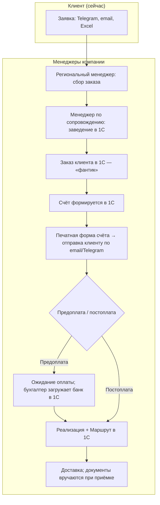

### 3.2 Ветвление по типу оплаты (сейчас — в 1С)

Соглашение в 1С задаёт этапы оплаты, способ (предоплата/постоплата), отсрочку. При предоплате реализацию в 1С не создают до поступления оплаты (бухгалтер разносит платежи из банка). При постоплате — реализация после оформления заказа.

### 3.3 To-be: целевой поток (с витриной и ЛК)

После запуска нового сайта клиент сможет оформлять заказ в корзине на витрине; заказ уйдёт в 1С; счёт будет доступен в ЛК и по email. Ниже — целевая схема (не текущее состояние).

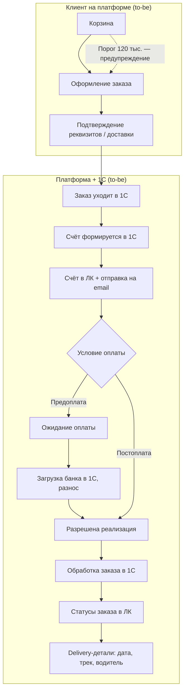

---

## 4. To-be: требования

### 4.1 Корзина и оформление

- Формирование заказа через каталог (вручную) и заказ через файл (объёмные поставки) — по Пониманию задачи.
- **Повторить заказ:** клиенту нужна возможность скопировать прошлый заказ в корзину одной кнопкой; **выбор заказа из списка** (не только последний).
- В корзине отображать предупреждение о пороге бесплатной доставки: `Доберите до N ₽ для бесплатной доставки` или аналог. Значение `N` для `MVP` задаётся как настройка платформы в админке; текущее рабочее значение — `120 тыс. руб.`. **Источник истины для порога в ЛК — платформа** (решение 2026-03-25; подробнее ЧТЗ 03).
- При оформлении — подтверждение контактного лица; **способ получения груза** (своя доставка / ТК / **самовывоз** — см. ЧТЗ 03 §4.7); при доставке до адреса — выбор из **сохранённых** адресов или ввод **нового** через подсказки **DaData** (см. п. 4.1.2); способ оплаты и условия из соглашения в 1С (только отображение, изменение — через менеджера/договор).
- **Персональная номенклатура (один контрагент, из 1С):** в корзину нельзя добавить позицию, если из 1С привязан **другой** `GUID` контрагента, чем у текущей B2B-сессии; API возвращает отказ (см. `PUT /cart/items/{productId}` в `openapi_client_mvp.yaml`). Сценарий «вставить артикул/ссылку вручную» не должен обходить проверку.
- **Сроки производства при отсутствии товара:** в корзине/оформлении показывать примерную дату поступления на склад (из 1С), например «ожидаемая дата поступления на склад» — по уточнению с клиентом.

#### 4.1.1 Заказ через файл (Excel/CSV) — место в процессе

**Смысл сценария:** загрузка файла — это **альтернативный способ сформировать корзину** для объёмных поставок. Он относится к этапу **«Корзина и оформление»** и выполняется **до** отправки заказа в `1С`.

**Поток (to-be):**

- Клиент скачивает шаблон/прайс-лист (если предусмотрено).
- Загружает файл (`Excel`/`CSV`) со списком позиций и количеством.
- Платформа валидирует строки по каталогу (коды/артикулы, доступность к заказу, кратность/минимумы — по правилам, если будут).
- Валидные позиции добавляются в корзину; проблемные строки показываются отдельным списком ошибок.
- Далее оформление заказа проходит **обычным** путём: корзина → оформление → заказ уходит в `1С`.

**Статус для MVP:** функция признана полезной (интервью 2026-03-17), но **не критична для MVP** — планировать как **post-MVP**. Вопросы по формату файла и валидации фиксируются отдельно (см. реестр вопросов).

#### 4.1.2 Адрес доставки: ввод через DaData (решение 2026-06-02)

**Решение:** для способов **доставка Palizh** и **ТК** адрес вводится на **фронтенде** через сервис **[DaData](https://dadata.ru/)** (подсказки по адресу): одно поле ввода, пользователь выбирает вариант из выпадающего списка. **Свободный текст без выбора подсказки не допускается.**

| Этап | Поведение |
|------|-----------|
| UI (оформление заказа, раздел ЛК «Адреса доставки») | Поле «Адрес доставки» + виджет DaData Suggest (`suggest/address`); отображение в списке — `value`, после выбора в поле — каноническая строка (см. ниже) |
| Отправка на бэкенд | `deliveryAddress` — **отформатированная однострочная строка** из ответа DaData: поле **`unrestricted_value`** (полный адрес с индексом); опционально `deliveryAddressFiasId` — `data.fias_id` выбранной подсказки (для проверки на бэке и дедупликации в списке сохранённых) |
| Бэкенд | Принимает и сохраняет строку; при наличии `deliveryAddressFiasId` — проверяет формат UUID; **повторный вызов DaData на бэке для MVP не обязателен** |
| Передача в 1С | В составе заказа — **`deliveryAddress`** одной строкой (тот же канон, что хранится на платформе); см. ЧТЗ 09 §4.8 |
| Самовывоз | Поле адреса клиента **не показывается**; в заказ уходит адрес склада (ЧТЗ 03 §4.7) |

**Не путать:** юридический адрес компании в профиле — из **1С**; DaData используется только для **адресов доставки** груза.

**Сохранённые адреса:** при добавлении нового адреса на оформлении или в ЛК в список попадают `deliveryAddress` + `deliveryAddressFiasId` (если есть). Выбор сохранённого адреса на оформлении **не требует** повторного вызова DaData.

**Секреты:** API-ключ DaData для подсказок — на **фронтенде**, токен с ограничением по домену (рекомендация DaData); не коммитить в репозиторий, хранить в конфигурации окружения фронта.

### 4.2 Интеграция с 1С

- Отправка заказа в 1С: состав (позиции, количество), контрагент, **способ получения груза**, адрес (**доставки** или **склада при самовывозе** — г. Ижевск, ул. Салютовская, 31), контакт, согласованные правила порога из админки платформы. Обработка в 1С: создание документа «Заказ клиента», при необходимости — резервирование (регламент срока резерва — уточнить). См. ЧТЗ 03.
- Получение из 1С: факт формирования счёта, наличие счёта для скачивания/просмотра в ЛК, верхнеуровневый статус заказа и детали доставки.
- При предоплате: реализация в 1С создаётся только после поступления оплаты (данные из банка); платформа не создаёт реализацию — это делает 1С/менеджер по правилам соглашения.
- Для исключения дублей при повторной отправке заказов с платформы требуется внешний идентификатор заказа и согласованный сценарий идемпотентности на стороне 1С (см. ЧТЗ 09, раздел «Идентификаторы и связывание сущностей»).

Верхнеуровневая модель статусов для заказа:

- `Обрабатывается`
- `В производство / производится`
- `Готов к сборке`
- `Готов к отгрузке`
- `Отправлен`
- `Завершён`

События доставки (`маршрут`, `задание на перевозку`, `трек-номер`, `контакты водителя`) не образуют отдельную вторую шкалу, а отображаются как детали внутри заказа.

#### 4.2.1 Состояние синхронизации заказа с 1С (отдельно от 6 статусов)

- `OrderStatus` в ЛК остаётся шкалой из 6 бизнес-статусов, которые приходят из маппинга событий 1С.
- Технический контур обмена (заказ принят платформой, но ещё не подтверждён в 1С; ошибка доставки в 1С; ручная обработка) фиксируется отдельным полем `integrationSyncState` (`pending` / `synced` / `failed` / `manual_review_required`).
- Пока заказ не подтверждён в 1С, `oneCOrderGuid` может быть `null`; ответ `201` на создание заказа означает, что заказ принят платформой, а не обязательно уже создан в 1С.
- При `failed` или `manual_review_required` для клиента показывается отдельное пояснение/баннер; для команды действует операционный контур уведомлений и обработки (см. ЧТЗ 09, 10, 12).

#### 4.2.2 Отмена заказа клиентом в MVP

- В `MVP` отмена заказа клиентом через API/ЛК не входит в scope.
- После оформления отмена/изменение заказа выполняется вне платформы (менеджер + 1С), до отдельного решения post-MVP.

#### 4.2.3 Цены в корзине и карточке товара (решения из интервью 2026-03-04)

- **Цены в ЛК показываем** — решение подтверждено. **Правила отображения по зонам (листинг, карточка, корзина)** — **ЧТЗ 06 §4.2.4** (2026-06-27). **Частично открыто (№30):** финальная визуальная иерархия двух строк цен на макете.
- **Двойные цены (кратность упаковке):**
  - В прайсах клиенту показывают цену за **коробку** и за **штуку**; при заказе не кратно упаковке в строке корзины **смешанный** расчёт (целые коробки по `amountPerBox`, остаток по `amount`).
  - Данные о кратности (количество в коробке/палете) приходят из `1С` — поле **`unitsPerBox`** (`НаборУпаковок`).
  - В корзине/карточке товара при смене количества — подсказка кратности и пересчёт по **§4.2.4**, отображение — **ЧТЗ 06 §4.2.4**.
- **Персональная скидка:** процент из соглашения/контрагента 1С применяется к **розничным** `amount` и `amountPerBox` (`discountedAmount` / `discountedAmountPerBox`); **не** к опту (`WHOLESALE`) и **не** к отдельному виду цены `BOX` в `sync.prices` (ЧТЗ 06 §4.2.3).
- **Заказ через файл (Excel):** функция признана полезной (загрузка Excel с номенклатурой и количеством в корзину), но **для MVP не критична** (интервью 2026-03-17). Заложить как post-MVP.

#### 4.2.4 Расчёт строки корзины и итоговой стоимости заказа (MVP, 2026-06-02)

**Назначение:** зафиксировать, **как из количества и цен 1С получаются `unitPrice`, `lineTotal` и итог заказа** на платформе до выставления счёта в 1С.

#### Источники данных (1С → платформа)

| Данные | Событие / поле | Назначение |
|--------|----------------|------------|
| Кратность упаковки | `sync.products.unitsPerBox` | «В коробке N шт.»; порог кратности |
| Цены по позиции | `sync.prices` (`priceTypeCode`, `amount`, …) | Базовые виды цен |
| Цены для UI каталога | `ProductPrice` в `public-http-openapi.yaml`: `amount`, `amountPerBox`, `discountedAmount`, `discountedAmountPerBox`, `priceTypeCode` | Отображение; опора для расчёта корзины |
| Вид цены соглашения | Контрагент / соглашение | Какой `priceTypeCode` основной (`RETAIL`, `WHOLESALE`, …) |
| Скидка контрагента | % из 1С | К **рознице** → на `amount` и `amountPerBox` (`discountedAmount*`); **не** к опту и **не** к виду цены `BOX` в `sync.prices` |

Семантика полей в обмене 1С → платформа (**зафиксировано 2026-06-02**):

| Поле | Смысл |
|------|--------|
| **`amount`** | Цена **за штуку** (розничная / «обычная» за ед. заказа) |
| **`amountPerBox`** | Цена **за коробку целиком** (льготная при заказе полной упаковки) |
| **`discountedAmount`** | `amount` с учётом персональной скидки на розницу (если есть) |
| **`discountedAmountPerBox`** | `amountPerBox` с персональной скидкой на розницу (если % > 0) |

Семантика **`BOX` / `priceTypeCode`:** см. реестр №55–56; для расчёта корзины опираемся на **`amount`** и **`amountPerBox`** в контексте соглашения клиента.

#### Определение режима кратности (для строки корзины)

Для позиции с `unitsPerBox > 1` backend выделяет в строке:

| Величина | Формула |
|----------|---------|
| `fullBoxesCount` | `floor(quantity / unitsPerBox)` — число **полных** упаковок |
| `remainderQuantity` | `quantity − fullBoxesCount × unitsPerBox` — штуки **сверх** целых упаковок |

| Условие | Режим | `packagingMode` |
|---------|--------|-----------------|
| `remainderQuantity = 0` и `quantity > 0` | Всё кратно упаковке | `multiple` |
| `fullBoxesCount > 0` и `remainderQuantity > 0` | **Смешанно** (коробки + штуки) | `mixed` |
| `fullBoxesCount = 0` и `quantity > 0` | Только штуки, без полной упаковки | `non_multiple` |

Если `unitsPerBox` отсутствует или `≤ 1` — кратность **не применяется** (`packagingMode: not_applicable`; `fullBoxesCount = 0`, `remainderQuantity = quantity`).

**Пример:** `unitsPerBox = 15`, `quantity = 20` → `fullBoxesCount = 1`, `remainderQuantity = 5` → режим **`mixed`**: 15 шт по цене коробки, 5 шт по цене за штуку.

#### Расчёт строки (**вариант A** — **принято**, 2026-06-02)

**Модель:** backend платформы пересчитывает `lineTotal` при изменении `quantity` **локально**, по синхронизированным ценам 1С (`sync.prices` → `ProductPrice`). **Online-пересчёт в 1С** (вариант B) и **явные поля `unitPriceMultiple` / `unitPriceNonMultiple` в выгрузке** (вариант C) — **не в MVP**.

**Цены для формулы** (из `ProductPrice` / соглашения):

| Компонент строки | Источник |
|------------------|----------|
| Полные упаковки | `pricePerBox` = `discountedAmountPerBox` при персональном % на рознице; иначе `amountPerBox` |
| Остаток штук | `pricePerPiece` = `discountedAmount` при персональном % на рознице; иначе `amount` |

Если 1С отдаёт готовые `discountedAmount*`, backend **использует их**; иначе применяет % из соглашения к `amount` / `amountPerBox`.

**Формула `lineTotal` (округление — см. ниже):**

```
boxPart   = round(fullBoxesCount × pricePerBox, 2)
piecePart = round(remainderQuantity × pricePerPiece, 2)
lineTotal = round(boxPart + piecePart, 2)
```

**`unitPrice` в `CartItem`** — **средняя** цена за единицу для отображения в UI (**не** источник пересчёта):

```
unitPrice = round(lineTotal / quantity, 2)   (при quantity > 0)
```

`quantity × unitPrice` может отличаться от `lineTotal` на **1 коп.** — в UI и итогах **авторитетен `lineTotal`**.

#### Округление денежных сумм (**принято 2026-06-02**)

| Правило | Значение |
|---------|----------|
| Валюта | **RUB**, **2** знака после запятой |
| Режим | Математическое округление (**0,5 → вверх**) |
| Цены из 1С | `amount`, `amountPerBox` — как в выгрузке (2 знака) |
| Строка корзины | `boxPart`, `piecePart`, `lineTotal` — по формуле выше |
| Итог корзины | `subtotal` = Σ `lineTotal`; `total` — с НДС, 2 знака |
| Сверка с 1С | При расхождении со счётом на интеграционных тестах — **подстройка под 1С**; чек-лист — [`Приёмка_корзины_vs_счёт_1С.md`](../Техническая%20часть/Приёмка_корзины_vs_счёт_1С.md) |

Фронт **не** пересчитывает; для расшифровки «коробка + остаток» — поля `fullBoxesCount`, `remainderQuantity`, `referenceUnitPricePerBox`, `referenceUnitPricePerPiece` (см. ниже).

**Справочные поля в ответе корзины (для UI и подсказок):**

| Поле | Смысл |
|------|--------|
| `packagingMode` | `multiple` / `mixed` / `non_multiple` / `not_applicable` |
| `unitsPerBox` | из товара |
| `fullBoxesCount` | целые упаковки в строке |
| `remainderQuantity` | штуки вне полных упаковок |
| `referenceUnitPricePerBox` | `pricePerBox` (за коробку) |
| `referenceUnitPricePerPiece` | `pricePerPiece` (за штуку) |
| `referenceUnitPriceMultiple` | опционально: `pricePerBox / unitsPerBox` — «эффективная» цена шт при полной упаковке |
| `referenceUnitPriceNonMultiple` | опционально: синоним `referenceUnitPricePerPiece` для подсказки |

**Предупреждения (`warnings`):** при `packagingMode` = `mixed` или `non_multiple` и `unitsPerBox > 1` — неблокирующее сообщение (код, например `packaging_partial_boxes`): часть количества по цене за штуку, не по коробке.

#### Итог по корзине и заказу

| Поле | Формула / смысл |
|------|-----------------|
| `CartTotals.subtotal` | Σ `lineTotal` по всем строкам |
| `CartTotals.discountTotal` | Опционально: агрегированная скидка по строкам, если backend выделяет отдельно |
| `CartTotals.vatAmount` | НДС, включённый в итог (правила как в 1С / примерах заказов) |
| `CartTotals.total` | **Итог к оплате** на шаге корзины/оформления (с НДС) |
| `CartTotals.itemsCount` | Число уникальных позиций (строк) |

**Доставка:** стоимость доставки **не входит** в `CartTotals.total` на MVP (порог 120 тыс. — только `deliveryHint`, ЧТЗ 03).

**После `POST /orders`:** сумма в шапке заказа на платформе = итог на момент оформления; **юридически значимый счёт** и финальная сумма — из **1С** после обработки заказа (ЧТЗ 01 §4.3). При расхождении платформа vs счёт 1С — ориентир для клиента **счёт 1С**.

#### Граница ответственности

| Действие | Кто |
|----------|-----|
| Хранение `unitsPerBox`, видов цен, скидки % | 1С → `sync.*` |
| Пересчёт `unitPrice` / `lineTotal` при изменении `quantity` | **Backend платформы** по правилам §4.2.4 (**вариант A**) |
| Отображение в UI | Фронт — только поля ответа API |
| Счёт, НДС в документе, финальная сумма к оплате | 1С |

#### Отклонённые альтернативы (не MVP)

| Вариант | Суть | Статус |
|---------|------|--------|
| **B** | Online-пересчёт строки в 1С при каждом `PUT /cart/items` | **Не MVP** (нагрузка, задержки) |
| **C** | Явные `unitPriceMultiple` / `unitPriceNonMultiple` в `sync.prices` | **Не MVP** (доработка выгрузки); при интеграционных тестах сверять расчёт варианта A с печатной формой заказа/счёта 1С |

### 4.3 Счёт и оплата

- Счёт формируется в 1С (в т.ч. после согласования с ПЭО при отсутствии индивидуального соглашения). Печатная форма счёта должна быть доступна в ЛК и отправляться на email клиенту. При **самовывозе** в коммуникации со счётом — ориентир «забрать на следующий день» (as-is, ЧТЗ 03 §3.3).
- Отображение в ЛК: сумма к оплате, срок оплаты (при постоплате — дата по соглашению), статус оплаты (не оплачен / частично / оплачен).
- Оплата — банковским переводом по счёту; привязка платежа к заказу — в 1С (загрузка клиент-банка, разнос). Платформа показывает статус на основании данных из 1С.

### 4.4 Реализация, отгрузка и delivery-детали

- Создание документа `Реализация`, `Маршрут` и связанных delivery-сущностей выполняется в 1С (менеджер по сопровождению или автоматически по правилам 1С).
- Платформа отображает не внутреннюю цепочку документов 1С как отдельные клиентские статусы, а согласованный набор из 6 верхнеуровневых статусов заказа (см. ЧТЗ 08 и 09).
- Когда заказ переходит в статус `Отправлен`, в карточке заказа показываются delivery-детали из 1С:
  - ориентировочная дата / слот доставки;
  - способ получения груза (**доставка** / **ТК** / **самовывоз** + **адрес пункта выдачи** при самовывозе);
  - трек-номер ТК и ссылка на отслеживание;
  - контакты водителя для своей доставки;
  - иные значимые события, если они согласованы для отображения клиенту.

### 4.5 Нестандартные заявки (to-be)

**Смысл «нестандартной заявки» (MVP):** запрос, который **нельзя закрыть типовым заказом из каталога** (добрать позиции в корзину и оформить). Примеры: необычный / составной заказ вне стандартной номенклатуры на сайте, **оборудование, которого нет в каталоге**, **колеровка специальной партии**, нестандартная упаковка, иные индивидуальные условия. **Обучение** — отдельный контур (ЧТЗ 14).

**Отличие от раздела «Обращения и претензии» в ЛК:** обращения и претензии относятся к **уже существующему заказу** (общее обращение по заказу, претензия с типами по ЧТЗ 04). Нестандартная заявка — **отдельный пункт меню** и отдельный тип маршрутизации email в админке; это не замена претензии и не форма «просто написать менеджеру» про произвольную тему без связи с заказом там, где по продукту требуется контекст заказа.

На платформе клиент только **инициирует** нестандартный запрос; **детали, согласование условий и КП** — **вне платформы** (звонок, почта, переписка, 1С — по внутреннему процессу компании).

**Каналы для клиента (MVP):**

1. **Форма в ЛК** «Нестандартная заявка» / «Связь с менеджером» — поле **свободного текста обязательно** (минимум один непустой текст запроса); **вложения опциональны** (PDF, Excel, Word и т.д., лимиты — в UX/техконтракте). Отправка **только файлами без текста** не допускается. **Обязательного** выбора типа заявки (колеровка / оборудование и т.п.) **в MVP нет** — в интерфейсе **текстом** можно перечислить примеры тем; **необязательный выбор типа и расширенная шкала статусов в ЛК** (как обсуждалось в интервью 2026-03-02) — **post-MVP**, если будет отдельное решение. Точка входа в навигации ЛК обязательна (см. Инфарх, `uscases/потоки_для_дизайна/поток_07_нестандартная_заявка.md`). Опционально — ссылки из футера / контекста на ту же форму.
2. **Чат-виджет стороннего сервиса** — для оперативных вопросов; маршрутизация и **уведомления операторам/клиенту в чате** — на стороне **поставщика виджета**, не платформы Palizh. Для заявки **с вложениями** или развёрнутого описания форма ЛК предпочтительнее.

**Платформа → операционный контур (MVP):**

- По отправке формы — **внутреннее уведомление по email** адресатам, заданным в админке для типа **«нестандартные заявки / обращение к менеджеру»** (ЧТЗ 12, 10).
- **Клиенту** — **email подтверждения** о том, что заявка принята к рассмотрению, по **настраиваемому шаблону** в админке (ЧТЗ 10, 12). Тикет-системы и переписки в админке нет.
- Передача в **1С** по API в MVP **не обязательна**; менеджер по результатам общения с клиентом ведёт учёт в 1С и прочих системах вручную.

**История и статусы в ЛК (MVP):**

- **История отправленных нестандартных заявок** в ЛК **обязательна** (список записей с датой и кратким признаком; открытие карточки/детали — по UX), аналогично по смыслу истории заявок на обучение.
- У каждой записи в MVP один клиентский статус **`Отправлено`** без последующих обновлений с платформы (дальнейшее ведение — вне ЛК).

**As-is:** заявки приходят по телефону, почте, мессенджеру; объём порядка 8 в месяц на всех менеджеров; ведёт в основном региональный менеджер, менеджер по сопровождению может завести заказ и передать на производство.

### 4.6 К решению после отдельного созвона (демо прототипов, 2026-04-15)

*Вводные с демо; **не изменяют** зафиксированные решения выше (в т.ч. п. 4.2.2 про отмену заказа в `MVP`, модель персональной скидки в п. 4.2.1) до отдельного решения заказчика.*

- **Корзина и цены:** у части контрагентов по соглашению действует **наценка**, а не скидка — в UI **не акцентировать** формулировку «скидка» так, чтобы она противоречила факту; на демо обсуждался приоритет отображения **двух цен** (кратно / некратно упаковке) из данных 1С; **расчёт строки корзины** — backend по **§4.2.4 (вариант A)**.
- **Бонусы:** не показывать в корзине **начисление бонусов «с этого заказа»** (бонусы по практике Palizh — период/объём; отдельный раздел ЛК — позже). Текущие ЧТЗ 07 и 09 про баланс бонусов в `MVP` **не пересматриваются** в этом пункте.
- **Отмена заказа клиентом:** на демо прототипов обсуждалась отмена из ЛК **до** перевода заказа дальше стадии «обрабатывается» / до взятия в работу менеджером. С **текущей** формулировкой п. 4.2.2 («в `MVP` отмена через ЛК не входит в scope») это **согласовать отдельно** и при согласии — синхронизировать ЧТЗ 01, 08 и API.

---

## 5. Открытые вопросы

- ~~Регламентный срок резервирования под заказ~~ — зафиксировано: резервирование на стороне 1С; платформа передаёт заказ, далее обработка менеджером в 1С.
- ~~**№57 — модель расчёта корзины:** вариант **A** (расчёт на платформе из `sync.prices`) — **принято 2026-06-02**.~~
- ~~**№57 — семантика полей:** `amount` = цена за штуку, `amountPerBox` = цена за коробку; смешанная строка — **принято 2026-06-02**.~~
- ~~**№57 — скидка:** персональный % на розницу → `amount` и `amountPerBox`; не на опт и не на вид `BOX` — **принято 2026-06-02**.~~
- ~~**№57 — округление:** RUB, 2 знака, round half up; `lineTotal` авторитетен для строки — **принято 2026-06-02**.~~

---

## 6. Связь с другими ЧТЗ

| Блок | Связь |
|------|--------|
| Документооборот | Счёт, УПД, печатные формы — см. ЧТЗ 02 |
| Доставка | Порог 120 тыс., правила доставки и delivery-детали внутри заказа; отдельной второй шкалы статусов нет — см. ЧТЗ 03 |
| Регистрация и онбординг | Только авторизованный клиент с договором может оформить заказ — см. ЧТЗ 05 |
| ЛК — заказы и статусы | Шесть статусов заказа из 1С — см. ЧТЗ 08; нестандартная заявка в MVP — отдельно от заказа, история в ЛК, статус `Отправлено` (см. §4.5) |
| Претензии и обращения по заказу | Раздел ЛК «Обращения и претензии» — см. ЧТЗ 04; не путать с нестандартной заявкой (§4.5) |
| Интеграция с 1С | Создание заказа клиента, счёт, статусы, правила идемпотентности обмена — см. ЧТЗ 09 |
| Саммари интервью | [2026-03-04 цены/кратность](../Интервью%20и%20встречи/Саммари/2026-03-04_доставка_бонусы_цены_уведомления_поиск_саммари.md), [2026-03-17 заказ из файла](../Интервью%20и%20встречи/Саммари/2026-03-17_претензии_саммари.md) |


---

<!-- notebooklm-source: ЧТЗ/02_документооборот.md -->

# ЧТЗ: Документооборот

**Статус:** актуально
**Источники:** Понимание задачи, саммари интервью 2026-02-24 (процесс заказа JTBD), 2026-03-02 (документы, роли, нестандартный заказ), 2026-03-13 (1С обмен данными), 2026-03-17 (претензии), [демо прототипов 2026-04-15](../Интервью%20и%20встречи/Саммари/2026-04-15_демо_прототипов_саммари.md) (п. 4.8 — вопросы к созвону), ЧТЗ 09 (интеграция с 1С), ЧТЗ 14 (обучение), рабочий контракт [document_delivery_contract.md](../Техническая%20часть/document_delivery_contract.md).  
**As-is / To-be:** as-is — как есть сейчас, **без** ЛК (счёт и документы — по email, при приёмке; акт сверки по запросу менеджеру). to-be — с новым сайтом и ЛК (раздел 4 и целевая схема ниже).

---

## 1. Назначение

Описывает состав документов в рамках заказа, после него и в связанных сценариях исполнения претензий; способы их формирования (`1С`), выдачи клиенту (ЛК, email, в перспективе ЭДО) и запросов со стороны клиента. Цель — обеспечить клиенту доступ к счетам, накладным, актам сверки, сертификатам качества и документам исполнения по претензии без ожидания менеджера. Ниже (п. 4.0) — **сводная матрица**: какие документы привязаны к заказу/отгрузке, какие — к контрагенту, договору или номенклатуре, и в каких разделах ЛК они показываются.

---

## 2. Термины (общие)

| Термин | Описание |
|--------|----------|
| УПД | Универсальный передаточный документ; обязателен при отгрузке, остаётся у клиента и водителя |
| ТТН | Товарно-транспортная накладная; по запросу клиента |
| Паспорт качества | На партию продукции; формируется в 1С, с печатью/подписью (факсимиле); по запросу или признаку клиента |
| ЭДО | Электронный документооборот; на старте не используется массово; в перспективе — счета, акты сверки (Контур) |
| Акты сверки | Запрашиваются клиентом; формирует менеджер по сопровождению; ожидание формирования — боль клиента (выходной, очередь) |
| TDS | *Technical Data Sheet* — лист технических данных по номенклатуре (свойства, применение, условия использования); в РФ часто отдельно от «паспорта качества» на партию |
| MSDS / SDS | *Material Safety Data Sheet* / *Safety Data Sheet* — сведения по безопасности материала; близко к «паспорту безопасности» в отраслевой практике |

---

## 3. As-is: выдача документов сейчас (без ЛК)

ЛК и витрины пока нет. Счёт формируется в 1С, печатную форму менеджер отправляет клиенту по email (или в тот же канал — Telegram). При отгрузке УПД/ТТН/паспорт качества вручаются при приёмке; акт сверки — по запросу клиента, формирует менеджер в 1С, отправляет по email. Ожидание формирования акта — боль клиента (очередь, выходной).

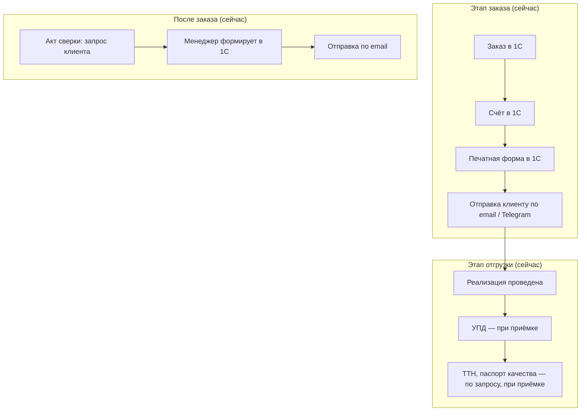

### 3.1 To-be: целевой процесс с ЛК

В ЛК клиенту будут доступны счёт, УПД, ТТН, паспорт качества (просмотр/скачивание); запрос акта сверки из ЛК. Для претензий хронология документов должна сохраняться как последовательность связанных сущностей: исходная отгрузка / исходный заказ, сама претензия, документы исполнения по претензии (`новая реализация`, `новая отгрузка`, `УКД`, возврат / корректировка). Исходный документ не заменяется и не перезаписывается.

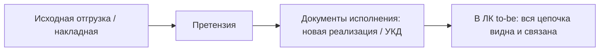

---

## 4. To-be: требования

### 4.0 Перечень документов в ЛК: привязка к сущностям и разделам интерфейса

Для проектирования навигации и интеграции с `1С` документы удобно делить на уровни: **заказ / отгрузка / партия**, **компания / договор**, **номенклатура (товар, SKU)**, **заявки** (претензия, обучение). Источником печатных форм для автоматизированного контура `MVP` считается **`1С`**, если не указано иное.

#### 4.0.1 Тип привязки: «товар» (номенклатура) и «заказ» (сделка, партия)

| Тип | Что означает | Примеры |
| --- | ------------- | ------- |
| **К заказу / отгрузке** | Документ относится к **конкретной сделке** или **отгрузке** в `1С` | Счёт, УПД, ТТН |
| **К партии (внутри заказа)** | Документ завязан на **партию продукции** по конкретной отгрузке; не является «общим листом» на всю номенклатуру | Паспорт качества из `1С` на партию |
| **К номенклатуре (товару)** | Документ **одинаков для SKU** независимо от того, в каком заказе товар покупали; привязка к `nomenclatureGuid` / артикулу в `1С` | TDS, MSDS/SDS, СГР, файловый паспорт безопасности на товар, каталог линейки (если так заведено) |
| **К компании / договору** | Не к одному заказу | Акт сверки, договор, ДС |
| **К заявке на платформе** | Создано в ЛК, не печатная форма `1С` | Вложения претензии, запись «Заявка на обучение» |

**Важно не смешивать:** «паспорт качества» в контексте отгрузки (партия, `1С`) и «техническая/регуляторная документация на товар» (TDS, СГР и т.д.) — разные сущности; в таблице ниже указано отдельно.

#### 4.0.2 Где отображаем: карточка товара, карточка заказа, раздел «Документы»

| Место в интерфейсе | Назначение в MVP | Номенклатурные документы (TDS, СГР, …) |
| ------------------ | ---------------- | -------------------------------------- |
| **Карточка заказа** (ЛК) | Основная точка входа к **счёту, УПД, ТТН, паспорту качества на партию** | Опционально **post-MVP / развитие:** список файлов по **составу заказа** (подтянуть из `1С` по строкам номенклатуры) — см. [document_delivery_contract.md](../Техническая%20часть/document_delivery_contract.md) |
| **Раздел «Документы»** (ЛК) | Общий доступ к **актам сверки**, **договорам**, **библиотеке файлов по номенклатуре** (если в `1С`) | **MVP:** основной экран для **товарных** PDF/файлов из `1С` (фильтр, поиск, привязка к SKU — по проектированию UI) |
| **Профиль компании** (ЛК) | Реквизиты; при согласовании макетов — **договор** рядом с условиями | Договор/ДС, если UX решит вынести сюда из «Документов» |
| **Карточка товара** (витрина / каталог) | Описание, цены для B2B, остатки (ЧТЗ 06) | **MVP:** **не обязательна** выдача TDS/СГР/паспортов с карточки; каталоговый API ([openapi_mvp_catalog_product.md](../Техническая%20часть/openapi_mvp_catalog_product.md)) на старте **может не включать** файлы документооборота. **Развитие:** блок «Документы» / ссылки на скачивание для **авторизованного** B2B-клиента (гостю — только если отдельно согласуют с маркетингом и комплаенс) |
| **Обращения и претензии** | Вложения клиента, статусы | Не номенклатурный контур `1С` |

**Как получают номенклатурные файлы в MVP:** метаданные и бинарный файл (или временная ссылка) из **`1С`** по согласованному API (ЧТЗ 09); режим `online` / предзагрузка (`prefetch`) — [document_delivery_contract.md](../Техническая%20часть/document_delivery_contract.md). Если файла нет в `1С` — выдача **вне автоматизированного ЛК** (менеджер), см. п. 4.4.

#### 4.0.3 Сводная таблица документов

| Документ или материал | Привязка в учёте | Товар / заказ / иное | Где отображаем (MVP) | Как получаем |
| --------------------- | ---------------- | -------------------- | -------------------- | ------------ |
| Счёт на оплату | Заказ | **Заказ** | ЛК: **карточка заказа**; дубль в уведомлениях/email | `1С` после оформления/обработки заказа; интеграция ЧТЗ 09 |
| УПД | Реализация / отгрузка | **Заказ / отгрузка** | ЛК: **карточка заказа** | Запрос ЛК → `1С`; файл на платформе постоянно не храним (п. 4.2) |
| ТТН | Отгрузка (если есть документ) | **Заказ / отгрузка** | ЛК: **карточка заказа** | `1С`, по запросу или сразу при наличии |
| Паспорт качества (на партию) | Партия / отгрузка | **Партия → в UI через заказ** | ЛК: **карточка заказа** | Печатная форма `1С`; не путать с TDS на SKU |
| Акт сверки | Контрагент + период | **Компания (не заказ)** | ЛК: **«Документы»** | Запрос из ЛК → формирование в `1С` (асинхронно); email при необходимости |
| Договор, допсоглашения, вложения | Договор | **Договор** | ЛК: **«Документы»** и/или **профиль компании** | Файлы из карточки договора `1С` (п. 4.5) |
| TDS | Номенклатура | **Товар (SKU)** | **MVP:** ЛК **«Документы»**; карточка товара — по согласованию, не обязательна | Загрузка/привязка в `1С`; API по `nomenclatureGuid` |
| MSDS / SDS | Номенклатура | **Товар (SKU)** | Как TDS | Как TDS |
| Паспорт безопасности (файл на SKU) | Номенклатура | **Товар (SKU)** | Как TDS | Как TDS |
| СГР | Номенклатура | **Товар (SKU)** | Как TDS | Как TDS |
| Каталоги продукции, буклеты линеек | Номенклатурная группа / правила в `1С` | **Товар / линейка** | ЛК **«Документы»**, если заведено | `1С`; иначе вне контура |
| Прочие регламентные файлы на SKU (напр. декларации) | Номенклатура | **Товар (SKU)** | Как TDS, если заведены в `1С` | Решение о составе — с заказчиком (см. п. 5) |
| Вложения при подаче претензии | Претензия | **Заявка** | ЛК: **обращения / претензии** | Загрузка на платформу; не документ `1С` |
| УКД, возврат, новая реализация по итогам претензии | Заказ → претензия → исполнение | **Заказ** | To-be: **карточка заказа** / претензия | Автовыдача в ЛК — **post-MVP** ([document_delivery_contract.md](../Техническая%20часть/document_delivery_contract.md)) |
| Итоговое письмо по претензии | Претензия | **Заявка / процесс** | При согласовании | Источник и формат — открытый вопрос (п. 5) |
| Запись «Заявка на обучение» | Заявка платформы | **Иное** | ЛК: **заявки на обучение** | Данные формы на платформе; не `1С` в MVP |
| Сертификат о прохождении обучения | Событие обучения | **Иное** | **Post-MVP** | ЧТЗ 14; нужен контур подтверждения и файл |

#### 4.0.4 Претензии и обращения

| Вид | Привязка | MVP |
| --- | -------- | --- |
| Вложения при подаче претензии (фото, видео, файлы) | Заявка / претензия; в форме — заказ/накладная при необходимости | Хранение и поток на стороне платформы и бэкенда; не печатная форма `1С` |
| Документы исполнения (новая реализация, УКД, возврат, корректировка и т.д.) | Цепочка: исходный заказ/отгрузка → претензия → исполнение | Целевая to-be логика — п. 4.7; автоматизированная выдача из `1С` в ЛК — **post-MVP** по [document_delivery_contract.md](../Техническая%20часть/document_delivery_contract.md) |
| Итоговое письмо / заключение по претензии | Претензия | Открытый вопрос: показывать ли в ЛК и из какого контура (п. 5) |

#### 4.0.5 Обучение (не путать с паспортом качества)

| Артефакт | Привязка | MVP |
| -------- | -------- | --- |
| История заявок на обучение | Заявка на платформе | Запись в ЛК, статус «Отправлено»; не документ `1С` (ЧТЗ 14) |
| Сертификат о прохождении обучения | Событие обучения / курс | **Post-MVP**: нет заказного контура обучения на платформе и источника подтверждённого факта окончания в интеграции (ЧТЗ 14) |

#### 4.0.6 Сводка по разделам ЛК

| Раздел ЛК | Документы и материалы | Типичная привязка |
| --------- | --------------------- | ----------------- |
| История заказов / **карточка заказа** | Счёт, УПД, ТТН, паспорт качества на партию | Заказ / отгрузка / партия |
| **Документы** | Акт сверки; договор/ДС из `1С`; **товарные** файлы (TDS, MSDS, паспорт безопасности на SKU, СГР, каталоги и т.д.) | Компания / договор / **номенклатура** |
| Обращения и претензии | Вложения клиента; позже — документы исполнения из `1С` | Заявка; затем заказ |
| Заявки на обучение | Текст заявки, без сертификата в MVP | Заявка |

**Карточка товара (витрина):** в MVP **не** считается основным местом выдачи товарных PDF; при появлении блока документов — только после согласования с ЧТЗ 06 и правами доступа (B2B / гость). Детализация режимов выдачи (`online`, асинхронный запрос, кэш) — в [document_delivery_contract.md](../Техническая%20часть/document_delivery_contract.md).

### 4.1 Счёт на оплату

- Формирование в 1С (менеджер по сопровождению или автоматически по правилам). Печатная форма счёта: доступна в ЛК, отправка на email клиенту.
- В перспективе: генерация черновика счёта в ЭДО (Контур), отправка в ЭДО по согласованию.
- Рабочее допущение по транспортному формату файлов из `1С`: для MVP допустима передача файла как `base64` внутри `JSON` вместе с метаданными (имя, расширение / MIME-тип, размер). По текущим вводным ограничений по размеру не ожидается, документов **более 10 МБ не планируется**.

### 4.2 Документы отгрузки

- **УПД** — обязательный документ при приёмке груза; формируется в 1С при отгрузке (расходный ордер / отправка). **Решение по MVP (2026-03-25, вариант A):** после того как отгрузка отражена в 1С, в ЛК доступно **получение УПД** через **единый понятный сценарий** — действие клиента инициирует **запрос в 1С**, ответ — файл/поток для просмотра или скачивания; **файл УПД на платформе не храним** (как по интервью 2026-03-02). До факта отгрузки в 1С выдача УПД в ЛК недоступна.
- **ТТН** — по запросу; отдельный документ в 1С, печатная форма. В ЛК — возможность запросить ТТН по заказу, если он сформирован.
- **Паспорт качества** — на партию продукции; формируется в 1С. В ЛК: кнопка «Получить паспорта качества» по заказу/отгрузке; по признаку клиента можно автоматически включать паспорта в пакет отгрузочных документов (уточнить с заказчиком).

### 4.3 Акты сверки

- Клиент может запросить акт сверки из ЛК. Заявка уходит менеджеру по сопровождению; формирование в 1С, отправка клиенту (email или ЭДО). Подписание в ЭДО — бухгалтер. **История запросов/формирования актов в ЛК не ведётся** — достаточно хранения самих документов и возможности их скачать (решение по итогам интервью 2026-03-02).
- Для документов, которые формируются по запросу, нужно согласовать технический сценарий интеграции: платформа инициирует запрос в 1С по API, получает готовый файл/ссылку или статус отложенного формирования.

### 4.4 Сертификаты и техническая документация

- **Где в UI и товар vs заказ:** сводно — п. **4.0.1–4.0.3** (паспорт качества на партию — у заказа; TDS/СГР и т.п. — у номенклатуры, в MVP прежде всего раздел «Документы» ЛК).

- Запрос и предоставление сертификатов и связанной документации по оплаченному заказу — по Пониманию задачи:
  - **Паспорт качества** — формируется в 1С; логика запроса/выдачи описана выше.
  - **Паспорт безопасности**, **TDS (лист технических данных) / MSDS**, **СГР (Свидетельство о госрегистрации)**:
    - создаются/поддерживаются маркетингом и профильными подразделениями;
    - сейчас могут храниться вне 1С и рассылаться менеджерами адресно, только подтверждённым/реальным B2B‑клиентам;
    - **to-be:** если эти документы должны быть доступны клиенту в ЛК, они должны быть **предварительно загружены/связаны в 1С** и уже оттуда выдаваться на платформу;
    - если документ не загружен в 1С, он не считается частью автоматизированного контура ЛК и остаётся в ручной выдаче менеджером.

### 4.5 Договоры и допсоглашения (из 1С)

- По итогам интервью 2026-03-13: в 1С к карточке **договора** можно **прикреплять файлы** (сам договор, дополнительные соглашения, иные вложения).
- Платформа получает файлы договора напрямую из 1С — нет отдельного файлового хранилища вне 1С.
- Транспортный формат: JSON + `base64` + метаданные (имя, расширение / MIME-тип, размер) — аналогично остальным документам.
- В ЛК клиенту доступны: действующий договор, допсоглашения, история изменений (если нужно — уточнить scope для MVP).

### 4.6 ЭДО (перспектива)

- Понимание задачи: ЭДО (Контур) — заведение черновиков, счета и акты сверки в одностороннем режиме.
- **«Честный знак»** (саммари 2026-03-13): продукты Palizh (шпатлёвка) уже подпадают под «Честный знак»; передача УПД должна идти через ЭДО. К 2027–2028 годам по остальным ЛКМ требования усилятся → фактически **все контрагенты будут вынуждены перейти к ЭДО**.
- Текущее состояние: ~50/50 клиентов работают по ЭДО; менеджер по сопровождению регулярно подключает клиентов к ЭДО (раз в 1–2 месяца срезы).
- В ЧТЗ заложить возможность подключения ЭДО без переработки базового потока документов; оценить интеграцию платформы с ЭДО как задел, но не делать «в лоб» в MVP.

### 4.7 Документы и хронология при претензии

- В документообороте по претензии нужно различать:
  - **документы подачи претензии**: форма на платформе, вложения клиента (`фото`, `видео`, при необходимости документы);
  - **внутренние документы процесса**: служебная записка, материалы и итоговое письмо во внутреннем контуре `Mass Project`;
  - **клиентские документы исполнения**: новые реализации / новые отгрузки, `УКД`, возвраты, корректировки и иные документы, которые подтверждены в `1С`.
- Для ЛК и автоматизированной выдачи действует правило:
  - документы внутреннего разбора из `Mass Project` не считаются автоматически доступными клиенту;
  - клиентский ЛК получает только те документы, которые подтверждены платформой и/или `1С`;
  - если итоговое письмо по претензии потребуется показывать в ЛК, для него нужно отдельно согласовать источник и способ выдачи.
- Типовые сценарии хронологии:
  - **недопоставка**: исходная отгрузка -> претензия -> новая реализация / новая отгрузка на недостающее количество;
  - **замена по качеству**: исходная отгрузка -> претензия -> `УКД` по исходной реализации + новая реализация / новая отгрузка;
  - **излишек**: исходная отгрузка -> претензия -> возврат / корректировка, при необходимости `УКД`;
  - **бой**: исходная отгрузка -> претензия -> `УКД` и/или новая реализация / новая отгрузка по принятому решению.
- В интерфейсе ЛК нужно показывать не абстрактную строку `претензия закрыта`, а понятную для клиента цепочку связанных документов и событий: что было изначально, какое решение принято и какие документы на исполнение уже выпущены.

### 4.8 К решению после отдельного созвона (демо прототипов, 2026-04-15)

*Ниже — вводные с демо; **текущие** формулировки раздела 4 (в т.ч. п. 4.3 про акт сверки и роль менеджера) **не отменяются** до отдельного согласования с Palizh и фиксации контракта с `1С`.*

- Уточнить целевой поток запроса **акта сверки** из ЛК: усилить сценарий **прямой инициации формирования в `1С`** (триггер/API), чтобы **минимизировать рутинную роль менеджера** как «почтового реле»; сохранить выдачу клиенту в ЛК и при необходимости email/ЭДО как сейчас задумано в to-be.
- Согласовать с бухгалтерией и `1С`: нужна ли клиенту **история запросов** актов сверки в ЛК (сейчас — не ведётся) при переходе на автоматический контур.

---

## 5. Открытые вопросы

- ~~Полный перечень документов для MVP~~ — по итогам интервью 2026-03-02 подтверждено: счёт, УПД, ТТН, паспорт качества, акт сверки.
- ~~В каком виде выдавать документы в ЛК~~ — для MVP выдача документов в ЛК (печатные формы/PDF); ЭДО вынесено в развитие.
- ~~Признак «клиенту нужны паспорта качества по умолчанию»~~ — решено хранить/учитывать на стороне 1С с передачей на платформу.
- Кто чаще инициирует запрос акта сверки — клиент или компания? Приоритет документов для перевода в ЭДО в рамках платформы.
- Какой режим выдачи документов использовать по каждому типу: online по запросу из 1С, хранение копии на платформе, ссылка на ЭДО или комбинация вариантов.
- ~~**Образцы документов для проектирования**~~ — файловые образцы по списку реестра (включая счёт, УПД, **ТТН**, паспорт качества, акт сверки) размещены в `Примеры документов/`; см. [Реестр документов для проектирования](../Интервью%20и%20встречи/Реестр_документов_для_проектирования.md). При смене печатных форм заказчика — обновить описание в данном ЧТЗ.
- **Доступ к TDS, паспортам безопасности и СГР:** какие из этих документов должны быть загружены в 1С для выдачи через ЛК, а какие остаются только в ручной выдаче менеджерами; как контролировать доступ (по договору, по роли, по типу клиента); нужен ли в **MVP** показ ссылок/файлов в **карточке товара** для авторизованного B2B и/или для гостя (ЧТЗ 06, маркетинг).
- Для претензий: нужно ли показывать в ЛК итоговое письмо / заключение по разбору претензии, или клиенту достаточно статуса и документов исполнения из `1С`.
- Формализовать точный контракт транспортного ответа по файлам из `1С`: имя файла, тип / MIME, размер, кодировка и признак, что файл может быть показан inline или только скачан.

---

## 6. Связь с другими ЧТЗ и артефактами

| Блок | Связь |
|------|--------|
| Витрина и каталог | Карточка товара: в MVP не обязана отдавать файлы документооборота; согласовать с п. 4.0.2 (ЧТЗ 06) |
| Процесс оформления заказа | Счёт формируется после заказа; доступ в ЛК — часть флоу заказа (ЧТЗ 01) |
| Доставка | УПД/ТТН вручаются при приёмке; статус «документы готовы» может влиять на уведомления (ЧТЗ 03) |
| Претензии | При претензии — форма подачи, вложения, документы исполнения (`новая реализация`, `новая отгрузка`, `УКД`, возврат / корректировка); хронология не заменяется (ЧТЗ 04) |
| Обучение | Сертификаты и «документ об окончании» не входят в MVP ЛК; заявки на обучение — без файла-сертификата из платформы (ЧТЗ 14) |
| Интеграция с 1С | Источник документов, API выдачи, формат печатных форм и запрос документов из ЛК (ЧТЗ 09) |
| Технический контракт выдачи | [document_delivery_contract.md](../Техническая%20часть/document_delivery_contract.md) — матрица MVP, связи сущностей и режимы выдачи |
| Реестр документов для проектирования | [Интервью и встречи / Реестр документов для проектирования](../Интервью%20и%20встречи/Реестр_документов_для_проектирования.md) — **файловые образцы** для выдачи в ЛК; контракт обмена с `1С` (JSON API) — ЧТЗ 09 |
| Саммари интервью | [2026-03-02 документы/роли](../Интервью%20и%20встречи/Саммари/2026-03-02_документы_роли_нестандартный_заказ_саммари.md), [2026-03-13 1С обмен](../Интервью%20и%20встречи/Саммари/2026-03-13_1С_обмен_данными_саммари.md) — договоры из 1С, ЭДО, base64, «Честный знак» |


---

<!-- notebooklm-source: ЧТЗ/03_доставка.md -->

# ЧТЗ: Доставка

**Статус:** актуально
**Источники:** Понимание задачи, саммари интервью 2026-02-24 (процесс заказа JTBD), 2026-03-04 (доставка, бонусы, цены), 2026-03-13 (1С обмен данными), [демо прототипов 2026-04-15](../Интервью%20и%20встречи/Саммари/2026-04-15_демо_прототипов_саммари.md) (п. 4.6 — вопросы к созвону), **уточнение Palizh по самовывозу со склада (2026-06-02)**, ЧТЗ 09 (интеграция с 1С).  
**As-is / To-be:** as-is — как есть сейчас, **без** витрины и ЛК (правила в 1С, клиент узнаёт о дате доставки от менеджера; после отгрузки — email с данными водителя). to-be — с новым сайтом и ЛК (раздел 4, предупреждение в корзине, статусы в ЛК).

---

## 1. Назначение

Описывает правила выбора способа получения груза (**своя машина** / **ТК** / **самовывоз со склада**), расчёт стоимости и бесплатной доставки, планирование маршрута в 1С, информирование клиента о дате/статусе доставки и выдачу документов при приёмке. Цель — прозрачность для клиента: порог бесплатной доставки, ориентировочная дата, адрес самовывоза, контакты водителя и трекинг при доставке ТК.

---

## 2. Термины (общие)

| Термин | Описание |
|--------|----------|
| Плановая машина | Рейс по графику маршрутов (1С); от 120 тыс. руб. — бесплатная доставка своей машиной |
| Маршрут | Документ 1С: заказ, реализация, дата планируемой отправки, **адрес доставки или адрес склада** (при самовывозе); сигнал логистам / складу |
| Самовывоз со склада | Клиент забирает груз на складе Palizh; **адрес выдачи:** г. Ижевск, ул. Салютовская, 31 (завод Palizh) |
| Расходный ордер | Документ 1С: сборка/комплектация; статусы — сформирован / скомплектован и готов к отправке |
| Точка прохождения маршрута | Документ в 1С по данным GPS: водитель проехал точку; для контроля при спорах |

---

## 3. As-is: доставка сейчас (без витрины и ЛК)

Правила доставки хранятся в 1С (от 120 тыс. — бесплатно своей машиной; иначе — добрать или ТК). Клиент не видит порог на «корзине» — его озвучивает менеджер. График маршрутов на год формируют логисты в 1С; клиенты спрашивают «когда плановая машина» — менеджеры отвечают по памяти. После отгрузки клиенту шлют email с данными водителя; часть просит звонок за 1–1,5 ч — звонит водитель. При приёмке вручают УПД, по запросу — ТТН, паспорт качества.

### 3.1 От реализации до приёмки (сейчас)

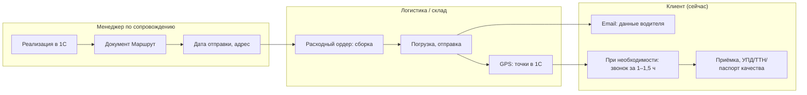

### 3.3 As-is: самовывоз со склада (уточнение Palizh, 2026-06-02)

Согласовано с заказчиком (2026-06-02).

**Адрес склада выдачи:** **г. Ижевск, ул. Салютовская, 31** (завод Palizh). Часы ориентира для клиента — как у точки контактов (пн–пт 8:30–17:00, МСК+1); точное окно выдачи согласует менеджер.

| Шаг | Действие |
|-----|----------|
| 1 | Менеджер заводит заказ в 1С; **счёт** уходит клиенту (в to-be — также в ЛК). |
| 2 | При **предоплате** отгрузку в 1С не проводят, пока оплата не зачтена. |
| 3 | **Реализация** — факт продажи; склад комплектует партию. |
| 4 | **Маршрут** в 1С: для самовывоза в качестве адреса указывают **адрес склада** (Салютовская, 31). |
| 5 | **Расходный ордер** — сборка; статусы «сформирован» / «готов к отправке» (готов к выдаче). |
| 6 | **Клиенту** при **выставлении счёта** сообщают, что при самовывозе забрать можно **на следующий день** (устно / мессенджер / email). **Складу** пишут **после** трёх условий: **оплата получена**, **реализация проведена**, **маршрут проведён**. Сообщение — в **общий чат со складом**: **номер маршрута**, **наименование клиента**, **вложение** (доверенность на водителя клиента **или** накладная на курьера/ТК), просьба **подготовить на завтра** (пример). Автоматического слота самовывоза нет. |
| 7 | **Выдача:** клиент (или уполномоченный представитель) получает груз. **Документы от Palizh:** **УПД** (обязательно), **ТТН** и **паспорта качества** — по запросу / признаку клиента. **Документы от заказчика:** для **водителя ТК** — **накладная**; для **водителя клиента** — **доверенность** на водителя. |

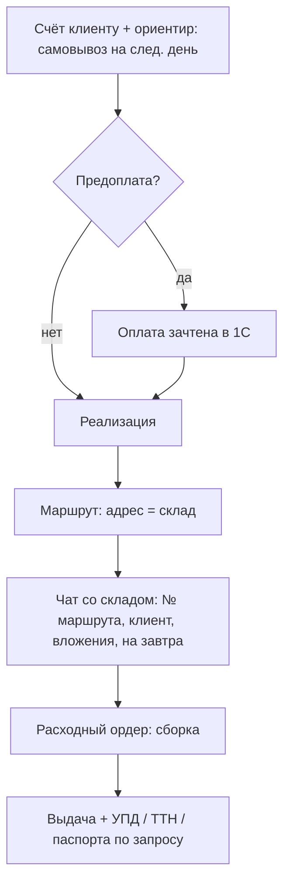

### 3.2 To-be: статусы доставки для отображения в ЛК

В ЛК используется **единая верхнеуровневая цепочка из 6 статусов заказа** (см. ЧТЗ 08 и ЧТЗ 09): `Обрабатывается` → `В производство / производится` → `Готов к сборке` → `Готов к отгрузке` → `Отправлен` → `Завершён`.

Для блока доставки это означает:

- отдельные события `маршрут создан`, `назначен водитель`, `передан трек-номер`, `машина в пути` не становятся самостоятельными верхнеуровневыми статусами ЛК;
- они отображаются как **детали доставки внутри заказа**: ориентировочная дата, способ доставки, маршрут/задание на перевозку, контакты водителя, трек-номер ТК;
- источником этих деталей остаются документы и события 1С.

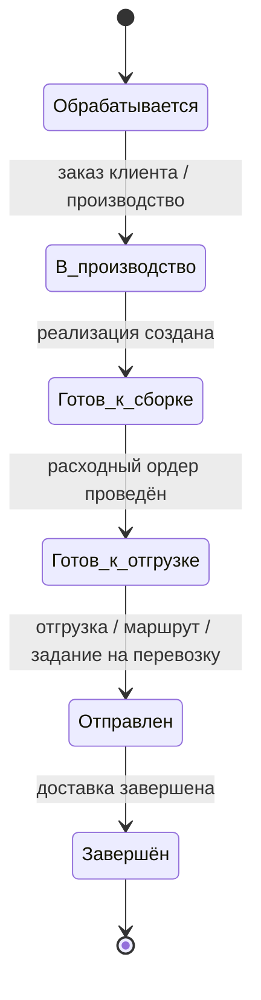

---

## 4. To-be: требования

### 4.1 Правила доставки

- Порог бесплатной доставки своей машиной для `MVP` задаётся как **настройка платформы в админке**. Текущее рабочее значение: **120 тыс. руб.** по заказу, но параметр должен быть редактируемым без изменения интеграции с `1С`.
- **Решение по источнику истины (2026-03-25, вариант A):** для отображения порога и подсказок в корзине/оформлении **первична платформа** (админка). В `1С` передаётся **уже согласованный** с клиентом на платформе заказ (включая выбранный способ доставки в рамках показанных правил). При расхождении с внутренними правилами/справочниками `1С` операционная обработка остаётся в контуре `1С`, но **клиентский UX и текст в ЛК** опираются на настройки платформы до отдельного согласования контракта обмена.
- **Основные причины использования ТК** (по интервью): **срочность** и **недобор по сумме заказа** (меньше 120 тыс.). Ориентир по соотношению своя машина / ТК: ~70–80% / 20–30%.
- В корзине и на шаге оформления: предупреждение `Доберите до N ₽ для бесплатной доставки`, где `N` берётся из настройки платформы.
- Выбор способа получения на платформе (**MVP**, п. 4.7): **доставка Palizh** (своя машина, при пороге), **ТК** (за счёт клиента) или **самовывоз со склада**. Сценарий **«забор на маршруте»** / встреча с водителем вне склада — **вне scope текущего этапа** (п. 4.6). При отказе от своей доставки до адреса — выбор ТК (ПЭК, Деловые линии и др.; **СДЭК не планируется**). **Распоряжения ПЭО** как отдельный документ для проекта платформы **не используются**: порог и пользовательские правила в корзине задаются **в админке** и не тянутся из внешнего регламента в обмене. Delivery-данные и маршрут остаются в контуре `1С`; передача на платформу — по согласованному **JSON API** (ЧТЗ 09). Расчёт стоимости и трекинг — по интеграции с ТК (виджеты для предварительного расчёта — уточнить в MVP: нужны ли или достаточно трек-номеров и подсказок). См. Понимание задачи.
- **Адрес доставки до клиента (решение 2026-06-02):** при способах Palizh и ТК адрес вводится через **DaData** на фронтенде (одна строка, выбор из подсказок); в заказ и в 1С передаётся отформатированная строка. Детали — ЧТЗ 01 §4.1.2, ЧТЗ 09 §4.8.

### 4.2 График маршрутов

- График маршрутов формируется логистами в 1С на год, редко меняется. В ЛК клиенту: возможность показать «ближайшая плановая машина в ваш регион — ориентировочно дата» (если данные доступны из 1С) — уточнить с заказчиком.
- Уведомление клиенту о дате/слоте доставки: сейчас менеджеры «держат в голове» и отвечают на запросы. Целевое поведение: после создания маршрута отправлять клиенту уведомление **по email** (ЧТЗ 10) с ориентировочной датой и далее — с контактами водителя; SMS/push платформой на текущем этапе не планируются.

### 4.3 Своя машина: статусы и контроль

- Для своей доставки события в 1С: реализация → маршрут → расходный ордер (сборка/готов к отправке) → отгрузка. GPS: ночью считываются точки прохождения маршрута, в 1С создаётся документ «Точка прохождения маршрута».
- В ЛК эти события не образуют отдельную вторую шкалу статусов, а наполняют карточку заказа деталями внутри верхнеуровневых статусов `Готов к отгрузке`, `Отправлен`, `Завершён`.
- Контакты водителя: рассылка по email с данными водителя (паспорт, телефон); часть клиентов просит звонок за час–полтора — звонит водитель. В ЛК отображать контакт водителя и дату/статус, когда они известны из 1С.
- Для корректной интеграции нужно согласовать, какие именно сущности и идентификаторы 1С участвуют в доставке: реализация, маршрут, задание на перевозку, точка прохождения маршрута, а также какие из них доступны платформе по API (см. ЧТЗ 09, раздел «Идентификаторы и связывание сущностей», и вопрос №37 реестра открытых вопросов).

### 4.4 Транспортные компании

- Активно работают с **Деловые линии** и **Байкал Сервис**. **СДЭК не планируется** (саммари 2026-03-04).
- **Процесс оформления заявки в ТК** (as-is, саммари 2026-03-04):
  1. Заказ клиента оформляется в 1С.
  2. Заказ передают логисту.
  3. Логист ставит заказ в рейс и заполняет предварительную заявку (Excel).
  4. Заявка передаётся в ТК; ТК создаёт её в своём ЛК.
  5. После передачи груза на терминал ТК перевешивает груз и присваивает **номер накладной**.
  6. Номер накладной передаётся клиенту → он отслеживает груз на сайте ТК (там же видит статусы и данные водителя).
- **Роль клиента:** заявку в ТК оформляет **логист**, а не клиент.
- **Для MVP в ЛК** достаточно отображать **номер накладной ТК** по заказу; клиент по нему самостоятельно отслеживает статус на сайте ТК.
- Виджеты ТК для предварительного расчёта стоимости/сроков — уточнить для MVP: нужны ли или достаточно трек-номеров и подсказок по ценам.
- Полноценное оформление заявки клиентом через виджет ТК **не требуется** (дублирует работу логиста).
- Отдельное ЧТЗ на интеграцию с ТК при детализации.

### 4.5 Документы при приёмке и выдаче

- При **доставке до адреса** клиенту вручают **УПД** (обязательно), по запросу — **ТТН**, **паспорт качества**.
- При **самовывозе со склада** (as-is, п. 3.3): от Palizh — **УПД**, **ТТН** и **паспорта качества** по запросу; от заказчика — **доверенность на водителя** (свой водитель) или **накладная** (водитель ТК).
- После отгрузки документы должны быть доступны в ЛК (см. ЧТЗ «Документооборот»).

### 4.7 Самовывоз со склада (to-be, MVP)

- На шаге **оформления заказа** клиент выбирает способ **«Самовывоз»**.
- Платформа **явно показывает адрес пункта выдачи:** **г. Ижевск, ул. Салютовская, 31** (значение из настроек контактов / админки; канон — `contacts:address` в `public-http-openapi.yaml`).
- В **заказе** и **карточке заказа в ЛК** способ и **адрес самовывоза** отображаются явно (не подменяются адресом доставки клиента).
- В состав заказа, уходящего в 1С, передаётся выбранный способ доставки; для самовывоза в 1С в маршруте фиксируется **адрес склада** (as-is, п. 3.3).
- При появлении **счёта** в ЛК (или в email по ЧТЗ 10) — текстовый ориентир: при самовывозе забрать можно **на следующий рабочий день** после выполнения условий на стороне Palizh (оплата при предоплате, реализация, маршрут); точное время — по согласованию с менеджером (как сейчас).
- Загрузка **доверенности** / **накладной на курьера** в ЛК до выдачи — **не в MVP** (сейчас менеджер передаёт вложения в чат склада); зафиксировать как развитие при необходимости.

### 4.6 Забор на маршруте — вне scope текущего этапа

**Решение (2026-06-02):** сценарии **встречи с водителем на трассе**, **забора груза с плановой машины без довоза до адреса** и аналогичные варианты **не реализуются** на платформе на **текущем этапе** (MVP и ближайшие релизы).

- В оформлении заказа и ЛК **нет** отдельного способа «заберу на маршруте» / «встреча с водителем».
- Операционно Palizh может по-прежнему договариваться с клиентом **вне платформы** (как as-is при сумме &lt; 120 тыс. — забор с машины); это **не дублируется** в цифровом контуре.
- **Самовывоз со склада** (п. 3.3, 4.7) — **единственный** вариант самовывоза в продукте на этом этапе.
- Возврат к теме — только по отдельному решению заказчика после MVP (ранее обсуждалось на [демо прототипов 2026-04-15](../Интервью%20и%20встречи/Саммари/2026-04-15_демо_прототипов_саммари.md)).

---

## 5. Открытые вопросы

- Нужен ли в ЛК календарь/слот «ближайшая плановая машина в ваш регион» или достаточно предупреждения в корзине и уведомления после создания маршрута?
- ~~Передача delivery-событий из 1С на платформу~~ — для MVP зафиксирована передача статической delivery-информации (дата, контакты водителя); детализация событий маршрута вынесена в дальнейшую спецификацию.
- Какие внешние идентификаторы маршрута, задания на перевозку и доставки платформа должна хранить для карточки заказа, трекинга и уведомлений.

---

## 6. Связь с другими ЧТЗ

| Блок | Связь |
|------|--------|
| Процесс оформления заказа | Порог 120 тыс. в корзине; создание маршрута после реализации (ЧТЗ 01) |
| Документооборот | УПД, ТТН, паспорт качества при приёмке (ЧТЗ 02) |
| Претензии | Довоз/забор при претензии — своей машиной или ТК (ЧТЗ 04) |
| Интеграция с 1С | Правила доставки, маршрут, статусы своей доставки, данные водителя и трек-данные (ЧТЗ 09) |
| Саммари интервью | [2026-03-04 доставка/бонусы/цены](../Интервью%20и%20встречи/Саммари/2026-03-04_доставка_бонусы_цены_уведомления_поиск_саммари.md) — правила ТК, процесс логиста, виджеты |


---

<!-- notebooklm-source: ЧТЗ/04_претензии.md -->

# ЧТЗ: Претензии

**Статус:** актуально
**Источники:** Понимание задачи, саммари интервью 2026-02-24 (процесс заказа JTBD), саммари интервью 2026-03-17 (претензии), ЧТЗ 09 (интеграция с 1С).  
**As-is / To-be:** as-is — как есть сейчас, **без** ЛК (клиент сообщает о претензии менеджеру по телефону/email/в мессенджере; менеджер оформляет служебную записку и запускает внутренний процесс в `Mass Project`; разбор ведут отдел качества, лаборатория, логистика и смежные участники). to-be — форма претензии в ЛК, компактные статусы в ЛК, хронология документов и исполнение через `1С` (разделы 4–5); интеграция выполняется **только с 1С**, `Mass Project` остаётся чисто внутренним инструментом (без прямой интеграции с платформой).

---

## 1. Назначение

Описывает типы претензий клиента по отгрузке и качеству, способ их подачи через платформу (форма в ЛК **в контексте заказа**, единый раздел с общими обращениями — см. Инфарх), связь с `1С` (документы, статусы, новые отгрузки/реализации) и итоговые действия (довоз, замена, возврат, зачёт). **Нестандартная заявка** (запрос вне типового заказа из каталога) — **не** этот раздел; см. ЧТЗ 01 §4.5. Внутренний процесс разбора претензий в `Mass Project` сохраняется, но **не интегрируется напрямую** с платформой: платформа работает только с теми данными, статусами и документами, которые подтверждены в `1С` или зафиксированы платформой на этапе подачи. Цель — дать клиенту единую точку входа для претензии, прозрачный статус рассмотрения и понятную связь претензии с последующим исполнением.

---

## 2. Термины (общие)

| Термин | Описание |
|--------|----------|
| Претензия | Возражение по продукции или отгрузке: бой, недопоставка, излишек, некачественный продукт и т.д. |
| Mass Project | Внутренняя система, в которой менеджер запускает бизнес‑процесс претензии, прикладывает служебную записку и вложения; прямой интеграции с платформой нет, для ЛК источником данных выступает `1С` и платформа |
| Служебная записка | Внутренняя структурированная форма по претензии; сейчас заполняется менеджером, в будущем может стать основой формы в ЛК |
| Коммерческий акт ТК | Документ транспортной компании, который нужно оформить при бое/повреждении при внешней доставке |
| Отдел качества | Владелец бизнес‑процесса по претензиям; рассматривает материалы и формирует итоговое решение |
| Лаборатория | Подключается по претензиям к качеству и проводит дополнительную проверку продукта |

---

## 3. As-is: классификация и обработка претензий (сейчас)

Клиент сообщает о проблеме менеджеру (телефон, email, мессенджер). Менеджер собирает исходные данные, оформляет служебную записку и запускает претензию во внутренней системе `Mass Project`. Дальше — разбор: по качеству и бою основным владельцем процесса выступает отдел качества, при необходимости подключаются лаборатория, логистика и ТК. Итог: довоз, замена, возврат, зачёт или отказ. Хронологию документов в `1С` не заменяют (исходная отгрузка + корректировка / новая реализация видны отдельно); для ЛК источником документов и клиентских статусов является `1С` и сама платформа на этапе подачи.

### 3.1 Классификация претензий

| Тип | Описание | Что обычно прикладывает клиент | Кто разбирает | Итог (типовой) |
|-----|----------|---------------------------------|----------------|-----------------|
| Бой | Повреждение продукции, чаще при доставке ТК | Фото боя; при нарушении целостности — коммерческий акт ТК | Отдел качества; при необходимости ТК и логистика | Замена / довоз / иное решение по регламенту |
| Недопоставка | Клиент получил меньше товара, чем ожидалось | Обычно описание ситуации; фото обычно не обязательны | Менеджер + отдел качества / логистика по ситуации | Новая реализация / новая отгрузка на недостающее количество |
| Излишек / лишняя поставка | Клиент получил больше, чем должен был | Обычно описание ситуации | Менеджер + отдел качества / логистика по ситуации | Клиент оставляет товар или организуется возврат / корректировка |
| Некачественный продукт | Несоответствие качества или результата, в т.ч. по цвету | Фото / видео, описание проблемы | Отдел качества + лаборатория | Замена, корректировка, возврат, отказ |

*Точный перечень обязательных полей формы и вопросов из действующей служебной записки ещё нужно получить от заказчика.*

---

### 3.2 As-is: текущий поток обработки (без формы в ЛК)

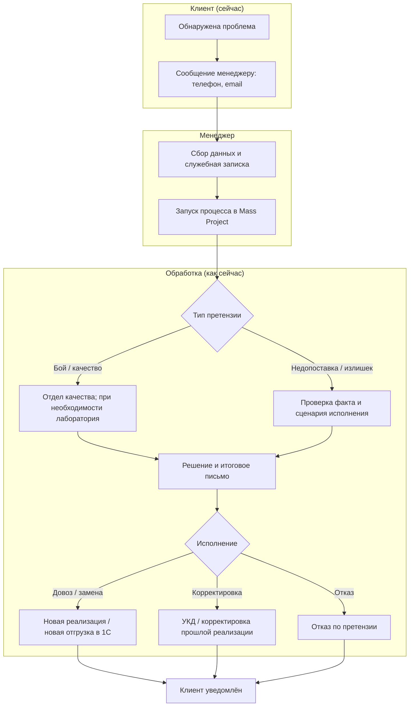

### 3.3 Довоз при недовозе (B2B vs B2C — оба варианта)

По интервью: в B2B часто довозят следующей плановой машиной или с ближайшим заказом; в B2C — могут везти отдельно (ТК/курьер) за счёт компании, не дожидаясь следующего заказа. В ЧТЗ описать оба сценария; выбор — по правилам компании/договору.

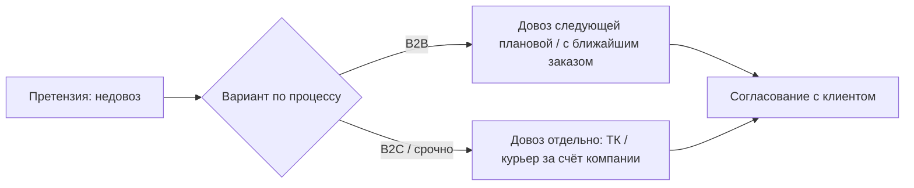

### 3.4 Возврат товара (лишнее у клиента) — сейчас

Клиент сообщает о лишнем; заказ на возврат оформляет **менеджер** (или помогает отдел качества, ПЭО). Логисты занимаются организацией забора груза. Оформление возврата в 1С — менеджер.

---

## 4. To-be: хронология документов и форма в ЛК

При претензии **не заменять** исходную отгрузку в ЛК — отображать исходный заказ / отгрузку и карточку претензии отдельно. В текущем `MVP` клиент видит форму подачи и карточку со статусом `Отправлена`; дальнейшее исполнение и документы по претензии находятся за пределами платформы. После `MVP` можно вернуться к сценарию, где в ЛК отражаются дополнительные результаты исполнения по данным `1С`. См. ЧТЗ «Документооборот».

---

## 5. To-be: требования

### 5.1 Форма претензии в ЛК

- Форма претензии в ЛК должна базироваться на действующей **служебной записке**. Минимально учитывать:
  - тип претензии (`бой`, `недопоставка`, `излишек`, `некачественный продукт`);
  - привязку к заказу / отгрузке / накладной;
  - описание ситуации;
  - обязательные ответы на вопросы из служебной записки;
  - вложения (`фото`, `видео`, при необходимости скан/фото документов).
- Для сценария `бой при доставке ТК` в форме или в подсказках нужно явно сообщать клиенту о необходимости оформить **коммерческий акт ТК**.
- После отправки формы платформа создаёт карточку претензии и внутреннее обращение для команды (без прямой интеграции с `Mass Project`).
- Для текущего `MVP` дальнейшие действия по претензии происходят **за пределами платформы**: команда работает через почту, `Mass Project`, CRM и другие внутренние контуры.
- В момент создания претензии платформа должна отправлять внутреннее уведомление по настроенным каналам / адресатам (см. ЧТЗ 10 и ЧТЗ 12).

#### 5.1.1 Черновой состав полей формы претензии

- Блок `Идентификация претензии`:
  - номер / ID претензии на платформе;
  - дата и время подачи;
  - клиент / компания;
  - контактное лицо;
  - email;
  - телефон.
- Блок `Привязка к отгрузке`:
  - заказ;
  - отгрузка / реализация;
  - накладная / УПД;
  - дата получения товара;
  - способ доставки (`своя машина` / `ТК`);
  - транспортная компания, если применимо.
- Блок `Тип и суть претензии`:
  - тип претензии (`бой`, `недопоставка`, `излишек`, `некачественный продукт`);
  - краткое описание проблемы;
  - подробный комментарий клиента;
  - список проблемных позиций.
- Блок `Позиции и количество`:
  - товар / артикул / наименование;
  - заказанное количество;
  - фактически полученное количество;
  - количество, по которому есть претензия;
  - единица измерения;
  - комментарий по конкретной позиции.
- Блок `Материалы и подтверждения`:
  - фото;
  - видео;
  - сканы / фото документов;
  - дополнительные комментарии;
  - подтверждение, что клиент приложил все имеющиеся материалы.

#### 5.1.2 Условные поля по типу претензии

- Для `бой`:
  - характер повреждения;
  - зафиксировано ли повреждение при приёмке;
  - есть ли **коммерческий акт ТК**;
  - приложены ли фото повреждений.
- Для `недопоставка`:
  - по каким позициям и в каком количестве есть недостача;
  - обнаружена ли недостача сразу при приёмке;
  - есть ли комментарий по упаковкам / местам.
- Для `излишек`:
  - какие позиции получены сверх заказа;
  - сколько единиц лишних;
  - где товар сейчас находится и в каком состоянии.
- Для `некачественный продукт`:
  - в чём выражается проблема качества;
  - когда и в каких условиях она проявилась;
  - фото / видео дефекта;
  - нужно ли дополнительно приложить материалы для лаборатории (`Rub-Out` и др. — уточнить отдельно).

#### 5.1.3 Черновые правила UX для формы

- Пользователь должен выбирать претензию из конкретного заказа / отгрузки, а не вводить всё вручную с нуля.
- После выбора заказа часть данных подставляется автоматически: компания, номер заказа, номер документа, состав заказа, дата отгрузки.
- Для сценария `бой` при доставке `ТК` система должна явно показать подсказку про **коммерческий акт ТК** до отправки формы.
- Форма должна поддерживать несколько строк товаров в одной претензии, если проблема относится к одной отгрузке.
- После отправки клиент должен видеть карточку претензии с ID, датой подачи, статусом `Отправлена` и списком прикреплённых материалов.

### 5.2 Статусы претензии в ЛК

- Для `MVP` в ЛК фиксируется упрощённая модель статуса претензии:
  - `Отправлена`.
- Это означает:
  - клиент видит факт отправки претензии и её сохранение в истории ЛК;
  - платформа **не обновляет** дальнейшие статусы претензии;
  - платформа **не отображает** внутренние этапы разбора, решения и исполнение претензии;
  - дальнейшие действия по претензии происходят за пределами платформы.
- Ранее обсуждавшаяся расширенная модель статусов (`На рассмотрении`, `Удовлетворена / одобрена`, `Отказана`) может рассматриваться как направление после `MVP`, но в текущую реализацию не входит.

### 5.3 Документы при претензии

- По бизнес-процессу вне платформы по итогам рассмотрения претензии могут появляться:
  - **новая реализация / новая отгрузка** на довоз или замену;
  - **УКД / корректировочный счёт-фактура** для корректировки ранее проведённой реализации;
  - иные связанные документы исполнения.
- Однако для текущего `MVP` эти документы и этапы **не отображаются в карточке претензии ЛК**.
- Итоговое письмо / заключение по претензии формируется во внутреннем процессе `Mass Project` и отправляется клиенту менеджером по email вне платформы.
- Для `MVP` претензия в ЛК служит подтверждением факта отправки и хранением материалов клиента, а не интерфейсом дальнейшего сопровождения претензионного процесса.

### 5.4 API претензий (MVP)

**Канон стенда:** `GET /claim`, `POST /claim` в [`public-http-openapi.yaml`](../Техническая%20часть/public-http-openapi.yaml) (базовый префикс API на стенде — `/api`, см. примеры в спеке).

| Метод | Назначение |
|-------|------------|
| `GET /claim` | Список претензий и обращений текущего пользователя (пагинация) |
| `POST /claim` | Создание претензии/обращения по заказу; статус `submitted` |

**Не канон (устаревшие черновики / дрейф кода):** `POST /api/v1/lk/claims`, `GET /api/v1/lk/claims/{id}` — [`Форма_претензии_UI_API.md`](../Техническая%20часть/Форма_претензии_UI_API.md) до 2026-06-29; реализация Laravel **`/api/claims`** — см. [`Backend_готовность_MVP_матрица.md`](../Техническая%20часть/Backend_готовность_MVP_матрица.md). **Задача бэкенда:** привести роуты к `/claim` или обновить канон по согласованию с фронтом.

Поля запроса/ответа, вложения и UX — **§9** формы претензии; в спеке — схемы `CreateClaimRequest`, `ClaimPaginationResponse`.

---

## 6. Открытые вопросы

- ~~Получить точный перечень обязательных полей и вопросов из действующей служебной записки~~ — базовый состав полей зафиксирован в ЧТЗ; детализация UX-формы уточняется на этапе проектирования.
- ~~Подтвердить нормативные сроки рассмотрения~~ — нормативы зафиксированы в рабочих материалах и синхронизированы с реестром.
- После `MVP`: нужно ли возвращаться к расширенной модели статусов претензии в ЛК и как получать эти статусы из внешнего контура.
- После `MVP`: требуется ли показывать клиенту в ЛК итоговое письмо / заключение по претензии и документы исполнения, и через какой подтверждённый источник.
- ~~Какие именно каналы и адресаты внутренних уведомлений должны настраиваться для претензий в админке~~ — в текущем контуре зафиксирован email (прочие каналы post-MVP).
- Формат претензий (в т.ч. `Rub-Out`) — по Пониманию задачи уточнить.

---

## 7. Связь с другими ЧТЗ

| Блок | Связь |
|------|--------|
| Документооборот | Корректировочные документы, хронология накладных (ЧТЗ 02) |
| Доставка | Довоз/забор своей машиной или ТК (ЧТЗ 03) |
| Процесс оформления заказа | Претензия привязана к заказу/отгрузке; исполнение после одобрения может идти как новый заказ / новая отгрузка (ЧТЗ 01) |
| Интеграция с 1С | Корректировочные документы, новые реализации, довозы, возвраты и связи между исходной отгрузкой и претензией (ЧТЗ 09) |
| Уведомления | Клиентские события по претензии и по последующей отгрузке исполнения (ЧТЗ 10) |
| Техническая часть | Прикладное описание полей формы, UX-правил и API-контракта: [Форма_претензии_UI_API.md](../Техническая%20часть/Форма_претензии_UI_API.md) |


---

<!-- notebooklm-source: ЧТЗ/05_регистрация_онбординг.md -->

# ЧТЗ: Регистрация и онбординг клиента

**Статус:** актуально
**Источники:** Понимание задачи, саммари интервью 2026-02-24 (процесс заказа JTBD), 2026-03-02 (документы, роли, нестандартный заказ), 2026-03-13 (1С, обмен данными, регистрация/активация), [демо прототипов 2026-04-15](../Интервью%20и%20встречи/Саммари/2026-04-15_демо_прототипов_саммари.md), ЧТЗ 09 (интеграция с 1С). Ссылка на срок жизни ссылки приглашения (**7 дней**) — [демо дизайна 2026-06-02](../Интервью%20и%20встречи/Саммари/2026-06-02_демо_дизайна_саммари.md); **поток MVP:** заявка без пароля → пароль по письму после активации в 1С (решение 2026-06-02, уточнено).  
**As-is / To-be:** as-is — как сейчас новый клиент попадает в компанию **без** сайта (обращение по телефону/почте, менеджер заводит в 1С, договор подписывают очно и т.д.). to-be — с новым сайтом: кнопка «Стать клиентом», форма заявки (телефон, email, ИНН/КПП), генерация GUID заявки на платформе, передача заявки менеджеру, ручная привязка в 1С и активация контрагента; после этого клиент может завершить регистрацию/авторизацию по email. Заявка связана с 1С: контрагент, договор и соглашение ведутся в 1С; механизм передачи GUID и внешних ID описан совместно с ЧТЗ 09.

---

## 1. Назначение

Описывает процесс «стать клиентом»: от заявки на регистрацию до появления в 1С контрагента, договора и соглашения и до одобрения доступа к ЛК. На старте полноценной саморегистрации с авто-одобрением не предполагается: заявка с платформы уходит менеджеру по сопровождению, который дозаводит данные в 1С и после подписания договора/согласования даёт клиенту доступ к платформе.

---

## 2. Термины (общие)

| Термин | Описание |
|--------|----------|
| Партнёр | Справочник 1С: публичное название, признак (клиент, поставщик и т.д.) |
| Контрагент | Справочник 1С: реквизиты (ИНН, КПП, наименование, банк), взаиморасчёты |
| Договор | В 1С: привязка к контрагенту, отсылка к месту ведения взаиморасчётов (соглашение) |
| Соглашение | В 1С: этапы оплаты, способ оплаты (предоплата/постоплата), проценты, даты сдвига (отсрочка) |
| Менеджер по сопровождению | Заведение контрагента, договора, соглашения в 1С; установка признака активности; согласование с клиентом; одобрение доступа к ЛК |
| GUID заявки на платформе | Уникальный идентификатор заявки/будущего клиента, генерируемый платформой и передаваемый в 1С как внешний ID для привязки |

---

## 3. As-is: как новый клиент появляется сейчас (без сайта)

Нового клиента заводит региональный менеджер: обращение по телефону, почте или личный визит; региональный менеджер запрашивает реквизиты и карточку партнёра, формирует коммерческое предложение (КП без фиксированной формы — счёт или условия в письме). **Договор** заключают от суммы первого заказа **от 120 тыс. руб.**; при сумме меньше — в 1С заводят «строчку по счёту», отгрузка по 100% предоплате без отдельного договора по ставке. Есть несколько шаблонов договора; редактирование шаблона клиентом не допускается — при возражениях клиент оформляет **протокол разногласий** → задача в **MasProject** → юрист (при необходимости ПЭО, отдел качества). Чаще подписывают стандартный договор. После подписания подписанный скан или документ через ЭДО вкладывают в 1С в карточку контрагента/договора; юрист отмечает в программе. **ЭДО:** не у всех клиентов; менеджер по сопровождению ведёт подключение к ЭДО (срезы раз в 1–2 месяца). После подписания клиент получает доступ к работе с компанией (заказы по Telegram/email и т.д.). Отдельного «ЛК» или «входа на сайт» сейчас нет.

### 3.1 To-be: целевой процесс с сайтом (заявка с платформы → доступ к ЛК)

На новом сайте появится кнопка «Стать клиентом» и форма заявки; заявка уйдёт менеджеру; далее — заведение в 1С, подписание договора, одобрение доступа к ЛК; клиент получит ссылку/письмо и вход по логину и паролю.

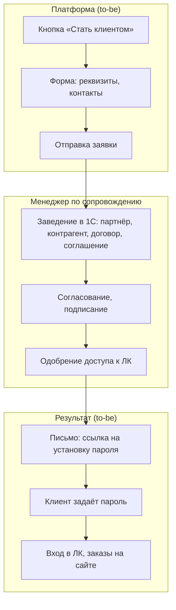

### 3.2 Сущности в 1С (общие для as-is и to-be)

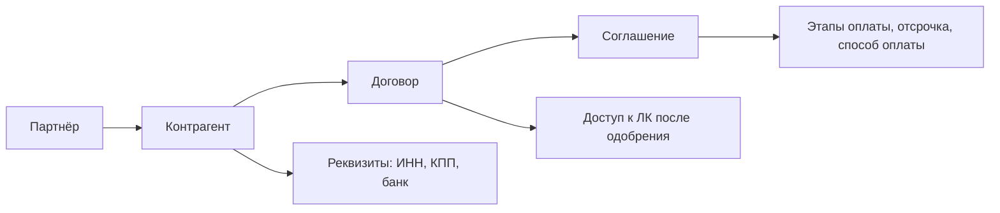

### 3.3 Варианты онбординга to-be

| Вариант | Описание | На старте |
|---------|----------|-----------|
| A. Заявка с платформы | Клиент заполняет форму → заявка менеджеру → менеджер заводит в 1С, подписывает договор, одобряет | Да |
| B. Саморегистрация с авто-одобрением | Клиент вводит ИНН и т.д., система создаёт черновик контрагента, клиент сразу в ЛК с ограничениями до подписания договора | Нет |
| C. Только по приглашению | Менеджер заранее заводит контрагента в 1С и отправляет клиенту ссылку для входа / смены пароля | Уточнить |

---

## 4. To-be: требования

### 4.1 Страница / форма «Стать клиентом»

- Публичная опция на сайте (или в ЛК без авторизации): кнопка «Стать клиентом» / «Оставить заявку».
- **Рабочий UX (демо прототипов, 2026-04-15):** первичный шаг — ввод **ИНН** (юридическое лицо или ИП). Платформа **валидирует формат** (допустимые длины для ЮЛ/ИП, только цифры); после корректного ввода выполняется **запрос к внешнему справочнику/сервису** (конкретный поставщик данных и контракт API — согласовать с заказчиком; **не** считать обязательным использование API ФНС на старте). Из ответа сервиса подставляются **наименование, КПП** и иные реквизиты, необходимые для заявки; на шаге регистрации эти поля **не редактируются пользователем вручную** (только отображаются). При ошибке сервиса или несовпадении — показать понятное сообщение и сценарий эскалации (повтор, связь с менеджером) — детализовать в UX.
- Дополнительно форма собирает: контактное лицо, **email и телефон** для связи, при необходимости — адрес, комментарий. **Пароль на этапе заявки не запрашивается** — задаётся по ссылке из письма после активации в 1С (§4.3.1).
- При отправке формы платформа **генерирует GUID заявки/будущего клиента** и сохраняет его как внешний идентификатор для дальнейшей привязки к контрагенту в 1С (см. ЧТЗ 09). В менеджерский контур уходит **тот же набор**, что и раньше: ИНН, КПП, контакты, GUID и подтянутые реквизиты — чтобы **не дублировать** ручной ввод в `1С` там, где данные уже проверены на платформе.
- После отправки: сообщение «Заявка принята, мы свяжемся с вами»; заявка уходит менеджеру (`EMAIL_INTERNAL_BECOME_CLIENT`).

### 4.2 Роль менеджера по сопровождению и привязка в 1С

- Менеджер получает заявку с ИНН/КПП, телефоном, email и GUID, при необходимости запрашивает карточку предприятия/ИП и дополнительные реквизиты.
- Заведение/привязка в 1С:
  - при отсутствии контрагента — создание партнёра и контрагента (реквизиты, банк, контакты) вручную;
  - создание/привязка договора и соглашения (этапы оплаты, способ оплаты, отсрочка);
  - **запись GUID заявки платформы в карточке контрагента** как внешнего идентификатора для обратной связи с платформой;
  - установка необходимого признака в карточке контрагента (например, флага **«активность»**), который определяет, что клиент может работать через платформу.
- Договор от 120 тыс. руб.; при протоколе разногласий — согласование через MasProject (юрист, при необходимости ПЭО, отдел качества). Подписание — очно или через ЭДО; подписанный скан/документ ЭДО вкладывают в 1С, юрист отмечает. Инициатор отправки договора клиенту — менеджер по сопровождению.
- На MVP заявка с платформы **не создаёт** контрагента автоматически в 1С: она поступает менеджеру как задача/уведомление; далее менеджер вручную заводит/привязывает сущности в 1С и отмечает клиента как активного. Автоматизация «черновика контрагента/договора» по API относится к расширениям (ЧТЗ 09).
- После согласования и подписания договора и активации контрагента в 1С:
  - платформа на основании присутствия GUID и признака активности в 1С считает заявку одобренной;
  - создаётся учётная запись пользователя с логином = указанному в заявке **email** (без пароля);
  - клиенту отправляется письмо-приглашение (`EMAIL_ACCESS_GRANTED`) со ссылкой на **установку пароля** (`POST /auth/invitations/accept`, TTL **7 дней**, §4.3.2).

### 4.3 Авторизация после одобрения

- Вход по email (логину) и паролю, где email — тот, который был указан в заявке. Пароль задаётся **один раз** по ссылке из письма после активации в 1С. Восстановление пароля по email — стандартный сценарий (TTL сброса **24 ч**).
- Связь учётной записи с контрагентом в 1С осуществляется через **GUID заявки/внешний ID**, записанный в **карточке контрагента**; признак «активность» в карточке контрагента определяет, имеет ли пользователь право авторизоваться и оформлять заказы.
- **Email не используется как единственный ключ связки** (интервью 2026-03-13): email может отличаться между платформой и 1С (корпоративный vs личный директора), быть опечатанным или не совпадать. Основной ключ — **GUID контрагента/заявки**, а ИНН/КПП — атрибуты для поиска и верификации.

### 4.3.1 Пошаговый процесс регистрации клиента (MVP, через email)

1. Гость нажимает `Стать клиентом` и заполняет форму (ИНН/КПП, контакты, email) — **без пароля**.
2. Платформа создаёт заявку, присваивает `GUID` и отправляет уведомление менеджеру.
3. Менеджер проверяет заявку, заводит/привязывает контрагента, договор и соглашение в 1С.
4. После активации контрагента в 1С платформа создаёт учётную запись и отправляет письмо со ссылкой на **установку пароля**.
5. Клиент переходит по ссылке, **задаёт пароль**, подтверждает вход.
6. После входа — ЛК мастер-аккаунта (директор/ответственный).

Контракт API: `POST /auth/register` (заявка), `POST /auth/invitations/accept` (пароль по ссылке) — `Техническая часть/public-http-openapi.yaml` (и продуктовый `openapi_client_mvp.yaml` / post-MVP).

### 4.3.2 Ссылка приглашения на установку пароля (MVP)

| Параметр | Значение |
|----------|----------|
| Срок жизни ссылки | **7 календарных дней** с отправки `EMAIL_ACCESS_GRANTED` |
| Повторная отправка | По запросу менеджера / post-MVP самообслуживание — уточнить |
| До установки пароля | Вход в ЛК **невозможен** |
| Хранение пароля | Только **хэш** после установки по ссылке |

### 4.4 Валидация и отображение статуса

- На этапе «заявка подана» — сообщение о принятии; уведомления по email.
- До активации в 1С и установки пароля — вход недоступен (понятное сообщение).
- После установки пароля и активации в 1С — полный доступ к ЛК.
- Валидация реквизитов: проверка формата и контрольной суммы **ИНН** на платформе; актуальность и полнота юр. данных при **автоподстановке** — за счёт выбранного **внешнего справочника** (см. п. 4.1). Отдельная проверка через API ФНС **не обязательна** для `MVP`, если справочник закрывает задачу. Опционально — расширенная проверка на этапе заявки или в профиле компании в ЛК.

### 4.5 Работа только с юрлицами

- На старте платформы — только юрлица (ИП, ООО и т.д.) с заключением договора. Полноценного B2C (физлица без юрлица) не предусмотрено — по Пониманию задачи и интервью.

---

## 5. Открытые вопросы

- ~~Нужен ли клиенту ограниченный доступ к ЛК до подписания договора~~ — зафиксировано: доступ в ЛК только после одобрения/активации в 1С.
- ~~Распределение заявок «стать клиентом» между менеджерами~~ — распределение остаётся на стороне 1С и не входит в контур платформы.
- Интеграция с 1С: создание контрагента/договора из платформы (черновик) или только ручное заведение менеджером в 1С после заявки.
- **Внешний справочник по ИНН:** выбрать поставщика данных, SLA, формат полей и обработку расхождений с тем, что позже заведут в `1С` (см. п. 4.1).
- Техническая реализация хранения `GUID заявки` и флага `активность` в карточке контрагента 1С: конкретные поля/реквизиты, формат значения, сценарии повторной заявки и дублей.
- Сроки и объём перевода клиентов на ЭДО (зависит от законодательства; сейчас подключение ведётся активно).
- **Образцы документов для проектирования:** шаблон договора, протокол разногласий, пример КП — см. [Реестр документов для проектирования](../Интервью%20и%20встречи/Реестр_документов_для_проектирования.md) (вопрос в Реестре открытых вопросов № 25).

---

## 6. Связь с другими ЧТЗ

| Блок | Связь |
|------|--------|
| Процесс оформления заказа | Оформление заказа доступно только после одобрения и привязки к контрагенту (ЧТЗ 01) |
| Документооборот | Договор и соглашение определяют условия оплаты и выдачи документов (ЧТЗ 02) |
| Доставка | Адрес доставки и правила из договора/1С (ЧТЗ 03) |
| Интеграция с 1С | Создание/связывание контрагента, договора и соглашения; внешние ID и механизм обмена по заявке (ЧТЗ 09) |
| Реестр документов для проектирования | [Интервью и встречи / Реестр документов для проектирования](../Интервью%20и%20встречи/Реестр_документов_для_проектирования.md) — образцы договора, КП, протокола разногласий для проектирования онбординга |


---

<!-- notebooklm-source: ЧТЗ/06_витрина_каталог.md -->

# ЧТЗ: Витрина и каталог

**Статус:** актуально
**Источники:** Понимание задачи, саммари интервью 2026-02-24, 2026-03-02, 2026-03-03 (маркетинг, витрина, каталог, обучение), 2026-03-04 (цены, поиск), [2026-05-19 маркетинг — дизайн-концепция / акции и баннеры](../Интервью%20и%20встречи/Саммари/2026-05-19_маркетинг_дизайн_концепция_саммари.md), Инфарх (информационная архитектура), ЧТЗ 09 (интеграция с 1С).  
**As-is / To-be:** as-is — как сейчас клиент получает информацию о товарах **без** новой B2B‑платформы: есть витринные каталоги на текущем сайте (`https://palizh.com/catalog/` для B2C и `https://palizh.com/catalog-industry/` для B2B) **без цен**, а каталог и цены для работы менеджеров живут в 1С, прайсы/предложения присылаются по запросу. to-be — новый сайт B2B‑платформы с витриной и каталогами (раздел 4), интегрированный с 1С и ЛК.

---

## 1. Назначение

Описывает публичную часть и каталоги платформы: главная, каталоги (розница, опт, по брендам), карточка товара, фильтры, сортировки. **Каталог «по брендам» — это альтернативное представление того же ассортимента, где навигация начинается с бренда/производителя (не отдельный B2C/B2B‑контур).** Мастер-данные — 1С (PIM); на платформе отображаются остатки, сроки производства, для авторизованного клиента — персональные цены. Цель — единая витрина с переключением между каталогами и корректным отображением ассортимента и условий.

---

## 2. Термины (общие)

| Термин | Описание |
|--------|----------|
| PIM | 1С — хранение и обработка информации о товарах: фото, описания, свойства, категории |
| Каталог (розница / опт / бренды) | Отдельные представления ассортимента с своими категориями, свойствами и набором товаров. **«По брендам»** — представление, где первый уровень навигации/группировки — **бренд/производитель** |
| Архивная / снятая с производства номенклатура | Товар, который больше не должен участвовать в обычной витрине как актуальная позиция, но может сохраняться в истории заказов и, если есть остаток, оставаться доступным к заказу |
| Сроки производства | Для номенклатур «свыше складской программы» — когда товар будет доступен |

---

## 3. As-is: как клиент узнаёт о товарах сейчас (без витрины B2B‑платформы)

Отдельной витрины **B2B‑платформы** сейчас нет. Есть текущий сайт Palizh с витринными каталогами товаров **без цен**:

- для B2C — `https://palizh.com/catalog/`;
- для B2B — `https://palizh.com/catalog-industry/`.

Эти каталоги используются как ознакомительная витрина ассортимента; для фактической работы с заказами и ценами основной источник — 1С. Каталог и цены для менеджеров хранятся в 1С; клиент получает актуальную информацию через менеджера: прайсы, предложения по email/Telegram, обсуждение по телефону. Персональные цены и условия — в 1С по контрагенту; заказ формируется разрозненно (см. ЧТЗ 01 as-is).

### 3.1 To-be: целевая витрина и доступ (новый сайт)

На новом сайте будет главная, каталоги (розница / опт / бренды), карточка товара.

- **Гости (незарегистрированные):** видят открытую витрину **без цен**; доступно название товара, описание, свойства, остатки/сроки, если это допустимо по бизнес-правилам. **Корзина и оформление заказа недоступны**. Для B2B‑продукции — кнопка `Уточнить оптовые условия` / переход в форму/чат. Если из `1С` по товару приходит ссылка на маркетплейс, гость может перейти на маркетплейс прямо из карточки товара.  
- **Авторизованный B2B‑клиент:** персональные цены из 1С по своему соглашению, наличие, кнопка `В корзину`.  

Переключение между каталогами без потери контекста.

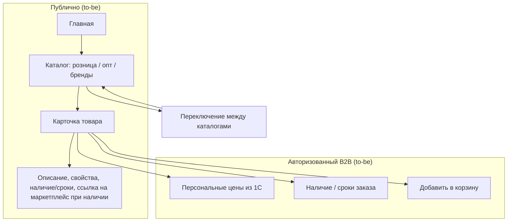

---

## 4. To-be: требования

### 4.1 Главная и навигация

- Главная: витрина, переключение языка (на старте — русский; заложить мультиязычность), форма обращений, новости, о компании — по Инфарх и Пониманию задачи.
- **Баннерная зона на главной:** управляемые баннеры (маркетинг) для анонса новинок, акций, событий, обучающих мероприятий; по клику — переход на страницу акции / обучения / раздел «Акции» **или сразу в каталог по целевой ссылке** (в т.ч. URL с сохранённым состоянием фильтров). **MVP по промо:** на hero **нет динамической ленты карточек товаров** — визуал акции задаётся **статическими изображениями** (учесть desktop/mobile и шаблоны под кнопки); см. §4.5.1.
- Навигация между каталогами (розница, опт, по брендам) — кросс-платформенное переключение без потери контекста (по возможности).

### 4.2 Каталоги

- Несколько каталогов: розничный, оптовый, по брендам. У каждого — свои категории, свойства и ассортимент (источник — 1С).
- **Фильтры и сортировки** — см. **§4.2.0** (атрибуты из 1С, публичный API). Дополнительно: категория, бренд, цена, сортировка.
- **Фильтры по цвету / оттенкам (согласование с прототипом и встречей 2026-05-19):** в интерфейсе для пользователя — формулировки вроде **«оттенки цвета»** (внутренне может использоваться HEX и группировка по диапазонам/кластерам из данных 1С); полный выпадающий список всех оттенков сразу **не целиться** — ориентир: **поиск/автодополнение после нескольких символов** и визуальные группы; окончательная маппинг-логика (в т.ч. Color Index vs HEX vs текст названия) — **после реальной выгрузки** номенклатуры из 1С.
- При первом заходе — **поисковая строка** по каталогу; должна поддерживать запросы вида «для полиуретана» и т.п. (поиск по наименованию/артикулу/свойствам; детали — см. ЧТЗ 11).

### 4.2.0 Фильтры каталога и атрибуты (MVP, 2026-06-26)

**Принято:** состав фильтров на витрине **гибкий** — задаётся справочником атрибутов из 1С, а не фиксированным списком полей в шапке товара. Бизнес-группы из макетов («тип работ», «сфера применения», «специальные свойства» и т.д.) отображаются как **`label`** соответствующих атрибутов; технический идентификатор — **`code`** (например `worktype`, `surface`, `special` — см. примеры в `входящие/incoming-hooks.md`).

**Обмен 1С → платформа** (ЧТЗ 09, [`Модель_данных_каталог_1С_обмен.md`](../Техническая%20часть/Модель_данных_каталог_1С_обмен.md)):

| Слой | Содержание |
|------|------------|
| Справочник атрибутов | Событие **`sync.product-attributes`**: `code`, `label`, `valueType`, `filterType` (`select` / `range` / …), `isFilterable`, `isMulti`, `categories`, `unit`, `subvalueOptions` |
| Значения на товаре | В **`sync.products`** — массив **`attributes[]`**: `{ code, values[] }` |
| Устарело | Отдельные поля **`applicationScope`** / **`workType`** в шапке товара — **не использовать** |

**Публичный HTTP API** (канон стенда — [`public-http-openapi.yaml`](../Техническая%20часть/public-http-openapi.yaml)):

- **`GET /products/filters?categorySlug=…`** — список доступных фильтров для категории (схема `ProductFilter`: `code`, `label`, `filterType`, опции или `range`).
- **`GET /products`** — применение фильтров query-параметрами **`attr[<code>][]=<optionId>`** (select) и **`attrRange[<code>][from|to]`** (range); также `categorySlug`, `priceFrom`/`priceTo`, сортировка.

**Рабочий набор кодов атрибутов MVP (принято 2026-06-26):** до первой полной выгрузки из 1С в документах и примерах hooks используем перечень ниже; **новые коды** допускаются без смены API (гибкая модель).

| `code` | Label (пример UI) | `filterType` | Примечание |
|--------|-------------------|--------------|------------|
| `worktype` | Типы работ | select, multi | Бывш. «тип работ» в макетах |
| `surface` | Обрабатываемая поверхность | select, multi | |
| `special` | Специальные свойства | select, multi | |
| `compatibility` | Совместимость | select, multi | `subvalueOptions` (compatible / unknown) |
| `tintingMethod` | Способ колерования | select, multi | |
| `density` | Плотность | range | `unit`: г/см³; может быть привязан к категории |

Подписи **`label`** в UI могут уточняться с **Натальей** (макеты); **коды** — стабильный контракт для 1С и API.

**Открыто (реестр №54):** только **заполнение** справочника и значений на реальной номенклатуре в 1С; техническая модель и перечень кодов MVP **зафиксированы**.

**Устаревшие поля обмена** `applicationScope` / `workType` в документах и саммари — заменены моделью **`attributes[]`** (решение 2026-06-02, актуализация ЧТЗ 2026-06-26).

### 4.2.1 Архивная номенклатура и публикация товара

- Платформа должна различать:
  - активную номенклатуру для обычной витрины;
  - архивную / снятую с производства номенклатуру;
  - историческую номенклатуру, которая нужна для истории заказов и повторного заказа.
- Рабочая логика для MVP:
  - если товар снят с производства, но из `1С` приходит, что остаток **больше 0**, позиция может оставаться доступной к заказу;
  - если товар архивный / снятый с производства и остаток **0**, платформа может убирать его из активной витрины в архив;
  - если на стороне `1С` архивная пометка снята, платформа должна уметь возвращать товар из архива в активный каталог.
- Архивный статус товара не должен разрывать связь с историей заказов клиента: позиция должна оставаться идентифицируемой по внешнему ID `1С`.

### 4.2.2 Персональная номенклатура (один контрагент; требование заказчика 2026-04)

- Некоторые позиции в 1С могут быть помечены как доступные **только одному** контрагенту: в обмен **`sync.products`** передаётся **`counterpartiesGuid`**; на платформе и в публичном API — **`exclusiveCounterpartyGuid`** (маппинг — [`Маппинг_API_1С.md`](../Техническая%20часть/Маппинг_API_1С.md)). Канон HTTP стенда — [`public-http-openapi.yaml`](../Техническая%20часть/public-http-openapi.yaml); исходящий контракт 1С — `1c-http-openapi.yaml`.
- **Поведение:** товар **не** показывается в листинге, поиске и карточке **другим** B2B-компаниям и **гостю**; отображается и доступен к заказу **только** у сессии, у которой `GUID` контрагента совпадает с пришедшим из 1С. Позиция **без** такого `GUID` ведёт себя как обычный общий ассортимент (в пределах прочих правил каталога).
- **Корзина / оформление:** подстановка в корзину «чужой» персональной позиции блокируется на API (см. ЧТЗ 01). **Поиск и листинг:** позиции, недоступные текущему зрителю, **не** в выдаче (те же правила видимости, что `GET /products`; ЧТЗ 11 §5.7).

### 4.2.3 Цены и персональные скидки

- Из 1С на платформу приходят **виды цен** и **процент персональной скидки** для контрагента. **MVP (2026-06-02):** на позицию — **три** вида цены: **розница**, **опт**, **за коробку**; в номенклатуре — **шт. в коробке** (`unitsPerBox`). См. [`Модель_данных_каталог_1С_обмен.md`](../Техническая%20часть/Модель_данных_каталог_1С_обмен.md), реестр №56.
- **Персональная скидка** контрагента (% из соглашения) применяется к розничным **`amount`** и **`amountPerBox`** в `ProductPrice` → `discountedAmount` / `discountedAmountPerBox`. **Не** к опту (`WHOLESALE`) и **не** к отдельному виду цены **`BOX`** в `sync.prices` (это не то же самое, что поле `amountPerBox` для кратности).
- Для **гостей**:
  - цены в каталоге и карточке товара **не отображаются**;
  - корзина и оформление заказа недоступны, скидки не применяются;
  - если из `1С` по товару приходит ссылка на маркетплейс, в карточке товара может отображаться переход на соответствующий маркетплейс.
- Для **авторизованных B2B‑клиентов**:
  - отображаются цены по согласованным видам (розница / опт / коробка — по правилам соглашения и кратности);
  - скидка из соглашения — к **рознице**; логика корзины и подсказки кратности — **§4.2.4**, **ЧТЗ 01 §4.2.4**.
- **Подпись цены в карточке:** при кратности упаковки — **«цена / уп.»**; для штучных позиций — **«цена / шт»**.
- Детальные правила по зонам UI — **§4.2.4**.

### 4.2.4 Отображение цен в UI (MVP, 2026-06-27)

**Источник данных:** в **каталоге** платформа **не пересчитывает** цены — показывает значения из канона [`public-http-openapi.yaml`](../Техническая%20часть/public-http-openapi.yaml): `amount`, `amountPerBox`, `discountedAmount`, `discountedAmountPerBox`, `priceTypeCode`, `unitsPerBox`. В **корзине** `unitPrice` / `lineTotal` пересчитывает **backend** по **ЧТЗ 01 §4.2.4 (вариант A)**. Виды цен из 1С: `RETAIL`, `WHOLESALE`, `BOX` (реестр №56; `BOX` — **за коробку целиком**).

**Общие правила (авторизованный B2B):**

- **Основная цена** — по виду цены из соглашения контрагента (розница / опт; маппинг кодов — №56, `Маппинг_API_1С.md`).
- **Персональная скидка** — к розничным `amount` и `amountPerBox`; в API — `discountedAmount` / `discountedAmountPerBox`. Если по соглашению **наценка**, а не скидка — **не** акцентировать формулировку «скидка» (ЧТЗ 01).
- **Подписи единицы:** `unitsPerBox > 1` → **«цена / уп.»** (или «за коробку», если показывается `BOX` / `amountPerBox`); иначе — **«цена / шт»**.
- **Гость** — цен нет (§4.2.3).

| Зона | Что показываем |
|------|----------------|
| **Листинг каталога** | Одна **основная** актуальная цена для контрагента (с учётом `discountedAmount`, если применимо). При `unitsPerBox` и наличии цены за коробку — **вторичная строка** «цена за коробку» (`amountPerBox` или `BOX`) — опционально, если не перегружает плитку. |
| **Карточка товара** | Основная цена + подпись единицы; при `unitsPerBox` — пояснение кратности («в коробке N шт.»); блок «цена за коробку», если пришла из API. Зачёркнутая базовая + итоговая — при персональной скидке на розницу. |
| **Корзина** | `unitPrice` (средняя), `lineTotal`, `packagingMode`, `fullBoxesCount`, `remainderQuantity`; расчёт **смешанной строки** — **ЧТЗ 01 §4.2.4** (целые коробки × `amountPerBox` + остаток × `amount`). Подсказка при `mixed` / `non_multiple`. |

**Открыто для дизайна (реестр №30):** точная визуальная иерархия двух строк цен (рядом / tooltip / аккордеон); нужно ли в листинге одновременно показывать розницу и опт при соглашении с оптом — уточнить с заказчиком на макете.

### 4.3 Карточка товара

- Отображение: фото, описание, свойства, остатки по складской программе, сроки производства для номенклатур «свыше складской программы».
- Для **гостей**: цены не отображаются; вместо кнопки `В корзину` — `Войти` / `Стать клиентом` и, при необходимости, `Уточнить оптовые условия`. Если для товара из `1С` приходит ссылка на маркетплейс, гость может перейти на маркетплейс из карточки товара.
- Для **авторизованного клиента**: персональные цены по соглашению, наличие или сроки формирования заказа. Кнопка «В корзину» (см. ЧТЗ 01).
- SEO: метатеги, ЧПУ, микроразметка Schema.org — по Пониманию задачи.

### 4.4 Принятые решения по разделам (интервью 2026-03-03)

- **Раздел «Вопрос-ответ» / FAQ:** **не делаем** отдельный раздел. Часть сценариев (где взять документы, статусы и т.п.) покрывается через чат с менеджером и встроенные подсказки по месту в интерфейсе.
- **Раздел «Услуги и сервисы»:** **не нужен** — соответствующие сценарии (обучение, сервисы) покрываются разделом «Обучение» и чат-каналом.
- **Раздел «Новости»:** подтверждён; детали объёма и частоты наполнения — на стороне маркетинга.
- **Акции B2C → B2B:** акции, считающиеся B2C, должны быть **видны и клиентам B2B** — единый пул акций к просмотру; условия применимости задаются в карточке акции и/или в договорных условиях.
- **Мотивация регистрации:** отдельной «маркетинговой мотивации» не требуется; информация подаётся через баннеры (преимущества заказа через платформу).

### 4.5 Маркетинговые разделы (акции, новости, контент)

- **Раздел «Акции»:**
  - Список действующих и, опционально, архивных акций.
  - Карточка акции: заголовок, описание, период действия, условия участия, применимость (категории/товары, при необходимости — тип клиента), ссылка/кнопка перехода в каталог или ЛК.
  - Связь с баннерами на главной: баннер → страница акции, общий список «Акции» **или напрямую в каталог** по целевой ссылке (`targetUrl` / deeplink фильтров).
- **Публичный HTTP API витрины (канон GitLab `docs/public-http-openapi.yaml`, копия в `Техническая часть/public-http-openapi.yaml`):**
  - `GET /banners` — активные баннеры: изображение (`imageUrl`), переход (`targetUrl`), опционально заголовок/подзаголовок (`title`, `subtitle`).
  - `GET /promotions` — пагинированный список **активных** акций (`page`, `perPage` до 100): на стороне API учитываются флаг активности и границы периода (`starts_at` / `ends_at`), фиксированная сортировка — в описании операции в YAML.
  - `GET /promotions/{slug}` — детальная акция; неактивная акция отдаёт **404**.
  - В схемах `PromotionListItem` и `Promotion` поле **`ctaUrl`** — абсолютный или относительный URL для кнопки перехода (каталог с query-параметрами фильтров, лендинг акции и т.д.). Отдельной «ленты SKU» в ответе API нет — согласуется с подходом «текст условий + переход по ссылке».
  - В спецификации для ряда операций каталога/обучения в `summary` отмечено **«❗»** (метод не реализован / в работе) — ориентир для статуса бэкенда, не для смены продуктовых требований без отдельного решения.
- **Новости и статьи:**
  - Лента новостей с возможностью перехода на страницу новости.
  - Поддержка анонсов материалов с основного сайта/блога (`palizh.com`, в т.ч. [блог](https://palizh.com/blog/)): в новости указывается краткое описание и ссылка «Читать на сайте Palizh».
  - Отдельный большой раздел «Статьи» на платформе не обязателен; базовый сценарий — анонсы + ссылки наружу.

### 4.5.1 Акции и промо-баннеры — граница MVP (встреча 2026-05-19)

Сводка решений из [саммари маркетинга и дизайн-концепции](../Интервью%20и%20встречи/Саммари/2026-05-19_маркетинг_дизайн_концепция_саммари.md):

- **Конструктор акции** (ручное перечисление SKU в админке, отдельная «таблица акции» без связи с живым каталогом) и **динамическая лента товаров на главном баннере** — **не входят в текущий MVP**; при необходимости выносятся в **отдельное ТЗ** после запуска и сбора реальных кейсов.
- **Статический промо-баннер на главной:** коммуникация акции через **изображения** (отдельно проработать **desktop и mobile**, шаблоны под кнопки и заголовки). Тексты на баннере — **короткие**; развёрнутые условия — на **странице акции**.
- **Ссылка в каталог:** состояние фильтров можно передавать **deeplink URL** (`ctaUrl` / целевая ссылка баннера); это остаётся основным способом «показать подборку товаров акции» без конструктора.
- **Цены:** на баннере и в любом быстром превью промо **не показывать итоговую/«акционную» цену как обещание** — учёт персональных скидок, суммирования акций и бонусов для MVP не доведён до консистентной автоматики; достаточно **информирования текстом + переход в каталог**, где считаются реальные условия.
- **Сложные механики** (например, «2 % бонусов за образец непокупаемой новинки», комбинации нескольких автоматических скидок на превью) — **не автоматизируются в MVP**; описываются в тексте акции и отрабатываются с участием менеджера до появления отдельной продуктовой спеки.
- **Индикация «акционный товар»** в **листинге/КТ** (плашка у позиции) — **вне текущего объёма MVP**; маркетинг сохраняет идею как возможное развитие после запуска — отдельное решение и синхронизация с 1С/каталогом (отдельно от отказа от **hero-ленты** SKU).

Процессный момент **без финального решения:** обязательна ли **всегда** отдельная страница акции перед переходом в каталог или допускается **только `ctaUrl` в каталог** — обсуждалось как настройка контента в админке; см. §5 ниже.

### 4.6 Интеграция с 1С и управление контентом

- **Из 1С на платформу приходят** (события `POST /exchange`, см. ЧТЗ 09 и `входящие/incoming-hooks.md`):
  - **справочник атрибутов** (`sync.product-attributes`) и **значения на товаре** (`attributes[]` в `sync.products`);
  - типы номенклатуры, характеристики типа, **номенклатура (товары)**, категории витрины, остатки, цены;
  - цены и индивидуальные условия (см. ЧТЗ 10, 09); для гостей цены не отображаются, для авторизованных клиентов — вид цены из соглашения;
  - основное (первое) фото товара, базовые описания (по мере доработки 1С);
  - данные об остатках и сроках производства;
  - признак состояния номенклатуры для витрины / истории / повторного заказа (`активна`, `архивна`, `помечена`, `доступна к заказу` — точный контракт уточняется с `1С`).
- Для корректной интеграции нужно отдельно зафиксировать:
  - какие поля 1С являются обязательными для публикации товара на платформе;
  - какие внешние ID/GUID номенклатуры и категорий платформа хранит у себя;
  - как обновляются **номенклатура и категории** (согласование с заказчиком: **push из 1С**, полная выгрузка по команде, далее дельты) и **цены, остатки, атрибуты** (часто — сочетание расписания и событий — см. ЧТЗ 09);
  - как именно передаётся архивность / снятие с производства / пометка на удаление, чтобы платформа могла корректно скрывать товар из витрины, но не терять его в истории заказов.
- **Через админку платформы управляются:**
  - баннеры и промо‑блоки (главная, каталог, карточки);
  - новости, анонсы статей, описания обучающих программ;
  - дополнительные изображения (применение, иллюстрации), если они не могут храниться в 1С;
  - маркетинговые ссылки и вспомогательные материалы, которые не входят в клиентский документооборот ЛК.
- Платформа **не является источником истины по ассортименту и ценам** — эти данные задаёт 1С; админка используется для маркетинговых и вспомогательных материалов. Если `TDS/MSDS`, `СГР`, паспорта безопасности и аналогичные документы должны отображаться в ЛК клиента, они должны выдаваться через 1С; админка не должна становиться альтернативным источником клиентских документов. Детальное разделение ролей и прав в админке — см. ЧТЗ 12.

---

## 5. Открытые вопросы

- ~~Кто отвечает за наполнение: категории, фото, тексты~~ — зафиксировано: владелец контента на стороне маркетинга.
- Какие признаки/поля в 1С определяют публикацию товара в конкретном каталоге, состав карточки товара и доступность товара для B2B/B2C витрины.
- ~~Оборудование и «некаталоговая» номенклатура~~ — в MVP через заявку менеджеру, без отдельного каталожного раздела.
- ~~**Акции:** дифференциация по B2B/B2C и минимальный набор данных в карточке~~ — закрыты: см. §4.5 и §4.5.1 и контракт `public-http-openapi.yaml` (**`GET /promotions`**, **`GET /promotions/{slug}`**, схемы `Promotion*`). Открытый процессный момент: **обязательна ли отдельная страница акции** перед переходом в каталог или допускается **только `ctaUrl` в каталог** — см. §4.5.1 и **реестр №26**.
- **Контент маркетинга:** какой контент маркетинг планирует публиковать на новой площадке: новости, акции, анонсы статей/обучения; какие материалы остаются только на основном сайте/блоге, кто ведёт и с какой частотой обновления?
- ~~**Каталоги и прайсы:** какие каталоги можно показывать публично (B2C), какие — только действующим B2B‑клиентам в ЛК; в каком виде и в каких точках интерфейса может быть доступ к прайс‑листам, если он вообще нужен на платформе~~ — **закрыто (2026-06-29):** в MVP **нет** кнопки «скачать прайс»; клиент видит персональные цены в каталоге и **`lineTotal`** по строке корзины (**ЧТЗ 01 §4.2.4**, §4.2.3). **Выгрузка прайса / таблицы цен — только по запросу** (менеджер, email/Telegram — as-is; не self-service на платформе в MVP). Post-MVP: заказ файлом / шаблон Excel — ЧТЗ 01 §4.2.3.
- Какой состав данных по товару приходит из 1С для поиска и каталога: артикулы, коды поиска, номенклатура контрагента, атрибуты, изображения, публикационные флаги.
- Каким именно полем / набором полей `1С` будет передавать архивность / снятие с производства / пометку на удаление, чтобы платформа корректно управляла активной витриной и сценарием `повтор заказа`.
- **Фильтры:** ~~фиксированное или гибкое число групп~~ — **технически гибкая модель**, **рабочий набор кодов MVP** — §4.2.0 (2026-06-26); открыто только **наполнение** данными в 1С (реестр №54).
- ~~**Цена за коробку:** сумма за упаковку или за штуку~~ — **закрыто (2026-06-02):** в обмене цена **за коробку целиком** (`BOX` / поле 1С «цена за коробку»).

---

## 6. Связь с другими ЧТЗ

| Блок | Связь |
|------|--------|
| Процесс оформления заказа | Корзина, оформление, порог доставки (ЧТЗ 01) |
| Интеграция с 1С | Товары, цены, остатки, категории (ЧТЗ 09) |
| Система управления | Контент, баннеры, маркетинговые материалы; клиентские документы для ЛК не должны обходить 1С (ЧТЗ 12) |
| Поиск | Поиск по каталогу (ЧТЗ 11) |
| Саммари интервью | [2026-03-03 маркетинг/витрина/каталог/обучение](../Интервью%20и%20встречи/Саммари/2026-03-03_маркетинг_витрина_каталог_обучение_саммари.md) — FAQ, «Услуги», акции B2C→B2B, обучение, TDS/СГР; [2026-05-19 маркетинг — дизайн-концепция](../Интервью%20и%20встречи/Саммари/2026-05-19_маркетинг_дизайн_концепция_саммари.md) — граница MVP промо и баннеров, фильтры/цвет |


---

<!-- notebooklm-source: ЧТЗ/07_ЛК_профиль_компания.md -->

# ЧТЗ: Личный кабинет — профиль пользователя и компании

**Статус:** актуально
**Источники:** Понимание задачи, ЧТЗ 05 (регистрация и онбординг), саммари 2026-03-02 (роли клиентов), 2026-03-04 (бонусы, цены).  
**As-is / To-be:** as-is — ЛК и раздела «Профиль» **нет**; данные о клиенте и компании хранятся в 1С, клиент узнаёт условия от менеджера. to-be — раздел ЛК «Профиль» (пользователь + компания), данные из 1С (разделы 3–4).

---

## 1. Назначение

Описывает экраны профиля пользователя (личные данные, контакты, смена пароля, настройки уведомлений) и профиля компании (реквизиты, коммерческие параметры: лимиты, отсрочки, скидки, бонусы, признак постоплаты). Данные компании — из 1С (контрагент, договор, соглашение); редактирование реквизитов — только через менеджера или заявку. Цель — прозрачность условий для клиента и единая точка настройки учётной записи.

---

## 2. Термины (общие)

| Термин | Описание |
|--------|----------|
| Профиль пользователя | Учётная запись: ФИО, email, телефон, смена пароля, настройки уведомлений |
| Профиль компании | Реквизиты юрлица и коммерческие параметры из договора/соглашения |
| Соглашение | В 1С: этапы оплаты, отсрочка, способ оплаты; отображаются в ЛК как «условия» |
| Мастер-аккаунт | Основная учётная запись компании-клиента с полным доступом и правом управлять другими пользователями своей компании |
| Под-пользователь | Дополнительная учётная запись сотрудника компании-клиента, созданная внутри одной компании и ограниченная по роли |
| Роль пользователя | Набор доступных разделов и действий в ЛК: что пользователь видит и что может инициировать |

---

## 3. To-be: структура раздела «Профиль» в ЛК

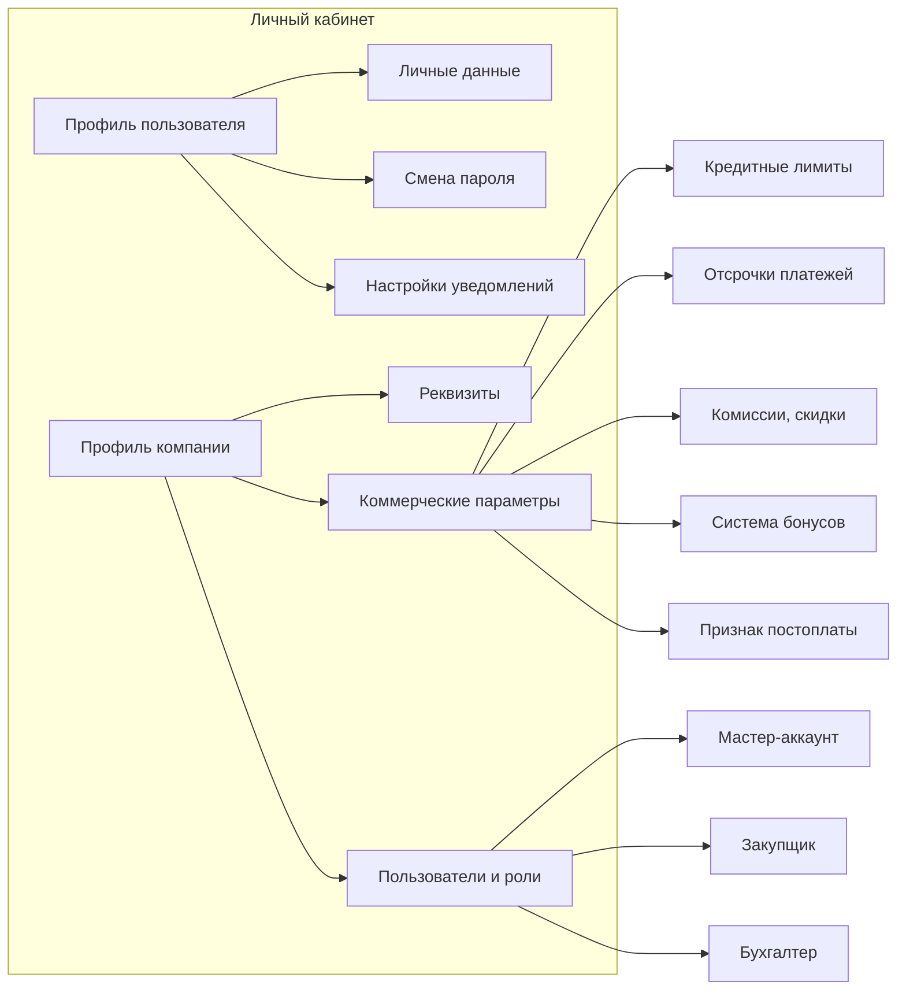

---

## 4. To-be: требования

### 4.1 Профиль пользователя

- Редактирование: ФИО, контактный email, телефон. Смена пароля и восстановление пароля — стандартные сценарии.
- Учётная запись пользователя создаётся платформой **после одобрения заявки на регистрацию** и активации контрагента в 1С (см. ЧТЗ 05): логином выступает email из заявки, а привязка к компании/контрагенту происходит по внешнему идентификатору (GUID заявки), записанному в 1С.
- Настройки уведомлений: на текущем этапе **только email** — подписка на типы событий (заказ, счёт, доставка и т.д.); SMS и push **не** в плане платформы (ЧТЗ 10).

### 4.2 Профиль компании

- Отображение реквизитов компании (наименование, ИНН, КПП, адрес, банк) — из 1С. Изменение реквизитов — через заявку/обращение к менеджеру или отдельный сценарий (уточнить).
- Коммерческие параметры (только отображение, изменение — через договор/менеджера): кредитные лимиты, отсрочки платежей, комиссии/скидки, система бонусов, признак доступности постоплаты. Источник — 1С (договор, соглашение).
- **Цены в ЛК:** решение принято — **показываем** (интервью 2026-03-04). **Правила по зонам** — **ЧТЗ 06 §4.2.4**; кратность — `unitsPerBox` из 1С. **Открыто (№30):** визуальная иерархия на макете; показ финансовых условий в профиле vs только в каталоге/корзине (№45).
- **Бонусы:** 7 типов (первичные продажи, квартальный/годовой план, своевременная оплата, поддержание ассортимента, разовые акции, предоплата); хранение и начисление — в регистрах 1С, бухгалтерия. **Решение по MVP (2026-03-25):** в ЛК показываем **типы и условия** по бонусам и **текущий баланс**; баланс и условия **получаем из 1С**; **историю начислений/списаний в ЛК не показываем**. Заявка на списание бонусов и автоматическое списание в заказе — **после MVP**.
- В составе профиля компании предусмотреть отдельный блок «Пользователи компании», где мастер-аккаунт видит список сотрудников, их роли, статус доступа и основные контакты.

### 4.2.1 Адреса доставки (раздел ЛК)

- Отдельный подраздел **«Адреса доставки»** (в навигации ЛК или вкладка профиля компании — см. Инфарх): список, добавление, редактирование, удаление.
- **Добавление и редактирование:** то же правило, что при оформлении заказа — поле с подсказками **DaData**, обязательный **выбор** варианта из списка (ЧТЗ 01 §4.1.2).
- **Хранение:** на платформе — отформатированная строка `deliveryAddress` (`unrestricted_value` DaData) и при наличии `deliveryAddressFiasId`.
- Юридический адрес в блоке «Реквизиты» (п. 4.2) **не редактируется** через DaData — только отображение из 1С.

### 4.3 Роли внутри ЛК

- По итогам интервью 2026-03-02: минимум три роли — (1) **полный доступ** (директор/собственник); (2) **закупщик**; (3) **бухгалтер**. На старте достаточно разграничения по разделам и ключевым сценариям, без сложного RBAC-конструктора.
- **Полный доступ (мастер-аккаунт / директор)** — это **надмножество** возможностей ЛК; роли «закупщик» и «бухгалтер» задают **ограничения** для сотрудников компании, а не отдельный «набор функций сверх» директора.
- Роль назначается на уровне пользователя внутри одной компании. Один пользователь имеет одну базовую роль. Набор ролей фиксированный для MVP.
- **Мастер-аккаунт** (как правило, директор или ответственный со стороны клиента) видит все вкладки ЛК и может создавать под-пользователей своей компании.

### 4.4 Описание ролей и функционала

| Роль | Кто это на стороне клиента | Что видит | Что может делать | Ограничения |
|------|-----------------------------|-----------|------------------|-------------|
| **Полный доступ / мастер-аккаунт** | Директор, собственник, администратор клиента | Все разделы ЛК: профиль, компания, заказы, документы, уведомления, обращения | Просматривать все данные компании; создавать, редактировать, отключать под-пользователей; назначать роли; оформлять и повторять заказы; смотреть документы; отправлять запросы менеджеру/на акт сверки | Не меняет коммерческие условия, договорные параметры и реквизиты напрямую в обход 1С/менеджера |
| **Закупщик** | Снабжение, отдел закупок, менеджер клиента | Каталог, корзина, оформление заказа, история заказов, карточка заказа, часть профиля компании с рабочими данными | Оформлять заказ, повторять заказ, смотреть статусы, отслеживать доставку, отправлять нестандартную заявку, обращаться в чат/к менеджеру | Не управляет пользователями компании; не видит бухгалтерские документы и финансовые параметры, если это не будет отдельно согласовано |
| **Бухгалтер** | Бухгалтерия клиента, финансовый специалист | Документы, профиль компании, раздел **«Обращения и претензии»**, при необходимости история заказов в режиме просмотра | Смотреть и скачивать счёт, УПД, ТТН, паспорт качества; запрашивать акт сверки; проверять реквизиты и финансовые условия; **подавать и просматривать** общие обращения и претензии **в контексте заказа** (ЧТЗ 04) | Не оформляет заказ, не меняет состав корзины, не управляет каталогом и пользователями; **нестандартная заявка** (запрос вне типового заказа из каталога) — **не** входит в сценарии роли |

### 4.5 Матрица доступа по разделам

| Раздел / действие | Полный доступ | Закупщик | Бухгалтер |
|-------------------|---------------|----------|-----------|
| Профиль пользователя | Да | Да | Да |
| Профиль компании: просмотр реквизитов и условий | Да | Ограниченно | Да |
| Пользователи компании и роли | Да | Нет | Нет |
| Каталог и карточка товара | Да | Да | Нет |
| Корзина и оформление заказа | Да | Да | Нет |
| Повтор заказа | Да | Да | Нет |
| История заказов и статусы | Да | Да | Просмотр при необходимости |
| Документы по заказам | Да | Ограниченно / по согласованию | Да |
| Запрос акта сверки | Да | Нет | Да |
| Обращение в чат / связь с менеджером (виджет) | Да | Да | Да |
| Раздел «Обращения и претензии»: общее обращение и претензия (контекст заказа, типы претензий — ЧТЗ 04) | Да | Да | Да |
| Нестандартная заявка / связь с менеджером по запросу **вне типового заказа из каталога** (отдельный пункт ЛК, ЧТЗ 01 §4.5) | Да | Да | Нет |

### 4.6 Управление пользователями компании

- Создание под-пользователя инициирует мастер-аккаунт внутри ЛК.
- Для под-пользователя фиксируются минимум: ФИО, email, телефон, роль, статус доступа.
- Базовые действия мастер-аккаунта:
  - создать пользователя;
  - изменить роль пользователя;
  - отключить доступ пользователя;
  - при необходимости повторно отправить приглашение/инструкцию по входу.
- Пользователь всегда привязан к одной компании. Перенос пользователя между компаниями в MVP не предусматривается.
- Для безопасности изменение роли и отключение доступа должны логироваться.

#### 4.6.1 Пошаговый сценарий: директор создаёт учётки закупщику и бухгалтеру (email)

1. Директор (мастер-аккаунт) открывает в ЛК раздел `Профиль компании` → `Пользователи`.
2. Нажимает `Добавить пользователя`.
3. Заполняет поля: `ФИО`, `email`, `телефон` (опционально), выбирает роль (`Закупщик` или `Бухгалтер`).
4. Нажимает `Отправить приглашение`.
5. Платформа создаёт под-пользователя со статусом `Приглашение отправлено` и отправляет письмо на указанный email.
6. Сотрудник переходит по ссылке из письма, задаёт пароль и завершает активацию.
7. После первой успешной авторизации статус меняется на `Активен`, роль применяется автоматически.

#### 4.6.2 Статусы доступа под-пользователя (MVP)

- `Приглашение отправлено` — пользователь создан, письмо отправлено, вход ещё не завершён.
- `Активен` — пользователь принял приглашение и может входить в ЛК.
- `Отключён` — доступ закрыт директором; вход невозможен до повторной активации/инвайта.

#### 4.6.3 Правила email-приглашения (MVP)

- Основной канал — email; ссылка в письме **одноразовая**, срок жизни **7 календарных дней** (ЧТЗ 05 §4.3.2 — приглашение мастер-аккаунта; тот же срок для под-пользователей).
- Директор может выполнить `Отправить приглашение повторно` для статуса `Приглашение отправлено` (новый токен, снова **7 дней**).
- Если email уже используется в другой компании, платформа не создаёт доступ и показывает ошибку в форме.
- Смена роли (`Закупщик` ↔ `Бухгалтер`) выполняется директором без повторной регистрации пользователя.

### 4.7 Ограничения и принципы доступа

- Коммерческие условия компании, договорные параметры, отсрочка, лимиты и признаки постоплаты приходят из 1С и в ЛК доступны только для просмотра.
- Роли определяют в первую очередь доступ к разделам, а не тонкие действия внутри каждой страницы. Это упрощает MVP и соответствует обсуждённой логике «разграничение по вкладкам».
- Если позже потребуется более детальная настройка прав (например, бухгалтеру дать просмотр заказов без цен или закупщику доступ к отдельным документам), это выносится в post-MVP.
- Чат и обращения доступны всем ролям, поскольку коммуникация с менеджером по сопровождению является общей сервисной точкой входа.

---

## 5. Открытые вопросы

- Может ли клиент сам менять контактные данные компании (телефон, email для документов) или только через менеджера?
- Нужно ли в профиле компании отображать историю изменений условий (например, смена отсрочки по договору)?
- Нужен ли бухгалтеру просмотр истории заказов полностью или только в привязке к документам?
- Нужно ли показывать закупщику цены и финансовые условия в профиле компании, или только в каталоге/корзине?
- Нужны ли дополнительные роли после MVP: например, «только просмотр», «логист со стороны клиента», «технолог / производство»?

---

## 6. Связь с другими ЧТЗ

| Блок | Связь |
|------|--------|
| Регистрация и онбординг | После одобрения клиент получает доступ к ЛК и профилю (ЧТЗ 05) |
| Уведомления | Настройки каналов и типов уведомлений (ЧТЗ 10) |
| Интеграция с 1С | Контрагент, договор, соглашение — источник данных (ЧТЗ 09) |
| Саммари интервью | [2026-03-02 роли](../Интервью%20и%20встречи/Саммари/2026-03-02_документы_роли_нестандартный_заказ_саммари.md), [2026-03-04 бонусы/цены](../Интервью%20и%20встречи/Саммари/2026-03-04_доставка_бонусы_цены_уведомления_поиск_саммари.md) |


---

<!-- notebooklm-source: ЧТЗ/08_ЛК_заказы_статусы.md -->

# ЧТЗ: Личный кабинет — заказы и статусы

**Статус:** актуально
**Источники:** Понимание задачи, ЧТЗ 01 (процесс оформления заказа), ЧТЗ 03 (доставка), ЧТЗ 09 (интеграция с 1С), саммари 2026-03-02 (документы, роли, нестандартный заказ — статусы).  
**As-is / To-be:** as-is — ЛК **нет**; клиент не видит историю заказов в системе, узнаёт статусы от менеджера или по переписке. to-be — раздел ЛК «Заказы»: история, статусы, повтор заказа (разделы 3–4).

---

## 1. Назначение

Описывает раздел ЛК «Заказы»: история заказов (включая заказы до появления ЛК), детализация заказа, список позиций и сроки производства/доставки, повтор заказа (выбор из списка), статусы заказа и доставки, трекинг и контакты водителя. Данные и статусы — из 1С. Цель — единое место, где клиент видит все заказы и их текущее состояние.

---

## 2. Термины (общие)

| Термин | Описание |
|--------|----------|
| История заказов | Список заказов клиента (контрагента), в т.ч. выполненные до запуска ЛК — при наличии выгрузки из 1С |
| Повторить заказ | Копирование состава выбранного заказа в корзину (выбор заказа из списка — по уточнению с клиентом) |
| Archived / архивная номенклатура | Товар, который больше не должен участвовать в обычной витрине как актуальная позиция для новых продаж, но при этом может сохраняться в истории заказов и, если есть остаток, ещё быть доступным к заказу |
| Детали доставки | Способ получения (доставка Palizh / ТК / **самовывоз со склада**), адрес (доставки или **склада** при самовывозе), ориентировочная дата, маршрут, трек-номер ТК, контакты водителя, события отгрузки/доставки из 1С |

---

## 3. To-be: статусы заказа и доставки для отображения в ЛК

Целевая цепочка статусов (по итогам интервью 2026-03-02 и синхронизации с ЧТЗ 03/09): в ЛК используется **одна верхнеуровневая цепочка из 6 статусов**, а детали доставки отображаются внутри карточки заказа и не образуют отдельную шкалу.

| № | Статус | Пояснение |
|---|--------|-----------|
| 1 | Обрабатывается | Этап жизненного цикла **после** появления заказа в 1С как `Заказ клиента` (маппинг из 1С). Пока заказ только принят платформой и ещё не подтверждён в 1С, или при сбое обмена — используется отдельное поле `integrationSyncState` в API и поясняющий UX (баннер), а не «седьмой статус» (см. `Техническая часть/order_lifecycle_contract.md` §5.2, ЧТЗ 09 §4.2). |
| 2 | В производство / производится | Не хватает товара, создан заказ на производство |
| 3 | Готов к сборке | Реализация создана, расходный ордер ещё не проведён |
| 4 | Готов к отгрузке | Расходный ордер проведён, партия скомплектована |
| 5 | Отправлен | Отгрузка начата; для клиента показываются детали доставки: маршрут/задание на перевозку, трек-номер ТК или контакты водителя |
| 6 | Завершён | Доставка завершена / заказ закрыт в 1С |

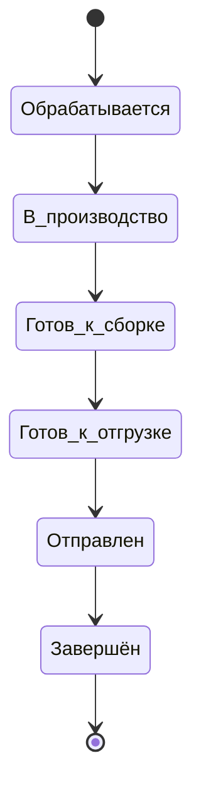

### 3.1 Состояние синхронизации с 1С и «требует внимания»

- В ЛК остаётся **ровно шесть** верхнеуровневых статусов заказа; они отражают согласованный маппинг из 1С.
- Ожидание создания заказа в 1С, ошибки HTTP/таймауты и сценарий «обрабатывает поддержка» задаются полем **`integrationSyncState`** (и при необходимости полями ошибки) в контракте заказа — см. `Техническая часть/order_lifecycle_contract.md`, `Техническая часть/openapi_client_mvp.yaml`.
- **UX:** при `integrationSyncState` ≠ `synced` не показывать пользователю формулировки вроде «уже в 1С»; при `failed` / `manual_review_required` — заметный блок/баннер («заказ принят, передача в 1С задерживается / обрабатывается поддержкой») и канал связи с менеджером по правилам продукта.

---

## 4. To-be: требования

### 4.1 Список заказов

- История заказов: список с датой, номером, суммой, статусом. Фильтры (период, статус) — опционально. Включить заказы, выполненные до появления ЛК, при наличии данных в 1С.
- Переход в детализацию заказа: состав (позиции, количество, цены), сроки производства и доставки, документы (счёт, УПД — см. ЧТЗ 02), статусы.
- Для загрузки истории заказов платформа должна хранить внешний идентификатор заказа в 1С и уметь связывать его с контрагентом/пользователем ЛК.

### 4.2 Детализация заказа

- На странице заказа: список позиций, сроки производства/доставки (из 1С), верхнеуровневый статус заказа, а также **детали способа получения** (см. §4.2.1). Ссылки на документы (счёт, УПД, ТТН, паспорт качества — по ЧТЗ 02). Трек-номер и контакты водителя при доставке своей машиной; трек ТК при доставке через ТК (ЧТЗ 03).
- Возможность «Повторить заказ»: выбор заказа из списка → копирование состава в корзину (ЧТЗ 01).
- Для документов, которые не хранятся на платформе постоянно, допускается сценарий «запросить из 1С по кнопке» в карточке заказа (например, УПД, акт сверки) — без локального хранения файла.

### 4.2.1 Способ получения: доставка, ТК, самовывоз (MVP, 2026-06-26)

Согласовано с **ЧТЗ 03** §4.7. В карточке заказа в ЛК **явно** отображаются:

| Способ | Что показывает клиенту |
|--------|------------------------|
| **Доставка Palizh** (своя машина) | Адрес доставки (из заказа/1С), ориентировочная дата, контакты водителя, delivery-события — по данным 1С |
| **ТК** | Адрес/ПВЗ по сценарию оформления, трек-номер, ссылка на отслеживание |
| **Самовывоз со склада** | Подпись **«Самовывоз»** и **адрес пункта выдачи:** **г. Ижевск, ул. Салютовская, 31** (канон — настройки контактов / `contacts:address` в `public-http-openapi.yaml`; **не** подменять адресом доставки клиента) |

**Ориентир для клиента:** при самовывозе после выставления счёта — забрать можно **на следующий рабочий день** после выполнения условий на стороне Palizh (оплата при предоплате, реализация, маршрут в 1С); точное время — по согласованию с менеджером (ЧТЗ 03 §3.3, §4.7).

**Вне scope:** «забор на маршруте» — **не** отображается как отдельный способ в ЛК (ЧТЗ 03 §4.6).

Источник: способ из оформления на платформе + delivery-поля из 1С (ЧТЗ 09).

### 4.3 Повтор заказа и недоступные позиции

- Повтор заказа должен работать не как слепое копирование исторических строк, а как повторная попытка добавить в корзину **актуальные для заказа позиции** по данным `1С`.
- Рабочая логика для MVP:
  - платформа при `Повторить заказ` ищет каждую позицию исторического заказа в актуальной выгрузке каталога / номенклатуры из `1С`;
  - если позиция есть в выгрузке и доступна к заказу, она добавляется в корзину;
  - если позиция помечена как архивная / снятая с производства, но при этом из `1С` приходит, что остаток **больше 0**, такая позиция **должна добавляться в корзину**;
  - если позиция помечена как архивная / снятая с производства и остаток **0**, позиция в корзину **не добавляется**;
  - по завершении операции пользователь получает pop-up: `Часть товаров не смогли добавить в корзину`, со списком исключённых позиций и причиной.
- Для MVP **не блокировать повтор заказа целиком**, если часть позиций недоступна: в корзину должны попадать те позиции, которые можно заказать сейчас.
- История заказа при этом должна сохранять все исходные позиции, даже если часть из них уже недоступна к повторному заказу.

### 4.4 Отображение архивной номенклатуры в истории

- Для истории заказов и повторного заказа платформа должна уметь отличать:
  - актуальную номенклатуру;
  - архивную / снятую с производства номенклатуру;
  - временно скрытую номенклатуру, которая позже может вернуться в продажу.
- Рабочее допущение по обмену с `1С`:
  - номенклатура не должна просто исчезать из интеграционного контура без следа;
  - из `1С` должен приходить признак состояния номенклатуры (например, пометка на удаление / архивность / недоступность к заказу);
  - на стороне платформы допустима логика: если номенклатура помечена в `1С` и остаток `0`, она уходит в архив витрины; если пометка снята, позиция может вернуться из архива.
- Это необходимо не только для повтора заказа, но и для будущей логики подбора аналогов после MVP: без сохранения связи с исторической номенклатурой такой сценарий не построить.

### 4.5 Статусы

- Отображение **шести** верхнеуровневых статусов на основании данных из 1С (заказ клиента, производство, реализация, расходный ордер, отгрузка, завершение доставки), когда заказ **уже синхронизирован** (`integrationSyncState` = `synced`). Наименования и перечень фиксируются единообразно с ЧТЗ 03 и 09.
- До синхронизации или при ошибке обмена — отображение статусной строки согласовано с контрактом (обычно `processing` как плейсхолдер) **вместе** с состоянием `integrationSyncState` и баннером; источник статусов из 1С в этот момент ещё не актуален.
- Трекинг: для ТК — трек-номер и ссылка на отслеживание; для своей доставки — контакты водителя, при наличии — ориентировочная дата и вспомогательные delivery-события (по данным 1С/GPS). Эти данные не создают новых верхнеуровневых статусов ЛК.
- Источник статусов должен быть единым: платформа не рассчитывает статусы самостоятельно, а отображает согласованный маппинг событий/документов 1С → статусы ЛК (см. ЧТЗ 09).

### 4.6 Остатки по заказу

- Возможность посмотреть наличие и остатки по товарам в заказе — по Пониманию задачи. Реализация: запрос к 1С по номенклатуре заказа и отображение актуальных остатков (частота обновления — уточнить).

---

## 5. Открытые вопросы

- ~~Точная привязка шести статусов к событиям/документам в 1С~~ — зафиксировано как интеграционная задача и синхронизировано с ЧТЗ 09.
- Нужна ли фильтрация и поиск по заказам (по номеру, дате, статусу)?
- Какие внешние идентификаторы заказа, реализации, маршрута и документов нужно хранить на платформе для корректной детализации заказа, трекинга и повторных запросов в 1С.
- Каким именно полем / набором полей `1С` будет передавать на платформу состояние номенклатуры для сценария `повтор заказа`: пометка на удаление, архивность, признак доступности к заказу, остаток.
- Нужен ли после MVP механизм подбора аналогов для архивных позиций, и где будет вестись таблица соответствий аналогов (`1С` / платформа).

---

## 6. Связь с другими ЧТЗ

| Блок | Связь |
|------|--------|
| Процесс оформления заказа | Корзина, оформление, повтор заказа (ЧТЗ 01) |
| Документооборот | Счёт, УПД, доступ к документам по заказу (ЧТЗ 02) |
| Доставка | Статусы доставки, трекинг, контакты водителя (ЧТЗ 03) |
| Интеграция с 1С | Заказы, статусы, остатки (ЧТЗ 09) |


---

<!-- notebooklm-source: ЧТЗ/09_интеграция_1С.md -->

# ЧТЗ: Интеграция с 1С

**Статус:** актуально
**Источники:** Понимание задачи, ЧТЗ 01–08, саммари интервью 2026-02-24, 2026-03-02 (статусы заказа), 2026-03-04 (доставка, бонусы, цены, поиск), 2026-03-13 (1С обмен данными; по сети см. актуализацию в §4.1 — без VPN, white list IP), 2026-03-17 (претензии), [демо прототипов 2026-04-15](../Интервью%20и%20встречи/Саммари/2026-04-15_демо_прототипов_саммари.md), подготовка к интервью с 1С ([05_процессы_1С_вопросы.md](../Интервью%20и%20встречи/План%20Интервью/05_процессы_1С_вопросы.md)), [Интеграция_1С](../Техническая%20часть/Интеграция_1С.md).  
**As-is / To-be:** as-is — обмена с внешней платформой **нет**; все данные (заказы, документы, контрагенты) только в 1С; заказы поступают от менеджеров. to-be — обмен новым сайтом/ЛК с 1С (разделы 3–4). **Контекст:** ЛК менеджера в системе нет; оперативная переписка с клиентом — через **внешние каналы** (в т.ч. встроенный на сайт чат-виджет стороннего сервиса, почта, мессенджеры); маршрутизация чата **вне scope** платформы. Вся документация по заказу для клиента получается из 1С через платформу; обмен предполагается по API (механизм — уточнить на интервью с 1С).

---

## 1. Назначение

Описывает обмен данными между платформой и 1С: направление потоков, перечень сущностей, базовые правила синхронизации. 1С — источник истины по товарам, ценам, контрагентам, заказам, документам и операционным правилам доставки (маршруты, delivery-детали). **Порог бесплатной доставки для отображения в корзине/оформлении в MVP** задаётся на платформе (админка); в 1С уходит согласованный заказ — см. ЧТЗ 03. Платформа передаёт в 1С заказы и заявки; получает из 1С **каталог** (номенклатура инициируется **из 1С** — push, см. §4.1), остатки, цены, статусы заказов и доставки, документы для ЛК. Цель — единая спецификация обмена для разработки и согласования с командой 1С.

---

## 2. Термины (общие)

| Термин | Описание |
|--------|----------|
| Контрагент | Справочник 1С: реквизиты, договор, соглашение (условия оплаты, отсрочка) |
| Заказ клиента | Документ 1С — заявка на покупку; после обработки — реализация, маршрут |
| Правила доставки | Направления, маршруты, delivery-детали — из 1С; **порог бесплатной доставки для UI в MVP** — настройка платформы (ЧТЗ 03) |
| Внешний идентификатор | GUID/ID сущности в 1С, который платформа хранит для привязки контрагента, договора, заказа, документа и статуса |

---

## 3. To-be: направления обмена платформа ↔ 1С

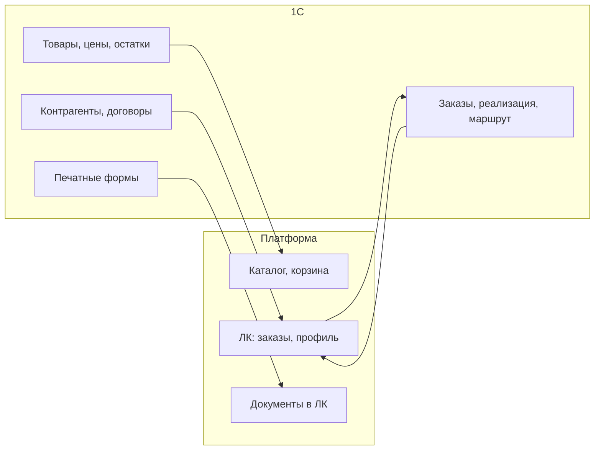

### 3.1 Платформа → 1С

| Сущность | Назначение |
|----------|------------|
| Заказ клиента | Состав (позиции, количество), контрагент, **адрес доставки** (выбранный клиентом из **сохранённых на платформе** и/или **новый** — см. п. 4.8), контакт, способ доставки в терминах, согласованных с ЧТЗ 01 и 03. Создание документа «Заказ клиента» в 1С. |
| Заявка «стать клиентом» | Передача реквизитов (ИНН, КПП, контакты) и **GUID заявки**, сгенерированного на платформе, для ручного заведения/привязки контрагента, договора и соглашения в 1С менеджером. GUID записывается **в карточку контрагента** как внешний ID, по которому платформа в дальнейшем понимает, что заявка одобрена и контрагент активирован. |
| Запрос акта сверки / претензия | **Акт сверки:** передача в `1С` параметров запроса (контрагент, период, идентификатор запроса с платформы) для **инициации формирования** документа; ответ — файл/ссылка/статус отложенного формирования (см. ЧТЗ 02). Целевое развитие после согласования — **минимизировать роль менеджера** как промежуточного канала; текущие формулировки ЧТЗ 02 сохраняются до отдельного решения (п. 4.8 ЧТЗ 02). **Претензия:** передача заявки для инициации процесса. Внутренний разбор претензии может идти вне `1С` (через `Mass Project`), но если для клиента в ЛК нужны подтверждённый результат, новые реализации / отгрузки, `УКД` и иные документы исполнения, они должны быть загружены/сформированы в `1С` и уже оттуда отдаваться на платформу. |
| Запрос документа из ЛК | Инициирование в 1С формирования/выдачи документа по кнопке из ЛК (например, УПД, акт сверки, паспорт качества) без постоянного хранения документа на платформе |
| Заявка на списание бонусов (после MVP) | Запрос от клиента на использование бонусов для оплаты заказа; уходит менеджеру / бухгалтерии для оформления документа списания в 1С (саммари 2026-03-04). |

### 3.2 1С → Платформа

| Сущность | Назначение |
|----------|------------|
| Товары, категории, свойства | Каталог для витрины (ЧТЗ 06). **Модель обмена (канон GitLab / стенд):** справочник атрибутов, типы номенклатуры, характеристики типа, шапка товара с **`attributes[]`**, дерево категорий — отдельные события `POST /exchange`; см. [`Техническая часть/Модель_данных_каталог_1С_обмен.md`](../Техническая%20часть/Модель_данных_каталог_1С_обмен.md). Фото, описания, статус доступности, **ссылка на маркетплейс**, персональная номенклатура (`counterpartiesGuid` / `exclusiveCounterpartyGuid` на платформе). |
| Цены | Отдельное событие **`sync.prices`**: пара `productGuid` + `characteristicGuid` + `priceTypeCode`, **`amount`** (за штуку), **`amountPerBox`** (за коробку, при наличии), `currency`; в API каталога также **`discountedAmount`**, **`discountedAmountPerBox`**. Виды цен (`RETAIL`/`WHOLESALE`/`BOX`) и персональная скидка (%) — см. саммари 2026-03-13, **ЧТЗ 01 §4.2.4**. Расчёт строки корзины (смешанная кратность) — **backend платформы**. **Для гостей цены не показываются.** |
| Остатки, сроки производства | Отдельное событие **`sync.stocks`**: `productGuid`, `characteristicGuid`, `stockQty` (только ненулевые/актуальные строки). Сроки производства — поле `productionTimeDays` в `sync.products` или по согласованию. |
| Контрагенты, договор, соглашение | Профиль компании, условия оплаты и доставки (ЧТЗ 07). |
| Заказы и статусы | История заказов, статус заказа и доставки (ЧТЗ 01, 08). |
| Документы (счёт, УПД, ТТН, паспорт качества, акт сверки) | Печатные формы или файлы для отображения/скачивания в ЛК (ЧТЗ 02). УПД по запросу из ЛК без хранения на платформе; акт сверки — по заявке из ЛК, формирование в 1С. |
| Правила доставки | Данные по способу доставки, маршруту, delivery-деталям и связанным правилам из 1С; порог бесплатной доставки для MVP хранится как настройка платформы (ЧТЗ 03, 12). |
| Номенклатура контрагента | Связь внутренних кодов с «чужими» кодами клиента — для поиска и подсказок (ЧТЗ 11). |
| Бонусы | Условия и типы бонусов, **текущий баланс** — из регистров 1С; **история операций в ЛК для MVP не передаётся/не показывается** (решение 2026-03-25, ЧТЗ 07). История и заявка на списание — после MVP. |
| Данные об упаковках | НаборУпаковок: количество в коробке/палете; для расчёта двух цен (кратно / некратно упаковке) в корзине (саммари 2026-03-04). |
| Договоры и допсоглашения | Файлы, прикреплённые к карточке договора в 1С; платформа получает их через API без внешнего хранилища (саммари 2026-03-13). |
| Паспорта качества | Печатная форма / PDF по конкретным партиям; в 1С есть признак клиента, для которого паспорта обязательны (саммари 2026-03-17). |

Актуальные **примеры payload** — в **`входящие/incoming-hooks.md`** (синхронизирован с каноном GitLab `docs/incoming-hooks.md`). **Модель каталога (канон GitLab / стенд, 2026-06-02):** `sync.product-attributes`, `sync.product-types`, `sync.product-type-characteristics`, `sync.products` (без вложенного `variants[]`, с `attributes[]`), `sync.stocks`, `sync.prices`, `sync.categories`, `sync.counterparties` — ER и порядок заливки в [`Техническая часть/Модель_данных_каталог_1С_обмен.md`](../Техническая%20часть/Модель_данных_каталог_1С_обмен.md).

---

## 4. To-be: требования

### 4.1 Способ и периодичность обмена

- **Принятое решение (интервью 2026-03-13, уточнение по номенклатуре — согласование с заказчиком):** общий подход — **сочетание** регламентных/пакетных и **событийных** механизмов. **Номенклатура (товары) и дерево категорий** — **не** регулярная выгрузка **по расписанию** с платформы; обмен **инициирует 1С**. При первичном наполнении 1С **последовательно** отдаёт порции (`sync.product-attributes` → `sync.product-types` → … → `sync.products` → `sync.stocks` → `sync.prices`, см. модель каталога), далее — **дельты**. **Цены и остатки** — отдельные события **`sync.prices`** / **`sync.stocks`** (допустима перезаливка среза таблицы со стороны 1С); периодичность пакетов **согласуется** с командой 1С. Входящий контур — `POST /exchange` (`openapi_1c_inbound_mvp.yaml`).
- **Транспорт:** HTTP/HTTPS, JSON. В 1С уже есть модуль интеграции с Яндекс.Маркетом, который может быть использован как донор для HTTP-сервисов и обработки ошибок.
- **Периодичность (высокоуровнево):** оформление заказа на платформе → отправка в 1С **по событию** (оформление); **статусы заказа и документы** в ЛК — **события** в сторону платформы. **Категории/номенклатура** — **без** опоры на таймер со стороны платформы; **остатки и цены** — не вносить в одну корзину с «расписанием каталога» (см. абзац выше).
- **Каталог (номенклатура и категории) — 2026-04-21 + согласование с заказчиком (инициатор 1С):**
  - **Первичное наполнение** (или пересбор) — **тем же инкрементальным** способом, **последовательными** пакетами, по **команде/событию** из 1С, **без** отдельного «движка полной выгрузки».
  - **В операционном режиме** — **дельты**; 1С **сама** вызывает API платформы **при изменениях** в 1С (не «опрос по расписанию» с платформы).
  - Резервный **опрос** категорий/номенклатуры **в 1С** (аналог `GET` в **ранних версиях** спеки) — **post-MVP**, в текущем `1c-http-openapi.yaml` **не** фиксируем; **наполнение витрины** — из **входящего** `POST /exchange` и публичных **`GET /products`**, **`GET /products/filters`** на платформе (канон — `Техническая часть/public-http-openapi.yaml`, см. `OpenAPI_индекс.md`). См. `Техническая часть/1C_API_контракт_и_этапы.md` §2.
- **Инициатор 1С → платформа (статусы заказа, документы):** при смене статуса заказа, появлении документов у контрагента/заказа — **тот же** вход: `POST /exchange` (см. `Техническая часть/Интеграция_1С.md` §4.3), после фиксации соответствующих значений `event` в OpenAPI. Отдельный `PUT` по заказу **не** используем — единая точка входа.
- **Контрагенты (вызовы платформы к 1С):** передача **одного контрагента по GUID** осмысленна; **массовая выгрузка всех контрагентов** в один запрос для интеграции не требуется (согласование 2026-04-21).
- **Атрибуты товаров:** в ответе по товару в общем случае приходят **идентификаторы атрибутов и значения**; отдельный метод «справочник атрибутов» (**`GET ProductAttributes`** или аналог) **не обязателен**, если метаданные атрибутов (название, тип) встроены в ответ **`GET products`** / карточки товара — выбор удобства для контракта 1С ↔ платформа (согласование 2026-04-21).
- **Тестовая 1С:** подтверждено наличие тестового контура (1С ERP 2.5.22, та же конфигурация и доработки, что в проде). **Сетевой доступ (согласовано с командой заказчика):** к HTTP-сервисам 1С — **без VPN**; со стороны платформы используются **фиксированные исходящие IP** окружений (dev / stage / prod), на стороне заказчика — **белый список IP**; отдельная учётная запись или иной способ аутентификации приложения — по договорённости с ИТ заказчика.
- **Регламентный перезапуск сервера 1С около 05:00** (саммари 2026-03-13): рестарт ОС, SQL, 1С и Apache. Интеграция должна быть толерантна к краткосрочной недоступности (ретраи, буферизация через очередь).
- Остаётся зафиксировать: по сущностям, где допускается расписание (цены, остатки и т.д.) — частоту регламентных заданий; **по каталогу номенклатуры** — сценарий **последовательной** первичной/пересборочной отдачи, сигналы изменения в 1С и лимиты на пакеты/дельты; а также формат ответов при ошибках, retry-политику и мониторинг.
- **Техконтракт API (детальные JSON-схемы по сущностям, полное выравнивание с OpenAPI):** финальная проработка **отложена** до появления **базовых HTTP-сервисов на сервере 1С** и приёмочной проверки реальных вызовов; после этого — новые вводные от заказчика/команды 1С и фиксация полей (см. [Реестр открытых вопросов](../Интервью%20и%20встречи/Реестр_открытых_вопросов.md) №18, №49). До этапа готовности 1С достаточно принципов из настоящего ЧТЗ и `Техническая часть/Интеграция_1С.md`.

### 4.2 Идемпотентность и ошибки

- Повторная отправка заказа с тем же идентификатором не должна создавать дубликат в 1С.
- Обработка ошибок (отказ 1С, таймаут): политика повторов (retry/backoff), уведомление менеджерам / поддержке (ЧТЗ 10), опционально — уведомление клиенту после согласования текста.
- **ЛК:** клиентское «требует внимания» реализуется через **`integrationSyncState`** (`failed`, `manual_review_required`) и баннер/блок в карточке заказа, а **не** как седьмое значение `OrderStatus` — см. `Техническая часть/order_lifecycle_contract.md` §5.2, поля заказа в `Техническая часть/openapi_client_mvp.yaml` (`OrderSummary`).
- Пока заказ не принят в 1С, в API допустимо `oneCOrderGuid: null` и `integrationSyncState: pending`; после успешного создания документа — `synced` и известный GUID.

### 4.3 Безопасность

- Аутентификация и авторизация вызовов к 1С (ключи, сертификаты, токены, **mTLS** и т.п.) в сочетании с **белым списком исходящих IP** платформы на стороне заказчика (**VPN для доступа к 1С не используется** — согласование с командой заказчика).
- Требуется зафиксировать доступы отдельно для `prod` и тестового контура 1С, а также ответственного за выдачу/ротацию доступов.

### 4.4 Маппинг статусов заказа (платформа ↔ 1С)

Шесть статусов заказа в ЛК (см. ЧТЗ 08) должны быть привязаны к событиям/документам в 1С. Требуется зафиксировать соответствие:

| Статус на платформе | Событие/документ в 1С (уточнить) |
|---------------------|-----------------------------------|
| Обрабатывается | Заказ клиента создан |
| В производство / производится | Заказ на производство создан |
| Готов к сборке | Реализация создана, расходный ордер не проведён |
| Готов к отгрузке | Расходный ордер проведён, партия скомплектована |
| Отправлен | Задание на перевозку / маршрут; факт отгрузки |
| Завершён | Доставка завершена (или закрытие заказа) |

Принцип отображения в ЛК:

- перечисленные выше 6 статусов являются **единственной верхнеуровневой шкалой статусов заказа**;
- события доставки (`маршрут создан`, `назначен водитель`, `точка прохождения маршрута`, `трек-номер ТК`) не становятся отдельными верхнеуровневыми статусами, а отображаются как детали внутри заказа;
- передача признака `своя машина` vs `ТК` с 1С на платформу нужна для выбора набора деталей: трек-номер и ссылка ТК либо контакты водителя и данные по своей доставке.

Источник данных водителя (ФИО, телефон, ТС) — документ задания на перевозку в 1С (формируется логистом при планировании машины).

### 4.5 Идентификаторы и связывание сущностей

- Для каждой сущности обмена нужно согласовать внешний идентификатор 1С, который хранится на платформе:
  - контрагент;
  - договор / соглашение;
  - заказ клиента;
  - документ (счёт, УПД, ТТН, паспорт качества, акт сверки);
  - номенклатура и номенклатура контрагента.
- Для сценария онбординга платформа дополнительно генерирует **GUID заявки/будущего клиента**, который передаётся в 1С и хранится в **карточке контрагента** как внешний ID; по нему платформа понимает, к какому контрагенту относится одобренная заявка и можно ли создавать учётную запись ЛК (см. ЧТЗ 05).
- Рабочее допущение для реализации текущего этапа:
  - `GUID заявки` хранится в **карточке контрагента** в 1С;
  - признак `активность`, разрешающий доступ к платформе, также хранится в **карточке контрагента**;
  - договор и соглашение остаются связанными сущностями 1С, но не используются как первичная точка проверки факта одобрения заявки платформой.
- Платформа должна передавать в 1С собственный идентификатор запроса/заказа и хранить ответный ID 1С для исключения дублей и поддержки повторных запросов.
- При повторной отправке заказа с тем же внешним идентификатором 1С не должна создавать дубликат; сценарий идемпотентности требуется согласовать отдельно.

### 4.6 Номенклатура, архив и повтор заказа

- Для сценария `Повторить заказ` платформа должна получать из `1С` не только идентификатор и остаток номенклатуры, но и **признак её текущего состояния**:
  - активна и доступна к заказу;
  - снята с производства / архивная;
  - помечена на удаление;
  - временно недоступна, но сохранена в истории.
- Рабочая логика для MVP:
  - если номенклатура приходит из `1С` и её остаток **больше 0**, позиция может участвовать в повторе заказа, даже если товар снят с производства;
  - если номенклатура помечена как архивная / снятая с производства и остаток **0**, позиция не должна попадать в корзину повторного заказа;
  - при этом сама номенклатура должна сохраняться в истории заказов и в интеграционных связях, чтобы не терять историю клиента и возможность будущего подбора аналогов.
- Рабочее допущение по обмену:
  - `1С` может передавать номенклатуру с признаком пометки / архивности, а платформа уже применяет правило отображения;
  - если на стороне `1С` архивная пометка снята, платформа должна уметь возвращать позицию из архива в активный каталог / сценарий повторного заказа.
- Для MVP не требуется автоматический подбор аналогов, но данные по исторической номенклатуре должны сохраняться так, чтобы после MVP можно было добавить таблицу аналогов.

### 4.7 Источники документов и границы интеграции

- Документы по заказу для MVP (`счёт`, `УПД`, `ТТН`, `паспорт качества`, `акт сверки`) считаются частью интеграции с 1С: либо 1С формирует их по запросу, либо отдаёт ссылку/файл в утверждённом формате.
- Для документов, которые должны отображаться в ЛК клиента, принимается рабочее правило: **источником выдачи для платформы является 1С**. Если `TDS/MSDS`, `паспорта безопасности`, `СГР` или иные дополнительные документы нужны в ЛК, они должны быть предварительно загружены/привязаны в 1С и уже оттуда отдаваться на платформу.
- Если дополнительный документ не загружен в 1С, он остаётся вне автоматизированного контура ЛК и выдаётся менеджером вручную вне платформы.
- Для блока претензий действует то же правило границы: внутренний бизнес‑процесс может вестись в `Mass Project`, но в текущем `MVP` клиентский ЛК получает только факт отправки претензии и хранит карточку в истории.
- Для `MVP` претензия не требует интеграции статусов из `Mass Project` или `1С`: дальнейшие этапы разбора и исполнения происходят за пределами платформы.
- После `MVP` можно вернуться к сценарию, где в платформу приходят документы исполнения (`новые реализации / отгрузки`, `УКД`, возвраты, корректировки и иные объекты исполнения) и обновления по претензии.
- Для каждого документа требуется зафиксировать режим выдачи:
  - online по запросу из ЛК;
  - предварительная выгрузка/кэш на платформе;
  - выдача через ЭДО или только в виде PDF/печатной формы 1С.

### 4.8 Адреса доставки (платформа ↔ 1С)

- **Ввод на платформе (решение 2026-06-02):** новый адрес вводится на **фронтенде** через **DaData** (подсказки, выбор из списка); на бэкенд и в 1С уходит **однострочная отформатированная строка** `deliveryAddress` — канон: **`unrestricted_value`** из ответа DaData. Опционально платформа хранит `deliveryAddressFiasId` (`data.fias_id`) для идентификации адреса без повторного разбора строки. Подробнее — ЧТЗ 01 §4.1.2.
- **Хранение на платформе:** для авторизованного контрагента хранится **список адресов доставки**, ранее введённых пользователем (строка + при наличии FIAS ID); при оформлении заказа клиент выбирает один из сохранённых или добавляет **новый** через DaData.
- **Передача в 1С:** выбранный/новый адрес **передаётся в составе заказа** полем `deliveryAddress` (строка); в HTTP-сервис 1С — см. `1c-http-openapi.yaml`, `входящие/1c-http-openapi.yaml`. Маппинг на поле документа «Заказ клиента» — в `Маппинг_API_1С.md` (уточняется с разработчиком 1С).
- **Опционально (развитие):** подстановка адреса по умолчанию из карточки партнёра/контрагента в `1С`, если данные там заполнены и согласованы с UX; до согласования **не считать** обязательным для `MVP`.

---

## 5. Открытые вопросы

Часть вопросов по интеграции уже **частично прояснена** по итогам интервью 2026‑03‑13 (см. также `Техническая часть/Интеграция_1С.md`, раздел 5.1, и саммари `2026-03-13_1С_обмен_данными_саммари.md`), но до финальной фиксации деталей реализации они остаются в списке.

- **Механизм обмена (детали):** конкретный способ (REST, файлы, очередь/шина); для **номенклатуры/категорий** зафиксировано: **push из 1С** (см. §4.1). Для **остальных сущностей** — сочетание расписания и вебхуков/событий — уточнить на [интервью с 1С](../Интервью%20и%20встречи/План%20Интервью/05_процессы_1С_вопросы.md). Версия/конфигурация 1С и ограничения по API — там же.
- **Тестовая 1С:** наличие, степень готовности к интеграции, кто выдаёт доступ и согласует форматы.
- ~~Привязка шести статусов заказа к событиям/документам в 1С~~ — зафиксировано как часть интеграционного контура (синхронизировано с ЧТЗ 08 и реестром).
- ~~Передача статусов своей доставки из 1С на платформу~~ — для MVP зафиксирована передача ключевых delivery-данных в карточку заказа (дата/контакты); детализация событий маршрута остаётся на уровне интеграционной спецификации.
- **Синхронизация контрагентов:** частично прояснено (2026-04-21) — запрос контрагента по **одному GUID**, без необходимости отдавать «всех контрагентов» одним вызовом; остаётся детализировать частоту обновления профиля в ЛК при изменениях в 1С (событие vs опрос).
- Какие GUID/внешние ID 1С должны храниться на платформе для контрагента, договора, заказа и документов; как обеспечивать идемпотентность при повторах и сбоях. Рабочее допущение по онбордингу уже принято: `GUID заявки` и флаг `активность` живут в карточке контрагента.
- **Сетевой доступ:** ~~VPN~~ — **не используется**; доступ по **белому списку IP** исходящих запросов платформы (в т.ч. для тестового контура — отдельные IP или отдельное правило списка). **Остаётся зафиксировать:** схема **аутентификации приложения** к HTTP-сервисам 1С (токен, Basic, сертификат и т.д.), ротация секретов, отдельные учётные данные для `test` и `prod`.
- Каким именно полем / контрактом `1С` будет передавать состояние номенклатуры для платформы: пометка на удаление, архивность, признак доступности к заказу, дата снятия с производства и т.д.
- Какие дополнительные документы (`TDS/MSDS`, `паспорта безопасности`, `СГР` и др.) должны быть заведены в 1С для выдачи в ЛК в рамках MVP, а какие остаются вне ЛК и выдаются менеджером вручную.
- Для файлов документов: рабочее допущение на текущем этапе — ограничения по размеру не ожидаются, и документов **более 10 МБ не планируется**. Формат `base64` в JSON допустим для MVP, но точный контракт передачи имени, типа и размера файла всё равно нужно формализовать.
- После `MVP`: нужно ли возвращать на платформу статусы и документы исполнения по претензии, и если да — каким именно объектом / событием `1С` или внешнего контура это подтверждается.
- **Образцы документов для проектирования:** форматы выдачи из 1С (счёт, УПД, ТТН, паспорт качества, акт сверки) — см. [Реестр документов для проектирования](../Интервью%20и%20встречи/Реестр_документов_для_проектирования.md) (Реестр открытых вопросов № 25). Полный перечень документов и данных 1С ↔ платформа — в [05_процессы_1С_вопросы.md](../Интервью%20и%20встречи/План%20Интервью/05_процессы_1С_вопросы.md) (разделы 4–5).

---

## 6. Связь с другими ЧТЗ

| Блок | Связь |
|------|--------|
| Витрина и каталог | Товары, цены, остатки (ЧТЗ 06) |
| Процесс оформления заказа | Отправка заказа в 1С, получение статусов (ЧТЗ 01) |
| Документооборот | Получение печатных форм из 1С (ЧТЗ 02) |
| Доставка | Операционные данные доставки из 1С (маршрут, delivery-детали); порог бесплатной доставки для UI — админка платформы (ЧТЗ 03, 12) |
| ЛК профиль и компания | Контрагент, договор, соглашение (ЧТЗ 07) |
| ЛК заказы и статусы | Заказы, статусы, остатки по заказу (ЧТЗ 08) |
| Реестр документов для проектирования | [Интервью и встречи / Реестр документов для проектирования](../Интервью%20и%20встречи/Реестр_документов_для_проектирования.md) — образцы документов для проектирования обмена (печатные формы, форматы выдачи из 1С) |
| План интервью с 1С | [05_процессы_1С_вопросы.md](../Интервью%20и%20встречи/План%20Интервью/05_процессы_1С_вопросы.md) — контекст (нет ЛК менеджера; внешние каналы и чат-виджет; документы из 1С), вопросы по API/расписанию/вебхукам/шине, тестовая 1С, полный список документов и данных для обмена |
| Техническая часть: интеграция 1С | [Интеграция_1С.md](../Техническая%20часть/Интеграция_1С.md) — архитектурный подход, подготовка к интервью, сводная таблица данных 1С ↔ платформа |
| Саммари интервью | [2026-03-13 1С обмен](../Интервью%20и%20встречи/Саммари/2026-03-13_1С_обмен_данными_саммари.md), [2026-03-04 доставка/бонусы/цены](../Интервью%20и%20встречи/Саммари/2026-03-04_доставка_бонусы_цены_уведомления_поиск_саммари.md), [2026-03-17 претензии](../Интервью%20и%20встречи/Саммари/2026-03-17_претензии_саммари.md), [2026-04-15 демо прототипов](../Интервью%20и%20встречи/Саммари/2026-04-15_демо_прототипов_саммари.md) |
| Примеры печатных заказов из 1С | [Реестр документов для проектирования](../Интервью%20и%20встречи/Реестр_документов_для_проектирования.md) (№ 15, файлы `Заказ_*.pdf`); маппинг полей на OpenAPI — `openapi_client_mvp.yaml` (`unit`, `vatAmount`, `itemsCount`) |


---

<!-- notebooklm-source: ЧТЗ/10_уведомления.md -->

# ЧТЗ: Уведомления

**Статус:** актуально
**Источники:** Понимание задачи, ЧТЗ 01, 03, 09, саммари интервью 2026-02-24, 2026-03-04 (уведомления, каналы), 2026-03-17 (претензии, уведомления).  
**As-is / To-be:** as-is — информирование **без** платформы: менеджер отправляет счёт по email/Telegram; после отгрузки — рассылка с данными водителя по email; дату доставки клиент уточняет у менеджера. to-be — автоматические уведомления с платформы (события, **канал email**, настройки в ЛК) — разделы 3–4.

**Решение по каналам (актуализация):** на текущем этапе проекта платформа **не планирует** интеграцию **SMS** и **push**; клиентские и внутренние уведомления, инициируемые **платформой**, идут **только в email**. **Уведомления в контуре чат-виджета** (оператору и/или посетителю) обеспечивает **сервис виджета**, не Palizh.

---

## 1. Назначение

Описывает события, по которым клиенту или внутренним адресатам отправляются уведомления **с платформы**, канал **email**, настройки в ЛК и интеграцию с сервисом рассылки email. Цель — клиент своевременно узнаёт о счёте, оплате, отгрузке, доставке и других событиях без необходимости звонить менеджеру.

---

## 2. Термины (общие)

| Термин | Описание |
|--------|----------|
| Событие | Триггер уведомления (новый заказ принят, счёт готов, оплата поступила, заказ отгружен и т.д.) |
| Канал платформы | **Email** — единственный канал, реализуемый платформой на текущем этапе |
| Чат-виджет | Сторонний сервис; push/SMS/email внутри чата — **вне** ЧТЗ платформы |

---

## 3. To-be: события и канал платформы

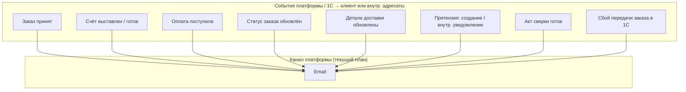

**Вне диаграммы:** SMS, push и иные каналы — **не** входят в текущий план платформы; могут обсуждаться заново при появлении мобильного приложения или отдельного решения заказчика. **Чат-виджет** — уведомления и доставка сообщений по правилам поставщика виджета.

Дополнительная детализация событий и источников — в документе `Матрица_статусов_и_источников.md`.

---

## 4. To-be: требования

### 4.1 Список событий

- Заказ принят платформой / зарегистрирован в 1С (не путать: подтверждение в 1С может быть позже момента `POST /orders` — см. `integrationSyncState` в `order_lifecycle_contract.md`).
- Счёт выставлен / готов к оплате (доступен в ЛК, отправка на **email**).
- Оплата поступила (при предоплате — для информирования по **email**).
- Изменение одного из **6 верхнеуровневых статусов заказа** в ЛК: `Обрабатывается`, `В производство / производится`, `Готов к сборке`, `Готов к отгрузке`, `Отправлен`, `Завершён`.
- Обновление **деталей доставки** внутри заказа (ориентировочная дата / слот, контакт водителя, трек-номер ТК и т.д.) — уведомление клиенту по **email**, если событие признано значимым.
- Претензия:
  - отправлена клиентом через ЛК;
  - внутренняя команда получает уведомление на настроенные **email**-адреса;
  - **клиенту** — email подтверждения приёма по настраиваемому шаблону в админке (как для нестандартной заявки);
  - дальнейшее сопровождение претензии происходит за пределами платформы.
- **Общее обращение** в ЛК из раздела «Обращения и претензии» (контекст заказа):
  - внутреннее уведомление на email;
  - **клиенту** — подтверждение приёма по шаблону в админке;
  - **история** отправленных обращений в ЛК (как у претензий и нестандартных заявок).
- **Заявка на обучение:**
  - платформа отправляет **внутреннее уведомление** на email адресатов из админки;
  - в ЛК — история со статусом `Отправлено` (статус не меняется).
- **Нестандартная заявка / обращение к менеджеру** из ЛК (обязательный текст запроса, опционально вложения — ЧТЗ 01 §4.5):
  - **внутреннее уведомление** на email по типу маршрутизации «нестандарт / обращение к менеджеру»;
  - **клиенту** — email **подтверждения приёма заявки** по **настраиваемому шаблону** в админке (тема, текст, подстановки: компания, пользователь, дата, при необходимости — номер/ид записи);
  - уточнение деталей, КП и сделка — **вне платформы**;
  - в ЛК — **история** отправленных заявок, у каждой записи статус **`Отправлено`** (без дальнейших обновлений с платформы в MVP).
- Акт сверки сформирован / отправлен.
- Доступ в ЛК одобрен (после онбординга).
- **Сбой доставки заказа в 1С:** внутреннее уведомление на email адресатам из админки; опционально отдельное письмо клиенту после согласования формулировки.

Принцип для текущего этапа:

- не дублировать каждое техническое событие 1С отдельным письмом;
- опираться на верхнеуровневые статусы заказа и значимые delivery-детали.

### 4.2 Чат и обратная связь

- **Онлайн-консультанта на платформе не предусмотрено.** Обращения через **формы** платформы (витрина, ЛК, претензии, нестандартная заявка) маршрутизируются в **email** по настройкам админки (ЧТЗ 12).
- **Чат-виджет** стороннего сервиса: доставка сообщений, **уведомления операторам и посетителям в рамках чата**, возможные SMS/push со стороны виджета — **полностью на стороне поставщика виджета**; в Palizh не настраивается и в ЧТЗ платформы не детализируется.

### 4.3 Каналы

- **Email** — единственный канал уведомлений, реализуемый платформой на текущем этапе; сервис рассылок (интеграция). Шаблоны писем, подпись, отправитель — в админке или конфигурации.
- **SMS и push** — **не планируются** для платформы на текущем этапе; при появлении мобильного приложения или нового решения заказчика — отдельное согласование и правка ЧТЗ.
- В ЛК: раздел «Уведомления» — лента/история информационных сообщений от компании (источник событий — платформа/email-рассылки по Пониманию задачи).
- Для внутренних обращений и заявок — настраиваемая маршрутизация **email** в админке (типы: претензии, нестандарт / обращение к менеджеру, обучение, «стать клиентом», обратная связь, при необходимости документы, сбои синхронизации заказов).
- Для запуска должны быть заданы адресаты как минимум для **претензий** и **заявок на обучение**.

### 4.4 Настройки в ЛК

- Настройки уведомлений хранятся **на платформе**, не в 1С.
- На текущем этапе клиенту в профиле достаточно управления **подпиской на email** по **типам событий** (какие письма получать). Выбор SMS/push **не** показывать, пока каналы не введены в продукт.
- Детализация полей — в ЧТЗ 07; при смене политики каналов — синхронно обновить ЧТЗ 07 и настоящий документ.

### 4.5 Регламент шаблонов и переменных (рабочий документ)

Коды шаблонов **`EMAIL_*`**, примеры тем/тел и справочник плейсхолдеров (в т.ч. динамическая `{link}`) — в **[`Техническая часть/Email_уведомления_MVP_регламент_и_переменные.md`](../Техническая%20часть/Email_уведомления_MVP_регламент_и_переменные.md)** (источник: материалы NotebookLM, 2026-05-27). При внедрении админки сверять с настоящим ЧТЗ и `Задание_разработчику_админка_MVP.md`.

### 4.6 Интеграция

- Вызов сервиса **email**-рассылок по событиям с платформы или по данным, пришедшим из 1С. Передача: шаблон, получатель, данные для подстановки.
- Для событий из 1С согласовать: как событие попадает на платформу (API, расписание, вебхук); внешние ID; источник истины по факту отправки письма.
- Претензии, заявки на обучение, **нестандартные заявки** — правила **внутреннего** email при создании; дополнительно для перечисленных типов (и при необходимости для **общего обращения** из ЛК в разделе «Обращения и претензии») — **шаблоны писем клиенту** (подтверждение приёма); клиентские статусы в MVP — в соответствующих ЧТЗ.

---

## 5. Открытые вопросы

- Нужны ли напоминания (например, «оплатите счёт до даты») и повторные письма при просрочке?
- Какие события инициируются из 1С, а какие генерирует платформа без ожидания 1С.
- Какие delivery-детали считаются значимыми для отдельного письма клиенту.
- После появления мобильного приложения: нужны ли push и как согласовать с email.

---

## 6. Связь с другими ЧТЗ

| Блок | Связь |
|------|--------|
| Процесс оформления заказа | События: заказ, счёт, оплата (ЧТЗ 01) |
| Доставка | События: отгрузка, дата доставки, контакты водителя (ЧТЗ 03) |
| ЛК профиль | Настройки уведомлений (ЧТЗ 07) |
| Претензии | Статус претензии (ЧТЗ 04) |
| Интеграция с 1С | Источник событий по заказам, документам, оплате и доставке (ЧТЗ 09) |
| Саммари интервью | [2026-03-04](../Интервью%20и%20встречи/Саммари/2026-03-04_доставка_бонусы_цены_уведомления_поиск_саммари.md), [2026-03-17](../Интервью%20и%20встречи/Саммари/2026-03-17_претензии_саммари.md) |
| Регламент email MVP | [`Email_уведомления_MVP_регламент_и_переменные.md`](../Техническая%20часть/Email_уведомления_MVP_регламент_и_переменные.md) — коды `EMAIL_*`, переменные |


---

<!-- notebooklm-source: ЧТЗ/11_поиск.md -->

# ЧТЗ: Поиск

**Статус:** актуально  
**Источники:** Понимание задачи, ЧТЗ 06 (витрина и каталог; атрибуты и фильтры — §4.2.0), интервью 2026-03-04 (§5).  
**As-is / To-be:** as-is — раздел 3; to-be — разделы 4–5.

---

## 1. Назначение

Описывает **поведение поиска товаров** на витрине: по каким полям каталога ищем, как формируется выдача, правила видимости, UX и контракт API `GET /search/products`.

**Не входит в этот документ:** выбор и настройка поискового движка (PostgreSQL full-text, `ILIKE`, Laravel Scout и т.д.). **Внешние сервисы** (Ensi Cloud Search, SearchBooster, модуль поиска Bitrix) **на текущем этапе не внедряются** — поиск выполняется **на платформе** по данным каталога, импортированным из 1С.

Цель — клиент быстро находит товар по **артикулу**, **названию**, **бренду** и **свойствам** (например, «для полиуретана», «красный»).

---

## 2. Термины (общие)

| Термин | Описание |
|--------|----------|
| Поисковый запрос (`q`) | Строка, которую вводит пользователь в шапке витрины |
| Поисковая выдача | Список товаров, отсортированный по релевантности (§5.6), с учётом видимости (§5.7) |
| Facet-фильтры | Сужение листинга каталога через `GET /products/filters` — **не** часть поискового запроса (§5.9) |
| Номенклатура контрагента | В 1С: «чужие» названия/артикулы клиента — **post-MVP** для поиска (№34) |

---

## 3. As-is: как ищут товар сейчас (без витрины)

- Клиент ищет через **менеджера**, по **прайсу** или по **артикулу** в своей учётной системе.
- В 1С — по артикулу, наименованию, иногда по цвету и бытовым словам («концентрат», «паста»).
- **Номенклатура контрагента** в 1С связывает внутреннее и клиентское название — на витрине пока не используется.

---

## 4. To-be: контур поиска на витрине

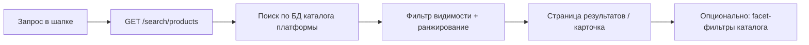

**Граница:** строка поиска → **поиск по каталогу**; сужение на листинге → **facet-фильтры** API (`GET /products/filters`), не смешивать в одном механизме (§5.9).

---

## 5. To-be: требования

### 5.1 Scope MVP

| Входит в MVP | Вне MVP / post-MVP |
|--------------|-------------------|
| Строка поиска в шапке, страница результатов | Поиск по заказам в ЛК (№46 — закрыт) |
| `GET /search/products` | Отдельный поиск внутри ЛК |
| Поиск по полям §5.5 | Ручной справочник синонимов в админке |
| Правила видимости §5.7 | **Номенклатура контрагента** в выдаче (№34) |
| Пагинация, сортировка по релевантности | Блок «аналоги» (маркетинг) |
| | «Умный» транслит, исправление опечаток, семантика — **желательно позже**; для MVP достаточно регистронезависимого поиска по подстроке / full-text (§5.4) |
| | Внешний поисковый движок (Ensi и др.) |

### 5.2 Пользовательские сценарии

| № | Сценарий | Ожидаемое поведение |
|---|----------|---------------------|
| S1 | Ввод **артикула** (`sku`) | Совпадение по `sku` / коду поиска — **в топе** выдачи; полное совпадение выше частичного |
| S2 | Запрос по **названию** Palizh | Совпадение по `name` (и при необходимости `brand`) |
| S3 | Бытовой запрос («концентрат», «красный», «для полиуретана») | Совпадение по **значениям атрибутов** (`attributes[]`), при наличии — по `description` |
| S4 | Несколько слов в запросе | Все значимые токены запроса должны **встретиться** хотя бы в одном из поисковых полей позиции (логика **AND** по словам; см. §5.4) |
| S5 | B2B ищет **персональную** позицию | Видит **общий** ассортимент; **персональная номенклатура контрагента** в поиске — **post-MVP** (№34), как на витрине |
| S6 | **Гость** | Общий ассортимент **без цен**; персональная номенклатура **скрыта** |
| S7 | Сужение после поиска | Переход в каталог с `q` и/или **facet-фильтры** (ЧТЗ 06 §4.2.0) |
| S8 | Ничего не найдено | `items: []`, empty state с подсказкой изменить запрос |

### 5.3 Интерфейс (витрина)

- Поле поиска в **шапке** на публичных страницах (Инфарх: страница «Поиск»).
- **Минимум 2 символа** (после trim) перед вызовом API; иначе — подсказка, без запроса.
- **Enter** / «Найти» → страница результатов, `q` в URL.
- **Suggest (автодополнение):** желательно, не блокер — от 2–3 символов, до 8–10 карточек (`GET /search/products?perPage=10`).
- **Страница результатов:** карточки как в листинге (`ProductCardSummary`); заголовок «Результаты поиска: {запрос}».
- **Пагинация:** `page`, `perPage` (default **24**).
- **Сортировка MVP:** только **релевантность** (§5.6); по цене/новизне — post-MVP.
- **Facet-фильтры на странице поиска:** post-MVP; ссылка «Смотреть в каталоге» с `q` — достаточно для MVP.
- **`catalogCode`:** опционально ограничить выдачу каталогом (розница / опт / бренды), если поиск из его контекста.

### 5.4 Обработка запроса `q`

| Правило | Деталь |
|---------|--------|
| Нормализация | `trim`, схлопывание пробелов, **регистр не важен** |
| Длина | Отклонять или обрезать **> 200 символов** → `400` |
| Токены | Разбить по пробелам; игнорировать токены короче **2 символов** (кроме чисто цифровых фрагментов артикула) |
| Логика слов | **AND:** каждый оставшийся токен должен найтись **хотя бы в одном** поле из §5.5 |
| Артикул | Символы `-`, `/`, `.` в `sku` **сохранять**; не ломать поиск по кодам вида `ABC-123` |
| Пустой результат | HTTP `200`, `items: []` |
| Описание | Участвует в поиске, но с **низким весом** (§5.6); длинные тексты не должны доминировать над артикулом/названием |

**MVP не обещает:** автоматическое исправление опечаток, транслит (`kraska` → `краска`), смену раскладки — это **улучшения post-MVP** или отдельное решение по движку.

### 5.5 По каким полям ищем (канон MVP)

Данные — из импорта 1С (`sync.products`, `sync.categories`, `sync.product-attributes`); см. [`Модель_данных_каталог_1С_обмен.md`](../Техническая%20часть/Модель_данных_каталог_1С_обмен.md).

| Приоритет | Поле / источник | Поле в обмене / API | Тип совпадения | Примеры запросов |
|-----------|-----------------|---------------------|----------------|------------------|
| **1** | Артикул | `sku` (`Code`, `КодДляПоиска` в 1С) | Точное и **префиксное**; токен целиком в `sku` | `PU-402`, `12345` |
| **2** | Наименование | `name` | Подстрока / full-text по словам | «акриловая краска», «грунт» |
| **3** | Бренд | `brand` | Подстрока | «Tikkurila» |
| **4** | Значения атрибутов | `attributes[].values[]` | Подстрока по каждому значению | «полиуретан», «фасад» |
| **4** | Подписи атрибутов (справочник) | `sync.product-attributes.label` для кода атрибута | Не ищем отдельно; только для UI | — |
| **5** | Текстовые значения характеристик | Имена/коды из `sync.product-type-characteristics` (`name`, при наличии `ral`, `hex`), если связаны с товаром и попадают в поисковый индекс платформы | Подстрока | «красный», RAL-код |
| **6** | Название категории | `sync.categories.name` (по `parentGuid` товара) | Подстрока | «лаки», «грунты» |
| **7** | Описание | `description` | Подстрока / full-text, **низкий вес** | «для наружных работ» |

**Не участвуют в текстовом поиске (MVP):**

| Поле | Назначение |
|------|------------|
| `guid`, `nomenclatureGuid`, `id` | Идентификация, ссылки |
| `slug` | URL, не поисковое поле для пользователя |
| `price`, остатки | Только **отображение** в карточке выдачи, не критерий поиска |
| `exclusiveCounterpartyGuid` | **Фильтр видимости**, не текстовый индекс |
| `isArchived`, `isAvailableForOrder` | **Фильтр включения** в выдачу |
| Числовые `attrRange` (плотность и т.д.) | Только **facet-фильтры** каталога, не строка поиска |

**Коды атрибутов MVP** (значения которых индексируются): `worktype`, `surface`, `special`, `compatibility`, `tintingMethod`, `density` (текстовая часть / label значений; числовой диапазон — через фильтры) — ЧТЗ 06 §4.2.0.

**Номенклатура контрагента (post-MVP, №34):** при появлении в обмене — отдельные поля «клиентский артикул / название» с фильтром по `counterpartyGuid` сессии; до этого не искать по «чужим» кодам клиента.

### 5.6 Ранжирование выдачи (MVP)

Порядок в `items[]` — от более релевантных к менее. Рекомендуемая шкала (реализация на backend, логика фиксируется в коде/тестах):

1. **Полное совпадение** `sku` с запросом (или с одним из токенов, если запрос — артикул).
2. **Префикс** `sku`.
3. Совпадение **в начале** `name`.
4. Совпадение **внутри** `name`.
5. Совпадение в `brand`.
6. Совпадение в **атрибутах** / характеристиках.
7. Совпадение только в `description`.
8. Совпадение только в **названии категории**.

При равной релевантности — стабильная вторичная сортировка (например, по `name` ASC).

### 5.7 Правила видимости и исключения из выдачи

Те же правила, что для `GET /products` (ЧТЗ 06 §4.2.1–4.2.2):

| Условие | В выдаче |
|---------|----------|
| `exclusiveCounterpartyGuid` задан и ≠ контрагент сессии (или гость) | **Нет** |
| `exclusiveCounterpartyGuid` = контрагент сессии | **Да** |
| `exclusiveCounterpartyGuid` null | **Да** (общий каталог) |
| Архив, остаток 0, недоступен к заказу | **Нет** (как на витрине) |
| `isAvailableForOrder = false` | **Нет** |
| Цены в карточках | Гость — без цен; B2B — по ЧТЗ 06 §4.2.4 |

Поиск **не должен** возвращать позиции, по которым `GET /products/{id}` даст **404** для текущего зрителя.

### 5.8 API платформы

**Канон стенда:** `GET /search/products` в **`public-http-openapi.yaml`** (GitLab `docs/`). Продуктовый черновик — `openapi_client_mvp.yaml` (синхронизировать при изменении контракта).

| Параметр | Обяз. | Правило |
|----------|-------|---------|
| `q` | да | `minLength: 1`, `maxLength: 200`; UI — не вызывать при &lt; 2 символов |
| `catalogCode` | нет | Ограничение каталога |
| `page`, `perPage` | нет | default 1 / 24, max `perPage` 100 |

**Ответ:** `SearchProductsResponse` — `query`, `items[]` (`ProductCardSummary`), `meta`.

**Цепочка backend (логика, без привязки к движку):**

1. Auth (опционально) → контекст контрагента.
2. Нормализация `q` (§5.4).
3. Поиск по полям §5.5 с фильтрами §5.7.
4. Ранжирование §5.6, пагинация.
5. Обогащение ценами/остатками для B2B (как листинг).

### 5.9 Граница поиска и facet-фильтров каталога

| Механизм | Назначение |
|----------|------------|
| `GET /search/products` | Текстовый поиск по §5.5 |
| `GET /products` + `attr[]`, `attrRange[]` | Facet-фильтры листинга |
| `GET /products/filters` | Схема фильтров для категории |

**Поток:** поиск → список SKU → карточка **или** каталог с `q` + фильтры. Поиск по заказам в ЛК — **вне MVP**.

**Актуальность данных:** выдача опирается на те же записи каталога, что и листинг после `sync.products` / `sync.categories` / `sync.product-attributes`; задержка не больше, чем у публичного каталога после обмена с 1С.

### 5.10 Нефункциональные требования

| Показатель | Ориентир MVP |
|------------|--------------|
| p95 `GET /search/products` | ≤ **1,5 с** (уточнить нагрузочным тестом) |
| Консистентность с каталогом | Те же правила видимости и архивности |
| Логирование | `q` (без ПДн), latency; аналитика запросов — post-MVP |

---

## 6. Открытые вопросы

- **№34:** выгрузка **номенклатуры контрагента** из 1С для поиска по клиентским названиям/артикулам.
- **№54:** фактическое **заполнение атрибутов** в 1С — без данных поиск по свойствам (S3) будет слабым.
- Suggest в шапке — отдельный endpoint или укороченный search.
- Facet-фильтры на странице результатов — MVP или post-MVP.
- Транслит / опечатки / «умный» поиск — post-MVP или отдельное решение.
- ~~Поиск по заказам в ЛК~~ — закрыто (№46): только каталог.
- ~~Ensi Cloud Search как обязательный движок~~ — **снято (2026-06-02):** поиск на платформе; Ensi/Bitrix — не внедряем на текущем этапе.

---

## 7. Связь с другими ЧТЗ

| Блок | Связь |
|------|--------|
| Витрина и каталог | Поля товара, атрибуты, видимость (ЧТЗ 06) |
| Интеграция с 1С | Источник данных для поиска (ЧТЗ 09, `Модель_данных_каталог_1С_обмен.md`) |
| OpenAPI | `openapi_client_mvp.yaml` — `GET /search/products` |


---

<!-- notebooklm-source: ЧТЗ/12_система_управления.md -->

# ЧТЗ: Система управления (админка)

**Статус:** актуально
**Источники:** Понимание задачи, ЧТЗ 06 (витрина и каталог), ЧТЗ 09 (интеграция с 1С).  
**As-is / To-be:** as-is — админки нового сайта **нет** (текущий сайт не используется). to-be — система управления для сотрудников: пользователи ЛК, контент витрины, настройки (разделы 3–4).

---

## 1. Назначение

Описывает систему управления платформой для сотрудников заказчика: управление контентом витрины, пользователями ЛК (привязка к контрагентам, сброс пароля), базовые настройки уведомлений и общие параметры. Личный кабинет менеджера не предусмотрен; общение с клиентами — в том числе через **внешний чат-виджет** и почту/CRM, настраиваемые **вне** платформы. Цель — минимально необходимый набор функций админки для MVP и последующего расширения.

---

## 2. Термины (общие)

| Термин | Описание |
|--------|----------|
| Админка | Веб-интерфейс для сотрудников компании (не для клиентов) |
| Контент витрины | Новости, страницы «О компании», баннеры, акции, обучающие карточки, тексты форм и др. маркетинговые материалы |

---

## 3. To-be: блоки системы управления

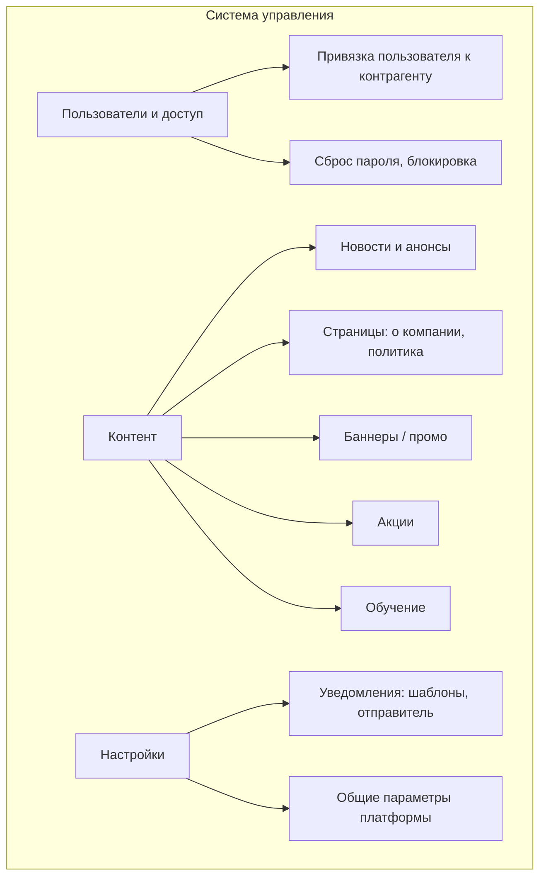

---

## 4. To-be: требования

### 4.1 Пользователи и доступ

- Просмотр списка пользователей ЛК (привязка к контрагенту из 1С). Создание/редактирование учётных записей при ручном онбординге или при заявке «стать клиентом» (роль оператора).
- Сброс пароля пользователю, блокировка/разблокировка доступа.
- Для MVP фиксируется минимальный контур ролей админки:
  - `суперадмин` — полный доступ ко всем разделам админки и настройкам платформы;
  - `оператор / поддержка` — работа с пользователями ЛК и (при наличии в релизе) служебным мониторингом без доступа к критичным системным настройкам; **без** обязательной очереди тикетов обращений в MVP;
  - `контент-менеджер` — управление новостями, баннерами, акциями, обучающими карточками и статическими страницами.
- Детализированную матрицу прав по операциям и полям можно вынести на следующий этап после MVP.
- Админка не должна становиться вторым источником истины по контрагентам, договорам и коммерческим условиям: эти данные приходят из 1С; в админке допускается только просмотр связки и служебные действия с доступом пользователя.

### 4.2 Контент

- Управление новостями и анонсами: создание, редактирование, публикация, снятие с публикации. Отображение на витрине (раздел «Новости» и/или блоки на главной); возможность указывать ссылку на материалы на основном сайте/в блоге.
- Редактирование статических страниц: о компании, политика конфиденциальности и т.д. (по Инфарх).
- Управление баннерами и промо-блоками на главной/каталоге:
  - загрузка изображений, настройка заголовка/текста, ссылок (на акции, обучение, разделы сайта);
  - управление порядком и периодом показа.
- Управление разделом «Акции»:
  - создание/редактирование карточек акций (описание, период, условия, применимость, ссылка в каталог/ЛК — на публичной витрине отдаётся как поле **`ctaUrl`** в [`public-http-openapi.yaml`](../Техническая%20часть/public-http-openapi.yaml), см. схемы `Promotion` / `PromotionListItem`);
  - связь с баннерами: **достаточно URL** (баннер `targetUrl` → страница акции или сразу в каталог); жёсткая связь сущностей «баннер ↔ акция» в админке **не обязательна**, если переход задан прямой ссылкой (см. также `Задание_разработчику_админка_MVP.md` §12.3).
- Управление разделом «Обучение»:
  - карточки курсов/мероприятий/активностей (курсы, форум, квартирники, **экскурсии/вебинары** и т.п.) как контентные сущности, управляемые из админки;
  - поддержка **rich content**: форматирование текста, вставка ссылок, видео, прикрепление файлов (КП/презентации), изображения;
  - публикация/снятие с публикации карточек; карточки в MVP **публично видимы** на витрине, а «оставить заявку» доступно только авторизованным пользователям (проверка на клиентской стороне, не в админке);
  - параметры для заявки: список **доступных форматов** (онлайн/офлайн/гибрид), базовые поля отображения (название, категория/тип, описание).

### 4.3 Настройки

- Настройки уведомлений: шаблоны писем (**email**), отправитель. **SMS и push платформой на текущем этапе не планируются** (ЧТЗ 10). При необходимости — управление через конфигурацию/переменные окружения.
- Для типов заявок и обращений с форм на платформе (в т.ч. **нестандартная заявка**, заявка на обучение, претензия, при необходимости — **общее обращение** из ЛК) в админке настраиваются не только **внутренние** шаблоны (адресатам компании), но и **шаблоны писем клиенту** — подтверждение о приёме обращения (ЧТЗ 10).
- Для `MVP` в админке должна быть доступна настройка **маршрутизации внутренних обращений**:
  - тип обращения / заявки;
  - один или несколько адресатов (`email`);
  - на текущем этапе канал маршрутизации с платформы — **только email** (ЧТЗ 10).
- Маршрутизация по типам является обязательной для `MVP`, чтобы операционная команда могла менять получателей **без разработки**.
- Минимальный набор типов обращений для настройки:
  - претензии;
  - нестандартные заявки / обращение к менеджеру (свободная форма из ЛК);
  - заявки на обучение;
  - заявки `Стать клиентом`;
  - общие обращения / обратная связь;
  - при необходимости — запросы документов.
  - Для типа **«претензии»** и **«заявки на обучение»** настройки адресатов обязательны к заполнению при запуске.
- Общие параметры MVP, которые редактируются в админке платформы:
  - название платформы;
  - контакты поддержки;
  - общие тексты и ссылки в клиентских формах и уведомлениях;
  - **порог бесплатной доставки** как параметр платформы.
- Порог бесплатной доставки для MVP фиксируется как настройка платформы в админке, а не как обязательный параметр, приходящий из `1С`.
- Настройки интеграции с 1С и, при необходимости, внешними хранилищами для маркетинговых материалов. Для клиентских документов в ЛК источником выдачи должна оставаться 1С.
- Для каталогов и документов нужно явно разделить:
  - что приходит из 1С и в админке только просматривается;
  - что редактируется в админке как маркетинговый или вспомогательный контент;
  - какие дополнительные документы (`TDS/MSDS`, `СГР`, паспорта безопасности) должны быть заведены в 1С для выдачи в ЛК, а какие вообще не входят в контур ЛК и остаются только во внешней ручной выдаче.

### 4.4 Заявки и обращения

- **Управление заявками в админке (MVP):** полноценной тикет-системы, статусов обращений, переписки и очереди обработки **нет**. Обязательна только **настройка маршрутизации уведомлений** (email-адресаты по типам обращений, см. §4.3) и отправка писем/уведомлений с платформы. Операционная обработка заявок — в почте, 1С и внешних системах (в т.ч. канал, в который уходит **внешний чат-виджет**).
- **Просмотр списков заявок в админке** (претензии, «стать клиентом», обратная связь, обучение, нестандарт) в MVP **не является обязательным требованием**; допускается **опционально** как технический журнал / аудит для поддержки, если заказчик и команда разработки сочтут нужным — без workflow и без обязанности вести учёт только через админку.
- **Заказы с сбоем синхронизации с 1С:** точка контроля очереди обмена на платформе **желательна** — операционный список или фильтр по заказам с `integrationSyncState` в состояниях `failed` / `manual_review_required` (см. `order_lifecycle_contract.md` §5.2, ЧТЗ 09 §4.2), чтобы не смешивать с клиентской шкалой из шести статусов; дублирование полного учёта заказов из 1С не требуется.
- Для претензий в `MVP` админка не управляет жизненным циклом самой претензии на платформе: карточка в ЛК остаётся в статусе `Отправлена`, а дальнейшая обработка ведётся вне платформы.

### 4.5 Отчётность и аудит

- Логирование действий в админке (кто, когда, что изменил) — рекомендуется для аудита. Отчёты по заказам, клиентам — в 1С или выгрузка; в админке только при явном требовании.

---

## 5. Открытые вопросы

- Нужен ли в админке просмотр заказов и документов клиентов (дублирование 1С) или достаточно работы в 1С?
- ~~Детальная матрица прав в админке по разделам и действиям после MVP~~ — базовая ролевая модель зафиксирована; дальнейшая детализация относится к post-MVP.
- После `MVP`: нужен ли полноценный workflow обработки обращений и претензий прямо в админке, или достаточно маршрутизации уведомлений и опционального журнала отправок.
- Нужна ли админке только настройка видимости/описаний для дополнительных документов, если сами файлы для ЛК должны отдаваться из 1С; или требуется отдельный контур только для маркетинговых файлов, не относящихся к клиентскому документообороту.
- Какие интеграционные настройки 1С допустимо отображать/менять в админке, а какие должны оставаться только в технической конфигурации.

---

## 6. Связь с другими ЧТЗ

| Блок | Связь |
|------|--------|
| Регистрация и онбординг | Одобрение доступа, создание учётной записи (ЧТЗ 05) |
| Витрина | Контент: новости, страницы (ЧТЗ 06) |
| Уведомления | Шаблоны и настройки рассылок (ЧТЗ 10) |
| Интеграция с 1С | Привязка пользователей к контрагентам, источники данных каталога и документов, границы редактирования в админке (ЧТЗ 09) |


---

<!-- notebooklm-source: ЧТЗ/13_нефункциональные_требования.md -->

# ЧТЗ: Нефункциональные требования

**Статус:** актуально
**Источники:** Понимание задачи, Техническая часть/Архитектура_платформы.md, практики B2B-платформ.  
**As-is / To-be:** as-is — отдельной B2B-платформы **нет**; текущий сайт и процессы не имеют формализованных SLA и целевых показателей. to-be — платформа с заданными нефункциональными требованиями (разделы 3–4).

---

## 1. Назначение

Описывает нефункциональные требования к платформе Palizh: целевые показатели доступности (SLA), производительности, безопасности, инфраструктуры, мониторинга и масштабируемости. Цель — единая спецификация для проектирования и эксплуатации системы.

---

## 2. Термины (общие)

| Термин | Описание |
| -------- | ---------- |
| SLA | Service Level Agreement — соглашение об уровне сервиса; целевые показатели доступности и времени отклика |
| RPO | Recovery Point Objective — максимально допустимая потеря данных при сбое (точка восстановления) |
| RTO | Recovery Time Objective — максимально допустимое время восстановления системы после сбоя |
| Uptime | Время доступности системы в процентах от общего календарного времени |
| 152-ФЗ | Федеральный закон № 152-ФЗ «О персональных данных» — требования к обработке и защите ПДн |
| OWASP Top-10 | Перечень наиболее критичных уязвимостей веб-приложений по версии OWASP |

---

## 3. As-is

Отдельной B2B-платформы с ЛК и витриной **нет**. Текущий сайт Palizh — ознакомительный, без интернет-магазина. Заказы принимаются менеджерами через Telegram, email, Excel; документы выдаются по запросу. Формализованных SLA, RPO/RTO и целевых показателей производительности для будущей платформы не задано.

---

## 4. To-be: требования

### 4.1 SLA и доступность

| Показатель | Целевое значение |
| ------------ | ------------------ |
| Uptime платформы | ≥ 99,5% в месяц |
| Время отклика страниц (витрина, ЛК) | < 500 мс (p95) |
| Время отклика API | < 1 с (p95) |

Плановые окна обслуживания и исключения из расчёта uptime — согласовать отдельно (например, ночные окна, предварительное уведомление).

### 4.2 RPO и RTO

| Показатель | Целевое значение (ориентир) |
| ------------ | -------------------------- |
| RPO (потеря данных) | ≤ 24 часа (ориентир; уточнить с заказчиком) |
| RTO (время восстановления) | ≤ 4 часа (ориентир; уточнить с заказчиком) |

Точные значения RPO/RTO зависят от критичности бизнес-процессов и требуют отдельного согласования.

### 4.3 Производительность и нагрузка

| Показатель | Целевое значение |
| ------------ | ------------------ |
| Одновременные B2B-пользователи | Уточнить с заказчиком (ориентир: 50–200 на старте) |
| Загрузка страницы (LCP) | < 2,5 с |
| Время до интерактивности (TTI) | < 3 с |

Нагрузочное тестирование: целевые сценарии и пороговые значения — определить до запуска MVP.

### 4.4 Безопасность

- **152-ФЗ:** соблюдение требований к обработке персональных данных (хранение, передача, доступ, уничтожение). Определение оператора ПДн и мер защиты — отдельная задача.
- **HTTPS:** обязательное шифрование всего трафика (TLS 1.2+).
- **JWT и аналоги (Bearer-токены, сессии SPA):** безопасное хранение и передача; срок жизни, ротация, защита от перехвата; для связки браузера с API дополнительно требования **CSRF**, если используется cookie-сессия (реализация — **Laravel Sanctum**, см. [`Техстек_общий.md` §2](../Техническая%20часть/Техстек_общий.md)).
- **OWASP Top-10:** учёт типовых уязвимостей при проектировании (инъекции, XSS, CSRF, небезопасная десериализация и др.); регулярный аудит и обновление зависимостей.

### 4.5 Инфраструктура

- **Облако:** Яндекс Облако (см. Техническая часть/Архитектура_платформы.md).
- **Резервное копирование:**
  - ежедневные снапшоты БД;
  - S3 Object Storage с версионированием для документов и медиа;
  - хранение бэкапов в отдельном регионе/бакете (по политике заказчика).

### 4.6 Мониторинг и наблюдаемость

| Компонент | Требование |
| ----------- | ------------ |
| Логирование приложения | Структурированные логи (JSON); уровни: error, warn, info; контекст запроса (request_id, user_id) |
| Отслеживание ошибок | Интеграция с Sentry или аналогом; группировка, алерты по критичным ошибкам |
| Мониторинг доступности | Uptime-мониторинг (проверка эндпоинтов); алерты при недоступности |
| Метрики | Базовые метрики: latency, throughput, ошибки; при необходимости — APM |

### 4.7 Масштабируемость

- **MVP:** вертикальное масштабирование (увеличение ресурсов инстансов); архитектура должна допускать горизонтальное масштабирование в будущем.
- **Post-MVP:** при росте нагрузки — горизонтальное масштабирование (несколько инстансов API, балансировка), кэширование, оптимизация запросов к БД.

### 4.8 Политики хранения данных

- Срок хранения логов приложения — согласовать (ориентир: 30–90 дней).
- Срок хранения данных заказов, документов, профилей — по бизнес-требованиям и 152-ФЗ.
- Архивация и удаление данных — отдельная политика (в т.ч. по запросу на удаление ПДн).

---

## 5. Открытые вопросы

**Статус (2026-06-27):** ориентиры по SLA, RPO/RTO, производительности, безопасности и наблюдаемости зафиксированы в **§4.1–4.8** (мастер для реализации — также `Техническая часть/Нефункциональные_требования.md`). Реестр **№50** — утверждение **чисел** и политик с ИТ/безопасностью заказчика.

- Точные целевые значения **RPO** и **RTO** с учётом критичности бизнес-процессов (сейчас ориентиры §4.2).
- Целевые показатели нагрузочного тестирования: количество одновременных пользователей, пиковые сценарии (оформление заказа, выгрузка каталога).
- Нужна ли защита от DDoS (уровень облака, сторонние сервисы).
- Нужен ли WAF (Web Application Firewall) на этапе MVP или post-MVP.
- Детализация требований 152-ФЗ: кто оператор ПДн, какие меры защиты обязательны (шифрование, аудит доступа, СЗИ и т.д.).
- Согласование плановых окон обслуживания и исключений из расчёта uptime.

---

## 6. Связь с другими ЧТЗ

| Блок | Связь |
| ------ | -------- |
| Интеграция с 1С | SLA обмена с 1С, время отклика API 1С, retry-политика (ЧТЗ 09) |
| Техническая часть: Архитектура платформы | [Архитектура_платформы.md](../Техническая%20часть/Архитектура_платформы.md) — инфраструктура, компоненты, наблюдаемость |


---

<!-- notebooklm-source: ЧТЗ/14_обучение_академия.md -->

# ЧТЗ: Обучение и Академия Palizh

**Статус:** актуально (синхронизировано с решением по `MVP`: контент в админке + заявка менеджеру по email; обработка вне платформы)  
**Источники:** [Инфарх/обучение-и-образовательные-активности.md](../Инфарх/обучение-и-образовательные-активности.md); саммари [2026-03-03](../Интервью%20и%20встречи/Саммари/2026-03-03_маркетинг_витрина_каталог_обучение_саммари.md), [2026-03-24](../Интервью%20и%20встречи/Саммари/2026-03-24_обучение_саммари.md).  
**As-is / To-be:** as-is — запись хаотично (телефон, мессенджеры, почта), учёт слотов в **Google Таблице**, в **1С** ведётся **номенклатура** обучения (продажа), но **не** расписание записей. to-be — раздел «Обучение» на витрине/в ЛК с карточками программ из **админки** и отправкой **заявки менеджеру**; обработка заявки — **за пределами платформы**. Интеграция бизнес‑процесса (слоты/оплата/заказный контур/1С) — **post-MVP**.

---

## 1. Назначение

Описывает требования к разделу «Обучение» на платформе Palizh: типы активностей, **иерархия категорий и карточек** (post-MVP: возможно как товарные позиции), точки входа, сценарии **оформления и связи с менеджером**, напоминания, сертификаты, управление контентом и **ручные правила** показа у товаров. Цель — снизить нагрузку на менеджеров за счёт самообслуживания **без** отказа от канала «связаться с менеджером» для индивидуальных условий и согласования дат.

---

## 2. Термины

| Термин | Описание |
| --- | --- |
| Стандартный курс / колористика | Обучающие программы (часто 1–2 дня, онлайн/офлайн); в MVP **карточки видны публично**, заявку оставить может только авторизованный пользователь |
| Форум / квартирники | Групповые мероприятия Академии Palizh; могут быть доступны **шире** (в т.ч. B2C как мероприятие) |
| Академия Palizh | Организационный контур проведения; **не** отдельная ветка навигации «вторая академия» |
| Карточка программы | Страница с описанием и материалами, CTA «Оставить заявку»; в MVP карточка создаётся/редактируется в **админке** |
| Баннер (витрина) | В терминологии заказчика: прежде всего **картинка-ссылка** (напр. карусель на главной) |
| Виджет обучения | **Функциональный блок** на карточке товара (не путать с баннером): ведёт в раздел «Обучение» |

---

## 3. As-is

- Запись: **звонок, мессенджеры, почта**; чаще клиент → менеджер B2B.
- Расписание и слоты: **Google Таблица** (продажи, лаборатория и др.); **не** в 1С.
- В **1С** заведена **номенклатура** обучения (в т.ч. разные позиции по дням/числу человек); продажа фиксируется; **связи «товар лакокраски ↔ номенклатура обучения» в 1С нет**.
- Каналы привлечения: выставки, рассылки, лендинги, соцсети; на сайте — блоки в духе текущей витрины (виджеты у каталога).

---

## 4. To-be: требования

### 4.1 Раздел «Обучение» в ЛК и на витрине (MVP)

- **Структура:** не одна плоская лента — **уровень категорий** (минимум для MVP: **колористика**, **форум**, **квартирники**), внутри — карточки программ.
- **Список:** фильтры (тип, формат, дата, регион при необходимости), сортировка (в т.ч. ближайшие даты — когда даты доступны в данных).
- **Карточка программы:**
  - описание, программа/содержание (по типу), формат, длительность, даты/место (если есть в данных);
  - стоимость/условия (если применимо), коммерческое предложение (файл/ссылка);
  - **богатый текст и видео** в админке платформы (в т.ч. вставка ссылок, видео для форума/квартирников);
  - обязательный минимум контента: **описание**, **длительность** (в тексте или КП);
  - **CTA:** **«Оставить заявку»** (форма заявки на платформе) и при необходимости вторичная ссылка «Связаться с менеджером».
- **Заявка на обучение (MVP):** клиент отправляет заявку менеджеру; дальнейшая обработка (согласование дат, условия, фиксация продажи) ведётся **за пределами платформы**.
- **Форма заявки на обучение (MVP, обязательный минимум):**
  - `programId` (или эквивалент идентификатора карточки программы) — заполняется автоматически из карточки;
  - `contactName` — ФИО контактного лица;
  - `contactPhone` — телефон для связи;
  - `contactEmail` — email для обратной связи;
  - `participantsCount` — количество обучающихся (целое число, минимум `1`);
  - `preferredFormat` — желаемый формат: онлайн / офлайн / гибрид;
  - `preferredDate` — желаемая дата (одна дата);
  - `questionsToCover` — вопросы/темы, которые нужно раскрыть на обучении;
  - `comment` — дополнительный комментарий (опционально).
- **Валидация MVP:** обязательны `contactName`, `contactPhone`, `contactEmail`, `participantsCount`, `preferredFormat`, `preferredDate`, `questionsToCover`; email в валидном формате, телефон не короче рабочего минимума, `participantsCount >= 1`.
- **Не включаем в MVP как обязательные поля формы:** способ оплаты, реквизиты договора, вложения, многошаговые статусы заявки.
  - Поля формы могут **предзаполняться** из профиля ЛК (`contactName`, `contactPhone`, `contactEmail`), но пользователь может их отредактировать для конкретной заявки (контакт по обучению может отличаться от основного контакта ЛК).
- **История заявок в ЛК (MVP):** в ЛК показываем раздел **«Заявки на обучение»** по аналогии с «обращениями»:

  - в истории фиксируется отправленная заявка и её содержимое;
  - статус один: `Отправлено` (не меняется);
  - интеграции статусов с 1С нет.

  Минимум после отправки — экран «Заявка отправлена».
- **Напоминания, календарь, сертификаты, история обучения через заказы** — **post-MVP** после появления интегрированного процесса и/или источника подтверждённых дат/событий.

#### 4.1.1 Письмо менеджеру по заявке (payload уведомления)

Минимальный состав данных, который должен попасть в письмо/уведомление менеджеру при создании заявки:

- Идентификация:
  - `programId` и человекочитаемое `programTitle`;
  - `applicationId` (ID заявки на платформе);
  - `counterpartyId` (GUID/ID контрагента из 1С, если есть привязка);
  - `counterpartyName`;
  - `lkUserId` и отображаемое имя пользователя ЛК, создавшего заявку.
- Контакты и участники:
  - `contactName`, `contactPhone`, `contactEmail`;
  - `participantsCount`;
  - при необходимости — краткое описание «кто обучается» (роли) в поле `comment`.
- Контекст заявки:
  - `preferredFormat` (онлайн / офлайн / гибрид);
  - `preferredDate` (желаемая дата);
  - `questionsToCover` — вопросы, которые нужно раскрыть на обучении (может дополняться `comment`).
- Служебные данные:
  - дата/время создания заявки;
  - ссылка на карточку заявки/курса в админке.

**MVP scope (зафиксировано решением по MVP):**

- Типы активностей в MVP задаются как **карточки контента** в админке: курсы (в т.ч. колористика), форум, квартирники, а также **экскурсии/вебинары** (как карточки с заявкой на email, без интеграций).
- В MVP **нет** оформления обучения через корзину/заказ на платформе: основной путь — **заявка менеджеру**.
- Оплата, счёт, фиксация продажи в `1С`, сертификаты и история обучения в ЛК — **post-MVP**.

### 4.2 Типы активностей (MVP)

| Категория | Кратко | Видимость (принцип) |
| --- | --- | --- |
| Обучение по колористике | Курсы, онлайн/офлайн, разная длительность | Карточка публична; заявка — только авторизованным |
| Форум | Мероприятие со спикерами, часто лендинг прошлого года + актуализация ближе к дате | Шире, в т.ч. B2C |
| Квартирники | Групповые мероприятия Академии | Шире; визуальный тон отличается от «делового» колористики |

- **Экскурсии и вебинары (MVP):** допускаются как карточки в разделе «Обучение» (контент в админке, заявка на email), без выделения в отдельную обязательную категорию IA.

- Явный маркер на карточке **«индивидуальное / групповое»** **не** требуется.

### 4.3 Точки входа

- **Главная:** карусель **баннеров**-картинок со ссылкой на раздел обучения / карточку / акцию; не плодить отдельные баннерные зоны на каждой странице без необходимости.
- **Раздел «Обучение»** в ЛК и на витрине (см. Инфарх).
- **Каталог:** в MVP обучение не обязано быть номенклатурой каталога (не покупка через корзину). Раздел «Обучение» — как контентный раздел/лента карточек.
- **Карточка товара (B2B):** **виджет** «Доступно обучение» → переход в раздел «Обучение» (не три отдельные мини-карточки курса на странице краски). Правила: **вручную на платформе** (список SKU / категория B2B / и т.д.).

### 4.4 Целевая аудитория

- Раздел и карточки доступны **всем авторизованным** пользователям компании (не только директору).
- **Карточки обучений видны публично** (в т.ч. колористика); **оставить заявку** может только **авторизованный** пользователь.

### 4.5 Управление в админке и данные

- Редактирование контента карточки на платформе (текст, видео, ссылки на лендинги, файлы/КП).
- В MVP **не требуется** синхронизация карточек обучения с `1С`.
- Задача на развитие: при необходимости — связка с `1С` (цены/номенклатура/оплата/документы/слоты) как отдельный этап после запуска.
- Настройка **правил показа виджета** «обучение» у товаров (ручной список / категория).
- Заявки на обучение в MVP: отправка на **email** адресатам, настроенным в админке (см. ЧТЗ 12/10 про маршрутизацию по типам обращений).
- Роли: маркетинг; контент форумов/квартирников — совместно с **Академией Palizh** (процессы и даты частично у них).

### 4.6 Дизайн

- **Колористика:** деловой минимализм.
- **Форум, квартирники:** иной визуальный тон (референсы — годовые лендинги; материалы от заказчика).

### 4.7 Post-MVP / развитие

- Календарь-**афиша** с выбором даты на странице обучения; подача слотов из внешнего расписания (таблица / Битрикс / иное) — **после** появления источника данных и оценки трудоёмкости.
- **Экскурсии**, **вебинары** (резкий тип программы) — по результатам уточнения с Академией.
- Персональные рекомендации обучения по роли в ЛК.
- Техническая унификация: **несколько номенклатур** vs **одна карточка с вариантами** (ТП) — решение с разработкой и 1С.

---

## 5. Открытые вопросы

- **Post-MVP:** если обучение будет оформляться как заказ/оплата на платформе — модель данных (SKU vs варианты/ТП) и контракт с `1С`.
- **Источник дат** для фильтров и афиши; интеграция с календарём (в т.ч. обсуждавшийся Битрикс) — вне MVP.
- **Post-MVP:** единый календарь ЛК (доставка + обучение) — после появления подтверждённых дат в контуре платформы.
- **Экскурсии:** продуктовая модель (товар / баннер / только менеджер) — после опроса Академии Palizh.
- **Вебинары:** входит ли в типологию MVP или редкий внешний процесс.
- Нужны ли в `MVP` дополнительные поля формы (`companyName`, `city`, `preferredDate`) как опциональные, или оставить только минимальный набор.

*Закрыто по доп.встрече (MVP-решение):* контент обучения создаётся в админке; заявка падает менеджеру по email; дальнейшая обработка вне платформы. *Закрыто по 2026-03-24:* состав MVP-категорий; отказ от статусов заявки в ЛК; виджет на карточке товара в MVP; терминология баннер/виджет.

---

## 6. Связь с другими ЧТЗ

| Блок | Связь |
| --- | --- |
| ЧТЗ 01 | Post-MVP: если обучение будет оформляться как заказ на платформе |
| ЧТЗ 06 | Витрина, каталог, категории, главная |
| ЧТЗ 07 | ЛК: роли и разделы (контекст доступа к разделу «Обучение») |
| ЧТЗ 09 | Post-MVP: интеграция обучения с 1С (номенклатура/цены/документы) |
| ЧТЗ 10 | Внутренние уведомления/маршрутизация заявок (email) |
| ЧТЗ 12 | Админка: контент, правила виджетов, баннеры главной |
| Инфарх | [обучение-и-образовательные-активности.md](../Инфарх/обучение-и-образовательные-активности.md) |

---

## 7. Связь с реестром открытых вопросов

- П. **29**, **52** — частично закрыты саммари 2026-03-24; остатки (техмодель SKU, календарь, экскурсии) дублируются в §5 настоящего ЧТЗ.
- П. **27** (новости/статьи) — принципы для платформы зафиксированы в саммари 2026-03-24; детальный контент-план — при необходимости в **ЧТЗ 06**.
