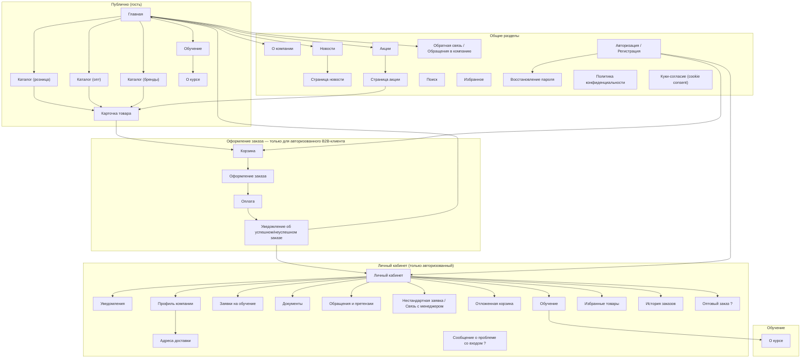
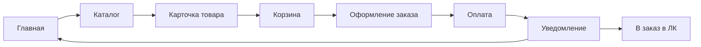
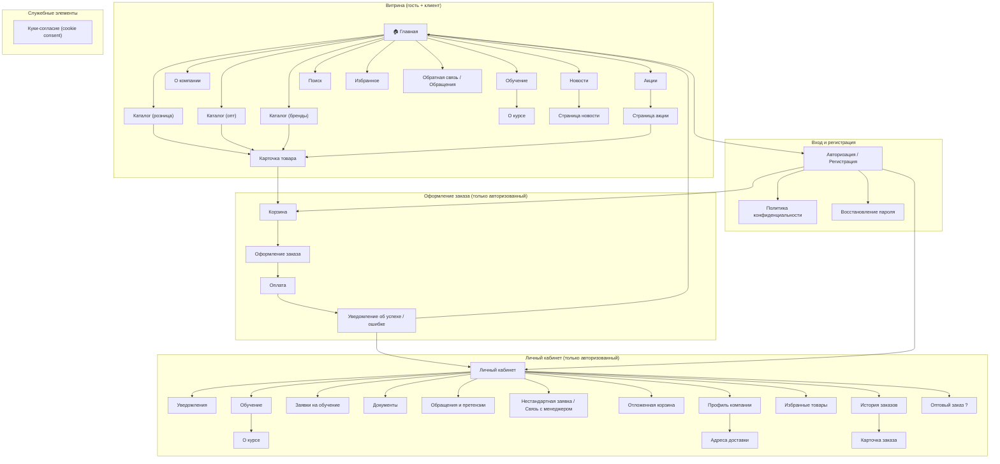
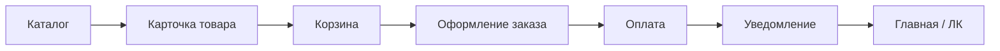

# Информационная архитектура и границы

_Автособорка для NotebookLM. Правки вносить в исходные файлы репозитория, затем пересобрать bundle._

---

<!-- notebooklm-source: Инфарх/видение-и-границы.md -->

# Видение и границы сайта Palizh

Краткий одностраничник: зачем сайт, для кого, что входит в scope на старте и что — нет. Для онбординга команды и проверки границ при принятии решений.

---

## Цель сайта

Дать B2B-клиентам (юрлица с договором) возможность **самостоятельно оформлять и сопровождать заказы 24/7**: каталог, корзина, оформление, доступ к документам и статусам заказа/доставки в личном кабинете — без ожидания менеджера. Менеджерам — снизить нагрузку на рутине и высвободить время на развитие отношений и продажи.

---

## Для кого

| Аудитория | Описание |
| --------- | -------- |
| **Клиент (гость)** | Просмотр витрины и каталога без цен. Оформить заказ не может — нет ЛК. Если по товару из `1С` приходит ссылка на маркетплейс, может перейти на него из карточки товара. |
| **Клиент (авторизованный B2B)** | Юрлицо с одобренным доступом к ЛК: персональные цены, корзина, оформление заказа, история заказов, документы, уведомления, профиль. |
| **Сотрудник компании (админка)** | Управление контентом витрины, пользователями ЛК, настройками. Не путать с «ЛК менеджера» — его нет. |

---

## В scope на старте (MVP)

- **Витрина:** главная, каталоги (розница / опт / бренды), карточка товара, поиск. **«По брендам» — альтернативное представление ассортимента с группировкой по бренду/производителю.** Для гостя — просмотр без цен и, при наличии ссылки из `1С`, переход на маркетплейс; для авторизованного — персональные цены из `1С`.
- **Оформление заказа:** только для авторизованного клиента. Корзина → оформление → счёт (из 1С) → отображение статуса оплаты; далее платформа показывает 6 верхнеуровневых статусов заказа, а маршрут, трек и водитель остаются delivery-деталями из 1С внутри заказа.
- **Личный кабинет клиента:** профиль (пользователь + компания), три роли (**директор / мастер — полный доступ**; закупщик и бухгалтер — **ограничения** по разделам, см. ЧТЗ 07); мастер-аккаунт создаёт под-пользователей; история заказов (шесть статусов), повтор заказа, документы (счёт; **УПД после отгрузки в 1С** — получение по запросу из ЛК в 1С без хранения файла на платформе; ТТН, паспорт качества, акт сверки), уведомления (**email**, в т.ч. **сигнал об изменении персональных цен** — интервью 2026-04-14); раздел **«Обращения и претензии»** — обращения и претензии **по конкретному заказу** (типы претензий — ЧТЗ 04), доступ в т.ч. у бухгалтера; **нестандартная заявка** — **отдельный** пункт ЛК (запрос **вне типового заказа из каталога**), обязательный текст, опционально файлы, **история** отправленных заявок, статус **`Отправлено`**, **email клиенту** о приёме (шаблон в админке); уточнение условий и КП — **вне платформы**.
- **Обучение (MVP):** публичный раздел обучений (список и карточки — контент из админки); оставить заявку может только авторизованный пользователь. Заявка уходит менеджеру по email, а в ЛК фиксируется в истории «Заявки на обучение» со статусом `Отправлено` (статус не меняется, синхронизации с 1С нет).
- **Регистрация:** заявка «Стать клиентом» → менеджер в 1С → письмо со ссылкой на **установку пароля** (7 дней) → вход в ЛК.
- **Интеграции:** 1С (каталог, цены, заказы, статусы, документы, **операционные данные доставки** — маршрут, delivery-детали в заказе); **порог бесплатной доставки и подсказки в корзине** для MVP задаются в **админке платформы**, а не приходят из 1С как «правило порога» (см. ЧТЗ 03, 09). Сервис **email**-рассылок для уведомлений платформы; **SMS/push платформой не планируются** на текущем этапе (ЧТЗ 10). В перспективе ЭДО (Контур), ТК (трекинг).
- **Система управления (админка):** пользователи ЛК, контент (новости, страницы), настройки уведомлений (в т.ч. **email-адресаты по типам форм** с портала), общие параметры. **Учёт обращений, статусов тикетов и переписки в админке не входит в MVP** — операционная работа в почте, 1С и внешних системах.
- **Чат с менеджером:** **готовый виджет стороннего сервиса**; маршрутизация диалога и **уведомления в контуре чата** — у поставщика виджета, **не** в Palizh. Для развёрнутого запроса и вложений — **форма в ЛК** (см. ЧТЗ 01).

---

## Вне scope или позже

| Что | Пояснение |
| --- | --------- |
| **ЛК менеджера** | Не предусмотрен. Общение с клиентами — внешние каналы (в т.ч. чат-виджет, почта, CRM); маршрутизация чата — вне scope платформы. |
| **B2C (физлица без юрлица)** | На старте только юрлица с договором. |
| **Саморегистрация с авто-одобрением** | На старте заявка → менеджер → заведение в 1С → подписание → доступ. |
| **Мобильное приложение** | В scope проекта, вне MVP. Подход: Capacitor (вариант B — remote). Первый релиз мобильного приложения после отработки веб-флоу и бэкенда. |
| **Полноценный ЭДО (двусторонний)** | В перспективе; на старте — счета и акты в одностороннем режиме (Контур), уточнять. |
| **Онлайн-конфигуратор** (колеровка, нестандарт) | Заявка менеджеру через форму в ЛК (**свободный текст**, опционально файлы), не онлайновый конфигуратор; детали и КП — вне платформы. |
| **Бонусы в ЛК** | `MVP`: показываем типы/условия и баланс из `1С` **без истории операций**; списание/автосписание и история — **post-MVP**. |
| **Интеграция обучения с 1С (слоты/оплата/статусы/сертификаты)** | Для MVP обучение — контент + заявка на email + история отправленных заявок. Продажа/оплата/сертификаты и любой БП обучения в 1С — post‑MVP. |
| **Дашборд машин / сборные грузы, API событий для клиента** | Интересно клиентам 2026-04-14 и 2026-04-16 (производство): видеть плановые машины / доборные грузы и получать события интеграционно. В MVP — вне scope; обрабатывается в рамках 6 статусов заказа и email-уведомлений. Возвращаемся после MVP. |
| **Забор на маршруте** (встреча с водителем, забор с машины без довоза до адреса) | **Вне scope текущего этапа** (решение 2026-06-02). На платформе только **самовывоз со склада** (Салютовская, 31); иначе — доставка Palizh до адреса или ТК. Операционные договорённости вне ЛК — как сейчас. См. [ЧТЗ 03 §4.6](../ЧТЗ/03_доставка.md). |

---

## Ключевые ограничения (напоминание)

- Заказ может оформить **только авторизованный** пользователь с одобренным доступом к ЛК.
- Платформа **только B2B** (юрлица с договором).
- Каталоги «розница» / «опт» / «бренды» — разные **представления ассортимента**, не типы пользователей (B2C vs B2B).

---

*Источники: Понимание задачи, ЧТЗ 01–14, Инфарх, саммари интервью. Обновлять при изменении границ проекта.*

---

<!-- notebooklm-source: Инфарх/информационная-архитектура.md -->

# Palizh — информационная архитектура

B2B-платформа для оформления и управления заказами. Состав страниц, вкладок и основные потоки навигации.

**Ограничения платформы (по текущему пониманию):**

- **Только B2B:** на платформе работают только юрлица (ИП, ООО и т.д.) с заключённым договором. Физлица без юрлица (полноценный B2C) не предусмотрены.
- **Заказ только для авторизованного пользователя:** оформить заказ (корзина → оформление → оплата) может только пользователь, вошедший в систему и имеющий одобренный доступ к ЛК (контрагент заведён в 1С, договор подписан). Гость видит витрину и каталог без цен, но не может оформить заказ.
- **Различие каталогов — не B2C vs B2B:** каталоги «розница», «опт», «по брендам» — это разные представления ассортимента для одного типа клиента (B2B). Внутри компании есть направления B2C и B2B (разные менеджеры, сегменты: магазины/дилеры vs промышленность/дистрибьюторы), но сама площадка на старте — только B2B (юрлица с договором). Для B2B-клиента приоритет — быстрый переход к действиям (корзина, заказ), а не маркетинговый лендинг.

## Условные обозначения

| Тип | Описание |
| --- | -------- |
| **Страница/Вкладка** | Обычный узел — страница или вкладка в интерфейсе |
| **Вопрос/Предложение** | Требует уточнения или решение не принято (в диаграмме помечено «?») |
| **Комментарий** | Пояснение к странице или функции — вынесены в список ниже диаграммы |

---

## Диаграмма структуры

---

## Поток заказа (упрощённо)

Заказ доступен **только авторизованному B2B-клиенту** (юрлицо с одобренным доступом). Гость может просматривать главную и каталоги без цен; при попытке добавить в корзину или перейти к оформлению — требуется вход (или редирект на авторизацию / `Стать клиентом`).

*Кросс-платформенное переключение между каталогами (розница / опт / бренды) — разные представления ассортимента для одного типа клиента (B2B), не разделение B2C/B2B.*

---

## Комментарии и пояснения к страницам

- **Платформа B2B:** только юрлица с договором; заказ (корзина, оформление, оплата) — только после авторизации и одобрения доступа к ЛК.
- **Главная:** функция переключения языка; витрина; форма обращений; **баннерная зона** (новинки, акции, обучающие мероприятия), новости, о компании. Для B2B-клиента приоритет — быстрый переход к каталогу и заказу. **Баннер:** клик ведёт на **страницу акции/мероприятия**, в **общий раздел «Акции»** или **напрямую в каталог по целевой ссылке** (в т.ч. с сохранёнными фильтрами в URL). Промо-тексты на главной держать **короткими**; полные условия — на **странице акции**. В **MVP** на hero **нет динамической подборки карточек товаров** из каталога в блоке промо — **статичное изображение** (desktop/mobile по макету); см. [ЧТЗ 06 §4.5.1](../ЧТЗ/06_витрина_каталог.md) и [саммари 2026-05-19](../Интервью%20и%20встречи/Саммари/2026-05-19_маркетинг_дизайн_концепция_саммари.md).
- **Каталоги (розница / опт / бренды):** разные представления ассортимента (категории, цены), не типы пользователей; переключение между каталогами без потери контекста. **Фильтры** — гибкий справочник атрибутов из 1С (`sync.product-attributes`, `attributes[]` на товаре; API `GET /products/filters` — ЧТЗ 06 §4.2.0). Для авторизованного клиента — персональные цены и наличие. Требуется поиск с учётом свойств/материалов (например, «для полиуретана») — см. ЧТЗ 11. Архивные / снятые с производства товары с нулевым остатком могут быть скрыты из активной витрины, но не должны теряться из истории заказов.
- **Новости:** лента новостей и анонсов; часть материалов (статьи, подробные методички) остаётся на основном сайте Palizh, на платформе даются анонсы + ссылки.
- **Акции:** список текущих акций; переход со страницы акции к товарам каталога **через кнопку/ссылку** (целевой URL и query фильтров — контент админки, в API — `ctaUrl`). **Не обещать** на баннере и в коротком превью **финальную «акционную цену»** (личные скидки и суммирование акций см. ЧТЗ 06 §4.5.1). Баннеры на главной могут вести **на страницу акции** или **напрямую в каталог**, в зависимости от заполнения `targetUrl`/контента.
- **Обратная связь / Обращения в компанию:** формы общих обращений (витрина).
- ~~Вопрос/Ответ~~: отдельный раздел не делаем (решено); ~~Онлайн-консультант на платформе~~: не предусмотрен (решено). Быстрые вопросы — **внешний чат-виджет** (уведомления и маршрутизация — у поставщика виджета); **нестандартный запрос вне каталога** и файлы — **отдельная форма** «Нестандартная заявка / Связь с менеджером» в ЛК (**обязательный** текст, опционально вложения); плюс подсказки по месту.
- **Обращения и претензии (ЛК):** единый раздел — сценарии **в контексте заказа**: общее обращение по заказу и претензия (расширенная форма: типы по ЧТЗ 04, привязка к заказу/накладной, позиции, фото/видео/документы); типизация при создании; **история** отправленного; **не путать** с нестандартной заявкой (ЧТЗ 01 §4.5). В MVP претензия создаётся со статусом `Отправлена` (ЧТЗ 04). Подробная форма — см. `Техническая часть/Форма_претензии_UI_API.md`. Уведомления внутренним адресатам и **подтверждение клиенту** — по маршрутизации и шаблонам из админки (ЧТЗ 10, 12). **Чат** — виджет стороннего сервиса, не часть ЛК-потока форм.
- **Адреса доставки (ЛК):** список адресов доставки, добавление/редактирование через **DaData** (подсказки, выбор из списка; ЧТЗ 01 §4.1.2); подраздел «Профиля компании» или отдельная вкладка (в Figma — отдельный экран).
- **Восстановление пароля:** экран для сброса пароля (email → ссылка для сброса); вспомогательный подэкран авторизации.
- **Куки-согласие (cookie consent):** модальное окно / плашка с кнопками «Принять», «Настроить», «Отклонить»; обязателен по 152-ФЗ.
- **Обучение (публично):** витрина обучений (включая колористику) доступна гостю; при попытке «Оставить заявку» — барьер входа/авторизация.
- **Личный кабинет → Обучение → О курсе:** карточки, создаваемые в админке; основной сценарий — **заявка менеджеру** (email‑маршрутизация по типам в админке), обработка заявки вне платформы.
- **Личный кабинет → Заявки на обучение:** история отправленных заявок со статусом `Отправлено` (статус не меняется, синхронизации с 1С нет).
- **Нестандартная заявка / Связь с менеджером:** отдельный пункт навигации ЛК; запрос **вне типового заказа из каталога**; форма — **обязательный** текст, опционально вложения; **история** заявок в ЛК; письмо клиенту о приёме (шаблон); детали и КП — **вне платформы**. Статус записи — **`Отправлено`**; внутреннее уведомление — **email** (ЧТЗ 01, 10, 12). Обязательный **выбор типа** (колеровка/оборудование) и расширенные статусы — post-MVP.
- **Отложенная корзина:** хранение выбранных позиций на будущий срок.
- **Профиль компании:** информация о компании.
- **Избранные товары:** доступ и из ЛК, и из шапки сайта.
- **История заказов:** список заказов; переход в **карточку заказа**. Повтор заказа — по актуальной номенклатуре из `1С` (недоступные позиции — отдельный pop-up).
- **Поиск vs фильтры:** строка поиска → **`GET /search/products`** (ЧТЗ 11 §5.5); сужение на листинге — **facet-фильтры** (`GET /products/filters`).
- **Карточка заказа (ЛК):** состав, статус (6 шагов), документы, delivery-блок. **Способ получения:** доставка Palizh / ТК / **самовывоз со склада**. При **самовывозе** — явная подпись и **адрес:** г. Ижевск, ул. **Салютовская, 31** (не адрес доставки клиента); ориентир по срокам — см. [ЧТЗ 08 §4.2.1](../ЧТЗ/08_ЛК_заказы_статусы.md), [ЧТЗ 03 §4.7](../ЧТЗ/03_доставка.md). **Забор на маршруте** — вне scope, в UI не показываем. При доставке — адрес клиента, трек ТК или контакты водителя.

---

## Вопросы / предложения (требуют решений)

1. ~~Вопрос/Ответ / FAQ~~ — принято решение не делать отдельный раздел; опора на подсказки, **внешний чат-виджет** и формы ЛК (нестандарт / обращения / претензии) по контексту.
2. **Сообщение о проблеме со входом** — куда ведёт, куда уходит обращение.
3. ~~**Оптовый заказ:** где формируется прайс-лист?~~ — **post-MVP** (ЧТЗ 01); в MVP **нет** self-service выгрузки прайса; цены и `lineTotal` в каталоге/корзине. Выгрузка таблицы цен — **только по запросу** менеджера (2026-06-29).
4. **Главная и баннеры:** сегментация по клиентским типам для баннеров **не является обязательной** на MVP (платформа закрывает B2B); **коммуникационные блоки** «для дома / промышленность / творчество» в прототипе согласованы с текстами маркетинга (встреча 2026-05-19). Остаётся уточнить: нужны ли **разные наборы баннеров** для сегментов в будущем и кто финально утверждает порядок слайдов.
5. **Обучение (хвосты после ЧТЗ 14 / интервью 2026-03-24):** модель карточки в выгрузке из 1С (несколько SKU vs варианты); календарь/афиша и источник дат. Виджет на карточке товара и MVP‑подход «карточки в админке + заявка на email + история заявок в ЛК со статусом `Отправлено`» — зафиксированы; экскурсии/вебинары допускаются как карточки контента.
6. **Архивная номенклатура:** каким именно признаком `1С` передаёт архивность / снятие с производства / пометку на удаление, чтобы витрина и `повтор заказа` работали единообразно.
7. **Интервью с B2B-клиентом 2026-04-14** ([саммари](../Интервью%20и%20встречи/Саммари/2026-04-14_интервью_с_клиентом_1_саммари.md)): сверить с IA и ЧТЗ — **загрузка заказа файлом из 1С** в корзину, **отложенная корзина**, **подсказка кратности коробки**, **календарь плановых машин**, **дозаказ в тот же счёт / окно правок**, **персональный прайс + уведомления о смене цен**, **гранулярные настройки уведомлений**, **инфоблок по колеровке** (материалы/линейки), **статистика оборота** в ЛК (если в scope). Для части пунктов приоритет у закупщика может отличаться от ЛПР — уточнить на следующих интервью.
8. **Демо прототипов 2026-04-15** ([саммари](../Интервью%20и%20встречи/Саммари/2026-04-15_демо_прототипов_саммари.md)) **и интервью 2026-04-16 (производство)** ([саммари](../Интервью%20и%20встречи/Саммари/2026-04-16_интервью_клиент_2_производство_саммари.md)): закреплены в IA — **две цены кратно/некратно упаковке**, **реальные фото трёх ёмкостей** в карточке, **инфоблок совместимости паст/баз**, **выбор адреса из сохранённых + новый** в оформлении (DaData — ЧТЗ 01 §4.1.2). ~~Отмена заказа из ЛК~~ и ~~дашборд машин~~ — **вне MVP** (реестр №53, №9).
9. **Маркетинг — дизайн-концепция (акции и баннеры) 2026-05-19** ([саммари](../Интервью%20и%20встречи/Саммари/2026-05-19_маркетинг_дизайн_концепция_саммари.md)): см. актуализированное описание главной и акций выше и [ЧТЗ 06 §4.5.1](../ЧТЗ/06_витрина_каталог.md).

---

## Связь с ЧТЗ

Описание требований к разделам сайта — в соответствующих ЧТЗ. Сводка:

| Область | ЧТЗ |
| ------- | --- |
| Витрина, каталог, карточка товара, поиск | [06 Витрина и каталог](../ЧТЗ/06_витрина_каталог.md), [11 Поиск](../ЧТЗ/11_поиск.md) |
| Корзина, оформление, оплата | [01 Процесс оформления заказа](../ЧТЗ/01_процесс_оформления_заказа.md), [03 Доставка](../ЧТЗ/03_доставка.md) |
| Авторизация, «Стать клиентом» | [05 Регистрация и онбординг](../ЧТЗ/05_регистрация_онбординг.md) |
| ЛК: профиль, заказы, документы, уведомления, претензии | [07](../ЧТЗ/07_ЛК_профиль_компания.md), [08](../ЧТЗ/08_ЛК_заказы_статусы.md), [02](../ЧТЗ/02_документооборот.md), [10](../ЧТЗ/10_уведомления.md), [04](../ЧТЗ/04_претензии.md) |
| ЛК: обучение | [14 Обучение и Академия Palizh](../ЧТЗ/14_обучение_академия.md) |
| Админка, контент | [12 Система управления](../ЧТЗ/12_система_управления.md) |
| Нефункциональные требования (безопасность, SLA, 152-ФЗ) | [13 Нефункциональные требования](../ЧТЗ/13_нефункциональные_требования.md) |

**Дополнительные артефакты в папке Инфарх:**

- [Видение и границы сайта](видение-и-границы.md) — цель, аудитория, scope и вне scope.
- [Состав и задачи страниц](состав-и-задачи-страниц.md) — таблицы по страницам/разделам, ключевые элементы, открытые вопросы.
- [Структура страниц (визуализация)](структура-страниц.md) — дерево страниц (sitemap), зоны доступа (гость / клиент), поток заказа.
- [Обучение и образовательные активности](обучение-и-образовательные-активности.md) — типы обучающих форматов, точки входа, структура раздела «Обучение».
- [Замечания по макету Figma (архив, устарело)](../архив/замечания_по_макету_инфарх.md) — сохранено для истории; актуальные решения — в текущих файлах Инфарх и ЧТЗ после демо 2026-04-15.

---

*Диаграмма собрана по схеме структуры сайта. Папка **Инфарх** — для хранения и обновления информационной архитектуры проекта.*

---

<!-- notebooklm-source: Инфарх/обучение-и-образовательные-активности.md -->

# Обучение и образовательные активности

Артефакт для проектирования раздела «Обучение» и связанных точек входа (баннеры, карточки курсов, форумы, Академия Palizh) на B2B‑платформе.

**Источники:** Понимание задачи, саммари интервью [2026-03-03](../Интервью%20и%20встречи/Саммари/2026-03-03_маркетинг_витрина_каталог_обучение_саммари.md) и [2026-03-24](../Интервью%20и%20встречи/Саммари/2026-03-24_обучение_саммари.md) (обучение), информационная архитектура, состав и задачи страниц.

---

## 1. Цели раздела «Обучение»

- **Для бизнеса Palizh:**
  - Повысить качество работы клиентов с продуктами (снижение ошибок, претензий).
  - Укрепить лояльность через экспертизу и регулярные обучающие активности.
  - Привлекать лидов на обучение через платформу (заявки, записи на курсы и форумы).
- **Для клиента (директор/руководитель, технолог, закупщик):**
  - Понять, **какие форматы обучения доступны** (курсы, форумы, Академия Palizh).
  - Быстро оценить пользу (темы, формат, длительность) и **отправить заявку** на обучение (MVP).
  - Легко вернуться к информации об обучении из ЛК и витрины.

По интервью **2026-03-24:** раздел и карточки обучения в ЛК показываются **всем пользователям компании** (не только директору); отдельный маркер «индивидуальное / групповое» на карточке **не нужен**. Финальное MVP‑решение: **витрина обучений публичная** (включая колористику), а **оставить заявку** может только **авторизованный** пользователь.

---

## 2. Типы обучающих активностей

### 2.1 Стандартные курсы

- Тематики: колористика, работа с системами Palizh, эксплуатация оборудования и т.п.
- Формат:
  - 1–2‑дневные программы (часто офлайн, на площадке Palizh).
  - Возможны комбинации онлайн + офлайн (вебинары + практические сессии).
- Целевая аудитория:
  - директора/руководители (решение об отправке сотрудников);
  - технологи, операторы, специалисты по колеровке.

### 2.2 Академия Palizh

- Отдельное направление, проводящее **разовые мероприятия**:
  - квартирники, тематические встречи, мастер‑классы.
- Каналы привлечения: соцсети, лендинги, рассылки.
- Для платформы: показывать **как часть общего списка обучающих активностей**, с пометкой «Академия Palizh».

### 2.3 Форумы и мероприятия

- Форумы Palizh и совместные мероприятия:
  - несколько спикеров, тематические блоки.
- По смыслу — тоже обучение; могут отображаться:
  - в ленте новостей/баннерах на главной;
  - в разделе «Обучение» как отдельный тип мероприятия.

---

## 3. Точки входа к обучению на платформе

### 3.1 Главная страница (витрина)

- **Баннеры**:
  - крупные анонсы ключевых курсов/форумов/мероприятий;
  - минимум: баннер с названием, краткой пользой и ссылкой «Подробнее/Записаться».
- **Карточки/виджеты обучений**:
  - небольшие блоки ниже основной зоны, с 1–3 актуальными предложениями.

### 3.2 Личный кабинет

- Раздел `Обучение` (см. `состав-и-задачи-страниц.md`):
  - список доступных курсов/мероприятий;
  - фильтры по типу (курс, форум, Академия Palizh), формату (онлайн/офлайн), длительности;
  - для каждого элемента — карточка (см. ниже).
- Карточка курса/мероприятия:
  - название, тип (курс, форум, Академия Palizh);
  - короткое описание пользы для бизнеса клиента;
  - формат (онлайн/оффлайн, смешанный), длительность, расписание/даты;
  - основной CTA в `MVP`: **«Оставить заявку»** → заявка уходит менеджеру по **email** (маршрутизация адресатов по типам обращений — в админке); дальнейшая обработка — **вне платформы**;
  - форма заявки в `MVP` (минимальный набор полей): `programId` (авто), `contactName`, `contactPhone`, `contactEmail`, `participantsCount`, `preferredFormat`, `preferredDate`, `questionsToCover`, `comment` (опционально);
  - базовая валидация: обязательны контактные поля, `participantsCount >= 1`, а также `preferredFormat`, `preferredDate`, `questionsToCover`; email в валидном формате;
  - ссылка на подробное описание (`О курсе`), коммерческое предложение, по типам программ — **видео** и ссылки на лендинги (форум);
  - в `MVP` заявка фиксируется в ЛК в истории **«Заявки на обучение»** со статусом `Отправлено` (статус не меняется, синхронизации с 1С нет); минимум после отправки — экран «Заявка отправлена». Напоминания/календарь/сертификаты/история обучения — **post-MVP**.

**Доступ:** витрина обучений (список и карточки) доступна **публично**; оставить заявку может только **авторизованный** пользователь.

### 3.3 Связь с товарами и разделами витрины

- На страницах продуктов/категорий (особенно в B2B‑каталоге):
  - **виджет** (функциональный блок, не «баннер-картинка») вида «Доступно обучение» → переход в раздел `Обучение`;
  - правила показа задаются **вручную на платформе** (список товаров / сегмент B2B и т.п.); в 1С связи «товар ↔ обучение» нет.
- В корзине/оформлении:
  - опциональные ненавязчивые блоки «Рекомендуем обучение по работе с продуктами Palizh» (обсуждается отдельно; не для MVP).

---

## 4. Структура раздела «Обучение»

### 4.1 Верхний уровень

- **Иерархия:** сначала **категории** (колористика, форум, квартирники — минимум для MVP), затем список карточек программ/мероприятий внутри категории.
- Список карточек:
  - **фильтры**: тип, формат, дата, регион (если офлайн), целевая роль;
  - **сортировка**: ближайшие по дате, рекомендованные.

### 4.2 Страница «О курсе»

Минимальный состав:

- Заголовок (название курса/мероприятия).
- Краткое позиционирование (для кого, какую проблему решает).
- Программа/содержание (основные блоки).
- Формат: онлайн/офлайн, количество дней/часов, язык, требования к участникам.
- Даты и место проведения (если офлайн).
- Информация о преподавателях/спикерах (по необходимости).
- Стоимость (если применимо) или пометка «бесплатно»; при необходимости — информация о способах оплаты (по счёту, по QR на месте).
- Кнопка/форма `Оставить заявку` (MVP) → подтверждение отправки; дальнейшее согласование даты/условий — вне платформы.
- Ссылки на:
  - материалы (PDF, презентации, методички — по решению);
  - видео (записи, промо‑ролики) — встроенные или внешние.

---

## 5. Данные и управление

- **Кто отвечает за наполнение:**
  - маркетинг (контент курсов, описания, баннеры);
  - команда Академии Palizh (часть мероприятий);
  - возможное участие учебного центра/лаборатории.
- **Где хранятся данные:**
  - для MVP достаточно хранения на стороне платформы (админка);
  - в будущем возможна интеграция с отдельной системой управления обучением (LMS) — зафиксировать как перспективу.

---

## 6. Пример реальной программы: «Основы колористики»

Источник: `Примеры документов/26_01_15_КП Обучение колориста.jpg`.

**Целевая аудитория:** колористы, операторы колеровочного оборудования, технологи предприятий по выпуску ЛКМ на водной и органорастворимой основе.

### 6.1 Форматы и стоимость

| Формат | Длительность | 1 чел. | 2-3 чел. | 4-7 чел. |
| ------ | ------------ | ------ | -------- | -------- |
| Онлайн + офлайн | 2 дня | 25 000 | 42 000 | 68 000 |
| Офлайн | 2 дня | 44 000 | 72 000 | 100 000 |
| Офлайн (краткий) | 1 день | 24 000 | 41 000 | 67 000 |

### 6.2 Содержание программы (2 дня, полный формат)

- Знакомство, инструктаж по ОТ, краткое знакомство с предприятием и ассортиментом
- Лекция «Каталоги цвета. Учимся читать цвет»
- Лекция «Влияние показателей материалов на качество заколерованного продукта»
- Оценка цветометрических показателей. Работа со спектрофотометром
- Практическое занятие по определению показателей качества краски
- Практика. Сборка цвета
- Лекция «Особенности колеровки»
- Практика. Самостоятельная сборка цвета
- Ответы на вопросы. Обратная связь
- Лекция «Основы цвета и его восприятие»
- Лекция «Фасадные краски»
- Лекция «Факторы, влияющие на светостойкость фасадных покрытий»
- Лекция «Дефекты покрытий»
- Лекция «Критерии выбора пигментных паст Palizh»
- Презентация «Колеровочные пасты для промышленности»

### 6.3 Выводы для платформы

- Стоимость зависит от количества участников → в форме записи нужно поле «количество обучающихся».
- Программа смешанная (лекции + практика), длительность 1–2 дня → на карточке нужно показать формат и длительность.
- Целевая аудитория чётко определена (роли) → подтверждает необходимость фильтра по ролям.
- Оплата: по счёту или QR на месте — подтверждает ЧТЗ 14 (платная запись по счёту).

---

## 7. Открытые вопросы по обучению

**Закрыто / сужено по интервью 2026-03-24:**

- MVP: витрина обучений **публичная** (включая колористику); «оставить заявку» — только авторизованному пользователю.
- Показ раздела в ЛК: **всем ролям**; без маркера «индивидуальное/групповое».
- Заявки на обучение в MVP: фиксируем в ЛК историю «Заявки на обучение» со статусом `Отправлено` (статус не меняется, интеграции с 1С нет).
- Экскурсии/вебинары допускаются в MVP как **карточки контента** (через админку) с заявкой на email.
- Связка с товарами — **ручные правила** на платформе; на карточке краски — **один блок** → раздел обучения.

**Остаётся уточнить:**

1. **Техническая модель карточки (post-MVP):** если в будущем обучение будет привязываться к номенклатуре 1С (разные дни/форматы, варианты), нужно будет отдельно согласовать с разработкой, будет ли это несколько SKU в 1С или варианты в одной карточке и как это отразится в обмене.
2. **Календарь / афиша:** источник дат (сейчас расписание в Google Таблице, не в 1С); интеграция с Битрикс-календарём — вне текущего контура платформы; афиша «как в кино» — скорее post-MVP.
3. **География офлайн** — фильтры по региону при необходимости.
5. **Персональные рекомендации** по роли в ЛК — при необходимости post-MVP.
6. Перегрузка карточки товара виджетом обучения — **UX-проверка** на прототипе.

---

## 8. Связь с другими документами

- `информационная-архитектура.md` — страница `Обучение` в ЛК и общая IA.
- `состав-и-задачи-страниц.md` — строка для раздела `Обучение` (назначение, ключевые элементы, открытые вопросы).
- [ЧТЗ 14 — Обучение и Академия Palizh](../ЧТЗ/14_обучение_академия.md) — требования к разделу обучения: типы активностей, точки входа, MVP/post-MVP scope, управление в админке.
- Саммари [2026-03-03_маркетинг_витрина_каталог_обучение_саммари.md](../Интервью%20и%20встречи/Саммари/2026-03-03_маркетинг_витрина_каталог_обучение_саммари.md) — маркетинг, витрина.
- Саммари [2026-03-24_обучение_саммари.md](../Интервью%20и%20встречи/Саммари/2026-03-24_обучение_саммари.md) — запись, каталог, ЛК, контент, новости.

---

<!-- notebooklm-source: Инфарх/состав-и-задачи-страниц.md -->

# Состав и задачи страниц

Таблица для уточнения описания сайта: какая страница/раздел за что отвечает, ключевые элементы, связь с ЧТЗ и открытые вопросы. Обновлять по мере проработки ЧТЗ и интервью.

---

## Витрина (публично)

| Страница / раздел | Назначение | Ключевые элементы | ЧТЗ | Открытые вопросы |
| ----------------- | ---------- | ----------------- | --- | ---------------- |
| Главная | Точка входа, витрина, переход к каталогу и заказу; маркетинговые анонсы | Переключение языка, **баннерная зона** (новинки, события, акции, обучение): в MVP промо-блок — **статичные изображения** (+ кнопки/ссылки), **без живой ленты товаров каталога** на hero ([ЧТЗ 06 §4.5.1](../ЧТЗ/06_витрина_каталог.md)); новости, о компании, форма обращений; переход с баннера на акцию или **сразу в каталог по URL** | 06, 12 | Открыто: нужны ли в будущем разные наборы баннеров по сегментам; см. Инфарх; шаблоны desktop/mobile под дизайн |
| Каталог (розница / опт / бренды) | Просмотр ассортимента | Категории, **фильтры по атрибутам** (`GET /products/filters`, коды MVP — ЧТЗ 06 §4.2.0), сортировки, переключение между каталогами; **цены** для авторизованного — одна основная + опционально «за коробку» (**ЧТЗ 06 §4.2.4**); для гостя цены скрыты; **«по брендам»** — группировка по бренду/производителю; **персональная номенклатура** не в листинге/поиске у гостя и «чужих» B2B; архивные с остатком `0` могут быть скрыты | 06, 11 | Наполнение атрибутов в 1С (№54); визуальная иерархия цен на макете (№30) |
| Карточка товара | Детализация товара | Фото (в т.ч. тара), описание, свойства, остатки, сроки; **цены** — ЧТЗ 06 §4.2.4; для гостя — `Войти` / `Стать клиентом`, маркетплейс из 1С; для авторизованного — `В корзину`; инфоблок совместимости; виджет обучения | 06, 01, 14 | Визуальная иерархия цен (№30); источник инфоблока совместимости; плашка «акционный товар» — ЧТЗ 06 §4.5 |
| Поиск | Запрос в шапке → `GET /search/products`; поля §5.5 ЧТЗ 11; min 2 символа; релевантность; facet-фильтры на странице поиска — post-MVP | 11 | №34 (номенклатура контрагента), №54 (атрибуты в 1С) |
| О компании | Информация о компании | Статический контент | 12 | — |
| Новости | Лента новостей и анонсов контента | Список, страница новости; **основной поток публикаций** — сайт Palizh; на платформе анонсы и **ссылки** (в т.ч. на сайт, Telegram); отдельного раздела «Статьи» нет; фото, текст, видео, ссылки, эмодзи в тексте | 12 | При необходимости формализовать контент-план и ответственного (принципы — интервью 2026-03-24, реестр № 27) |
| Акции | Список текущих акций | Список карточек акций; **страница акции** с полным текстом условий; переход к товарам каталога по **`ctaUrl`** (в т.ч. фильтрованная выдача). Конструктор акций и SKU-лента на главном баннере — **не MVP** ([саммари 2026-05-19](../Интервью%20и%20встречи/Саммари/2026-05-19_маркетинг_дизайн_концепция_саммари.md)). Открытый процесс: обязательна ли всегда детальная страница или допускается только прямой URL в каталог | 06, 12 | Кто наполняет акции (маркетинг через админку); финальное правило «деталка vs только каталог»; плашка «акционный» в каталоге / КТ — см. ЧТЗ 06 §5 |
| Обучение | Публичная витрина обучений (индексация/SEO) | Иерархия категорий → карточки программ/мероприятий (контент из админки), фильтры; CTA «Оставить заявку» требует авторизации (гостю — барьер входа) | 14, 12 | Поля формы заявки (закрыто), опциональные фильтры по региону |
| Обратная связь | Обращения в компанию | Форма общего обращения | 12 | — |
| ~~Вопрос/Ответ~~ | ~~Вопросы по доставке, оплате и т.д.~~ | — | — | Отдельный раздел не делаем; часть сценариев — **внешний чат-виджет** (маршрутизация вне платформы) и встроенные подсказки по месту |
| Политика конфиденциальности | Юридическая страница | Статический контент | 12 | — |
| Авторизация / Регистрация | Вход в ЛК; заявка «Стать клиентом» | Заявка: реквизиты, контакты (**без пароля**). После активации в 1С — письмо со ссылкой на **создание пароля** (7 дней). Вход: email + пароль | 05 | Доступ в ЛК после одобрения в 1С (№14 закрыт) |
| Восстановление пароля | Сброс пароля | Поле email, кнопка «Отправить ссылку», инструкция; подэкран авторизации | 05 | — |
| Куки-согласие (cookie consent) | Согласие на обработку cookie | Модальное окно / плашка: кнопки «Принять», «Настроить», «Отклонить»; обязателен по 152-ФЗ | 13 | — |

---

## Оформление заказа (только авторизованный B2B)

| Страница / раздел | Назначение | Ключевые элементы | ЧТЗ | Открытые вопросы |
| ----------------- | ---------- | ----------------- | --- | ---------------- |
| Корзина | Состав заказа перед оформлением | Позиции, количество; **цены** — `unitPrice` (средняя), `lineTotal`, `packagingMode`, `fullBoxesCount`, `remainderQuantity`; пересчёт на **backend** (**ЧТЗ 01 §4.2.4**); порог бесплатной доставки (админка); дата поступления при отсутствии товара (1С) | 01, 03 | Визуальная иерархия двух цен на макете (№30) |
| Оформление заказа | Подтверждение реквизитов и доставки | **Способ получения:** доставка Palizh / ТК / **самовывоз**; при доставке — **выбор адреса из сохранённых** или **новый через DaData** (одна строка, выбор из подсказок; ЧТЗ 01 §4.1.2); при **самовывозе** — **явный адрес склада** (г. Ижевск, ул. Салютовская, 31), без подстановки адреса клиента; контакт, способ оплаты (из соглашения) | 01, 03, 07 | Сохранение «нового» адреса доставки: всегда предлагать или только по чекбоксу; загрузка доверенности в ЛК до выдачи — post-MVP |
| Оплата / подтверждение | Переход к оплате по счёту | Ссылка на счёт, сумма, срок оплаты; сообщение об успешной отправке заказа | 01 | Поведение при «счёт на согласовании» с ПЭО |
| Уведомление об успешном/неуспешном заказе | Итог оформления | Текст, переход в ЛК или на главную | 01 | — |

---

## Личный кабинет (только авторизованный B2B)

| Раздел ЛК | Назначение | Ключевые элементы | ЧТЗ | Открытые вопросы |
| --------- | ---------- | ----------------- | --- | ---------------- |
| Профиль пользователя | Личные данные, безопасность, уведомления | ФИО, email, телефон, смена пароля, настройки уведомлений (**email**, типы событий; SMS/push платформой не планируются) | 07, 10 | — |
| Профиль компании | Реквизиты и коммерческие условия | Реквизиты (из 1С), лимиты, отсрочки, скидки, **бонусы:** типы, условия, баланс из 1С без истории в ЛК (ЧТЗ 07), постоплата (только отображение). **Роли в ЛК:** три (директор — все вкладки; закупщик; бухгалтер); мастер-аккаунт создаёт под-пользователей | 07 | Редактирование контактов компании клиентом |
| История заказов | Список заказов | Дата, номер, сумма, **шесть статусов** (…); **баннер / блок** при сбое синка с 1С; переход в **карточку заказа** | 08, 01, 02, 03 | Привязка статусов к событиям в 1С; **отмена заказа из ЛК — вне MVP** (№53) |
| **Карточка заказа** | Детализация одного заказа | Состав, сроки, документы, повтор заказа; **способ получения** (доставка Palizh / ТК / **самовывоз**); при **самовывозе** — подпись и **адрес склада** (г. Ижевск, ул. **Салютовская, 31**), ориентир «на следующий рабочий день» после условий Palizh (ЧТЗ 03, 08 §4.2.1); при доставке — адрес клиента, трек/водитель; **не** показывать «забор на маршруте» (вне scope) | 08, 01, 02, 03 | Каким полем 1С передаёт архивность для повтора заказа (№40) |
| Документы | Доступ к документам по заказам и продуктам | **Матрица: к чему привязан документ и в каком разделе ЛК — [ЧТЗ 02 §4.0](../ЧТЗ/02_документооборот.md).** Счёт, УПД, ТТН, паспорт качества (основной вход — карточка заказа; при необходимости дублирование из раздела «Документы»); запрос акта сверки; договор и допсоглашения из 1С; **каталоги, TDS/MSDS, паспорта безопасности, СГР** — только если предварительно загружены/привязаны в 1С; УПД по запросу из 1С без постоянного хранения файла на платформе | 02 | ЭДО/PDF; какие дополнительные документы обязательно заводим в 1С для ЛК — Реестр документов |
| Уведомления | Лента сообщений от компании | События: заказ, счёт, оплата, изменение одного из 6 статусов заказа, значимые delivery-детали (дата, трек, водитель), сбой передачи заказа в 1С (отдельный контур уведомлений), претензия, акт сверки | 10 | Список событий для MVP; кто инициирует рассылки |
| Обращения и претензии | Единый раздел: обращения и претензии **в контексте заказа** (не путать с нестандартной заявкой) | **Общее обращение:** форма с привязкой к заказу (поля — по согласованию с ЧТЗ 04 / операционной моделью), текст; уходит на email по маршрутизации из админки; **история** отправленных обращений в ЛК; **email клиенту** — подтверждение приёма (шаблон в админке, ЧТЗ 10). **Претензия:** расширенная форма (типы по ЧТЗ 04, привязка к заказу/накладной, позиции, фото/видео/документы); в MVP карточка со статусом `Отправлена`. Единый список с фильтром по типу. Доступ: закупщик, директор/мастер, **бухгалтер** (ЧТЗ 07). **Чат** — внешний виджет, не форма платформы | 04, 10, 12, 07 | Точный состав полей служебной записки; после MVP — итоговые статусы и документы исполнения |
| Заявки на обучение | История отправленных заявок на обучение | Список заявок (дата, программа), просмотр содержимого; статус один: `Отправлено` (не меняется), без синхронизации с 1С | 14, 10, 12 | — |
| Нестандартная заявка / Связь с менеджером | Запрос **вне типового заказа из каталога** (оборудование не на сайте, колеровка партии, нестандартная упаковка и т.д.) | Пункт меню ЛК (обязателен). Форма: **обязательный** текст запроса + **опционально** файлы; примеры тем — текстом в подсказке; **обязательный выбор типа** (колеровка/оборудование) и расширенные статусы — **post-MVP**. **История** отправленных заявок в ЛК обязательна; статус записи **`Отправлено`**. **Внутренний email** + **письмо клиенту** (подтверждение приёма, шаблон в админке). Уточнения и КП — **вне платформы**. **Чат-виджет** — оперативные вопросы; уведомления чата — у поставщика виджета | 01, 10, 12 | — |
| Отложенная корзина | Корзины на будущее | Хранение позиций, возврат к корзине | 01, 06 | — |
| Избранные товары | Избранное | Список, переход в каталог | 06 | — |
| Адреса доставки | Управление адресами доставки | Список адресов, добавление/редактирование/удаление через **DaData** (как при оформлении, ЧТЗ 01 §4.1.2); подраздел «Профиля компании» или отдельная вкладка (в Figma — отдельный экран) | 01, 03, 07 | Привязка адресов к конкретным юрлицам (при нескольких организациях в одном ЛК) |
| Обучение | Программы обучения и мероприятия Академии Palizh | **Иерархия:** категории → карточки, созданные в **админке** (rich text, видео, КП, ссылки на лендинги). **Основной CTA:** `Оставить заявку` (заявка уходит менеджеру по **email**; адресаты настраиваются в админке через **маршрутизацию по типам обращений**; обработка заявки — вне платформы). После отправки заявка появляется в истории «Заявки на обучение» со статусом `Отправлено` | 14, 12, 10 | — |
| Оптовый заказ | Прайс-лист, заказ по файлу | Скачивание прайса; загрузка файла (Excel) → корзина. **Сценарий относится к этапу «Корзина и оформление» (до отправки заказа в 1С)** и планируется как **post-MVP** (см. ЧТЗ 01). | 01, 06 | Где формируется прайс; формат файла, колонки; правила валидации |
| Сообщение о проблеме со входом | Помощь при проблемах со входом | ? | — | Куда ведёт, куда уходит обращение |

---

## Связь с ЧТЗ (сводка)

| Область сайта | Основные ЧТЗ |
| ------------- | ------------ |
| Витрина, каталог, карточка товара | 06 Витрина и каталог, 11 Поиск |
| Корзина, оформление, оплата | 01 Процесс оформления заказа, 03 Доставка |
| Регистрация, авторизация | 05 Регистрация и онбординг |
| ЛК: профиль | 07 ЛК — профиль и компания |
| ЛК: заказы и статусы | 08 ЛК — заказы и статусы |
| ЛК: документы | 02 Документооборот |
| ЛК: уведомления | 10 Уведомления |
| ЛК: претензии | 04 Претензии |
| ЛК: обучение | 14 Обучение и Академия Palizh |
| Контент, новости, настройки | 12 Система управления |
| Нефункциональные требования | 13 Нефункциональные требования |
| Обмен данными с 1С | 09 Интеграция с 1С |

---

*При уточнении страниц и решении открытых вопросов обновлять таблицы и раздел «Вопросы / предложения» в [информационная-архитектура.md](информационная-архитектура.md).*

---

<!-- notebooklm-source: Инфарх/структура-страниц.md -->

# Структура страниц сайта (визуализация)

Визуализация информационной архитектуры Palizh B2B: дерево страниц и зоны доступа. Источник данных — [информационная-архитектура.md](информационная-архитектура.md) и [состав-и-задачи-страниц.md](состав-и-задачи-страниц.md).

---

## 1. Дерево страниц (sitemap)

Иерархия от точки входа: главная → разделы → подстраницы. Оформление заказа и ЛК доступны только авторизованному B2B-клиенту.

*«?» — страницы/функции с открытыми вопросами.*

---

## 2. Зоны доступа

Кто что видит: гость (публично) vs авторизованный B2B-клиент.

```mermaid
flowchart LR
    subgraph Публично["Публично (гость)"]
        direction TB
        G1[Главная]
        G2[Каталоги: розница, опт, бренды]
        G3[Карточка товара]
        G8[Обучение]
        G4[О компании, Новости, Акции]
        G5[Поиск, Избранное]
        G6[Обратная связь]
        G7[Авторизация / Регистрация]
    end

    subgraph Только_клиент["Только авторизованный B2B-клиент"]
        direction TB
        C1[Корзина]
        C2[Оформление заказа]
        C3[Оплата]
        C4[Личный кабинет]
        C5[История заказов, Документы]
        C6[Профиль компании, Адреса доставки]
        C7[Обращения и претензии]
        C8[Отложенная корзина, Обучение, Заявки на обучение]
    end

    Публично --> |"Вход"| Только_клиент
```

---

## 3. Поток заказа (линейно)

От каталога до уведомления — только для вошедшего пользователя.

---

## Связь с документами

| Документ | Содержание |
| -------- | ---------- |
| [информационная-архитектура.md](информационная-архитектура.md) | Полная диаграмма, ограничения платформы, комментарии к страницам |
| [состав-и-задачи-страниц.md](состав-и-задачи-страниц.md) | Таблицы: назначение страниц, ключевые элементы, ЧТЗ, открытые вопросы |
| [видение-и-границы.md](видение-и-границы.md) | Цель сайта, аудитория, scope и вне scope |
