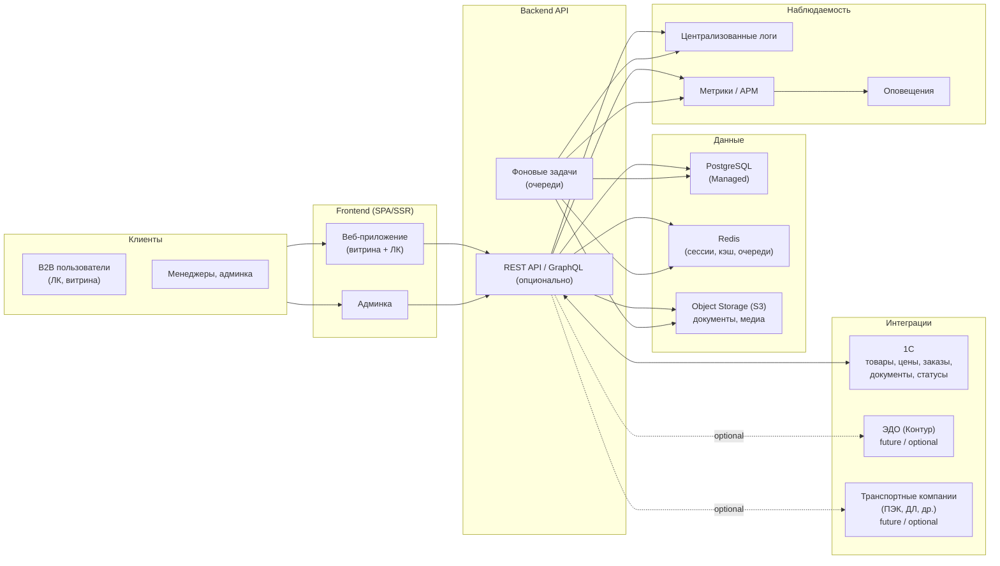

# Техническая часть: архитектура, стек, NFR, инфраструктура

_Автособорка для NotebookLM. Правки вносить в исходные файлы репозитория, затем пересобрать bundle._


---

<!-- notebooklm-source: Техническая часть/Архитектура_платформы.md -->

# Архитектура платформы
Документ описывает высокоуровневую техническую архитектуру B2B‑платформы Palizh: основные компоненты, их роли и связи. На этом этапе фиксируем **гипотезу**, которую далее будем уточнять с ИТ‑командой заказчика и подрядчиками по разработке.

## 1. Общая схема

- **Облако:** Яндекс Облако; приоритет — managed‑сервисы (PostgreSQL, Redis, Object Storage, Managed Kubernetes/Compute).
- **Окружения:** dev / stage / prod (минимум). Отдельные БД, S3‑бакеты и очереди для prod.



## 2. Основные компоненты

- **Frontend (витрина + ЛК)**
  - Веб‑приложение на **Vue 3 + Nuxt 4 + TypeScript** (SSR/SSG для витрины, SPA‑режим для ЛК); подробности и структура описаны в `Frontend_архитектура.md`.
  - Отвечает за пользовательский интерфейс витрины, ЛК, корзины, обучения и т.п.

- **Админка**
  - Интерфейс для маркетинга и внутренних пользователей: контент витрины, акции, обучение, настройки уведомлений и интеграций.

- **Backend API**
  - Реализуется как монолитное приложение на **PHP 8.x + Laravel**: REST API + фоновые задачи на очередях (Redis); для публичного API и SPA в коде используется **Laravel Sanctum** (cookie + CSRF для первой стороны, при необходимости **Bearer API tokens** Sanctum). Продуктовые документы могут по-прежнему использовать формулировку «JWT / Bearer» — см. расшифровку в [`Backend_архитектура.md` §1.1](./Backend_архитектура.md#11-аутентификация-публичного-api-и-spa-реализация-laravel).
  - Реализует бизнес‑логику всех блоков (ЧТЗ 01–12): заказы, доставка, документооборот, бонусы, уведомления, поиск, ЛК, система управления.
  - Экспортирует REST API (и, при необходимости, GraphQL) для фронтенда и внешних интеграций.

- **PostgreSQL**
  - Основное хранилище структурированных данных платформы (контрагенты, пользователи ЛК, заказы, настройки, связи с документами в S3 и т.д.).

- **Redis**
  - Кэш чтения (каталог, справочники), сессии (если будут серверные), очереди фоновых задач (рассылки, синхронизация с 1С, тяжёлые операции).

- **Object Storage (S3)**
  - Хранение файлов: документов (PDF), маркетингового контента (изображения, баннеры), обучающих материалов (видео/презентации или ссылки).

- **Интеграции**
  - **1С:** основная и обязательная интеграционная точка для MVP; через неё платформа получает товары, цены, остатки, заказы, статусы, документы и данные для ЛК.
  - **ЭДО (Контур):** future / optional контур; подключается отдельно, если будет подтверждён как прямой контур платформы.
  - **ТК:** future / optional контур; прямой трекинг и предварительные расчёты подключаются отдельно, если это будет подтверждено как часть MVP или следующего релиза.

На текущем уровне фиксации считаем, что для MVP **прямой интеграционный контур платформы = только 1С**. Если позже будут подтверждены прямые интеграции с `ТК` или `ЭДО`, их нужно описывать как отдельные контуры с собственными требованиями.

- **Наблюдаемость**
  - Централизованный сбор логов (Loki/ELK/YC), метрик (Prometheus/OpenTelemetry) и ошибок (Sentry или аналог), с оповещениями для команды.

## 3. Открытые вопросы по архитектуре

- Kubernetes vs отдельные виртуальные машины в Яндекс Облаке для размещения контейнеров.
- Требования к отказоустойчивости и RPO/RTO (влияют на схему резервирования БД, S3 и Redis).
- Какой уровень «онлайн‑синхронизации» с 1С требуется (почти real‑time vs пакетные обмены).


---

<!-- notebooklm-source: Техническая часть/Backend_архитектура.md -->

# Backend: архитектура
Документ описывает целевую архитектуру backend‑части платформы на уровне модулей и слоёв. Бэкенд реализуется как монолитное приложение на **PHP 8.x + Laravel**; структура слоёв и модулей описана так, чтобы оставаться переносимой при возможном выносе частей в отдельные сервисы в будущем.

## 1. Слои backend

- **API слой**
  - REST‑контроллеры (и/или GraphQL резолверы).
  - Валидация входящих данных, аутентификация и авторизация.

### 1.1 Аутентификация публичного API и SPA (реализация Laravel)

Документы ЧТЗ и продуктовый [`openapi_client_mvp.yaml`](./openapi_client_mvp.yaml) нередко описывают доступ к защищённым ресурсам как **`Authorization: Bearer <token>`** (общий термин «JWT» как про токены в заголовке). В **репозитории разработки** ([nutnet/palizh](https://gitlab.com/nutnet/palizh)) для первой очереди публичного API задействован **Laravel Sanctum**:

- **Первое приложение на тех же доменах/SPA (stateful):** cookie-сессия, заголовки Sanctum, **`GET /csrf-cookie`** (или эквивалент по конфигу) перед изменяющими запросами, защита **CSRF** — см. канонический [`public-http-openapi.yaml`](./public-http-openapi.yaml) и `backend/config/sanctum.php` в GitLab.
- **API-токены Sanctum (Bearer):** допускаются для клиентов, которые не используют cookie-сессию (в т.ч. отдельные клиенты/интеграции); конфиг задаёт истечение и префикс токена.

Итого: формулировки «JWT Bearer» в аналитике — **продуктовый и контрактный ярлык**; фактический стек на MVP — **Sanctum (SPA + при необходимости personal access tokens в заголовке Bearer)**. При согласовании с заказчиком либо унифицируем термины в OpenAPI («Bearer API token», «cookie session»), либо оставляем явное разъяснение в этом разделе.
- **Слой бизнес‑логики (domain / services)**
  - Реализация сценариев из ЧТЗ: оформление заказа, расчёт доставки, выдача документов, работа с бонусами, уведомления, ЛК и т.д.
  - Правила, завязанные на роли (директор, закупщик, бухгалтер, админ).
- **Слой доступа к данным (repositories / persistence)**
  - Обёртки над PostgreSQL, Redis, S3 и внешними API (в первую очередь `1С`; прямые интеграции с `ТК`/`ЭДО` — только если они подтверждены для отдельного контура).
- **Интеграционный слой**
  - Клиенты `1С` как обязательного интеграционного контура MVP.
  - Дополнительные клиенты `ЭДО` / `ТК` — только как отдельные подтверждённые интеграции; `MasProject` не является прямой интеграцией платформы.
  - Конвертация форматов (внутренние DTO ↔ внешние структуры 1С/ТК/ЭДО).
- **Фоновые задачи**
  - Обработка очередей (**email**-уведомления; SMS/push не в текущем плане — ЧТЗ 10), синхронизация с 1С, тяжёлые отчёты.

## 2. Модули по областям (связь с ЧТЗ)

Предварительный список модулей:

- `orders` — заказы (ЧТЗ 01, 08, 03).
- `delivery` — доставка и статусы (ЧТЗ 03, 08).
- `documents` — документооборот (ЧТЗ 02, 05, 09).
- `catalog` — витрина и каталог (ЧТЗ 06, 11).
- `account` — ЛК: профиль пользователя и компании, роли (ЧТЗ 07, 08).
- `bonuses` — бонусная система (ЧТЗ 10, частично 07).
- `notifications` — уведомления и рассылки (ЧТЗ 10).
- `admin` — система управления/админка (ЧТЗ 12).
- `integrations` — 1С, опционально ЭДО/ТК, поисковый сервис.
- `auth` — аутентификация и авторизация, управление сессиями/токенами.

## 3. Интеграция с 1С: требования к реализации

Базовый контракт интеграции описан в [Интеграция_1С.md](./Интеграция_1С.md) и [ЧТЗ 09](../ЧТЗ/09_интеграция_1С.md). В backend-архитектуре это превращается в следующие требования к модулю `integrations.one_c` и смежным слоям.

### 3.1 1С-клиент (исходящие вызовы: платформа → 1С)

- HTTP-клиент (Guzzle / Laravel HTTP Client) с таймаутами: connect ≤ 2 с, read ≤ 10 с по умолчанию (тонкая настройка — по эндпоинту).
- Базовая аутентификация по токену / Basic (конкретная схема — см. ЧТЗ 09 §5 / открытый вопрос №48 в реестре); секрет — из Secrets Manager, с поддержкой ротации.
- Идемпотентность исходящих операций: заголовок / поле `requestId`; при ретрае с тем же `requestId` 1С обязан вернуть тот же результат.
- Retry/backoff: экспоненциальные интервалы с джиттером, ограничение числа попыток; сетевые ошибки и `5xx`/`429` → ретрай, `4xx` кроме `429` → не ретраить.
- **Circuit Breaker** вокруг клиента 1С: при серии сбоев — временное «размыкание», чтобы не нагружать 1С и не держать очереди; в размокнутом состоянии — быстрый fail и перевод операций в отложенную обработку.

### 3.2 Приём входящих вебхуков от 1С (1С → платформа)

Контракт приёма — [Интеграция_1С.md §4.3](./Интеграция_1С.md#43-входящий-вебхук-от-1с-контракт-приёма). Backend обеспечивает:

- Эндпоинт **`POST /exchange`** (вход 1С → платформа), отделённый от клиентского API (свой контроллер и middleware; HMAC).
- Middleware: проверка IP allowlist → проверка HMAC-подписи (`X-Palizh-Signature`) над сырым телом запроса → проверка окна `t ± 5 мин` → поиск `event_id` в `integration_inbox`.
- Быстрый путь: валидация + сохранение сырого события в `integration_inbox` → постановка задачи в очередь → ответ `200/202` клиенту. Бизнес-логика исполняется асинхронно.
- Таблицы: `integration_inbox` (сырое событие), `integration_outbox` (исходящие операции в 1С), `integration_audit_log` (исход, ошибки, ручные re-drive).
- **DLQ (Dead-Letter Queue):** задачи, упавшие `max_attempts` раз, переводятся в DLQ-очередь; алерт в Sentry; ручной re-drive — через админку.

### 3.3 Безопасность и сеть

- Без VPN; доступ — по IP allowlist на обеих сторонах (платформа → 1С и 1С → платформа). См. [Интеграция_1С.md §4.4](./Интеграция_1С.md#44-сетевой-доступ-и-egress-ip).
- Платформа гарантирует фиксированные egress IP по окружениям (Yandex Cloud NAT / статические IP); реестр IP и процедура изменения — в `Интеграция_1С.md §4.4`.
- Секреты (токены, HMAC-ключи): Yandex Lockbox / Secrets Manager; в логах — маскирование.

### 3.4 Наблюдаемость и диагностика

- Единый `correlation_id`, проброшенный между слоями (HTTP-запрос пользователя → фоновые задачи → вызовы 1С); в логах событий 1С — `correlation_id` + `event_id` + `one_c_guid`.
- Структурированные JSON-логи; хранение сырого payload вебхука в `integration_inbox` на срок T (уточняется в НФТ).
- Метрики: RPS вебхука, доля отказов (`4xx/5xx`), p50/p95 времени обработки, глубина очередей, число записей в DLQ, состояние Circuit Breaker.
- Dashboards + алерты на: всплеск `401/403` (проблема allowlist/подписи), рост DLQ, длительное размыкание Circuit Breaker, отставание регламентной синхронизации.

### 3.5 Тестирование

- Интеграционные тесты с Mock HTTP для 1С (WireMock / аналог).
- Тесты идемпотентности (повторная отправка `requestId` / `event_id` не создаёт дублей).
- Тесты подписи (валидная / невалидная / просроченная).
- Контрактные тесты под OpenAPI платформы (`openapi_client_mvp.yaml`, `openapi_1c_inbound_mvp.yaml` или объединённый `openapi_mvp_merged.yaml` — см. `OpenAPI_индекс.md`).

## 4. Открытые вопросы

- Формат модульности внутри Laravel‑монолита (грубое деление по namespace/пакетам vs более жёсткое разделение bounded contexts).
- Требуемый уровень изоляции для интеграционных частей (отдельный сервис «интеграция с 1С» в будущем или модуль `integrations` внутри общего backend на первом этапе).
- Требования к масштабированию отдельных модулей (например, поиск, уведомления) и критерии, при которых разумно выносить их из монолита.
- Окончательная схема аутентификации приложения 1С ↔ платформы (токен / Basic / mTLS) — зависит от возможностей 1С ERP 2.5.22 (открытый вопрос №48 реестра).


---

<!-- notebooklm-source: Техническая часть/Backend_план_работ_MVP.md -->

# План работ бэкенда (MVP Palizh): задачи, оценка, блокеры, риски

**Назначение:** ориентир для тимлида бэка и планирования спринтов. Оценки приближённые (**ч/д** — человеко-дни одного middle+/senior бэкенд-разработчика, календарные сроки зависят от состава команды и параллельности).

**Опоры на артефакты:** `Backend_архитектура.md`, `Архитектура_платформы.md`, OpenAPI (`openapi_client_mvp.yaml`, `openapi_1c_inbound_mvp.yaml`, `1c-http-openapi.yaml`), `Интеграция_1С.md`, `Принятые_решения_API_интеграция_1С.md`, `Задание_разработчику_админка_MVP.md`, ЧТЗ 01–14 (фрагментарно).

**Стек (зафиксирован в документации):** PHP 8 + Laravel, PostgreSQL, Redis (кэш/очереди), Yandex Cloud, исходящие вызовы в 1С (HTTP), вход `POST /exchange` (HMAC).

---

## 1. Допущения для оценки

| Параметр | Значение |
|------------|----------|
| Один **ч/д** | ~6 ч чистой работы разработчика (без совещаний). |
| Уровень | команда знает Laravel, CI, Docker. |
| Контур 1С | тестовый URL + учётки даёт **заказчик**; до этого — моки/WIreMock. |
| Параллельность | инфраструктура и «скелет» приложения частично параллельны с доменными модулями (2 разработчика). |

---

## 2. Эпики, задачи и оценка

### Фаза 0 — Основа (блок для всего остального)

| ID | Задача | Результат / критерий | Оценка (ч/д) | Зависит от |
|----|--------|---------------------|--------------|------------|
| 0.1 | Репозиторий backend: каркас Laravel, окружения `.env.example`, Dockerfile, локальный `compose` (pg, redis) | CI проходит lint + unit scaffold | **2–3** | — |
| 0.2 | **YC:** VPC, Managed PostgreSQL, Redis, Lockbox для секретов, S3 bucket (медиа/вложения), **NAT + фиксация egress IP** (whitelist к 1С) | Terraform/Ansible или ручная схема задокументирована в `Инфраструктура_и_CI-CD.md` | **5–10** | доступы к YC |
| 0.3 | Деплой **stage**: образ в Registry, приложение за балансером/ingress, миграции, healthchecks | Smoke `GET /health` | **3–6** | 0.2 |
| 0.4 | CI/CD: сборка, тесты в pipeline, деплой на stage по ветке/tag | Автоматический деплой | **3–5** | 0.1, 0.3 |
| 0.5 | Общая инфраструктура наблюдаемости: JSON-logs, базовые метрики, Sentry/error tracking | Алерты на 5xx (минимум) | **2–4** | 0.3 |

**Фаза 0 итого:** **15–28 ч/д** (сильный разброс от зрелости DevOps-практики).

---

### Фаза A — Общая платформа API

| ID | Задача | Результат | Оценка (ч/д) | Зависит от |
|----|--------|-----------|--------------|------------|
| A.1 | Версионирование API, единый формат ошибок, `Correlation-Id`/request id middleware | Контракт близко к OpenAPI | **2–3** | 0.1 |
| A.2 | **Авторизация** (в коде Sanctum — SPA/cookie+CSRF и/или API tokens; см. `Backend_архитектура.md` §1.1): регистрация/активация по сценарию ЧТЗ 05 (минимально — вход по email+password, refresh по решению) | Защищённые роуты | **4–8** | согласование с UX/ЧТЗ 05 |
| A.3 | RBAC клиентского ЛК (роли директор/мастер, закупщик, бухгалтер) — gates на уровне policy | 403 на чужих разделах | **4–7** | A.2, ЧТЗ 07 |
| A.4 | Файловое хранилище S3: presigned upload для вложений (претензии, нестандарт) | Лимиты размера, MIME | **2–4** | 0.2 |

**Фаза A (минимальный контур доступа):** **12–22 ч/д**.

---

### Фаза B — Интеграция 1С (критический путь)

| ID | Задача | Результат | Оценка (ч/д) | Зависит от |
|----|--------|-----------|--------------|------------|
| B.1 | **Входящий** `POST /exchange`: middleware IP allowlist + HMAC по сырому телу, валидация `event`/`payload`, ответ **202**, запись в `integration_inbox` | Соответствие `openapi_1c_inbound_mvp.yaml` | **5–8** | секрет HMAC, список IP от заказчика |
| B.2 | Очередь обработчиков `sync.products` / `sync.categories` / `sync.counterparties`: маппинг в сущности каталога (упрощённо → полно) | Товары/категории видны через внутренний/публичный API | **12–20** | стабильные примеры JSON от 1С |
| B.3 | Идемпотентность пакетов (хэш тела / внешний batch id / ключ в payload — **уточнить с 1С**) | Повтор не плодит дублей | **3–5** | решение с заказчиком |
| B.4 | **Исходящий** клиент 1С: `POST /post_orders`, `GET /get_documents`, Basic auth, таймауты, retry, circuit breaker | Вызовы из job после оформления заказа | **5–8** | тестовый HTTP 1С |
| B.5 | `integration_outbox` + доставка заказа в 1С; поля `integrationSyncState`, ручной re-drive (опц. админ API) | См. `order_lifecycle_contract.md` | **6–10** | B.4, домен заказа (см. C) |
| B.6 | DLQ, audit log, алерты по росту DLQ | Операционная готовность | **3–5** | B.1–B.2 |

**Фаза B итого:** **34–56 ч/д** (высокая неопределённость JSON от 1С).

---

### Фаза C — Домен: каталог, корзина, заказ (клиентский API)

| ID | Задача | Результат | Оценка (ч/д) | Зависит от |
|----|--------|-----------|--------------|------------|
| C.1 | Каталог: read API под `openapi_client_mvp` (списки, карточка, фильтры MVP) | Данные из БД после B.2 | **8–14** | B.2 (или seed) |
| C.2 | Корзина (серверная или гибрид — по спеке), пересчёт с учётом персональных цен | Соответствие ЧТЗ 01/06 | **6–12** | C.1, A.2 |
| C.3 | Оформление заказа: создание заказа на платформе, очередь в 1С, статусы оплаты (MVP-3 статуса) | `POST /orders` контур | **10–16** | C.2, B.4–B.5 |
| C.4 | История заказов, карточка заказа, delivery-детали (поля из ЧТЗ 03/08) | Read API | **6–10** | C.3 |
| C.5 | Документы ЛК: прокси-запрос к 1С `get_documents`, не хранить PDF вечно (метаданные + url/временная ссылка по политике) | ЧТЗ 02 | **4–8** | B.4 |

**Фаза C итого:** **34–60 ч/д**.

---

### Фаза D — Уведомления email

| ID | Задача | Результат | Оценка (ч/д) | Зависит от |
|----|--------|-----------|--------------|------------|
| D.1 | Подключение провайдера (SMTP/API), очередь писем, шаблонизатор | Базовая отправка | **3–5** | выбор провайдера |
| D.2 | Хранение шаблонов и маршрутизации в БД (под админку), рендер с подстановками | ЧТЗ 10 + список в `Задание_разработчику_админка_MVP.md` §5 | **8–14** | D.1 |

**Фаза D итого:** **11–19 ч/д**.

---

### Фаза E — Админка (API под `Задание_разработчику_админка_MVP.md`)

| ID | Задача | Результат | Оценка (ч/д) | Зависит от |
|----|--------|-----------|--------------|------------|
| E.1 | Отдельная auth админов (sessions/JWT админских), роли `superadmin` / `support` / `content_editor` | RBAC таблица из задания | **4–6** | A.1 |
| E.2 | CRUD контента (новости, баннеры, акции, обучение, страницы) + связь с S3 для медиа | ЧТЗ 12 | **10–18** | E.1 |
| E.3 | Пользователи ЛК: список, блокировка, сброс пароля, служебная привязка | ЧТЗ 05/07 | **5–9** | A.2, E.1 |
| E.4 | Настройки платформы (порог доставки, контакты) + модель маршрутизации типов обращений | ЧТЗ 12 | **4–7** | E.1 |

**Фаза E итого:** **23–40 ч/д**.

---

### Фаза F — Прочее MVP по ЧТЗ (частично можно распараллелить после A+C)

| ID | Задача | Оценка (ч/д) | Примечание |
|----|--------|--------------|------------|
| F.1 | Онбординг «Стать клиентом» — API заявки, GUID | **3–6** | |
| F.2 | Претензии и обращения по заказу, нестандартная заявка — сохранение + вызов email | **6–12** | Форма — см. `Форма_претензии_UI_API.md` |
| F.3 | Обучение: заявка, история как в ЧТЗ 14 | **3–6** | |
| F.4 | Поиск по каталогу: `GET /search/products`, PG/full-text на платформе (ЧТЗ 11) | **5–15** | Без Ensi; сверка с `public-http-openapi.yaml` |

**Фаза F итого:** **17–39 ч/д**.

---

### Сводка по фазам (диапазоны)

| Фаза | Мин сумма ч/д | Макс сумма ч/д |
|------|----------------|----------------|
| 0 Основа | 15 | 28 |
| A Платформа API | 12 | 22 |
| B 1С | 34 | 56 |
| C Каталог/заказ | 34 | 60 |
| D Email | 11 | 19 |
| E Админка | 23 | 40 |
| F Остальное MVP | 17 | 39 |
| **Всего (последовательно один dev)** | **146** | **264** |

**С двумя разработчиками** и правильным разнесением (0+infra | B параллельно с A+E частично с C после B.2)** календарь часто укладывается в **~3–5 месяцев** чистого бэка при отсутствии длинных блокировок со стороны 1С/дизайна — только ориентир, не обязательство.

---

## 3. Блокирующие факторы (что реально тормозит старт или прогресс)

| Фактор | Что нужно разблокировать | Влияние |
|--------|---------------------------|---------|
| **Тестовый HTTP 1С** (incoming + outgoing) без стенда только моками | Доступ от заказчика, egress IP передан для whitelist у них | B.4–B.5, часть C.5 живьём |
| **Стабильные примеры JSON** для `sync.*` (`event`/`payload`) | Согласование с командой 1С + Принятые решения / `incoming-hooks` | B.2 (иначе многократные переделки) |
| **Схема auth 1С ↔ платформа** (HMAC есть; исходящий Basic/token — финализация) | Закрытие реестра №48 / техническое решение | B.4 |
| **Идемпотентность пакета exchange** | Ключ поля или заголовка согласован с 1С | B.3 |
| **Провайдер email** prod + лимиты, DKIM | Договор подрядчик/Яндекс/другое | D.1 prod |
| **Точные статусы оплаты и поля счёта** на стыке платформа–1С | Уточнение ЧТЗ 01 при интеграции | C.3 |

---

## 4. Риски и смягчение

| Риск | Вероятность / ущерб | Смягчение |
|------|---------------------|-----------|
| **Разъезд JSON каталога** с реальными выгрузками 1С | Высокая / затягивание B.2 | Контрактные тесты на golden-files; ограничить MVP «минимальной карточкой товара»; отдельные поля `raw`/`metadata` nullable |
| **Задержка стенда 1С** до конца календаря | Средняя / простой интеграции | WireMock контракты; симулятор exchange; синк «один раз в день» вручную на stage недопустимо — но mock допустим |
| **Объединение клиентской и админской auth** ошибочной реализацией | Средняя / security инцидент | Разные guard’ы и префиксы роутов; отдельные таблицы админ-пользователей |
| **Перегрузка scope MVP** из фронта (новые поля без OpenAPI) | Средняя / срыв спринта | Freeze OpenAPI неделя за неделей; любые изменения — через версию или обсуждение |
| **Нагрузочные ограничения 1С** (частота exchange) | Средняя / очередь и лаг данных | Rate limit на приёме осознанно; батчи; мониторинг глубины очереди |
| **НФТ не зафиксированы** (RPO, хранение PII логов) | Низкая–средняя / переделки | Раннее мини-согласование с ИТ заказчика по 152‑ФЗ и retention логов/вложений |

---

## 5. Рекомендуемая последовательность первых спринтов

1. **Спринт 1:** 0.1–0.3 + A.1 + B.1 (приём пустышки exchange до inbox) → **видимый прогресс интеграции**.  
2. **Спринт 2:** B.2 (минимальный импорт) + D.1 + начало A.2.  
3. **Спринт 3:** C.1–C.2 на seed/импорте + B.4 на моках.  
4. **Далее:** C.3 ↔ B.5, параллельно E.1–E.2.

---

## 6. Открытые вопросы к продукту/тимлиду (до жёсткого freeze)

1. Объём **MVP-поиска** (full-text на платформе vs упрощение `ILIKE` на первом этапе).  
2. Нужен ли на старте **журнал заявок** и экран заказов с `integrationSyncState` в админке (опционально в ЧТЗ 12 — но дорого упустить операционку).  
3. **JWT refresh** и политика сессий для B2B.  
4. Минимальный набор **статусов оплаты** и источник истины (только платформа vs событие из 1С).

---

*Документ планирования; при утверждении сроков перенести задачи в трекер. Дата версии: 2026-04-18.*


---

<!-- notebooklm-source: Техническая часть/Frontend_архитектура.md -->

# Frontend: архитектура
Документ фиксирует архитектуру фронтенда с прицелом на **web‑first** и последующую упаковку в мобильные приложения для iOS/Android **без переписывания интерфейса с нуля**. Сравнение подходов (PWA, Capacitor, NativeScript-Vue) и двух стратегий Capacitor — в [Мобильное_приложение_подход.md](Мобильное_приложение_подход.md).

## 1. Выбранный стек и подход

- **Стек:**
  - **Vue 3 + Nuxt 4 + TypeScript** — основной фреймворк и рантайм для фронтенда (зафиксировано на старте разработки; маршрутизация, SSR/SSG и сборка — по актуальной документации Nuxt 4).
  - Дизайн‑система/компонентный кит — TBD (готовая библиотека + кастомные компоненты под бренд Palizh).
- **Mobile‑first + упаковка в сторы:**
  - Выбран **Capacitor** (есть опыт в команде, публикация в App Store и Google Play без рисков PWA, богатая экосистема плагинов). PWA и NativeScript-Vue рассмотрены и не выбраны — см. [Мобильное_приложение_подход.md](Мобильное_приложение_подход.md).
  - Фронтенд проекта — **единый web‑клиент**, работающий в браузере и внутри мобильных приложений (web‑view с Nuxt‑приложением). Нативные плагины (push, deep‑links и т.д.) подключаются через Capacitor.
  - **Важно:** для хранения данных на вебе и в нативном приложении используются разные API — в коде нужна **унификация подхода** (единый слой доступа к сессиям, токенам, кэшу).
  - **Стратегия загрузки контента в приложении — принятое решение: Вариант B (remote).** Мобильное приложение вне scope MVP; когда дойдёт до реализации, приоритет отдаётся варианту B (remote): приложение открывает сайт по URL — мгновенные обновления без модерации, нативные фичи подключаются через мост (например, `postMessage`). Офлайн не требуется в первом релизе мобильного приложения. Если по итогам пользовательского тестирования обнаружится потребность в полноценном офлайне, можно будет перейти на вариант A (bundle).

## 2. Тип приложения

- **Публичная часть (витрина, новости, обучение):**
  - SSR/SSG Nuxt для SEO и быстрого первого рендера.
  - Возможность частичной статической генерации (SSG) для контентных разделов.
- **Личный кабинет (B2B):**
  - SPA‑режим поверх Nuxt (CSR), работающий через API.
  - Авторизация и ролевая модель (директор, закупщик, бухгалтер и др.) — на базе токенов/сессий.
- **Админка:**
  - Либо отдельное Nuxt‑приложение, либо отдельная зона того же приложения (отдельный layout/namespace).

## 3. Основные зоны интерфейса

- Витрина: главная, каталоги, карточки товара, поиск, акции, новости, обучение.
- Личный кабинет: профиль, заказы и статусы, документы, уведомления, претензии, бонусы, обучение, оптовый заказ и т.д.
- Админка: управление контентом (витрина, обучение, акции, новости), настройками уведомлений, интеграциями.

## 4. Требования к структуре кода (для будущих приложений в сторах)

- Разделение на слои:
  - **UI‑компоненты** (Vue) — завязаны на DOM/web‑окружение.
  - **Бизнес‑логика и state‑management** — в отдельных слоях/композиционных функциях/сервисах, не завязанных на `window/document`, чтобы при необходимости переиспользовать в других оболочках.
  - **API‑клиенты** — отдельный модуль, работающий с backend‑API.
- Адаптивный дизайн:
  - **Строгий mobile‑first UI**, чтобы в контейнере приложения интерфейс ощущался как «нативный», а не просто сайт в браузере.
  - Отдельные компоненты/лейауты для мобильной навигации (нижнее меню, бургер‑меню, полноэкранные модальные окна).
- Авторизация и сессии:
  - Корректная работа авторизации в «обёртке» (Capacitor): аккуратное использование cookie vs токенов в storage (учитывать ограничения web‑view).
  - **Унификация хранения:** веб и нативное приложение используют разные API для данных (сессии, токены, кэш) — нужен единый слой доступа в коде, чтобы не дублировать логику и предсказуемо вести себя в браузере и в приложении.
  - Не завязывать критичную бизнес‑логику на чисто браузерные особенности хранения, чтобы поведение в приложении и в браузере было предсказуемым.

## 5. Рекомендуемая структура каталогов

Пример структуры проекта (Nuxt):

```text
src/
  app/ или pages/         # Маршруты Nuxt (витрина, ЛК, админка)
  components/             # Переиспользуемые UI‑компоненты (кнопки, формы, таблицы, карточки)
  widgets/                # Составные блоки (Header, Footer, MobileNav, Sidebar и т.п.)
  features/               # Фичи по доменам (orders, catalog, profile, documents, bonuses...)
  entities/               # Базовые доменные сущности (User, Company, Order, Product, Document...)
  shared/
    api/                  # Клиенты к backend‑API (http‑клиент, auth, catalog, orders и т.д.)
    config/               # Конфигурация (урлы, флаги фич, env)
    lib/                  # Утилиты (форматирование, валидации, дата/время)
    ui/                   # Базовые UI‑элементы и дизайн‑система
    native/               # Обёртки над Capacitor/нативными плагинами (push, deeplinks и др.)
```

Логика:

- **`app/` / `pages/`** — только маршруты и подключение нужных layout/feature‑компонентов (Nuxt‑маршруты).
- **`features/`** — сценарии (просмотр заказов, оформление заказа, управление профилем и т.п.), которые собирают `entities` + `components` и используют `shared/api` (можно реализовывать через composables и Pinia).
- **`entities/`** — описания доменных моделей и, при необходимости, небольшой state‑management на уровне сущностей (например, через Pinia).
- **`shared/`** — всё общее и переиспользуемое, в том числе слой работы с API и нативными возможностями (через `native/`), чтобы фронт в браузере и в приложении мог использовать один и тот же интерфейс.

## 6. Открытые вопросы

- Конкретный выбор компонентной библиотеки и дизайн‑системы.
- **Стратегия Capacitor:** bundle (сайт внутри приложения) vs remote (приложение открывает сайт по URL) — от выбора зависят офлайн, частота обновлений без модерации сторов и сложность моста для нативных фич. Список вопросов для принятия решения — [Мобильное_приложение_подход.md, раздел 4](Мобильное_приложение_подход.md#4-вопросы-для-уточнения).
- Требования к офлайновой работе в мобильном приложении (полноценный офлайн нужен в MVP или нет).
- Глубина использования нативных возможностей (push, deep links, биометрия и др.) и при варианте B — объём работ по мосту site↔app.
- Реализация унифицированного слоя хранения данных для веба и нативного приложения (где живёт, кто поддерживает).


---

<!-- notebooklm-source: Техническая часть/Техстек_общий.md -->

# Технологический стек
Документ фиксирует текущую гипотезу по технологическому стеку платформы Palizh. На этом этапе важнее **прозрачно зафиксировать решения и неизвестные**, чем выбрать «идеальный» стек — все пункты помечены как уточняемые.

## 1. Облако и окружения

- **Облако:** Яндекс Облако.
- **Окружения:** `dev`, `stage`, `prod` (минимум), с раздельными:
  - кластерами БД;
  - S3‑бакетами;
  - очередями/Redis;
  - настройками логирования и алертинга.

## 2. Backend

- **Язык и фреймворк:** **PHP 8.x + Laravel** (монолитное приложение).
  - Основной подход — единый backend‑монолит с внутренним делением на модули по доменам (заказы, доставка, каталог, ЛК, интеграции и т.д.), с возможностью выноса отдельных частей в микросервисы в будущем при необходимости.
  - Причины выбора: наличие компетенций по Laravel, зрелая экосистема, удобная работа с БД, очередями и интеграциями.
- **API:**
  - REST/JSON (основной вариант).
  - Описание в **OpenAPI/Swagger** (генерация из кода через пакет для Laravel).
  - Возможное добавление GraphQL только при реальной необходимости (например, для сложных выборок каталога/поиска).
- **Авторизация и безопасность API:**
  - Реализованный подход на стороне кода (**GitLab nutnet/palizh**) — **Laravel Sanctum**: для **SPA на том же сайте** — cookie-сессия и защита **CSRF** (см. [`public-http-openapi.yaml`](public-http-openapi.yaml)); для машин-к-клиента — **личные API tokens** в заголовке **`Authorization: Bearer …`** (не обязательно JWT в классическом смысле).
  - В текстах ЧТЗ и [`openapi_client_mvp.yaml`](openapi_client_mvp.yaml) сохранена привычная формулировка **JWT / Bearer** как целевой модели для клиента; при противоречиях ориентироваться на канон **`docs/public-http-openapi.yaml`** в GitLab и на [`Backend_архитектура.md` §1.1](./Backend_архитектура.md#11-аутентификация-публичного-api-и-spa-реализация-laravel).
  - Секреты/ключи и префиксы токенов хранятся в защищённых сервисах (Lockbox/Secrets Manager); дополнительные схемы авторизации добавляются при интеграции с внешними системами.
- **Сервер и окружение выполнения:**
  - Docker‑контейнеры с PHP‑FPM + web‑сервер (Nginx/Ingress).
  - Развёртывание в:
    - либо Managed Kubernetes (Yandex Managed Service for Kubernetes),
    - либо YC Compute с оркестрацией через CI/CD.
- **Доступ к данным:**
  - Eloquent‑модели, миграции Laravel.
  - При необходимости — репозитории/сервисы поверх Eloquent для явного разделения доменной логики и слоя хранения.
- **Фоновые задачи:**
  - Очереди Laravel (Redis как брокер), worker‑контейнеры для фоновых задач (уведомления, интеграции с 1С/ТК, тяжёлые отчёты).
  - Мониторинг очередей через Horizon или аналогичный инструмент.

## 3. Frontend

- **Технологический стек:** **Vue 3 + Nuxt 4 + TypeScript** (решение по мажорной версии Nuxt — на старте разработки).
- **Тип приложения:**
  - Публичная витрина — **SSR/SSG** через Nuxt (SEO, скорость первого рендера).
  - Личный кабинет — SPA‑режим поверх Nuxt (CSR).
- **Мобильные приложения (iOS/Android):**
  - Подход **web‑first**: единый фронтенд в браузере и в приложениях. Упаковка через **Capacitor** (есть опыт в команде; PWA и NativeScript-Vue рассмотрены, не выбраны — см. [Мобильное_приложение_подход.md](Мобильное_приложение_подход.md)).
  - Два варианта: (A) сайт вшит в приложение (офлайн, но обновления через модерацию сторов) или (B) приложение открывает сайт по URL (мгновенные обновления, нативные фичи через мост postMessage, офлайн уточняется). Выбор — по ответам на вопросы в указанном документе.
  - Требуется **унификация слоя хранения данных** (веб и нативное приложение используют разные API).
  - Нативные плагины (push, deep‑links и т.п.) подключаются по мере необходимости.
- **Сборка и деплой:**
  - Сборка в Docker‑образ.
  - Раздача через reverse‑proxy (Nginx/Ingress) и, при необходимости, CDN Яндекса.

## 4. База данных

- **СУБД:** PostgreSQL (Yandex Managed PostgreSQL).
- **Миграции:** стандартный инструмент фреймворка или специализированный (Flyway/Liquibase).
- **Подход к моделированию:**
  - Сущности, исходя из ЧТЗ и Инфарх: пользователи, компании, заказы, позиции заказов, статусы, документы, настройки, контент витрины и т.д.
  - Отдельные схемы для операционных данных и служебных (аудит, логи уровня приложения — если хранить в БД).

## 5. Кэш, очереди, сессии

- **Redis:** Yandex Managed Redis.
  - Кэширование данных каталога/справочников (для разгрузки БД).
  - Хранение сессий (если будет использоваться серверный session storage).
  - Очереди задач (уведомления, интеграции, тяжёлые фоновые операции).

## 6. Хранение файлов

- **Object Storage (S3):**
  - Документы: PDF и другие файлы, которые платформа временно или постоянно хранит у себя по согласованному сценарию.
  - Для клиентских документов в ЛК действует рабочее правило: если документ должен выдаваться клиенту автоматически, источником выдачи для платформы должна быть `1С`; дополнительные документы (`TDS`, `СГР`, паспорта безопасности и т.д.) должны быть предварительно заведены/связаны в `1С`, если они входят в контур ЛК.
  - Маркетинговые материалы: изображения, баннеры, промо‑материалы.
  - Материалы по обучению: презентации, видео (либо хранение ссылок на внешние системы).
- Метаданные и связи с объектами платформы — в PostgreSQL.

## 7. Интеграции

### 7.1 1С

- **Для MVP:** `1С` — единственная обязательная прямая интеграция платформы/LK; остальные интеграционные контуры считаются будущими или опциональными, пока не подтверждены отдельно.
- **Гипотеза:** обмен по HTTP API (JSON/XML), с возможностью пакетных выгрузок и инкрементальных обновлений.
- Возможные форматы:
  - XML‑выгрузки (как в тестовом файле `1C/Тест выгрузки.xml`),
  - JSON‑API (в случае наличия доработанных REST‑сервисов в 1С),
  - файлы (XML/CSV) через S3/общие папки.
- Данные:
  - справочники (номенклатура, характеристики, номенклатура контрагента),
  - цены (виды цен, индивидуальные соглашения),
  - остатки,
  - заказы и верхнеуровневые статусы,
  - delivery-детали заказа (маршрут, задание на перевозку, трек‑номер, данные водителя),
  - документы (счёт, УПД, ТТН, акты, паспорта и т.п.).

### 7.2 ЭДО (Контур) — future / optional

- Обмен юридически значимыми документами (счета, акты, УПД и др.).
- API Контур (отправка/получение статусов, ссылки на документы).

### 7.3 Транспортные компании — future / optional

- API ТК (ПЭК, Деловые линии и др., **СДЭК не планируется**).
- Получение трек‑номеров и delivery-деталей; опционально — предварительный расчёт стоимости/сроков.
- На уровне клиентского интерфейса доставка не образует отдельную вторую шкалу статусов: ТК и собственная доставка раскрываются внутри заказа через согласованные детали, а верхнеуровневые статусы заказа приходят из `1С`.

### 7.4 Внутренние системы и обращения

- `MasProject` может использоваться внутри компании как backoffice-инструмент для претензий, но **не является прямой интеграцией платформы/LK**.
- Для клиента в ЛК источником документов и подтверждённых статусов по претензиям является `1С`; если для ЛК нужны новые документы, они должны быть загружены/сформированы в `1С`.

## 8. Наблюдаемость и эксплуатация

- **Логи:**
  - Формат: структурированные логи (JSON).
  - Сбор: Loki / ELK / managed‑решения YC.
- **Ошибки и APM:**
  - Sentry или аналог для фронта и бэка.
  - APM (NewRelic / OpenTelemetry + Grafana).
- **Метрики:**
  - Prometheus‑совместимые метрики.
  - Дашборды в Grafana.
- **Алертинг:**
  - Оповещения в согласованные каналы (почта, чат‑системы).

## 9. Безопасность

- **Секреты:** хранение в Yandex Lockbox / Secrets Manager.
- **Сети:** private‑сегменты для БД/Redis, публичный доступ только через фронт/шлюз.
- **Доступы:** RBAC для админки; разграничение ролей ЛК (директор, закупщик, бухгалтер и др.) — в соответствии с ЧТЗ.

## 10. Открытые вопросы

- Детали конфигурации Laravel (версия PHP/Laravel, структура модулей, соглашения по неймингам и слоям).
- Граница между единым монолитом и потенциальными выносами в отдельные сервисы (что может стать отдельным сервисом при росте нагрузки: интеграции, уведомления, поиск и т.п.).
- **Мобильное приложение:** стратегия Capacitor — bundle (сайт внутри приложения, офлайн) vs remote (сайт по URL, мгновенные обновления); нужен ли полноценный офлайн в MVP. Детали и список вопросов — [Мобильное_приложение_подход.md](Мобильное_приложение_подход.md).
- Требования к SLA, RPO/RTO и резервному копированию (регламент backup/restore).
- Минимально приемлемый набор инструментов для логов/мониторинга (Sentry vs NewRelic vs чистый OpenTelemetry).
- Требования по регуляторике (152‑ФЗ, отраслевые стандарты, международные клиенты).


---

<!-- notebooklm-source: Техническая часть/Нефункциональные_требования.md -->

# Нефункциональные требования (техническая справка)

Короткая техническая справка поверх основного документа НФТ. **Мастер-источник требований** — [ЧТЗ/13_нефункциональные_требования.md](../ЧТЗ/13_нефункциональные_требования.md): там зафиксированы SLA, RPO/RTO, требования к производительности, безопасности, наблюдаемости, соответствию 152-ФЗ и OWASP Top-10. Здесь — только техническая специфика реализации и ссылки на смежные артефакты.

## 1. Облако и развёртывание

- Целевое облако — **Яндекс Облако**; managed-сервисы: PostgreSQL, Redis, S3, Container Registry, Lockbox / Secrets Manager.
- Окружения: dev / stage / prod — изолированные БД, Redis, S3-бакеты, секреты, egress IP. См. [Инфраструктура_и_CI-CD.md](./Инфраструктура_и_CI-CD.md).
- Backend — монолит Laravel (PHP 8.x); фоновые задачи — очереди на Redis + воркеры. Архитектурные детали — [Backend_архитектура.md](./Backend_архитектура.md).

## 2. Резервное копирование и устойчивость

- Регулярные бэкапы PostgreSQL (managed); политика хранения и восстановления — в ЧТЗ 13.
- S3 — versioning + lifecycle для пользовательских файлов (фото товаров, вложения претензий/обращений).
- Целевые RPO/RTO — в ЧТЗ 13; на уровне реализации: PITR для БД, регулярная проверка восстановления из бэкапа.

## 3. Наблюдаемость

- Централизованные логи (структурированные JSON), метрики и алертинг — стек по выбору (Grafana/Loki/Prometheus или аналог в Yandex Cloud).
- Сквозной `correlation_id` между HTTP-запросами пользователя, фоновыми задачами и вызовами 1С; для событий 1С — дополнительно `event_id` и `oneCOrderGuid`.
- Метрики интеграции 1С: RPS вебхука, доля отказов по кодам, глубина очередей, DLQ, состояние Circuit Breaker — см. [Backend_архитектура.md §3.4](./Backend_архитектура.md#34-наблюдаемость-и-диагностика).
- Ошибки уровня приложения — Sentry (или аналог).

## 4. Сеть и интеграции

- **Доступ к 1С — без VPN, по IP allowlist с обеих сторон.** Фиксированные egress IP платформы на окружение, allowlist на стороне 1С; встречно — входящий вебхук от 1С защищён IP allowlist и HMAC-подписью на стороне платформы. Реестр IP, процедура изменения и контракт вебхука — [Интеграция_1С.md §4.3–§4.4](./Интеграция_1С.md#43-входящий-вебхук-от-1с-контракт-приёма).
- Только HTTPS (TLS 1.2+) на публичных и интеграционных эндпоинтах.
- Секреты — в Yandex Lockbox / Secrets Manager; в логах — маскирование; ротация по отдельной процедуре.

## 5. Краткая сводка SLA / RPO / RTO (без дублирования)

Точные значения — в [ЧТЗ/13_нефункциональные_требования.md](../ЧТЗ/13_нефункциональные_требования.md). Здесь — только техническая интерпретация:

- SLA Uptime и время отклика публичных API — основа для настройки таймаутов, ретраев и алертов.
- RPO/RTO — основа для политики бэкапов, PITR и регламента восстановления.
- Требования по наблюдаемости (метрики, алерты, срок хранения логов) — основа для конфигурации Prometheus/Loki/Sentry.

При расхождении значений в документах приоритет — за ЧТЗ 13; техническая справка подстраивается под него.

## 6. Связанные документы

- [ЧТЗ/13_нефункциональные_требования.md](../ЧТЗ/13_нефункциональные_требования.md) — мастер-документ НФТ.
- [Backend_архитектура.md](./Backend_архитектура.md) — слои, модули, интеграционные требования.
- [Инфраструктура_и_CI-CD.md](./Инфраструктура_и_CI-CD.md) — окружения, CI/CD, сеть.
- [Интеграция_1С.md](./Интеграция_1С.md) — архитектура интеграции с 1С, вебхуки, egress IP.


---

<!-- notebooklm-source: Техническая часть/Инфраструктура_и_CI-CD.md -->

# Инфраструктура и CI/CD
## 1. Окружения

- Dev — для разработки и интеграционных тестов.
- Stage — для приёмочного тестирования и демонстраций.
- Prod — боевая среда.

Для каждого окружения:
- собственные БД (Managed PostgreSQL),
- свои кластеры Redis (или логическая изоляция),
- отдельные S3‑бакеты,
- свои настройки логирования и алертинга.

## 2. CI/CD

- CI: сборка и тестирование фронта/бэка при каждом push/merge request.
- CD: автоматический деплой на dev; полуавтоматический (через approve) на stage/prod.
- Хранение артефактов: Docker‑registry (YC Container Registry или аналог).

## 3. Инфраструктурные компоненты

- Reverse‑proxy/ingress (Nginx или managed ingress в Kubernetes).
- Балансировщики Яндекс Облака.
- Секреты: Yandex Lockbox / Secrets Manager.
- Резервное копирование:
  - регулярные бэкапы БД,
  - политика хранения и восстановление,
  - стратегия для файлов в S3 (versioning, lifecycle).

## 4. Сетевой доступ к 1С

- Доступ платформы к 1С — **без VPN**, по **белому списку исходящих IP** платформы на стороне заказчика; встречные вызовы от 1С к платформе — по IP allowlist и HMAC-подписи.
- Каждое окружение (dev / stage / prod) имеет свой фиксированный egress IP; при изменении IP действует процедура уведомления заказчика (≥ 3 рабочих дня) и тестового переключения.
- Реестр egress IP и процедура изменения — в [Техническая часть/Интеграция_1С.md §4.4](Интеграция_1С.md#44-сетевой-доступ-и-egress-ip). Контракт входящего вебхука от 1С — там же, §4.3.

## 5. Открытые вопросы

- Какой инструмент CI/CD используется или предпочтителен у заказчика (GitLab CI, GitHub Actions и т.п.).
- Использовать ли Kubernetes или достаточно управляемых ВМ/групп инстансов.
- Необходимость отдельных demo/sandbox окружений.


---

<!-- notebooklm-source: Техническая часть/Наблюдаемость_и_логи.md -->

# Наблюдаемость и логи
## 1. Логирование

- Структурированные логи (JSON) от всех сервисов (frontend, backend, workers).
- Централизованный сбор:
  - Loki или ELK‑стек,
  - либо managed‑сервисы Яндекс Облака.

## 2. Ошибки и APM

- Sentry (или аналог) для:
  - фронтенда (JS‑ошибки, перформанс),
  - бэкенда (исключения, медленные запросы).
- APM:
  - NewRelic/Datadog или стек на базе OpenTelemetry + Grafana.

## 3. Метрики

- Prometheus‑совместимые метрики:
  - технические (CPU, память, ошибки, латентность),
  - бизнес‑метрики (число заказов, конверсии ключевых шагов).
- Дашборды в Grafana.

## 4. Алерты

- Триггеры по:
  - ошибкам 5xx,
  - задержкам ответов,
  - деградации ключевых бизнес‑метрик.
- Каналы оповещений: корпоративный мессенджер, почта и т.п. (уточнить у заказчика).


---

<!-- notebooklm-source: Техническая часть/Мобильное_приложение_подход.md -->

# Подход к мобильному приложению (iOS/Android): сравнение вариантов

Документ фиксирует комментарии фронтенд‑разработчика по вариантам реализации мобильного приложения и обоснование выбора **Capacitor**. Используется при принятии решений по стратегии (bundle vs remote) и при уточнении требований к офлайну и нативным функциям.

---

## 1. Рассмотренные варианты

### 1.1 PWA (Progressive Web App)

**Суть:** настройка через конфиг, использование браузерного API для взаимодействия с устройством.

| Критерий | Описание |
|----------|----------|
| **Трудозатраты** | На разработку уйдёт меньше всего времени. |
| **Плюсы** | Мгновенные обновления у пользователей — не нужно ждать модерации сторов при выкатке новых версий. С помощью PWABuilder можно упаковать и опубликовать в сторы. |
| **Минусы** | Крайне сложно или невозможно загрузить в **App Store**: Apple блокирует приложения, которые выглядят как обычные сайты (обходные пути требуют детального изучения). Ненадёжный офлайн на мобильных: ОС может очистить кэш браузера при нехватке памяти. Если не публиковать в сторы — пользователям непривычно устанавливать приложение через «Добавить на экран» в браузере. |

**Итог:** не выбирается в качестве основного пути для публикации в сторы из‑за рисков с Apple и офлайном.

---

### 1.2 Capacitor

**Суть:** обёртка веб‑приложения в нативную оболочку, доступ к нативным функциям через API Capacitor. Легко публикуется в App Store и Google Play, богатая экосистема плагинов, большое комьюнити. **Есть опыт разработки на этом инструменте.**

**Общий минус для всех вариантов Capacitor:** для хранения данных на вебе и внутри нативного приложения используются разные API — требуется **унификация подхода** (единый слой доступа к данным в коде).

#### Вариант A: Билд сайта и хранение внутри приложения (bundle)

| Критерий | Описание |
|----------|----------|
| **Плюсы** | Полноценный офлайн‑режим. Нативные плагины и веб‑часть работают в едином контексте — передавать данные между ними проще. |
| **Минусы** | Монорепозиторий: основной сайт и приложение в одном репозитории; возможны сложности при разделении платформенной логики. Любое обновление сайта требует пересборки приложения и прохождения модерации в магазинах. |

#### Вариант B: Capacitor как оболочка, отображающая сайт (remote, iframe/WebView по URL)

| Критерий | Описание |
|----------|----------|
| **Плюсы** | Идеальное разделение: сайт и приложение живут, разрабатываются и деплоятся независимо. Мгновенные обновления: изменения в бизнес‑логике или UI сайта сразу попадают в приложение. Пересборка и модерация в сторы — только при добавлении или обновлении нативных функций. |
| **Минусы** | Изоляция API: для нативных фич (камера, пуши) нужен собственный механизм общения между сайтом и приложением через `window.postMessage` (или аналог). Офлайн по умолчанию недоступен; возможность офлайна — уточнять отдельно. |

**Текущий выбор в проекте:** Capacitor, **вариант B (remote)**. Мобильное приложение вне scope MVP. При реализации приоритет — remote (мгновенные обновления, офлайн не требуется в первом релизе). Переход на bundle (A) возможен, если обнаружится потребность в офлайне.

---

### 1.3 NativeScript-Vue

**Суть:** не использует WebView и не рендерит HTML; исполняет JavaScript (V8) и транслирует его в нативные UI‑компоненты iOS/Android.

| Критерий | Описание |
|----------|----------|
| **Плюсы** | Истинная нативная производительность: анимации, списки, скролл максимально плавные. Прямой доступ к нативным API без дополнительных плагинов. Полноценный офлайн: логика и UI в сборке приложения. |
| **Минусы** | Нет общей кодовой базы для UI: шаблоны переписываются (`<StackLayout>`, `<Label>`, `<Image>` вместо `<div>`, `<span>`, ``). Высокий порог входа: особенности мобильной вёрстки и жизненного цикла нативных приложений. Переиспользовать между сайтом и приложением можно только хранилища, API‑клиенты, утилиты и бизнес‑логику; UI поддерживается в двух экземплярах. |

**Итог:** не выбирается — цель проекта «единый интерфейс сайта и приложения без переписывания с нуля» не выполняется.

---

## 2. Унификация хранения данных (Capacitor)

При использовании Capacitor веб и нативное приложение используют разные механизмы хранения. В коде фронтенда необходимо предусмотреть **единый слой доступа** к данным (сессии, токены, кэш), чтобы:

- в браузере использовались привычные Web API (localStorage, sessionStorage, cookie);
- в приложении — нативные хранилища через плагины Capacitor или общий абстрактный интерфейс.

Это уже отражено в требовании к архитектуре: не завязывать критичную логику на особенности только браузерного или только нативного окружения (см. Frontend_архитектура.md).

---

## 3. Выбор стратегии Capacitor: bundle vs remote

| Требование | Bundle (A) | Remote (B) |
|------------|------------|------------|
| Мгновенные обновления без модерации сторов | Нет | Да |
| Полноценный офлайн | Да | Нет (или требует отдельной проработки) |
| Разделение кодовой базы сайта и приложения | Сложнее (монорепо) | Проще |
| Нативные фичи (push, камера и т.д.) | Проще (единый контекст) | Сложнее (postMessage‑мост) |

Решение по варианту A или B должно быть принято с учётом приоритетов продукта (офлайн, частота обновлений, сложность поддержки моста).

---

## 4. Вопросы для уточнения

Ниже — вопросы, которые стоит согласовать с продуктом и командой перед фиксацией стратегии.

1. **Офлайн‑режим:** нужен ли полноценный офлайн в мобильном приложении в MVP или в первом релизе? Если да — склоняемся к варианту A (bundle). Если нет — вариант B (remote) даёт быстрые обновления без модерации.
2. **Частота обновлений:** насколько критично, чтобы исправления и фичи на сайте сразу попадали в приложение без ожидания модерации App Store/Google Play? Если критично — предпочтителен вариант B.
3. **Нативные функции:** какой минимальный набор нативных возможностей нужен в первом релизе (push, deep links, биометрия, камера и т.д.)? От этого зависит объём работ по мосту site↔app при варианте B.
4. **Офлайн при варианте B:** допустимо ли в первом релизе обойтись без офлайна при выборе remote‑стратегии, или нужно заранее исследовать возможность офлайна (например, Service Worker + кэш в WebView)?
5. **Унификация хранения:** кто и в каком слое кода реализует единый интерфейс доступа к данным (веб vs нативное приложение) — в рамках общего фронтенд‑репозитория или отдельно для приложения?

---

## 5. Связь с другими документами

- **Frontend_архитектура.md** — выбранный стек (Vue 3 + Nuxt 4), требования к слою `shared/native` и к унификации работы с данными.
- **Техстек_общий.md** — краткое упоминание Capacitor и мобильной стратегии.
- **ЧТЗ 10 (Уведомления)** — требования к push‑уведомлениям в приложении влияют на выбор варианта Capacitor и объём нативного кода.


---

<!-- notebooklm-source: Техническая часть/admin_role_and_routing_matrix.md -->

# Admin Role And Routing Matrix

Рабочий артефакт для фиксации ролей админки, границ их ответственности и правил маршрутизации внутренних обращений / заявок.

Цель документа: дать единую основу для проектирования админки `MVP`, настройки уведомлений и описания того, какие объекты обслуживаются на платформе, а какие остаются во внешних контурах (`1С`, почта, CRM, `Mass Project`).

---

## 1. Базовые принципы

- Админка предназначена для сотрудников компании, а не для клиентов.
- `MVP` админки не заменяет `1С`, CRM и внутренние процессы, а покрывает:
  - управление контентом;
  - управление доступом пользователей ЛК;
  - настройку маршрутизации внутренних обращений (**email-адресаты по типам**);
  - **опционально** — просмотр служебного журнала / списка входящих (без тикет-workflow); полноценный учёт обращений в админке **не** входит в MVP (ЧТЗ 12).
- Админка не является вторым источником истины по:
  - контрагентам;
  - договорам;
  - соглашениям;
  - коммерческим условиям;
  - клиентским документам.
- Для `MVP` жизненный цикл претензий и обращений ведётся вне платформы; админка задаёт **адресатов уведомлений**; факт поступления на платформе хранится для клиентского UX и **опционально** для мониторинга.

---

## 2. Канонические роли админки MVP

| Роль | Назначение | Уровень доступа |
| ---- | ---------- | --------------- |
| `суперадмин` | Полный контроль над платформой и настройками админки | Полный |
| `оператор / поддержка` | Работа с пользователями ЛК, входящими обращениями и служебным мониторингом | Операционный |
| `контент-менеджер` | Управление витриной и маркетинговым контентом | Контентный |

---

## 3. Матрица ролей по разделам

| Раздел / действие | `суперадмин` | `оператор / поддержка` | `контент-менеджер` |
| ----------------- | ------------ | ---------------------- | ------------------ |
| Просмотр пользователей ЛК | Да | Да | Нет |
| Блокировка / разблокировка пользователя | Да | Да | Нет |
| Сброс пароля | Да | Да | Нет |
| Просмотр привязки пользователя к контрагенту | Да | Да | Нет |
| Ручное создание / редактирование учётной записи в рамках служебного сценария | Да | Да | Нет |
| Просмотр списка обращений / заявок (если реализован в MVP) | Да | Да | Ограниченно, только по своим контентным сценариям при необходимости |
| Изменение системных настроек платформы | Да | Нет | Нет |
| Настройка маршрутизации внутренних уведомлений | Да | Ограниченно, если это будет разрешено отдельным решением | Нет |
| Управление шаблонами уведомлений | Да | Ограниченно | Нет |
| Управление новостями | Да | Нет | Да |
| Управление баннерами и промо-блоками | Да | Нет | Да |
| Управление акциями | Да | Нет | Да |
| Управление карточками обучения | Да | Нет | Да |
| Управление статическими страницами | Да | Нет | Да |
| Просмотр технических интеграционных связок `1С` | Да | Ограниченно, только на просмотр | Нет |

### 3.1 Комментарий по правам

- Для `MVP` этого уровня детализации достаточно.
- Детальная матрица по операциям, полям и аудитам остаётся post-`MVP` задачей.
- Вопрос о том, может ли `оператор / поддержка` менять маршрутизацию, пока лучше считать **ограниченным** и отдавать приоритет `суперадмину`.

---

## 4. Разделы админки и их границы

| Раздел | Что делает админка | Что остаётся вне админки |
| ------ | ------------------ | ------------------------ |
| Пользователи ЛК | Просмотр, блокировка, разблокировка, сброс пароля, служебная привязка к контрагенту | Создание / изменение контрагента, договора, соглашения в `1С` |
| Контент | Новости, баннеры, акции, обучение, статические страницы | Товарный каталог, цены, коммерческие параметры из `1С` |
| Настройки платформы | Название платформы, контакты поддержки, тексты, ссылки, порог бесплатной доставки | Справочники `1С`, договорные правила доставки |
| Уведомления | Шаблоны, адресаты, маршрутизация внутренних обращений | Фактические бизнес-процессы в CRM / почте / `Mass Project` |
| Список обращений | **Опционально** мониторинг; не обязателен для MVP | Полноценный workflow обработки post-`MVP` |

---

## 5. Типы входящих обращений и заявок MVP

**Разграничение:** **Нестандартная заявка** (отдельный пункт ЛК) — запрос **вне типового заказа из каталога** (оборудования нет на сайте, колеровка специальной партии, нестандартная упаковка и т.д., см. ЧТЗ 01 §4.5). **Обращения и претензии** в ЛК — в контексте **конкретного заказа**; типы претензий — ЧТЗ 04. Путать маршруты и тексты форм нельзя.

| Тип обращения | Источник | Должен быть в админке | Кто обрабатывает по бизнесу |
| ------------- | -------- | --------------------- | --------------------------- |
| `Стать клиентом` | Публичная форма | Да | Менеджер по сопровождению / команда онбординга |
| Общая обратная связь (форма) | **Витрина**; при отдельной настройке — простое обращение из ЛК без контекста заказа (если сохраняется) | Да (маршрутизация email) | Менеджер по сопровождению |
| Общее обращение в ЛК (раздел «Обращения и претензии», **контекст заказа**) | ЛК | Да (маршрутизация email; см. ЧТЗ 01, 04, 07) | Менеджер по сопровождению / ответственный по заказу |
| Чат (виджет стороннего сервиса) | Сайт | **Нет** (настройка вне платформы) | Менеджер по сопровождению / тот канал, куда настроен виджет |
| Претензия | ЛК | Да | Отдел качества / внутренний контур |
| Нестандартная заявка / обращение к менеджеру (форма, обязательный текст) | ЛК, отдельный пункт меню | Да (email-адресаты + шаблоны клиенту) | Менеджер / региональный менеджер |
| Заявка на обучение | ЛК / витрина | Да | Команда обучения / маркетинг / менеджер |
| Запрос документа | ЛК | Да, при необходимости в `MVP` | Менеджер по сопровождению / `1С` |

---

## 6. Матрица маршрутизации обращений

| Тип обращения | Что хранит платформа | Что настраивается в админке | Куда уходит обработка | Клиентский статус на платформе |
| ------------- | -------------------- | --------------------------- | --------------------- | ------------------------------ |
| `Стать клиентом` | Данные заявки, `GUID`, контакты, дата подачи | Email-адресаты, шаблон внутреннего уведомления | Менеджер по сопровождению, далее ручная работа в `1С` | Факт подачи; дальше доступ открывается после активации |
| Общая обратная связь (витрина) | Текст обращения, контакты, дата | Email-адресаты; при необходимости — шаблон клиенту | Менеджер по сопровождению / CRM | По решению продукта: история / экран успеха |
| Общее обращение в ЛК (заказ) | Текст, привязка к заказу (поля — по согласованию с ЧТЗ 04 / формой), дата | Email-адресаты; **шаблон подтверждения клиенту** (ЧТЗ 10) | Менеджер по сопровождению | **История** в ЛК; статус приёма — по ЧТЗ |
| Претензия | Карточка претензии, вложения, связанный заказ / отгрузка | Email-адресаты; шаблон клиенту при необходимости | Отдел качества / `Mass Project` / почта / CRM | `Отправлена` |
| Нестандарт / обращение к менеджеру | Текст запроса (**обязателен**), опционально вложения | Email-адресаты; **шаблон подтверждения клиенту** | Менеджер; сделка и `1С` **вне платформы** | В ЛК — **история** + статус `Отправлено`; список в админке опционален |
| Заявка на обучение | Карточка заявки / регистрация на событие | Email-адресаты | Команда обучения / маркетинг | В ЛК — `Отправлено`; список в админке опционален |
| Запрос документа | Тип документа, связанный заказ / период | Email-адресаты при необходимости | Менеджер / `1С` / внешняя отправка | Зависит от сценария документа |

### 6.1 Обязательные параметры маршрутизации MVP

Для каждого типа обращения в админке должен быть настраиваем:

- один или несколько `email`-адресатов (внутренних);
- активность маршрута;
- шаблон / тема **внутреннего** уведомления;
- где зафиксировано в ЧТЗ — **шаблон письма клиенту** (подтверждение приёма: нестандарт, обучение, претензия, при необходимости общее обращение из ЛК);
- на текущем этапе **только email** (ЧТЗ 10); иные каналы — при отдельном решении post-`MVP`.

---

## 7. Каналы внутренних уведомлений

| Канал | Статус для MVP | Комментарий |
| ----- | -------------- | ----------- |
| `email` | Обязателен | Основной канал маршрутизации внутренних заявок |
| CRM webhook | Post-`MVP` / по уточнению | Возможен как следующий этап |
| Мессенджер | Post-`MVP` / по уточнению | Нужен только если будет отдельное решение |
| Task-system | Post-`MVP` / по уточнению | Для интеграции с task manager / внутренним контуром |

### 7.1 Каноническое решение для MVP

- Для `MVP` достаточно `email`-маршрутизации.
- Остальные каналы не являются обязательными до отдельного бизнес-решения.

---

## 8. Специальные правила по ключевым сценариям

### 8.1 Претензии

- При создании претензии платформа:
  - сохраняет карточку;
  - сохраняет вложения;
  - отправляет внутреннее уведомление по настроенному маршруту.
- Админка в `MVP`:
  - не управляет жизненным циклом претензии;
  - не меняет клиентский статус;
  - не заменяет внешний процесс разбора.
- Клиентская карточка в ЛК остаётся в статусе `Отправлена`.

### 8.2 Онбординг (`Стать клиентом`)

- Платформа сохраняет заявку и генерирует `GUID`.
- Админка показывает факт поступления заявки и служебные данные.
- Дальнейшая работа идёт через менеджера и `1С`.
- Право доступа в ЛК определяется не админкой, а связкой:
  - `GUID заявки` найден у контрагента;
  - у контрагента в `1С` включён признак активности.

### 8.3 Контент

- Контент-менеджер управляет только маркетинговым и редакционным контентом.
- Контент, связанный с каталогом, ценами, остатками и клиентскими документами, не должен редактироваться в админке, если источником истины является `1С`.

### 8.4 Документы

- Админка может настраивать:
  - тексты;
  - подсказки;
  - видимость разделов / описаний.
- Админка не должна становиться основным местом загрузки клиентских документов заказа, если источником выдачи назначена `1С`.

---

## 9. Что именно должно настраиваться в админке MVP

| Блок настроек | Доступно в MVP | Комментарий |
| ------------- | -------------- | ----------- |
| Порог бесплатной доставки | Да | Параметр платформы |
| Контакты поддержки | Да | Публичные и сервисные контакты |
| Название платформы | Да | Общая настройка |
| Общие тексты в формах и уведомлениях | Да | Контент / служебные шаблоны |
| Шаблоны email-уведомлений | Да | Базовый контур |
| Списки адресатов по типам обращений | Да | Ключевой контур маршрутизации |
| Настройки `SMS` / `push` | **Не планируются** на текущем этапе платформы | При смене политики — отдельное ЧТЗ |
| Параметры интеграции `1С` | Ограниченно, лучше только на просмотр | Не делать пользовательским контуром без отдельного решения |

---

## 10. Что нужно подтвердить до проектирования интерфейсов админки

| Блок | Что нужно подтвердить | Приоритет |
| ---- | --------------------- | --------- |
| Роли | Нужно ли расширять роли `MVP` до более детальной матрицы действий | Высокий |
| Маршрутизация | Достаточно ли `email`, или нужен ещё один канал уже на `MVP` | Высокий |
| Списки обращений | Нужны ли фильтры, статусы, поиск и экспорт в `MVP` | Средний |
| Пользователи ЛК | Может ли `оператор` создавать пользователей вручную, или только обслуживать существующих | Высокий |
| Документы | Нужна ли отдельная служебная витрина заявок на документы в `MVP` | Средний |
| Контент обучения | Кто владелец контента и публикации: маркетинг, обучение, смешанная модель | Средний |
| Интеграции | Нужно ли показывать в админке техническое состояние маршрутов уведомлений / интеграций | Низкий |

---

## 11. Связанные документы

- `ЧТЗ/12_система_управления.md`
- `ЧТЗ/10_уведомления.md`
- `ЧТЗ/04_претензии.md`
- `ЧТЗ/05_регистрация_онбординг.md`
- `ЧТЗ/09_интеграция_1С.md`
- `Интервью и встречи/Реестр_открытых_вопросов.md`
