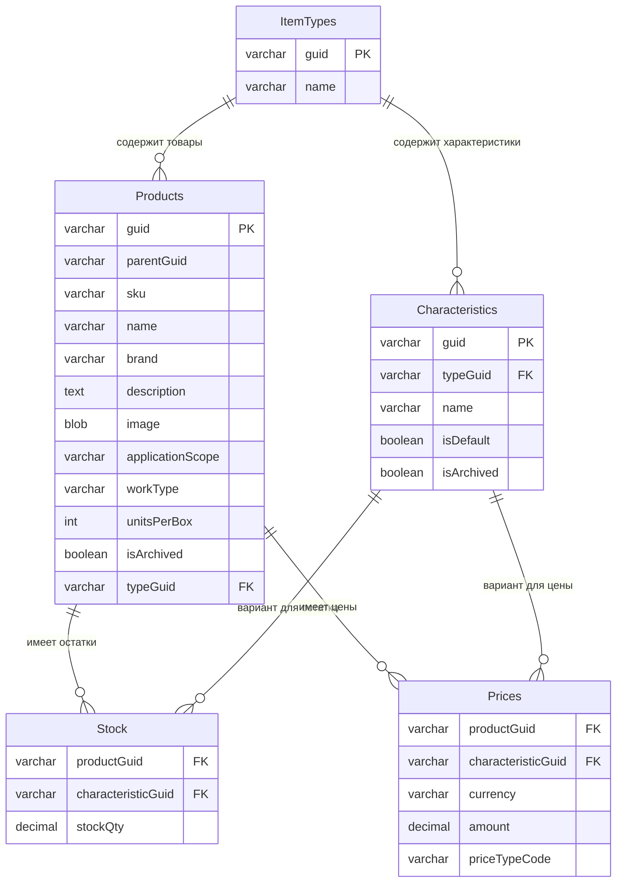
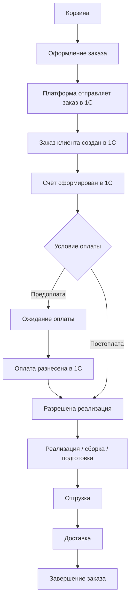

# Техническая часть: интеграция 1С и контракты данных

_Автособорка для NotebookLM. Правки вносить в исходные файлы репозитория, затем пересобрать bundle._

---

<!-- notebooklm-source: Техническая часть/Интеграция_1С.md -->

# Интеграция с 1С
Документ фиксирует начальное понимание интеграции с 1С и вопросы, которые нужно уточнить. На данном этапе опираемся на ЧТЗ 02, 03, 09, саммари интервью и тестовую выгрузку `Техническая часть/1C/Тест выгрузки.xml`.

По итогам интервью 2026-03-13 подтверждено, что используется **1С ERP 2.5.22** и имеется **тестовый контур 1С**, который должен использоваться для разработки и приёмочного тестирования интеграции (отдельные доступы, та же конфигурация и доработки, что в проде).

Дополнительно учтены решения из интервью 2026-03-04 (доставка, бонусы, цены, поиск) и 2026-03-17 (претензии, паспорта качества, уведомления).

## 1. Что точно должно обмениваться с 1С

По текущим ЧТЗ и интервью:

- **Справочники:**
  - Номенклатура товаров (каталог, дерево групп, характеристики).
  - Номенклатура контрагента (связь внутренних кодов с «чужими» кодами клиентов).
  - Справочники типов цен, валют, единиц измерения и т.п.
- **Коммерческие данные:**
  - Виды цен (опт, розница, экспорт и др.); цены на витрине **не отображаются для незарегистрированных пользователей** — только для авторизованных B2B-клиентов по виду цены из соглашения. Если из 1С по товару приходит **ссылка на маркетплейс**, гость может перейти на маркетплейс из карточки товара.
  - Индивидуальные соглашения (условия оплаты, скидки, порог бесплатной доставки, привязка вида цены по умолчанию для конкретного контрагента).
  - Лимиты, отсрочки, бонусные программы.
- **Остатки и производство:**
  - Остатки на складах.
  - Сроки производства / ожидаемая дата поступления (для отображения в корзине/оформлении).
- **Заказы и статусы:**
  - Создание заказов из платформы → 1С.
  - Обновление статусов заказов (6 целевых статусов ЛК ↔ события/документы в 1С).
  - Отдельное техническое состояние синхронизации заказа с 1С (`integrationSyncState`: `pending` / `synced` / `failed` / `manual_review_required`) на стороне платформы.
  - Данные по доставке (маршрут, задание на перевозку, трек‑номера ТК, данные водителя).
- **Бонусная система** (интервью 2026-03-04):
  - 7 типов бонусов: выполнение плана первичных продаж, квартальный план, годовой план, своевременная оплата, поддержание ассортимента, разовые акции, предоплата.
  - Данные хранятся в 1С (отдельные регистры и документы); начисление — бухгалтерия.
  - Частота: месячные, квартальные, годовые; у клиента может быть несколько бонусных программ одновременно.
  - Списание: бухгалтер выписывает документ, сторнирующий бонусы и уменьшающий задолженность.
  - Для ЛК (`MVP`): типы/условия и текущий баланс (из `1С`), **без истории операций**. История начислений/списаний и сценарии списания — **post-MVP**.
- **Кратность упаковки и двойные цены** (интервью 2026-03-04):
  - В 1С хранятся данные об упаковках (НаборУпаковок): количество в коробке, палете.
  - В прайсах две цены: при заказе кратно упаковке и повышенная при некратном количестве.
  - Платформа должна получать из 1С данные о кратности для корректного расчёта цен в корзине.
- **Договоры и допсоглашения** (интервью 2026-03-13):
  - К карточке договора в 1С можно прикреплять файлы (сам договор, дополнительные соглашения).
  - Платформа может получать файлы договора прямо из 1С — нет отдельного хранилища вне 1С.
- **Документы:**
  - Счёт, УПД, ТТН, акт сверки, паспорт качества (минимум для MVP).
  - **Паспорт качества** (интервью 2026-03-17): в 1С есть признак клиента, для которого паспорта обязательны; паспорт формируется как печатная форма / PDF по конкретным партиям из заказа. Клиент запрашивает из карточки заказа → платформа получает PDF из 1С.
  - Дальнейшие документы по списку из ЧТЗ 02 и Реестра документов, но для выдачи в ЛК они должны быть предварительно загружены/привязаны в 1С.

## 2. Формат и пример данных (выгрузка номенклатуры)

В папке `Техническая часть/1C` есть файл `Тест выгрузки.xml` — фрагмент XML‑выгрузки справочника номенклатуры.

Пример (укороченный):

- Элемент `v8:CatalogObject.Номенклатура` содержит:
  - `IsFolder` — признак группы/папки.
  - `Ref` — GUID элемента.
  - `Parent` — GUID родителя.
  - `Code` — код номенклатуры.
  - `Description` — наименование.
  - `КодДляПоиска` — код для поиска (может использоваться как артикул/поисковый ключ).
  - `НаименованиеЯзык1`, `НаименованиеЯзык2` — наименования на других языках.
  - Вложенный блок `Представления` с языками и полным наименованием.
- Для присоединённых файлов (`CatalogObject.НоменклатураПрисоединенныеФайлы`) видны:
  - описание, владелец (ссылка на номенклатуру),
  - автор, дата создания/изменения,
  - признаки шифрования, удаления и т.д.

## 3. Предварительное сопоставление полей 1С ↔ потребности платформы

На основе тестовой выгрузки `Тест выгрузки.xml`:

- **Иерархия каталога**
  - `IsFolder`, `Parent` → дерево групп/категорий витрины.
  - `Description` для папок → название категорий.
- **Идентификация и поиск**
  - `Code` и `КодДляПоиска` → коды для поиска, артикула и технической привязки.
  - `Ref` (GUID) → внутренний ключ для «сквозной» связи с 1С.
- **Отображаемые наименования**
  - `Description`, `НаименованиеПолное` → название товара для витрины/ЛК.
  - `НаименованиеЯзык1/2` → возможные языковые версии (multi‑lang в перспективе).
- **Единицы измерения и упаковка**
  - `ЕдиницаИзмерения`, `НаборУпаковок`, `ЕдиницаДляОтчетов`, `КоэффициентЕдиницыДляОтчетов` → база для:
    - отображения фасовок (банка/ведро/палета),
    - логики «двух цен» (кратно/некратно упаковке) в каталоге и корзине.
- **Физические свойства**
  - `Вес*`, `Объем*`, `СрокГодности`, `ЕдиницаИзмеренияСрокаГодности` → для логистики, отображения характеристик и фильтров (при необходимости).
- **Налоги и учёт**
  - `СтавкаНДС`, `ГруппыФинансовогоУчета`, `ГруппыАналитическогоУчета` и др. → важны для 1С и отчётности, на витрину попадают частично (ставка НДС, страна происхождения и т.п. — по согласованию).
- **Классификаторы и коды**
  - `КодОКПД2`, `КодТНВЭД` и прочие коды → могут понадобиться для экспортного каталога, поиска и отчётности.
- **Присоединённые файлы**
  - Каталог `НоменклатураПрисоединенныеФайлы` и поля `ПутьКФайлу`, `Расширение`, `ФайлХранилище` → источник изображений и, потенциально, TDS/паспортов/СГР, если они привязаны к номенклатуре.
- **Дополнительные реквизиты**
  - Блоки `ДополнительныеРеквизиты` (несколько штук на номенклатуру) → расширяемый набор характеристик (например, номер цвета, принадлежность к линейке, флаги «для сайта» и т.п.).

Эти поля нужно будет отразить в **модели каталога** платформы: что хранится «как есть» из 1С, что агрегируется, что используется только внутренняя логика (логистика/учёт).

## 4. Архитектурный подход к интеграции

**Статус детализации API:** полная формализация JSON-схем по объектам обмена и синхронизация с `openapi_client_mvp.yaml` / `openapi_1c_inbound_mvp.yaml` **выполняются позже** — после появления **базовых реализованных функций на HTTP-сервисах 1С**, проверки того, как у заказчика будут работать вызовы, и получения **новых вводных**. До этого этапа достаточно ЧТЗ 09 и сводных решений ниже (в т.ч. раздел 5.1).

- Выделенный **модуль/сервис интеграции с 1С**, отвечающий за:
  - импорт справочников и каталога;
  - синхронизацию цен и остатков;
  - обмен заказами и статусами;
  - запрос и проксирование документов.
- Возможные режимы (в комбинации):
  - **Каталог (согласование с заказчиком, канон GitLab / стенд):** **не** по расписанию с платформы. **Инициатор — 1С:** последовательные пакеты **`sync.product-attributes`**, **`sync.product-types`**, **`sync.product-type-characteristics`**, **`sync.products`**, **`sync.stocks`**, **`sync.prices`**, **`sync.categories`** (см. [`Модель_данных_каталог_1С_обмен.md`](Модель_данных_каталог_1С_обмен.md)); далее — дельты.
  - **Регулярные пакетные выгрузки** (по расписанию) — для сущностей, где это **отдельно** согласовано (например цены, остатки; **не** как замена push по номенклатуре).
  - **Событийные обновления** (web‑hooks / задания 1С) для заказов, статусов и документов.
- **Каталог (2026-04-21 + заказчик):** первая выгрузка — **полная**; последующие — **только дельты**; **входящий метод API платформы** — **`POST /exchange`** (контракт в `openapi_1c_inbound_mvp.yaml`, примеры — `входящие/incoming-hooks.md`).
- **Инициатор 1С → платформа:** статусы заказа и появление документов — через **тот же** входящий контур **`POST /exchange`** (§4.3), когда соответствующие значения `event` зафиксированы в OpenAPI. Ранее обсуждавшийся отдельный `PUT` по заказу **снят** в пользу единой точки входа.
- **Контрагенты (вызовы 1С с платформы):** выборка **одного контрагента по GUID**; без требования «отдать всех контрагентов» одним запросом.
- Отдельно нужно согласовать:
  - схему **авторизации** приложения к HTTP-сервисам 1С (токен, сертификат, **mTLS** и т.п.) и **сетевой доступ без VPN**: исходящие вызовы только с **заранее согласованных IP** платформы (**белый список** на стороне заказчика), отдельно для тестового и продуктивного контуров при необходимости;
  - набор **внешних идентификаторов** 1С (GUID/ID), которые платформа хранит для контрагентов, договоров, заказов и документов;
  - сценарий **идемпотентности** и повторных запросов при сбоях.

### 4.2 Sync-state заказа и UX при сбоях

- Бизнес-шкала `OrderStatus` остаётся из 6 статусов и отражает только жизненный цикл заказа в 1С.
- Сценарии "заказ принят платформой, но ещё не подтверждён в 1С" и "ошибка доставки в 1С" не добавляют 7-й `OrderStatus`, а отражаются в `integrationSyncState`.
- До `integrationSyncState = synced` поле `oneCOrderGuid` может быть `null`; `201` от `POST /orders` означает принятие заказа платформой, а не обязательное мгновенное создание документа в 1С.
- При `failed`/`manual_review_required` в ЛК показывается отдельный баннер/блок ("обрабатывается поддержкой"), а для команды запускается операционный контур уведомлений и ручной обработки.

### 4.1 Рабочий контракт по онбордингу и идентификаторам

- Для текущего этапа проектирования принимается следующее рабочее допущение:
  - платформа генерирует `GUID заявки`;
  - `GUID заявки` записывается в **карточку контрагента** в 1С как внешний идентификатор;
  - признак `активность`, разрешающий работу клиента через платформу, хранится также в **карточке контрагента**;
  - платформа определяет факт одобрения заявки по связке: `GUID заявки` найден у контрагента + у этого контрагента установлен признак `активность`;
  - договор и соглашение участвуют в бизнес-логике клиента, но не являются первичной технической точкой проверки одобрения заявки.
- Остаётся уточнить уже не бизнес-принцип, а техническую реализацию:
  - название и тип полей в 1С;
  - как обрабатываются дубли по `ИНН/КПП`;
  - что происходит при повторной заявке с тем же email или при несовпадении email и существующего контрагента.

### 4.3 Входящий вебхук от 1С (контракт приёма)

**Статус:** **канон** зафиксирован в [`openapi_1c_inbound_mvp.yaml`](openapi_1c_inbound_mvp.yaml) и [`Принятые_решения_API_интеграция_1С.md`](Принятые_решения_API_интеграция_1С.md) (спека тимлида + проектные дополнения); детализация JSON `payload` уточняется с 1С.

**Назначение.** **Единая точка входа** для данных из 1С в платформу: импорт каталога/справочников и (после расширения перечня `event` в OpenAPI) **операционные** обновления — статусы заказа, документы, доставка и т.д. Пакетные выгрузки **цен, остатков** и иных сущностей — **по отдельному согласованию** (см. §4 и §5.1). **Обучение** с 1С **не** проходит этим контуром.

**Endpoint платформы:** `POST /exchange` (HTTPS, только TLS 1.2+). Тело: **`event`** (строка) + **`payload`** (массив или объект). **Каталог (MVP, канон GitLab / стенд):** `sync.product-attributes`, `sync.product-types`, `sync.product-type-characteristics`, `sync.products`, `sync.stocks`, `sync.prices`, `sync.categories`, `sync.counterparties` — примеры в `входящие/incoming-hooks.md`, модель — `Модель_данных_каталог_1С_обмен.md`. Расширение (заказ, документы) — по согласованию; `event_type` / отдельные пути `…/catalog/sync` **не** используются.

**Безопасность:**

- **Сеть:** IP allowlist на стороне платформы — только исходящие IP продуктового и тестового контуров 1С (см. §4.4 «Сетевой доступ и egress IP»).
- **Подпись запроса:** `HMAC-SHA256` над **сырым** телом JSON; заголовок `X-Palizh-Signature: t=<unix_ts>, v1=<hex>`. Общий секрет — отдельный для test/prod, хранится в Secrets Manager; ротация — отдельной процедурой (вопрос реестра №48).
- **Защита от replay:** окно `t` (например ± 5 минут). **Идемпотентность** пакетов/повторов — по **хэшу тела, внешнему id пакета или согласованным полям** в `payload` / заголовке (детализация при внедрении; при необходимости — единая запись в `integration_inbox` до обработчика).
- **Аутентификация приложения 1С к платформе** в MVP — по HMAC; при необходимости Basic / токен — по согласованию (открытый вопрос C2 / реестр №48).

**Успех приёма (канон):** **HTTP 202 Accepted** + тело `{"ok": true}` (см. YAML; допустимо расширение `jobId`).

**Ответы платформы:**

| Код | Смысл | Поведение 1С |
|-----|--------|--------------|
| `202 Accepted` | Пакет принят, обработка **асинхронна** (канон для MVP) | Успех |
| `400 / 422` | Невалидный payload | Не ретраить без изменений; лог + уведомление интегратору |
| `401 / 403` | Проблемы с подписью или IP allowlist | Не ретраить; сигнал в мониторинг заказчика |
| `429` | Троттлинг на платформе | Ретрай с экспоненциальным backoff |
| `5xx` | Временная ошибка платформы | Ретрай с экспоненциальным backoff |

**Политика ретраев со стороны 1С:** экспоненциальные интервалы `1с, 5с, 30с, 5мин, 30мин, 2ч`; `max_attempts = 8`. После исчерпания — запись в лог ошибок 1С и письмо на технический email (адрес согласуется отдельно).

**Внутри платформы:**

- Приём → запись в `integration_inbox` (сырое тело + заголовки; при необходимости — вынесенный id пакета/хэш) → очередь обработки.
- Обработчики применяют бизнес-изменения и пишут `integration_audit_log` (успех / ошибка / ручное вмешательство).
- **DLQ (Dead-Letter Queue):** события, упавшие больше `max_attempts` обработчика платформы, переводятся в DLQ; алерт в Sentry; возможен ручной re-drive через админку.
- Идемпотентность — по согласованным ключам (см. §4.3); повтор дубликата → noop с ответом **202** (приём подтверждён, обработка не дублируется).

**Открытые вопросы:**

- Фиксировать ли `t` как время 1С или UTC платформы для anti-replay (зависит от синхронизации часов).
- Нужны ли отдельные `event_type` для изменения цен и бонусов в MVP (сейчас идут по расписанию).
- Ограничения платформы 1С на исходящие HTTP POST с кастомными заголовками (подпись).

### 4.4 Сетевой доступ и egress IP

**Модель.** Доступ платформы к HTTP-сервисам 1С — **без VPN**, по **белому списку исходящих IP** платформы, заведённому на стороне заказчика. Входящие вызовы от 1С к платформе (вебхуки) — по **IP allowlist** на стороне платформы и HMAC-подписи (§4.3). Отдельная схема аутентификации приложения к 1С (токен / Basic / mTLS) фиксируется отдельным решением (ЧТЗ 09 §5, реестр открытых вопросов №48).

**Реестр egress IP (placeholder — заполнится при развёртывании):**

| Окружение | Назначение | Egress IP платформы → 1С | Комментарий |
|-----------|------------|---------------------------|-------------|
| **dev** (локально) | Локальная разработка | `TBD` | До появления stage — временное правило по IP офиса / туннеля разработчика, согласовать с ИТ заказчика. |
| **stage** | Приёмочный контур | `TBD` | Фиксируется при поднятии stage (Yandex Cloud NAT / фиксированные исходящие). |
| **prod** | Продуктивный контур | `TBD` | Фиксируется перед MVP-запуском. |

**Процедура изменения IP:**

1. Платформа планирует изменение egress IP (смена региона, NAT, провайдера) заранее.
2. Уведомление ИТ заказчика ≥ 3 рабочих дня: старый IP, новый IP, дата перехода, окно и способ проверки.
3. ИТ заказчика добавляет новый IP в allowlist; платформа выполняет тестовый вызов из каждого окружения; заказчик подтверждает работоспособность.
4. После подтверждения — удаление старого IP из allowlist.

**Открытые вопросы:**

- Кто со стороны заказчика ведёт allowlist (ИТ-служба или администратор 1С).
- Допустимое окно простоя при изменении IP и порядок отката.
- Нужен ли резервный (fallback) IP на случай аварии региона платформы.

## 5. Открытые вопросы по 1С (технические)

- Какая именно конфигурация/редакция 1С используется (управление торговлей, ERP, комплексы доработок)?
- Какие механизмы обмена уже используются:
  - HTTP‑сервисы 1С (web‑сервисы, REST),
  - файлы (XML/CSV) в папку,
  - интеграция с внешними системами (маркетплейсы, сайты) — что уже настроено.
- Ограничения по:
  - частоте обмена (периодичность регламентных заданий),
  - объёму выгрузок (размер номенклатуры, количество клиентов),
  - времени отклика (если будут онлайн‑запросы).
- Как в 1С сейчас:
  - хранятся и обновляются **виды цен** и **индивидуальные соглашения**;
  - ведётся **номенклатура контрагента**;
  - оформляются документы (есть ли единый регламент хранения/выгрузки).
- Какие дополнительные документы (`TDS/MSDS`, `паспорта безопасности`, `СГР`) должны быть заведены в 1С для выдачи в ЛК; если они остаются вне 1С, они не входят в автоматический контур ЛК и выдаются менеджером вручную.
- Какие GUID/внешние ID должны использоваться как ключи обмена между платформой и 1С. Для онбординга рабочее допущение уже принято: `GUID заявки` и флаг `активность` хранятся в карточке контрагента.
- Для `integrationSyncState` по заказам:
  - какая retry policy нужна (интервалы, backoff, max attempts);
  - какое целевое SLA подтверждения заказа из 1С для `MVP`;
  - при каких условиях заказ переводится в `manual_review_required`;
  - кто и по каким каналам получает эскалацию (`email`, админка/операционный список, иные каналы).

### 5.1 Что уже известно после интервью 2026‑03‑13

- **Конфигурация:** используется 1С ERP «Управление предприятием» 2.5, релиз 2.5.22; есть тестовый контур с той же конфигурацией и доработками.
- **Механизм обмена:** согласован гибрид (расписание + события через вебхуки/шину) **для ряда сущностей**; **номенклатура/категории** — **push из 1С** по изменениям (см. §4, согласование с заказчиком).
- **Существующие интеграции:** есть модуль интеграции с Яндекс.Маркетом, который можно использовать как донор для реализации HTTP‑сервисов и обработки ошибок.
- **Цены и скидки:** модель «виды цен + персональная скидка в %» согласована; платформа получает виды цен и проценты скидок из 1С и применяет скидку в корзине (без хранения уникальных пересчитанных цен под каждого контрагента). **Цены на витрине не показываются незарегистрированным пользователям** — только авторизованным B2B-клиентам.
- **Ссылка на маркетплейс:** из 1С по товару может приходить **одна ссылка** (URL) на страницу товара на маркетплейсе. Если ссылка есть, незарегистрированный пользователь может перейти на маркетплейс из карточки товара. Для авторизованных клиентов ссылка также может отображаться, но основной сценарий — покупка через платформу.
- **Онбординг:** принята модель без авто‑создания контрагентов из платформы; используется GUID заявки, генерируемый платформой и записываемый в карточку контрагента в 1С, плюс флаг активности контрагента.
- **Тестовая 1С:** подтверждено наличие тестового контура для разработки и приёмочных испытаний. **Сетевой доступ (согласовано с командой заказчика):** **без VPN** — разрешение входящих вызовов к HTTP-сервисам 1С по **белому списку IP** (в т.ч. egress dev/stage); отдельная учётная запись или ключ API — по договорённости с ИТ заказчика.
- **Регламентный перезапуск сервера ~05:00:** рестарт ОС, поднимаются SQL, 1С и Apache. Интеграция должна быть толерантна к краткосрочной недоступности 1С (ретраи запросов, буферизация через очередь).
- **Формат передачи файлов:** документы как `base64` внутри JSON с указанием типа/расширения; платформа определяет формат по расширению и сохраняет/выдаёт с правильным MIME-типом.
- **Договоры:** файлы договоров и допсоглашений крепятся к карточке договора в 1С; платформа может получать их напрямую через API, без внешнего файлового хранилища.

### 5.2 Дополнительные решения из интервью 2026‑03‑04

- **Бонусы:** 7 типов бонусов хранятся в регистрах `1С`; на платформу для `MVP` передаётся **баланс** и справочная информация по **типам/условиям**. **История начислений/списаний** и сценарии списания/автосписания — **post-MVP**.
- **Кратность упаковки:** из 1С — `unitsPerBox`; в каталоге — отображение цен (**ЧТЗ 06 §4.2.4**); в корзине — **смешанный** расчёт строки на backend: `fullBoxesCount × amountPerBox + remainder × amount` (**ЧТЗ 01 §4.2.4**).
- **Доставка ТК:** работают с Деловые линии, Байкал Сервис; СДЭК не планируется. Логист оформляет заявки — клиент не оформляет. Для ЛК достаточно номера накладной ТК; клиент отслеживает на сайте ТК. Виджеты ТК для расчёта — уточнить для MVP.
- **Порог 120 тыс.:** в 1С нет жёстко зашитого порога; хранить в настройках платформы (админка).
- **Поиск:** полнотекстовый поиск в шапке витрины — **на платформе** по данным каталога (`GET /search/products`); поля и ранжирование — **ЧТЗ 11 §5.5–5.6**. **Facet-фильтры** листинга — API каталога (`GET /products/filters`), не поисковая строка. Номенклатура контрагента в 1С — post-MVP (№34).

### 5.3 Дополнительные решения из интервью 2026‑03‑17

- **Паспорта качества:** в 1С есть признак клиента, для которого паспорта обязательны. Паспорт формируется как печатная форма / PDF по конкретным партиям. Обсуждён сценарий: клиент запрашивает из карточки заказа → платформа получает PDF из 1С.
- **Уведомления:** триггеры о событиях доставки могут приходить из 1С; доставка клиенту на текущем этапе — **email** (настройки на платформе). SMS/push платформой не планируются (ЧТЗ 10).
- **TDS/MSDS/СГР:** сейчас не имеют прозрачной единой схемы хранения в 1С; публикация перенесена на отдельную проработку.
- **Заказ через файл (Excel):** функция признана полезной, критичность для MVP не подтверждена.

### 5.4 Результаты анализа реальных заказов

По 3 примерам заказов из 1С (`Заказ_168.pdf`, `Заказ_201.pdf`, `Заказ_1350.pdf`) выявлены и добавлены в OpenAPI (`openapi_client_mvp.yaml`):

- `unit` (единица измерения) — в `CartItem` и `OrderItem`;
- `vatAmount` (НДС) — в `CartTotals` и `OrderSummary`;
- `itemsCount` (количество позиций) — в `CartTotals` и `OrderSummary`.

Исходные PDF: `Примеры документов/Заказ_168.pdf`, `Заказ_201.pdf`, `Заказ_1350.pdf`; перечень — в [Реестр документов для проектирования](../Интервью%20и%20встречи/Реестр_документов_для_проектирования.md) (позиция № 15).

## 6. Подготовка к интервью с 1С

**Контекст для команды 1С:** В системе нет ЛК менеджера; оперативная коммуникация с клиентом — **внешние каналы** (в т.ч. **чат-виджет стороннего сервиса**, почта), не модуль платформы. Вся документация по заказу (счета, УПД, ТТН, паспорта качества, акты сверки) планируется **получать из 1С**; платформа — точка отображения и выдачи клиенту, 1С — источник истины. Обмен предполагается по **API**; детали механизма (расписание / вебхуки / шина) нужно согласовать.

### 6.1 Список документов и данных: что получаем из 1С

Сводная таблица для согласования с 1С (детальный список вопросов — в [План Интервью: 05_процессы_1С_вопросы.md](../Интервью%20и%20встречи/План%20Интервью/05_процессы_1С_вопросы.md)).

| Категория | Что получаем из 1С | Назначение на платформе |
|-----------|--------------------|--------------------------|
| **Документы по заказу** | Счёт, УПД, ТТН, паспорт качества, акт сверки | Отображение/скачивание в ЛК (ЧТЗ 02) |
| **Справочники** | Номенклатура, группы, свойства; номенклатура контрагента; типы цен, единицы измерения | Каталог, поиск (ЧТЗ 06, 11) |
| **Коммерческие данные** | Цены, соглашения, лимиты, отсрочки, бонусы, правила доставки | Профиль компании, корзина, оформление (ЧТЗ 03, 07) |
| **Остатки и производство** | Остатки, сроки производства / ожидаемая дата поступления | Карточка товара, корзина (ЧТЗ 01, 06) |
| **Заказы и статусы** | Приём заказа с платформы; статусы заказа (6 статусов ЛК), данные доставки (маршрут, трек, водитель) | ЛК: заказы, детализация, трекинг (ЧТЗ 01, 08, 03) |
| **Исполнение претензий** | Новые реализации / новые отгрузки, `УКД`, возвраты, корректировки и иные документы исполнения по претензии | ЛК: претензии, хронология исполнения и документы клиента (ЧТЗ 04, 09) |

**Дополнительно уточнить:** для каждой сущности нужен внешний ID 1С; для дополнительных документов (`TDS/MSDS`, `паспорта безопасности`, `СГР`) нужно определить, какие из них должны быть загружены в 1С для выдачи в ЛК, а какие останутся вне ЛК.

**Что передаём в 1С:** заказ клиента (состав, контрагент, адрес, контакт); заявка «стать клиентом» (опционально); запрос акта сверки / инициация претензии. Внутренний разбор претензии может идти через `Mass Project`, но если по претензии нужны клиентские статусы и документы для ЛК, подтверждённый результат должен попадать в `1С`: новая реализация / новая отгрузка, `УКД`, возврат, корректировка и другие документы исполнения.

## 7. Связь с другими документами

- ЧТЗ:
  - `ЧТЗ/02_документооборот.md`,
  - `ЧТЗ/03_доставка.md`,
  - `ЧТЗ/09_интеграция_1С.md`,
  - а также ЧТЗ 04 (претензии), 06, 07, 08, 10, 11 (каталог, ЛК, статусы, уведомления, поиск).
- Реестры:
  - `Интервью и встречи/Реестр_открытых_вопросов.md` (вопросы по 1С),
  - `Интервью и встречи/Реестр_документов_для_проектирования.md` (образцы печатных форм и документов).
- План интервью с 1С:
  - `Интервью и встречи/План Интервью/05_процессы_1С_вопросы.md` — контекст (нет ЛК менеджера; внешние каналы и чат-виджет; документы из 1С), вопросы по API/расписанию/вебхукам/шине, тестовая 1С, полный список документов и данных для обмена.
- Саммари интервью:
  - `Интервью и встречи/Саммари/2026-03-13_1С_обмен_данными_саммари.md` — конфигурация, механизм обмена, цены/скидки, онбординг, тестовая 1С, ЭДО, договоры.
  - `Интервью и встречи/Саммари/2026-03-04_доставка_бонусы_цены_уведомления_поиск_саммари.md` — бонусы (7 типов), кратность упаковки, порог 120 тыс., доставка ТК, поиск.
  - `Интервью и встречи/Саммари/2026-03-17_претензии_саммари.md` — претензии, паспорта качества, уведомления, дополнительные документы.
  - `Интервью и встречи/Саммари/2026-03-03_маркетинг_витрина_каталог_обучение_саммари.md` — контент из 1С vs админка, TDS/СГР вне 1С, обучение.
- Примеры заказов и реестр образцов:
  - [Реестр документов для проектирования](../Интервью%20и%20встречи/Реестр_документов_для_проектирования.md) — PDF заказов и остальные образцы; маппинг на OpenAPI см. в `openapi_client_mvp.yaml`.
- OpenAPI:
  - `Техническая часть/openapi_client_mvp.yaml`, `openapi_1c_inbound_mvp.yaml` — спецификации API MVP; сводка — `OpenAPI_индекс.md`.

---

<!-- notebooklm-source: Техническая часть/Модель_данных_каталог_1С_обмен.md -->

# Модель данных каталога 1С и обмен с платформой

**Статус:** согласовано по итогам встречи с 1С **2026-05-26**; дополнение по коробке, видам цен и фильтрам — **2026-06-02**; **имена `event` и полей реализованного обмена — канон GitLab / стенд** (2026-06-02). См. [саммари](../Интервью%20и%20встречи/Саммари/2026-05-26_встреча_с_1С_саммари.md).  
**Примеры JSON:** [`входящие/incoming-hooks.md`](../входящие/incoming-hooks.md).  
**Формальный перечень `event`:** [`openapi_1c_inbound_mvp.yaml`](openapi_1c_inbound_mvp.yaml).

---

## 1. Логическая модель (1С / платформа)

Нормализация: **характеристики** (цвет/колер и т.п.) задаются на уровне **вида номенклатуры**, а не дублируются в каждой строке товара. **Остатки** и **цены** — отдельные факты по паре **товар + характеристика** (только заполненные строки, без тысяч нулевых хвостов).

### Соответствие сущностей 1С и полей JSON

| Сущность (логика) | Таблица / справочник 1С (обсуждение) | Ключевые поля в обмене (camelCase) |
|-------------------|--------------------------------------|-------------------------------------|
| Вид номенклатуры (тип товара) | ItemTypes / product-types | `guid`, `name` — событие **`sync.product-types`** |
| Справочник атрибутов | ProductAttributes | `code`, `label`, `valueType`, `filterType`, `unit`, `isFilterable`, `isMulti`, `categories`, `subvalueOptions` — **`sync.product-attributes`** |
| Товар (номенклатура) | Products | `guid`, `parentGuid`, `sku`, `name`, `brand`, `description`, `images[]`, **`unitsPerBox`**, `isArchived`, **`typeGuid`**, **`attributes[]`**, опц. `marketplaceUrls`, `counterpartiesGuid`, `productionTimeDays` |
| Характеристика типа | Characteristics | `guid`, **`typeGuid`**, `name`, `isDefault`, `isArchived`; опц. `ral`, `hex` — **`sync.product-type-characteristics`** |
| Остаток | Stock | **`productGuid`**, **`characteristicGuid`**, **`stockQty`** |
| Цена | Prices | **`productGuid`**, **`characteristicGuid`**, `currency`, `amount`, **`priceTypeCode`** |

**Составной ключ** для строк **Prices:** логически `productGuid` + `characteristicGuid` + `priceTypeCode` (в одном пакете не должно быть дублей).

**Виды цен MVP (2026-06-02):** на пару номенклатура + характеристика — **три** строки в `sync.prices`:

| `priceTypeCode` (рабочее) | Наименование | Назначение |
|---------------------------|--------------|------------|
| `RETAIL` | розница | База для **персональной скидки %** контрагента |
| `WHOLESALE` | опт | Оптовая цена |
| `BOX` | цена за коробку | **Сумма за упаковку целиком** (не за штуку внутри коробки); в 1С — поле/вид цены «цена за коробку» (зафиксировано **2026-06-02**) |

Коды должны совпасть со справочником видов цен в 1С.

**Категории витрины** по-прежнему отдельное дерево — событие **`sync.categories`** (не смешивать с `typeGuid` типа номенклатуры).

**Устаревшие имена (аналитика до 2026-06-02, не использовать на стенде):** `sync.item_types`, `sync.characteristics`, `sync.stock`; поле **`itemTypeGuid`** в JSON (заменено на **`typeGuid`**); отдельные поля `applicationScope` / `workType` в шапке товара — заменены массивом **`attributes[]`** и справочником **`sync.product-attributes`**.

---

## 2. События `POST /exchange` (каталог)

| `event` | Назначение | Типичный режим |
|---------|------------|----------------|
| `sync.product-attributes` | Справочник атрибутов для фильтров и карточки | Редко; дельты при изменении схемы |
| `sync.product-types` | Справочник типов (видов) номенклатуры | Редко; дельты при изменении |
| `sync.product-type-characteristics` | Характеристики внутри типа (цвета, фасовки и т.д.) | Редко; дельты |
| `sync.products` | Шапка номенклатуры **без** вложенных `variants`; **`attributes[]`** | Пакеты при изменении состава |
| `sync.stocks` | Остатки по парам product + characteristic | Часто; допустима **полная перезаливка** среза таблицы остатков |
| `sync.prices` | Цены по парам product + characteristic | Часто; допустима **полная перезаливка** среза |
| `sync.categories` | Дерево категорий витрины | Как раньше |
| `sync.counterparties` | Контрагенты | Как раньше |

**Рекомендуемый порядок** при первичной заливке: `sync.product-attributes` → `sync.product-types` → `sync.product-type-characteristics` → `sync.categories` (параллельно по смыслу) → `sync.products` → `sync.stocks` → `sync.prices`.

**Устарело (до 2026-05-26):** единый `sync.products` с вложенным массивом **`variants[]`** (остатки, цены, картинки внутри варианта). Не использовать в новых выгрузках 1С.

---

## 3. Отображение на витрине (принципы)

- Платформа собирает **SKU/вариант для заказа** по связке **`productGuid` + `characteristicGuid`** (в исходящем `POST /post_orders` — `productVariantGuid` или эквивалент после маппинга).
- Если у товара несколько характеристик с остатком — правило выбора **дефолта** (`isDefault`), **ненулевой остаток**, настройка витрины — уточняется при проектировании UI (см. ЧТЗ 06).
- **~95 %** номенклатуры без отдельной характеристики в 1С: цвет может быть в **наименовании** и в **`hex` на уровне товара**; **~5 %** (колеруемые сборники) — большой справочник характеристик на **виде** «краски». Платформа может нормализовать оба кейса в единую модель карточки.
- **Кратная упаковка:** поле **`unitsPerBox`** («шт. в коробке» в 1С). В карточке: при сценарии упаковки — подпись **«цена / уп.»**; для штучных — **«цена / шт»**.
- **Скидка контрагента** применяется к **розничной** цене (`RETAIL`), если иное не согласовано с 1С.

### 3.1. Атрибуты витрины (фильтры)

**Реализовано на стенде (GitLab):** справочник — **`sync.product-attributes`** (`code`, `label`, `filterType`, …); значения на товаре — массив **`attributes[]`** в **`sync.products`**. Публичный API: `GET /products/filters`, query-параметры **`attr`** / **`attrRange`** — см. [`public-http-openapi.yaml`](public-http-openapi.yaml).

Ранее в аналитике обсуждались фиксированные поля **`applicationScope`** и **`workType`** в шапке товара — **заменены** гибкой моделью атрибутов.

**Открытые вопросы (координация с 1С):**

- **Заполнение** справочника и **`attributes[]`** на реальной номенклатуре в 1С (коды MVP — см. ЧТЗ 06 §4.2.0, принято 2026-06-26).
- **Гибкость модели:** новые атрибуты добавляются через **`sync.product-attributes`** без смены контракта API (решение 2026-06-26).

~~Число групп фиксированное vs гибкое~~ — **гибкое** (стенд); рабочий набор кодов MVP зафиксирован в ЧТЗ 06.

---

## 4. Связанные артефакты

| Документ | Что обновлять при смене модели |
|----------|--------------------------------|
| `входящие/incoming-hooks.md` | Примеры payload |
| `openapi_1c_inbound_mvp.yaml` | `enum` для `event` |
| `Маппинг_API_1С.md` | Поля 1С ↔ JSON |
| `ЧТЗ/09_интеграция_1С.md` | Требования to-be |
| `1C_API_контракт_и_этапы.md` | Таблица методов / этапность |

*Актуализировано: 2026-06-26 (набор кодов атрибутов MVP — ЧТЗ 06 §4.2.0).*

---

<!-- notebooklm-source: Техническая часть/1C_API_контракт_и_этапы.md -->

# API 1С и платформы: контракт, группы методов, этапность

Рабочий артефакт для согласования **списка методов** после смены scope (каталог — push из 1С; **обучение не из 1С**). Канон спецификаций:

| Файл | Назначение |
| ---- | ---------- |
| [`1c-http-openapi.yaml`](1c-http-openapi.yaml) | HTTP-сервисы **на стороне 1С**, куда ходит **бэкенд платформы** (исходящие с платформы). **Канон (тимлид):** `POST /post_orders`, `GET /get_documents?type=&guid=`. |
| [`openapi_client_mvp.yaml`](openapi_client_mvp.yaml) | Публичный API **витрины и ЛК** (браузер/приложение ↔ бэкенд): продуктовый контракт, часто Bearer. Фактический контракт стенда — см. [`public-http-openapi.yaml`](public-http-openapi.yaml) (**канон GitLab** `docs/`); реализация — **Laravel Sanctum**, см. [`OpenAPI_индекс.md`](OpenAPI_индекс.md). |
| [`openapi_1c_inbound_mvp.yaml`](openapi_1c_inbound_mvp.yaml) | **Входящие** вызовы **от 1С** на платформу: **единый** `POST /exchange` (`event` + `payload`), HMAC. См. [`Принятые_решения_API_интеграция_1С.md`](Принятые_решения_API_интеграция_1С.md). |
| [`openapi_mvp_merged.yaml`](openapi_mvp_merged.yaml) | Объединение клиент + 1С inbound (генерация; для инструментов, которым нужен один файл) — см. [`OpenAPI_индекс.md`](OpenAPI_индекс.md). |
| [`openapi_mvp_post_mvp.yaml`](openapi_mvp_post_mvp.yaml) | Расширенный OpenAPI: претензии, админка, обучение, акт сверки — **post-MVP**; в сжатом MVP **не** дублируем. |

**Обучение (ЧТЗ 14):** программы и заявки — контент **админки/платформы**; **обмена с 1С нет** (см. `openapi_mvp_post_mvp.yaml`, тег `Training` — **не** в `openapi_client_mvp.yaml`).

---

## 1. Направление: 1С → платформа (категории + товары)

| Метод | Path | `event` (если применимо) | Смысл | Этап |
| ----- | ---- | ------------------------ | ----- | ---- |
| `POST` | `/exchange` | `sync.product-attributes` | Справочник атрибутов (фильтры, карточка). | **MVP-1 (каталог)** |
| `POST` | `/exchange` | `sync.product-types` | Типы (виды) номенклатуры. | **MVP-1 (каталог)** |
| `POST` | `/exchange` | `sync.product-type-characteristics` | Характеристики типа (цвет, фасовка и т.п.). | **MVP-1 (каталог)** |
| `POST` | `/exchange` | `sync.products` | Номенклатура (шапка), `typeGuid`, `attributes[]`, без `variants[]`. | **MVP-1 (каталог)** |
| `POST` | `/exchange` | `sync.stocks` | Остатки: `productGuid` + `characteristicGuid` + `stockQty`. | **MVP-1 (каталог)** |
| `POST` | `/exchange` | `sync.prices` | Цены: `productGuid` + `characteristicGuid` + `priceTypeCode`. | **MVP-1 (каталог)** |
| `POST` | `/exchange` | `sync.categories` | Дерево категорий витрины. | **MVP-1 (каталог)** |
| `POST` | `/exchange` | `sync.counterparties` | Контрагенты, условия оплаты и т.д. | **MVP-1 (справочник)** |
| `POST` | `/exchange` | *расширение по согласованию* | Статусы заказа, документы, доставка, события ЛК (не «обучение») — после фиксации в OpenAPI. | **MVP-1+ (операции)** |

**Один эндпоинт, одна схема тела** (`event` + `payload`); **последовательные** пакеты при первичной заливке/пересборе и **дельты** при изменениях — **инициатор 1С** (см. ЧТЗ 09). Успех приёма — **HTTP 202** (см. `openapi_1c_inbound_mvp.yaml`). Отдельные пути вида `POST /integrations/1c/catalog/sync` / `.../events` **не** используются.

**Не используем для наполнения витрины:** регламентный «опрос» каталога **с платформы** по таймеру; источник ассортимента для витрины — **импорт выше** + публичные `GET` **на платформе** (`/catalogs/...`, `/products/...`).

---

## 2. Направление: платформа → 1С (HTTP в `1c-http-openapi.yaml`)

Согласованный **MVP-фокус** для проекта: передача **товаров и категорий** в смысле **моделей данных** идёт **на платформу** (см. §1). Со стороны 1С в **`1c-http-openapi.yaml` остаются** только пути, нужные **исходящему** вызову с бэкенда в 1С:

| Группа | Метод | Path | Назначение | Этап |
| ------ | ----- | ---- | ---------- | ---- |
| **A. Заказы** | `POST` | `/post_orders` | Создание «Заказа клиента» **по событию** оформления на платформе (`OrderCreateRequest`, `externalGuid` идемпотентен). | **MVP-1** |
| **B. Документы** | `GET` | `/get_documents?type=&guid=` | Получение файла (JSON + base64) по типу и GUID (см. `1c-http-openapi.yaml`). | **MVP-1b** (сразу после стабилизации заказа) или **MVP-2** — по приоритету ЛК |

**Post-MVP (не в YAML, при необходимости — только в описаниях/отдельном согласовании):** резервный опрос справочников в 1С (`GET` категорий/номенклатуры) для отладки или сверки **не** заменяет импорт через **`POST /exchange`**. Раньше такие пути описывались в ранних версиях документов; в текущем `1c-http-openapi.yaml` их **нет**.

**Исключено из контракта 1C HTTP (лишнее для текущих договорённостей):**

- `GET /counterparties` (список) — **не** нужен массовый список; по ЧТЗ достаточно контрагента **по одному GUID** (отдельный метод, если появится — **не** в этой обрезке).
- `GET /productAttributes` — не обязателен, если метаданные встроены в товар/импорт (согласование 2024–2026 в ЧТЗ 09).

---

## 3. Публичный API платформы (`openapi_client_mvp.yaml`) — группы и привязка к 1С

| Группа (тег) | Смысл | Связь с 1С |
| ------------ | ----- | ---------- |
| `Public Onboarding` | Заявка «стать клиентом» | Платформа → далее ручной онбординг; в 1С — по процессу |
| `Auth`, `Profile` | Вход, профиль, компания | Реквизиты компании из 1С — по событиям/запросам, **не** каталог |
| `Catalog` | Каталог, поиск, карточка | Данные после **импорта**; 1С не отдаёт напрямую в браузер |
| `Cart`, `Orders` | Корзина, оформление, заказы | Заказ уходит в 1С через бэкенд (§2 группа A) |
| `Documents` | Документы в ЛК (запросы, выдача) | События/интеграция — по ЧТЗ 02 |
| `Integration 1C` | Входящие от 1С | `POST /exchange` (`sync.*` и др. по согласованию) |
| *Post-MVP* (`openapi_mvp_post_mvp.yaml`) | Претензии, админка, обучение и др. | Обучение — **без 1С**; претензии/прочее — по соответствующим ЧТЗ |

---

## 4. Этапность внедрения (предложение)

| Этап | Содержание | Критерий готовности |
| ---- | ---------- | --------------------- |
| **0** | Сеть, HMAC, IP allowlist, тестовый контур 1С | См. `Интеграция_1С.md` §4.3–4.4 |
| **1a** | `POST /exchange` (каталог: `sync.product-attributes` … `sync.counterparties`, см. модель), full + delta, публичные `GET` каталога | Витрина с актуальными товарами/категориями |
| **1b** | `POST /exchange` — новые `event` для статусов/документов (когда согласовано в OpenAPI) | ЛК отражает жизненный цикл |
| **1c** | `POST /post_orders` (1C HTTP) из бэкенда платформы | Заказ создаётся в 1С |
| **2** | `GET /get_documents` при необходимости, расширение `event` | Документы в ЛК по ЧТЗ 02 |
| **3** (опц.) | Резервный опрос справочников в 1С (если согласуют) — **вне** текущего `1c-http-openapi.yaml` | Тех. необходимость, post-MVP |

---

## 5. Следующие шаги (согласовать с командой)

1. **Закрепить** таблицу §2: в `1c-http-openapi.yaml` — `POST /post_orders` и `GET /get_documents` (без `counterparties`, `productAttributes`, резервных `GET` каталога).
2. **1С-разработчик:** реализовать **приоритетно** `POST /exchange` (каталог: `sync.product-attributes` … `sync.prices`, см. модель) + дельты; затем **POST** `/post_orders` в сторону 1С.
3. **Платформа:** не смешивать **Training** с интеграцией; контент обучения — отдельный поток (админка).
4. **Синхронизировать** с `Маппинг_API_1С.md` и [`openapi_mvp_integration_1c.md`](openapi_mvp_integration_1c.md) при изменении путей.
5. **Реестр открытых вопросов** — зафиксировать отказ от **обмена обучения** с 1С (при появии записи в реестре).

---

*Дата актуализации: 2026-05-26 — нормализованная модель каталога (`Модель_данных_каталог_1С_обмен.md`).*

---

<!-- notebooklm-source: Техническая часть/Задание_1С_разработчику.md -->

# Задание для 1С-разработчика: исследование полей и объектов

**Цель:** изучить структуру данных в 1С ERP 2.5.22, зафиксировать имена полей, типы, справочники и документы, необходимые для интеграции с B2B-платформой. Результаты лягут в основу контракта обмена данными (API).

**Контекст проекта:** строим B2B-платформу (ЛК + витрина + каталог + заказы) для компании Palizh. 1С — единственный источник истины по товарам, ценам, контрагентам, заказам, документам. Платформа получает данные из 1С по API и отдаёт обратно заказы и заявки. Конфигурация — **1С ERP «Управление предприятием» 2.5.22**. Есть тестовый контур с той же конфигурацией.

**Согласовано в переписке 2026-04-21 и с заказчиком по номенклатуре:** (1) **первая выгрузка каталога на платформу — полная**, далее — **только изменения (дельты)**; (2) **первичное заполнение** — разовая отправка JSON из 1С на платформу (папки + номенклатура), нужен **входящий API платформы**; **(2a) обмен номенклатурой не по расписанию с платформы — инициирует 1С**, первая полная выгрузка **по команде** из 1С, далее 1С **сама отправляет** дельты **при изменениях** в 1С; (3) **статусы заказа и документы** — на платформу по **тому же** входу **`POST /exchange`** (см. `Интеграция_1С.md` §4.3, `openapi_1c_inbound_mvp.yaml`); отдельный `PUT` по заказу **не** планируем; (4) **контрагент** — выборка **по одному GUID**, без выгрузки всех контрагентов списком; (5) отдельный метод «атрибуты товаров» не обязателен, если метаданные встроены в ответ по номенклатуре.

---

## Сетевой доступ и безопасность (базовые условия интеграции)

Базовые договорённости по взаимодействию платформы и 1С — ключевые для проектирования HTTP-сервисов со стороны 1С. Подробности — в [Интеграция_1С.md §4.3](./Интеграция_1С.md#43-входящий-вебхук-от-1с-контракт-приёма) и [§4.4](./Интеграция_1С.md#44-сетевой-доступ-и-egress-ip); ниже — сжатый список того, что нужно учесть 1С-разработчику.

1. **Сеть без VPN, IP allowlist с обеих сторон:**
   - 1С → открывает свои HTTP-сервисы для **белого списка исходящих IP платформы** (по одному на окружение dev / stage / prod). Список передаёт команда платформы; изменение — по процедуре уведомления ≥ 3 рабочих дня.
   - Платформа → принимает вебхуки от 1С по **IP allowlist** на своей стороне; 1С со своей стороны фиксирует свой исходящий IP и сообщает его платформе.
2. **Транспорт:** только HTTPS (TLS 1.2+). Отдельные тестовый и продуктивный контуры; разные секреты и URL.
3. **Аутентификация (вариант по умолчанию на MVP, уточняется):** вызовы платформы → 1С — по токену (`Authorization: Bearer …`) или Basic; вызовы 1С → платформа — по HMAC-SHA256 подписи тела запроса (заголовок `X-Palizh-Signature`, общий секрет ротируется). Схему финализируем в связке с 1С-командой (открытый вопрос реестра №48).
4. **Идемпотентность:** вызовы платформы → 1С — с идентификатором запроса; вызовы 1С → платформа — по согласованию (хэш тела, id пакета, поля в `payload`); дубли не должны портить данные. Подпись HMAC — на **сырое** тело `POST /exchange`.
5. **Контракт входа 1С → платформа** (`POST /exchange`, `event` + `payload`, 202) — [Интеграция_1С.md §4.3](./Интеграция_1С.md#43-входящий-вебхук-от-1с-контракт-приёма), [Принятые_решения_API_интеграция_1С.md](./Принятые_решения_API_интеграция_1С.md), [`openapi_1c_inbound_mvp.yaml`](openapi_1c_inbound_mvp.yaml). 1С-разработчику — отправка пакетов по этому контракту (см. Блок 10 ниже).

---

## Как пользоваться документом

1. Для каждого блока указано: **что исследовать**, **где искать в 1С**, **что зафиксировать**.
2. По каждому блоку нужно заполнить таблицу маппинга: `Имя поля в 1С` → `Тип` → `Обязательное/опциональное` → `Пример значения` → `Комментарий`.
3. Результаты сверить с уже принятыми решениями (ссылки на документы проекта в каждом блоке).
4. В конце документа — сводная таблица: какие документы проекта обновить по результатам.

---

## Блок 1. Номенклатура (каталог товаров)

### Что исследовать

Платформе нужен полный каталог товаров с иерархией категорий, характеристиками, фото, единицами измерения и упаковками.

### Где смотреть в 1С

- **Справочник** `Номенклатура` (`Catalog.Номенклатура`)
- **Присоединённые файлы** (`НоменклатураПрисоединенныеФайлы`)
- **Дополнительные реквизиты** (блоки `ДополнительныеРеквизиты` внутри номенклатуры)
- Тестовая выгрузка уже есть: `Техническая часть/1C/Тест выгрузки.xml`

### Что зафиксировать

| Потребность платформы | Предполагаемое поле 1С | Что выяснить |
| -- | -- | -- |
| GUID товара (ключ обмена) | `Ref` (GUID) | Подтвердить, что `Ref` стабилен и не меняется |
| Код/артикул | `Code`, `КодДляПоиска` | Какой код использовать как артикул на витрине? Различаются ли? |
| Наименование товара | `Description`, `НаименованиеПолное` | Какое из наименований показывать на витрине? |
| Иерархия категорий | `IsFolder`, `Parent` | Сколько уровней вложенности? Все ли папки = категории витрины? |
| Признак «показывать на сайте» | Доп. реквизит? Отдельный флаг? | Есть ли признак, что товар публикуется на сайте? Если нет — как определяется? |
| Базовая единица измерения | `ЕдиницаИзмерения` | Тип данных, возможные значения (шт, кг, л и т.д.) |
| Набор упаковок (кратность) | `НаборУпаковок` | Структура: какие поля внутри (количество в коробке, палете); как связана с ценами |
| Вес, объём | `Вес*`, `Объем*` | Какие именно поля, единицы, для каких расчётов |
| Срок годности | `СрокГодности`, `ЕдиницаИзмеренияСрокаГодности` | Заполняется ли для всех товаров? |
| Ставка НДС | `СтавкаНДС` | Enum или ссылка на справочник? Возможные значения |
| Фото товара | `НоменклатураПрисоединенныеФайлы` → `ПутьКФайлу`, `Расширение`, `ФайлХранилище` | Как получить бинарные данные? Формат (JPEG/PNG)? Может быть несколько фото? |
| Дополнительные характеристики | `ДополнительныеРеквизиты` (несколько блоков) | Полный список доп. реквизитов для номенклатуры; какие из них важны для витрины (цвет, линейка, назначение) |
| Описание товара / контент | ? | Где хранится текстовое описание для каталога? В доп. реквизите, присоединённом файле или нигде? |
| Классификаторы | `КодОКПД2`, `КодТНВЭД` | Нужны ли они на витрине? Заполнены ли? |
| Признак архивности | `ПометкаУдаления`, отдельный реквизит? | Как в 1С помечается товар «снят с производства / архивный»? Отличается ли от пометки на удаление? |
| Бренд / линейка | Доп. реквизит? | Есть ли атрибут «бренд» или «продуктовая линейка»? |
| Ссылка на маркетплейс (одна на товар) | Доп. реквизит? | Хранится ли в 1С одна ссылка (URL) на товар на маркетплейсе? Если да — в каком поле? Если нет — нужно завести (строковый реквизит) |
| **Только для одного контрагента** (эксклюзив) | `GUID` в карточке `Контрагенты` / доп. реквизит? | **Требование 2026-04:** часть позиций продаётся **только** одному контрагенту. Нужен способ хранения и передачи в API (`exclusiveCounterpartyGuid` в `1c-http-openapi.yaml`, публичный каталог, импорт на платформу). Не путать с «номенклатурой контрагента» (коды клиента) — блок 9. |

### Уже принятые решения (проверить/подтвердить)

- В OpenAPI товар идентифицируется по `nomenclatureGuid` (= `Ref` из 1С) и `sku`.
- Для архивных товаров: если остаток > 0, товар ещё доступен к заказу; если остаток = 0 — нет. Нужно подтвердить, каким полем 1С передаёт этот признак.
- `unit` (единица измерения) уже добавлена в OpenAPI `CartItem` и `OrderItem`.
- **Цены на витрине не показываются незарегистрированным пользователям.** Вместо цены гость видит кнопку «Стать клиентом». Если из 1С по товару приходит ссылка на маркетплейс — гость может перейти на маркетплейс из карточки товара. В OpenAPI уже есть поле `marketplaceUrl` (nullable).

### Документы проекта для сверки

- `Техническая часть/Интеграция_1С.md` — раздел 3 «Сопоставление полей»
- `ЧТЗ/06_витрина_каталог.md` — требования к каталогу
- `ЧТЗ/09_интеграция_1С.md` — раздел 3.2, строка «Товары, категории, свойства»
- `Техническая часть/openapi_client_mvp.yaml` — схемы `ProductCardSummary`, `ProductDetailResponse`, `ProductAttribute`

---

## Блок 2. Цены, скидки и кратность упаковки

### Что исследовать

Платформа должна показывать авторизованному клиенту его персональные цены. Модель: «вид цены + персональная скидка в %». Дополнительно — двойные цены при кратности/некратности упаковке. **Незарегистрированным пользователям цены не показываются** — вместо этого предлагается зарегистрироваться или перейти на маркетплейс (если ссылка есть).

### Где смотреть в 1С

- **Регистр сведений** `ЦеныНоменклатуры` (или аналог в ERP 2.5)
- **Справочник** `ВидыЦен`
- **Соглашения** (документ `Соглашение об условиях продаж` или аналог)
- **Набор упаковок** (вложенная табличная часть номенклатуры)

### Что зафиксировать

| Потребность платформы | Предполагаемое поле 1С | Что выяснить |
| -- | -- | -- |
| ~~Розничная цена для гостей~~ | — | **Не требуется.** Цены на витрине не показываются незарегистрированным пользователям. Гость видит каталог без цен |
| Виды цен для авторизованных | `ВидыЦен` привязанные к соглашению | Полный список видов цен; как привязан вид цены к контрагенту/договору |
| Персональная скидка % | Поле в соглашении? | Где хранится %? На уровне контрагента, договора или соглашения? |
| ~~Цена кратно упаковке~~ | Связь с `НаборУпаковок` | **Закрыто (№57):** `amount` = за штуку, `amountPerBox` = за коробку; смешанная строка корзины — **ЧТЗ 01 §4.2.4** |
| Количество в упаковке | `НаборУпаковок` → количество в коробке, палете | Точные имена полей, типы, пример |
| Валюта | `Валюта` в цене | Всегда ли RUB? Где хранится? |
| Дата актуальности цены | `Период` в регистре цен | Как часто обновляются? Формат периода |

### Уже принятые решения (проверить/подтвердить)

- **Цены не показываются незарегистрированным пользователям.** Платформа получает виды цен и % скидок из 1С, но отдаёт их только авторизованным B2B-клиентам. Для гостей цена = `null`, вместо неё — кнопка «Стать клиентом» и/или ссылка на маркетплейс.
- **Расчёт корзины — вариант A:** формула и округление — **ЧТЗ 01 §4.2.4** (реестр №57 закрыт).
- **Скидка:** персональный % → `discountedAmount` и `discountedAmountPerBox`; не на опт и не на вид `BOX` в `sync.prices`.
- Порог бесплатной доставки (120 тыс.) хранится в настройках платформы, не в 1С.
- В OpenAPI: `ProductPrice` — `amount`, `amountPerBox`, `discountedAmount`, `discountedAmountPerBox`, `priceTypeCode`, `currency`.

### Документы проекта для сверки

- `ЧТЗ/01_процесс_оформления_заказа.md` — §4.2.3–4.2.4 (цены и расчёт корзины)
- `ЧТЗ/07_ЛК_профиль_компания.md` — «Коммерческие параметры»
- `Техническая часть/Интеграция_1С.md` — раздел 1 «Кратность упаковки»
- `Техническая часть/openapi_client_mvp.yaml` — `ProductPrice`, `CartItem`, `DeliveryHint`

---

## Блок 3. Контрагенты, договоры, соглашения

### Что исследовать

Контрагент — центральная сущность для ЛК. Платформа идентифицирует клиента по GUID заявки, записанному в карточке контрагента, и флагу активности.

### Где смотреть в 1С

- **Справочник** `Контрагенты`
- **Справочник/документ** `Договоры` (связан с контрагентом)
- **Документ** `Соглашение об условиях продаж`
- **Партнёры** (если используется связка Партнёр → Контрагент в ERP 2.5)

### Что зафиксировать

| Потребность платформы | Предполагаемое поле 1С | Что выяснить |
| -- | -- | -- |
| GUID контрагента | `Ref` справочника `Контрагенты` | Подтвердить стабильность |
| ИНН, КПП | Поля карточки контрагента | Точные имена полей |
| Наименование | `Description` или `НаименованиеПолное` | Какое использовать? |
| GUID заявки с платформы | **Новое поле?** Доп. реквизит? | Куда записывать GUID заявки? Есть ли уже поле для внешнего ID? Тип? Длина? |
| Флаг «активность» (доступ к платформе) | **Новое поле?** Доп. реквизит? | Куда записывать? Как называется? Булево? Перечисление? |
| Юр. адрес | Поле карточки | Точное имя |
| Договор | Связь контрагент → договор | Как получить список договоров контрагента? GUID договора |
| Соглашение (условия оплаты) | Связь договор → соглашение | Поля: вид цены, отсрочка, лимит кредита, способ оплаты |
| Файлы договоров | Присоединённые файлы к договору | Как получить файл? `base64`? Типы файлов (PDF, docx)? |
| Связь Партнёр → Контрагент | `Партнёры` | Используется ли в текущей конфигурации связка Партнёр → Контрагент? |
| Обработка дублей ИНН/КПП | — | Что происходит, если два контрагента с одинаковым ИНН/КПП? |

### Уже принятые решения (проверить/подтвердить)

- `GUID заявки` хранится в карточке контрагента в 1С — **нужно подтвердить, в каком именно поле и есть ли оно** или его нужно создать.
- Флаг `активность` хранится в карточке контрагента — **нужно подтвердить поле**.
- Email не используется как единственный ключ связки; GUIDs — основа.
- Платформа не создаёт контрагентов автоматически; менеджер делает это вручную.

### Документы проекта для сверки

- `ЧТЗ/05_регистрация_онбординг.md` — сценарий онбординга
- `ЧТЗ/07_ЛК_профиль_компания.md` — профиль компании в ЛК
- `ЧТЗ/09_интеграция_1С.md` — раздел 4.5 «Идентификаторы и связывание»
- `ЧТЗ/Сводка_онбординг_и_идентификаторы.md`
- `Техническая часть/openapi_client_mvp.yaml` — `CompanySummaryResponse` (`counterpartyGuid`, `isActiveForPlatform`)

---

## Блок 4. Заказы и статусы

### Что исследовать

Заказ создаётся на платформе и передаётся в 1С. Далее из 1С приходят статусы. Шесть верхнеуровневых статусов ЛК привязаны к событиям/документам 1С.

### Где смотреть в 1С

- **Документ** `Заказ клиента`
- **Документ** `Заказ на производство`
- **Документ** `Реализация товаров и услуг`
- **Документ** `Расходный ордер на товары`
- **Документ** `Задание на перевозку` / `Маршрут`
- Регистры, связанные со статусами заказа

### Что зафиксировать

| Потребность платформы | Что выяснить в 1С |
| -- | -- |
| Создание заказа | Какие поля обязательны при создании `Заказ клиента`? Минимальный набор: контрагент, договор, соглашение, состав (номенклатура + количество + цена), адрес доставки, контактное лицо |
| GUID заказа (внешний ID) | Есть ли поле для внешнего идентификатора заказа с платформы? Если нет — где его создать? |
| Идемпотентность | Что произойдёт, если отправить заказ с тем же внешним ID повторно? Как предотвратить дубли? |
| Статус «Обрабатывается» | Какое событие/поле в 1С означает, что `Заказ клиента` создан? |
| Статус «В производство» | Какой документ создаётся? Как связан с заказом? Как определить его наличие? |
| Статус «Готов к сборке» | `Реализация` создана, `Расходный ордер` не проведён — какие поля/статусы это отражают? |
| Статус «Готов к отгрузке» | `Расходный ордер` проведён — как проверить? |
| Статус «Отправлен» | `Задание на перевозку` / `Маршрут` — какие документы? |
| Статус «Завершён» | Какое событие означает закрытие? |
| Состав заказа | Табличная часть `Заказ клиента`: какие поля у строки (номенклатура, количество, цена, единица, НДС)? |
| Номер заказа | Поле `Номер` в `Заказ клиента` — формат, автогенерация? |

### Уже принятые решения (проверить/подтвердить)

- 6 статусов в ЛК (processing → in_production → ready_for_picking → ready_to_ship → shipped → completed).
- Статусы оплаты: unpaid / partially_paid / paid.
- В OpenAPI: `OrderSummary` с `oneCOrderGuid`, `status`, `paymentStatus`.

### Документы проекта для сверки

- `ЧТЗ/01_процесс_оформления_заказа.md`
- `ЧТЗ/08_ЛК_заказы_статусы.md` — 6 статусов
- `ЧТЗ/09_интеграция_1С.md` — раздел 4.4 «Маппинг статусов»
- `ЧТЗ/Матрица_статусов_и_источников.md`
- `Техническая часть/openapi_client_mvp.yaml` — `OrderStatus`, `OrderSummary`, `OrderItem`, `OrderCreateRequest`

---

## Блок 5. Доставка (своя машина + ТК)

### Что исследовать

Два типа доставки: собственный транспорт и ТК (Деловые линии, Байкал Сервис). Для своей доставки — данные маршрута и водителя. Для ТК — трек-номер.

### Где смотреть в 1С

- **Документ** `Задание на перевозку`
- **Документ/справочник** `Маршрут`
- Связанные данные: водитель (ФИО, телефон, ТС), точки маршрута
- Поля для трек-номера ТК (если заводятся в заказе или отгрузке)

### Что зафиксировать

| Потребность платформы | Что выяснить в 1С |
| -- | -- |
| Тип доставки (своя / ТК) | Как в 1С определяется способ доставки? Какое поле? |
| Трек-номер ТК | Где хранится? В каком документе? Кто заполняет? |
| ФИО, телефон водителя | Поля в `Задание на перевозку`? Связь со справочником сотрудников? |
| ТС (номер машины) | Где хранится? |
| Ориентировочная дата доставки | Поле в заказе или задании на перевозку? |
| Точки прохождения маршрута | Есть ли в 1С события по маршруту с таймстемпами? |
| Факт отгрузки | Какой документ фиксирует отгрузку? Связь с заказом? |

### Уже принятые решения (проверить/подтвердить)

- Деловые линии и Байкал Сервис; СДЭК не планируется.
- Логист оформляет заявку в ТК, клиент не оформляет.
- Для ЛК достаточно номера накладной ТК; клиент отслеживает на сайте ТК.
- В OpenAPI: `OrderDeliveryDetails` с `deliveryType`, `trackingNumber`, `trackingUrl`, `driverName`, `driverPhone`, `routeGuid`, `events[]`.

### Документы проекта для сверки

- `ЧТЗ/03_доставка.md` — раздел 4.4 «Транспортные компании»
- `ЧТЗ/08_ЛК_заказы_статусы.md` — детали доставки внутри карточки заказа
- `ЧТЗ/09_интеграция_1С.md` — доставка и маршруты

---

## Блок 6. Документы для ЛК (счёт, УПД, ТТН, акт сверки, паспорт качества)

### Что исследовать

Платформа отображает документы клиенту. Все документы — из 1С. Часть формируется по запросу, часть доступна сразу.

### Где смотреть в 1С

- **Печатные формы** документов: `Счёт`, `Реализация` (→ УПД), `ТТН`
- **Документ/регистр** `Акт сверки взаиморасчётов`
- **Паспорт качества**: печатная форма по партии
- Механизм формирования PDF / печатной формы через HTTP-сервис

### Что зафиксировать

| Документ | Что выяснить |
| -- | -- |
| **Счёт** | Как формируется (печатная форма `Заказ клиента` или отдельный документ)? GUID? Можно ли получить PDF по API? |
| **УПД** | Формируется из `Реализации`? По запросу или при проведении? Формат (PDF, XML для ЭДО)? |
| **ТТН** | Печатная форма чего? Связь с заказом/реализацией? |
| **Акт сверки** | Как инициировать формирование? Период? Связь с контрагентом? Время формирования? |
| **Паспорт качества** | Формируется по партии? Как определить, какие партии вошли в заказ? Есть ли признак «клиенту нужен паспорт»? Где он (справочник контрагентов)? |
| **Формат передачи** | Подтвердить: `base64` внутри JSON с типом/расширением. Ограничение по размеру? |
| **Договоры и допсоглашения** | Файлы крепятся к карточке договора? Как получить список? |

### Уже принятые решения (проверить/подтвердить)

- Минимум для MVP: счёт, УПД, ТТН, паспорт качества, акт сверки.
- Файлы как `base64` в JSON; документов > 10 МБ не ожидается.
- В OpenAPI: `OrderDocumentLink` с `documentType`, `title`, `available`; эндпоинт `GET /documents/{documentId}/download`.
- УПД — по запросу из ЛК без постоянного хранения на платформе.

### Документы проекта для сверки

- `ЧТЗ/02_документооборот.md`
- `ЧТЗ/09_интеграция_1С.md` — раздел 4.7 «Источники документов»
- `Интервью и встречи/Реестр_документов_для_проектирования.md`

---

## Блок 7. Бонусная система

### Что исследовать

7 типов бонусов. Данные хранятся в регистрах 1С. Для `MVP`: баланс и справочная информация по типам/условиям; **история операций** и списание — **после MVP**.

### Где смотреть в 1С

- **Регистры сведений/накопления** по бонусам
- Документы начисления и списания бонусов
- Связь с контрагентом

### Что зафиксировать

| Потребность платформы | Что выяснить в 1С |
| -- | -- |
| Общий баланс бонусов | Какой регистр? Поля? Один баланс или по типам? |
| 7 типов бонусов | Перечислить: план первичных, квартальный, годовой, своевременная оплата, ассортимент, акции, предоплата. Как различаются в 1С? Имя перечисления/справочника? |
| История начислений/списаний | Какие документы? Поля: дата, сумма, тип, основание? |
| Условия начисления | Где описаны? Справочник? Регистр? Текстовое поле? |
| Период (месяц/квартал/год) | Как бонусы привязаны к периоду? |

### Уже принятые решения (проверить/подтвердить)

- `MVP`: показываем **типы/условия** и **баланс** бонусов в ЛК **без истории операций**.
- История начислений/списаний и автоматическое списание в заказе — **после MVP**.

### Документы проекта для сверки

- `ЧТЗ/07_ЛК_профиль_компания.md` — «Бонусы»
- `Техническая часть/Интеграция_1С.md` — раздел 1 «Бонусная система»

---

## Блок 8. Остатки и производство

### Что исследовать

Платформа показывает наличие товара и, если его нет, ориентировочные сроки производства.

### Где смотреть в 1С

- **Регистр накопления** `ТоварыНаСкладах` (или аналог в ERP 2.5)
- **Документы** заказов на производство (плановые даты)
- Справочник складов

### Что зафиксировать

| Потребность платформы | Что выяснить в 1С |
| -- | -- |
| Остаток на складе | Какой регистр? По каким складам? Можно ли получить суммарный остаток? |
| Ожидаемая дата поступления | Где хранится? В заказе на производство? В планах? |
| Резервирование | Есть ли механизм резерва под заказ клиента? Как отражается? |
| Свободный остаток | Общий минус зарезервированный — есть ли такой расчёт в 1С? |

### Документы проекта для сверки

- `ЧТЗ/06_витрина_каталог.md` — отображение наличия
- `ЧТЗ/01_процесс_оформления_заказа.md` — сроки в корзине
- `Техническая часть/openapi_client_mvp.yaml` — `ProductAvailability` (`inStock`, `stockQty`, `productionLeadTime`)

---

## Блок 9. Номенклатура контрагента

### Что исследовать

Некоторые клиенты имеют свои коды товаров. В 1С ведётся таблица связей «код клиента ↔ номенклатура 1С».

### Где смотреть в 1С

- **Справочник** `Номенклатура контрагента` (или аналог)

### Что зафиксировать

| Потребность платформы | Что выяснить в 1С |
| -- | -- |
| Связь: код клиента ↔ GUID номенклатуры | Как устроена? Табличная часть? Регистр? |
| Поля | Код клиента, наименование клиента, номенклатура 1С |
| Использование в поиске | Можно ли по коду клиента найти товар в 1С? |

### Документы проекта для сверки

- `ЧТЗ/11_поиск.md`
- `ЧТЗ/09_интеграция_1С.md` — строка «Номенклатура контрагента»

---

## Блок 10. Уведомления и события

### Что исследовать

Платформа должна знать о событиях в 1С (смена статуса, появление документа) для отправки уведомлений клиенту. Контракт приёма событий на стороне платформы уже зафиксирован — см. [Интеграция_1С.md §4.3](./Интеграция_1С.md#43-входящий-вебхук-от-1с-контракт-приёма). Задача 1С-разработчика — подтвердить реализуемость контракта и реализовать отправку.

### Где смотреть в 1С

- Механизм вебхуков / подписок на события
- Регламентные задания
- Существующий модуль интеграции с Яндекс.Маркетом (как донор)

### Что зафиксировать

| Потребность платформы | Что выяснить в 1С |
| -- | -- |
| Какие события 1С может отправлять? | Смена статуса заказа, появление счёта/УПД/ТТН/паспорта качества/акта сверки, обновление delivery-деталей, активация/обновление контрагента |
| Соответствие набору `event_type` из [§4.3](./Интеграция_1С.md#43-входящий-вебхук-от-1с-контракт-приёма) | `order.status_changed`, `order.synced`, `order.sync_failed`, `document.available`, `delivery.details_updated`, `counterparty.activated`, `counterparty.updated` — что реализуемо в MVP |
| Формат события | JSON по envelope из §4.3 (`event_id`, `event_type`, `occurred_at`, `source`, `object_ref`, `payload`); поля `payload` согласовать под каждый тип |
| HMAC-подпись | Возможность формировать `X-Palizh-Signature: t=<unix_ts>, v1=<hex>` с общим секретом; секрет — в настройках 1С с возможностью ротации |
| Политика ретраев | Экспоненциальный backoff `1с, 5с, 30с, 5мин, 30мин, 2ч`; `max_attempts = 8`; обработка кодов `200/202/400/401/403/429/5xx` по §4.3 |
| Исходящий IP 1С | Зафиксировать фактический egress IP 1С для allowlist на стороне платформы; отдельно для dev/stage/prod |
| Существующие подписки/вебхуки | Настроены ли? Модуль Яндекс.Маркет — что из него можно переиспользовать под event bus / hooks |
| Регламентные задания | Какие уже есть? С какой периодичностью? Какие события уходят по расписанию, а какие — сразу |
| Перезапуск ~05:00 | Подтвердить; как обеспечить толерантность к окну простоя (буферизация событий на стороне 1С) |

### Документы проекта для сверки

- [ЧТЗ/10_уведомления.md](../ЧТЗ/10_уведомления.md)
- [Техническая часть/Интеграция_1С.md §4.3](./Интеграция_1С.md#43-входящий-вебхук-от-1с-контракт-приёма) — контракт входящего вебхука
- [Техническая часть/Интеграция_1С.md §4.4](./Интеграция_1С.md#44-сетевой-доступ-и-egress-ip) — сетевой доступ и egress IP
- `Техническая часть/Интеграция_1С.md` — раздел 5.1, перезапуск

---

## Блок 11. TDS/MSDS/СГР и дополнительные документы

### Что исследовать

Дополнительные технические документы (TDS, паспорта безопасности, СГР) пока не имеют прозрачной схемы хранения в 1С.

### Где смотреть в 1С

- Присоединённые файлы к номенклатуре
- Отдельные справочники/регистры для технической документации

### Что зафиксировать

| Потребность платформы | Что выяснить в 1С |
| -- | -- |
| TDS (Technical Data Sheet) | Хранится ли в 1С? Как привязан к товару? |
| MSDS (паспорт безопасности) | То же |
| СГР (свидетельство гос. регистрации) | То же |
| Общая схема | Есть ли единый механизм «технические документы номенклатуры» или каждый тип хранится отдельно? |

### Уже принятые решения

- Если документ не загружен в 1С — он вне автоматизированного контура ЛК, выдаётся менеджером вручную.
- Публикация этих документов перенесена на отдельную проработку.

### Документы проекта для сверки

- `ЧТЗ/02_документооборот.md`
- `ЧТЗ/09_интеграция_1С.md` — раздел 5, открытый вопрос по TDS/MSDS/СГР

---

## Блок 12. Претензии (пост-MVP)

### Что исследовать (не блокирует MVP, но полезно зафиксировать)

В текущем MVP претензия фиксируется на платформе и не интегрируется со статусами из 1С / Mass Project. Но полезно заранее понять, какие объекты могли бы использоваться.

### Что зафиксировать

| Вопрос |
| -- |
| Какие документы исполнения по претензии существуют в 1С (новая реализация, УКД, возврат, корректировка)? |
| Как они связаны с исходным заказом? |
| Есть ли в 1С механизм учёта претензий или он полностью внешний (Mass Project)? |

### Документы проекта для сверки

- `ЧТЗ/04_претензии.md`
- `Техническая часть/Форма_претензии_UI_API.md`

---

## Сводная таблица: какие документы проекта обновить по результатам

| Документ проекта | Что обновить | Приоритет |
| -- | -- | -- |
| **Техническая часть/Интеграция_1С.md** | Раздел 3 — подтвердить/скорректировать маппинг полей; раздел 5 — закрыть открытые вопросы | Высокий |
| **Техническая часть/openapi_client_mvp.yaml** | Скорректировать схемы по реальным полям 1С (имена, типы, enum-ы) | Высокий |
| **ЧТЗ/09_интеграция_1С.md** | Раздел 3 — подтвердить сущности; раздел 4.4 — финализировать маппинг статусов; раздел 4.5 — подтвердить поля GUID и активности | Высокий |
| **ЧТЗ/05_регистрация_онбординг.md** | Подтвердить поле для GUID заявки и флаг активности | Высокий |
| **ЧТЗ/01_процесс_оформления_заказа.md** | Уточнить поля заказа, двойные цены по реальным данным 1С | Средний |
| **ЧТЗ/06_витрина_каталог.md** | Скорректировать требования по атрибутам из реальных доп. реквизитов 1С | Средний |
| **ЧТЗ/02_документооборот.md** | Уточнить формат и способ получения каждого документа | Средний |
| **ЧТЗ/03_доставка.md** | Подтвердить поля доставки: тип, трек, водитель, маршрут | Средний |
| **ЧТЗ/07_ЛК_профиль_компания.md** | Подтвердить/скорректировать бонусы и коммерческие параметры | Средний |
| **ЧТЗ/08_ЛК_заказы_статусы.md** | Финализировать маппинг 6 статусов на реальные документы 1С | Высокий |
| **ЧТЗ/Матрица_статусов_и_источников.md** | Обновить по реальным именам документов/событий 1С | Средний |
| **ЧТЗ/Сводка_онбординг_и_идентификаторы.md** | Подтвердить или скорректировать по реальной структуре контрагента | Средний |
| **Интервью и встречи/Реестр_открытых_вопросов.md** | Закрыть вопросы №18, 35, 37, 40 и другие по мере получения ответов | Высокий |

---

## Документы, где уже есть рабочие допущения (нужно подтвердить или скорректировать)

Следующие решения приняты как **рабочие допущения** на основе интервью, но ещё не подтверждены на уровне конкретных полей 1С:

| Допущение | Где зафиксировано | Что проверить в 1С |
| -- | -- | -- |
| `GUID заявки` хранится в карточке контрагента | `Сводка_онбординг_и_идентификаторы.md`, `ЧТЗ/09` раздел 4.5 | Есть ли поле? Тип? Куда записывать? |
| Флаг `активность` в карточке контрагента | Там же | Есть ли поле? Булево? |
| Товар идентифицируется по `Ref` (GUID) | `Интеграция_1С.md` раздел 3 | Стабильность GUID, уникальность |
| 6 статусов заказа ↔ документы 1С | `ЧТЗ/08`, `ЧТЗ/09` раздел 4.4 | Реальные события/документы для каждого перехода |
| Файлы передаются как `base64` в JSON | `Интеграция_1С.md` раздел 5.1 | Работоспособность для всех типов документов, ограничения по размеру |
| `НаборУпаковок` → две цены | `Интеграция_1С.md` раздел 1 | Структура `НаборУпаковок`, формула расчёта цены |
| Паспорт качества: признак клиента в 1С | `ЧТЗ/09` раздел 3.2 | Где признак? Как формируется PDF по партии? |
| Гибридный обмен (расписание + события) | `ЧТЗ/09` раздел 4.1 | Какие сущности по расписанию, какие по событиям; частоты |
| Цены не показываются незарегистрированным | `ЧТЗ/06` раздел 3.1 и 4.2.2, `Интеграция_1С.md` раздел 1 | Не требует проверки в 1С — логика платформы; виды цен передаются только авторизованным |
| Ссылка на маркетплейс — одна на товар | `ЧТЗ/06` раздел 3.1, `openapi_client_mvp.yaml` (`marketplaceUrl`) | Есть ли поле / доп. реквизит с одним URL маркетплейса на товар? Заполнено ли? |

---

## Порядок работы (рекомендация)

1. **Начать с блоков 1–3** (номенклатура, цены, контрагенты) — это основа каталога и ЛК.
2. **Затем блок 4** (заказы и статусы) — критичен для маппинга статусов.
3. **Параллельно блок 6** (документы) — чтобы понять, как формировать и передавать PDF.
4. **Блоки 5, 7, 8, 9** — можно в любом порядке.
5. **Блоки 10–12** — последними; блок 12 (претензии) не блокирует MVP.

По каждому блоку результат оформлять в формате таблицы маппинга (шаблон ниже) и присылать для обновления проектной документации.

---

## Шаблон таблицы маппинга (для каждого блока)

| № | Потребность платформы | Объект 1С | Поле / реквизит 1С | Тип данных | Обязательность | Пример значения | Комментарий |
| -- | -- | -- | -- | -- | -- | -- | -- |
| 1 | GUID товара | `Справочник.Номенклатура` | `Ref` | `УникальныйИдентификатор` | Обязательно | `a1b2c3d4-...` | Стабилен, не меняется |
| 2 | ... | ... | ... | ... | ... | ... | ... |

---

## Связанные ресурсы

- [Интеграция_1С.md](./Интеграция_1С.md) — архитектурный документ интеграции
- [openapi_client_mvp.yaml](./openapi_client_mvp.yaml), [openapi_1c_inbound_mvp.yaml](./openapi_1c_inbound_mvp.yaml), [OpenAPI_индекс.md](./OpenAPI_индекс.md) — спецификации API
- [Тест выгрузки.xml](./1C/Тест%20выгрузки.xml) — пример XML-выгрузки номенклатуры из 1С
- [ЧТЗ/09_интеграция_1С.md](../ЧТЗ/09_интеграция_1С.md) — ЧТЗ по интеграции
- [Матрица_статусов_и_источников.md](../ЧТЗ/Матрица_статусов_и_источников.md) — маппинг статусов
- [Реестр_открытых_вопросов.md](../Интервью%20и%20встречи/Реестр_открытых_вопросов.md) — список вопросов для закрытия
- [Реестр_документов_для_проектирования.md](../Интервью%20и%20встречи/Реестр_документов_для_проектирования.md) — образцы документов

---

<!-- notebooklm-source: Техническая часть/Маппинг_API_1С.md -->

# Маппинг полей API ↔ 1С

Рабочий документ для сопоставления полей платформенного API (**публичный канон стенда** — [`public-http-openapi.yaml`](public-http-openapi.yaml); **продуктовый черновик** — [`openapi_client_mvp.yaml`](openapi_client_mvp.yaml), **устарел для MVP**, см. [`OpenAPI_индекс.md`](OpenAPI_индекс.md); **1С → платформа** — [`openapi_1c_inbound_mvp.yaml`](openapi_1c_inbound_mvp.yaml)) с объектами и реквизитами 1С ERP 2.5.22.

**Входящие вызовы 1С → платформа** (импорт, события): см. [`openapi_mvp_integration_1c.md`](openapi_mvp_integration_1c.md) и `POST /exchange` в `openapi_1c_inbound_mvp.yaml` (`OneCExchangeRequest`: `event` + `payload`). Маппинг **поля** `payload` по каждому `event` дополняется по мере согласования с 1С.

### Каталог: события и сущности (канон GitLab / стенд, 2026-06-02)

Модель: [`Модель_данных_каталог_1С_обмен.md`](Модель_данных_каталог_1С_обмен.md). Примеры JSON: `входящие/incoming-hooks.md`.

| `event` | Логическая таблица 1С | Ключевые поля JSON |
|---------|----------------------|-------------------|
| `sync.product-attributes` | Справочник атрибутов | `code`, `label`, `valueType`, `filterType`, `unit`, `isFilterable`, `isMulti`, `categories`, `subvalueOptions` |
| `sync.product-types` | ВидыНоменклатуры | `guid`, `name` |
| `sync.product-type-characteristics` | ХарактеристикиНоменклатуры | `guid`, `typeGuid`, `name`, `isDefault`, `isArchived`, опц. `ral`, `hex` |
| `sync.products` | Товары (Products) | `guid`, `parentGuid`, `typeGuid`, `sku`, `name`, `brand`, `description`, **`attributes[]`**, `unitsPerBox`, `isArchived`, `marketplaceUrls`, `counterpartiesGuid`, `images[]`, `productionTimeDays` |
| `sync.stocks` | Остатки | `productGuid`, `characteristicGuid`, `stockQty` |
| `sync.prices` | Цены | `productGuid`, `characteristicGuid`, `currency`, `amount`, `amountPerBox`, `priceTypeCode` (`RETAIL`, `WHOLESALE`, `BOX` — см. модель) |
| `sync.categories` | Категории витрины | `guid`, `parentGuid`, `name`, `isArchived` |
| `sync.counterparties` | Контрагенты | см. `incoming-hooks.md` |

**Устарело:** `sync.item_types`, `sync.characteristics`, `sync.stock`; `itemTypeGuid`; `sync.products` с массивом **`variants[]`**.

### Разные имена одного поля (inbound ↔ публичный API)

| Смысл | Inbound (`sync.products`, hooks) | Платформа / публичный API | Примечание |
|-------|----------------------------------|---------------------------|------------|
| Персональная номенклатура (только один контрагент) | **`counterpartiesGuid`** | **`exclusiveCounterpartyGuid`** | В `public-http-openapi.yaml` поле может появиться при расширении схемы; семантика — ЧТЗ 06 §4.2.2 |
| Тип номенклатуры | **`typeGuid`** | — (внутренняя связь) | Не путать с `itemTypeGuid` (устарело) |

## Как работать с этим документом

1. Колонки **API поле** и **Тип API** заполнены из `openapi_client_mvp.yaml` и при необходимости из `openapi_1c_inbound_mvp.yaml`.
2. Колонки **1С Объект** и **1С Поле** предзаполнены предположениями из `Интеграция_1С.md` и `Тест выгрузки.xml`.
3. **1С-разработчик** проверяет каждую строку в тестовом контуре 1С, вписывает реальные имена полей, типы и меняет статус.
4. По результатам обновляем соответствующий YAML (`openapi_client_mvp.yaml` и/или `openapi_1c_inbound_mvp.yaml`) и закрываем вопросы в `Реестр_открытых_вопросов.md`.

**Импорт каталога (согласование с заказчиком):** выгрузку **инициирует 1С**; при первичной заливке — **последовательные** пакеты (`sync.product-attributes` → … → `sync.prices`); далее — дельты. См. ЧТЗ 09 §4.1 и таблицу событий выше.

**Статусы:**

| Символ | Значение |
| -- | -- |
| `?` | Не проверено, нужно выяснить в 1С |
| `✓` | Подтверждено, поле и тип верны |
| `⚠` | Поля в 1С нет, нужно создать / доработать |
| `—` | Платформенное поле, не из 1С |
| `≈` | Предварительное сопоставление, требует уточнения деталей |

### Имена в `1c-http-openapi.yaml` (вызовы платформы к 1С)

Канон для HTTP-схем на стороне 1С — [`1c-http-openapi.yaml`](1c-http-openapi.yaml). Сопоставление с публичным `openapi_client_mvp.yaml`:

| Поле в 1C HTTP | Поле в публичном API / профиле платформы | Примечание |
| -- | -- | -- |
| `Product.guid` | `nomenclatureGuid` | Один `GUID` номенклатуры |
| `Product.exclusiveCounterpartyGuid` | `ProductCardSummary.exclusiveCounterpartyGuid` / `ProductDetailResponse.exclusiveCounterpartyGuid` | То же имя; только базовая номенклатура, одно значение или `null` |
| `Counterparty.guid` | `CompanySummaryResponse.counterpartyGuid` (и сессия B2B) | В теле `OrderCreateRequest` в 1С — поле `counterpartyGuid` (тот же идентификатор) |

> **Обновление scope:** из `1c-http-openapi.yaml` убраны `GET /counterparties` и `GET /productAttributes`; **резервные** `GET` категорий/номенклатуры в 1С **не** входят в текущий YAML (только post-MVP в описаниях, см. `1C_API_контракт_и_этапы.md` §2). Основной импорт в платформу — `POST` на `/exchange` (`sync.*`).

---

## 1. Каталоги и категории

### 1.1 CatalogSummary

Каталог (розница / опт / по брендам) — представление ассортимента.

| API поле | Тип API | Обяз. | 1С Объект | 1С Поле | Тип 1С | Трансформация | Статус |
| -- | -- | -- | -- | -- | -- | -- | -- |
| code | string | да | ? | ? | ? | Идентификатор каталога; возможно — доп. реквизит или справочник | ? |
| name | string | да | ? | ? | ? | Наименование каталога | ? |
| isPublic | boolean | да | ? | ? | ? | Показывать ли каталог гостям | ? |
| sortOrder | integer | да | — | — | — | Порядок сортировки; хранится на платформе | — |

> **Вопрос:** В 1С каталоги (розница / опт / бренды) — это разные виды номенклатуры, разные иерархии, или одна иерархия с признаком? Как устроена принадлежность товара к нескольким каталогам?

### 1.2 CategoryNode

Категория внутри каталога (дерево).

| API поле | Тип API | Обяз. | 1С Объект | 1С Поле | Тип 1С | Трансформация | Статус |
| -- | -- | -- | -- | -- | -- | -- | -- |
| id | string | да | Справочник.Номенклатура (папки) | Ref | GUID | Категория = папка в иерархии номенклатуры | ≈ |
| parentId | string ǀ null | нет | Справочник.Номенклатура | Parent | GUID | GUID родительской папки; null для корневых | ≈ |
| name | string | да | Справочник.Номенклатура | Description | Строка | Наименование папки | ≈ |
| slug | string | да | — | — | — | Генерируется платформой из name (ЧПУ) | — |
| children | CategoryNode[] | да | — | — | — | Вложенные подкатегории; строится платформой по Parent | — |

---

## 2. Товар (номенклатура)

### 2.1 ProductCardSummary

Краткая карточка товара в списке.

| API поле | Тип API | Обяз. | 1С Объект | 1С Поле | Тип 1С | Трансформация | Статус |
| -- | -- | -- | -- | -- | -- | -- | -- |
| id | string | да | — | — | — | Внутренний ID платформы | — |
| nomenclatureGuid | string | да | Справочник.Номенклатура | Ref | GUID | as-is | ≈ |
| sku | string | да | Справочник.Номенклатура | Code или КодДляПоиска | Строка | Какой из двух использовать? | ? |
| name | string | да | Справочник.Номенклатура | Description или НаименованиеПолное | Строка | Какое наименование для витрины? | ? |
| slug | string | да | — | — | — | Генерируется платформой | — |
| brand | string ǀ null | нет | Справочник.Номенклатура | Доп. реквизит? | ? | Есть ли атрибут «бренд» / «линейка»? | ? |
| imageUrl | string ǀ null | нет | НоменклатураПрисоединенныеФайлы | ПутьКФайлу / ФайлХранилище | Двоичные данные | Платформа сохраняет файл, генерирует URL | ? |
| isArchived | boolean | да | Справочник.Номенклатура | ? | ? | Каким полем передаётся архивность? ПометкаУдаления? Доп. реквизит? | ? |
| isAvailableForOrder | boolean | да | — | — | — | Расчётное: !isArchived и остаток > 0 | — |
| availability | ProductAvailability | да | — | — | — | Вложенный объект, см. 2.4 | — |
| marketplaceUrl | string ǀ null | нет | Справочник.Номенклатура | Доп. реквизит? | Строка | Публичное API карточки: одна ссылка или вывод из массива. **Импорт из 1С:** в каноне `входящие/incoming-hooks.md` для `sync.products` используется массив **`marketplaceUrls`** (`type` + `url`, например ozon/wb) — согласовать маппинг с фактической выгрузкой 1С. | ? |
| price | ProductPrice ǀ null | нет | — | — | — | null для гостей; вложенный объект для авторизованных, см. 2.5 | — |
| exclusiveCounterpartyGuid | string (uuid) ǀ null | нет | Справочник.Номенклатура или связанный реквизит | `GUID` единственного контрагента, для кого товар; `null` — общий каталог | UUID / null | **Заказчик 2026-04:** видимость и покупка только у совпавшей компании; не путать с «номенклатурой контрагента» (коды клиента), см. глоссарий | ? |

### 2.2 ProductDetailResponse (дополнительные поля к ProductCardSummary)

| API поле | Тип API | Обяз. | 1С Объект | 1С Поле | Тип 1С | Трансформация | Статус |
| -- | -- | -- | -- | -- | -- | -- | -- |
| description | string ǀ null | нет | Справочник.Номенклатура | ? | ? | Где хранится текстовое описание товара? Доп. реквизит? Присоединённый файл? | ? |
| catalogs | CatalogSummary[] | да | — | — | — | Список каталогов, в которые входит товар; см. 1.1 | ? |
| categories | CategoryNode[] | да | Справочник.Номенклатура | Parent (цепочка вверх) | GUID | Построение пути от товара до корня | ≈ |
| attributes | ProductAttribute[] | да | Справочник.Номенклатура | ДополнительныеРеквизиты | Множественные | см. 2.3 | ≈ |
| images | ProductImage[] | да | НоменклатураПрисоединенныеФайлы | ФайлХранилище, Расширение | Двоичные | Несколько фото? Как отличить фото от других файлов? | ? |
| exclusiveCounterpartyGuid | string (uuid) ǀ null | нет | (то же, что в 2.1) | — | — | Наследуется в деталке из карточки | ? |

### 2.3 ProductAttribute

Характеристика товара (цвет, объём, назначение и т.д.).

| API поле | Тип API | Обяз. | 1С Объект | 1С Поле | Тип 1С | Трансформация | Статус |
| -- | -- | -- | -- | -- | -- | -- | -- |
| code | string | да | Справочник.Номенклатура | ДополнительныеРеквизиты → Свойство.Ref | GUID / Строка | Идентификатор свойства | ≈ |
| name | string | да | Справочник.Номенклатура | ДополнительныеРеквизиты → Свойство.Description | Строка | Наименование свойства (например, «Цвет») | ≈ |
| value | string ǀ number ǀ boolean ǀ null | да | Справочник.Номенклатура | ДополнительныеРеквизиты → Значение | Разные | Значение; может быть строкой, числом, ссылкой на справочник | ≈ |

> **Вопрос:** Какие доп. реквизиты номенклатуры существуют? Полный список с типами нужен для формирования фильтров на витрине.

### 2.4 ProductAvailability

Наличие и сроки.

| API поле | Тип API | Обяз. | 1С Объект | 1С Поле | Тип 1С | Трансформация | Статус |
| -- | -- | -- | -- | -- | -- | -- | -- |
| inStock | boolean | да | РегистрНакопления.ТоварыНаСкладах? | Остаток > 0 | Число | Расчёт: свободный остаток > 0 | ? |
| stockQty | number ǀ null | нет | РегистрНакопления.ТоварыНаСкладах? | КоличествоОстаток | Число | Какой регистр? Суммарный по складам? | ? |
| productionLeadTime | string ǀ null | нет | ? | ? | ? | Откуда берётся срок производства? Заказ на производство? План? | ? |
| isAvailableForOrder | boolean | да | — | — | — | Расчётное на платформе: inStock или можно заказать | — |

### 2.5 ProductPrice

Цена товара (только для авторизованных B2B-клиентов; null для гостей).

| API поле | Тип API | Обяз. | 1С Объект | 1С Поле | Тип 1С | Трансформация | Статус |
| -- | -- | -- | -- | -- | -- | -- | -- |
| currency | string | да | РегистрСведений.ЦеныНоменклатуры? | Валюта | Справочник | Код валюты (RUB) | ? |
| amount | number | да | РегистрСведений.ЦеныНоменклатуры? | Цена | Число | Итоговая цена с учётом скидки | ? |
| baseAmount | number ǀ null | нет | РегистрСведений.ЦеныНоменклатуры? | Цена | Число | Цена до скидки, по виду цен из соглашения | ? |
| discountPercent | number ǀ null | нет | Соглашение об условиях продаж? | Скидка % | Число | Персональная скидка контрагента | ? |
| priceTypeCode | string ǀ null | нет | Справочник.ВидыЦен | Ref или Код | GUID/Строка | Идентификатор вида цен | ? |

> **Вопрос:** Как устроена связка «вид цен → соглашение → контрагент»? Какие виды цен есть? Как рассчитываются двойные цены (кратно/некратно упаковке)?

### 2.6 ProductImage

| API поле | Тип API | Обяз. | 1С Объект | 1С Поле | Тип 1С | Трансформация | Статус |
| -- | -- | -- | -- | -- | -- | -- | -- |
| url | string (uri) | да | — | — | — | URL генерируется платформой после сохранения файла | — |
| alt | string ǀ null | нет | НоменклатураПрисоединенныеФайлы | Описание | Строка | alt-текст для SEO | ≈ |
| isPrimary | boolean | нет | НоменклатураПрисоединенныеФайлы | ? | ? | Как определить главное фото? По порядку? По признаку? | ? |

---

## 3. Компания и коммерческие условия

### 3.1 CompanySummaryResponse

Профиль компании-клиента.

| API поле | Тип API | Обяз. | 1С Объект | 1С Поле | Тип 1С | Трансформация | Статус |
| -- | -- | -- | -- | -- | -- | -- | -- |
| id | string (uuid) | да | — | — | — | Внутренний ID платформы | — |
| counterpartyGuid | string | да | Справочник.Контрагенты | Ref | GUID | as-is | ≈ |
| name | string | да | Справочник.Контрагенты | НаименованиеПолное или Description | Строка | Какое использовать? | ? |
| inn | string | да | Справочник.Контрагенты | ИНН | Строка | as-is | ≈ |
| kpp | string | да | Справочник.Контрагенты | КПП | Строка | as-is | ≈ |
| legalAddress | string | нет | Справочник.Контрагенты | ? | Строка | Где хранится юр. адрес? Контактная информация? | ? |
| paymentTerms | PaymentTerms | нет | — | — | — | Вложенный объект, см. 3.2 | — |
| isActiveForPlatform | boolean | да | Справочник.Контрагенты | ? (доп. реквизит «активность») | Булево? | Флаг доступа к платформе; **нужно подтвердить поле** | ? |

> **Вопрос:** Используется ли связка Партнёр → Контрагент? Где хранится GUID заявки с платформы — в каком поле карточки контрагента?

### 3.2 PaymentTerms

Коммерческие условия из соглашения/договора.

| API поле | Тип API | Обяз. | 1С Объект | 1С Поле | Тип 1С | Трансформация | Статус |
| -- | -- | -- | -- | -- | -- | -- | -- |
| paymentMode | string (enum) | нет | Соглашение | ? | Перечисление | prepayment / postpayment; как называется поле? | ? |
| defermentDays | integer | нет | Соглашение | ? | Число | Количество дней отсрочки | ? |
| creditLimit | number | нет | Соглашение / Договор | ? | Число | Лимит кредитования; где хранится? | ? |
| hasPostpayAccess | boolean | нет | Соглашение / Договор | ? | Булево | Признак доступности постоплаты | ? |

---

## 4. Корзина и оформление заказа

### 4.1 CartItem

Строка корзины. Данные по товару — из ProductCardSummary (см. 2.1); расчёт цены — **ЧТЗ 01 §4.2.4** (вариант A).

| API поле | Тип API | Обяз. | 1С Объект | 1С Поле | Тип 1С | Трансформация | Статус |
| -- | -- | -- | -- | -- | -- | -- | -- |
| productId | string | да | — | — | — | Внутренний ID платформы | — |
| product | ProductCardSummary | да | — | — | — | Вложенный объект, см. 2.1 | — |
| quantity | number | да | — | — | — | Вводит пользователь | — |
| unit | string | да | Справочник.Номенклатура | ЕдиницаИзмерения | Справочник | Как получить строковое представление (шт, кг, л)? | ? |
| unitPrice | number | да | — | — | — | **Средняя** за ед.: `round(lineTotal / quantity, 2)`; для UI | — |
| lineTotal | number | да | — | — | — | `round(fullBoxesCount × pricePerBox, 2) + round(remainderQuantity × pricePerPiece, 2)`; `pricePerBox`/`pricePerPiece` из `amount*` / `discountedAmount*` | — |
| packagingMode | string | нет | — | — | — | `multiple` / `mixed` / `non_multiple` / `not_applicable` | — |
| fullBoxesCount | integer | нет | — | — | — | `floor(quantity / unitsPerBox)` | — |
| remainderQuantity | number | нет | — | — | — | Остаток штук вне полных упаковок | — |
| unitsPerBox | integer ǀ null | нет | Справочник.Номенклатура | НаборУпаковок | Число | Из `sync.products` | ≈ |
| availability | ProductAvailability | да | — | — | — | Актуальные остатки на момент корзины | — |

### 4.2 CartTotals

Итоги корзины / заказа.

| API поле | Тип API | Обяз. | 1С Объект | 1С Поле | Тип 1С | Трансформация | Статус |
| -- | -- | -- | -- | -- | -- | -- | -- |
| subtotal | number | да | — | — | — | Расчёт на платформе: сумма lineTotal | — |
| discountTotal | number ǀ null | нет | — | — | — | Расчёт на платформе по % из соглашения | — |
| vatAmount | number | да | Справочник.Номенклатура | СтавкаНДС | Перечисление | Расчёт на платформе по ставке НДС товара; уточнить формат ставки | ? |
| total | number | да | — | — | — | Расчёт на платформе | — |
| itemsCount | integer | да | — | — | — | Расчёт: количество уникальных позиций | — |

### 4.3 DeliveryHint

Подсказка о бесплатной доставке.

| API поле | Тип API | Обяз. | 1С Объект | 1С Поле | Тип 1С | Трансформация | Статус |
| -- | -- | -- | -- | -- | -- | -- | -- |
| freeDeliveryThreshold | number | нет | — | — | — | Хранится в настройках платформы (120 тыс.) | — |
| amountToFreeDelivery | number ǀ null | нет | — | — | — | Расчёт на платформе | — |
| message | string ǀ null | нет | — | — | — | Генерируется платформой | — |

### 4.4 OrderCreateRequest → Заказ клиента в 1С

Данные, передаваемые при создании заказа в 1С.

| API поле | Тип API | Обяз. | 1С Объект | 1С Поле | Тип 1С | Трансформация | Статус |
| -- | -- | -- | -- | -- | -- | -- | -- |
| deliveryAddress | string | да | Документ.ЗаказКлиента | ? | Строка | Одна строка; канон с платформы — `unrestricted_value` DaData (ЧТЗ 01 §4.1.2). В какое поле 1С записывать — уточнить | ? |
| contactName | string | да | Документ.ЗаказКлиента | ? | Строка | Контактное лицо | ? |
| contactPhone | string | да | Документ.ЗаказКлиента | ? | Строка | Телефон контакта | ? |
| comment | string | нет | Документ.ЗаказКлиента | Комментарий | Строка | Стандартное поле? | ≈ |
| *(неявно: состав корзины)* | CartItem[] | да | Документ.ЗаказКлиента | Табличная часть «Товары» | — | Номенклатура, количество, цена, единица, НДС | ? |
| *(неявно: контрагент)* | — | да | Документ.ЗаказКлиента | Контрагент, Договор, Соглашение | Ссылки | По GUID контрагента с платформы | ≈ |
| *(неявно: внешний ID)* | — | да | Документ.ЗаказКлиента | ? | GUID | Внешний ID заказа с платформы для идемпотентности; есть ли поле? | ? |

> **Вопрос:** Полный состав обязательных полей для создания `Заказ клиента` в 1С? Минимальный набор для проведения?

---

## 5. Заказы и статусы

### 5.1 OrderSummary

Заказ в списке.

| API поле | Тип API | Обяз. | 1С Объект | 1С Поле | Тип 1С | Трансформация | Статус |
| -- | -- | -- | -- | -- | -- | -- | -- |
| id | string | да | — | — | — | Внутренний ID платформы | — |
| oneCOrderGuid | string ǀ null | нет | Документ.ЗаказКлиента | Ref | GUID | GUID заказа в 1С; `null` допустим до `integrationSyncState = synced` | ≈ |
| number | string | да | Документ.ЗаказКлиента | Номер | Строка | Номер документа | ≈ |
| status | OrderStatus | да | — | — | — | Маппинг событий 1С → 6 статусов; см. 5.3 | — |
| integrationSyncState | OrderIntegrationSyncState | да | — | — | — | Техническое состояние доставки заказа в 1С (контур платформы), см. 5.4 | — |
| lastSyncErrorCode | string ǀ null | нет | — | — | — | Код последней ошибки синхронизации; формируется платформой | — |
| lastSyncErrorMessage | string ǀ null | нет | — | — | — | Безопасный текст последней ошибки для UI/поддержки; формируется платформой | — |
| retryable | boolean ǀ null | нет | — | — | — | Можно ли повторять синхронизацию автоматически; логика платформы | — |
| paymentStatus | PaymentStatus | да | ? | ? | ? | Откуда берётся статус оплаты? Из банковских выписок? | ? |
| totalAmount | number | да | Документ.ЗаказКлиента | СуммаДокумента | Число | Сумма заказа | ≈ |
| vatAmount | number | да | Документ.ЗаказКлиента | ? | Число | Сумма НДС в заказе; есть ли отдельное поле? | ? |
| itemsCount | integer | нет | Документ.ЗаказКлиента | Табл. часть → Count | Число | Количество строк табличной части | ≈ |
| createdAt | string (date-time) | да | Документ.ЗаказКлиента | Дата | Дата | Дата документа | ≈ |
| deliverySummary | OrderDeliverySummary ǀ null | нет | — | — | — | Вложенный объект, см. 5.4 | — |

### 5.2 OrderItem

Строка заказа.

| API поле | Тип API | Обяз. | 1С Объект | 1С Поле | Тип 1С | Трансформация | Статус |
| -- | -- | -- | -- | -- | -- | -- | -- |
| productId | string | да | — | — | — | Внутренний ID платформы | — |
| nomenclatureGuid | string ǀ null | нет | Документ.ЗаказКлиента → Товары | Номенклатура.Ref | GUID | GUID номенклатуры | ≈ |
| name | string | да | Документ.ЗаказКлиента → Товары | Номенклатура.Description | Строка | Наименование товара | ≈ |
| sku | string ǀ null | нет | Документ.ЗаказКлиента → Товары | Номенклатура.Code | Строка | Код/артикул | ≈ |
| quantity | number | да | Документ.ЗаказКлиента → Товары | Количество | Число | as-is | ≈ |
| unit | string | да | Документ.ЗаказКлиента → Товары | ЕдиницаИзмерения | Справочник | Строковое представление | ? |
| unitPrice | number | да | Документ.ЗаказКлиента → Товары | Цена | Число | as-is | ≈ |
| lineTotal | number | да | Документ.ЗаказКлиента → Товары | Сумма | Число | as-is | ≈ |

### 5.3 OrderStatus — маппинг статусов

6 статусов ЛК привязаны к событиям/документам 1С.

`OrderStatus` покрывает только бизнес-жизненный цикл заказа в 1С и не включает технические сбои интеграции. Сценарии "не доставлен в 1С", "исчерпаны ретраи", "требуется ручная обработка" отражаются полем `integrationSyncState` (см. 5.4), а не 7-м статусом.

| API значение | Статус в ЛК | Событие / документ в 1С | Как определить | Статус |
| -- | -- | -- | -- | -- |
| processing | Обрабатывается | Документ.ЗаказКлиента создан | Наличие документа | ≈ |
| in_production | В производство | Документ.ЗаказНаПроизводство создан | Связь с ЗаказКлиента? Какие поля? | ? |
| ready_for_picking | Готов к сборке | Документ.РеализацияТоваровУслуг создана, РасходныйОрдер не проведён | Как определить непроведённость расходника? | ? |
| ready_to_ship | Готов к отгрузке | РасходныйОрдер проведён | Как определить проведённость? | ? |
| shipped | Отправлен | ЗаданиеНаПеревозку / Маршрут создан | Какие документы? Связь с заказом? | ? |
| completed | Завершён | Доставка завершена / заказ закрыт | Какое событие / поле? | ? |

> **Критический вопрос:** Точный маппинг статусов — одна из самых важных задач. Нужно зафиксировать, по каким документам/регистрам 1С платформа определяет текущий статус.

### 5.4 OrderIntegrationSyncState — состояние синхронизации заказа с 1С

Техническое состояние доставки заказа в 1С (очередь, ретраи, эскалация). Источник данных: интеграционный контур платформы, а не документы жизненного цикла заказа в 1С.

| API значение | Смысл | Источник | Как определить | Статус |
| -- | -- | -- | -- | -- |
| pending | Заказ создан на платформе, ожидается подтверждение из 1С | Платформа | `POST /orders` выполнен, `oneCOrderGuid` ещё отсутствует | ≈ |
| synced | Заказ принят 1С и связан по GUID | Платформа + 1С | Получен `oneCOrderGuid`, синхронизация подтверждена | ≈ |
| failed | Последняя попытка доставки заказа в 1С завершилась ошибкой | Платформа | Есть ошибка интеграции, возможны автоповторы | ≈ |
| manual_review_required | Автоповторы исчерпаны или требуется ручное вмешательство | Платформа | Заказ переведён в операционную обработку поддержки | ≈ |

### 5.5 OrderDeliverySummary / OrderDeliveryDetails

| API поле | Тип API | Обяз. | 1С Объект | 1С Поле | Тип 1С | Трансформация | Статус |
| -- | -- | -- | -- | -- | -- | -- | -- |
| deliveryType | string ǀ null | нет | ? | ? | ? | Своя машина / ТК — какое поле? | ? |
| plannedDate | string (date) ǀ null | нет | ? | ? | Дата | Где хранится плановая дата доставки? | ? |
| timeSlot | string ǀ null | нет | ? | ? | ? | Есть ли временное окно? | ? |
| carrierName | string ǀ null | нет | ? | ? | Строка | Название ТК (Деловые линии, Байкал Сервис) | ? |
| trackingNumber | string ǀ null | нет | ? | ? | Строка | Где хранится номер накладной ТК? | ? |
| trackingUrl | string (uri) ǀ null | нет | — | — | — | Генерируется платформой по carrierName + trackingNumber | — |
| driverName | string ǀ null | нет | Документ.ЗаданиеНаПеревозку? | ? | Строка | ФИО водителя; из какого поля? | ? |
| driverPhone | string ǀ null | нет | Документ.ЗаданиеНаПеревозку? | ? | Строка | Телефон водителя | ? |
| routeGuid | string ǀ null | нет | Документ.Маршрут? | Ref | GUID | GUID маршрута | ? |
| events | OrderDeliveryEvent[] | нет | ? | ? | ? | Есть ли хронология событий доставки в 1С? | ? |

### 5.6 OrderPayment

| API поле | Тип API | Обяз. | 1С Объект | 1С Поле | Тип 1С | Трансформация | Статус |
| -- | -- | -- | -- | -- | -- | -- | -- |
| paymentStatus | PaymentStatus | да | ? | ? | ? | unpaid / partially_paid / paid; как определяется из 1С? (банковские выписки, разнесение платежей) | ? |
| paymentMode | string ǀ null | нет | Соглашение | ? | ? | Предоплата / постоплата | ? |
| dueDate | string (date) ǀ null | нет | Соглашение / Заказ | ? | Дата | Дата, до которой нужно оплатить (рассчитывается от отсрочки?) | ? |
| amountToPay | number ǀ null | нет | ? | ? | Число | Сумма к оплате (может = totalAmount или остаток) | ? |

---

## 6. Документы для ЛК

### 6.1 OrderDocumentLink / OrderDocumentMeta

Ссылка на документ в карточке заказа.

| API поле | Тип API | Обяз. | 1С Объект | 1С Поле | Тип 1С | Трансформация | Статус |
| -- | -- | -- | -- | -- | -- | -- | -- |
| documentId | string ǀ null | нет | ? | Ref документа в 1С | GUID | GUID счёта / УПД / ТТН / паспорта / акта в 1С | ? |
| documentType | string | да | — | — | — | Тип на платформе: invoice, upd, ttn, quality_passport, reconciliation_act | — |
| title | string | да | — | — | — | Генерируется платформой: «Счёт №123 от 01.01.2026» | — |
| available | boolean | да | — | — | — | Сформирован ли документ в 1С и доступен для скачивания | ? |

### 6.2 Получение файла документа (`GET /get_documents?type=&guid=`, 1C HTTP)

| Параметр | 1С Объект | Что выяснить | Статус |
| -- | -- | -- | -- |
| Счёт | Печатная форма ЗаказКлиента? Отдельный документ? | Как формируется? Как получить PDF? | ? |
| УПД | Печатная форма РеализацияТоваровУслуг | По запросу? При проведении? Формат? | ? |
| ТТН | Печатная форма чего? | Связь с реализацией / заказом? | ? |
| Паспорт качества | Печатная форма по партии | Как определить партии заказа? Признак клиента? | ? |
| Акт сверки | Документ АктСверкиВзаиморасчётов | Как инициировать? Время формирования? | ? |
| Договор / допсоглашение | Присоединённые файлы к Договору | Как получить список? Формат (base64)? | ? |

---

## 7. Онбординг (связывание с 1С)

### 7.1 ClientApplicationCreateRequest → 1С

Заявка «Стать клиентом».

| API поле | Тип API | 1С Объект | 1С Поле | Трансформация | Статус |
| -- | -- | -- | -- | -- | -- |
| companyName | string | Менеджер создаёт вручную | Контрагент.НаименованиеПолное | Заявка уходит менеджеру; он заводит контрагента | ≈ |
| inn | string | " | Контрагент.ИНН | as-is | ≈ |
| kpp | string | " | Контрагент.КПП | as-is | ≈ |
| contactName | string | — | — | Хранится на платформе | — |
| email | string | — | — | Хранится на платформе; логин для ЛК | — |
| phone | string | — | — | Хранится на платформе | — |
| applicationGuid (ответ) | string (uuid) | Справочник.Контрагенты | ? (доп. реквизит «GUID заявки») | Записывается менеджером; **нужно подтвердить поле** | ? |

---

## 8. Схемы, не требующие маппинга с 1С

Эти API-схемы полностью платформенные и не связаны с 1С:

| Схема | Причина |
| -- | -- |
| Auth* (Login, Refresh, Logout, ForgotPassword, ResetPassword, InvitationAccept) | Аутентификация — на платформе |
| MeResponse, UpdateMeRequest, ChangePasswordRequest | Профиль пользователя — на платформе |
| Claim* (ClaimCreateRequest, ClaimSummary, ClaimDetailResponse, ClaimItem, ClaimExtra, ClaimAttachment*) | Претензии — хранятся на платформе (MVP) |
| Admin* (AdminUserSummary, AdminApplicationSummary, AdminSettings*) | Админка — на платформе |
| PaginationMeta, ErrorResponse, ValidationErrorResponse, MessageResponse, WarningMessage | Служебные |
| RepeatOrder* | Логика на платформе (использует данные товаров из 1С, но сама схема платформенная) |

---

## Порядок заполнения (рекомендация)

| Приоритет | Раздел | Почему |
| -- | -- | -- |
| 1 | 2. Товар (ProductCardSummary, Attributes, Availability) | Основа каталога — блокирует витрину |
| 2 | 1. Категории (CategoryNode) | Навигация каталога |
| 3 | 3. Компания (CompanySummaryResponse, PaymentTerms) | Профиль в ЛК, условия для корзины |
| 4 | 5.3 Маппинг статусов (OrderStatus) | Критично для ЛК заказов |
| 5 | 4.4 Создание заказа (OrderCreateRequest → 1С) | Критично для оформления |
| 6 | 5.4 Доставка (OrderDeliveryDetails) | Детали в карточке заказа |
| 7 | 6. Документы (получение файлов) | Подключение документов к ЛК |
| 8 | 2.5 Цены (ProductPrice) | Зависит от понимания видов цен |
| 9 | 7. Онбординг | Подтверждение полей GUID и активности |

---

## Связанные документы

- [openapi_client_mvp.yaml](./openapi_client_mvp.yaml), [openapi_1c_inbound_mvp.yaml](./openapi_1c_inbound_mvp.yaml) — спецификации API; [OpenAPI_индекс.md](./OpenAPI_индекс.md)
- [Интеграция_1С.md](./Интеграция_1С.md) — архитектура интеграции, предварительный маппинг
- (Архив) [Задание_1С_разработчику.md](../архив/Задание_1С_разработчику.md) — снято с поддержки; актуальны [ЧТЗ/09_интеграция_1С.md](../ЧТЗ/09_интеграция_1С.md) и [Интеграция_1С.md](Интеграция_1С.md)
- [1C/Тест выгрузки.xml](./1C/Тест%20выгрузки.xml) — пример XML-выгрузки номенклатуры
- [ЧТЗ/09_интеграция_1С.md](../ЧТЗ/09_интеграция_1С.md) — ЧТЗ по интеграции
- [ЧТЗ/Матрица_статусов_и_источников.md](../ЧТЗ/Матрица_статусов_и_источников.md) — маппинг статусов
- [Реестр_открытых_вопросов.md](../Интервью%20и%20встречи/Реестр_открытых_вопросов.md) — вопросы для закрытия

---

<!-- notebooklm-source: Техническая часть/Принятые_решения_API_интеграция_1С.md -->

# Принятые решения: API интеграции с 1С

**Статус:** зафиксировано **по согласованию с тимлидом** (исходные материалы в `входящие/`, 2026).  
**Канон OpenAPI:** `openapi_1c_inbound_mvp.yaml` (1С → платформа), `1c-http-openapi.yaml` (платформа → 1С).  
**Детали и примеры JSON:** `входящие/incoming-hooks.md` (события) и `входящие/1c-http-openapi.yaml` (контракт путей HTTP 1С).

---

## 1. 1С → платформа (входящий вебхук)

| Решение | Содержание |
|--------|------------|
| **Единая точка входа** | `POST /exchange` (на базе API платформы, например `.../api/v1/exchange` — окончательный путь согласовать при внедрении). |
| **Тело запроса** | JSON: поля **`event`** (string) и **`payload`** (object **или** array). |
| **Успех** | HTTP **`202 Accepted`** — запрос принят, обработка **асинхронно** (как в спеке тимлида). |
| **События (каталог, канон GitLab / стенд)** | Реализованные `event` — **имена из GitLab** [`docs/incoming-hooks.md`](https://gitlab.com/nutnet/palizh/-/blob/main/docs/incoming-hooks.md): `sync.product-attributes`, `sync.product-types`, `sync.product-type-characteristics`, `sync.products`, `sync.stocks`, `sync.prices`, `sync.categories`, `sync.counterparties`. ER и бизнес-правила — [`Модель_данных_каталог_1С_обмен.md`](Модель_данных_каталог_1С_обмен.md). **Устарело (не использовать):** `sync.item_types`, `sync.characteristics`, `sync.stock`; единый `sync.products` с `variants[]`. |
| **Поля JSON (реализовано на стенде)** | В `sync.products` и `sync.product-type-characteristics` — **`typeGuid`** (не `itemTypeGuid`); атрибуты — **`attributes[]`** + справочник **`sync.product-attributes`**. |
| **Безопасность** | Сохраняем принятые в проекте меры: **HMAC** (`X-Palizh-Signature`), **allowlist IP** исходящих 1С — см. `Интеграция_1С.md` §4.3–4.4. Сам формат `event`+`payload` **не** отменяет подпись на сырое тело. |

**Что сняли с контура** (по сравнению с ранее описанной схемой): отдельные пути `POST /integrations/1c/events`, `POST /integrations/1c/catalog/sync`, `PUT /integrations/1c/orders/...` — **не** используются; вся логика приёма **через `/exchange`**.

---

## 2. Платформа → 1С (HTTP публикация 1С)

| Решение | Содержание |
|--------|------------|
| **Создание заказа** | `POST /post_orders` (не `/orders`). Тело: `OrderCreateRequest` (в т.ч. `externalGuid`, `productVariantGuid` в позициях) — как в `входящие/1c-http-openapi.yaml` и `1c-http-openapi.yaml`. |
| **Получение файла документа** | `GET /get_documents?type=<int>&guid=<uuid>` (не `GET /documents/{documentGuid}/download`). Ответ: JSON с `fileName`, `contentType`, `dataBase64`. |
| **Аутентификация** | **Basic** (или согласованный аналог) к публикации 1С; **не** путать с HMAC на входе 1С → платформу. |
| **База URL** | В публикациях 1С задаётся заказчиком; в репозитории в OpenAPI — относительный `servers: /` и **пример** тестовой публикации (см. `1c-http-openapi.yaml`). |

---

## 3. Следы в документации

- ЧТЗ, маппинг, `Интеграция_1С.md` и `1C_API_контракт_и_этапы.md` приведены в соответствие с этим документом.
- Материалы тимлида в **`входящие/`** сохранены как **исходник переговоров**; расхождения с каноном — **по YAML в `Техническая часть/`**.

---

## 4. Каталог: коробка, виды цен, скидка (2026-06-02)

| Решение | Содержание |
|--------|------------|
| **Шт. в коробке** | В `sync.products` — поле **`unitsPerBox`** (колонка «шт. в коробке» в 1С). |
| **Три вида цены** | В `sync.prices` на позицию: **розница** (`RETAIL`), **опт** (`WHOLESALE`), **цена за коробку** (`BOX`). Коды — как в справочнике видов цен 1С. |
| **Цена за коробку** | `amount` при `priceTypeCode` = `BOX` — **за упаковку целиком**, не за штуку в коробке (поле 1С «цена за коробку»). |
| **Семантика `ProductPrice`** | **`amount`** — цена **за штуку**; **`amountPerBox`** — цена **за коробку** (в обмене и API каталога). |
| **Формула строки корзины** | `lineTotal` = `fullBoxesCount × pricePerBox + remainderQuantity × pricePerPiece`; `unitPrice` = `lineTotal / quantity` (средняя для UI). Смешанная строка — одна позиция, два тарифа внутри. **ЧТЗ 01 §4.2.4**. |
| **Скидка контрагента** | Персональный % из соглашения → **`discountedAmount`** и **`discountedAmountPerBox`** (розничный контур кратности); **не** к опту (`WHOLESALE`) и **не** к виду цены **`BOX`** в `sync.prices`. Ручные скидки менеджера в 1С — только в документах 1С. |
| **Округление корзины** | RUB, 2 знака, round half up; `lineTotal` = round(boxPart,2) + round(piecePart,2); `unitPrice` — средняя для UI; **авторитет `lineTotal`**. **ЧТЗ 01 §4.2.4**. |
| **Подпись в карточке** | Упаковочная кратность: **«цена / уп.»**; штучная: **«цена / шт»**. |
| **Расчёт корзины (вариант A)** | Backend пересчитывает при изменении `quantity` из `sync.prices` + `unitsPerBox`. Online-пересчёт в 1С — **не MVP**. |
| **Открыто** | Структура **групп фильтров** — с **Натальей** и 1С. |

Детали: [`Модель_данных_каталог_1С_обмен.md`](Модель_данных_каталог_1С_обмен.md), реестр №54–57 (№57 закрыт).

*Дата фиксации: 2026-04-18. Актуализация: 2026-05-26 (каталог); 2026-06-02 (коробка, цены, расчёт корзины вариант A, скидка, округление).*

---

<!-- notebooklm-source: Техническая часть/1С_contract_matrix.md -->

# 1С Contract Matrix

Рабочий артефакт для подготовки интеграционного контракта между платформой и `1С`.

Цель документа: в одном месте зафиксировать, какие сущности реально участвуют в `MVP`-обмене, кто является источником истины, какие идентификаторы должны храниться, какие поля обязательны и что ещё остаётся открыть до старта разработки.

---

## 1. Зафиксированные решения для MVP

- `1С ERP 2.5.22` является основной мастер-системой по каталогу, контрагентам, соглашениям, заказам, delivery-деталям и документам ЛК.
- Есть тестовый контур `1С`, который должен использоваться для интеграционной разработки и приёмочного тестирования.
- Базовый подход по обмену: **гибрид** `расписание + события / шина + API-запросы`.
- Для незарегистрированного пользователя цены на витрине **не показываются**.
- Из `1С` по товару может приходить ссылка на маркетплейс; в этом случае гость может перейти на маркетплейс из карточки товара.
- Порог бесплатной доставки для `MVP` хранится как **настройка платформы**, а не как обязательное поле контракта `1С`.
- В `MVP` претензии **не требуют прямого статуса из 1С**: в ЛК хранится карточка со статусом `Отправлена`, дальнейший процесс идёт вне платформы.
- Для документов `MVP` источником выдачи для платформы считается `1С`: документ либо отдаётся по запросу, либо предоставляется как ссылка / файл в согласованном формате.

---

## 2. Общие правила контракта

- Для каждой сущности должен существовать стабильный внешний идентификатор `1С` (`GUID` / `Ref` / другой agreed ID), который хранится на платформе.
- Для всех входящих данных нужно различать:
  - обязательные поля для `MVP`;
  - опциональные поля, которые можно добавить без слома контракта;
  - поля post-`MVP`.
- Для файлов на `MVP` допустим сценарий `base64` в `JSON`, если размер файлов не превышает ожидаемый рабочий порог; файлов более `10 МБ` пока не ожидается.
- Для онлайн-операций нужен контракт идемпотентности: платформа передаёт собственный `requestId` / `operationId`, `1С` возвращает свой идентификатор и не создаёт дубль при повторе.
- Для каждого объекта нужно отдельно зафиксировать транспорт:
  - `pull` по API;
  - `push` событием / через шину;
  - регламентная синхронизация по расписанию.

---

## 3. Платформа -> 1С

| Сущность | Источник истины | Ключевые ID | Обязательные поля MVP | Режим обмена | Статус |
| -------- | ---------------- | ----------- | --------------------- | ------------ | ------ |
| Заказ клиента | Платформа при создании, далее `1С` по процессингу | `platformOrderId`, `requestId`, `counterpartyGuid`, `agreementGuid?`, ответный `oneCOrderGuid` | состав заказа, позиции, количество, единицы, адрес доставки, контакт, комментарий, способ доставки, email / телефон контакта | online API при оформлении; ответ синхронный или с подтверждением приёма | Частично зафиксировано |
| Заявка `Стать клиентом` | Платформа | `applicationGuid`, `requestId` | `ИНН`, `КПП`, название компании, email, телефон, контактное лицо | online API или внутренний импорт для ручной привязки в `1С` | Частично зафиксировано |
| Запрос документа из ЛК | Платформа инициирует, `1С` формирует документ | `requestId`, `counterpartyGuid`, `orderGuid` / `shipmentGuid`, `documentType` | тип документа, связанный заказ / отгрузка / период, инициатор запроса | online API / асинхронная задача | Частично зафиксировано |

### 3.1 Что не входит в прямой обмен с 1С на MVP

| Сущность | Решение MVP | Комментарий |
| -------- | ----------- | ----------- |
| Претензия | Не включать в обязательный прямой обмен с `1С` | Карточка создаётся на платформе, статус в ЛК остаётся `Отправлена`, дальнейший процесс вне платформы |
| Итоговые статусы претензий | Отложить на post-`MVP` | Если понадобится возврат документов исполнения и итоговых статусов, нужен отдельный контракт |

---

## 4. 1С -> Платформа: каталог и ассортимент

| Сущность | Источник истины | Ключевые ID | Обязательные поля MVP | Режим обмена | Статус |
| -------- | ---------------- | ----------- | --------------------- | ------------ | ------ |
| Номенклатура | `1С` | `nomenclatureGuid`, `parentGuid` | код, наименование, полное наименование, группа / родитель, единица измерения, базовые атрибуты, признак папки / товара, опционально **эксклюзив для одного контрагента** (`exclusiveCounterpartyGuid`) | **push из 1С:** первая полная выгрузка по команде, далее дельты при изменениях в 1С (`POST …/catalog/sync`); **не** опрос каталога по расписанию с платформы (согласование с заказчиком) | Частично зафиксировано |
| Категории / дерево групп | `1С` | `categoryGuid`, `parentGuid` | название, родитель, порядок / видимость | **как часть** того же импорта номенклатуры (push из 1С) | Частично зафиксировано |
| Изображения товара | `1С` | `fileGuid`, `ownerGuid` | ссылка / файл, расширение, признак основного изображения | в составе пакетов full/delta **от 1С** | Частично зафиксировано |
| Остатки | `1С` | `nomenclatureGuid`, `warehouseGuid?` | количество, дата актуальности, склад / витринный остаток | расписание / событие | Частично зафиксировано |
| Сроки производства / поступления | `1С` | `nomenclatureGuid` | ожидаемая дата, срок / lead time, дата актуальности | расписание / событие | Частично зафиксировано |
| Состояние номенклатуры | `1С` | `nomenclatureGuid` | флаг архивности / снятия с производства / недоступности к заказу | расписание / событие | Открыто |
| Ссылка на маркетплейс | `1С` | `nomenclatureGuid` | `marketplaceUrl` или эквивалентный атрибут | расписание / событие | Открыто |
| Номенклатура контрагента | `1С` | `counterpartyGuid`, `nomenclatureGuid`, `clientSku?` | код клиента, связанная номенклатура `1С`, приоритет / активность | расписание | Частично зафиксировано |

### 4.1 Комментарии по каталогу

- **Инициатор обмена номенклатурой (согласование с заказчиком):** данные **отправляет 1С** на платформу; первая **полная** выгрузка **по команде**; далее **дельты** при изменениях в 1С. Регламентное скачивание каталога **по расписанию** с платформы **не** используется для замены этого контура.
- **Персональная номенклатура (2026-04):** если для позиции в 1С задан ровно один «владелец»-контрагент, в обмен включается `exclusiveCounterpartyGuid`; на платформе такая позиция **не** показывается гостю и **другим** B2B. Отличается от **номенклатуры контрагента** (коды/SKU клиента на стандартную позицию) — см. [ЧТЗ/Глоссарий.md §Персональная номенклатура](../ЧТЗ/Глоссарий.md).
- Для гостя цены не отображаются, поэтому ценовой контракт нужен только для авторизованного сценария и расчёта корзины.
- Для сценария `Повторить заказ` критично получить отдельный контракт по полю состояния номенклатуры: активна / архивна / снята с производства / временно недоступна.
- Ссылка на маркетплейс должна быть отдельным управляемым атрибутом, а не вычисляться платформой.

---

## 5. 1С -> Платформа: цены и коммерческие условия

| Сущность | Источник истины | Ключевые ID | Обязательные поля MVP | Режим обмена | Статус |
| -------- | ---------------- | ----------- | --------------------- | ------------ | ------ |
| Виды цен | `1С` | `priceTypeGuid` / `priceTypeCode` | код вида цены, наименование, валюта, активность | расписание | Частично зафиксировано |
| Базовые цены по товару | `1С` | `nomenclatureGuid`, `priceTypeCode` | цена, валюта, дата актуальности | расписание / событие | Частично зафиксировано |
| Соглашение / коммерческие условия | `1С` | `agreementGuid`, `counterpartyGuid` | вид цены по умолчанию, отсрочка, постоплата, лимиты, связанные условия | расписание / по запросу | Частично зафиксировано |
| Персональная скидка | `1С` | `counterpartyGuid`, `agreementGuid` | `discountPercent`, дата актуальности, признак активности | расписание / событие | Зафиксировано |
| Кратность упаковки / коэффициенты | `1С` | `nomenclatureGuid`, `packageGuid?` | единица, коэффициент, упаковка, правила кратности | расписание | Частично зафиксировано |

### 5.1 Принцип расчёта цены

- `1С` передаёт платформе **базовую цену по виду цены** и **персональную скидку в процентах**.
- Платформа применяет скидку на своей стороне в корзине и в пользовательском интерфейсе.
- Модель, в которой `1С` хранит и отдаёт уникальную конечную цену под каждого контрагента, для `MVP` **не используется**.

---

## 6. 1С -> Платформа: контрагенты, онбординг, доступ

| Сущность | Источник истины | Ключевые ID | Обязательные поля MVP | Режим обмена | Статус |
| -------- | ---------------- | ----------- | --------------------- | ------------ | ------ |
| Контрагент | `1С` | `counterpartyGuid`, `applicationGuid` | название, `ИНН`, `КПП`, статус активности для платформы | по запросу / событие / расписание | Частично зафиксировано |
| Флаг доступа к платформе | `1С` | `counterpartyGuid` | `isActiveForPlatform` / эквивалентный признак | по запросу / событие | Зафиксировано на уровне принципа |
| Связка заявки платформы и контрагента | `1С` | `applicationGuid` | внешний `GUID заявки`, связанный контрагент | по запросу / событие | Зафиксировано на уровне принципа |
| Договор / соглашение | `1С` | `contractGuid`, `agreementGuid`, `counterpartyGuid` | статус, условия оплаты, привязка к контрагенту | расписание / по запросу | Частично зафиксировано |

### 6.1 Критичные допущения

- `GUID заявки`, сгенерированный платформой, хранится в карточке контрагента в `1С`.
- Признак `активность`, разрешающий работу через платформу, хранится также в карточке контрагента.
- Платформа создаёт учётную запись по email только после того, как в `1С` найден нужный контрагент по `GUID заявки` и для него включён признак активности.

---

## 7. 1С -> Платформа: заказ, статусы, доставка

| Сущность | Источник истины | Ключевые ID | Обязательные поля MVP | Режим обмена | Статус |
| -------- | ---------------- | ----------- | --------------------- | ------------ | ------ |
| Заказ клиента в 1С | `1С` | `oneCOrderGuid`, `platformOrderId` | номер заказа, дата, связанный контрагент, сумма, состояние; `oneCOrderGuid` может отсутствовать до подтверждения синхронизации | событие / API / расписание | Частично зафиксировано |
| Верхнеуровневый статус заказа | `1С` | `oneCOrderGuid`, `statusCode` | один из 6 статусов ЛК | событие / расписание | Частично зафиксировано |
| Состояние синхронизации заказа с 1С (`integrationSyncState`) | Платформа (интеграционный контур) | `platformOrderId`, `requestId`, `oneCOrderGuid?` | `pending` / `synced` / `failed` / `manual_review_required`, `lastSyncError*`, `retryable` | очередь/сервис интеграции + API платформы | Частично зафиксировано |
| Отгрузка / реализация | `1С` | `shipmentGuid`, `oneCOrderGuid` | номер, дата, связанный заказ, статус подготовки | событие / расписание | Частично зафиксировано |
| Расходный ордер / сборка | `1С` | `warehouseDocGuid`, `oneCOrderGuid` | признак комплектации / готовности к отгрузке | событие / расписание | Частично зафиксировано |
| Тип доставки | `1С` | `oneCOrderGuid` / `shipmentGuid` | `ownDelivery` / `carrierDelivery`, `carrierName` | событие / расписание | Частично зафиксировано |
| Маршрут / задание на перевозку | `1С` | `routeGuid`, `deliveryTaskGuid`, `shipmentGuid` | дата, маршрут, статус, водитель, телефон водителя | событие / расписание | Частично зафиксировано |
| Трек-номер ТК | `1С` | `shipmentGuid`, `carrierTrackingId` | номер, ссылка на трекинг, дата обновления | событие / расписание | Частично зафиксировано |
| Delivery-детали | `1С` | `oneCOrderGuid`, `shipmentGuid` | ориентировочная дата, водитель, точки прохождения, комментарии | событие / расписание | Частично зафиксировано |

### 7.1 Каноническая модель статусов заказа в ЛК

| Статус ЛК | Базовый объект / событие в 1С | Статус фиксации |
| --------- | ----------------------------- | --------------- |
| `Обрабатывается` | Создан `Заказ клиента` | Рабочее допущение |
| `В производство / производится` | Создан заказ на производство | Рабочее допущение |
| `Готов к сборке` | Создана реализация, расходный ордер ещё не проведён | Рабочее допущение |
| `Готов к отгрузке` | Расходный ордер проведён, партия скомплектована | Рабочее допущение |
| `Отправлен` | Запущена доставка / есть маршрут / передано в ТК | Рабочее допущение |
| `Завершён` | Доставка завершена / заказ закрыт | Рабочее допущение |

- Эта таблица уже пригодна как стартовая схема, но должна быть подтверждена с командой `1С` по конкретным объектам и моментам переходов.
- Шкала из 6 статусов отражает только жизненный цикл заказа в `1С`; технические сбои передачи заказа в `1С` в эту шкалу не входят и ведутся отдельным полем `integrationSyncState` на стороне платформы.

### 7.2 Операционный контур sync-ошибок

- `pending`: заказ создан на платформе и ожидает подтверждения из `1С`.
- `synced`: заказ подтверждён `1С`, получен `oneCOrderGuid`.
- `failed`: последняя попытка передачи в `1С` завершилась ошибкой, возможны автоповторы.
- `manual_review_required`: ретраи исчерпаны либо требуется ручное вмешательство поддержки/менеджера.
- Для `MVP` нужен отдельный операционный список/фильтр заказов со статусами `failed` и `manual_review_required`, чтобы не смешивать его с клиентской воронкой из 6 статусов.

---

## 8. 1С -> Платформа: документы

| Сущность | Источник истины | Ключевые ID | Обязательные поля MVP | Режим обмена | Статус |
| -------- | ---------------- | ----------- | --------------------- | ------------ | ------ |
| Счёт | `1С` | `documentGuid`, `oneCOrderGuid` | тип документа, номер, дата, файл / ссылка, имя файла, `mimeType`, размер | online по запросу или push после формирования | Частично зафиксировано |
| УПД | `1С` | `documentGuid`, `shipmentGuid` | номер, дата, файл / ссылка, связанная отгрузка | online по запросу | Частично зафиксировано |
| ТТН | `1С` | `documentGuid`, `shipmentGuid` | номер, дата, файл / ссылка | по запросу / событие | Частично зафиксировано |
| Паспорт качества | `1С` | `documentGuid`, `shipmentGuid` / `batchGuid?` | номер / партия, файл / ссылка, дата | по запросу / событие | Частично зафиксировано |
| Акт сверки | `1С` | `documentGuid`, `counterpartyGuid`, `period` | период, файл / ссылка, дата формирования | асинхронно по запросу | Частично зафиксировано |
| Дополнительные документы товара (`TDS`, `MSDS`, `СГР`, паспорт безопасности) | `1С`, если документ должен быть в ЛК | `documentGuid`, `nomenclatureGuid` | тип документа, файл / ссылка, имя, дата актуальности | расписание / по запросу | Открыто |

### 8.1 Минимальный файловый контракт

Для всех документов нужен единый формат ответа хотя бы на уровне:

- `documentId`
- `documentType`
- `relatedEntityId`
- `fileName`
- `mimeType`
- `fileSize`
- `downloadUrl` **или** `base64`
- `generatedAt`

---

## 9. Что критично подтвердить до старта разработки

| Блок | Что нужно зафиксировать | Приоритет |
| ---- | ----------------------- | --------- |
| Идентификаторы | Какие именно поля `1С` используются как внешние ключи для контрагента, договора, соглашения, заказа, документа, номенклатуры | Критично |
| Каталог | Как называется и откуда берётся флаг архивности / снятия с производства / доступности к заказу | Критично |
| Витрина | Какой атрибут `1С` отвечает за ссылку на маркетплейс и является ли он множественным | Критично |
| Заказы | Какой реальный объект `1С` является источником каждого из 6 статусов ЛК | Критично |
| Доставка | Какие объекты реально доступны по API / событию: маршрут, задание на перевозку, водитель, трек | Критично |
| Документы | Какие документы отдаются online, какие можно кэшировать, какие недоступны в `MVP` | Критично |
| Файлы | Финальный формат ответа: ссылка, `base64`, смешанный вариант; ограничения по размеру и сроку жизни ссылок | Высокий |
| Идемпотентность | Как `1С` обрабатывает повторную отправку заказа и повтор запроса документа | Высокий |
| Синхронизация заказа с 1С | SLA подтверждения, retry policy (интервалы, max attempts), критерии перехода в `manual_review_required`, правила эскалации и ответственные | Критично |
| Безопасность | **Сеть:** ~~VPN~~ — **не используется**; доступ по **белому списку** исходящих **IP** платформы (dev/stage/prod). **Приложение:** токен / Basic / сертификат (**mTLS** и т.п.), отдельные секреты для теста и prod — зафиксировать с ИТ заказчика | Высокий |
| Претензии post-`MVP` | Нужен ли вообще возврат статусов / документов исполнения по претензии в ЛК | Средний |

---

## 10. Связанные документы

- `ЧТЗ/09_интеграция_1С.md`
- `Техническая часть/Интеграция_1С.md`
- `ЧТЗ/06_витрина_каталог.md`
- `ЧТЗ/05_регистрация_онбординг.md`
- `ЧТЗ/08_ЛК_заказы_статусы.md`
- `ЧТЗ/02_документооборот.md`
- `ЧТЗ/Матрица_статусов_и_источников.md`
- `Интервью и встречи/План Интервью/05_процессы_1С_вопросы.md`
- `Интервью и встречи/Реестр_открытых_вопросов.md`

---

<!-- notebooklm-source: Техническая часть/order_lifecycle_contract.md -->

# Order Lifecycle Contract

Рабочий артефакт для фиксации жизненного цикла заказа на платформе: от корзины и оформления до оплаты, отгрузки, доставки, документов и уведомлений.

Цель документа: дать единую схему для backend, frontend, интеграции с `1С` и дальнейшей подготовки `OpenAPI`.

---

## 1. Границы процесса

- Заказ может оформить только авторизованный `B2B`-клиент с одобренным доступом к ЛК.
- Платформа отвечает за интерфейс корзины, оформление заказа, показ статусов, delivery-деталей, документов и уведомлений.
- `1С` отвечает за создание и обработку заказа, оплату, реализацию, отгрузку, delivery-данные и документы.
- В ЛК используется **одна верхнеуровневая цепочка из 6 статусов заказа**.
- События доставки не образуют отдельную вторую шкалу статусов, а отображаются как детали внутри заказа.

---

## 2. Основные сущности процесса

| Сущность | Источник истины | Назначение |
| -------- | --------------- | ---------- |
| Корзина | Платформа | Подготовка состава заказа перед оформлением |
| Заказ на платформе | Платформа + `1С` | Клиентский объект, связанный с заказом клиента в `1С` |
| Заказ клиента в `1С` | `1С` | Основной ERP-объект, от которого строится дальнейший процесс |
| Счёт | `1С` | Основание для оплаты и отображения суммы / срока оплаты |
| Оплата | `1С` | Статус оплаты по банковской выписке и разнесению |
| Реализация | `1С` | Подготовка к отгрузке / продажа |
| Расходный ордер | `1С` | Сборка / комплектация |
| Маршрут / задание на перевозку | `1С` | Delivery-детали своей доставки |
| Доставка ТК | `1С` + перевозчик | Delivery-детали перевозки через транспортную компанию |
| Документы заказа | `1С` | Счёт, УПД, ТТН, паспорт качества, акт сверки |
| Уведомления | Платформа | Клиентские и внутренние сообщения по событиям жизненного цикла |

---

## 3. Канонический поток заказа

---

## 4. Стадии процесса

### 4.1 Корзина

- Клиент собирает заказ из каталога.
- В корзине отображаются:
  - позиции, количество, цены;
  - предупреждение о пороге бесплатной доставки;
  - при необходимости ожидаемая дата поступления на склад.
- Для `MVP` порог бесплатной доставки задаётся платформой в админке.

### 4.2 Оформление

- Клиент подтверждает:
  - адрес доставки;
  - контактное лицо;
  - комментарий к заказу;
  - способ доставки в рамках доступных правил.
- Условия оплаты и коммерческие параметры не редактируются пользователем, а отображаются по данным `1С`.

### 4.3 Передача заказа в 1С

- Платформа отправляет заказ в `1С`.
- В запрос обязательно входят:
  - внешний идентификатор заказа платформы;
  - контрагент;
  - состав заказа;
  - адрес и контакт доставки;
  - **способ доставки**, согласованный с клиентом по правилам платформы (включая **порог бесплатной доставки из админки** — см. ЧТЗ 03).
- **Источник истины для порога в UI:** платформа (админка); в `1С` передаётся уже согласованный вариант. Детали маршрута и delivery-события по-прежнему из `1С`.
- `1С` создаёт `Заказ клиента` и возвращает подтверждение приёма / идентификатор заказа.

### 4.4 Счёт и оплата

- Счёт формируется в `1С`.
- Счёт должен быть:
  - доступен в ЛК;
  - отправлен клиенту по `email`.
- При предоплате дальнейшая реализация разрешается только после поступления оплаты и её разнесения в `1С`.
- При постоплате заказ продолжает движение по правилам соглашения.

### 4.5 Подготовка и отгрузка

- После разрешения к исполнению заказ проходит стадию подготовки в `1С`.
- Внутренние объекты `1С`:
  - заказ на производство, если товара не хватает;
  - реализация;
  - расходный ордер;
  - маршрут / задание на перевозку или данные ТК.
- Платформа не показывает всю внутреннюю цепочку документов `1С`, а маппит её в 6 клиентских статусов.

### 4.6 Доставка

- При своей доставке в заказе могут отображаться:
  - ориентировочная дата / слот;
  - маршрут;
  - контакты водителя;
  - дополнительные согласованные события.
- При доставке через ТК в заказе могут отображаться:
  - транспортная компания;
  - трек-номер;
  - ссылка на отслеживание;
  - итог доставки.

### 4.7 Завершение

- Заказ считается завершённым после завершения доставки / закрытия заказа в `1С`.
- После завершения клиент продолжает видеть:
  - историю заказа;
  - документы;
  - возможность `Повторить заказ`.

---

## 5. Каноническая модель статусов заказа

> **Этот документ является каноническим источником** для модели 6 статусов заказа в ЛК. При расхождениях между ЧТЗ 01, 08, 09 и данным документом — приоритет у `order_lifecycle_contract.md`. Все остальные документы должны ссылаться сюда.

| № | Статус ЛК | Смысл для клиента | Базовый источник / событие в `1С` |
| -- | --------- | ----------------- | --------------------------------- |
| 1 | `Обрабатывается` | Заказ в работе у компании на этапе после появления в `1С` как `Заказ клиента` | Создан `Заказ клиента` |
| 2 | `В производство / производится` | По заказу требуется производство | Создан заказ на производство |
| 3 | `Готов к сборке` | Заказ готовится к комплектации | Создана реализация, расходный ордер ещё не проведён |
| 4 | `Готов к отгрузке` | Заказ собран и готов к отправке | Расходный ордер проведён |
| 5 | `Отправлен` | Заказ уже в логистическом контуре | Отгрузка начата; есть маршрут / задание на перевозку / данные ТК |
| 6 | `Завершён` | Доставка выполнена, заказ закрыт | Доставка завершена / заказ закрыт |

### 5.1 Принципы статусов

- Это единственная верхнеуровневая шкала заказа в ЛК.
- Платформа не рассчитывает статусы сама, а отображает согласованный маппинг событий `1С`.
- Все delivery-данные живут внутри заказа, а не как отдельная шкала.
- Шесть значений описывают **прогресс заказа в `1С` после успешного создания документа** `Заказ клиента`. Сценарий «заказ принят платформой, но ещё не доставлен в `1С`» или «доставка в `1С` не удалась» **не является седьмым статусом** этой шкалы — он отражается отдельным полем состояния синхронизации (раздел 5.2).

### 5.2 Состояние синхронизации с `1С` (`integrationSyncState`)

Отдельно от `OrderStatus` в API и в данных заказа задаётся **состояние доставки заказа в `1С`** (очередь, обмен, идемпотентность). Канонические значения:

| Значение | Смысл |
| -------- | ----- |
| `pending` | Заказ создан на платформе; ожидается успешное создание / подтверждение в `1С` (в т.ч. сразу после `POST /orders`). |
| `synced` | В `1С` есть согласованный заказ; `oneCOrderGuid` (или эквивалент) известен; маппинг верхнеуровневых статусов из событий `1С` актуален. |
| `failed` | Последняя попытка доставить заказ в `1С` завершилась ошибкой / таймаутом; предусмотрены повторы по политике обмена. |
| `manual_review_required` | Исчерпаны автоматические попытки или сценарий передан поддержке / менеджеру; требуется ручное вмешательство. |

Допустимые сопутствующие поля (по необходимости в OpenAPI): код/текст последней ошибки (`lastSyncErrorCode`, `lastSyncErrorMessage`), признак возможности повтора (`retryable`).

**Правила отображения в ЛК:**

- Пока `integrationSyncState` не `synced`, **нельзя** трактовать строку «Обрабатывается» / `processing` как «заказ уже создан в `1С`» — показывать явное пояснение и/или баннер (например: заказ принят, ожидается регистрация в `1С`; при сбое — «обрабатывается поддержкой», CTA связи с менеджером — по правилам продукта).
- При `failed` или `manual_review_required` — блок «требует внимания» в карточке заказа; детали ошибки клиенту — в безопасном виде (без внутренних трассировок).
- Операционный контур: список / фильтр заказов с `manual_review_required` или `failed` для поддержки и админки (см. ЧТЗ 09, 10, 12).

**Вариант «седьмой статус в `OrderStatus`» в канонику не входит:** расширение enum до значения вроде «требует внимания» смешивает жизненный цикл `1С` с состоянием обмена и требует отдельного согласования всех ЧТЗ; до такого решения действует модель **6 статусов + `integrationSyncState`**.

---

## 6. Delivery-детали внутри заказа

| Блок | Что показываем | Источник |
| ---- | -------------- | -------- |
| Способ доставки | Своя машина / ТК | `1С` |
| Плановая дата / слот | Когда заказ ожидается к доставке | `1С` |
| Маршрут | При своей доставке, если доступен клиенту | `1С` |
| Контакты водителя | ФИО / телефон / при необходимости ТС | `1С` |
| Трек ТК | Номер и ссылка на отслеживание | `1С`, при необходимости дополняется данными перевозчика |
| События доставки | Значимые обновления по отгрузке / маршруту | `1С` |

### 6.1 Что не считается отдельным статусом

- `Маршрут создан`
- `Назначен водитель`
- `Появился трек-номер`
- `Машина в пути`
- `Точка прохождения маршрута`

Эти события могут влиять на уведомления и наполнение карточки заказа, но не создают новую верхнеуровневую фазу заказа.

---

## 7. Документы в жизненном цикле заказа

| Этап | Документ | Правило отображения |
| ---- | -------- | ------------------- |
| После создания заказа | Счёт | Доступен в ЛК и отправляется по email |
| После отгрузки в `1С` | УПД | Клиент в ЛК инициирует запрос в `1С`; файл не хранится на платформе; единый UX (ЧТЗ 02, решение 2026-03-25) |
| После отгрузки / по запросу | ТТН | Доступна, если сформирована |
| После отгрузки / по партии | Паспорт качества | Доступен по заказу / партии |
| После запроса клиента | Акт сверки | Формируется в `1С` по заявке из ЛК |

### 7.1 Документные правила

- Источником документов для `MVP` считается `1С`.
- Для части документов допустим сценарий `request on demand`.
- Платформа должна хранить связь заказа и документа через внешние идентификаторы.

---

## 8. Оплата в жизненном цикле заказа

| Сценарий | Как работает |
| -------- | ------------ |
| Предоплата | Заказ оформляется, счёт формируется, реализация ждёт поступления оплаты |
| Частичная оплата | Статус оплаты приходит из `1С`; дальнейшая логика зависит от правил соглашения |
| Постоплата | Заказ продолжает цикл без ожидания факта оплаты, по условиям соглашения |

### 8.1 Отображаемые поля оплаты

- сумма к оплате;
- срок оплаты;
- статус оплаты: `не оплачен` / `частично оплачен` / `оплачен`.

Источник этих данных: `1С`.

---

## 9. Уведомления по жизненному циклу заказа

| Событие | Канал по умолчанию | Источник триггера |
| ------- | ------------------ | ----------------- |
| Заказ принят | `email` | Платформа / `1С` |
| Сбой доставки заказа в `1С` / требуется внимание поддержки | `email` (менеджер / настраиваемые адресаты в админке); опционально `email` клиенту после согласования текста | Платформа (очередь обмена) |
| Счёт готов | `email` | `1С` |
| Оплата поступила | `email` | `1С` |
| Изменился верхнеуровневый статус заказа | `email` | `1С` |
| Обновились delivery-детали | `email` | `1С` |
| Акт сверки готов | `email` | `1С` |

### 9.1 Принцип уведомлений

- Не уведомлять по каждому внутреннему техническому событию `1С`.
- Уведомлять по верхнеуровневым статусам заказа и значимым delivery-деталям.
- История уведомлений может отображаться в ЛК как отдельная лента.

---

## 10. Повтор заказа

| Сценарий | Правило |
| -------- | ------- |
| Позиция активна | Добавляется в корзину |
| Позиция архивная, но остаток > 0 | Добавляется в корзину |
| Позиция архивная и остаток = 0 | Не добавляется, показывается в pop-up со списком исключений |

### 10.1 Принципы повтора

- Повтор заказа не должен блокироваться целиком, если часть позиций недоступна.
- История заказа хранит все исходные позиции, даже если часть из них уже неактуальна.
- Для сценария критичен контракт по признаку архивности / доступности номенклатуры из `1С`.

---

## 11. Минимальный набор данных карточки заказа

- идентификатор заказа платформы;
- идентификатор заказа в `1С` (если уже известен);
- `integrationSyncState` и при необходимости поля ошибки синхронизации;
- номер заказа;
- дата создания;
- контрагент;
- список позиций;
- сумма;
- статус заказа;
- статус оплаты;
- способ доставки;
- delivery-детали;
- ссылки на документы;
- признак доступности сценария `Повторить заказ`.

---

## 12. Что нужно подтвердить до OpenAPI / разработки

| Блок | Что нужно подтвердить | Приоритет |
| ---- | --------------------- | --------- |
| Создание заказа | Финальный состав payload из платформы в `1С` | Критично |
| Идемпотентность | Как `1С` обрабатывает повторную отправку заказа | Критично |
| Синхронизация заказа | Политика ретраев, переход `pending` → `synced` / `failed` / `manual_review_required`, UX при ошибке | Критично |
| Статусы | Точный маппинг 6 статусов на объекты и события `1С` | Критично |
| Delivery | Какие поля по маршруту / водителю / ТК доступны для клиента | Критично |
| Оплата | Когда и как приходит статус частичной / полной оплаты | Высокий |
| Документы | Какие документы доступны online, какие по запросу | Высокий |
| Повтор заказа | Как именно `1С` передаёт состояние архивности и доступности к заказу | Высокий |
| Уведомления | Какие события идут сразу в `MVP`, какие откладываются | Средний |

---

## 13. Связанные документы

- `ЧТЗ/01_процесс_оформления_заказа.md`
- `ЧТЗ/03_доставка.md`
- `ЧТЗ/08_ЛК_заказы_статусы.md`
- `ЧТЗ/10_уведомления.md`
- `ЧТЗ/02_документооборот.md`
- `ЧТЗ/09_интеграция_1С.md`
- `ЧТЗ/Матрица_статусов_и_источников.md`
- `Техническая часть/1С_contract_matrix.md`

---

<!-- notebooklm-source: Техническая часть/document_delivery_contract.md -->

# Document Delivery Contract

Рабочий артефакт для фиксации контракта выдачи документов клиенту через платформу.

Цель документа: определить, какие документы должны приходить из `1С`, в каком режиме они выдаются, какие идентификаторы связывают документы с заказами и контрагентами, и какой минимальный файловый контракт нужен для `MVP`.

---

## 1. Базовые принципы

- Для `MVP` источником документов для ЛК считается `1С`.
- Платформа не является мастер-хранилищем документов, если не оговорено обратное.
- Для разных типов документов допустимы разные режимы выдачи:
  - `online` по запросу из ЛК;
  - асинхронное формирование по запросу;
  - предварительная синхронизация / кэш на платформе;
  - внешняя выдача через `ЭДО` post-`MVP`.
- Для `MVP` допустим файловый ответ как `base64` в `JSON`, если размер документа укладывается в ожидаемые ограничения.
- Документы размером более `10 МБ` на текущем этапе не планируются.

---

## 2. Контур документов

| Категория | Что входит | Источник истины | Входит в MVP |
| --------- | ---------- | --------------- | ------------ |
| Документы заказа | Счёт | `1С` | Да |
| Документы отгрузки | УПД, ТТН, паспорт качества | `1С` | Да |
| Документы после заказа | Акт сверки | `1С` | Да |
| Дополнительные продуктовые документы | `TDS`, `MSDS`, паспорт безопасности, `СГР` | `1С`, если документ должен быть в ЛК | Частично / по уточнению |
| Документы исполнения претензий | Новая реализация, новая отгрузка, `УКД`, возврат, корректировка | post-`MVP` через `1С` | Нет |
| Внутренние документы претензий | Служебная записка, итоговое письмо, внутренние материалы | Внутренний контур (`Mass Project` и др.) | Нет |

---

## 3. Канонические режимы выдачи

| Режим | Когда использовать | Что это значит для платформы |
| ----- | ------------------ | ---------------------------- |
| `online` | Документ уже существует и может быть быстро получен из `1С` | Платформа отправляет запрос и сразу получает файл / ссылку |
| `on-demand async` | Документ требует формирования в `1С` | Платформа создаёт запрос, получает статус и позже результат |
| `prefetch/cache` | Документ нужен часто и может быть заранее синхронизирован | Платформа хранит копию / метаданные по регламенту |
| `external-edo` | Документ обслуживается внешним документооборотом | Платформа показывает факт доступности / ссылку / статус, если это понадобится post-`MVP` |

---

## 4. Матрица выдачи документов MVP

| Документ | Бизнес-сценарий | Источник | Режим выдачи | Где доступен | Статус контракта |
| -------- | ---------------- | -------- | ------------ | ------------ | ---------------- |
| Счёт | После оформления заказа | `1С` | `online` или `push` после формирования | ЛК + `email` | Частично зафиксировано |
| УПД | После отгрузки | `1С` | `online` по кнопке без постоянного хранения на платформе | Карточка заказа | Зафиксировано на уровне принципа |
| ТТН | После отгрузки, если документ сформирован | `1С` | `online` / `on-demand async` | Карточка заказа | Частично зафиксировано |
| Паспорт качества | После отгрузки / по партии | `1С` | `online` / `on-demand async` | Карточка заказа | Частично зафиксировано |
| Акт сверки | По запросу клиента | `1С` | `on-demand async` | ЛК, далее файл / `email` | Зафиксировано на уровне принципа |
| `TDS` / `MSDS` | По товару / продукту | `1С`, если загружено в контур | `prefetch/cache` или `online` | Раздел `Документы` / карточка товара / карточка заказа | Открыто |
| Паспорт безопасности | По товару / продукту | `1С`, если загружено в контур | `prefetch/cache` или `online` | Раздел `Документы` | Открыто |
| `СГР` | По товару / продукту | `1С`, если загружено в контур | `prefetch/cache` или `online` | Раздел `Документы` | Открыто |

---

## 5. Связи документов с бизнес-объектами

| Документ | С чем должен связываться | Ключевые ID |
| -------- | ------------------------ | ----------- |
| Счёт | Заказ клиента | `documentGuid`, `oneCOrderGuid`, `platformOrderId`, `counterpartyGuid` |
| УПД | Отгрузка / реализация | `documentGuid`, `shipmentGuid`, `oneCOrderGuid` |
| ТТН | Отгрузка / доставка | `documentGuid`, `shipmentGuid`, `routeGuid?` |
| Паспорт качества | Партия / отгрузка / заказ | `documentGuid`, `batchGuid?`, `shipmentGuid`, `oneCOrderGuid` |
| Акт сверки | Контрагент / период | `documentGuid`, `counterpartyGuid`, `periodFrom`, `periodTo` |
| `TDS` / `MSDS` / паспорт безопасности / `СГР` | Номенклатура | `documentGuid`, `nomenclatureGuid` |

### 5.1 Общие требования к ID

- Платформа должна хранить внешний идентификатор документа `1С`.
- Для документов, формируемых по запросу, нужен `requestId` со стороны платформы.
- Для документов заказа платформа должна уметь пройти от заказа к документу и обратно.

---

## 6. Минимальный файловый контракт

### 6.1 Обязательные поля ответа

| Поле | Назначение | Обязательно для MVP |
| ---- | ---------- | ------------------- |
| `documentId` | Внешний ID документа в `1С` | Да |
| `documentType` | Тип документа (`invoice`, `upd`, `ttn`, `quality_passport`, `reconciliation_act`, etc.) | Да |
| `relatedEntityType` | С чем связан документ (`order`, `shipment`, `counterparty`, `nomenclature`) | Да |
| `relatedEntityId` | ID связанного объекта | Да |
| `fileName` | Имя файла для скачивания / показа | Да |
| `mimeType` | MIME-тип документа | Да |
| `fileSize` | Размер файла | Да |
| `generatedAt` | Дата / время формирования | Да |
| `downloadUrl` | Ссылка на скачивание | Да, если выбран ссылочный сценарий |
| `base64` | Контент файла | Да, если выбран встроенный сценарий |
| `expiresAt` | Срок жизни временной ссылки | Нет, но желательно |
| `inlinePreviewAvailable` | Можно ли показывать документ встроенно | Нет, но желательно |

### 6.2 Правила файлового контракта

- В ответе должен присутствовать либо `downloadUrl`, либо `base64`.
- Если используется `base64`, нужно передавать корректный `mimeType` и `fileSize`.
- Если используется временная ссылка, нужно согласовать срок её жизни и сценарий повторного получения.
- Для `MVP` основным клиентским форматом предполагается `PDF`, если не будет отдельного требования на другие форматы.

---

## 7. Контракты по типам документов

### 7.1 Счёт

| Параметр | Значение для MVP |
| -------- | ---------------- |
| Когда возникает | После оформления заказа и обработки в `1С` |
| Кто формирует | `1С` |
| Как выдаётся | В ЛК + `email` |
| Транспорт | `online` или событие после формирования |
| Хранение на платформе | Не обязательно, если есть стабильная выдача из `1С` |

### 7.2 УПД

| Параметр | Значение для MVP |
| -------- | ---------------- |
| Когда возникает | После отгрузки |
| Кто формирует | `1С` |
| Как выдаётся | По кнопке в карточке заказа |
| Транспорт | `online` по запросу |
| Хранение на платформе | Не хранить постоянно |

### 7.3 ТТН

| Параметр | Значение для MVP |
| -------- | ---------------- |
| Когда возникает | По запросу / при наличии документа |
| Кто формирует | `1С` |
| Как выдаётся | Из карточки заказа |
| Транспорт | `online` или `on-demand async` |
| Хранение на платформе | Не обязательно |

### 7.4 Паспорт качества

| Параметр | Значение для MVP |
| -------- | ---------------- |
| Когда возникает | По партии / отгрузке |
| Кто формирует | `1С` |
| Как выдаётся | Из карточки заказа |
| Транспорт | `online` или `on-demand async` |
| Хранение на платформе | Не обязательно |

### 7.5 Акт сверки

| Параметр | Значение для MVP |
| -------- | ---------------- |
| Когда возникает | По запросу клиента |
| Кто формирует | `1С` |
| Как выдаётся | По завершении формирования; дополнительно может уходить на `email` |
| Транспорт | `on-demand async` |
| Хранение на платформе | Опционально; история запросов в ЛК не обязательна |

### 7.6 Дополнительные документы товара

| Параметр | Значение для MVP |
| -------- | ---------------- |
| Когда возникают | Если документ заведён и привязан в `1С` |
| Кто формирует / хранит | `1С` или предварительно загруженный контур `1С` |
| Как выдаются | Из раздела `Документы`, а в перспективе из карточки товара / заказа |
| Транспорт | `prefetch/cache` или `online` |
| Хранение на платформе | Допустимо, если это упростит выдачу и не нарушит правила источника истины |

---

## 8. Права доступа к документам

| Тип документа | Кто видит | Ограничения |
| ------------- | --------- | ----------- |
| Счёт | Авторизованный клиент по своему заказу | Только свои заказы / контрагент |
| УПД | Авторизованный клиент по своей отгрузке | Только после отгрузки и только свои документы |
| ТТН | Авторизованный клиент по своей отгрузке | Только если документ существует |
| Паспорт качества | Авторизованный клиент по своей партии / заказу | Могут быть дополнительные правила по контрагенту |
| Акт сверки | Авторизованный клиент по своему контрагенту | По периоду и только свои данные |
| `TDS` / `MSDS` / паспорт безопасности / `СГР` | Авторизованный клиент, если документ разрешён к показу | Только те документы, которые заведены в `1С` и разрешены бизнес-правилами |

### 8.1 Базовые правила доступа

- Все клиентские документы должны фильтроваться по контрагенту / заказу / номенклатуре.
- Документы не должны быть доступны гостю.
- Для дополнительных документов товара нужно отдельно подтвердить правило доступа: всем авторизованным клиентам или только части сегментов.

---

## 9. Документы и претензии

### 9.1 MVP

- В `MVP` претензия на платформе сохраняется как карточка со статусом `Отправлена`.
- Внутренние документы разбора претензии не входят в автоматическую выдачу клиенту.
- Платформа не обязана получать из `1С` документы исполнения по претензии в `MVP`.

### 9.2 Post-MVP

Если будет принято решение возвращать клиенту результат претензии через платформу, отдельный контракт потребуется для:

- новой реализации;
- новой отгрузки;
- `УКД`;
- возврата;
- корректировки;
- возможного итогового письма / заключения, если его решат показывать в ЛК.

---

## 10. Что нужно подтвердить до разработки

| Блок | Что нужно подтвердить | Приоритет |
| ---- | --------------------- | --------- |
| Счёт | `online` vs событие после формирования, хранение / не хранение копии | Критично |
| УПД | Точный сценарий получения по кнопке и структура ответа | Критично |
| ТТН | Формируется ли всегда или только в части сценариев | Высокий |
| Паспорт качества | Нужен ли признак в контрагенте для выдачи по умолчанию | Высокий |
| Акт сверки | Модель async-формирования и обратного уведомления | Высокий |
| Доп. документы | Какие именно `TDS` / `MSDS` / паспорта безопасности / `СГР` должны входить в ЛК | Критично |
| Файловый контракт | `downloadUrl` vs `base64` vs смешанный подход | Критично |
| Форматы | Только `PDF` или ещё другие клиентские форматы | Средний |
| Права доступа | Кто видит дополнительные документы товара | Высокий |
| ЭДО | Нужен ли какой-либо клиентский сценарий уже в `MVP` | Средний |

---

## 11. Связанные документы

- `ЧТЗ/02_документооборот.md`
- `ЧТЗ/09_интеграция_1С.md`
- `Техническая часть/1С_contract_matrix.md`
- `Техническая часть/order_lifecycle_contract.md`
- `Интервью и встречи/Реестр_документов_для_проектирования.md`
- `Интервью и встречи/Реестр_открытых_вопросов.md`

---

<!-- notebooklm-source: Техническая часть/Email_уведомления_MVP_регламент_и_переменные.md -->

# Email-уведомления MVP: регламент шаблонов и справочник переменных

**Статус:** рабочий регламент для настройки админки и бэкенда  
**Источники:** материалы NotebookLM (блокнот «Palizh b2b площадка», 2026-05-27): «Регламент email-уведомлений B2B-платформы Palizh для MVP», «Справочник переменных и динамических ссылок Palizh B2B».  
**Связь:** [ЧТЗ 10 Уведомления](../ЧТЗ/10_уведомления.md), [ЧТЗ 12 Система управления](../ЧТЗ/12_система_управления.md), `order_lifecycle_contract.md`, `public-http-openapi.yaml` (auth, orders).

---

## 1. Общие положения

- На этапе **MVP** платформа отправляет уведомления **только по email** (см. ЧТЗ 10).
- В **админке** редактируются **тема** и **тело** письма; для внутренних событий — **маршрутизация** на списки адресатов по типу обращения.
- Каждый шаблон имеет логический код **`EMAIL_*`** (стабильный идентификатор в коде и админке).
- В текстах используются плейсхолдеры в фигурных скобках: `{orderNumber}`, `{link}` и т.д. — подстановка на стороне платформы при отправке.

---

## 2. Справочник переменных (Variables)

| Переменная | Описание | Источник данных |
|------------|----------|-----------------|
| `{orderNumber}` | Человекочитаемый номер заказа | 1С / платформа |
| `{totalAmount}` | Итоговая сумма заказа (с валютой) | Платформа / 1С |
| `{status}` | Текст одного из **6** бизнес-статусов заказа в ЛК | Маппинг из 1С |
| `{companyName}` | Официальное наименование контрагента | 1С / заявка «Стать клиентом» |
| `{email}` | Email пользователя (логин) | Платформа |
| `{programTitle}` / `{program}` | Название обучающей программы | Админка платформы |
| `{date}` | Плановая дата (доставки, обучения и т.п.) | 1С / админка |
| `{period}` | Период акта сверки | 1С / запрос клиента |
| `{driverName}` | ФИО водителя (своя доставка) | 1С |
| `{driverPhone}` | Телефон водителя | 1С |
| `{id}` | Идентификатор обращения (претензия и т.п.) | Платформа |
| `{order}` | Номер или ссылка на заказ в тексте подтверждения | Платформа |
| `{days}` | Срок рассмотрения (дней) в автоответе | Настройка / регламент |
| `{link}` | **Динамическая** ссылка — см. §3 | Платформа (см. сценарий) |

---

## 3. Переменная `{link}` по сценариям

Назначение `{link}` зависит от кода шаблона `EMAIL_*`.

| Тип уведомления | Назначение `{link}` | Целевая страница / API |
|-----------------|---------------------|-------------------------|
| Заказ и оплата | Карточка заказа в ЛК | `GET /orders/{orderId}` — состав, статус, скачивание счёта/УПД |
| Готовность документа | Документ или раздел «Документы» | Раздел ЛК или выдача через `GET /get_documents` (платформа → 1С) |
| Онбординг (доступ одобрен) | Установка пароля по приглашению | `POST /auth/invitations/accept` (одноразовая ссылка, TTL **7 дней**) |
| Восстановление пароля | Сброс пароля | `POST /auth/password/reset` (токен, TTL **24 ч**) |
| Претензии (клиенту) | Запись претензии | Ссылка в ЛК на раздел претензий; канон API — `GET /claim` / `POST /claim` (`public-http-openapi.yaml`). Статус «Отправлена» в MVP |
| Обучение | Карточка программы | `GET /training/{slug}` |
| Внутренние (сотрудники) | Объект в админке | Карточка заявки, контрагента, заказа со сбоем синхронизации |

**Технические требования:**

- Базовый URL платформы — по окружению (dev / stage / prod).
- Ссылки приглашения (установка пароля) и сброса пароля — **уникальный токен** + срок жизни (**7 дней** — приглашение; **24 ч** — сброс пароля).
- Ссылка на документ — при необходимости параметры `type` и `guid` для запроса актуальной версии из 1С (файл не хранится на платформе постоянно).

---

## 4. Регламент шаблонов писем (коды `EMAIL_*`)

### 4.1. Клиент: заказ и документы

| Код шаблона | Событие-триггер | Тема (пример) | Тело (пример) |
|-------------|-----------------|---------------|---------------|
| `EMAIL_ORDER_ACCEPTED` | Заказ создан на платформе, принят в обработку | Ваш заказ №{orderNumber} принят | Здравствуйте! Ваш заказ на сумму {totalAmount} ₽ принят в обработку. Отслеживать статус можно в ЛК: {link} |
| `EMAIL_INVOICE_READY` | В 1С сформирован счёт | Счёт на оплату заказа №{orderNumber} | Счёт готов и доступен для скачивания в вашем Личном кабинете: {link}. |
| `EMAIL_PAYMENT_RECEIVED` | В 1С зафиксирована оплата (предоплата) | Оплата по заказу №{orderNumber} получена | Мы получили вашу оплату. Заказ передан на сборку/производство. |
| `EMAIL_ORDER_STATUS_CHANGED` | Смена одного из 6 статусов заказа в 1С | Статус вашего заказа №{orderNumber} изменился | Новый статус вашего заказа: {status}. Подробности в ЛК. |
| `EMAIL_DELIVERY_DETAILS_UPDATED` | Назначена дата доставки, водитель или трек ТК | Информация о доставке заказа №{orderNumber} | Обновлены детали доставки. Дата: {date}. Водитель: {driverName}, тел: {driverPhone}. |
| `EMAIL_RECONCILIATION_ACT_READY` | Акт сверки сформирован по запросу | Ваш акт сверки готов | Запрошенный вами акт сверки за период {period} сформирован и доступен для скачивания. |
| `EMAIL_PERSONAL_PRICES_CHANGED` | Обновление персональных цен в 1С | Обновление ваших персональных цен | Сообщаем, что ваши индивидуальные цены на продукцию обновлены. Актуальный прайс в ЛК. |

### 4.2. Клиент: регистрация и доступ

| Код шаблона | Событие-триггер | Тема (пример) | Тело (пример) |
|-------------|-----------------|---------------|---------------|
| `EMAIL_ACCESS_GRANTED` | Контрагент активирован в 1С после заявки «Стать клиентом» | Добро пожаловать в B2B-кабинет Palizh! | Ваша заявка одобрена. Для активации аккаунта перейдите по ссылке и задайте пароль (ссылка действует **7 дней**): {link}. Ваш логин: {email}. |
| `EMAIL_PASSWORD_RESET` | Запрос восстановления пароля | Восстановление пароля | Для сброса пароля перейдите по ссылке (действует 24 часа): {link}. Если вы не запрашивали письмо — проигнорируйте его. |

### 4.3. Внутренние уведомления (сотрудники Palizh)

Отправка на адреса из админки по типу формы.

| Код шаблона | Тип обращения | Содержание письма |
|-------------|---------------|-------------------|
| `EMAIL_INTERNAL_CLAIM` | Новая претензия из ЛК | ID претензии, № заказа, тип (бой/брак и т.д.), описание, ссылка на вложения |
| `EMAIL_INTERNAL_NON_STANDARD` | Нестандартная заявка | Текст запроса, вложения, компания, контакты |
| `EMAIL_INTERNAL_TRAINING_APPLICATION` | Заявка на обучение | Программа, число участников, даты, формат (онлайн/офлайн) |
| `EMAIL_INTERNAL_BECOME_CLIENT` | Заявка «Стать клиентом» | ИНН, КПП, компания, контакты ЛПР, GUID заявки для 1С |
| `EMAIL_ORDER_SYNC_FAILED_INTERNAL` | Сбой передачи заказа в 1С | ID заказа, код ошибки (`integrationSyncState`) — критическое |

### 4.4. Клиент: подтверждение приёма обращения

| Код шаблона | Событие-триггер | Тема (пример) | Тело (пример) |
|-------------|-----------------|---------------|---------------|
| `EMAIL_CLIENT_ACK_CLAIM` | Отправлена форма претензии | Ваша претензия №{id} принята | Мы получили вашу претензию по заказу №{order}. Она будет рассмотрена в течение {days} дней. |
| `EMAIL_CLIENT_ACK_NON_STANDARD` | Нестандартный запрос | Ваш запрос принят в обработку | Менеджер рассмотрит запрос и свяжется с вами для уточнения деталей и подготовки КП. |
| `EMAIL_CLIENT_ACK_TRAINING` | Заявка на обучение | Заявка на обучение «{program}» получена | Вы записались на программу. Ожидайте звонка менеджера для подтверждения даты. |

---

## 5. Соответствие кодов шаблонов и `{link}`

| Код шаблона | Тип `{link}` (§3) |
|-------------|-------------------|
| `EMAIL_ORDER_ACCEPTED`, `EMAIL_INVOICE_READY` | Карточка заказа / документ |
| `EMAIL_ACCESS_GRANTED` | Установка пароля / вход в ЛК |
| `EMAIL_PASSWORD_RESET` | Сброс пароля |
| `EMAIL_CLIENT_ACK_CLAIM` | Претензия (при необходимости в шаблоне) |
| `EMAIL_INTERNAL_*` | Админка (внутренний объект) |

---

## 6. История и происхождение

| Дата | Изменение |
|------|-----------|
| 2026-06-02 | MVP онбординг: заявка без пароля; `EMAIL_ACCESS_GRANTED` — ссылка на установку пароля (TTL 7 дней) |
| 2026-05-27 | Объединение двух источников NotebookLM в один документ проекта |

*При изменении шаблонов в админке — обновлять этот файл и при необходимости ЧТЗ 10 §4.*

---

<!-- notebooklm-source: Техническая часть/Задание_разработчику_админка_MVP.md -->

# Задание разработчику: админка платформы (MVP)

**Назначение:** единый текст для постановки работы по **панели сотрудника** (не ЛК клиента). Детальный правовой и продуктовый контент — в исходных ЧТЗ; здесь — **состав модулей, роли и границы**, чтобы можно было резать задачи и оценивать.

**Источники правды (не дублировать, сверять при споре):**

- `ЧТЗ/12_система_управления.md`
- `Техническая часть/admin_role_and_routing_matrix.md`
- `ЧТЗ/10_уведомления.md` (email, шаблоны)
- `Техническая часть/order_lifecycle_contract.md` (поле `integrationSyncState` для «проблемных» заказов)
- Инфарх: витринные страницы, куда попадает контент из админки — `Инфарх/состав-и-задачи-страниц.md`, `Инфарх/видение-и-границы.md`

**Статус исходного ЧТЗ 12:** в работе; ролевая модель MVP и матрица разделов **уже зафиксированы** в `admin_role_and_routing_matrix.md`.

---

## 1. Кто пользователь админки

- Только **сотрудники компании Palizh** (заказчика платформы), **не** B2B-клиенты.
- **«ЛК менеджера» нет**; переписка с клиентом — почта, 1С, CRM, **внешний чат-виджет** (настройки виджета **вне** этой платформы).

---

## 2. Роли MVP и смысл

| Роль (код) | Назначение |
|------------|------------|
| `superadmin` / `суперадмин` | Полный доступ: все разделы, системные настройки, управление всеми настройками маршрутизации (рекомендуемый владелец критичных параметров). |
| `support` / `оператор` | Пользователи ЛК, блокировки, сброс пароля, просмотр привязки к контрагенту; **без** полного доступа к системным настройкам. Маршрутизацию email — по умолчанию **только суперадмин** (или явно ограниченный дочиточный режим — уточнить с тимлидом перед реализацией). |
| `content_editor` / `контент-менеджер` | Только контент витрины: новости, баннеры, акции, обучение, статические страницы. **Нет** доступа к пользователям ЛК и к системным настройкам. |

**Детальная матрица «кнопка → роль»** post-MVP; для MVP достаточно таблицы в §4.

---

## 3. Логическая структура разделов (навигация)

Ниже — **модули**, которые нужно заложить в IA админки. Точные названия пунктов меню и вложенность — на усмотрение UI/UX при согласовании с дизайном.

1. **Пользователи ЛК**
   - Список, поиск/фильтры (минимально).
   - Карточка: привязка к контрагенту (данные из 1С / read-only там, где контрагент — источник истины).
   - Действия: блокировка / разблокировка, сброс пароля, служебное создание/редактирование учётки (по процессу онбординга — ЧТЗ 05).

2. **Контент витрины**
   - Новости и анонсы (CRUD, публикация/снятие).
   - Статические страницы («О компании», политика и т.д. — состав по Инфарх).
   - Баннеры / промо (медиа, ссылки, порядок, период показа).
   - Акции (карточки, период, связь с витриной/ссылки в каталог — по ЧТЗ 06 / 12).
   - Обучение: карточки программ/мероприятий, rich content, публикация (ЧТЗ 14).

3. **Настройки платформы**
   - Название, контакты поддержки, общие тексты/ссылки в формах.
   - **Порог бесплатной доставки** (число, единица — как в ЧТЗ 03; не из 1С как бизнес-правило порога для UI).

4. **Уведомления**
   - Шаблоны **email** (внутренние и клиентские там, где требует ЧТЗ 10).
   - Отправитель / базовые параметры (если не выносится полностью в env).

5. **Маршрутизация обращений** (обязательный блок MVP)
   - По каждому **типу обращения** (см. §6): список внутренних email-адресатов, флаг активности, темы/шаблоны внутреннего письма, где нужно — **шаблон подтверждения клиенту** (коды — в §5).
   - Канал в MVP — **только email** (ЧТЗ 10).

6. **Опционально в MVP** (решение продукта/тимлида — заложить флаг или отложить спринтом)
   - **Журнал / список** входящих заявок (без workflow, без смены бизнес-статусов) — «для поддержки».
   - **Список заказов с ошибкой синхронизации с 1С** — фильтр по `integrationSyncState`: `failed`, `manual_review_required` (`order_lifecycle_contract.md`). Не дублировать полный учёт заказов из 1С.

7. **Интеграции / техническое состояние**
   - В MVP — **минимально** (read-only технические параметры допустимы только при отдельном решении). Не превращать в произвольное редактирование секретов 1С из UI без security review.

---

## 4. Матрица доступа: раздел → роль

| Раздел / действие | Суперадмин | Оператор | Контент-менеджер |
|-------------------|:----------:|:--------:|:-----------------:|
| Пользователи ЛК (просмотр, блокировка, сброс пароля, служебные правки учётки) | Да | Да | Нет |
| Просмотр привязки пользователя к контрагенту | Да | Да | Нет |
| Системные настройки платформы (название, порог доставки, глобальные тексты) | Да | Нет | Нет |
| Маршрутизация email по типам обращений | Да | По умолчанию нет | Нет |
| Шаблоны уведомлений | Да | Ограниченно (только если явно решите расширить) | Нет |
| Новости, баннеры, акции, обучение, статические страницы | Да (полный) | Нет | Да |
| Просмотр «технич. связок» 1С (если экран есть) | Да | Только просмотр при необходимости | Нет |
| Журнал заявок / заказы с `integrationSyncState` (если делаем) | Да | Да | Нет |

---

## 5. Список шаблонов email (MVP)

Ниже — **логические шаблоны** (коды для бэка/админки можно адаптировать). Источник событий: `ЧТЗ/10_уведомления.md` §4.1–4.3. **Примеры тем/тел и справочник `{link}` и прочих переменных:** [`Email_уведомления_MVP_регламент_и_переменные.md`](Email_уведомления_MVP_регламент_и_переменные.md).  
**Получатель:** `клиент` — B2B-пользователь; `внутренний` — сотрудники по маршрутизации из админки; `системный` — сервисные письма без обязательного экрана в админке на MVP (допускается env/деплой).

### 5.1 События заказа, оплаты, доставки, документов (клиент)

| Код (рабочий) | Назначение | Получатель | Настройка в админке MVP |
|---------------|------------|------------|-------------------------|
| `EMAIL_ORDER_ACCEPTED` | Заказ принят платформой (не путать с подтверждением в 1С — см. `integrationSyncState`) | клиент | Да: тема, тело, подстановки (номер заказа, сумма, ссылка в ЛК) |
| `EMAIL_INVOICE_READY` | Счёт выставлен / готов к оплате | клиент | Да |
| `EMAIL_PAYMENT_RECEIVED` | Оплата поступила (при сценарии предоплаты) | клиент | Да |
| `EMAIL_ORDER_STATUS_CHANGED` | Смена одного из **6** верхнеуровневых статусов заказа | клиент | Да (один шаблон с плейсхолдером `{status}` или набор из 6 — решение реализации) |
| `EMAIL_DELIVERY_DETAILS_UPDATED` | Значимое обновление delivery-деталей (дата/слот, водитель, трек ТК и т.д.) | клиент | Да (флаг «не спамить» на стороне правил событий — уточнить с PM) |
| `EMAIL_RECONCILIATION_ACT_READY` | Акт сверки сформирован / доступен | клиент | Да |
| `EMAIL_PERSONAL_PRICES_CHANGED` | Сигнал об изменении персональных цен (инфописьмо) | клиент | Да (см. `Инфарх/видение-и-границы.md`) |

### 5.2 Онбординг и доступ (клиент)

| Код (рабочий) | Назначение | Получатель | Настройка в админке MVP |
|---------------|------------|------------|-------------------------|
| `EMAIL_ACCESS_GRANTED` | Доступ в ЛК одобрен; ссылка на установку пароля (7 дней) | клиент | Да (тема/тело; `{link}`, `{email}`) |

### 5.3 Сбой интеграции заказа

| Код (рабочий) | Назначение | Получатель | Настройка в админке MVP |
|---------------|------------|------------|-------------------------|
| `EMAIL_ORDER_SYNC_FAILED_INTERNAL` | Сбой доставки/создания заказа в 1С (`integrationSyncState`) | внутренний | Адресаты — блок **маршрутизации** (отдельный тип «сбой синка заказа») + шаблон письма |
| `EMAIL_ORDER_SYNC_FAILED_CLIENT` | Опционально: удержание клиента при сбое (формулировка с юристом/PM) | клиент | Да/опционально (ЧТЗ 10 — после согласования текста) |

### 5.4 Внутренние уведомления по обращениям и заявкам (внутренний)

Отправляются на email-адресаты, заданные в **маршрутизации**; текст — настраиваемый шаблон **внутреннего** письма.

| Код (рабочий) | Тип обращения (связь с §6) | MVP |
|---------------|---------------------------|-----|
| `EMAIL_INTERNAL_CLAIM` | Претензия | Обязательно |
| `EMAIL_INTERNAL_NON_STANDARD` | Нестандартная заявка / обращение к менеджеру | Обязательно |
| `EMAIL_INTERNAL_TRAINING_APPLICATION` | Заявка на обучение | Обязательно (адресаты — обязательны к заполнению при запуске, ЧТЗ 10) |
| `EMAIL_INTERNAL_BECOME_CLIENT` | «Стать клиентом» | Обязательно |
| `EMAIL_INTERNAL_PUBLIC_FEEDBACK` | Обратная связь с витрины | Если сценарий в релизе |
| `EMAIL_INTERNAL_CONTACT_FROM_LK` | Общее обращение из ЛК (**контекст заказа**) | Если сценарий в релизе |
| `EMAIL_INTERNAL_DOCUMENT_REQUEST` | Запрос документа | Если сценарий в релизе |

### 5.5 Подтверждение клиенту о приёме обращения (клиент)

Настраиваемые шаблоны **подтверждения приёма** (тема, текст, подстановки). ЧТЗ 10 явно требует для претензии, нестандарта и общего обращения из ЛК; для обучения в MVP упор на ЛК-историю — письмо клиенту **желательно**, но может быть включено вторым шагом.

| Код (рабочий) | Тип обращения | MVP |
|---------------|---------------|-----|
| `EMAIL_CLIENT_ACK_CLAIM` | Претензия | Обязательно |
| `EMAIL_CLIENT_ACK_NON_STANDARD` | Нестандартная заявка | Обязательно |
| `EMAIL_CLIENT_ACK_CONTACT_ORDER` | Общее обращение по заказу | Если сценарий в релизе |
| `EMAIL_CLIENT_ACK_TRAINING` | Заявка на обучение | Рекомендуется |

### 5.6 Служебные системные письма (без полного редактирования в админке на MVP — допускается)

| Код (рабочий) | Назначение | Получатель | Примечание |
|---------------|------------|------------|------------|
| `EMAIL_PASSWORD_RESET` | Сброс пароля пользователя ЛК | клиент | Можно вынести в конфиг/deploy; если в MVP редактируемый текст — минимальный экран «шаблон сброса» |
| `EMAIL_ADMIN_SECURITY` | Смена критичных настроек, алерты (по решению НФТ) | внутренний / технич. | По необходимости |

### 5.7 Чего нет на текущем этапе

- Отдельные шаблоны **SMS / push** от платформы — не планируются (ЧТЗ 10).
- Письма **чат-виджета** — вне платформы.

---

## 6. Типы обращений для маршрутизации (минимальный набор)

Настройка **адресатов + шаблоны** обязательна как минимум для:

| Тип | Примечание |
|-----|------------|
| Претензия | Клиентский статус в ЛК — `Отправлена`; жизненный цикл вне платформы. |
| Нестандартная заявка / обращение к менеджеру | Отдельный пункт ЛК, не путать с претензией по заказу. |
| Заявка на обучение | |
| «Стать клиентом» | Сохранение заявки, GUID — по ЧТЗ 05 / 09. |
| Общая обратная связь (витрина) и при необходимости общее обращение из ЛК | Отдельные маршруты, если решено продуктом. |
| Запрос документа (если сценарий в релизе) | По ЧТЗ 02. |

**Чат-виджет** на сайте **не** настраивается в этой админке — уведомления у поставщика виджета.

Различие **общее обращение по заказу** vs **претензия** vs **нестандарт** — см. `admin_role_and_routing_matrix.md` §5–6 и ЧТЗ 01 / 04.

---

## 7. Жёсткие границы MVP (не делать без отдельного ЧТЗ)

- Полноценная **тикет-система**: статусы обращений в админке, переписка, очередь назначений — **нет**.
- **SMS / push** с платформы — **нет** на текущем этапе.
- Админка **не** источник истины по контрагентам, договорам, прайсу, клиентским документам заказов — источник **1С**.
- Не смешивать **шесть клиентских статусов заказа** со служебными состояниями интеграции — для сбоев использовать `integrationSyncState` и отдельный операционный список, если включаете в MVP.

---

## 8. Нефункциональные ожидания (кратко)

- Отдельная зона авторизации от клиентского API (отдельные учётные записи админки или единый IdP — решение архитектуры с тимлидом бэка).
- **Аудит** действий админов (кто изменил настройку / контент) — **рекомендуется** (ЧТЗ 12 §4.5).

---

## 9. Открытые точки перед оценкой (уточнить у тимлида / PM)

- Нужен ли в первом релизе **журнал заявок** и **список заказов с `integrationSyncState`** или откладываем.
- Может ли **оператор** менять **маршрутизацию email** (сейчас в матрице — приоритет суперадмина).
- Нужен ли просмотр **заказов/документов клиентов** как дубль 1С (реестр открытых вопросов, ЧТЗ 12 §5).

---

## 10. Критерий готовности модуля (для приёмки)

- Роли проверены: пользователь каждой роли **не** видит и **не** вызывает API чужих разделов (403 на бэке, не только скрытие в UI).
- Для каждого типа обращения из §6 можно сохранить **активный маршрут** и получить тестовое письмо на указанный email; для шаблонов из §5.4–§5.5 проверены **отправка** и **подстановки**.
- Контент-менеджер публикует тестовую новость и баннер; они отображаются на **stage** витрины согласно публичному API.

---

## 11. Модель данных: сущности для первичной схемы БД (админка / контент витрины)

Ниже — **ориентир для таблиц** (имена условные). Детали полей — по OpenAPI и миграциям; при расхождении с дизайном — правим спеку.

| Сущность | Назначение MVP |
| -------- | -------------- |
| `news_items` | Новости и анонсы: заголовок, анонс (краткий текст), **тело** (rich HTML / Markdown — см. §12.1), обложка, период/дата публикации, флаг опубликовано, slug/URL path при SEO-маршруте. |
| `banners` | Баннер/промоблок: одно или **два** изображения (desktop / mobile по макету — см. решение маркетинга 2026-05-19) либо одно responsive-изображение, заголовок/подзаголовок (опц.), **целевая ссылка URL** (`targetUrl`), порядок сортировки, даты показа, активен. В **MVP** баннер **не** конфигурируется как блок с **динамической подтяжкой SKU** из каталога для hero. Отдельной связи с `promotions` **не требуется**, если на баннере указан URL страницы акции или каталога (см. §12.3). |
| `promotions` | Карточка акции: название, описание (rich), период действия, **условия** и **применимость** в MVP — **текстовые поля** (допускается rich); CTA — **URL(ы)** в каталог/лендинг (строка или JSON-массив строк — на усмотрение реализации; в публичном API витрины см. поле **`ctaUrl`** в [`public-http-openapi.yaml`](public-http-openapi.yaml)). Структурированная привязка к SKU/категориям каталога — **не обязательна в MVP** (реестр №26 уточняется с маркетингом). |
| `training_categories` | Минимум уровней из ЧТЗ 14: например колористика / форум / квартирники (+ `sort_order`). |
| `training_programs` | **Одна сущность** «карточка программы» для всех типов активностей (курс, форум, экскурсия как контент): FK на категорию, заголовок, slug, rich-описание, поля для отображения формата/длительности/дат (как текст или даты — по макету), вложения/ссылки на КП (опц.), признак публикации. Различие типов — через **`category_id`** и при необходимости перечисление `kind` / `tags` (enum/json), **без** отдельных таблиц «курс vs мероприятие», если бизнес не требует разной структуры полей (ЧТЗ 14 §4.1, §4.2). |
| `static_pages` | Служебные страницы: ключ/slug, заголовок, тело (rich), SEO-поля при необходимости. |
| `admin_users` | Учётки админки (отдельно от B2B `users`). |
| `admin_role_assignments` | Связь admin_user ↔ роль (`superadmin` / `support` / `content_editor`). |
| `platform_settings` | Key-value или строки: название, контакты поддержки, порог бесплатной доставки и т.д. |
| `email_routes` / `notification_templates` | Маршрутизация по типам обращений и шаблоны (см. §5–§6). |
| Аудит (рекомендовано) | `admin_audit_log`: кто, когда, сущность, действие. |

Связь **Виджет «обучение» на карточке товара** — в MVP по ЧТЗ 14 **ручные правила** (список SKU / сегмент), не обязательно FK из `training_programs`; возможна отдельная таблица `product_training_widgets` позже.

---

## 12. Ответы на вопросы и предварительную оценку разработчика

### 12.1 Новости — ссылки и формат текста

- **Тело новости:** **rich-text** (HTML из редактора или Sanitized HTML / Markdown → рендер на витрине) с **встроенными ссылками** в тексте, как обычная статья.
- Дополнительно по желанию продукта: отдельное поле «**ссылка на полную статью**» (внешний URL основного сайта), если анонс на платформе ведёт на материал на `palizh.ru` и т.п. (см. реестр №27 — анонсы + ссылки).
- **Оценка ~3 ч** на модель + CRUD согласуется, если не тянуть тяжёлый WYSIWYG в первом инкременте (можно упрощённый редактор в MVP).

### 12.2 Баннеры / промо

- Баннер = **изображение(я)** (**при необходимости два варианта** под desktop/mobile — см. шаблоны дизайна после встречи 2026-05-19) + опционально текст + **одна целевая ссылка (URL)** + период и порядок. **Не** включаем в MVP обязательность **рендера живых карточек товаров** внутри баннера.
- **Жёсткая связь в БД** между `banners` и `promotions` **не обязательна**: достаточно URL на страницу акции или раздел каталога / deeplink фильтров (как предложил разработчик). Связь «баннер → акция» удобна UX-ом, а не FK.

### 12.3 Акции — условия, применимость, переход в каталог

- В **MVP** зафиксировано в этом документе: **условия** и **применимость** — **текстовые поля** (при желании форматирование rich-text).
- Отдельно от текста желательно **поле основного перехода** (`ctaUrl` в публичном API на витрине), чтобы не «зашивать» ссылку только в HTML описания — см. прототип/маркетинг.
- **`Конструктор акции`** (перечень SKU из каталога в админке, отрисовка связки SKU×цены на баннере) и **динамическая лента товаров на главном баннере** — **не в текущем бюджете MVP**; при появлении требований — отдельное ТЗ после запуска (саммари 2026-05-19).
- Привязка к номенклатуре/категориям **структурированно** (SKU, дерево каталога) — **позже**, если маркетинг закроет реестр №26 иначе; до этого фильтрация «по товарам» на витрине может идти через **ссылку** и ручной контент в описании акции.
- Оценка **4–8 ч** на CRUD акции остаётся правдоподобной при схеме «текст + URL + период».

### 12.4 Обучение — одна сущность или несколько?

- По **ЧТЗ 14** в MVP: **иерархия категорий → карточки программ**; типы активностей (колористика, форум, квартирники, экскурсии/вебинары) — это **карточки контента одного класса** с общим набором полей + отличие через **категорию** (и при необходимости поле `kind` / теги). Отдельные сущности «Курс» vs «Мероприятие» **не требуются**, пока поля не разъехались по формам.
- Форма заявки на обучение на стороне **публичного API** (поля из ЧТЗ 14 §4.1) — не админка, но FK `programId` ссылается на эту же таблицу карточек.
- Оценка **12 ч** — разумна при условии согласования **одной** таблицы `training_programs` + `training_categories`; если дизайн введёт сильно разные макеты по типам — заложить буфер после макетов.

### 12.5 Статические страницы

- Преимущественно **slug + rich-текст** («О компании», политика и т.п. по Инфарх). Оценка **~4 ч** укладывается в простой CRUD.

### 12.6 Пользователи ЛК — сброс пароля администратором

- **Не** задаём новый пароль «молча» без участия пользователя, если иное не согласовано с безопасностью.
- Рекомендуемый **MVP**: действие «Сброс пароля» → генерация **одноразовой ссылки** (токен) или стандартный поток **email «установите новый пароль»** (как в типичном Laravel/Keycloak). Текст письма — шаблон (см. §5.6 `EMAIL_PASSWORD_RESET`).
- **Уточнить у ИБ/тимлида:** срок жизни токена и нужен ли принудительный logout на всех сессиях.

### 12.7 Уровни доступа администраторов

- Полная матрица — **§4** и `admin_role_and_routing_matrix.md`; для реализации **policy/gates по разделам** и по действиям (чтение/запись).
- Коротко: **суперадмин** — всё; **оператор** — пользователи ЛК, без системных настроек и без контентных разделов (без новостей/баннеров); **контент-менеджер** — только контент, без пользователей и без системных настроек.
- Оценка **~4 ч** на RBAC админки — нижняя граница; при отдельной таблице прав «на действие» — больше.

### 12.8 Структура БД «для всех перечисленных сущностей» (~4 ч)

- Оценка **4 ч** согласована как **первая версия моделей/миграций** по §11; расширение после макетов и закрытия реестра №26 по акциям.

### 12.9 Что всё ещё не закрыто продуктом (не блокирует первую версию схемы)

- Обязательный набор полей **карточки акции** для витрины (реестр №26) — после маркетинга может добавить поля в `promotions`.
- Нужны ли **структурированные** привязки акций к товарам в следующем релизе.

---

## 13. Трассировка предварительных оценок разработчика

| Блок (оценка разработчика) | Покрыто в документе |
| -------------------------- | ------------------- |
| 4 ч — структура БД / модели | §11, §12.8 |
| 3 ч — новости | §11, §12.1; ЧТЗ 12 §4.2 |
| 3 ч — баннеры | §11, §12.2 |
| 4–8 ч — акции | §11, §12.3; открытый хвост §12.9 |
| ~12 ч — обучение | §11, §12.4; ЧТЗ 14 |
| 4 ч — статические страницы | §11, §12.5 |
| 6 ч — пользователи ЛК | §3 п.1, §4, §12.6 |
| 4 ч — роли админки | §2, §4, §12.7 |

---

*Дата подготовки свода: 2026-04-18 · актуализация списка email: 2026-04-18 · ответы разработчику и модель данных: 2026-04-19 · баннеры/акции MVP (решения маркетинга 2026-05-19): 2026-05-19. При изменении ЧТЗ 10/12/14 или матрицы ролей — обновить этот файл.*

---

<!-- notebooklm-source: Техническая часть/Форма_претензии_UI_API.md -->

# Форма претензии: UI/API

**Статус:** рабочая версия  
**Назначение:** компактный артефакт для проектирования UI формы претензии, backend-контракта и интеграции с `1С` по результатам интервью `2026-03-17`.  
**Связанные документы:** `ЧТЗ/04_претензии.md`, `ЧТЗ/02_документооборот.md`, `ЧТЗ/09_интеграция_1С.md`, `Инфарх/состав-и-задачи-страниц.md`.

---

## 1. Цель артефакта

Зафиксировать минимально достаточный набор полей, правил валидации, пользовательских сценариев и API-контрактов для запуска формы претензии в ЛК.

Документ не заменяет бизнес-ЧТЗ, а переводит уже согласованные требования в более прикладной формат для:

- дизайна формы;
- backend-реализации;
- подготовки интеграции с `1С`;
- дальнейшего согласования с заказчиком.

---

## 2. Контекст и принципы

- Клиент подаёт претензию из ЛК.
- Первая клиентская точка входа: форма на платформе.
- Внутренний разбор живёт в `Mass Project` и не интегрируется напрямую с ЛК.
- Для `MVP` клиент в ЛК видит только факт создания карточки со статусом `Отправлена`.
- Дальнейшие этапы разбора и исполнения по претензии в `MVP` находятся за пределами платформы и не отражаются в ЛК.
- После `MVP` можно вернуться к сценарию с дополнительными статусами и документами исполнения из `1С`.

---

## 3. Пользовательский сценарий

1. Пользователь открывает раздел `Претензии` в ЛК.
2. Нажимает `Создать претензию`.
3. Выбирает заказ и отгрузку, к которым относится проблема.
4. Выбирает тип претензии.
5. Заполняет описание, отмечает проблемные позиции, прикладывает материалы.
6. Отправляет форму.
7. Платформа создаёт карточку претензии и показывает статус `Отправлена`.
8. Менеджер получает обращение и при необходимости запускает внутренний процесс вне платформы.
9. В `MVP` дальнейшие этапы по претензии в карточке ЛК не обновляются.

---

## 4. Типы претензий

| Тип | Код для API | Базовый смысл |
|-----|-------------|---------------|
| Бой | `damage` | Повреждение продукции, чаще при доставке |
| Недопоставка | `shortage` | Получено меньше товара, чем ожидалось |
| Излишек | `surplus` | Получено больше товара, чем ожидалось |
| Некачественный продукт | `quality` | Несоответствие качества / дефект продукта |

---

## 5. Структура формы UI

### 5.1 Блок `Заказ и отгрузка`

Поля:

- `orderId` - заказ.
- `shipmentId` - отгрузка / реализация.
- `documentId` - накладная / УПД, если применимо.
- `receivedAt` - дата получения товара.
- `deliveryType` - тип доставки: `own_transport` / `carrier`.
- `carrierName` - транспортная компания, если применимо.

Правила:

- `orderId` и `shipmentId` обязательны.
- Значения выбираются из заказов текущего клиента, а не вводятся вручную.
- После выбора отгрузки платформа подставляет доступные документы и позиции заказа.

### 5.2 Блок `Тип претензии`

Поля:

- `claimType` - тип претензии.
- `summary` - краткое описание проблемы.
- `description` - подробное описание.

Правила:

- `claimType` обязателен.
- `summary` обязательно, до `255` символов.
- `description` обязательно, многострочное поле.

### 5.3 Блок `Проблемные позиции`

Массив `items[]`.

Для каждой строки:

- `productId`
- `sku`
- `name`
- `orderedQty`
- `receivedQty`
- `claimQty`
- `uom`
- `comment`

Правила:

- Нужна минимум 1 строка в `items[]`.
- `claimQty` должно быть больше `0`.
- Для `shortage` и `surplus` количество обязательно.
- Позиции желательно выбирать из состава отгрузки с возможностью ручного комментария.

### 5.4 Блок `Материалы`

Поля:

- `attachments[]` - массив файлов.
- `attachmentComment` - пояснение к вложениям.

Допустимые типы:

- `jpg`, `jpeg`, `png`, `webp`
- `pdf`
- `mp4`, `mov` - если будет разрешено на backend

Правила:

- Для `damage` и `quality` вложения желательно делать обязательными.
- Для `shortage` и `surplus` вложения необязательны, но должны поддерживаться.

### 5.5 Блок `Контактные данные`

Поля:

- `contactName`
- `contactEmail`
- `contactPhone`

Правила:

- Можно предзаполнять из профиля пользователя.
- Хотя пользователь авторизован, контактные поля лучше оставлять редактируемыми.

---

## 6. Условные поля по типам претензии

### 6.1 `damage`

Дополнительные поля:

- `damageDetectedOnReceipt` - да/нет.
- `hasCarrierAct` - да/нет.
- `carrierActNumber` - номер акта, если есть.
- `damageDescription` - характер повреждения.

Правила:

- Если `deliveryType = carrier`, нужно показать подсказку про коммерческий акт ТК.
- `hasCarrierAct` желательно делать обязательным вопросом для `carrier`.

### 6.2 `shortage`

Дополнительные поля:

- `shortageDetectedOnReceipt` - да/нет.
- `packagesComment` - комментарий по упаковкам / местам.

### 6.3 `surplus`

Дополнительные поля:

- `surplusLocation` - где сейчас находится лишний товар.
- `surplusCondition` - состояние товара.

### 6.4 `quality`

Дополнительные поля:

- `qualityIssueType` - тип проблемы качества.
- `qualityDetectedAt` - когда проявилась проблема.
- `usageConditions` - условия применения / эксплуатации.
- `needsLabMaterials` - нужен ли доп. комплект материалов.

Примечание:

- `Rub-Out` и другие материалы для лаборатории пока оставить как открытый параметр, без жёсткой фиксации в MVP.

---

## 7. Черновые правила валидации

- Нельзя создать претензию без привязки к заказу / отгрузке.
- Нельзя отправить форму без типа претензии.
- Нельзя отправить форму без текста описания.
- Нельзя отправить форму без хотя бы одной проблемной позиции.
- Для `damage` при доставке через ТК интерфейс должен напомнить про коммерческий акт ТК до отправки.
- Для `quality` и `damage` backend должен уметь требовать хотя бы одно вложение, если это будет подтверждено заказчиком.

---

## 8. Статусы и модель карточки претензии

Минимальная модель статусов для `MVP`:

| Статус UI | Код API | Кто инициирует |
|-----------|---------|----------------|
| Отправлена | `submitted` | Платформа при создании претензии |

Карточка претензии в ЛК должна показывать:

- `claimId`
- дату подачи
- тип претензии
- статус
- выбранный заказ / отгрузку
- список проблемных позиций
- список вложений
- историю создания карточки

Для `MVP` карточка претензии в ЛК не отражает дальнейший жизненный цикл претензии: дальнейшие этапы разбора и решения происходят вне платформы.

---

## 9. API-контракт (канон стенда)

> **Обновлено 2026-06-29.** Источник истины — [`public-http-openapi.yaml`](public-http-openapi.yaml) (`GET /claim`, `POST /claim`). Черновик `/api/v1/lk/claims` **снят**.

### 9.1 Создание претензии

`POST /claim` (на стенде: `/api/claim`)

Назначение:

- создать карточку претензии в платформе;
- сохранить привязку к заказу (`order_id`);
- перевести претензию в статус `submitted`;
- подготовить данные для дальнейшего внутреннего процесса.

Схема тела и пример — в `public-http-openapi.yaml` (`CreateClaimRequest`). Ключевые поля MVP: `order_id`, `request_type` (`claim` / обращение), `claim_type`, `title`, `description`, `items` (массив id позиций заказа `order_items.id`).

Ответ — объект претензии со статусом `submitted` (см. спеку).

### 9.2 Загрузка вложений

В каноне public-http отдельный path для вложений **не зафиксирован** на MVP. Рабочие варианты для реализации:

- multipart при `POST /claim`;
- presigned upload (S3) + ссылки в теле — см. `Backend_план_работ_MVP.md` A.4.

### 9.3 Получение списка претензий

`GET /claim` (на стенде: `/api/claim`)

Пагинация: `page`, `perPage`. Сортировка: `created_at desc` (фиксированная в спеке).

### 9.4 Получение карточки претензии

На MVP детальная карточка в списке `GET /claim` может быть достаточна; отдельный `GET /claim/{id}` — **уточнить при реализации** (в post-MVP OpenAPI — `/claims/{claimId}`).

> **Post-MVP:** расширенная модель статусов, документы исполнения из 1С — см. §10.

### 9.5 Обновление статуса претензии

Для `MVP` не предусматривается. После создания карточка остаётся в статусе `submitted` / «Отправлена»; дальнейшие действия — вне платформы.

### 9.6 Устаревшие пути (не использовать в новой разработке)

| Путь | Комментарий |
|------|-------------|
| `POST /api/v1/lk/claims` | Черновик до канона public-http |
| `GET /api/v1/lk/claims` | То же |
| `/api/claims` (код Laravel) | Расхождение со спекой; выровнять на `/claim` |

---

## 10. Интеграционные точки

### 10.1 Что живёт на платформе

- факт создания претензии;
- карточка претензии;
- статус `submitted` (`Отправлена`);
- вложения клиента;
- история отображения в ЛК.

### 10.2 Что требует отдельного решения по интеграции (post-MVP)

> Все пункты ниже относятся к **post-MVP** и не реализуются в первой версии.

- как внутренний результат разбора превращается в `approved` / `rejected`;
- как привязать к претензии документы исполнения из `1С`;
- как связывать претензию со связанными новыми отгрузками / реализациями;
- нужно ли хранить на платформе итоговое письмо по претензии.

### 10.3 Что должно прийти из `1С` (post-MVP)

> Все пункты ниже относятся к **post-MVP** и не реализуются в первой версии.

- идентификаторы документов исполнения;
- тип документа исполнения (`новая реализация`, `УКД`, возврат и т.д.);
- дата документа;
- ссылка / файл документа;
- связь документа с исходным заказом / отгрузкой / претензией.

---

## 11. Открытые вопросы

- Получить реальный шаблон служебной записки и сверить с черновой структурой полей.
- Подтвердить, какие вложения обязательны по каждому типу претензии.
- Решить, нужна ли отдельная сущность `claim item`, если в одной претензии много строк.
- Подтвердить ограничения по файлам: размеры, типы, количество.
- Уточнить, как именно `1С` или платформа будут подтверждать `approved` / `rejected`.
- Решить, хранится ли итоговое письмо по претензии в платформе или только отправляется менеджером вне ЛК.

---

## 12. Рекомендуемые следующие шаги

1. Получить образец действующей служебной записки.
2. Сверить этот документ с заказчиком и отделом качества.
3. На его основе собрать wireframe формы.
4. Уточнить backend-ограничения по загрузке файлов.
5. Отдельно согласовать контракт передачи статусов и документов исполнения из `1С`.
