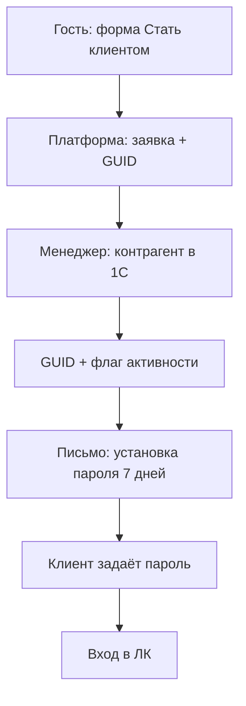
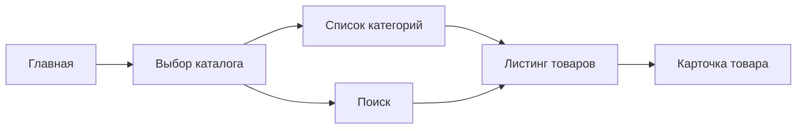
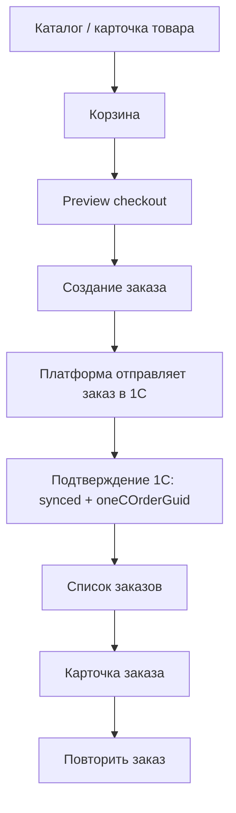

# OpenAPI: индекс и пояснения к спецификациям MVP

_Автособорка для NotebookLM. Правки вносить в исходные файлы репозитория, затем пересобрать bundle._


---

<!-- notebooklm-source: Техническая часть/OpenAPI_индекс.md -->

# OpenAPI Palizh: какие файлы для чего

Контракты **разделены по назначению** (клиент ↔ бэкенд и server-to-server с 1С). Монолитный `openapi_mvp.yaml` **снят**; копия последнего объединённого варианта — в `архив/openapi_mvp_monolith_2026-04-17.yaml`.

## Канон источников (GitLab разработки)

В репозитории **[gitlab.com/nutnet/palizh](https://gitlab.com/nutnet/palizh)** каталог **`docs/`** — первоисточник по соответствующим артефактам.

**Последняя подтяжка в аналитику:** `gitlab/main` **`23cbd8e`** — `public-http-openapi.yaml` (**3330** строк): `GET /products/filters`, `attr` / `attrRange`. **`incoming-hooks.md`** приведён к канону GitLab (**2026-06-02**): имена `event` и полей реализованного обмена — как на стенде (`sync.product-types`, `sync.stocks`, `typeGuid`, `attributes[]` и т.д.). `docs/1c-http-openapi.yaml` — без изменений.

**Предыдущая подтяжка:** `b86d571` — `discountedAmount`, `shop_working_hours`, скидки в `sync.counterparties`. Ранее: `4f17e9b`, корзина/заказы (`f2824d9`).

После `git fetch gitlab` копии в этом репозитории аналитики должны совпадать с:

- `docs/public-http-openapi.yaml` ↔ `Техническая часть/public-http-openapi.yaml`
- `docs/1c-http-openapi.yaml` ↔ `Техническая часть/1c-http-openapi.yaml` и **`входящие/1c-http-openapi.yaml`** (идентичные файлы)
- `docs/incoming-hooks.md` ↔ **`входящие/incoming-hooks.md`**

Правки этих четырёх путей в аналитике выполняются **переносом из GitLab** (или явным решением изменить канон в GitLab и затем синхронизировать сюда).

**Замечание по снимку коду:** описание в `public-http-openapi.yaml` может **опережать** регистрацию маршрутов в `backend/app/Modules/Api/` (там возможна заготовка). Имеет смысл периодически сверять спеку с фактическими `Route::` контроллерами и с фронтом на стенде.

| Файл | Назначение | Кто потребляет |
| ---- | ---------- | -------------- |
| [`openapi_client_mvp.yaml`](openapi_client_mvp.yaml) | **Продуктовый черновик** витрины и ЛК (Bearer/JWT, `/catalogs/{code}/…`). **Для MVP и стенда не канон** — ориентир **`public-http-openapi.yaml`**. Файл сохранён для post-MVP и продуктовых обсуждений; см. § «Расхождение» ниже. | Продукт (целевая модель), **не** текущая разработка фронта |
| [`openapi_1c_inbound_mvp.yaml`](openapi_1c_inbound_mvp.yaml) | Формальное OpenAPI для **`POST /exchange`** (HMAC, `event` + typed `payload` по событиям каталога). Согласовать с GitLab‑модулем `Exchange` и с **`входящие/incoming-hooks.md`**. | Разработка 1С, контрактные тесты inbound |
| [`1c-http-openapi.yaml`](1c-http-openapi.yaml) | **Исходящие вызовы платформа → HTTP-сервисы 1С** (`POST /post_orders`, `GET /get_documents` и т.д.). **Basic** и сеть — на стороне заказчика; дубликат для удобства — см. также [`входящие/1c-http-openapi.yaml`](../входящие/1c-http-openapi.yaml). **Канон текста файла:** `gitlab/.../docs/1c-http-openapi.yaml`. | Бэкенд платформы, разработка 1С (публикации) |
| [`public-http-openapi.yaml`](public-http-openapi.yaml) | **Контракт публичного HTTP API** для стенда/реализации (часто SPA + Laravel Sanctum: cookie, CSRF, см. описание операций и `servers.url`). **Канон текста файла:** `gitlab/.../docs/public-http-openapi.yaml`. | Фронт, контрактные тесты стенда, сверка с продуктовым [`openapi_client_mvp.yaml`](openapi_client_mvp.yaml) |
| [`openapi_mvp_merged.yaml`](openapi_mvp_merged.yaml) | **Объединение** клиент + 1С inbound (генерация скриптом). Для Redoc/Swagger UI, линтеров, которым удобен **один** YAML. **Не править вручную.** | Демо, CI, просмотр «всё в одном» |
| [`openapi_mvp_post_mvp.yaml`](openapi_mvp_post_mvp.yaml) | Post-MVP расширения (претензии, админка, обучение и т.д.). | Планирование |

**События `POST /exchange` (расшифровка payload):** [`входящие/incoming-hooks.md`](../входящие/incoming-hooks.md) — **канон текста:** `gitlab/.../docs/incoming-hooks.md`. **Модель каталога (канон GitLab / стенд, 2026-06-02):** [`Модель_данных_каталог_1С_обмен.md`](Модель_данных_каталог_1С_обмен.md) — `sync.product-attributes`, `sync.product-types`, `sync.product-type-characteristics`, `sync.products`, `sync.stocks`, `sync.prices`, `sync.categories`, `sync.counterparties`. Формальное OpenAPI — [`openapi_1c_inbound_mvp.yaml`](openapi_1c_inbound_mvp.yaml) (**v0.4.0**): typed-схемы `payload` по событиям каталога (discriminator `event`); заказы/документы — по мере готовности 1С (#18).

**Скрипты** (каталог `Техническая часть/tools/`):

- `merge_openapi_mvp.rb` — пересобирает `openapi_mvp_merged.yaml` из `openapi_client_mvp.yaml` + `openapi_1c_inbound_mvp.yaml` (запускать после правок двух исходников).
- `split_openapi_client_and_1c.rb` — одноразовая нарезка; источник по умолчанию — архивный монолит, если снова понадобится регенерировать куски из старой одной спеки.

Скрипт **не** включает `public-http-openapi.yaml` и `1c-http-openapi.yaml` — они синхронизируются **только с GitLab `docs/`**.

### Расхождение `openapi_client_mvp.yaml` ↔ `public-http-openapi.yaml` (сверка 2026-06-26)

**Решение (2026-06-26):** для MVP **канон только `public-http-openapi.yaml`**. `openapi_client_mvp.yaml` — **устаревший для стенда** продуктовый черновик; не править под каждую подтяжку GitLab без отдельного решения.

Маршруты ниже есть в каноне стенда **`public-http-openapi.yaml`** (GitLab `docs/`), в **`openapi_client_mvp.yaml`** **не описаны** или **другая модель**:

| Метод и путь | В `public-http-openapi.yaml` | В `openapi_client_mvp.yaml` |
|--------------|------------------------------|----------------------------|
| `GET /banners` | да | нет |
| `GET /promotions` | да | нет |
| `GET /promotions/{slug}` | да | нет |
| `PATCH /me` | да | нет |
| `POST /me/change-password` | да | нет |
| `GET /cart`, `DELETE /cart`, `PUT /cart/items` | да (2026-06-11) | нет |
| `GET /products/filters`, query `attr` / `attrRange` на `GET /products` | да (GitLab `23cbd8e`) | нет |
| `GET /search/products` | да (**2026-06-02**, аналитика) | да (черновик; синхронизировать) |
| `GET /claim`, `POST /claim` | да (канон стенда) | нет (`/claims` только в post-MVP yaml) |
| `GET /orders`, `GET /orders/{id}`, `POST /orders/{id}/repeat` | да (2026-06-11) | нет |
| `CartItem`: `packagingMode`, `fullBoxesCount`, `remainderQuantity`, … | да (**2026-06-02**) | да (`CartItem` в client) |
| Схемы `ProductAttributes`, `unitsPerBox` в карточке/листинге | да (2026-06-11) | нет / частично |

**Канон изменений:**

- текст **`public-http-openapi.yaml`**, **`1c-http-openapi.yaml`**, **`incoming-hooks.md`** → вносить в **GitLab `docs/`**, затем обновить копии в аналитике;
- **`openapi_client_mvp.yaml`** и **`openapi_1c_inbound_mvp.yaml`** — по договорённости продукта/архитектуры здесь или в коде тестов; затем при необходимости `ruby tools/merge_openapi_mvp.rb`.


---

<!-- notebooklm-source: Техническая часть/openapi_mvp_auth_onboarding.md -->

# OpenAPI MVP: Auth And Onboarding

Рабочий артефакт для фиксации `MVP`-контракта по онбордингу, приглашению в ЛК и базовой авторизации.

Этот документ является человекочитаемым пояснением к `OpenAPI`-файлу `openapi_client_mvp.yaml` (витрина/ЛК, не 1С inbound) и ограничен только блоками:

- заявка `Стать клиентом`;
- приглашение и первичная установка пароля;
- авторизация по `JWT`;
- восстановление пароля;
- базовый профиль текущего пользователя;
- получение краткого профиля компании.

---

## 1. Базовые решения

- В продуктовом описании авторизация чаще формулируется как **`JWT Bearer`** (через заголовок `Authorization`) — так отражено в этом документе и в `openapi_client_mvp.yaml`.
- **Реализация по коду на GitLab (MVP):** публичный API и связка со SPA идут через **Laravel Sanctum**: cookie-сессия + **CSRF** для первопартийного браузера, при необходимости персональные **API-токены** с префиксом в **`Bearer`** (формат может не совпадать с классическим JWT). Подробности и актуальный HTTP-контракт стенда — [`public-http-openapi.yaml`](public-http-openapi.yaml) (`docs/` репозитория разработки), разъяснение — [`Backend_архитектура.md`](Backend_архитектура.md) §1.1.
- Публичная самозаявка клиента доступна без авторизации.
- При отправке заявки платформа генерирует `GUID` заявки.
- На `MVP` платформа не создаёт контрагента в `1С` автоматически.
- Менеджер вручную заводит / привязывает контрагента в `1С`, записывает `GUID заявки` в карточку контрагента и включает признак активности.
- После активации в `1С` платформа создаёт учётную запись и отправляет письмо-приглашение на email из заявки (**установка пароля**, ссылка **7 дней**).
- Вход в ЛК доступен по `email + password` после установки пароля по ссылке.

---

## 2. Scope MVP

### 2.1 Входит в текущий контракт

- `POST /public/client-applications` (или `POST /auth/register` на стенде)
- `POST /auth/invitations/accept`
- `POST /auth/login`
- `POST /auth/refresh`
- `POST /auth/logout`
- `POST /auth/password/forgot`
- `POST /auth/password/reset`
- `GET /me`
- `PATCH /me`
- `PATCH /me/password`
- `GET /me/company`

### 2.2 Пока не включено в базовый MVP

- публичный просмотр статуса заявки `Стать клиентом` по `GUID`;
- самообслуживание по повторной отправке приглашения;
- автоодобрение клиента без менеджера;
- административное изменение договора / соглашения / условий оплаты через платформу;
- полноценное управление пользователями компании внутри этого контракта.

---

## 3. Канонический пользовательский поток



---

## 4. Контракт по состояниям

### 4.1 Заявка `Стать клиентом`

| Поле / сущность | Решение MVP |
| --------------- | ----------- |
| Тип заявки | Только `B2B` / юрлицо |
| Обязательные поля | `companyName`, `inn`, `kpp`, `contactName`, `email`, `phone` |
| Внешний ID | `applicationGuid` |
| Клиентский ответ после подачи | `submitted` |
| Источник одобрения | `1С` через связку `applicationGuid + isActiveForPlatform` |

### 4.2 Учётная запись

| Поле / сущность | Решение MVP |
| --------------- | ----------- |
| Логин | `email` из заявки |
| Тип авторизации | `JWT Bearer` |
| Создание учётной записи | После подтверждённой активации в `1С` |
| Первичная установка пароля | По токену приглашения (`EMAIL_ACCESS_GRANTED`), TTL **7 дней** |
| Инвайт под-пользователя | По токену приглашения, TTL **7 дней** (ЧТЗ 07) |
| Сброс пароля | По email |

---

## 5. Endpoint matrix

| Метод и path | Назначение | Auth | Комментарий |
| ------------ | ---------- | ---- | ----------- |
| `POST /public/client-applications` | Подать заявку `Стать клиентом` | Нет | Публичный endpoint |
| `POST /auth/invitations/accept` | Установить пароль по приглашению и сразу войти | Нет | Используется после активации заявки |
| `POST /auth/login` | Вход по email и паролю | Нет | Возвращает `accessToken` и `refreshToken` |
| `POST /auth/refresh` | Обновить access token | Нет | Работает по refresh token |
| `POST /auth/logout` | Завершить текущую сессию | Да | Инвалидирует refresh token / сессию |
| `POST /auth/password/forgot` | Запросить восстановление пароля | Нет | Отправляет письмо |
| `POST /auth/password/reset` | Сбросить пароль по reset token | Нет | Новый пароль |
| `GET /me` | Получить профиль текущего пользователя | Да | Базовый профиль |
| `PATCH /me` | Обновить профиль текущего пользователя | Да | `fullName`, `phone`, `email` |
| `PATCH /me/password` | Сменить пароль из ЛК | Да | По старому паролю |
| `GET /me/company` | Получить профиль компании текущего пользователя | Да | Только чтение, данные из `1С` |

---

## 6. Базовые схемы данных

### 6.1 ClientApplicationCreateRequest

| Поле | Тип | Обязательно | Комментарий |
| ---- | --- | ----------- | ----------- |
| `companyName` | `string` | Да | Наименование юрлица / ИП |
| `inn` | `string` | Да | ИНН |
| `kpp` | `string` | Да | КПП |
| `contactName` | `string` | Да | Контактное лицо |
| `email` | `string(email)` | Да | Будущий login |
| `phone` | `string` | Да | Контактный телефон |
| `comment` | `string` | Нет | Комментарий к заявке |

### 6.2 ClientApplicationCreateResponse

| Поле | Тип | Комментарий |
| ---- | --- | ----------- |
| `applicationGuid` | `string(uuid)` | ID заявки |
| `status` | `string` | Для `MVP`: `submitted` |
| `message` | `string` | Человекочитаемое подтверждение |

### 6.3 AuthTokenPair

| Поле | Тип | Комментарий |
| ---- | --- | ----------- |
| `tokenType` | `string` | Для `MVP`: `Bearer` |
| `accessToken` | `string` | JWT access token |
| `refreshToken` | `string` | Refresh token |
| `expiresIn` | `integer` | TTL access token в секундах |

### 6.4 MeResponse

| Поле | Тип | Комментарий |
| ---- | --- | ----------- |
| `id` | `string(uuid)` | ID пользователя платформы |
| `email` | `string(email)` | Login пользователя |
| `fullName` | `string` | ФИО |
| `phone` | `string` | Телефон |
| `role` | `string` | Роль внутри ЛК компании |
| `companyId` | `string(uuid)` | ID компании на платформе |
| `companyName` | `string` | Наименование компании |

### 6.5 CompanySummaryResponse

| Поле | Тип | Комментарий |
| ---- | --- | ----------- |
| `id` | `string(uuid)` | ID компании на платформе |
| `counterpartyGuid` | `string` | ID контрагента в `1С` |
| `name` | `string` | Наименование |
| `inn` | `string` | ИНН |
| `kpp` | `string` | КПП |
| `legalAddress` | `string` | Юр. адрес |
| `paymentTerms` | `object` | Отображаемые условия из `1С` |
| `isActiveForPlatform` | `boolean` | Признак активности |

---

## 7. Security model

### 7.1 JWT

- Все приватные endpoint'ы используют `Authorization: Bearer <token>`.
- `accessToken` короткоживущий.
- `refreshToken` используется для перевыпуска токена.
- Конкретные TTL и стратегия ротации ещё должны быть подтверждены с backend-командой.

### 7.2 Password flows

- Первичная установка пароля: токен приглашения после активации в 1С (**7 дней**).
- Инвайт под-пользователя: токен приглашения (**7 дней**).
- Восстановление пароля: токен сброса (**24 ч**).
- Смена пароля из ЛК: `oldPassword + newPassword`.

---

## 8. Ошибки и коды ответов

| Код | Когда используется |
| --- | ------------------ |
| `200` | Успешное чтение / успешная операция без создания |
| `201` | Успешное создание заявки |
| `204` | Успешный logout без тела |
| `400` | Некорректный payload / токен невалиден |
| `401` | Ошибка авторизации |
| `403` | Доступ запрещён / пользователь неактивен |
| `404` | Объект не найден |
| `409` | Конфликт, например дубль активной заявки / email |
| `422` | Ошибка валидации полей |

---

## 9. Вопросы, которые остаются открытыми

| Вопрос | Влияние на API |
| ------ | -------------- |
| Нужен ли публичный endpoint проверки статуса заявки | Может добавить `GET /public/client-applications/{applicationGuid}` |
| Как обрабатывать повторную заявку с тем же `ИНН/КПП` или `email` | Влияет на `409` / правила дедупликации |
| Разрешено ли менять `email` из профиля без отдельного подтверждения | Влияет на `PATCH /me` |
| Какой точный набор ролей пользователя компании будет отдаваться в `auth/me` | Влияет на enum `role` |
| Нужна ли отдельная endpoint-проверка валидности invitation token | Может добавить `GET /auth/invitations/{token}` |

---

## 10. Связанные документы

- `ЧТЗ/05_регистрация_онбординг.md`
- `ЧТЗ/07_ЛК_профиль_компания.md`
- `ЧТЗ/09_интеграция_1С.md`
- `Техническая часть/Архитектура_платформы.md`
- `Техническая часть/1С_contract_matrix.md`
- `Техническая часть/openapi_client_mvp.yaml`


---

<!-- notebooklm-source: Техническая часть/openapi_mvp_catalog_product.md -->

# OpenAPI MVP: Catalog And Product

> **MVP / стенд (2026-06-26):** канон каталога и фильтров — **`public-http-openapi.yaml`** (`GET /products`, `GET /products/filters`, `attr`/`attrRange`). Этот документ описывает **устаревшую для стенда** модель `/catalogs/{catalogCode}/…`; сохранён до post-MVP выравнивания. См. [`OpenAPI_индекс.md`](OpenAPI_индекс.md).

Рабочий артефакт для фиксации `MVP`-контракта по публичному каталогу, карточке товара и базовому поиску по каталогу.

Этот документ описывает пользовательский и API-слой для:

- списка каталогов;
- дерева категорий;
- списка товаров;
- карточки товара;
- поисковой выдачи в каталоге.

**Импорт каталога из 1С на платформу** (full/delta, server-to-server) — в [`openapi_mvp_integration_1c.md`](openapi_mvp_integration_1c.md) и **`POST /exchange`** в [`openapi_1c_inbound_mvp.yaml`](openapi_1c_inbound_mvp.yaml) (`event`: `sync.products`, `sync.categories`, `sync.counterparties`). Расширенные post-MVP сценарии по витрине/каталогу — в [`openapi_mvp_post_mvp.yaml`](openapi_mvp_post_mvp.yaml), если понадобятся отдельно от MVP. Публичные `GET` каталога — [`openapi_client_mvp.yaml`](openapi_client_mvp.yaml); см. [`OpenAPI_индекс.md`](OpenAPI_индекс.md).

---

## 1. Базовые решения

- **Интеграция 1С ↔ платформа (2026-04-21, уточнение с заказчиком):** **отдельная реализация «полной выгрузки» не планируется** — тот же **инкрементальный** обмен; при **первичном наполнении** 1С **последовательно** отдаёт пакеты **по команде**; в работе — **дельты**, которые **1С сама отправляет** **при изменениях** в 1С (**не** регламентное «расписание» импорта каталога со стороны платформы). Приём — **`POST /exchange`** (`sync.*`) в OpenAPI. Публичные `GET` ниже — для витрины и ЛК; **не** дублируют протокол импорта из 1С.
- **Атрибуты товаров:** в ответе по товару передаются **идентификаторы атрибутов и значения**; отдельный endpoint **«справочник атрибутов»** (`ProductAttributes` и т.п.) **не обязателен**, если метаданные атрибутов (название, тип) включены в ответ **`GET /products/{id}`** / листинга — так проще для контракта с 1С; иначе можно оставить отдельный метод для кэша метаданных на платформе.
- Каталог и карточка товара доступны гостю и авторизованному пользователю.
- Для гостя цены **не отображаются**.
- Для авторизованного клиента в ответах могут приходить ценовые данные по его соглашению.
- Из `1С` на платформу приходят:
  - товары;
  - категории;
  - свойства;
  - остатки;
  - сроки производства / поступления;
  - состояние номенклатуры;
  - при наличии ссылка на маркетплейс.
- Платформа не является источником истины по ассортименту и ценам.
- **Персональная номенклатура (заказчик 2026-04):** в данных из 1С может быть `exclusiveCounterpartyGuid` — `GUID` **единственного** контрагента; листинг, поиск и `GET /products/{id}` **фильтруют** ответы по текущему зрителю; корзина — см. `PUT /cart/items/{productId}` в `openapi_client_mvp.yaml`.

---

## 2. Scope MVP

### 2.1 Входит в контракт

- `GET /catalogs`
- `GET /catalogs/{catalogCode}/categories`
- `GET /catalogs/{catalogCode}/products`
- `GET /products/{productId}`
- `GET /search/products`

### 2.2 Не входит в этот слой

- корзина и `add to cart`;
- избранное;
- подбор аналогов;
- сложные рекомендации;
- редактирование контента каталога из API админки.

---

## 3. Канонический пользовательский поток



---

## 4. Endpoint matrix

| Метод и path | Назначение | Auth | Комментарий |
| ------------ | ---------- | ---- | ----------- |
| `GET /catalogs` | Получить список доступных каталогов | Нет / опционально | Публично доступны каталоги витрины |
| `GET /catalogs/{catalogCode}/categories` | Получить дерево категорий каталога | Нет / опционально | Для навигации и фильтров |
| `GET /catalogs/{catalogCode}/products` | Получить листинг товаров | Нет / опционально | С фильтрами, сортировкой, пагинацией |
| `GET /products/{productId}` | Получить карточку товара | Нет / опционально | Ценовой блок зависит от auth |
| `GET /search/products` | Поиск товаров по каталогу | Нет / опционально | По наименованию, артикулу, свойствам |

---

## 5. Контракт по видимости данных

### 5.1 Для гостя

| Блок | Поведение |
| ---- | --------- |
| Каталоги | Видны |
| Категории | Видны |
| Товары | Видны, **кроме** персональной номенклатуры с `exclusiveCounterpartyGuid` (такие позиции гостю **не** отдаются) |
| Фото / описание / свойства | Видны (для видимых позиций) |
| Остатки / сроки | Допустимы, если это разрешено бизнес-правилами |
| Цены | Не показываются |
| Marketplace link | Может показываться, если пришёл из `1С` |

### 5.2 Для авторизованного B2B-клиента

| Блок | Поведение |
| ---- | --------- |
| Каталоги | Видны |
| Категории | Видны |
| Товары | Видны только строки **без** `exclusiveCounterpartyGuid` **или** с `exclusiveCounterpartyGuid`, совпадающим с контрагентом сессии |
| Фото / описание / свойства | Видны (для видимых позиций) |
| Остатки / сроки | Видны (для видимых позиций) |
| Цены | Приходят по соглашению / виду цены (для видимых позиций) |
| Marketplace link | Может приходить, но основной сценарий для B2B — работа с карточкой товара |

---

## 6. Базовые схемы данных

### 6.1 CatalogSummary

| Поле | Тип | Комментарий |
| ---- | --- | ----------- |
| `code` | `string` | Уникальный код каталога |
| `name` | `string` | Название каталога |
| `isPublic` | `boolean` | Доступен ли гостю |
| `sortOrder` | `integer` | Порядок отображения |

### 6.2 CategoryNode

| Поле | Тип | Комментарий |
| ---- | --- | ----------- |
| `id` | `string` | ID категории |
| `parentId` | `string or null` | Родитель |
| `name` | `string` | Название |
| `slug` | `string` | URL slug |
| `children` | `array` | Дочерние категории |

### 6.3 ProductCardSummary

| Поле | Тип | Комментарий |
| ---- | --- | ----------- |
| `id` | `string` | ID товара платформы |
| `nomenclatureGuid` | `string` | ID товара в `1С` |
| `sku` | `string` | Артикул / код поиска |
| `name` | `string` | Наименование |
| `slug` | `string` | URL slug |
| `brand` | `string or null` | Бренд |
| `imageUrl` | `string or null` | Основное изображение |
| `isArchived` | `boolean` | Архивность / снятие с производства |
| `isAvailableForOrder` | `boolean` | Доступность к заказу |
| `stockQty` | `number or null` | Остаток |
| `productionLeadTime` | `string or null` | Срок производства / поступления |
| `marketplaceUrl` | `string or null` | Ссылка на маркетплейс |
| `price` | `object or null` | Только для авторизованного клиента |
| `exclusiveCounterpartyGuid` | `string (uuid) or null` | `null` — общий ассортимент; иначе только для указанного контрагента 1С |

### 6.4 ProductDetailResponse

| Поле | Тип | Комментарий |
| ---- | --- | ----------- |
| `id` | `string` | ID товара |
| `catalogs` | `array` | В каких каталогах участвует |
| `categories` | `array` | Категории товара |
| `name` | `string` | Наименование |
| `description` | `string or null` | Описание |
| `attributes` | `array` | Атрибуты товара |
| `images` | `array` | Галерея |
| `availability` | `object` | Остатки / сроки / доступность |
| `price` | `object or null` | Ценовой блок только для авторизованного |
| `marketplaceUrl` | `string or null` | Внешняя ссылка |
| `exclusiveCounterpartyGuid` | `string (uuid) or null` | Как в §6.3 |

---

## 7. Query parameters

### 7.1 Для `GET /catalogs/{catalogCode}/products`

| Параметр | Тип | Назначение |
| -------- | --- | ---------- |
| `categoryId` | `string` | Фильтр по категории |
| `q` | `string` | Поиск по каталогу |
| `page` | `integer` | Страница |
| `perPage` | `integer` | Размер страницы |
| `sort` | `string` | Сортировка |
| `filters[...]` | `string/array` | Атрибутные фильтры |
| `includeArchived` | `boolean` | Для внутренних / специальных сценариев; по умолчанию `false` |

### 7.2 Для `GET /search/products`

| Параметр | Тип | Назначение |
| -------- | --- | ---------- |
| `q` | `string` | Поисковый запрос |
| `catalogCode` | `string` | Ограничение конкретным каталогом |
| `page` | `integer` | Страница |
| `perPage` | `integer` | Размер страницы |

---

## 8. Особые правила API

### 8.1 Архивная номенклатура

- Товар с архивным статусом и остатком `0` не должен попадать в обычную активную витрину.
- При этом связь с товаром не должна теряться на уровне ID и истории заказов.
- Для API полезно иметь два отдельных поля:
  - `isArchived`;
  - `isAvailableForOrder`.

### 8.2 Цены

- Канон для стенда и каталога: **`public-http-openapi.yaml`** (`ProductPrice`: `amount`, `amountPerBox`, `discountedAmount*`).
- Корзинный пересчёт (смешанная кратность) — **`CartItem`**, **ЧТЗ 01 §4.2.4**; см. [`openapi_mvp_cart_checkout_orders.md`](openapi_mvp_cart_checkout_orders.md) §5.3.
- Устаревшая модель `/catalogs/{catalogCode}/…` в этом файле **не** описывает корзину.

### 8.3 Marketplace link

- Поле `marketplaceUrl` опционально.
- Для гостя оно может быть основным CTA вместо покупки.
- Для авторизованного B2B-клиента это поле остаётся вспомогательным.

### 8.4 Персональная номенклатура (один контрагент)

- **Имя поля (канон):** `exclusiveCounterpartyGuid` — как в `1c-http-openapi.yaml` / `Product` и в этом документе; **ровно один** `GUID` или `null` (решению заказчика зафиксировано).
- Ограничение задаётся на **базовой** номенклатуре (`Product` в 1С HTTP), **не** на варианте.
- Семантика согласована с импортом **`POST /exchange`** (`sync.products` / `sync.categories`).
- Прямой запрос `GET /products/{productId}` на «чужую» персональную позицию: **404** (как у несуществующей), без раскрытия факта существования другому контрагенту.
- **Поиск и листинг:** недоступные зрителю позиции **не** попадают в выдачу (каталог и `GET /search/products`; правила — ЧТЗ 11 §5.7).

---

## 9. Открытые вопросы

| Вопрос | Влияние на API |
| ------ | -------------- |
| Какой точный состав атрибутов нужно возвращать в фильтры и карточку товара | Влияет на `attributes` и filter schema |
| Какой enum сортировок нужен в `MVP` | Влияет на `sort` |
| Нужно ли выделять отдельную endpoint для filter facets | Может добавить `GET /catalogs/{catalogCode}/filters` |
| Нужно ли возвращать гостю остатки и сроки во всех сценариях | Влияет на `availability` |
| Какой точный контракт для поля marketplace link приходит из `1С` | Влияет на `marketplaceUrl` |

---

## 10. Связанные документы

- `ЧТЗ/06_витрина_каталог.md`
- `ЧТЗ/11_поиск.md`
- `Инфарх/состав-и-задачи-страниц.md`
- `Техническая часть/1С_contract_matrix.md`
- `Техническая часть/openapi_client_mvp.yaml`


---

<!-- notebooklm-source: Техническая часть/openapi_mvp_cart_checkout_orders.md -->

# OpenAPI MVP: Cart Checkout Orders

Рабочий артефакт для фиксации `MVP`-контракта по корзине, оформлению заказа и разделу `Заказы` в ЛК.

Этот документ описывает API-слой для:

- текущей корзины пользователя;
- изменения состава корзины;
- preview перед оформлением;
- создания заказа;
- списка заказов;
- карточки заказа;
- сценария `Повторить заказ`.

---

## 1. Базовые решения

- Все endpoint'ы этого слоя доступны только авторизованному `B2B`-клиенту.
- Корзина хранится на платформе, но расчёт и значимые данные для заказа завязаны на данные из `1С`.
- Порог бесплатной доставки для `MVP` хранится как настройка платформы.
- При checkout платформа отправляет заказ в `1С` и хранит связь `platformOrderId <-> oneCOrderGuid` после успешной синхронизации; до этого `oneCOrderGuid` может быть `null`, а состояние обмена — в поле `integrationSyncState` (см. `order_lifecycle_contract.md` §5.2).
- В ЛК используется одна верхнеуровневая цепочка из `6` статусов заказа (маппинг из `1С`) **плюс** отдельное поле синхронизации с `1С`, без седьмого статуса в enum.
- Delivery-детали не создают отдельную шкалу статусов.
- `Repeat order` не копирует прошлый заказ слепо, а пытается добавить в корзину актуальные доступные позиции.

---

## 2. Scope MVP

### 2.1 Входит в контракт

- `GET /cart`
- `PUT /cart/items/{productId}`
- `DELETE /cart/items/{productId}`
- `POST /cart/clear`
- `POST /checkout/preview`
- `POST /orders`
- `GET /orders`
- `GET /orders/{orderId}`
- `POST /orders/{orderId}/repeat`

### 2.2 Пока не входит

- сохранённые корзины;
- промокоды;
- онлайн-оплата;
- редактирование уже созданного заказа;
- **отмена заказа клиентом через API / ЛК в MVP** — не входит; отмена или изменение заказа после оформления — **вне платформы** (менеджер, 1С) до отдельного решения post-MVP;
- **заказ через файл (Excel / прайс)** — относится к отдельному сценарию и не входит в MVP-контракт этого API-слоя; планируется как post-MVP;
- отдельные API для нестандартных заявок в этом слое.

---

## 3. Канонический пользовательский поток



---

## 4. Endpoint matrix

| Метод и path | Назначение | Auth | Комментарий |
| ------------ | ---------- | ---- | ----------- |
| `GET /cart` | Получить текущую корзину | Да | Возвращает позиции, суммы, предупреждения, delivery hint |
| `PUT /cart/items/{productId}` | Добавить / изменить количество позиции | Да | Upsert-сценарий |
| `DELETE /cart/items/{productId}` | Удалить позицию из корзины | Да | Полное удаление |
| `POST /cart/clear` | Очистить корзину | Да | Очистка всех позиций |
| `POST /checkout/preview` | Получить итоговый preview перед оформлением | Да | Проверка состава, условий, предупреждений |
| `POST /orders` | Создать заказ | Да | Создание заказа на платформе и отправка в `1С` |
| `GET /orders` | Получить историю заказов | Да | Список с фильтрами и пагинацией |
| `GET /orders/{orderId}` | Получить карточку заказа | Да | Статус, оплата, delivery-детали, документы |
| `POST /orders/{orderId}/repeat` | Повторить заказ | Да | Возвращает результат добавления в корзину |

---

## 5. Контракт по корзине

### 5.1 Что должно приходить в `GET /cart`

| Блок | Что возвращаем |
| ---- | -------------- |
| Позиции | товар, количество, единица, цена, сумма строки |
| Availability | остаток, срок производства / поступления, доступность к заказу |
| Totals | subtotal, итоговая сумма |
| Delivery hint | порог бесплатной доставки, сколько осталось добрать |
| Warnings | предупреждения по архивным / недоступным позициям, срокам, кратности |

### 5.2 Правила корзины

- Количество должно быть положительным числом.
- Если товар недоступен к заказу, API должно возвращать ошибку или предупреждение.
- Для авторизованного пользователя ценовой блок уже учитывает его контекст соглашения.
- Корзина является рабочим объектом платформы, но использует мастер-данные и availability из `1С`.

### 5.3 Расчёт цены строки и итога (ЧТЗ 01 §4.2.4)

**Семантика 1С:** `amount` — за **штуку**, `amountPerBox` — за **коробку**.

**Формула:**

```
boxPart   = round(fullBoxesCount × pricePerBox, 2)
piecePart = round(remainderQuantity × pricePerPiece, 2)
lineTotal = round(boxPart + piecePart, 2)
unitPrice = round(lineTotal / quantity, 2)   // средняя; авторитет — lineTotal
```

`pricePerBox` = `discountedAmountPerBox` ?? `amountPerBox`; `pricePerPiece` = `discountedAmount` ?? `amount`.  
Персональный % → на оба поля розницы; не на опт и не на вид `BOX` в `sync.prices`.  
Округление: **RUB, 2 знака, round half up**.

| Поле `CartItem` | Смысл |
| --------------- | ----- |
| `unitPrice` | Средняя цена за `unit` для текущего `quantity` |
| `lineTotal` | По формуле выше |
| `packagingMode` | `multiple` / `mixed` / `non_multiple` / `not_applicable` |
| `unitsPerBox` | Из товара 1С |
| `fullBoxesCount` | Целые упаковки в строке |
| `remainderQuantity` | Штуки вне полных упаковок |
| `referenceUnitPricePerBox` | Цена за коробку (справочно) |
| `referenceUnitPricePerPiece` | Цена за штуку (справочно) |

| Поле `CartTotals` | Смысл |
| ----------------- | ----- |
| `subtotal` | Σ `lineTotal` |
| `discountTotal` | Агрегированная скидка (если выделяется) |
| `vatAmount` | НДС в итоге |
| `total` | Итог к оплате (без доставки на MVP) |

**Пример:** `unitsPerBox = 15`, `quantity = 20` → 1×`pricePerBox` + 5×`pricePerPiece`, `packagingMode = mixed`.

**Warning `packaging_partial_boxes`:** при `mixed` или `non_multiple` — неблокирующее пояснение о цене за штуку на остаток.

**Модель:** вариант **A** (backend). Округление и скидка — **ЧТЗ 01 §4.2.4** (реестр **№57 закрыт**).

---

## 6. Контракт по checkout

### 6.1 Preview checkout

Preview нужен, чтобы до создания заказа вернуть:

- подтверждённый состав заказа;
- адрес / контакт доставки;
- условия оплаты;
- предупреждение по порогу доставки;
- сроки производства / доступности;
- итоговую сумму;
- набор blocking / non-blocking предупреждений.

### 6.2 Создание заказа

`POST /orders` должен:

- принять финальный payload заказа;
- создать объект заказа на платформе;
- инициировать доставку заказа в `1С` (синхронно или через очередь — по реализации);
- сохранить `requestId` / `platformOrderId`;
- выставить `integrationSyncState`: как минимум `pending` сразу после создания; после подтверждения из `1С` — `synced` и `oneCOrderGuid`; при ошибках — `failed` / `manual_review_required` по политике ЧТЗ 09;
- вернуть клиенту `201` с `OrderDetailResponse`, где шапка заказа отражает актуальные `status` и `integrationSyncState` (ответ **не** означает автоматически «уже в 1С», если `integrationSyncState` ещё `pending`).

---

## 7. Контракт по заказам

### 7.1 Список заказов

| Поле | Комментарий |
| ---- | ----------- |
| `id` | ID заказа платформы |
| `oneCOrderGuid` | ID заказа в `1С`, если уже известен |
| `integrationSyncState` | `pending` / `synced` / `failed` / `manual_review_required` |
| `lastSyncErrorCode`, `lastSyncErrorMessage`, `retryable` | Опционально, для UX и поддержки |
| `number` | Номер заказа |
| `createdAt` | Дата создания |
| `totalAmount` | Итоговая сумма |
| `paymentStatus` | `unpaid`, `partially_paid`, `paid` |
| `status` | Один из 6 статусов ЛК (смысл из `1С` при `integrationSyncState` = `synced`) |
| `deliverySummary` | Краткая информация по доставке |

### 7.2 Карточка заказа

| Блок | Что должно быть в ответе |
| ---- | ------------------------ |
| Header | ID, номер, дата, статус |
| Positions | список товаров, количество, цена |
| Totals | суммы заказа |
| Payment | режим оплаты, срок оплаты, статус оплаты |
| Delivery | способ доставки, дата / слот, трек, водитель, delivery-детали |
| Documents | ссылки / метаданные документов |
| Repeat availability | можно ли повторить заказ |

---

## 8. Каноническая модель статусов в API

| Статус API | Смысл |
| ---------- | ----- |
| `processing` | `Обрабатывается` |
| `in_production` | `В производство / производится` |
| `ready_for_picking` | `Готов к сборке` |
| `ready_to_ship` | `Готов к отгрузке` |
| `shipped` | `Отправлен` |
| `completed` | `Завершён` |

### 8.1 Принципы статусов

- Эти статусы приходят из согласованного маппинга событий `1С` и осмыслены при `integrationSyncState` = `synced`.
- Платформа не должна придумывать вторую клиентскую шкалу из шести фаз; состояние обмена с `1С` — отдельное поле (`integrationSyncState`).
- Delivery-детали возвращаются отдельным объектом внутри заказа.

---

## 9. Repeat order contract

### 9.1 Поведение `POST /orders/{orderId}/repeat`

Endpoint должен:

- загрузить позиции исторического заказа;
- сверить их с актуальной номенклатурой и availability;
- положить доступные позиции в текущую корзину;
- вернуть список:
  - добавленных позиций;
  - исключённых позиций;
  - причин исключения.

### 9.2 Причины исключения позиции

| Код | Смысл |
| --- | ----- |
| `archived_no_stock` | Архивная / снятая с производства позиция без остатка |
| `not_found` | Позиция больше не найдена в актуальном каталоге |
| `not_available_for_order` | Позиция есть, но сейчас недоступна к заказу |

---

## 10. Базовые схемы данных

### 10.1 CartResponse

| Поле | Тип | Комментарий |
| ---- | --- | ----------- |
| `items` | `array` | Позиции корзины |
| `totals` | `object` | Итоговые суммы |
| `deliveryHint` | `object` | Порог и предупреждение по доставке |
| `warnings` | `array` | Неблокирующие предупреждения |

### 10.2 CheckoutPreviewRequest

| Поле | Тип | Комментарий |
| ---- | --- | ----------- |
| `deliveryAddress` | `string` | Адрес доставки; канон — `unrestricted_value` DaData (ЧТЗ 01 §4.1.2) |
| `deliveryAddressFiasId` | `string` (uuid), опц. | `data.fias_id` выбранной подсказки DaData |
| `contactName` | `string` | Контактное лицо |
| `contactPhone` | `string` | Телефон |
| `comment` | `string` | Комментарий к заказу |

### 10.3 OrderCreateRequest

| Поле | Тип | Комментарий |
| ---- | --- | ----------- |
| `deliveryAddress` | `string` | Адрес доставки; канон — `unrestricted_value` DaData |
| `deliveryAddressFiasId` | `string` (uuid), опц. | FIAS ID для проверки / дедупликации |
| `contactName` | `string` | Контакт |
| `contactPhone` | `string` | Телефон |
| `comment` | `string` | Комментарий |

### 10.4 OrderSummary

| Поле | Тип | Комментарий |
| ---- | --- | ----------- |
| `id` | `string` | ID заказа платформы |
| `oneCOrderGuid` | `string or null` | ID заказа в `1С` |
| `integrationSyncState` | `string` | См. `OrderIntegrationSyncState` в OpenAPI |
| `lastSyncErrorCode` | `string or null` | Код ошибки синхронизации |
| `lastSyncErrorMessage` | `string or null` | Безопасное сообщение |
| `retryable` | `boolean or null` | Будет ли автоповтор |
| `number` | `string` | Номер заказа |
| `status` | `string` | Один из 6 статусов |
| `paymentStatus` | `string` | Статус оплаты |
| `totalAmount` | `number` | Сумма заказа |
| `createdAt` | `string(date-time)` | Дата создания |

### 10.5 OrderDetailResponse

| Поле | Тип | Комментарий |
| ---- | --- | ----------- |
| `order` | `object` | Шапка заказа |
| `items` | `array` | Позиции |
| `totals` | `object` | Суммы |
| `payment` | `object` | Оплата |
| `delivery` | `object` | Delivery-детали |
| `documents` | `array` | Документы |
| `canRepeat` | `boolean` | Доступность repeat |

---

## 11. Открытые вопросы

| Вопрос | Влияние на API |
| ------ | -------------- |
| Нужен ли отдельный endpoint для удаления всех недоступных позиций из корзины | Может добавить отдельную cart action |
| Какой точный набор полей по delivery-деталям отдаётся уже в `MVP` | Влияет на `delivery` schema |
| Нужен ли отдельный endpoint для availability по позициям заказа | Может добавить order stock endpoint |
| Нужны ли фильтры списка заказов уже в первой версии API | Влияет на query params `GET /orders` |
| Какие предупреждения checkout являются блокирующими | Влияет на preview / order create error model |

---

## 12. Связанные документы

- `ЧТЗ/01_процесс_оформления_заказа.md`
- `ЧТЗ/08_ЛК_заказы_статусы.md`
- `Техническая часть/order_lifecycle_contract.md`
- `Техническая часть/document_delivery_contract.md`
- `Техническая часть/openapi_client_mvp.yaml`


---

<!-- notebooklm-source: Техническая часть/openapi_mvp_integration_1c.md -->

# OpenAPI: интеграция 1С → платформа

Контракт в YAML: [`openapi_1c_inbound_mvp.yaml`](openapi_1c_inbound_mvp.yaml). **Принятые решения** (тимлид): [`Принятые_решения_API_интеграция_1С.md`](Принятые_решения_API_интеграция_1С.md). Примеры JSON: [`входящие/incoming-hooks.md`](../входящие/incoming-hooks.md).

Публичные `GET` каталога, корзина, заказы — [`openapi_client_mvp.yaml`](openapi_client_mvp.yaml), пояснения в [`openapi_mvp_catalog_product.md`](openapi_mvp_catalog_product.md). **Сводка методов и этапов** — [`1C_API_контракт_и_этапы.md`](1C_API_контракт_и_этапы.md). См. [`OpenAPI_индекс.md`](OpenAPI_индекс.md).

**Вызовы бэкенда к HTTP 1С** (заказ, документ) — [`1c-http-openapi.yaml`](1c-http-openapi.yaml), то же содержание: [`входящие/1c-http-openapi.yaml`](../входящие/1c-http-openapi.yaml).

**Обучение** с 1С **не** интегрируется; программы/заявки — в [`openapi_mvp_post_mvp.yaml`](openapi_mvp_post_mvp.yaml) (тег `Training`), **не** в `openapi_client_mvp.yaml`.

---

## 1. Аутентификация

| Механизм | Описание |
|----------|----------|
| `X-Palizh-Signature` | HMAC-SHA256 по **сырому** телу запроса; формат `t=<unix_ts>, v1=<hex>` |
| IP allowlist | Исходящие IP контура 1С занесены на платформе |
| Схема в OpenAPI | `oneCIntegrationHmac` (apiKey в header) |

Подробности: [`Интеграция_1С.md`](Интеграция_1С.md) §4.3–§4.4.

---

## 2. Endpoint (канон)

| Метод | Path | Назначение |
|-------|------|------------|
| `POST` | `/exchange` | **Единый** вход: `event` + `payload`. Каталог (канон GitLab / стенд): `sync.product-attributes`, `sync.product-types`, `sync.product-type-characteristics`, `sync.products`, `sync.stocks`, `sync.prices`, `sync.categories`, `sync.counterparties` — см. [`Модель_данных_каталог_1С_обмен.md`](Модель_данных_каталог_1С_обмен.md). Успех: **202** + `ExchangeAcceptedResponse`. |

Идемпотентность пакетов, размеры payload, ретраи — по мере внедрения; базовая подпись тела **обязательна** (см. принятые решения).

---

## 3. Схемы (components/schemas)

| Схема | Назначение |
|-------|------------|
| `OneCExchangeRequest` | `event` (строка, перечисление в YAML), `payload` (object или array) |
| `ExchangeAcceptedResponse` | `ok: true` при 202 (можно расширить jobId и т.д.) |
| `ErrorResponse`, `ValidationErrorResponse` | Ошибки |

---

## 4. Связь с бизнес-документами

- ЧТЗ: [`ЧТЗ/09_интеграция_1С.md`](../ЧТЗ/09_интеграция_1С.md) (инициатор 1С, последовательные пакеты, дельты).
- Техническая архитектура: [`Интеграция_1С.md`](Интеграция_1С.md).

---

## 5. Атрибуты товара в публичном API

Схема `ProductAttribute` в `openapi_client_mvp.yaml`: в ответе по товару — `code`, `name`, `value` (см. [`openapi_mvp_catalog_product.md`](openapi_mvp_catalog_product.md) §1). **Импорт каталога (канон GitLab / стенд):** отдельные `event` для атрибутов, типов, характеристик типа, товаров, остатков и цен; **`sync.products` без `variants[]`**, с **`attributes[]`**. Характеристики — **`sync.product-type-characteristics`** (`typeGuid`, `isDefault`, `isArchived`); остатки/цены — **`sync.stocks`** / **`sync.prices`**. Примеры — `входящие/incoming-hooks.md`, ER — `Модель_данных_каталог_1С_обмен.md`.
