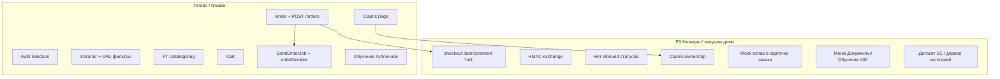

# Аудит готовности MVP (сводный)

**Дата:** 2026-08-17  
**Снимок кода:** [gitlab.com/nutnet/palizh](https://gitlab.com/nutnet/palizh), ветка **`main`**, коммит **`ad55296`** (2026-08-14, merge `feature/87023`).  
**Предыдущий снимок:** [`архив/Аудит_готовности_2026-08-07.md`](../архив/Аудит_готовности_2026-08-07.md) (`3eb790d`).  
**Fetch `gitlab.com` 2026-08-17:** DNS не резолвился; сверка по локальному `gitlab/main` = `ad55296`.  
**Чеклист демо/теста:** [`Статус_готовности_демо_2026-08-17.md`](Статус_готовности_демо_2026-08-17.md).

**Подробные отчёты для команд:**

| Слой | Документ |
|------|----------|
| Backend | [`Аудит_готовности_Backend_2026-08-17.md`](Аудит_готовности_Backend_2026-08-17.md) |
| Frontend | [`Аудит_готовности_Frontend_2026-08-17.md`](Аудит_готовности_Frontend_2026-08-17.md) |
| 1С (данные + спеки) | [`Аудит_готовности_1С_2026-08-17.md`](Аудит_готовности_1С_2026-08-17.md) |

---

## 0. Повестка собрания (5–8 мин)

1. **Можно показывать:** каталог + URL-фильтры, КТ overlay/страница, поиск, auth, корзина → заказ, претензия happy path, публичное обучение.
2. **Не обещать:** live-статусы из 1С, документы в ЛК, фильтр оттенков как продукт, сохранение нестандарта.
3. **P0 на неделю:** checkout `'null'`; меню 404 Документы/Обучение; ownership claims; HMAC `/exchange`; датасет 1С + `post_orders` E2E.
4. **Решение:** inbound статусов и `sync.order-items` — после фиксации event с 1С, не в демо-скрипт.

---

## 1. Сводка

| Слой | Готовность к MVP | Δ к 2026-08-07 | Главный вывод |
|------|------------------|----------------|---------------|
| **Бэкенд (API + Filament)** | **~86–89%** | ↑ | Контракт заказа/каталога стабилен; **HMAC / inbound статусов / consent / claims ownership — без изменений** |
| **Фронтенд (Nuxt)** | **~78–82%** | ↑↑ | **Закрыты F2 (КТ `/catalog/{slug}`), поиск UI, claims page, обучение публичное**; остаются `'null'`, моки extras/оттенков, 404 меню |
| **1С (контракт + реализация)** | **~50–55%** | = | Контракт `post_orders` выровнен; **E2E на стенде не подтверждён**; inbound статусов нет |
| **Сквозной E2E** | **~52–58%** | ↑ | Корзина→заказ в коде замкнут; **статусы/документы в ЛК — нет**; риск лома на `'null'` и данных каталога |
| **Документация / спеки** | **~90–92%** | = | Канон GitLab без нового fetch; задания URL / `sync.order-items` / чеклист данных 1С — в аналитике |

---

## 2. Что изменилось с 2026-08-07 (`3eb790d` → `ad55296`)

По локальному `gitlab/main` HEAD — merge **`feature/87023`** (2026-08-14). Полный лог коммитов с 08-07 в этой среде не развернут (fetch недоступен); сверка — по дереву файлов `ad55296`.

| Изменение | Слой | Влияние |
|-----------|------|---------|
| Страница КТ `frontend/app/pages/catalog/[slug].vue` | FE | **F2 закрыт** |
| Overlay → `replaceState` `/catalog/{slug}` | FE | Copy URL / F5 открывают КТ |
| `account/claims.vue` | FE | **F5 частично:** UI претензий есть, documents всё ещё нет |
| Поиск: `components/search/Field.vue`, `Panel.vue` | FE | Поиск больше не «~10%» |
| `/learning-programs` + заявка | FE | Публичное обучение в контуре демо |
| Меню ЛК: `/account/documents`, `/account/training` | FE | **Страниц нет → 404** (регресс UX, не новый API) |
| HMAC, inbound статусов, consent, `'null'`, claims ownership | BE/FE | **Без изменений vs 08-07** |

---

## 3. Критические рассинхроны (между блоками)

| ID | Суть | Где ломается |
|----|------|----------------|
| **D12** | Checkout шлёт `deliveryInfo.date: 'null'`, `comment: 'null'` | FE → BE → **1С `post_orders`**: мусор в полях / отказ валидации / «дата null» в ERP |
| **D3 / F5** | Documents API на бэке есть; карточка заказа берёт **моки** (`getMockOrderExtras`) | FE врёт относительно BE/1С; тестировщик думает, что паспорт/счёт живые |
| **D4 / B3** | ЧТЗ и ЛК предполагают статусы/доставку из 1С; handler **нет** | 1С / BE: `WebhookHandlerFactory` — только каталог + `sync.documents` |
| **D7 / B7** | FE даёт создать претензию; BE принимает любой `order_id` из `orders` | Любой залогиненный → чужой заказ; items только `exists:order_items,id` |
| **D5** | Consent ПДн в ЧТЗ; в `RegisterRequest` полей нет | FE/BE vs юридический контур |
| **M404** | Инфарх/меню: Документы и Обучение в ЛК; страниц нет (обучение — публичный `/learning-programs`) | FE vs Инфарх vs ожидание демо |
| **SHADES** | Фильтр «Оттенки» = `mockColorGroups`, не API | FE vs каталог 1С: «работает» на моках |
| **NS** | Drawer нестандарта: `submit()` только закрывает и success | FE vs ЧТЗ: пользователь думает, что заявка сохранена |
| **HMAC** | Спека inbound — HMAC; `ExchangeController` принимает любой JSON | BE vs безопасность / 1С-контур |
| **ITEMS** | Задание `sync.order-items` есть; в factory **нет** | Аналитика vs BE vs 1С: состав заказа после правок в ERP не доедет |
| **CAT** | Риск `sync.categories`: товары как папки | 1С → витрина: дерево и URL-фильтры категории ломаются |
| **ST6/7** | ЧТЗ — **6** статусов заказа; в коде BE enum **7** (`preparing_for_shipping`); в чеклисте 1С — чужие коды `new`/`paid` | 1С не должна маппить шкалу, пока не зафиксирован один enum; см. [`Готовность_данных_в_1С.md`](Готовность_данных_в_1С.md) §5 |

Закрытые ранее (не поднимать): **D9** payload `post_orders`, **D10** UI `POST /orders`, **D11** `externalGuid` = GUID заказа, **B5** `packagingMode*` снято с ЧТЗ, **F2** route КТ.

---

## 4. Возможные ошибки (баги и ловушки теста)

| Pri | Ошибка | Симптом | Владелец |
|-----|--------|---------|----------|
| P0 | Строки `'null'` в checkout | 1С/БД получают дату/комментарий как текст `null`; падение job или «кривой» заказ | Frontend |
| P0 | Claims без ownership | Претензия к чужому заказу проходит валидацию | Backend |
| P0 | `ClaimService`: `OrderItem::find($id)->order_id` | NPE, если id пропал между validate и find; `==` loose | Backend |
| P0 | Меню Документы / Обучение | 404 на демо | Frontend |
| P0 | Нет HMAC на `/exchange` | Любой клиент может писать каталог/документы | Backend |
| P1 | Моки extras + `mock-tracking-desktop` | «Документы и трек есть» — это статика | Frontend |
| P1 | Оттенки mock | Фильтр не совпадает с 1С/админкой | Frontend |
| P1 | Нестандарт success без API | Ложное подтверждение | Frontend |
| P1 | Категории не-деревом | Пустой/ломаный каталог при живых товарах | 1С |
| P1 | Нет inbound статусов | Статус в ЛК «застывший» после `post_orders` | 1С + Backend |

---

## 5. Блокеры P0 (очередь на неделю)

| # | ID | Действие | Владелец |
|---|-----|----------|----------|
| 1 | **D12** | Убрать `'null'`; omit / реальная дата / пустой comment | Frontend |
| 2 | **M404** | Скрыть пункты меню **или** сделать empty-state, не 404 | Frontend |
| 3 | **B7** | Ownership: заказ своего контрагента; items только этого заказа | Backend |
| 4 | **B4** | HMAC + IP allowlist на `POST /exchange` | Backend |
| 5 | **1C-Q** | Датасет по чеклисту + E2E `post_orders` (GUID = `externalGuid`, номер = `orderNumber`) | 1С |
| 6 | **F5** | Убрать mock extras **или** явный empty-state «документов нет» | Frontend |
| 7 | **B3** | Event статусов + handler — **после** согласования имени event; не блокер демо-скрипта | 1С + Backend |

---

## 6. Готовность по контурам

| Контур | BE | FE | 1С | E2E |
|--------|----|----|-----|-----|
| Auth / онбординг | ~85% | ~78% | email stub | Частично |
| Витрина / каталог | ~90% | **~85%** | inbound ~75% | Частично (данные?) |
| Поиск | ~85% | **~70%** | — | Частично |
| Корзина / оформление | ~85% | ~85% | outbound ~70% | **Частично** (`'null'`, E2E ☐) |
| Заказы ЛК | ~85% | ~75% | статусы **0%** inbound | Нет live |
| Документы ЛК | ~75% API | **~5%** (404 + моки) | `sync.documents` / get | Нет |
| Претензии | ~60% | **~70% UI** | — | Happy path; ownership ✗ |
| Нестандартный заказ | ? | **~40% UI** | — | Нет |
| Обучение | API заявок | **~75%** публичное | — | Частично |
| SEO / ПДн | ~50% | news ✓ / consent 0% | — | Нет |

---

## 7. Решения, которые нужны на собрании

1. **Демо vs приёмка:** подтверждаем, что статусы из 1С, документы ЛК и нестандарт **не входят** в скрипт демо.
2. **`'null'`:** чинить до показа заказчику (иначе риск видимого мусора в 1С).
3. **Меню 404:** скрыть до страниц или заглушка.
4. **HMAC:** обязателен на stage/prod до открытия `/exchange` в интернет.
5. **Датасет 1С:** кто и когда закрывает [`Готовность_данных_в_1С.md`](Готовность_данных_в_1С.md).

---

*Сверка: `CreateClaimRequest`, `ClaimService`, `order.vue`, `account-menu.ts` / `AsidePanel.vue`, `FilterPanel` + `mockColorGroups`, `WebhookHandlerFactory`, `ExchangeController` — `gitlab/main` @ `ad55296`.*
