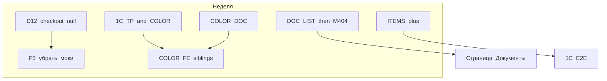

# Аудит готовности MVP — 2026-08-27

**Для кого:** Frontend, Backend, 1С, аналитика.  
**Снимок кода:** [gitlab.com/nutnet/palizh](https://gitlab.com/nutnet/palizh) `main` @ **`8c775db`** (2026-08-27).  
**Предыдущий:** [`Аудит_готовности_2026-08-25.md`](Аудит_готовности_2026-08-25.md) (`f3a54a6`).  
**Полный отчёт аудитора (docs + код):** [`../Аудит_документации_2026-08-27.md`](../Аудит_документации_2026-08-27.md).

**Канон 27.08:** сборники вне каталога; цвет = характеристика в товаре; ТП = leaf-категория; состав заказа из 1С → ЛК.

В одном документе: сводка готовности, таблицы блокеров и **расшифровка** (что не так / где / что сделать).

**Приоритеты:**  
- **P0** — ломает демо / безопасность / целевую модель; чинить в первую очередь.  
- **P1** — важно для приёмки, демо возможно с оговорками.

---

## 1. Сводка готовности

| Слой | 25.08 | **27.08** | Δ |
|------|-------|-----------|---|
| Backend | ~88–92% | **~88–91%** | ↑ siblings `category_guid`; items add нет; HMAC/claims/docs list открыты |
| Frontend | ~82–87% | **~80–85%** | ↑ UX каталог/корзина; ↓ mock оттенки, siblings не в UI, Документы/`'null'` |
| 1С | ~52–60% | **~50–58%** | Leaf=ТП / цвет / E2E состава не подтверждены |
| E2E | ~55–65% | **~52–62%** | Без среза ТП+цвета и полного replace items |
| Документация | ~88–90% | **~82–86%** | Три слоя модели цвета; hooks аналитики без `sync.orders` |

### Новая модель: код vs канон

| Ожидание | Код @ `8c775db` |
|----------|-----------------|
| Сборники вне каталога | CMS `collections` живы; товарные сборники явно не вычищены |
| Цвет в товаре | FE mock; BE characteristics = фасовка/цены |
| ТП = leaf category | BE `siblings` по `category_guid` — да; FE — нет |
| Состав из 1С | qty/delete — да; **add — нет** |

---

## 2. Как читать коды блокеров

| Префикс | Слой | Примеры |
|---------|------|---------|
| `D…` / `F…` / `M…` / `COLOR-FE` / `SEO-FE` | Frontend | D12, F5, M404 |
| `B…` / `DOC-LIST` / `ITEMS+` / `SIBLINGS` / `HOOKS` | Backend (+ docs sync) | B4, B7 |
| `1C-…` | 1С / данные / E2E обмена | 1C-TP, 1C-COLOR |
| `COLOR-DOC` / `ITEMS-DOC` | Аналитика / ЧТЗ | канон в документах |

### Кто что чинит

| Владелец | P0 | P1 |
|----------|----|----|
| **FE** | D12, M404, F5, COLOR-FE | SEO-FE |
| **BE** | B7, B4, DOC-LIST | ITEMS+, SIBLINGS (с FE/1С), HOOKS (с аналитикой) |
| **1С** | 1C-TP, 1C-COLOR, 1C-E2E | 1C-ITEMS |
| **Аналитика** | COLOR-DOC, ITEMS-DOC | COLL (пояснение) |

### Краткая таблица (статусы)

| Pri | ID | Слой | Суть | Статус |
|-----|-----|------|------|--------|
| P0 | D12 | FE | Checkout `'null'` | OPEN |
| P0 | M404 | FE | Документы ЛК → 404 | OPEN |
| P0 | F5 | FE | Моки extras/tracking | OPEN |
| P0 | COLOR-FE | FE | Оттенки/siblings mock | OPEN |
| P1 | SEO-FE | FE | SEO каталога не в UI | OPEN |
| P0 | B7 | BE | Claims без ownership | OPEN |
| P0 | B4 | BE | Нет HMAC на `/exchange` | OPEN |
| P0 | DOC-LIST | BE | List docs без counterparty | OPEN |
| P1 | ITEMS+ | BE | Новые строки из 1С не создаются | OPEN |
| P1 | SIBLINGS | BE | siblings готовы; FE+1С | PARTIAL |
| P1 | HOOKS | Docs | hooks аналитики без `sync.orders` | OPEN |
| P0 | 1C-TP | 1С | Leaf = ТП + варианты | gap |
| P0 | 1C-COLOR | 1С | Цвет-характеристика в товаре | gap |
| P0 | 1C-E2E | 1С | E2E заказа | UNKNOWN |
| P1 | 1C-ITEMS | 1С | Полный snapshot состава | OPEN |
| P0 | COLOR-DOC | Аналит. | Канон 27.08 не в ЧТЗ | OPEN |
| P0 | ITEMS-DOC | Аналит. | Контракт состава не в hooks | OPEN |

---

## 3. Frontend — что не так и что сделать

### D12 — Checkout шлёт строку `'null'` вместо пустых полей

| | |
|--|--|
| **Приоритет** | P0 |
| **Владелец** | FE (+ при необходимости валидация на BE) |
| **Где** | `frontend/app/pages/order.vue` (~строки 48–49): `date: 'null'`, `comment: 'null'` |

**Что не так.** Если дата доставки или комментарий не заполнены, фронт подставляет литерал `"null"`, а не `null` / отсутствие поля / пустую строку.

**Чем грозит.** Мусор в 1С и в карточке заказа; ломает приёмку checkout.

**Что сделать.**

1. Не отправлять строку `'null'`: не передавать поле, либо `null`, либо `""` по контракту API.  
2. Прогнать: заказ без даты/комментария → `POST /orders` → проверить Network и 1С.  
3. Желательно на BE отклонять строку `"null"` в `CreateOrderRequest`.

---

### M404 — «Документы» в ЛК → 404

| | |
|--|--|
| **Приоритет** | P0 |
| **Владелец** | FE |
| **Где** | `AsidePanel.vue`, `account-menu.ts` → `/account/documents`. Страницы `documents.vue` **нет**. |

**Что не так.** Пункт меню есть, маршрута нет.

**Чем грозит.** На демо нельзя показать документы; выглядит как дыра в ЛК.

**Что сделать.**

1. **A:** страница списка на `GET /documents` + скачивание.  
2. **B (временно):** убрать пункт из меню.  
3. Сначала закрыть **DOC-LIST** на BE — без фильтра list опасен.

---

### F5 — Моки extras/tracking вместо API

| | |
|--|--|
| **Приоритет** | P0 |
| **Владелец** | FE |
| **Где** | `orders/[id].vue`: `getMockOrderExtras()`, `mock-tracking-desktop`; `shared/mocks/order.ts`. |

**Что не так.** Трек/доки рисуются из моков, хотя есть `deliveryInfo` и inbound `sync.orders`.

**Чем грозит.** Фейковые данные на демо; нельзя принимать live-статусы из 1С.

**Что сделать.**

1. Подключить UI к API (`deliveryInfo`, статус, документы).  
2. Отключить моки на стенде/демо.  
3. Нет данных — empty-state, не mock.

---

### COLOR-FE — Оттенки и КТ на заглушках; siblings не в UI

| | |
|--|--|
| **Приоритет** | P0 (канон 27.08) |
| **Владелец** | FE (+ BE частично готов, 1С — данные) |
| **Где** | `FilterPanel` → `mockColorGroups`; `Options` → `mockShadePalette`; `ProductCard` → `mockShade`. `siblings` в API есть, FE не использует. |

**Что не так.** Канон: сборники вне каталога; цвет в характеристиках товара; группа = leaf-категория (ТП), внутри цвет/масса. Сейчас — моки, переключения SKU нет.

**Что сделать.**

1. КТ: `siblings` по одному `category_guid` → UI цвета/массы (смена SKU).  
2. Фильтр оттенков — реальные данные после выгрузки 1С.  
3. Не путать с CMS `collections` на главной.

---

### SEO-FE — SEO каталога не в UI

| | |
|--|--|
| **Приоритет** | P1 |
| **Владелец** | FE (+ BE / админка) |
| **Где** | ЧТЗ 06 §4.2.6 / 12 §4.2.3; meta каталога в `main` не дотянуты. |

**Что сделать.** После BE/админки — meta для категории и curated facet; до этого не обещать на демо.

---

## 4. Backend — что не так и что сделать

### B7 — Претензию можно создать на чужой заказ

| | |
|--|--|
| **Приоритет** | P0 (безопасность) |
| **Владелец** | BE |
| **Где** | `CreateClaimRequest::authorize() = true`; `ClaimService::create` без проверки counterparty. |

**Что не так.** Достаточно `order_id` чужого заказа — claim создаётся. Список фильтруется по `user_id`, создание — нет.

**Что сделать.**

1. Заказ должен принадлежать `user` / `user.counterparty`.  
2. Позиции — только `order_items` этого заказа.  
3. Тест: A не создаёт claim на заказ B → 403/422.

---

### B4 — `/exchange` без HMAC / allowlist

| | |
|--|--|
| **Приоритет** | P0 (безопасность) |
| **Владелец** | BE |
| **Где** | `ExchangeController` — event → handler → 202, без подписи. |

**Что не так.** Кто достучится до URL — может слать sync каталога/заказов/документов.

**Что сделать.**

1. HMAC по принятым решениям **или** явный IP allowlist до HMAC.  
2. Логировать отказы.  
3. Не открывать `/exchange` в интернет без защиты.

---

### DOC-LIST — List documents без фильтра по контрагенту

| | |
|--|--|
| **Приоритет** | P0 (безопасность) |
| **Владелец** | BE |
| **Где** | `DocumentService::paginateForCounterparty` — нет `where` по `counterparty_id`. |

**Что не так.** `GET /documents` может отдать чужие метаданные. Download через policy закрыт лучше.

**Что сделать.**

1. Фильтр только по текущему counterparty.  
2. Тесты list + download чужого → 403.  
3. Затем FE страница (**M404**).

---

### ITEMS+ — Новые строки состава из 1С не создаются

| | |
|--|--|
| **Приоритет** | P1 (для сценария «менеджер добавил позицию» — критично) |
| **Владелец** | BE (+ 1С) |
| **Где** | `SyncOrderJob::syncItems`: qty/delete ок; unknown item → warning **skipped**, create нет. |

**Связь.** Задание: [`Задание_sync_order_items_изменение_состава.md`](../Техническая%20часть/Задание_sync_order_items_изменение_состава.md). Event в коде: **`sync.orders`**.

**Что сделать.**

1. Создавать `order_item` по GUID product/characteristic, пересчитывать totals.  
2. Политика: пустой `items[]`, цены, FK претензий.  
3. E2E: add / change qty / remove.

---

### SIBLINGS — BE готов, нужны данные и FE

| | |
|--|--|
| **Приоритет** | P1 (PARTIAL) |
| **Владелец** | BE готов; дальше FE + 1С |
| **Где** | `Product::siblings()` по `category_guid`; OpenAPI «то же ТП». |

**Что сделать.** 1С — один leaf `category_guid` на варианты ТП; FE — **COLOR-FE**; при необходимости исключать текущий товар из siblings в API.

---

### HOOKS — В аналитике нет секции `sync.orders`

| | |
|--|--|
| **Приоритет** | P1 |
| **Владелец** | Аналитика |
| **Где** | `входящие/incoming-hooks.md` (analytics) vs GitLab `docs/incoming-hooks.md`. |

**Что сделать.** Синхронизировать `sync.orders` (status, delivery, items); обновить чеклист заказов.

---

## 5. 1С — что не так и что сделать

### 1C-TP — Leaf-категория = торговое предложение

| | |
|--|--|
| **Приоритет** | P0 |
| **Владелец** | 1С |

**Что не так.** Платформа группирует siblings по `category_guid`. Нужна нижняя категория = ТП; все варианты (цвет/масса) — в одной.

**Что сделать.** Датасет (≥2 цвета × ≥2 фасовки); проверить `sync.categories` / `categoryGuid`; на стенде `siblings` заполнены.

---

### 1C-COLOR — Цвет как характеристика в товаре

| | |
|--|--|
| **Приоритет** | P0 |
| **Владелец** | 1С (+ аналитика зафиксирует контракт) |

**Что не так.** Старые модели (тип / hex-атрибут / сборники) vs канон 27.08: цвет в характеристиках **товара**.

**Что сделать.** Зафиксировать поля в обмене; заполнить HEX на срезе; после этого FE снимает моки.

---

### 1C-E2E — Сквозной заказ не подтверждён

| | |
|--|--|
| **Приоритет** | P0 |
| **Владелец** | 1С + BE |

**Что сделать.** Сайт → 1С (`post_orders`) → статус/`sync.orders` → ЛК; отдельно изменение состава (**1C-ITEMS** / **ITEMS+**).

---

### 1C-ITEMS — Полный snapshot состава

| | |
|--|--|
| **Приоритет** | P1 |
| **Владелец** | 1С (+ BE ITEMS+) |

**Что сделать.** Event **`sync.orders`** с полным `items[]` (в т.ч. новые строки); без спама без изменений ТЧ; retry.

---

## 6. Аналитика — что не так и что сделать

### COLOR-DOC — Канон 27.08 не в ЧТЗ

| | |
|--|--|
| **Приоритет** | P0 |
| **Владелец** | Аналитика |

**Что сделать (после согласования).** ЧТЗ 06 §4.2.5/§4.3, глоссарий, модель данных, реестр, Инфарх КТ; пометка в саммари 21.08 (ключ ТП / цвет устарели).

---

### ITEMS-DOC — Контракт состава не в hooks/чеклисте аналитики

| | |
|--|--|
| **Приоритет** | P0 |
| **Владелец** | Аналитика |

**Что сделать.** Hooks с GitLab; чеклист + ЧТЗ 01/08/09; задание → «согласовано» под `sync.orders`.

---

### COLL — CMS collections ≠ товарные сборники

| | |
|--|--|
| **Приоритет** | P1 |
| **Владелец** | Все |

**Что сделать.** Не называть CMS «сборниками». Отдельно — скрытие товарных сборников из листинга/поиска, если ещё приходят из 1С.

---

## 7. Порядок работ на неделю

1. FE: **D12**, **F5**; Документы — снять из меню или ждать **DOC-LIST**.  
2. BE: **B7**, **B4**, **DOC-LIST**, затем **ITEMS+**.  
3. 1С: **1C-TP** + **1C-COLOR**, затем **1C-E2E** / **1C-ITEMS**.  
4. FE: **COLOR-FE** после данных.  
5. Аналитика: **COLOR-DOC**, **ITEMS-DOC**, **HOOKS**.

---

## 8. Демо: можно / нельзя

| Можно | Нельзя / с оговоркой |
|-------|----------------------|
| Каталог, URL-фильтры, КТ slug, поиск | Фильтр оттенков как продукт (mock) |
| Auth, корзина, заказ | Без даты/комментария — `'null'` (**D12**) |
| Претензия по **своему** заказу | Чужой `order_id` (**B7**) |
| Обучение, нестандарт create | Документы ЛК (**M404**) |
| Toast «в корзину» | Live-трек/доки (**F5**) |
| | Полный состав после правок в 1С (**ITEMS+**) |
| | Сборники в каталоге как целевая модель |

Детали сверки docs↔код — в [`Аудит_документации_2026-08-27.md`](../Аудит_документации_2026-08-27.md).
