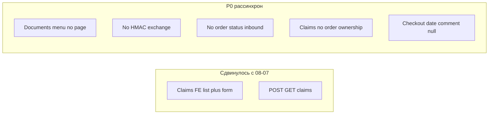

# Аудит согласованности ЧТЗ ↔ реализация (FE / BE)

**Дата:** 2026-08-11  
**Снимок кода:** [gitlab.com/nutnet/palizh](https://gitlab.com/nutnet/palizh) `main` @ **`917c1c4`** (trainings refactor; claims UI #86963/#86964).  
**Предыдущий снимок готовности:** [`архив/Аудит_готовности_2026-08-07.md`](../архив/Аудит_готовности_2026-08-07.md) (`3eb790d`).  
**Канон API:** синхронизирован из GitLab → `Техническая часть/public-http-openapi.yaml`, `1c-http-openapi.yaml`, `входящие/incoming-hooks.md`.

**Фокус:** рассинхрон ЧТЗ ↔ код, FE ↔ BE, ошибки. Не полный пересчёт % готовности слоёв.

---

## 1. Сводка

С `3eb790d` → `917c1c4` закрыт крупный пробел **претензий на FE** (список + форма → `POST /claims`). Остаются системные разрывы: **документы в ЛК**, **статусы из 1С**, **HMAC `/exchange`**, **битые пункты меню**, **checkout `'null'`**, **ownership претензий**.

| Тип | Кол-во критичных | Суть |
|-----|------------------|------|
| **BUG** | 3 | Ownership заказа в claims; NPE на `find()->order_id`; checkout шлёт строку `'null'` |
| **FE–BE desync** | 4+ | Меню documents/training без страниц; documents API есть — UI нет; search API есть — UI витрины нет; order extras — моки |
| **GAP vs ЧТЗ** | P0 | Inbound статусов, HMAC, КТ как отдельный URL, нестандарт без API, consent ПДн |



---

## 2. Что изменилось с 2026-08-07 (`3eb790d` → `917c1c4`)

| Изменение | Слой | Vs ЧТЗ |
|-----------|------|--------|
| `#86963` / `#86964` список и форма претензий, `POST /claims`, файлы | FE + BE + OpenAPI | ЧТЗ 04 to-be: форма в ЛК — **закрыто по UI+API подачи** |
| Trainings API refactor `#87009` | BE | ЧТЗ 14: API есть; **страниц ЛК обучения на FE нет** (меню ведёт в никуда) |
| Правки корзины/заказа/продукта (UI) | FE | Без снятия P0 checkout `'null'` |

---

## 3. Ошибки (BUG)

### B1. Претензия: нет проверки, что заказ принадлежит пользователю — **критично**

`CreateClaimRequest`: `order_id` → `exists:orders,id`, **без** `user` / контрагента.  
`ClaimService::create` пишет `order_id` из запроса как есть.

Любой авторизованный клиент может создать претензию к **чужому** `order_id` (если угадает/узнает id).

ЧТЗ 04: претензия **в контексте своего заказа**.

### B2. `ClaimService`: возможный NPE + слабое сравнение

```php
OrderItem::query()->find($orderItemId)->order_id == $claim->order_id
```

Если `find` вернул `null` → ошибка; `==` вместо строгого сравнения и без проверки ownership заказа.

### B3. Checkout: `deliveryInfo.date: 'null'`, `comment: 'null'`

`frontend/app/pages/order.vue` — в тело `POST /orders` уходят **строки** `'null'`, не `null`/omit. Риск порчи данных доставки/комментария в BE/1С (ЧТЗ 01 / 03).

---

## 4. Рассинхрон FE ↔ BE

| Тема | Backend | Frontend | Вердикт |
|------|---------|----------|---------|
| Претензии | `GET/POST /claims` | `/account/claims` + форма → API | **Согласовано** (ownership — BUG выше) |
| Документы | `GET /documents`, download | Пункт меню `/account/documents` — **страницы нет** | **Desync / 404 в ЛК** |
| Обучение | `GET training/*`, requests | Меню `/account/training` — **страницы нет** | **Desync** |
| Карточка товара | `GET /products/{slug}` | Overlay в каталоге, **нет** `pages/products/[slug]` | **Частично**: deep-link/шаринг слабее ЧТЗ 06 |
| Поиск витрины | `GET /search` | Нет страницы/UI поиска каталога (только поиск в заказах ЛК) | **Desync** vs ЧТЗ 11 |
| Документы/доставка в карточке заказа | API документов есть; delivery inbound нет | `getMockOrderExtras()`, `mock-tracking-desktop`; passport TODO | **Desync / моки** vs ЧТЗ 02, 08, 03 |
| Нестандартный заказ | Отдельного публичного endpoint под drawer не видно в api.php | `RequestDrawer.submit` только закрывает UI + success | **UI без BE** vs ЧТЗ 01 §4.5 |
| Статусы заказа | `statusTransitions` на модели/API заказа (ранее); **нет** webhook статусов | Список/карточка без live inbound | BE готов к отображению сильнее, чем поток 1С |
| Consent ПДн | `RegisterRequest` без consent | Регистрация без явного API-поля | **Оба отстают** от ЧТЗ 05 / NFR |

---

## 5. Пробелы vs ЧТЗ (по блокам)

| ЧТЗ | Требование (to-be) | Статус кода `917c1c4` |
|-----|--------------------|----------------------|
| **01** Оформление | Корзина, checkout, заказ в 1С | Checkout UI + `POST /orders` + `SendOrderJob` ✓; payload `'null'` ✗; нестандарт — UI only ✗ |
| **02** Документы | Раздел документов в ЛК, файлы | API ✓; **UI раздела нет** ✗; в заказе — моки ✗ |
| **03** Доставка | Детали доставки в заказе | Inbound delivery нет; FE моки ✗ |
| **04** Претензии | Форма в ЛК, статус «отправлена» | FE+BE create/list ✓; ownership ✗; уведомления команде — уточнять |
| **05** Регистрация | Онбординг, ПДн | Register без consent-поля ✗ |
| **06** Витрина / КТ | Каталог + карточка | Каталог + overlay ✓; отдельный URL КТ слаб ✗ |
| **08** Заказы / статусы | 6 статусов из 1С | Outbound заказа ✓; **inbound статусов нет** ✗ |
| **09** 1С | `/exchange`, HMAC, post_orders | post_orders в job ✓; **HMAC/IP на exchange нет** ✗; order-status event нет ✗ |
| **10** Уведомления | Триггеры | Частично (notifications API); претензия/заказ — сверять регламент |
| **11** Поиск | Поиск по каталогу | BE ✓; FE витрины ✗ |
| **14** Обучение | Заявки / программы | BE ✓; FE страниц ЛК ✗ |

---

## 6. Интеграция 1С (кратко)

| Элемент | Статус |
|---------|--------|
| `SendOrderJob`: `productGuid` + `productCharacteristicGuid`, ответ `orderNumber` | ✓ |
| Handlers каталога + `sync.documents` | ✓ |
| HMAC / allowlist на `ExchangeController` | **Нет** (только event → factory → 202) |
| Event смены статуса / delivery | **Нет** в `WebhookHandlerFactory` |
| E2E стенд post_orders | По-прежнему требует подтверждения (#47) |

---

## 7. Очередь исправлений (приоритет)

| # | ID | Действие | Владелец |
|---|-----|----------|----------|
| 1 | **B1** | Валидация: заказ претензии принадлежит текущему user/контрагенту | Backend |
| 2 | **B2** | Null-safe items + строгая привязка order_item → order | Backend |
| 3 | **B3** | Убрать `'null'` в checkout; реальная дата / пустой comment | Frontend |
| 4 | **D-menu** | Страница `/account/documents` **или** убрать из меню | Frontend |
| 5 | **T-menu** | Страницы обучения **или** убрать пункт меню | Frontend |
| 6 | **F5** | Подключить documents API в карточке заказа; убрать mock extras | Frontend |
| 7 | **B4** | HMAC + IP на `POST /exchange` | Backend |
| 8 | **B3-status** | Event статусов (#18) + handler | 1С + Backend |
| 9 | **F2** | Route/deep-link КТ (`/products/[slug]` или эквивалент в каталоге) | Frontend |
| 10 | **Search** | UI поиска витрины | Frontend |
| 11 | **Nonstd** | Endpoint + submit **или** скрыть до готовности | FE + BE |
| 12 | **Consent** | Поле/флаг ПДн register | FE + BE |

---

## 8. Выводы для команд

**Backend:** претензии API есть, но **дырявый authz**; security `/exchange` и inbound статусов — без изменений с августа; документы/поиск/обучение на API впереди FE.

**Frontend:** претензии — главный плюс спринта; меню ЛК обещает documents/training без страниц (**явный UX-баг**); заказ детально на моках; checkout всё ещё шлёт `'null'`.

**Аналитика / приёмка:** для MVP-критичного пути блокеры те же плюс **B1** (безопасность претензий) и **битое меню документов**.

---

## 9. Источники

| Артефакт | Путь |
|----------|------|
| Снимок | `gitlab/main` @ `917c1c4` |
| Предыдущий аудит | `архив/Аудит_готовности_*_2026-08-07.md` |
| ЧТЗ | `ЧТЗ/01`…`14`, особенно 01, 02, 04, 06, 08, 09, 11 |
| OpenAPI | `Техническая часть/public-http-openapi.yaml` (синк с GitLab) |
