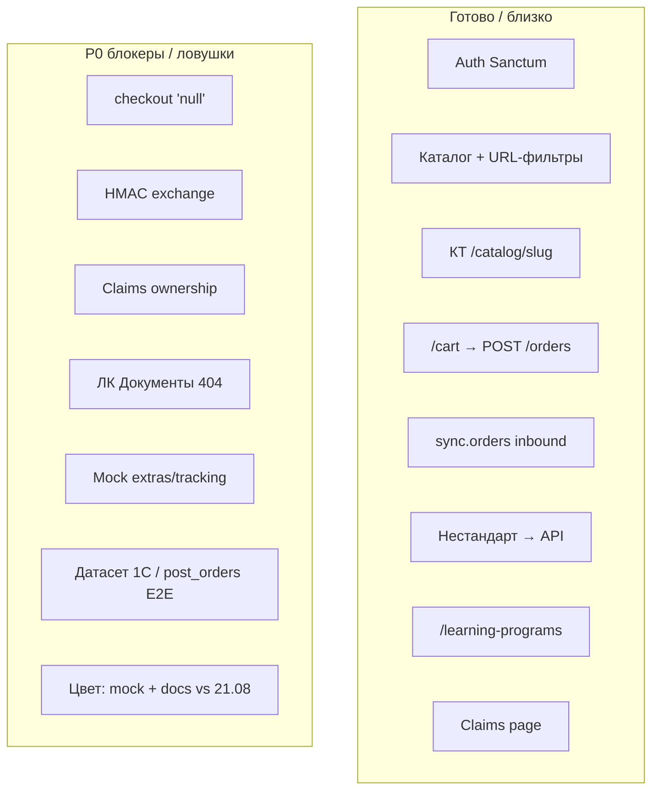

# Аудит документации и готовности — 2026-08-25

**Роль:** агент-аудитор (целостность артефактов) + сверка кодовой базы.  
**Снимок кода:** [gitlab.com/nutnet/palizh](https://gitlab.com/nutnet/palizh) `main` @ **`f3a54a6`** (2026-08-25, merge `feature/87169`).  
**Предыдущий аудит готовности:** [`Аудит/Аудит_готовности_2026-08-17.md`](Аудит/Аудит_готовности_2026-08-17.md) (`ad55296`, 2026-08-14).  
**Метод:** docs — чтение ЧТЗ/Техчасти/Инфарх/реестров/саммари; код — `git fetch gitlab` + дерево `gitlab/main` (локального clone `gitlab/` нет).  
**Правки в артефакты не вносились** — только отчёт и рекомендации.

**Связанные саммари:** [`2026-08-21_встреча_по_цветам_саммари.md`](Интервью%20и%20встречи/Саммари/2026-08-21_встреча_по_цветам_саммари.md).

---

## 1. Краткое видение проекта

B2B-платформа **palizh.com** для производителя ЛКМ «Новый дом» (Палиж): витрина без цен для гостя, ЛК с персональными ценами/заказами/документами, админка контента; мастер-система каталога, цен, статусов и документов — **1С**.

Контур MVP закрыт ЧТЗ **01–14** (заказ, документы, доставка, претензии, онбординг, витрина/фильтры/SEO, ЛК, интеграция 1С, уведомления email, поиск, админка, НФТ, обучение-заявка). ЭДО, ТК-виджеты, мобильное — post-MVP.

**Вердикт на 25.08:** документация по заказу/ЛК/интеграции в целом цельная; **главный разрыв целостности — модель цвета и сборников** (саммари 21.08 vs ЧТЗ 06/глоссарий/техмодель). Код с 17.08 заметно продвинулся (`sync.orders`, нестандарт API, обучение в меню), но **P0 демо-ловушки** (`'null'`, ownership claims, HMAC, Документы 404, моки) всё ещё открыты.

---

## 2. Степень готовности (код vs 17.08)

| Слой | 17.08 | **25.08** | Δ |
|------|-------|-----------|---|
| **Backend** | ~86–89% | **~88–92%** | ↑ `sync.orders`, non-standard API, collections, documents `withRelatedEntity` |
| **Frontend** | ~78–82% | **~82–87%** | ↑ обучение → `/learning-programs`, non-standard→API, collections на главной; P0 checkout/docs/mocks открыты |
| **1С** | ~50–55% | **~52–60%** | ↑ слабо: платформа **готова** принимать статусы; E2E/датасет на стенде не подтверждены |
| **E2E** | ~52–58% | **~55–65%** | ↑ потенциал; ломают `'null'`, моки ЛК, неизвестный стенд 1С |
| **Документация** | ~90–92% | **~88–90%** | ↓ из‑за **непроставленной** модели цвета 21.08 и отставания `incoming-hooks` аналитики от GitLab |

---

## 3. Проверка целостности ЧТЗ

| Файл | Статус | Комментарий |
|------|--------|-------------|
| **01** заказ | Нужно дополнить | To-be полный; хвосты №30 (цены на макете), нестандарт уже с API в коде |
| **02** документы | Нужно дополнить | Enum `type`, №36 TDS/СГР, №49 контракт файлов |
| **03** доставка | Нужно дополнить | №9 закрыт в реестре, но §5 ещё спрашивает «календарь машин» |
| **04** претензии | ОК | MVP описан; ownership — дыра **в коде**, не в ЧТЗ |
| **05** онбординг | Нужно дополнить | №37 GUID/активность 1С; consent в коде нет |
| **06** витрина | **Есть противоречия** | §4.2.5 «цвет = характеристика» **vs** саммари 21.08 (атрибут 95%, сборники вне каталога, группировка по ТП). SEO §4.2.6 — ок в ЧТЗ |
| **07** профиль | Нужно дополнить | №43–45 роли/контакты |
| **08** заказы | Нужно дополнить | №40 повтор; enum 6 vs 7 в коде |
| **09** 1С | Нужно дополнить | Спеки опережают HMAC; `sync.orders` уже в GitLab docs/коде, в аналитике `incoming-hooks` — отставание |
| **10** уведомления | ОК | Email-контур согласован |
| **11** поиск | Нужно дополнить | №34/54 данные |
| **12** админка | Нужно дополнить | SEO §4.2.3 / фильтры ок; §4.2.1 оттенки устареют с моделью цвета |
| **13** НФТ | Нужно дополнить | №50 числа не утверждены |
| **14** обучение | ОК | MVP согласован |
| **Глоссарий** | **Есть противоречия** | «Группа оттенков» = характеристика |
| **Оглавление** | ОК | Не отражает решение по сборникам |

### Фокус: цвет / 95%–5%

| Артефакт | Утверждение |
|----------|-------------|
| Саммари **2026-08-21** | Сборники **не в каталоге**; 95% — `color`/`hex` на номенклатуре; КТ = группа по **торговому предложению** |
| ЧТЗ 06 §4.2.5 | Цвет — **характеристика** |
| Модель_данных / чеклист 1С / admin matrix | Характеристика / датасет под оттенки-характеристики |

**Три конкурирующие модели; канон встречи 21.08 в ЧТЗ не проставлен** (саммари сознательно отложило правки до согласования).

---

## 4. Техническая часть и код

| Тема | Docs | Code `f3a54a6` |
|------|------|----------------|
| Inbound статусов | Аудит 17: «handler нет» | **`sync.orders` есть** (status/delivery/items) |
| `incoming-hooks` аналитика | Нет секции `sync.orders` | GitLab docs — есть |
| HMAC `/exchange` | Требуется | **Не реализовано** |
| Нестандарт | ЧТЗ: форма + email | **FE+BE API замкнуты** |
| Документы ЛК | Инфарх/меню есть | API да, **UI `/account/documents` нет → 404** |
| Обучение в ЛК | было 404 | Меню → **`/learning-programs`** (снято) |
| Checkout `'null'` | Запрет в ЧТЗ 01 | **Открыт** в `order.vue` |
| Claims ownership | Неявно «свой заказ» | **Нет** проверки контрагента |
| Оттенки | §4.2.5 / админка | **`mockColorGroups`**; hex в option API слабо |
| SEO каталога | ЧТЗ 06 §4.2.6 / 12 §4.2.3 | **Не в main** (ветка `dev#87099`) |
| Статусы заказа | ЧТЗ: 6 | Код: **7** enum |
| Collections | — | CMS-карточки главной ≠ товарные сборники каталога |

---

## 5. Реестр открытых вопросов

**Не отражено / устарело в реестре:**
- решение **21.08** по цветам/сборникам/ТП — нет новых строк;
- SEO curated (18.08) закрыто в ЧТЗ, в реестре отдельной строки нет;
- №9 закрыт, ЧТЗ 03 §5 ещё «открыт».

**Критичные открытые (MVP):** 18, 36, 37, 40, 47–50, 54, 56 (+ 30, 34, 26, 43).

**Новые из саммари 21.08 (добавить в реестр):** код поля «наименование ТП»; состав группы ТП; цвет в `post_orders`; SEO «цвет внутри ТП»; видимость сборников в поиске.

---

## 6. Реестр документов для проектирования

- Образцы 1–8, 11–13, 15 получены — ок для печатных форм.
- Дата актуализации **2026-05-22** — устарела относительно новых решений.
- №36 (TDS/СГР в ЛК) открыт при уже полученных PDF.
- Нет образца служебной записки претензии.

---

## 7. Инфарх vs ЧТЗ

| Тема | Вердикт |
|------|---------|
| Фильтры + SEO листингов | Ссылки согласованы с ЧТЗ §4.2.6 |
| Группы оттенков | Согласованы со **старой** моделью §4.2.5 |
| Сборники / ТП / цвет-атрибут | **Нет** в Инфархе → дизайн опирается на устаревший §4.2.5 |
| Документы в ЛК | В дереве есть; в коде UI нет |

---

## 8. Хвосты P0 / P1 (код + процесс)

| Pri | ID | Хвост | Владелец |
|-----|-----|-------|----------|
| **P0** | D12 | Checkout `date`/`comment` = `'null'` | FE |
| **P0** | B7 | Claims без ownership | BE |
| **P0** | B4 | Нет HMAC / allowlist на `/exchange` | BE |
| **P0** | M404-docs | «Документы» → 404 | FE |
| **P0** | F5 | Моки extras/tracking в заказе | FE |
| **P0** | 1C-Q | Датасет + E2E `post_orders` | 1С |
| **P0** | ST-E2E | `sync.orders` с живой 1С | 1С+BE |
| **P0** | COLOR-DOC | Канон цвета 21.08 не в ЧТЗ/техмодели | Аналитик (+ заказчик поле ТП) |
| **P1** | SHADES | Оттенки = mock | FE(+BE) |
| **P1** | SEO-CAT | SEO-правила не в main | BE |
| **P1** | Consent | ПДн на регистрации | FE+BE |
| **P1** | ST6/7 | Enum 6 vs 7 | Docs↔BE↔1С |
| **P1** | ITEMS+ | Новые строки в `sync.orders` не создаются | BE |
| **P1** | HOOKS | Аналитика `incoming-hooks` без `sync.orders` | Аналитик |

**Снято с P0 с 17.08:** меню «Обучение» 404; «нет handler inbound статусов» (код есть, остаётся E2E); нестандарт без API.

---

## 9. Блокеры демо

**Можно показывать:** каталог + URL-фильтры, КТ `/catalog/{slug}`, поиск, auth, корзина→заказ (с оговоркой `'null'`), претензии happy path, публичное обучение, about/promotions, нестандарт (если почта со стенда), collections на главной.

**Не обещать / не кликать:** Документы в ЛК; live-статусы/трек в UI (моки); фильтр оттенков как продукт; чужая претензия; SEO-landings из админки; «сборники как в каталоге» (решение — вне каталога).

---

## 10. План изменений (to-do)

### Критично
1. **Согласовать и внести модель цвета 21.08** в `ЧТЗ/06` (§4.2.5, §4.3), `Глоссарий`, `ЧТЗ/12` §4.2.1, `Модель_данных_каталог_1С_обмен.md`, `Чеклист_1С_данные…`, `admin_role_and_routing_matrix.md`.
2. **Реестр_открытых_вопросов** — строки по ТП / сборникам / hex; закрыть устаревшее «цвет = характеристика».
3. **FE:** убрать `'null'` в checkout; страница или снятие пункта «Документы»; убрать моки extras/tracking на демо-скрипте.
4. **BE:** ownership claims; HMAC `/exchange` (или явный «только VPN» до HMAC).
5. **1С:** датасет + E2E `post_orders` + push `sync.orders` на стенд.
6. Синхронизировать **`входящие/incoming-hooks.md`** аналитики с GitLab (`sync.orders`).

### Важно
7. Инфарх — UX цвета/ТП, исключение сборников из витрины.
8. SEO каталога — merge ветки / OpenAPI под §4.2.6.
9. ЧТЗ 03 §5 — вычеркнуть календарь машин; ЧТЗ 06 — убрать устаревший «нет route КТ».
10. Выровнять enum статусов (6 vs 7) между ЧТЗ, кодом и чеклистом 1С.
11. Consent ПДн на регистрации.

### Можно позже
12. Post-MVP претензии/ЭДО/заказ файлом; SEO landings по оттенкам; образец служебной записки; актуализация даты реестра документов.

---

## 11. Ограничения сверки

- Нет локального checkout кода — только дерево `gitlab/main` после fetch.
- Стенд 1С / прогон датасета эмпирически не проверялись.
- Отчёт **не правит** документы; исполнение — аналитик / FE / BE / 1С по приоритетам выше.
