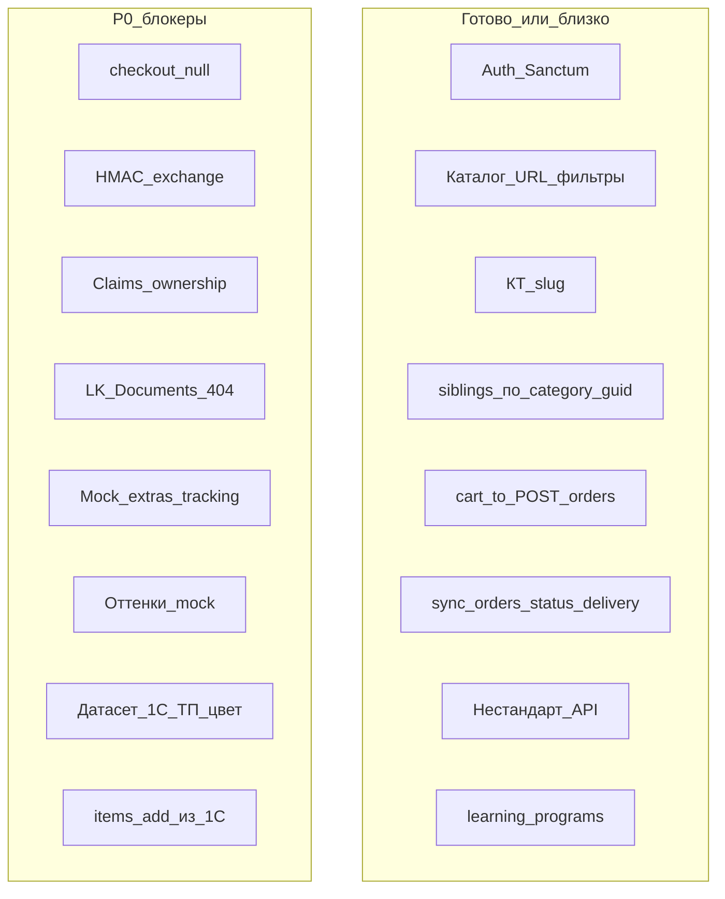

# Аудит документации и готовности — 2026-08-27

**Роль:** агент-аудитор (целостность артефактов) + сверка кодовой базы.  
**Снимок кода:** [gitlab.com/nutnet/palizh](https://gitlab.com/nutnet/palizh) `main` @ **`8c775db`** (2026-08-27, `refs #87173, sibling products`).  
**Предыдущий аудит:** [`Аудит_документации_2026-08-25.md`](Аудит_документации_2026-08-25.md) (`f3a54a6`, 2026-08-25).  
**Сводка готовности + расшифровка блокеров (что сделать):** [`Аудит/Аудит_готовности_2026-08-27.md`](Аудит/Аудит_готовности_2026-08-27.md).  
**Метод:** docs — ЧТЗ / Техчасть / Инфарх / саммари / задание состава; код — `git fetch gitlab` + `git show` / `git grep` по `gitlab/main`.  
**Правки в артефакты не вносились** — только отчёт и рекомендации.

**Канон сверки (заказчик, 2026-08-27):**

1. **Сборники** — убраны из каталога (повтор / новый заказ — история ЛК / нестандарт).
2. **Цвет** — характеристики **в товаре** (не «только hex-атрибут» и не UX «только сборники»).
3. **Группировка КТ** — категория **нижнего уровня = торговое предложение (ТП)**; внутри — варианты (цвет, масса).
4. После `post_orders` менеджер в 1С может менять состав → inbound в платформу / ЛК ([`Задание_sync_order_items_изменение_состава.md`](Техническая%20часть/Задание_sync_order_items_изменение_состава.md)).

**Связанные саммари:** [`2026-08-21_встреча_по_цветам_саммари.md`](Интервью%20и%20встречи/Саммари/2026-08-21_встреча_по_цветам_саммари.md) — **частично перекрыто** каноном 27.08 (см. §3).

---

## 1. Краткое видение проекта

B2B-платформа **palizh.com** (Палиж / «Новый дом»): витрина без цен для гостя, ЛК с персональными ценами / заказами / документами, админка контента; мастер-система каталога, цен, статусов и документов — **1С**.

Контур MVP закрыт ЧТЗ **01–14**. ЭДО, ТК-виджеты, мобильное — post-MVP.

**Вердикт на 27.08:** с 25.08 код продвинулся по **siblings** (`category_guid` = ТП в OpenAPI) и UX каталога/корзины; **P0 демо-ловушки** (`'null'`, claims ownership, HMAC, Документы, моки) **не закрыты**. Главный разрыв целостности — **трёхслойная модель каталога** (ЧТЗ июль / саммари 21.08 / канон 27.08) плюс **неполный** inbound состава заказа (qty/delete есть, **add нет**; в аналитике hooks — нет секции).

---

## 2. Степень готовности (код vs 25.08)

| Слой | 25.08 | **27.08** | Δ |
|------|-------|-----------|---|
| **Backend** | ~88–92% | **~88–91%** | ↑ siblings по `category_guid`; состав `sync.orders` без add; HMAC/claims/list docs открыты |
| **Frontend** | ~82–87% | **~80–85%** | ↑ toast/корзина/КТ UX; ↓ vs канон 27.08: оттенки=mock, siblings не в UI, Документы 404, `'null'` |
| **1С** | ~52–60% | **~50–58%** | Leaf=ТП / цвет-характеристика / E2E состава не подтверждены; датасет под старую модель |
| **E2E** | ~55–65% | **~52–62%** | Без живого среза ТП+цвета и полного replace items |
| **Документация** | ~88–90% | **~82–86%** | Три слоя модели цвета; hooks аналитики без `sync.orders` |

**Коммиты с `f3a54a6` → `8c775db`:** toast корзины (`87181`), UX каталог/КТ/корзина (`87169`), **sibling products** (`87173`). P0 от 25.08 по коду **не трогались**.

---

## 3. Канон 27.08 vs саммари 21.08 vs ЧТЗ

| Тема | ЧТЗ / техмодель (as-is docs) | Саммари 21.08 | **Канон 27.08 (аудит)** |
|------|------------------------------|---------------|-------------------------|
| Сборники | Dual 95%/5%, в каталоге/нормализации | **Вне каталога** | **Вне каталога** (совпадает с 21.08) |
| Цвет | Характеристика **типа** / справочник; HEX на характеристике | Атрибуты `color`/`hex` на номенклатуре | **Характеристики в товаре** |
| Группировка КТ | Не описана / «один SKU» | Поле «наименование ТП» | **Leaf-категория = ТП** |
| Варианты | Фасовка = `ProductTypeCharacteristic` | Цвет + фасовка в группе ТП | Цвет + масса внутри ТП |
| Состав заказа из 1С | Задание-черновик; ЧТЗ слабо | — | Нужен полный sync в ЛК |

**Вывод:** саммари 21.08 **устарело** по ключу группировки и источнику цвета; ЧТЗ 06 §4.2.5 «закрыто 17.07» — **ложное закрытие** относительно канона 27.08. Код siblings уже формулирует ТП через `category_guid` — это **в сторону** канона 27.08.

---

## 4. Проверка целостности ЧТЗ / техчасти

| Файл | Статус | Комментарий |
|------|--------|-------------|
| **06** витрина | **Противоречия** | §4.2.5 / §4.3: нет leaf=ТП, нет отказа от сборников, нет UX цвет+масса в группе |
| **12** админка | Нужно дополнить | §4.2.1 membership «характеристика типа → группа» устареет; SEO §4.2.3 — ок |
| **Глоссарий** | **Противоречия** | Нет ТП / сборник-вне-каталога; «цвет = характеристика» без «в товаре» |
| **Модель_данных…** | **Противоречия** | Dual 95%/5% сборники; нет leaf=ТП |
| **01 / 08 / 09** | Нужно дополнить | Изменение заказа вне ЛК есть; inbound состава в to-be не зафиксирован |
| **Чеклист orders** | Нужно дополнить | Нет секции состава; блокеры частично устарели |
| **входящие/incoming-hooks.md** (аналитика) | **Отставание** | Нет `sync.orders` (в GitLab `docs/` — есть) |
| **Задание sync order items** | Черновик | Имя `sync.order-items` vs код/GitLab docs `sync.orders` |
| **Реестр открытых вопросов** | Устарело | Нет строк по канону 27.08 |
| **Инфарх КТ** | Нужно дополнить | Нет UX «ТП → цвет → масса» |

---

## 5. Матрица: код @ `8c775db` ↔ новая модель

| Ожидание | Код | Вердикт |
|----------|-----|---------|
| Сборники вне каталога | Marketing `GET /collections` + Filament + `SectionCards` **живы** (CMS главной ≠ товарные сборники). Отдельного фильтра «скрыть товарные сборники» нет | **PARTIAL** — не путать сущности; продуктовый выхлоп сборников не вычищен явно |
| Цвет = характеристика в товаре | FE: `mockColorGroups` / `mockShadePalette`. BE: `characteristics` = фасовка/вариант цены-остатка; `attributes` = динамика 1С. Явного color→UI нет | **OPEN** |
| ТП = leaf category | `Product::siblings()` = `hasMany` по `category_guid`. OpenAPI: «то же ТП / тот же `category_guid`». FE **не использует** `siblings` | **PARTIAL** (BE да, FE нет) |
| Состав из 1С | `sync.orders` → `SyncOrderJob::syncItems`: update qty, delete missing; **новые позиции — warning skip** | **PARTIAL** |
| Статусы / delivery | `sync.orders` обновляет status + deliveryInfo | **OK** (код); E2E с 1С — UNKNOWN |

### Evidence (ключевое)

| Тема | Путь / факт |
|------|-------------|
| Checkout `'null'` | `frontend/app/pages/order.vue` L48–49 |
| Claims ownership | `CreateClaimRequest::authorize() = true`; `ClaimService::create` без проверки counterparty заказа |
| HMAC `/exchange` | `ExchangeController` — event → factory → 202, без подписи |
| Документы ЛК | Меню → `/account/documents`; страницы `documents.vue` **нет** |
| List documents | `DocumentService::paginateForCounterparty` **без** `where counterparty_id` |
| Моки заказа | `orders/[id].vue` → `getMockOrderExtras()`, `mock-tracking-desktop` |
| Оттенки | `FilterPanel.vue`, `Options.vue`, `ProductCard.vue` — mocks |
| Items add | `SyncOrderJob` — «unknown order item, skipped» |
| Siblings FE | `git grep siblings frontend` — пусто |
| Hooks аналитика | `входящие/incoming-hooks.md` — нет `sync.orders`; GitLab `docs/incoming-hooks.md` — есть |

---

## 6. Блокеры по слоям

### FE

| Pri | ID | Блокер |
|-----|-----|--------|
| **P0** | D12 | Checkout: `date`/`comment` = `'null'` |
| **P0** | M404 | «Документы» → 404 |
| **P0** | F5 | Моки extras/tracking вместо API `deliveryInfo` |
| **P0** | COLOR-FE | Оттенки/палитра = mock; siblings не подключены к КТ |
| **P1** | SEO-FE | SEO каталога (ЧТЗ 06/12) не в UI / полях Category–Product |

### BE

| Pri | ID | Блокер |
|-----|-----|--------|
| **P0** | B7 | Claims без ownership counterparty |
| **P0** | B4 | Нет HMAC / allowlist на `/exchange` |
| **P0** | DOC-LIST | List documents без filter по counterparty |
| **P1** | ITEMS+ | `sync.orders` items: не создаёт новые строки |
| **P1** | SIBLINGS | BE готов; нужна сверка leaf=ТП с данными 1С + FE |
| **P1** | COLL | CMS collections ≠ сборники; продуктовые сборники не исключены явно из каталога |
| **P1** | HOOKS | Аналитика `incoming-hooks` без `sync.orders` (синк с GitLab) |

### 1С

| Pri | ID | Блокер |
|-----|-----|--------|
| **P0** | 1C-TP | Выгрузка leaf-категорий как ТП + варианты цвет/масса |
| **P0** | 1C-COLOR | Цвет как характеристика **в товаре** в обмене |
| **P0** | 1C-E2E | E2E `post_orders` + push `sync.orders` (status/items) |
| **P1** | 1C-ITEMS | Полный snapshot состава (в т.ч. add); согласовать имя event с кодом |

### Аналитика / процесс

| Pri | ID | Блокер |
|-----|-----|--------|
| **P0** | COLOR-DOC | Проставить канон 27.08 в ЧТЗ 06 / глоссарий / модель данных / реестр |
| **P0** | ITEMS-DOC | Зафиксировать контракт состава (`sync.orders` vs задание) в hooks + чеклист + ЧТЗ 01/08/09 |

---

## 7. Реестр открытых вопросов (аудит)

**Не отражено в реестре:** канон 27.08 (leaf=ТП, цвет в товаре, сборники вне каталога); имя inbound состава; политика add/replace/claims.

**Критичные открытые (MVP, наследие):** 18, 36, 37, 40, 47–50, 54, 56 (+ 30, 34, 26, 43).

**Добавить в реестр после согласования:**

1. Код/структура leaf-категории = ТП в `sync.categories` / `sync.products`.
2. Где лежит цвет: `product-type-characteristics` vs attributes vs оба.
3. Строка корзины / `post_orders`: `productGuid` + `productCharacteristicGuid` (масса) при цвете на товаре.
4. Сборники: полная невидимость в поиске vs только «нет в корзину».
5. Имя event: `sync.orders` (код) vs `sync.order-items` (задание).
6. SEO «цвет внутри ТП» — не нужен (пока достаточно категории).

---

## 8. Инфарх vs канон

| Тема | Вердикт |
|------|---------|
| Фильтры + SEO листингов | Ссылки на §4.2.6 — ок |
| Группы оттенков | Согласованы со **старой** §4.2.5 |
| ТП / цвет+масса / сборники вне витрины | **Нет** в Инфархе |
| Документы в ЛК | В дереве есть; в коде UI нет |

---

## 9. Демо: можно / нельзя

**Можно показывать:** каталог + URL-фильтры, КТ `/catalog/{slug}`, поиск, auth, корзина→заказ (с оговоркой `'null'`), претензия happy path (свой заказ), обучение, нестандарт create, toast add-to-cart; потенциально live-status если 1С шлёт `sync.orders` (трек/доки в UI — нет).

**Не обещать / не кликать:** Документы ЛК; чужая претензия; live-трек/доки заказа (моки); фильтр оттенков как продукт; siblings UX (цвета/фасовки из ТП); SEO-landings каталога из админки; полный replace состава из 1С (add); товарные сборники в каталоге как целевая модель.

---

## 10. План изменений (to-do) — без правок в этом аудите

### Критично

1. **Аналитика:** канон 27.08 → ЧТЗ 06 (§4.2.5, §4.3), Глоссарий, `Модель_данных…`, реестр; пометить саммари 21.08 (ключ ТП / цвет).
2. **FE:** убрать `'null'`; страница или снятие «Документы»; моки extras/tracking; подключить `siblings` + реальный цвет.
3. **BE:** ownership claims; HMAC `/exchange`; filter list documents; **ITEMS+** (создание строк из inbound).
4. **1С:** датасет leaf=ТП + цвет-характеристика; E2E `post_orders` + `sync.orders`.
5. Синхронизировать **`входящие/incoming-hooks.md`** с GitLab; согласовать имя event состава.

### Важно

6. Инфарх — UX ТП → цвет → масса; сборники вне витрины.
7. ЧТЗ 01/08/09 — to-be: ЛК отражает состав после правок в 1С.
8. Задание `sync_order_items` → статус «согласовано» под фактический `sync.orders`.
9. SEO каталога — merge / OpenAPI под §4.2.6.
10. Enum статусов 6 vs 7; consent ПДн.

### Можно позже

11. Post-MVP: SEO landings по оттенкам; образец служебной записки; вычистка/переименование CMS `collections` если путает команду.

---

## 11. Ограничения сверки

- Нет локального checkout кода продукта — только дерево `gitlab/main` после fetch.
- Стенд 1С / прогон датасета эмпирически не проверялись.
- Отчёт **не правит** документы; исполнение — аналитик / FE / BE / 1С по приоритетам выше.
