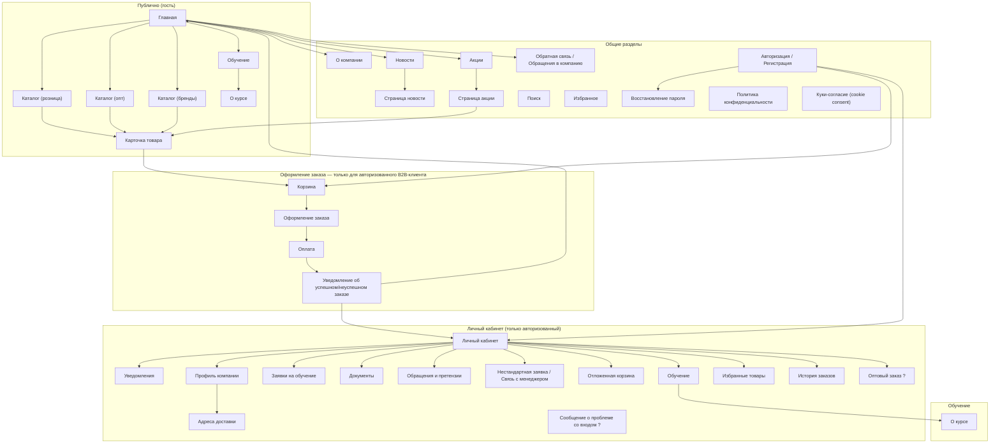
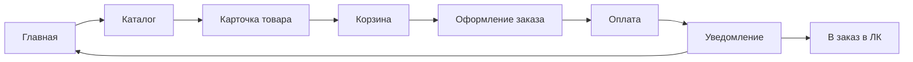

# Palizh — информационная архитектура

B2B-платформа для оформления и управления заказами. Состав страниц, вкладок и основные потоки навигации.

**Ограничения платформы (по текущему пониманию):**

- **Только B2B:** на платформе работают только юрлица (ИП, ООО и т.д.) с заключённым договором. Физлица без юрлица (полноценный B2C) не предусмотрены.
- **Заказ только для авторизованного пользователя:** оформить заказ (корзина → оформление → оплата) может только пользователь, вошедший в систему и имеющий одобренный доступ к ЛК (контрагент заведён в 1С, договор подписан). Гость видит витрину и каталог без цен, но не может оформить заказ.
- **Различие каталогов — не B2C vs B2B:** каталоги «розница», «опт», «по брендам» — это разные представления ассортимента для одного типа клиента (B2B). Внутри компании есть направления B2C и B2B (разные менеджеры, сегменты: магазины/дилеры vs промышленность/дистрибьюторы), но сама площадка на старте — только B2B (юрлица с договором). Для B2B-клиента приоритет — быстрый переход к действиям (корзина, заказ), а не маркетинговый лендинг.

## Условные обозначения

| Тип | Описание |
| --- | -------- |
| **Страница/Вкладка** | Обычный узел — страница или вкладка в интерфейсе |
| **Вопрос/Предложение** | Требует уточнения или решение не принято (в диаграмме помечено «?») |
| **Комментарий** | Пояснение к странице или функции — вынесены в список ниже диаграммы |

---

## Диаграмма структуры

---

## Поток заказа (упрощённо)

Заказ доступен **только авторизованному B2B-клиенту** (юрлицо с одобренным доступом). Гость может просматривать главную и каталоги без цен; при попытке добавить в корзину или перейти к оформлению — требуется вход (или редирект на авторизацию / `Стать клиентом`).

*Кросс-платформенное переключение между каталогами (розница / опт / бренды) — разные представления ассортимента для одного типа клиента (B2B), не разделение B2C/B2B.*

---

## Комментарии и пояснения к страницам

- **Платформа B2B:** только юрлица с договором; заказ (корзина, оформление, оплата) — только после авторизации и одобрения доступа к ЛК.
- **Главная:** функция переключения языка; витрина; форма обращений; **баннерная зона** (новинки, акции, обучающие мероприятия), новости, о компании. Для B2B-клиента приоритет — быстрый переход к каталогу и заказу, при этом баннеры используются для маркетинговых анонсов.
- **Каталоги (розница / опт / бренды):** разные представления ассортимента (категории, цены), не типы пользователей; переключение между каталогами без потери контекста. Для авторизованного клиента — персональные цены и наличие. Требуется поиск с учётом свойств/материалов (например, «для полиуретана») — см. ЧТЗ 11. Архивные / снятые с производства товары с нулевым остатком могут быть скрыты из активной витрины, но не должны теряться из истории заказов.
- **Новости:** лента новостей и анонсов; часть материалов (статьи, подробные методички) остаётся на основном сайте Palizh, на платформе даются анонсы + ссылки.
- **Акции:** список текущих акций; переход со страницы акции к товарам каталога (кнопка «Смотреть товар»). Баннеры на главной ведут на конкретную страницу акции.
- **Обратная связь / Обращения в компанию:** формы общих обращений (витрина).
- ~~Вопрос/Ответ~~: отдельный раздел не делаем (решено); ~~Онлайн-консультант~~: не предусмотрен (решено). Сценарии вопросов уходят в чат с менеджером по сопровождению и встроенные подсказки по месту.
- **Обращения и претензии (ЛК):** единый раздел — общие обращения (простая форма) и претензии (расширенная форма: тип, привязка к заказу/накладной, позиции, фото/видео/документы); типизация при создании. В MVP претензия создаётся со статусом `Отправлена` (ЧТЗ 04). Подробная форма — см. `Техническая часть/Форма_претензии_UI_API.md`. Обращение уходит **менеджеру по сопровождению** (единый канал; онлайн-консультанта нет — см. ЧТЗ 10).
- **Адреса доставки (ЛК):** список адресов доставки, добавление/редактирование; подраздел «Профиля компании» или отдельная вкладка (в Figma — отдельный экран).
- **Восстановление пароля:** экран для сброса пароля (email → ссылка для сброса); вспомогательный подэкран авторизации.
- **Куки-согласие (cookie consent):** модальное окно / плашка с кнопками «Принять», «Настроить», «Отклонить»; обязателен по 152-ФЗ.
- **Обучение (публично):** витрина обучений (включая колористику) доступна гостю; при попытке «Оставить заявку» — барьер входа/авторизация.
- **Личный кабинет → Обучение → О курсе:** карточки, создаваемые в админке; основной сценарий — **заявка менеджеру** (email‑маршрутизация по типам в админке), обработка заявки вне платформы.
- **Личный кабинет → Заявки на обучение:** история отправленных заявок со статусом `Отправлено` (статус не меняется, синхронизации с 1С нет).
- **Нестандартная заявка / Связь с менеджером:** форма в ЛК — тип (колеровка, оборудование), суть запроса, прикрепление файлов (PDF, Excel, Word); менеджер ведёт в 1С; статусы — сокращённый набор (ЧТЗ 01).
- **Отложенная корзина:** хранение выбранных позиций на будущий срок.
- **Профиль компании:** информация о компании.
- **Избранные товары:** доступ и из ЛК, и из шапки сайта.
- **История заказов:** возможность повторить заказ. Повтор заказа работает по актуальной номенклатуре из `1С`: доступные позиции добавляются в корзину, а архивные / недоступные позиции показываются пользователю отдельным списком как не добавленные.

---

## Вопросы / предложения (требуют решений)

1. ~~Вопрос/Ответ / FAQ~~ — принято решение не делать отдельный раздел; опора на встроенные подсказки и чат (чат‑бот/чат с менеджером) по месту действия.
2. **Сообщение о проблеме со входом** — куда ведёт, куда уходит обращение.
3. **Оптовый заказ:** где формируется прайс-лист? Или это скачивание прайс-листа с этой вкладки?
4. **Главная и баннеры:** нужна ли сегментация баннеров/акций по типу клиента; кто наполняет и через какой инструмент (админка платформы, 1С и т.д.).
5. **Обучение (хвосты после ЧТЗ 14 / интервью 2026-03-24):** модель карточки в выгрузке из 1С (несколько SKU vs варианты); календарь/афиша и источник дат. Виджет на карточке товара и MVP‑подход «карточки в админке + заявка на email + история заявок в ЛК со статусом `Отправлено`» — зафиксированы; экскурсии/вебинары допускаются как карточки контента.
6. **Архивная номенклатура:** каким именно признаком `1С` передаёт архивность / снятие с производства / пометку на удаление, чтобы витрина и `повтор заказа` работали единообразно.

---

## Связь с ЧТЗ

Описание требований к разделам сайта — в соответствующих ЧТЗ. Сводка:

| Область | ЧТЗ |
| ------- | --- |
| Витрина, каталог, карточка товара, поиск | [06 Витрина и каталог](../ЧТЗ/06_витрина_каталог.md), [11 Поиск](../ЧТЗ/11_поиск.md) |
| Корзина, оформление, оплата | [01 Процесс оформления заказа](../ЧТЗ/01_процесс_оформления_заказа.md), [03 Доставка](../ЧТЗ/03_доставка.md) |
| Авторизация, «Стать клиентом» | [05 Регистрация и онбординг](../ЧТЗ/05_регистрация_онбординг.md) |
| ЛК: профиль, заказы, документы, уведомления, претензии | [07](../ЧТЗ/07_ЛК_профиль_компания.md), [08](../ЧТЗ/08_ЛК_заказы_статусы.md), [02](../ЧТЗ/02_документооборот.md), [10](../ЧТЗ/10_уведомления.md), [04](../ЧТЗ/04_претензии.md) |
| ЛК: обучение | [14 Обучение и Академия Palizh](../ЧТЗ/14_обучение_академия.md) |
| Админка, контент | [12 Система управления](../ЧТЗ/12_система_управления.md) |
| Нефункциональные требования (безопасность, SLA, 152-ФЗ) | [13 Нефункциональные требования](../ЧТЗ/13_нефункциональные_требования.md) |

**Дополнительные артефакты в папке Инфарх:**

- [Видение и границы сайта](видение-и-границы.md) — цель, аудитория, scope и вне scope.
- [Состав и задачи страниц](состав-и-задачи-страниц.md) — таблицы по страницам/разделам, ключевые элементы, открытые вопросы.
- [Структура страниц (визуализация)](структура-страниц.md) — дерево страниц (sitemap), зоны доступа (гость / клиент), поток заказа.
- [Обучение и образовательные активности](обучение-и-образовательные-активности.md) — типы обучающих форматов, точки входа, структура раздела «Обучение».
- [Замечания по макету Figma](замечания_по_макету_инфарх.md) — расхождения между Figma (Карта сайта) и документацией инфарха; реестр экранов, вопросы к продукту.

---

*Диаграмма собрана по схеме структуры сайта. Папка **Инфарх** — для хранения и обновления информационной архитектуры проекта.*
