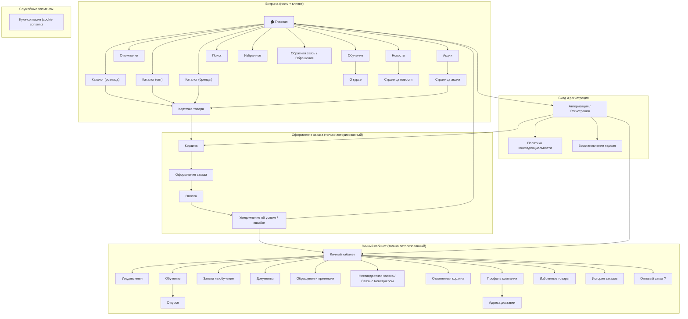
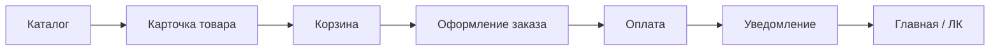

# Структура страниц сайта (визуализация)

Визуализация информационной архитектуры Palizh B2B: дерево страниц и зоны доступа. Источник данных — [информационная-архитектура.md](информационная-архитектура.md) и [состав-и-задачи-страниц.md](состав-и-задачи-страниц.md).

---

## 1. Дерево страниц (sitemap)

Иерархия от точки входа: главная → разделы → подстраницы. Оформление заказа и ЛК доступны только авторизованному B2B-клиенту.

*«?» — страницы/функции с открытыми вопросами.*

---

## 2. Зоны доступа

Кто что видит: гость (публично) vs авторизованный B2B-клиент.

```mermaid
flowchart LR
    subgraph Публично["Публично (гость)"]
        direction TB
        G1[Главная]
        G2[Каталоги: розница, опт, бренды]
        G3[Карточка товара]
        G8[Обучение]
        G4[О компании, Новости, Акции]
        G5[Поиск, Избранное]
        G6[Обратная связь]
        G7[Авторизация / Регистрация]
    end

    subgraph Только_клиент["Только авторизованный B2B-клиент"]
        direction TB
        C1[Корзина]
        C2[Оформление заказа]
        C3[Оплата]
        C4[Личный кабинет]
        C5[История заказов, Документы]
        C6[Профиль компании, Адреса доставки]
        C7[Обращения и претензии]
        C8[Отложенная корзина, Обучение, Заявки на обучение]
    end

    Публично --> |"Вход"| Только_клиент
```

---

## 3. Поток заказа (линейно)

От каталога до уведомления — только для вошедшего пользователя.

---

## Связь с документами

| Документ | Содержание |
| -------- | ---------- |
| [информационная-архитектура.md](информационная-архитектура.md) | Полная диаграмма, ограничения платформы, комментарии к страницам |
| [состав-и-задачи-страниц.md](состав-и-задачи-страниц.md) | Таблицы: назначение страниц, ключевые элементы, ЧТЗ, открытые вопросы |
| [видение-и-границы.md](видение-и-границы.md) | Цель сайта, аудитория, scope и вне scope |
