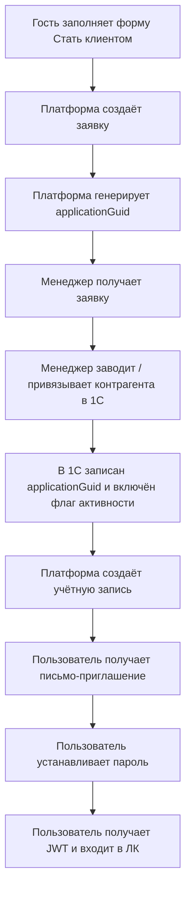

# OpenAPI MVP: Auth And Onboarding

Рабочий артефакт для фиксации `MVP`-контракта по онбордингу, приглашению в ЛК и базовой авторизации.

Этот документ является человекочитаемым пояснением к `OpenAPI`-файлу `openapi_mvp.yaml` и ограничен только блоками:

- заявка `Стать клиентом`;
- приглашение и первичная установка пароля;
- авторизация по `JWT`;
- восстановление пароля;
- базовый профиль текущего пользователя;
- получение краткого профиля компании.

---

## 1. Базовые решения

- Авторизация фронтенда и мобильного клиента строится на `JWT Bearer`.
- Публичная самозаявка клиента доступна без авторизации.
- При отправке заявки платформа генерирует `GUID` заявки.
- На `MVP` платформа не создаёт контрагента в `1С` автоматически.
- Менеджер вручную заводит / привязывает контрагента в `1С`, записывает `GUID заявки` в карточку контрагента и включает признак активности.
- После этого платформа создаёт учётную запись и отправляет письмо-приглашение на email из заявки.
- Вход в ЛК доступен по `email + password`.

---

## 2. Scope MVP

### 2.1 Входит в текущий контракт

- `POST /public/client-applications`
- `POST /auth/invitations/accept`
- `POST /auth/login`
- `POST /auth/refresh`
- `POST /auth/logout`
- `POST /auth/password/forgot`
- `POST /auth/password/reset`
- `GET /me`
- `PATCH /me`
- `PATCH /me/password`
- `GET /me/company`

### 2.2 Пока не включено в базовый MVP

- публичный просмотр статуса заявки `Стать клиентом` по `GUID`;
- самообслуживание по повторной отправке приглашения;
- автоодобрение клиента без менеджера;
- административное изменение договора / соглашения / условий оплаты через платформу;
- полноценное управление пользователями компании внутри этого контракта.

---

## 3. Канонический пользовательский поток

---

## 4. Контракт по состояниям

### 4.1 Заявка `Стать клиентом`

| Поле / сущность | Решение MVP |
| --------------- | ----------- |
| Тип заявки | Только `B2B` / юрлицо |
| Обязательные поля | `companyName`, `inn`, `kpp`, `contactName`, `email`, `phone` |
| Внешний ID | `applicationGuid` |
| Клиентский ответ после подачи | `submitted` |
| Источник одобрения | `1С` через связку `applicationGuid + isActiveForPlatform` |

### 4.2 Учётная запись

| Поле / сущность | Решение MVP |
| --------------- | ----------- |
| Логин | `email` из заявки |
| Тип авторизации | `JWT Bearer` |
| Создание учётной записи | После подтверждённой активации в `1С` |
| Первичная установка пароля | По токену приглашения |
| Сброс пароля | По email |

---

## 5. Endpoint matrix

| Метод и path | Назначение | Auth | Комментарий |
| ------------ | ---------- | ---- | ----------- |
| `POST /public/client-applications` | Подать заявку `Стать клиентом` | Нет | Публичный endpoint |
| `POST /auth/invitations/accept` | Установить пароль по приглашению и сразу войти | Нет | Используется после активации заявки |
| `POST /auth/login` | Вход по email и паролю | Нет | Возвращает `accessToken` и `refreshToken` |
| `POST /auth/refresh` | Обновить access token | Нет | Работает по refresh token |
| `POST /auth/logout` | Завершить текущую сессию | Да | Инвалидирует refresh token / сессию |
| `POST /auth/password/forgot` | Запросить восстановление пароля | Нет | Отправляет письмо |
| `POST /auth/password/reset` | Сбросить пароль по reset token | Нет | Новый пароль |
| `GET /me` | Получить профиль текущего пользователя | Да | Базовый профиль |
| `PATCH /me` | Обновить профиль текущего пользователя | Да | `fullName`, `phone`, `email` |
| `PATCH /me/password` | Сменить пароль из ЛК | Да | По старому паролю |
| `GET /me/company` | Получить профиль компании текущего пользователя | Да | Только чтение, данные из `1С` |

---

## 6. Базовые схемы данных

### 6.1 ClientApplicationCreateRequest

| Поле | Тип | Обязательно | Комментарий |
| ---- | --- | ----------- | ----------- |
| `companyName` | `string` | Да | Наименование юрлица / ИП |
| `inn` | `string` | Да | ИНН |
| `kpp` | `string` | Да | КПП |
| `contactName` | `string` | Да | Контактное лицо |
| `email` | `string(email)` | Да | Будущий login |
| `phone` | `string` | Да | Контактный телефон |
| `comment` | `string` | Нет | Комментарий к заявке |

### 6.2 ClientApplicationCreateResponse

| Поле | Тип | Комментарий |
| ---- | --- | ----------- |
| `applicationGuid` | `string(uuid)` | ID заявки |
| `status` | `string` | Для `MVP`: `submitted` |
| `message` | `string` | Человекочитаемое подтверждение |

### 6.3 AuthTokenPair

| Поле | Тип | Комментарий |
| ---- | --- | ----------- |
| `tokenType` | `string` | Для `MVP`: `Bearer` |
| `accessToken` | `string` | JWT access token |
| `refreshToken` | `string` | Refresh token |
| `expiresIn` | `integer` | TTL access token в секундах |

### 6.4 MeResponse

| Поле | Тип | Комментарий |
| ---- | --- | ----------- |
| `id` | `string(uuid)` | ID пользователя платформы |
| `email` | `string(email)` | Login пользователя |
| `fullName` | `string` | ФИО |
| `phone` | `string` | Телефон |
| `role` | `string` | Роль внутри ЛК компании |
| `companyId` | `string(uuid)` | ID компании на платформе |
| `companyName` | `string` | Наименование компании |

### 6.5 CompanySummaryResponse

| Поле | Тип | Комментарий |
| ---- | --- | ----------- |
| `id` | `string(uuid)` | ID компании на платформе |
| `counterpartyGuid` | `string` | ID контрагента в `1С` |
| `name` | `string` | Наименование |
| `inn` | `string` | ИНН |
| `kpp` | `string` | КПП |
| `legalAddress` | `string` | Юр. адрес |
| `paymentTerms` | `object` | Отображаемые условия из `1С` |
| `isActiveForPlatform` | `boolean` | Признак активности |

---

## 7. Security model

### 7.1 JWT

- Все приватные endpoint'ы используют `Authorization: Bearer <token>`.
- `accessToken` короткоживущий.
- `refreshToken` используется для перевыпуска токена.
- Конкретные TTL и стратегия ротации ещё должны быть подтверждены с backend-командой.

### 7.2 Password flows

- Первичная установка пароля: токен приглашения.
- Восстановление пароля: токен сброса пароля.
- Смена пароля из ЛК: `oldPassword + newPassword`.

---

## 8. Ошибки и коды ответов

| Код | Когда используется |
| --- | ------------------ |
| `200` | Успешное чтение / успешная операция без создания |
| `201` | Успешное создание заявки |
| `204` | Успешный logout без тела |
| `400` | Некорректный payload / токен невалиден |
| `401` | Ошибка авторизации |
| `403` | Доступ запрещён / пользователь неактивен |
| `404` | Объект не найден |
| `409` | Конфликт, например дубль активной заявки / email |
| `422` | Ошибка валидации полей |

---

## 9. Вопросы, которые остаются открытыми

| Вопрос | Влияние на API |
| ------ | -------------- |
| Нужен ли публичный endpoint проверки статуса заявки | Может добавить `GET /public/client-applications/{applicationGuid}` |
| Как обрабатывать повторную заявку с тем же `ИНН/КПП` или `email` | Влияет на `409` / правила дедупликации |
| Разрешено ли менять `email` из профиля без отдельного подтверждения | Влияет на `PATCH /me` |
| Какой точный набор ролей пользователя компании будет отдаваться в `auth/me` | Влияет на enum `role` |
| Нужна ли отдельная endpoint-проверка валидности invitation token | Может добавить `GET /auth/invitations/{token}` |

---

## 10. Связанные документы

- `ЧТЗ/05_регистрация_онбординг.md`
- `ЧТЗ/07_ЛК_профиль_компания.md`
- `ЧТЗ/09_интеграция_1С.md`
- `Техническая часть/Архитектура_платформы.md`
- `Техническая часть/1С_contract_matrix.md`
- `Техническая часть/openapi_mvp.yaml`
