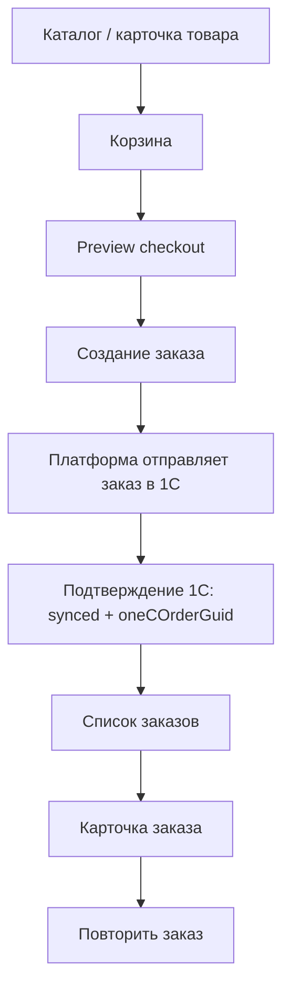

# OpenAPI MVP: Cart Checkout Orders

Рабочий артефакт для фиксации `MVP`-контракта по корзине, оформлению заказа и разделу `Заказы` в ЛК.

Этот документ описывает API-слой для:

- текущей корзины пользователя;
- изменения состава корзины;
- preview перед оформлением;
- создания заказа;
- списка заказов;
- карточки заказа;
- сценария `Повторить заказ`.

---

## 1. Базовые решения

- Все endpoint'ы этого слоя доступны только авторизованному `B2B`-клиенту.
- Корзина хранится на платформе, но расчёт и значимые данные для заказа завязаны на данные из `1С`.
- Порог бесплатной доставки для `MVP` хранится как настройка платформы.
- При checkout платформа отправляет заказ в `1С` и хранит связь `platformOrderId <-> oneCOrderGuid` после успешной синхронизации; до этого `oneCOrderGuid` может быть `null`, а состояние обмена — в поле `integrationSyncState` (см. `order_lifecycle_contract.md` §5.2).
- В ЛК используется одна верхнеуровневая цепочка из `6` статусов заказа (маппинг из `1С`) **плюс** отдельное поле синхронизации с `1С`, без седьмого статуса в enum.
- Delivery-детали не создают отдельную шкалу статусов.
- `Repeat order` не копирует прошлый заказ слепо, а пытается добавить в корзину актуальные доступные позиции.

---

## 2. Scope MVP

### 2.1 Входит в контракт

- `GET /cart`
- `PUT /cart/items/{productId}`
- `DELETE /cart/items/{productId}`
- `POST /cart/clear`
- `POST /checkout/preview`
- `POST /orders`
- `GET /orders`
- `GET /orders/{orderId}`
- `POST /orders/{orderId}/repeat`

### 2.2 Пока не входит

- сохранённые корзины;
- промокоды;
- онлайн-оплата;
- редактирование уже созданного заказа;
- **отмена заказа клиентом через API / ЛК в MVP** — не входит; отмена или изменение заказа после оформления — **вне платформы** (менеджер, 1С) до отдельного решения post-MVP;
- **заказ через файл (Excel / прайс)** — относится к отдельному сценарию и не входит в MVP-контракт этого API-слоя; планируется как post-MVP;
- отдельные API для нестандартных заявок в этом слое.

---

## 3. Канонический пользовательский поток

---

## 4. Endpoint matrix

| Метод и path | Назначение | Auth | Комментарий |
| ------------ | ---------- | ---- | ----------- |
| `GET /cart` | Получить текущую корзину | Да | Возвращает позиции, суммы, предупреждения, delivery hint |
| `PUT /cart/items/{productId}` | Добавить / изменить количество позиции | Да | Upsert-сценарий |
| `DELETE /cart/items/{productId}` | Удалить позицию из корзины | Да | Полное удаление |
| `POST /cart/clear` | Очистить корзину | Да | Очистка всех позиций |
| `POST /checkout/preview` | Получить итоговый preview перед оформлением | Да | Проверка состава, условий, предупреждений |
| `POST /orders` | Создать заказ | Да | Создание заказа на платформе и отправка в `1С` |
| `GET /orders` | Получить историю заказов | Да | Список с фильтрами и пагинацией |
| `GET /orders/{orderId}` | Получить карточку заказа | Да | Статус, оплата, delivery-детали, документы |
| `POST /orders/{orderId}/repeat` | Повторить заказ | Да | Возвращает результат добавления в корзину |

---

## 5. Контракт по корзине

### 5.1 Что должно приходить в `GET /cart`

| Блок | Что возвращаем |
| ---- | -------------- |
| Позиции | товар, количество, единица, цена, сумма строки |
| Availability | остаток, срок производства / поступления, доступность к заказу |
| Totals | subtotal, итоговая сумма |
| Delivery hint | порог бесплатной доставки, сколько осталось добрать |
| Warnings | предупреждения по архивным / недоступным позициям, срокам, кратности |

### 5.2 Правила корзины

- Количество должно быть положительным числом.
- Если товар недоступен к заказу, API должно возвращать ошибку или предупреждение.
- Для авторизованного пользователя ценовой блок уже учитывает его контекст соглашения.
- Корзина является рабочим объектом платформы, но использует мастер-данные и availability из `1С`.

---

## 6. Контракт по checkout

### 6.1 Preview checkout

Preview нужен, чтобы до создания заказа вернуть:

- подтверждённый состав заказа;
- адрес / контакт доставки;
- условия оплаты;
- предупреждение по порогу доставки;
- сроки производства / доступности;
- итоговую сумму;
- набор blocking / non-blocking предупреждений.

### 6.2 Создание заказа

`POST /orders` должен:

- принять финальный payload заказа;
- создать объект заказа на платформе;
- инициировать доставку заказа в `1С` (синхронно или через очередь — по реализации);
- сохранить `requestId` / `platformOrderId`;
- выставить `integrationSyncState`: как минимум `pending` сразу после создания; после подтверждения из `1С` — `synced` и `oneCOrderGuid`; при ошибках — `failed` / `manual_review_required` по политике ЧТЗ 09;
- вернуть клиенту `201` с `OrderDetailResponse`, где шапка заказа отражает актуальные `status` и `integrationSyncState` (ответ **не** означает автоматически «уже в 1С», если `integrationSyncState` ещё `pending`).

---

## 7. Контракт по заказам

### 7.1 Список заказов

| Поле | Комментарий |
| ---- | ----------- |
| `id` | ID заказа платформы |
| `oneCOrderGuid` | ID заказа в `1С`, если уже известен |
| `integrationSyncState` | `pending` / `synced` / `failed` / `manual_review_required` |
| `lastSyncErrorCode`, `lastSyncErrorMessage`, `retryable` | Опционально, для UX и поддержки |
| `number` | Номер заказа |
| `createdAt` | Дата создания |
| `totalAmount` | Итоговая сумма |
| `paymentStatus` | `unpaid`, `partially_paid`, `paid` |
| `status` | Один из 6 статусов ЛК (смысл из `1С` при `integrationSyncState` = `synced`) |
| `deliverySummary` | Краткая информация по доставке |

### 7.2 Карточка заказа

| Блок | Что должно быть в ответе |
| ---- | ------------------------ |
| Header | ID, номер, дата, статус |
| Positions | список товаров, количество, цена |
| Totals | суммы заказа |
| Payment | режим оплаты, срок оплаты, статус оплаты |
| Delivery | способ доставки, дата / слот, трек, водитель, delivery-детали |
| Documents | ссылки / метаданные документов |
| Repeat availability | можно ли повторить заказ |

---

## 8. Каноническая модель статусов в API

| Статус API | Смысл |
| ---------- | ----- |
| `processing` | `Обрабатывается` |
| `in_production` | `В производство / производится` |
| `ready_for_picking` | `Готов к сборке` |
| `ready_to_ship` | `Готов к отгрузке` |
| `shipped` | `Отправлен` |
| `completed` | `Завершён` |

### 8.1 Принципы статусов

- Эти статусы приходят из согласованного маппинга событий `1С` и осмыслены при `integrationSyncState` = `synced`.
- Платформа не должна придумывать вторую клиентскую шкалу из шести фаз; состояние обмена с `1С` — отдельное поле (`integrationSyncState`).
- Delivery-детали возвращаются отдельным объектом внутри заказа.

---

## 9. Repeat order contract

### 9.1 Поведение `POST /orders/{orderId}/repeat`

Endpoint должен:

- загрузить позиции исторического заказа;
- сверить их с актуальной номенклатурой и availability;
- положить доступные позиции в текущую корзину;
- вернуть список:
  - добавленных позиций;
  - исключённых позиций;
  - причин исключения.

### 9.2 Причины исключения позиции

| Код | Смысл |
| --- | ----- |
| `archived_no_stock` | Архивная / снятая с производства позиция без остатка |
| `not_found` | Позиция больше не найдена в актуальном каталоге |
| `not_available_for_order` | Позиция есть, но сейчас недоступна к заказу |

---

## 10. Базовые схемы данных

### 10.1 CartResponse

| Поле | Тип | Комментарий |
| ---- | --- | ----------- |
| `items` | `array` | Позиции корзины |
| `totals` | `object` | Итоговые суммы |
| `deliveryHint` | `object` | Порог и предупреждение по доставке |
| `warnings` | `array` | Неблокирующие предупреждения |

### 10.2 CheckoutPreviewRequest

| Поле | Тип | Комментарий |
| ---- | --- | ----------- |
| `deliveryAddress` | `string` | Адрес доставки |
| `contactName` | `string` | Контактное лицо |
| `contactPhone` | `string` | Телефон |
| `comment` | `string` | Комментарий к заказу |

### 10.3 OrderCreateRequest

| Поле | Тип | Комментарий |
| ---- | --- | ----------- |
| `deliveryAddress` | `string` | Адрес доставки |
| `contactName` | `string` | Контакт |
| `contactPhone` | `string` | Телефон |
| `comment` | `string` | Комментарий |

### 10.4 OrderSummary

| Поле | Тип | Комментарий |
| ---- | --- | ----------- |
| `id` | `string` | ID заказа платформы |
| `oneCOrderGuid` | `string or null` | ID заказа в `1С` |
| `integrationSyncState` | `string` | См. `OrderIntegrationSyncState` в OpenAPI |
| `lastSyncErrorCode` | `string or null` | Код ошибки синхронизации |
| `lastSyncErrorMessage` | `string or null` | Безопасное сообщение |
| `retryable` | `boolean or null` | Будет ли автоповтор |
| `number` | `string` | Номер заказа |
| `status` | `string` | Один из 6 статусов |
| `paymentStatus` | `string` | Статус оплаты |
| `totalAmount` | `number` | Сумма заказа |
| `createdAt` | `string(date-time)` | Дата создания |

### 10.5 OrderDetailResponse

| Поле | Тип | Комментарий |
| ---- | --- | ----------- |
| `order` | `object` | Шапка заказа |
| `items` | `array` | Позиции |
| `totals` | `object` | Суммы |
| `payment` | `object` | Оплата |
| `delivery` | `object` | Delivery-детали |
| `documents` | `array` | Документы |
| `canRepeat` | `boolean` | Доступность repeat |

---

## 11. Открытые вопросы

| Вопрос | Влияние на API |
| ------ | -------------- |
| Нужен ли отдельный endpoint для удаления всех недоступных позиций из корзины | Может добавить отдельную cart action |
| Какой точный набор полей по delivery-деталям отдаётся уже в `MVP` | Влияет на `delivery` schema |
| Нужен ли отдельный endpoint для availability по позициям заказа | Может добавить order stock endpoint |
| Нужны ли фильтры списка заказов уже в первой версии API | Влияет на query params `GET /orders` |
| Какие предупреждения checkout являются блокирующими | Влияет на preview / order create error model |

---

## 12. Связанные документы

- `ЧТЗ/01_процесс_оформления_заказа.md`
- `ЧТЗ/08_ЛК_заказы_статусы.md`
- `Техническая часть/order_lifecycle_contract.md`
- `Техническая часть/document_delivery_contract.md`
- `Техническая часть/openapi_mvp.yaml`
