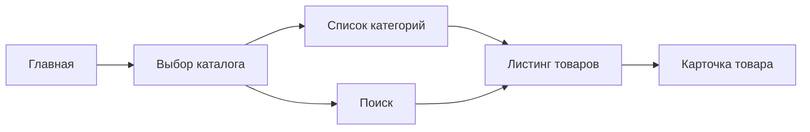

# OpenAPI MVP: Catalog And Product

Рабочий артефакт для фиксации `MVP`-контракта по публичному каталогу, карточке товара и базовому поиску по каталогу.

Этот документ описывает пользовательский и API-слой для:

- списка каталогов;
- дерева категорий;
- списка товаров;
- карточки товара;
- поисковой выдачи в каталоге.

---

## 1. Базовые решения

- Каталог и карточка товара доступны гостю и авторизованному пользователю.
- Для гостя цены **не отображаются**.
- Для авторизованного клиента в ответах могут приходить ценовые данные по его соглашению.
- Из `1С` на платформу приходят:
  - товары;
  - категории;
  - свойства;
  - остатки;
  - сроки производства / поступления;
  - состояние номенклатуры;
  - при наличии ссылка на маркетплейс.
- Платформа не является источником истины по ассортименту и ценам.

---

## 2. Scope MVP

### 2.1 Входит в контракт

- `GET /catalogs`
- `GET /catalogs/{catalogCode}/categories`
- `GET /catalogs/{catalogCode}/products`
- `GET /products/{productId}`
- `GET /search/products`

### 2.2 Не входит в этот слой

- корзина и `add to cart`;
- избранное;
- подбор аналогов;
- сложные рекомендации;
- редактирование контента каталога из API админки.

---

## 3. Канонический пользовательский поток

---

## 4. Endpoint matrix

| Метод и path | Назначение | Auth | Комментарий |
| ------------ | ---------- | ---- | ----------- |
| `GET /catalogs` | Получить список доступных каталогов | Нет / опционально | Публично доступны каталоги витрины |
| `GET /catalogs/{catalogCode}/categories` | Получить дерево категорий каталога | Нет / опционально | Для навигации и фильтров |
| `GET /catalogs/{catalogCode}/products` | Получить листинг товаров | Нет / опционально | С фильтрами, сортировкой, пагинацией |
| `GET /products/{productId}` | Получить карточку товара | Нет / опционально | Ценовой блок зависит от auth |
| `GET /search/products` | Поиск товаров по каталогу | Нет / опционально | По наименованию, артикулу, свойствам |

---

## 5. Контракт по видимости данных

### 5.1 Для гостя

| Блок | Поведение |
| ---- | --------- |
| Каталоги | Видны |
| Категории | Видны |
| Товары | Видны |
| Фото / описание / свойства | Видны |
| Остатки / сроки | Допустимы, если это разрешено бизнес-правилами |
| Цены | Не показываются |
| Marketplace link | Может показываться, если пришёл из `1С` |

### 5.2 Для авторизованного B2B-клиента

| Блок | Поведение |
| ---- | --------- |
| Каталоги | Видны |
| Категории | Видны |
| Товары | Видны |
| Фото / описание / свойства | Видны |
| Остатки / сроки | Видны |
| Цены | Приходят по соглашению / виду цены |
| Marketplace link | Может приходить, но основной сценарий для B2B — работа с карточкой товара |

---

## 6. Базовые схемы данных

### 6.1 CatalogSummary

| Поле | Тип | Комментарий |
| ---- | --- | ----------- |
| `code` | `string` | Уникальный код каталога |
| `name` | `string` | Название каталога |
| `isPublic` | `boolean` | Доступен ли гостю |
| `sortOrder` | `integer` | Порядок отображения |

### 6.2 CategoryNode

| Поле | Тип | Комментарий |
| ---- | --- | ----------- |
| `id` | `string` | ID категории |
| `parentId` | `string or null` | Родитель |
| `name` | `string` | Название |
| `slug` | `string` | URL slug |
| `children` | `array` | Дочерние категории |

### 6.3 ProductCardSummary

| Поле | Тип | Комментарий |
| ---- | --- | ----------- |
| `id` | `string` | ID товара платформы |
| `nomenclatureGuid` | `string` | ID товара в `1С` |
| `sku` | `string` | Артикул / код поиска |
| `name` | `string` | Наименование |
| `slug` | `string` | URL slug |
| `brand` | `string or null` | Бренд |
| `imageUrl` | `string or null` | Основное изображение |
| `isArchived` | `boolean` | Архивность / снятие с производства |
| `isAvailableForOrder` | `boolean` | Доступность к заказу |
| `stockQty` | `number or null` | Остаток |
| `productionLeadTime` | `string or null` | Срок производства / поступления |
| `marketplaceUrl` | `string or null` | Ссылка на маркетплейс |
| `price` | `object or null` | Только для авторизованного клиента |

### 6.4 ProductDetailResponse

| Поле | Тип | Комментарий |
| ---- | --- | ----------- |
| `id` | `string` | ID товара |
| `catalogs` | `array` | В каких каталогах участвует |
| `categories` | `array` | Категории товара |
| `name` | `string` | Наименование |
| `description` | `string or null` | Описание |
| `attributes` | `array` | Атрибуты товара |
| `images` | `array` | Галерея |
| `availability` | `object` | Остатки / сроки / доступность |
| `price` | `object or null` | Ценовой блок только для авторизованного |
| `marketplaceUrl` | `string or null` | Внешняя ссылка |

---

## 7. Query parameters

### 7.1 Для `GET /catalogs/{catalogCode}/products`

| Параметр | Тип | Назначение |
| -------- | --- | ---------- |
| `categoryId` | `string` | Фильтр по категории |
| `q` | `string` | Поиск по каталогу |
| `page` | `integer` | Страница |
| `perPage` | `integer` | Размер страницы |
| `sort` | `string` | Сортировка |
| `filters[...]` | `string/array` | Атрибутные фильтры |
| `includeArchived` | `boolean` | Для внутренних / специальных сценариев; по умолчанию `false` |

### 7.2 Для `GET /search/products`

| Параметр | Тип | Назначение |
| -------- | --- | ---------- |
| `q` | `string` | Поисковый запрос |
| `catalogCode` | `string` | Ограничение конкретным каталогом |
| `page` | `integer` | Страница |
| `perPage` | `integer` | Размер страницы |

---

## 8. Особые правила API

### 8.1 Архивная номенклатура

- Товар с архивным статусом и остатком `0` не должен попадать в обычную активную витрину.
- При этом связь с товаром не должна теряться на уровне ID и истории заказов.
- Для API полезно иметь два отдельных поля:
  - `isArchived`;
  - `isAvailableForOrder`.

### 8.2 Цены

- Для гостя поле `price` отсутствует или возвращается `null`.
- Для авторизованного пользователя поле `price` возвращается на основании вида цены / соглашения.
- В этом контракте цена ещё не моделирует корзинные пересчёты и скидки от количества, это следующий API-слой.

### 8.3 Marketplace link

- Поле `marketplaceUrl` опционально.
- Для гостя оно может быть основным CTA вместо покупки.
- Для авторизованного B2B-клиента это поле остаётся вспомогательным.

---

## 9. Открытые вопросы

| Вопрос | Влияние на API |
| ------ | -------------- |
| Какой точный состав атрибутов нужно возвращать в фильтры и карточку товара | Влияет на `attributes` и filter schema |
| Какой enum сортировок нужен в `MVP` | Влияет на `sort` |
| Нужно ли выделять отдельную endpoint для filter facets | Может добавить `GET /catalogs/{catalogCode}/filters` |
| Нужно ли возвращать гостю остатки и сроки во всех сценариях | Влияет на `availability` |
| Какой точный контракт для поля marketplace link приходит из `1С` | Влияет на `marketplaceUrl` |

---

## 10. Связанные документы

- `ЧТЗ/06_витрина_каталог.md`
- `ЧТЗ/11_поиск.md`
- `Инфарх/состав-и-задачи-страниц.md`
- `Техническая часть/1С_contract_matrix.md`
- `Техническая часть/openapi_mvp.yaml`
