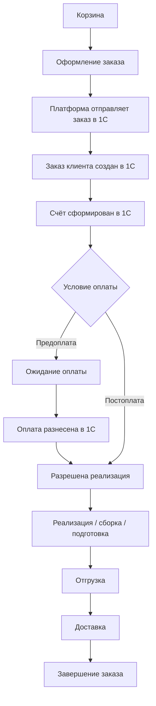

# Order Lifecycle Contract

Рабочий артефакт для фиксации жизненного цикла заказа на платформе: от корзины и оформления до оплаты, отгрузки, доставки, документов и уведомлений.

Цель документа: дать единую схему для backend, frontend, интеграции с `1С` и дальнейшей подготовки `OpenAPI`.

---

## 1. Границы процесса

- Заказ может оформить только авторизованный `B2B`-клиент с одобренным доступом к ЛК.
- Платформа отвечает за интерфейс корзины, оформление заказа, показ статусов, delivery-деталей, документов и уведомлений.
- `1С` отвечает за создание и обработку заказа, оплату, реализацию, отгрузку, delivery-данные и документы.
- В ЛК используется **одна верхнеуровневая цепочка из 6 статусов заказа**.
- События доставки не образуют отдельную вторую шкалу статусов, а отображаются как детали внутри заказа.

---

## 2. Основные сущности процесса

| Сущность | Источник истины | Назначение |
| -------- | --------------- | ---------- |
| Корзина | Платформа | Подготовка состава заказа перед оформлением |
| Заказ на платформе | Платформа + `1С` | Клиентский объект, связанный с заказом клиента в `1С` |
| Заказ клиента в `1С` | `1С` | Основной ERP-объект, от которого строится дальнейший процесс |
| Счёт | `1С` | Основание для оплаты и отображения суммы / срока оплаты |
| Оплата | `1С` | Статус оплаты по банковской выписке и разнесению |
| Реализация | `1С` | Подготовка к отгрузке / продажа |
| Расходный ордер | `1С` | Сборка / комплектация |
| Маршрут / задание на перевозку | `1С` | Delivery-детали своей доставки |
| Доставка ТК | `1С` + перевозчик | Delivery-детали перевозки через транспортную компанию |
| Документы заказа | `1С` | Счёт, УПД, ТТН, паспорт качества, акт сверки |
| Уведомления | Платформа | Клиентские и внутренние сообщения по событиям жизненного цикла |

---

## 3. Канонический поток заказа

---

## 4. Стадии процесса

### 4.1 Корзина

- Клиент собирает заказ из каталога.
- В корзине отображаются:
  - позиции, количество, цены;
  - предупреждение о пороге бесплатной доставки;
  - при необходимости ожидаемая дата поступления на склад.
- Для `MVP` порог бесплатной доставки задаётся платформой в админке.

### 4.2 Оформление

- Клиент подтверждает:
  - адрес доставки;
  - контактное лицо;
  - комментарий к заказу;
  - способ доставки в рамках доступных правил.
- Условия оплаты и коммерческие параметры не редактируются пользователем, а отображаются по данным `1С`.

### 4.3 Передача заказа в 1С

- Платформа отправляет заказ в `1С`.
- В запрос обязательно входят:
  - внешний идентификатор заказа платформы;
  - контрагент;
  - состав заказа;
  - адрес и контакт доставки;
  - **способ доставки**, согласованный с клиентом по правилам платформы (включая **порог бесплатной доставки из админки** — см. ЧТЗ 03).
- **Источник истины для порога в UI:** платформа (админка); в `1С` передаётся уже согласованный вариант. Детали маршрута и delivery-события по-прежнему из `1С`.
- `1С` создаёт `Заказ клиента` и возвращает подтверждение приёма / идентификатор заказа.

### 4.4 Счёт и оплата

- Счёт формируется в `1С`.
- Счёт должен быть:
  - доступен в ЛК;
  - отправлен клиенту по `email`.
- При предоплате дальнейшая реализация разрешается только после поступления оплаты и её разнесения в `1С`.
- При постоплате заказ продолжает движение по правилам соглашения.

### 4.5 Подготовка и отгрузка

- После разрешения к исполнению заказ проходит стадию подготовки в `1С`.
- Внутренние объекты `1С`:
  - заказ на производство, если товара не хватает;
  - реализация;
  - расходный ордер;
  - маршрут / задание на перевозку или данные ТК.
- Платформа не показывает всю внутреннюю цепочку документов `1С`, а маппит её в 6 клиентских статусов.

### 4.6 Доставка

- При своей доставке в заказе могут отображаться:
  - ориентировочная дата / слот;
  - маршрут;
  - контакты водителя;
  - дополнительные согласованные события.
- При доставке через ТК в заказе могут отображаться:
  - транспортная компания;
  - трек-номер;
  - ссылка на отслеживание;
  - итог доставки.

### 4.7 Завершение

- Заказ считается завершённым после завершения доставки / закрытия заказа в `1С`.
- После завершения клиент продолжает видеть:
  - историю заказа;
  - документы;
  - возможность `Повторить заказ`.

---

## 5. Каноническая модель статусов заказа

> **Этот документ является каноническим источником** для модели 6 статусов заказа в ЛК. При расхождениях между ЧТЗ 01, 08, 09 и данным документом — приоритет у `order_lifecycle_contract.md`. Все остальные документы должны ссылаться сюда.

| № | Статус ЛК | Смысл для клиента | Базовый источник / событие в `1С` |
| -- | --------- | ----------------- | --------------------------------- |
| 1 | `Обрабатывается` | Заказ в работе у компании на этапе после появления в `1С` как `Заказ клиента` | Создан `Заказ клиента` |
| 2 | `В производство / производится` | По заказу требуется производство | Создан заказ на производство |
| 3 | `Готов к сборке` | Заказ готовится к комплектации | Создана реализация, расходный ордер ещё не проведён |
| 4 | `Готов к отгрузке` | Заказ собран и готов к отправке | Расходный ордер проведён |
| 5 | `Отправлен` | Заказ уже в логистическом контуре | Отгрузка начата; есть маршрут / задание на перевозку / данные ТК |
| 6 | `Завершён` | Доставка выполнена, заказ закрыт | Доставка завершена / заказ закрыт |

### 5.1 Принципы статусов

- Это единственная верхнеуровневая шкала заказа в ЛК.
- Платформа не рассчитывает статусы сама, а отображает согласованный маппинг событий `1С`.
- Все delivery-данные живут внутри заказа, а не как отдельная шкала.
- Шесть значений описывают **прогресс заказа в `1С` после успешного создания документа** `Заказ клиента`. Сценарий «заказ принят платформой, но ещё не доставлен в `1С`» или «доставка в `1С` не удалась» **не является седьмым статусом** этой шкалы — он отражается отдельным полем состояния синхронизации (раздел 5.2).

### 5.2 Состояние синхронизации с `1С` (`integrationSyncState`)

Отдельно от `OrderStatus` в API и в данных заказа задаётся **состояние доставки заказа в `1С`** (очередь, обмен, идемпотентность). Канонические значения:

| Значение | Смысл |
| -------- | ----- |
| `pending` | Заказ создан на платформе; ожидается успешное создание / подтверждение в `1С` (в т.ч. сразу после `POST /orders`). |
| `synced` | В `1С` есть согласованный заказ; `oneCOrderGuid` (или эквивалент) известен; маппинг верхнеуровневых статусов из событий `1С` актуален. |
| `failed` | Последняя попытка доставить заказ в `1С` завершилась ошибкой / таймаутом; предусмотрены повторы по политике обмена. |
| `manual_review_required` | Исчерпаны автоматические попытки или сценарий передан поддержке / менеджеру; требуется ручное вмешательство. |

Допустимые сопутствующие поля (по необходимости в OpenAPI): код/текст последней ошибки (`lastSyncErrorCode`, `lastSyncErrorMessage`), признак возможности повтора (`retryable`).

**Правила отображения в ЛК:**

- Пока `integrationSyncState` не `synced`, **нельзя** трактовать строку «Обрабатывается» / `processing` как «заказ уже создан в `1С`» — показывать явное пояснение и/или баннер (например: заказ принят, ожидается регистрация в `1С`; при сбое — «обрабатывается поддержкой», CTA связи с менеджером — по правилам продукта).
- При `failed` или `manual_review_required` — блок «требует внимания» в карточке заказа; детали ошибки клиенту — в безопасном виде (без внутренних трассировок).
- Операционный контур: список / фильтр заказов с `manual_review_required` или `failed` для поддержки и админки (см. ЧТЗ 09, 10, 12).

**Вариант «седьмой статус в `OrderStatus`» в канонику не входит:** расширение enum до значения вроде «требует внимания» смешивает жизненный цикл `1С` с состоянием обмена и требует отдельного согласования всех ЧТЗ; до такого решения действует модель **6 статусов + `integrationSyncState`**.

---

## 6. Delivery-детали внутри заказа

| Блок | Что показываем | Источник |
| ---- | -------------- | -------- |
| Способ доставки | Своя машина / ТК | `1С` |
| Плановая дата / слот | Когда заказ ожидается к доставке | `1С` |
| Маршрут | При своей доставке, если доступен клиенту | `1С` |
| Контакты водителя | ФИО / телефон / при необходимости ТС | `1С` |
| Трек ТК | Номер и ссылка на отслеживание | `1С`, при необходимости дополняется данными перевозчика |
| События доставки | Значимые обновления по отгрузке / маршруту | `1С` |

### 6.1 Что не считается отдельным статусом

- `Маршрут создан`
- `Назначен водитель`
- `Появился трек-номер`
- `Машина в пути`
- `Точка прохождения маршрута`

Эти события могут влиять на уведомления и наполнение карточки заказа, но не создают новую верхнеуровневую фазу заказа.

---

## 7. Документы в жизненном цикле заказа

| Этап | Документ | Правило отображения |
| ---- | -------- | ------------------- |
| После создания заказа | Счёт | Доступен в ЛК и отправляется по email |
| После отгрузки в `1С` | УПД | Клиент в ЛК инициирует запрос в `1С`; файл не хранится на платформе; единый UX (ЧТЗ 02, решение 2026-03-25) |
| После отгрузки / по запросу | ТТН | Доступна, если сформирована |
| После отгрузки / по партии | Паспорт качества | Доступен по заказу / партии |
| После запроса клиента | Акт сверки | Формируется в `1С` по заявке из ЛК |

### 7.1 Документные правила

- Источником документов для `MVP` считается `1С`.
- Для части документов допустим сценарий `request on demand`.
- Платформа должна хранить связь заказа и документа через внешние идентификаторы.

---

## 8. Оплата в жизненном цикле заказа

| Сценарий | Как работает |
| -------- | ------------ |
| Предоплата | Заказ оформляется, счёт формируется, реализация ждёт поступления оплаты |
| Частичная оплата | Статус оплаты приходит из `1С`; дальнейшая логика зависит от правил соглашения |
| Постоплата | Заказ продолжает цикл без ожидания факта оплаты, по условиям соглашения |

### 8.1 Отображаемые поля оплаты

- сумма к оплате;
- срок оплаты;
- статус оплаты: `не оплачен` / `частично оплачен` / `оплачен`.

Источник этих данных: `1С`.

---

## 9. Уведомления по жизненному циклу заказа

| Событие | Канал по умолчанию | Источник триггера |
| ------- | ------------------ | ----------------- |
| Заказ принят | `email`, позже `push` | Платформа / `1С` |
| Сбой доставки заказа в `1С` / требуется внимание поддержки | `email` (менеджер / настраиваемые адресаты в админке); опционально `email` клиенту после согласования текста | Платформа (очередь обмена) |
| Счёт готов | `email` | `1С` |
| Оплата поступила | `email` | `1С` |
| Изменился верхнеуровневый статус заказа | `email`, позже `push` | `1С` |
| Обновились delivery-детали | `email`, при необходимости `SMS` / `push` | `1С` |
| Акт сверки готов | `email` | `1С` |

### 9.1 Принцип уведомлений

- Не уведомлять по каждому внутреннему техническому событию `1С`.
- Уведомлять по верхнеуровневым статусам заказа и значимым delivery-деталям.
- История уведомлений может отображаться в ЛК как отдельная лента.

---

## 10. Повтор заказа

| Сценарий | Правило |
| -------- | ------- |
| Позиция активна | Добавляется в корзину |
| Позиция архивная, но остаток > 0 | Добавляется в корзину |
| Позиция архивная и остаток = 0 | Не добавляется, показывается в pop-up со списком исключений |

### 10.1 Принципы повтора

- Повтор заказа не должен блокироваться целиком, если часть позиций недоступна.
- История заказа хранит все исходные позиции, даже если часть из них уже неактуальна.
- Для сценария критичен контракт по признаку архивности / доступности номенклатуры из `1С`.

---

## 11. Минимальный набор данных карточки заказа

- идентификатор заказа платформы;
- идентификатор заказа в `1С` (если уже известен);
- `integrationSyncState` и при необходимости поля ошибки синхронизации;
- номер заказа;
- дата создания;
- контрагент;
- список позиций;
- сумма;
- статус заказа;
- статус оплаты;
- способ доставки;
- delivery-детали;
- ссылки на документы;
- признак доступности сценария `Повторить заказ`.

---

## 12. Что нужно подтвердить до OpenAPI / разработки

| Блок | Что нужно подтвердить | Приоритет |
| ---- | --------------------- | --------- |
| Создание заказа | Финальный состав payload из платформы в `1С` | Критично |
| Идемпотентность | Как `1С` обрабатывает повторную отправку заказа | Критично |
| Синхронизация заказа | Политика ретраев, переход `pending` → `synced` / `failed` / `manual_review_required`, UX при ошибке | Критично |
| Статусы | Точный маппинг 6 статусов на объекты и события `1С` | Критично |
| Delivery | Какие поля по маршруту / водителю / ТК доступны для клиента | Критично |
| Оплата | Когда и как приходит статус частичной / полной оплаты | Высокий |
| Документы | Какие документы доступны online, какие по запросу | Высокий |
| Повтор заказа | Как именно `1С` передаёт состояние архивности и доступности к заказу | Высокий |
| Уведомления | Какие события идут сразу в `MVP`, какие откладываются | Средний |

---

## 13. Связанные документы

- `ЧТЗ/01_процесс_оформления_заказа.md`
- `ЧТЗ/03_доставка.md`
- `ЧТЗ/08_ЛК_заказы_статусы.md`
- `ЧТЗ/10_уведомления.md`
- `ЧТЗ/02_документооборот.md`
- `ЧТЗ/09_интеграция_1С.md`
- `ЧТЗ/Матрица_статусов_и_источников.md`
- `Техническая часть/1С_contract_matrix.md`
