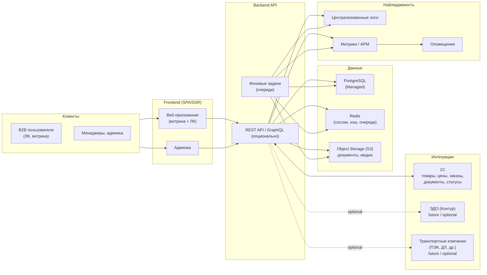

# Архитектура платформы (черновик)

Документ описывает высокоуровневую техническую архитектуру B2B‑платформы Palizh: основные компоненты, их роли и связи. На этом этапе фиксируем **гипотезу**, которую далее будем уточнять с ИТ‑командой заказчика и подрядчиками по разработке.

## 1. Общая схема

- **Облако:** Яндекс Облако; приоритет — managed‑сервисы (PostgreSQL, Redis, Object Storage, Managed Kubernetes/Compute).
- **Окружения:** dev / stage / prod (минимум). Отдельные БД, S3‑бакеты и очереди для prod.

## 2. Основные компоненты

- **Frontend (витрина + ЛК)**
  - Веб‑приложение на **Vue 3 + Nuxt 3 + TypeScript** (SSR/SSG для витрины, SPA‑режим для ЛК); подробности и структура описаны в `Frontend_архитектура.md`.
  - Отвечает за пользовательский интерфейс витрины, ЛК, корзины, обучения и т.п.

- **Админка**
  - Интерфейс для маркетинга и внутренних пользователей: контент витрины, акции, обучение, настройки уведомлений и интеграций.

- **Backend API**
  - Реализуется как монолитное приложение на **PHP 8.x + Laravel**: REST API + фоновые задачи на очередях (Redis); авторизация для фронтенда — через JWT (Bearer).
  - Реализует бизнес‑логику всех блоков (ЧТЗ 01–12): заказы, доставка, документооборот, бонусы, уведомления, поиск, ЛК, система управления.
  - Экспортирует REST API (и, при необходимости, GraphQL) для фронтенда и внешних интеграций.

- **PostgreSQL**
  - Основное хранилище структурированных данных платформы (контрагенты, пользователи ЛК, заказы, настройки, связи с документами в S3 и т.д.).

- **Redis**
  - Кэш чтения (каталог, справочники), сессии (если будут серверные), очереди фоновых задач (рассылки, синхронизация с 1С, тяжёлые операции).

- **Object Storage (S3)**
  - Хранение файлов: документов (PDF), маркетингового контента (изображения, баннеры), обучающих материалов (видео/презентации или ссылки).

- **Интеграции**
  - **1С:** основная и обязательная интеграционная точка для MVP; через неё платформа получает товары, цены, остатки, заказы, статусы, документы и данные для ЛК.
  - **ЭДО (Контур):** future / optional контур; подключается отдельно, если будет подтверждён как прямой контур платформы.
  - **ТК:** future / optional контур; прямой трекинг и предварительные расчёты подключаются отдельно, если это будет подтверждено как часть MVP или следующего релиза.

На текущем уровне фиксации считаем, что для MVP **прямой интеграционный контур платформы = только 1С**. Если позже будут подтверждены прямые интеграции с `ТК` или `ЭДО`, их нужно описывать как отдельные контуры с собственными требованиями.

- **Наблюдаемость**
  - Централизованный сбор логов (Loki/ELK/YC), метрик (Prometheus/OpenTelemetry) и ошибок (Sentry или аналог), с оповещениями для команды.

## 3. Открытые вопросы по архитектуре

- Kubernetes vs отдельные виртуальные машины в Яндекс Облаке для размещения контейнеров.
- Требования к отказоустойчивости и RPO/RTO (влияют на схему резервирования БД, S3 и Redis).
- Какой уровень «онлайн‑синхронизации» с 1С требуется (почти real‑time vs пакетные обмены).

