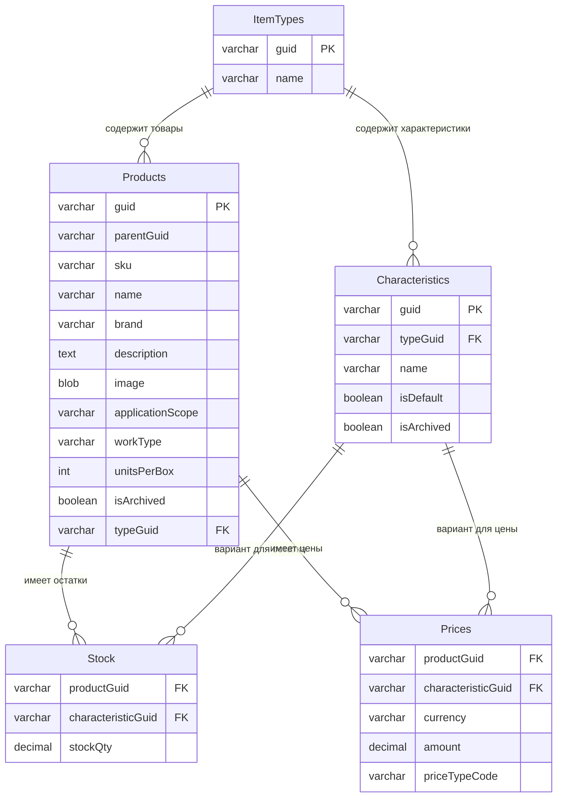

# Модель данных каталога 1С и обмен с платформой

**Статус:** согласовано по итогам встречи с 1С **2026-05-26**; дополнение по коробке, видам цен и фильтрам — **2026-06-02**; **имена `event` и полей реализованного обмена — канон GitLab / стенд** (2026-06-02). См. [саммари](../Интервью%20и%20встречи/Саммари/2026-05-26_встреча_с_1С_саммари.md).  
**Примеры JSON:** [`входящие/incoming-hooks.md`](../входящие/incoming-hooks.md).  
**Формальный перечень `event`:** [`openapi_1c_inbound_mvp.yaml`](openapi_1c_inbound_mvp.yaml).

---

## 1. Логическая модель (1С / платформа)

Нормализация: **характеристики** (цвет/колер и т.п.) задаются на уровне **вида номенклатуры**, а не дублируются в каждой строке товара. **Остатки** и **цены** — отдельные факты по паре **товар + характеристика** (только заполненные строки, без тысяч нулевых хвостов).

### Соответствие сущностей 1С и полей JSON

| Сущность (логика) | Таблица / справочник 1С (обсуждение) | Ключевые поля в обмене (camelCase) |
|-------------------|--------------------------------------|-------------------------------------|
| Вид номенклатуры (тип товара) | ItemTypes / product-types | `guid`, `name` — событие **`sync.product-types`** |
| Справочник атрибутов | ProductAttributes | `code`, `label`, `valueType`, `filterType`, `unit`, `isFilterable`, `isMulti`, `categories`, `subvalueOptions` — **`sync.product-attributes`** |
| Товар (номенклатура) | Products | `guid`, `parentGuid`, `sku`, `name`, `brand`, `description`, `images[]`, **`unitsPerBox`**, `isArchived`, **`typeGuid`**, **`attributes[]`**, опц. `marketplaceUrls`, `counterpartiesGuid`, `productionTimeDays` |
| Характеристика типа | Characteristics | `guid`, **`typeGuid`**, `name`, `isDefault`, `isArchived`; опц. `ral`, `hex` — **`sync.product-type-characteristics`** |
| Остаток | Stock | **`productGuid`**, **`characteristicGuid`**, **`stockQty`** |
| Цена | Prices | **`productGuid`**, **`characteristicGuid`**, `currency`, `amount`, **`priceTypeCode`** |

**Составной ключ** для строк **Prices:** логически `productGuid` + `characteristicGuid` + `priceTypeCode` (в одном пакете не должно быть дублей).

**Виды цен MVP (2026-06-02):** на пару номенклатура + характеристика — **три** строки в `sync.prices`:

| `priceTypeCode` (рабочее) | Наименование | Назначение |
|---------------------------|--------------|------------|
| `RETAIL` | розница | База для **персональной скидки %** контрагента |
| `WHOLESALE` | опт | Оптовая цена |
| `BOX` | цена за коробку | **Сумма за упаковку целиком** (не за штуку внутри коробки); в 1С — поле/вид цены «цена за коробку» (зафиксировано **2026-06-02**) |

Коды должны совпасть со справочником видов цен в 1С.

**Категории витрины** по-прежнему отдельное дерево — событие **`sync.categories`** (не смешивать с `typeGuid` типа номенклатуры).

**Устаревшие имена (аналитика до 2026-06-02, не использовать на стенде):** `sync.item_types`, `sync.characteristics`, `sync.stock`; поле **`itemTypeGuid`** в JSON (заменено на **`typeGuid`**); отдельные поля `applicationScope` / `workType` в шапке товара — заменены массивом **`attributes[]`** и справочником **`sync.product-attributes`**.

---

## 2. События `POST /exchange` (каталог)

| `event` | Назначение | Типичный режим |
|---------|------------|----------------|
| `sync.product-attributes` | Справочник атрибутов для фильтров и карточки | Редко; дельты при изменении схемы |
| `sync.product-types` | Справочник типов (видов) номенклатуры | Редко; дельты при изменении |
| `sync.product-type-characteristics` | Характеристики внутри типа (цвета, фасовки и т.д.) | Редко; дельты |
| `sync.products` | Шапка номенклатуры **без** вложенных `variants`; **`attributes[]`** | Пакеты при изменении состава |
| `sync.stocks` | Остатки по парам product + characteristic | Часто; допустима **полная перезаливка** среза таблицы остатков |
| `sync.prices` | Цены по парам product + characteristic | Часто; допустима **полная перезаливка** среза |
| `sync.categories` | Дерево категорий витрины | Как раньше; чеклист приёмки — [`Чеклист_1С_sync.categories.md`](Чеклист_1С_sync.categories.md) |
| `sync.counterparties` | Контрагенты | Как раньше |

**Рекомендуемый порядок** при первичной заливке: `sync.product-attributes` → `sync.product-types` → `sync.product-type-characteristics` → `sync.categories` (параллельно по смыслу) → `sync.products` → `sync.stocks` → `sync.prices`.

**Устарело (до 2026-05-26):** единый `sync.products` с вложенным массивом **`variants[]`** (остатки, цены, картинки внутри варианта). Не использовать в новых выгрузках 1С.

---

## 3. Отображение на витрине (принципы)

- Платформа собирает **SKU/вариант для заказа** по связке **`productGuid` + `characteristicGuid`** (в исходящем `POST /post_orders` — `productVariantGuid` или эквивалент после маппинга).
- Если у товара несколько характеристик с остатком — правило выбора **дефолта** (`isDefault`), **ненулевой остаток**, настройка витрины — уточняется при проектировании UI (см. ЧТЗ 06).
- **~95 %** номенклатуры без отдельной характеристики в 1С: цвет может быть в **наименовании** и в **`hex` на уровне товара**; **~5 %** (колеруемые сборники) — большой справочник характеристик на **виде** «краски». Платформа может нормализовать оба кейса в единую модель карточки.
- **Кратная упаковка:** поле **`unitsPerBox`** («шт. в коробке» в 1С). В карточке: при сценарии упаковки — подпись **«цена / уп.»**; для штучных — **«цена / шт»**.
- **Скидка контрагента** применяется к **розничной** цене (`RETAIL`), если иное не согласовано с 1С.

### 3.1. Атрибуты витрины (фильтры)

**Реализовано на стенде (GitLab):** справочник — **`sync.product-attributes`** (`code`, `label`, `filterType`, …); значения на товаре — массив **`attributes[]`** в **`sync.products`**. Публичный API: `GET /products/filters`, query-параметры **`attr`** / **`attrRange`** — см. [`public-http-openapi.yaml`](public-http-openapi.yaml).

Ранее в аналитике обсуждались фиксированные поля **`applicationScope`** и **`workType`** в шапке товара — **заменены** гибкой моделью атрибутов.

**Открытые вопросы (координация с 1С):**

- **Заполнение** справочника и **`attributes[]`** на реальной номенклатуре в 1С (коды MVP — см. ЧТЗ 06 §4.2.0, принято 2026-06-26).
- **Гибкость модели:** новые атрибуты добавляются через **`sync.product-attributes`** без смены контракта API (решение 2026-06-26).

~~Число групп фиксированное vs гибкое~~ — **гибкое** (стенд); рабочий набор кодов MVP зафиксирован в ЧТЗ 06.

---

## 4. Связанные артефакты

| Документ | Что обновлять при смене модели |
|----------|--------------------------------|
| `входящие/incoming-hooks.md` | Примеры payload |
| `openapi_1c_inbound_mvp.yaml` | `enum` для `event` |
| `Маппинг_API_1С.md` | Поля 1С ↔ JSON |
| `ЧТЗ/09_интеграция_1С.md` | Требования to-be |
| `1C_API_контракт_и_этапы.md` | Таблица методов / этапность |

*Актуализировано: 2026-06-26 (набор кодов атрибутов MVP — ЧТЗ 06 §4.2.0).*
