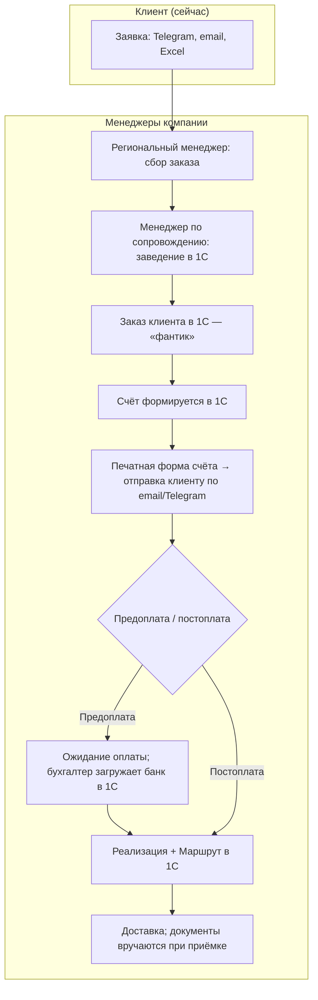
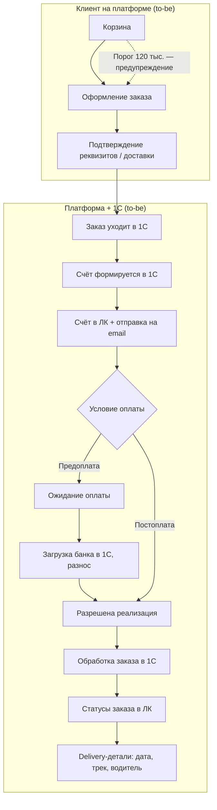

# ЧТЗ: Процесс оформления заказа

**Статус:** драфт  
**Источники:** Понимание задачи, саммари интервью 2026-02-24 (процесс заказа JTBD), 2026-03-02 (документы, роли, нестандартный заказ), 2026-03-04 (доставка, бонусы, цены), 2026-03-17 (претензии), ЧТЗ 09 (интеграция с 1С).  
**As-is / To-be:** as-is — как есть сейчас, **без** нового сайта и ЛК (заказ приходит в Telegram/email/Excel, менеджер заводит в 1С, счёт шлют по почте). to-be — целевое состояние **с** витриной и ЛК (раздел 4 и диаграмма целевого потока ниже).

---

## 1. Назначение

Описывает процесс формирования заказа клиентом на платформе: корзина → оформление → счёт → оплата (предоплата/постоплата) → обработка заказа в 1С → отгрузка и доставка. Цель — дать клиенту возможность самостоятельно оформлять заказ 24/7; заведение в 1С и дальнейшая обработка остаются в ERP, а платформа показывает клиенту единый верхнеуровневый статус заказа и детали доставки.

---

## 2. Термины (общие для процесса)

| Термин | Описание |
|--------|----------|
| Заказ клиента | Заявка на покупку (в 1С — «фантик», не факт продажи); резервирование по возможности |
| Реализация | Документ 1С, подтверждающий факт продажи; создаётся после оплаты (при предоплате) или по решению менеджера (при постоплате) |
| Соглашение | Справочник 1С: этапы оплаты, способ (предоплата/постоплата), проценты, даты сдвига (отсрочка) |
| Региональный менеджер | Приём заказа, связь с клиентом, согласование |
| Менеджер по сопровождению | Заведение заказа и документов в 1С, печатные формы |

---

## 3. As-is: текущий процесс (без нового сайта и ЛК)

Сейчас витрины и ЛК нет. Заказ поступает разрозненно; менеджеры заводят его в 1С; документы и сведения клиент получает по email/Telegram.

### 3.1 Текущий поток от заявки до отгрузки

### 3.2 Ветвление по типу оплаты (сейчас — в 1С)

Соглашение в 1С задаёт этапы оплаты, способ (предоплата/постоплата), отсрочку. При предоплате реализацию в 1С не создают до поступления оплаты (бухгалтер разносит платежи из банка). При постоплате — реализация после оформления заказа.

### 3.3 To-be: целевой поток (с витриной и ЛК)

После запуска нового сайта клиент сможет оформлять заказ в корзине на витрине; заказ уйдёт в 1С; счёт будет доступен в ЛК и по email. Ниже — целевая схема (не текущее состояние).

---

## 4. To-be: требования (драфт)

### 4.1 Корзина и оформление

- Формирование заказа через каталог (вручную) и заказ через файл (объёмные поставки) — по Пониманию задачи.
- **Повторить заказ:** клиенту нужна возможность скопировать прошлый заказ в корзину одной кнопкой; **выбор заказа из списка** (не только последний).
- В корзине отображать предупреждение о пороге бесплатной доставки: `Доберите до N ₽ для бесплатной доставки` или аналог. Значение `N` для `MVP` задаётся как настройка платформы в админке; текущее рабочее значение — `120 тыс. руб.`. **Источник истины для порога в ЛК — платформа** (решение 2026-03-25; подробнее ЧТЗ 03).
- При оформлении — подтверждение реквизитов доставки, контактного лица; способ оплаты и условия из соглашения в 1С (только отображение, изменение — через менеджера/договор).
- **Сроки производства при отсутствии товара:** в корзине/оформлении показывать примерную дату поступления на склад (из 1С), например «ожидаемая дата поступления на склад» — по уточнению с клиентом.

#### 4.1.1 Заказ через файл (Excel/CSV) — место в процессе

**Смысл сценария:** загрузка файла — это **альтернативный способ сформировать корзину** для объёмных поставок. Он относится к этапу **«Корзина и оформление»** и выполняется **до** отправки заказа в `1С`.

**Поток (to-be):**

- Клиент скачивает шаблон/прайс-лист (если предусмотрено).
- Загружает файл (`Excel`/`CSV`) со списком позиций и количеством.
- Платформа валидирует строки по каталогу (коды/артикулы, доступность к заказу, кратность/минимумы — по правилам, если будут).
- Валидные позиции добавляются в корзину; проблемные строки показываются отдельным списком ошибок.
- Далее оформление заказа проходит **обычным** путём: корзина → оформление → заказ уходит в `1С`.

**Статус для MVP:** функция признана полезной (интервью 2026-03-17), но **не критична для MVP** — планировать как **post-MVP**. Вопросы по формату файла и валидации фиксируются отдельно (см. реестр вопросов).

### 4.2 Интеграция с 1С

- Отправка заказа в 1С: состав (позиции, количество), контрагент, адрес доставки, контакт, **согласованный способ доставки** (в т.ч. в контексте порога из админки платформы). Обработка в 1С: создание документа «Заказ клиента», при необходимости — резервирование (регламент срока резерва — уточнить). См. ЧТЗ 03 по приоритету платформы для порога в UI.
- Получение из 1С: факт формирования счёта, наличие счёта для скачивания/просмотра в ЛК, верхнеуровневый статус заказа и детали доставки.
- При предоплате: реализация в 1С создаётся только после поступления оплаты (данные из банка); платформа не создаёт реализацию — это делает 1С/менеджер по правилам соглашения.
- Для исключения дублей при повторной отправке заказов с платформы требуется внешний идентификатор заказа и согласованный сценарий идемпотентности на стороне 1С (см. ЧТЗ 09, раздел «Идентификаторы и связывание сущностей»).

Верхнеуровневая модель статусов для заказа:

- `Обрабатывается`
- `В производство / производится`
- `Готов к сборке`
- `Готов к отгрузке`
- `Отправлен`
- `Завершён`

События доставки (`маршрут`, `задание на перевозку`, `трек-номер`, `контакты водителя`) не образуют отдельную вторую шкалу, а отображаются как детали внутри заказа.

#### 4.2.1 Состояние синхронизации заказа с 1С (отдельно от 6 статусов)

- `OrderStatus` в ЛК остаётся шкалой из 6 бизнес-статусов, которые приходят из маппинга событий 1С.
- Технический контур обмена (заказ принят платформой, но ещё не подтверждён в 1С; ошибка доставки в 1С; ручная обработка) фиксируется отдельным полем `integrationSyncState` (`pending` / `synced` / `failed` / `manual_review_required`).
- Пока заказ не подтверждён в 1С, `oneCOrderGuid` может быть `null`; ответ `201` на создание заказа означает, что заказ принят платформой, а не обязательно уже создан в 1С.
- При `failed` или `manual_review_required` для клиента показывается отдельное пояснение/баннер; для команды действует операционный контур уведомлений и обработки (см. ЧТЗ 09, 10, 12).

#### 4.2.2 Отмена заказа клиентом в MVP

- В `MVP` отмена заказа клиентом через API/ЛК не входит в scope.
- После оформления отмена/изменение заказа выполняется вне платформы (менеджер + 1С), до отдельного решения post-MVP.

### 4.2.1 Цены в корзине и карточке товара (решения из интервью 2026-03-04)

- **Цены в ЛК показываем** — решение подтверждено. Уточнить: где именно (каталог, корзина, карточка товара) и в каком виде (итоговая цена, две цены кратно/некратно упаковке, подсказка при смене количества).
- **Двойные цены (кратность упаковке):**
  - В прайсах клиенту показывают две цены: при заказе **кратно упаковке** и повышенная при **некратном** количестве.
  - Данные о кратности (количество в коробке/палете) приходят из `1С` (НаборУпаковок).
  - В корзине/карточке товара при смене количества нужно показывать, попадает ли заказ в кратность, и как это влияет на цену.
- **Персональная скидка:** базовая цена по виду цены из соглашения + процент скидки из 1С; скидка применяется в корзине ко всем товарам (см. ЧТЗ 06, 09).
- **Заказ через файл (Excel):** функция признана полезной (загрузка Excel с номенклатурой и количеством в корзину), но **для MVP не критична** (интервью 2026-03-17). Заложить как post-MVP.

### 4.3 Счёт и оплата

- Счёт формируется в 1С (в т.ч. после согласования с ПЭО при отсутствии индивидуального соглашения). Печатная форма счёта должна быть доступна в ЛК и отправляться на email клиенту.
- Отображение в ЛК: сумма к оплате, срок оплаты (при постоплате — дата по соглашению), статус оплаты (не оплачен / частично / оплачен).
- Оплата — банковским переводом по счёту; привязка платежа к заказу — в 1С (загрузка клиент-банка, разнос). Платформа показывает статус на основании данных из 1С.

### 4.4 Реализация, отгрузка и delivery-детали

- Создание документа `Реализация`, `Маршрут` и связанных delivery-сущностей выполняется в 1С (менеджер по сопровождению или автоматически по правилам 1С).
- Платформа отображает не внутреннюю цепочку документов 1С как отдельные клиентские статусы, а согласованный набор из 6 верхнеуровневых статусов заказа (см. ЧТЗ 08 и 09).
- Когда заказ переходит в статус `Отправлен`, в карточке заказа показываются delivery-детали из 1С:
  - ориентировочная дата / слот доставки;
  - способ доставки;
  - трек-номер ТК и ссылка на отслеживание;
  - контакты водителя для своей доставки;
  - иные значимые события, если они согласованы для отображения клиенту.

### 4.5 Нестандартные заявки (to-be)

Заявки, не оформляемые как обычный заказ из каталога: колеровка по образцу клиента, колеровка по каталогу, продажа оборудования, обучение. Обрабатываются менеджерами (в основном региональным); в 1С ведутся как заказ с номенклатурой «сборка цвета» / услуга или отдельный документ.

**В ЛК (to-be):**

- Форма «Связь с менеджером» (или «Нестандартная заявка»): выбор типа — **колеровка** или **оборудование** (достаточно на MVP), поле для сути запроса, **прикрепление файлов** (PDF, Excel, Word): заказ списком, паспорта безопасности, условия воспроизведения цвета и т.д.
- Заявка уходит менеджеру; менеджер уточняет, заводит в 1С заказ на производство (лаборатория) или реализацию (оборудование). Сильно не автоматизировать — менеджер всё равно связывается с клиентом.
- **Статусы нестандартной заявки в ЛК:** сокращённый набор. Для колеровки/лаборатории — «принята» / «в работе» / «выполнена»; для оборудования — цепочка как у обычного заказа (без этапа «к производству»). Привязка к событиям в 1С — по аналогии с ЧТЗ 08. Этап «разработка цвета» (оформляется в 1С как заказ на производство с комментарием по участку) отдельным статусом в ЛК не выводим — по решению интервью 2026-03-02.

**As-is:** заявки приходят по телефону, почте, мессенджеру; объём порядка 8 в месяц на всех менеджеров; ведёт в основном региональный менеджер, менеджер по сопровождению может завести заказ и передать на производство.

---

## 5. Открытые вопросы

- ~~Регламентный срок резервирования под заказ~~ — зафиксировано: резервирование на стороне 1С; платформа передаёт заказ, далее обработка менеджером в 1С.

---

## 6. Связь с другими ЧТЗ

| Блок | Связь |
|------|--------|
| Документооборот | Счёт, УПД, печатные формы — см. ЧТЗ 02 |
| Доставка | Порог 120 тыс., правила доставки и delivery-детали внутри заказа; отдельной второй шкалы статусов нет — см. ЧТЗ 03 |
| Регистрация и онбординг | Только авторизованный клиент с договором может оформить заказ — см. ЧТЗ 05 |
| ЛК — заказы и статусы | Статусы нестандартной заявки, отображение в разделе заказов/обращений — см. ЧТЗ 08 |
| Претензии | После получения товара — см. ЧТЗ 04 |
| Интеграция с 1С | Создание заказа клиента, счёт, статусы, правила идемпотентности обмена — см. ЧТЗ 09 |
| Саммари интервью | [2026-03-04 цены/кратность](../Интервью%20и%20встречи/Саммари/2026-03-04_доставка_бонусы_цены_уведомления_поиск_саммари.md), [2026-03-17 заказ из файла](../Интервью%20и%20встречи/Саммари/2026-03-17_претензии_саммари.md) |
