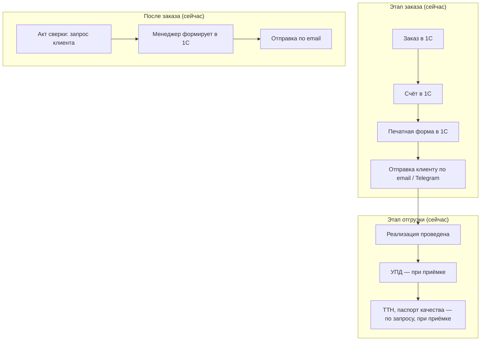
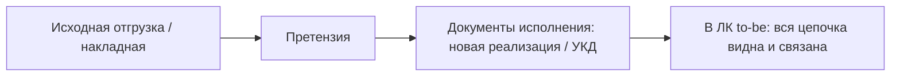

# ЧТЗ: Документооборот

**Статус:** драфт  
**Источники:** Понимание задачи, саммари интервью 2026-02-24 (процесс заказа JTBD), 2026-03-02 (документы, роли, нестандартный заказ), 2026-03-13 (1С обмен данными), 2026-03-17 (претензии), ЧТЗ 09 (интеграция с 1С), ЧТЗ 14 (обучение), рабочий контракт [document_delivery_contract.md](../Техническая%20часть/document_delivery_contract.md).  
**As-is / To-be:** as-is — как есть сейчас, **без** ЛК (счёт и документы — по email, при приёмке; акт сверки по запросу менеджеру). to-be — с новым сайтом и ЛК (раздел 4 и целевая схема ниже).

---

## 1. Назначение

Описывает состав документов в рамках заказа, после него и в связанных сценариях исполнения претензий; способы их формирования (`1С`), выдачи клиенту (ЛК, email, в перспективе ЭДО) и запросов со стороны клиента. Цель — обеспечить клиенту доступ к счетам, накладным, актам сверки, сертификатам качества и документам исполнения по претензии без ожидания менеджера. Ниже (п. 4.0) — **сводная матрица**: какие документы привязаны к заказу/отгрузке, какие — к контрагенту, договору или номенклатуре, и в каких разделах ЛК они показываются.

---

## 2. Термины (общие)

| Термин | Описание |
|--------|----------|
| УПД | Универсальный передаточный документ; обязателен при отгрузке, остаётся у клиента и водителя |
| ТТН | Товарно-транспортная накладная; по запросу клиента |
| Паспорт качества | На партию продукции; формируется в 1С, с печатью/подписью (факсимиле); по запросу или признаку клиента |
| ЭДО | Электронный документооборот; на старте не используется массово; в перспективе — счета, акты сверки (Контур) |
| Акты сверки | Запрашиваются клиентом; формирует менеджер по сопровождению; ожидание формирования — боль клиента (выходной, очередь) |
| TDS | *Technical Data Sheet* — лист технических данных по номенклатуре (свойства, применение, условия использования); в РФ часто отдельно от «паспорта качества» на партию |
| MSDS / SDS | *Material Safety Data Sheet* / *Safety Data Sheet* — сведения по безопасности материала; близко к «паспорту безопасности» в отраслевой практике |

---

## 3. As-is: выдача документов сейчас (без ЛК)

ЛК и витрины пока нет. Счёт формируется в 1С, печатную форму менеджер отправляет клиенту по email (или в тот же канал — Telegram). При отгрузке УПД/ТТН/паспорт качества вручаются при приёмке; акт сверки — по запросу клиента, формирует менеджер в 1С, отправляет по email. Ожидание формирования акта — боль клиента (очередь, выходной).

### 3.1 To-be: целевой процесс с ЛК

В ЛК клиенту будут доступны счёт, УПД, ТТН, паспорт качества (просмотр/скачивание); запрос акта сверки из ЛК. Для претензий хронология документов должна сохраняться как последовательность связанных сущностей: исходная отгрузка / исходный заказ, сама претензия, документы исполнения по претензии (`новая реализация`, `новая отгрузка`, `УКД`, возврат / корректировка). Исходный документ не заменяется и не перезаписывается.

---

## 4. To-be: требования (драфт)

### 4.0 Перечень документов в ЛК: привязка к сущностям и разделам интерфейса

Для проектирования навигации и интеграции с `1С` документы удобно делить на уровни: **заказ / отгрузка / партия**, **компания / договор**, **номенклатура (товар, SKU)**, **заявки** (претензия, обучение). Источником печатных форм для автоматизированного контура `MVP` считается **`1С`**, если не указано иное.

#### 4.0.1 Тип привязки: «товар» (номенклатура) и «заказ» (сделка, партия)

| Тип | Что означает | Примеры |
| --- | ------------- | ------- |
| **К заказу / отгрузке** | Документ относится к **конкретной сделке** или **отгрузке** в `1С` | Счёт, УПД, ТТН |
| **К партии (внутри заказа)** | Документ завязан на **партию продукции** по конкретной отгрузке; не является «общим листом» на всю номенклатуру | Паспорт качества из `1С` на партию |
| **К номенклатуре (товару)** | Документ **одинаков для SKU** независимо от того, в каком заказе товар покупали; привязка к `nomenclatureGuid` / артикулу в `1С` | TDS, MSDS/SDS, СГР, файловый паспорт безопасности на товар, каталог линейки (если так заведено) |
| **К компании / договору** | Не к одному заказу | Акт сверки, договор, ДС |
| **К заявке на платформе** | Создано в ЛК, не печатная форма `1С` | Вложения претензии, запись «Заявка на обучение» |

**Важно не смешивать:** «паспорт качества» в контексте отгрузки (партия, `1С`) и «техническая/регуляторная документация на товар» (TDS, СГР и т.д.) — разные сущности; в таблице ниже указано отдельно.

#### 4.0.2 Где отображаем: карточка товара, карточка заказа, раздел «Документы»

| Место в интерфейсе | Назначение в MVP | Номенклатурные документы (TDS, СГР, …) |
| ------------------ | ---------------- | -------------------------------------- |
| **Карточка заказа** (ЛК) | Основная точка входа к **счёту, УПД, ТТН, паспорту качества на партию** | Опционально **post-MVP / развитие:** список файлов по **составу заказа** (подтянуть из `1С` по строкам номенклатуры) — см. [document_delivery_contract.md](../Техническая%20часть/document_delivery_contract.md) |
| **Раздел «Документы»** (ЛК) | Общий доступ к **актам сверки**, **договорам**, **библиотеке файлов по номенклатуре** (если в `1С`) | **MVP:** основной экран для **товарных** PDF/файлов из `1С` (фильтр, поиск, привязка к SKU — по проектированию UI) |
| **Профиль компании** (ЛК) | Реквизиты; при согласовании макетов — **договор** рядом с условиями | Договор/ДС, если UX решит вынести сюда из «Документов» |
| **Карточка товара** (витрина / каталог) | Описание, цены для B2B, остатки (ЧТЗ 06) | **MVP:** **не обязательна** выдача TDS/СГР/паспортов с карточки; каталоговый API ([openapi_mvp_catalog_product.md](../Техническая%20часть/openapi_mvp_catalog_product.md)) на старте **может не включать** файлы документооборота. **Развитие:** блок «Документы» / ссылки на скачивание для **авторизованного** B2B-клиента (гостю — только если отдельно согласуют с маркетингом и комплаенс) |
| **Обращения и претензии** | Вложения клиента, статусы | Не номенклатурный контур `1С` |

**Как получают номенклатурные файлы в MVP:** метаданные и бинарный файл (или временная ссылка) из **`1С`** по согласованному API (ЧТЗ 09); режим `online` / предзагрузка (`prefetch`) — [document_delivery_contract.md](../Техническая%20часть/document_delivery_contract.md). Если файла нет в `1С` — выдача **вне автоматизированного ЛК** (менеджер), см. п. 4.4.

#### 4.0.3 Сводная таблица документов

| Документ или материал | Привязка в учёте | Товар / заказ / иное | Где отображаем (MVP) | Как получаем |
| --------------------- | ---------------- | -------------------- | -------------------- | ------------ |
| Счёт на оплату | Заказ | **Заказ** | ЛК: **карточка заказа**; дубль в уведомлениях/email | `1С` после оформления/обработки заказа; интеграция ЧТЗ 09 |
| УПД | Реализация / отгрузка | **Заказ / отгрузка** | ЛК: **карточка заказа** | Запрос ЛК → `1С`; файл на платформе постоянно не храним (п. 4.2) |
| ТТН | Отгрузка (если есть документ) | **Заказ / отгрузка** | ЛК: **карточка заказа** | `1С`, по запросу или сразу при наличии |
| Паспорт качества (на партию) | Партия / отгрузка | **Партия → в UI через заказ** | ЛК: **карточка заказа** | Печатная форма `1С`; не путать с TDS на SKU |
| Акт сверки | Контрагент + период | **Компания (не заказ)** | ЛК: **«Документы»** | Запрос из ЛК → формирование в `1С` (асинхронно); email при необходимости |
| Договор, допсоглашения, вложения | Договор | **Договор** | ЛК: **«Документы»** и/или **профиль компании** | Файлы из карточки договора `1С` (п. 4.5) |
| TDS | Номенклатура | **Товар (SKU)** | **MVP:** ЛК **«Документы»**; карточка товара — по согласованию, не обязательна | Загрузка/привязка в `1С`; API по `nomenclatureGuid` |
| MSDS / SDS | Номенклатура | **Товар (SKU)** | Как TDS | Как TDS |
| Паспорт безопасности (файл на SKU) | Номенклатура | **Товар (SKU)** | Как TDS | Как TDS |
| СГР | Номенклатура | **Товар (SKU)** | Как TDS | Как TDS |
| Каталоги продукции, буклеты линеек | Номенклатурная группа / правила в `1С` | **Товар / линейка** | ЛК **«Документы»**, если заведено | `1С`; иначе вне контура |
| Прочие регламентные файлы на SKU (напр. декларации) | Номенклатура | **Товар (SKU)** | Как TDS, если заведены в `1С` | Решение о составе — с заказчиком (см. п. 5) |
| Вложения при подаче претензии | Претензия | **Заявка** | ЛК: **обращения / претензии** | Загрузка на платформу; не документ `1С` |
| УКД, возврат, новая реализация по итогам претензии | Заказ → претензия → исполнение | **Заказ** | To-be: **карточка заказа** / претензия | Автовыдача в ЛК — **post-MVP** ([document_delivery_contract.md](../Техническая%20часть/document_delivery_contract.md)) |
| Итоговое письмо по претензии | Претензия | **Заявка / процесс** | При согласовании | Источник и формат — открытый вопрос (п. 5) |
| Запись «Заявка на обучение» | Заявка платформы | **Иное** | ЛК: **заявки на обучение** | Данные формы на платформе; не `1С` в MVP |
| Сертификат о прохождении обучения | Событие обучения | **Иное** | **Post-MVP** | ЧТЗ 14; нужен контур подтверждения и файл |

#### 4.0.4 Претензии и обращения

| Вид | Привязка | MVP |
| --- | -------- | --- |
| Вложения при подаче претензии (фото, видео, файлы) | Заявка / претензия; в форме — заказ/накладная при необходимости | Хранение и поток на стороне платформы и бэкенда; не печатная форма `1С` |
| Документы исполнения (новая реализация, УКД, возврат, корректировка и т.д.) | Цепочка: исходный заказ/отгрузка → претензия → исполнение | Целевая to-be логика — п. 4.7; автоматизированная выдача из `1С` в ЛК — **post-MVP** по [document_delivery_contract.md](../Техническая%20часть/document_delivery_contract.md) |
| Итоговое письмо / заключение по претензии | Претензия | Открытый вопрос: показывать ли в ЛК и из какого контура (п. 5) |

#### 4.0.5 Обучение (не путать с паспортом качества)

| Артефакт | Привязка | MVP |
| -------- | -------- | --- |
| История заявок на обучение | Заявка на платформе | Запись в ЛК, статус «Отправлено»; не документ `1С` (ЧТЗ 14) |
| Сертификат о прохождении обучения | Событие обучения / курс | **Post-MVP**: нет заказного контура обучения на платформе и источника подтверждённого факта окончания в интеграции (ЧТЗ 14) |

#### 4.0.6 Сводка по разделам ЛК

| Раздел ЛК | Документы и материалы | Типичная привязка |
| --------- | --------------------- | ----------------- |
| История заказов / **карточка заказа** | Счёт, УПД, ТТН, паспорт качества на партию | Заказ / отгрузка / партия |
| **Документы** | Акт сверки; договор/ДС из `1С`; **товарные** файлы (TDS, MSDS, паспорт безопасности на SKU, СГР, каталоги и т.д.) | Компания / договор / **номенклатура** |
| Обращения и претензии | Вложения клиента; позже — документы исполнения из `1С` | Заявка; затем заказ |
| Заявки на обучение | Текст заявки, без сертификата в MVP | Заявка |

**Карточка товара (витрина):** в MVP **не** считается основным местом выдачи товарных PDF; при появлении блока документов — только после согласования с ЧТЗ 06 и правами доступа (B2B / гость). Детализация режимов выдачи (`online`, асинхронный запрос, кэш) — в [document_delivery_contract.md](../Техническая%20часть/document_delivery_contract.md).

### 4.1 Счёт на оплату

- Формирование в 1С (менеджер по сопровождению или автоматически по правилам). Печатная форма счёта: доступна в ЛК, отправка на email клиенту.
- В перспективе: генерация черновика счёта в ЭДО (Контур), отправка в ЭДО по согласованию.
- Рабочее допущение по транспортному формату файлов из `1С`: для MVP допустима передача файла как `base64` внутри `JSON` вместе с метаданными (имя, расширение / MIME-тип, размер). По текущим вводным ограничений по размеру не ожидается, документов **более 10 МБ не планируется**.

### 4.2 Документы отгрузки

- **УПД** — обязательный документ при приёмке груза; формируется в 1С при отгрузке (расходный ордер / отправка). **Решение по MVP (2026-03-25, вариант A):** после того как отгрузка отражена в 1С, в ЛК доступно **получение УПД** через **единый понятный сценарий** — действие клиента инициирует **запрос в 1С**, ответ — файл/поток для просмотра или скачивания; **файл УПД на платформе не храним** (как по интервью 2026-03-02). До факта отгрузки в 1С выдача УПД в ЛК недоступна.
- **ТТН** — по запросу; отдельный документ в 1С, печатная форма. В ЛК — возможность запросить ТТН по заказу, если он сформирован.
- **Паспорт качества** — на партию продукции; формируется в 1С. В ЛК: кнопка «Получить паспорта качества» по заказу/отгрузке; по признаку клиента можно автоматически включать паспорта в пакет отгрузочных документов (уточнить с заказчиком).

### 4.3 Акты сверки

- Клиент может запросить акт сверки из ЛК. Заявка уходит менеджеру по сопровождению; формирование в 1С, отправка клиенту (email или ЭДО). Подписание в ЭДО — бухгалтер. **История запросов/формирования актов в ЛК не ведётся** — достаточно хранения самих документов и возможности их скачать (решение по итогам интервью 2026-03-02).
- Для документов, которые формируются по запросу, нужно согласовать технический сценарий интеграции: платформа инициирует запрос в 1С по API, получает готовый файл/ссылку или статус отложенного формирования.

### 4.4 Сертификаты и техническая документация

- **Где в UI и товар vs заказ:** сводно — п. **4.0.1–4.0.3** (паспорт качества на партию — у заказа; TDS/СГР и т.п. — у номенклатуры, в MVP прежде всего раздел «Документы» ЛК).

- Запрос и предоставление сертификатов и связанной документации по оплаченному заказу — по Пониманию задачи:
  - **Паспорт качества** — формируется в 1С; логика запроса/выдачи описана выше.
  - **Паспорт безопасности**, **TDS (лист технических данных) / MSDS**, **СГР (Свидетельство о госрегистрации)**:
    - создаются/поддерживаются маркетингом и профильными подразделениями;
    - сейчас могут храниться вне 1С и рассылаться менеджерами адресно, только подтверждённым/реальным B2B‑клиентам;
    - **to-be:** если эти документы должны быть доступны клиенту в ЛК, они должны быть **предварительно загружены/связаны в 1С** и уже оттуда выдаваться на платформу;
    - если документ не загружен в 1С, он не считается частью автоматизированного контура ЛК и остаётся в ручной выдаче менеджером.

### 4.5 Договоры и допсоглашения (из 1С)

- По итогам интервью 2026-03-13: в 1С к карточке **договора** можно **прикреплять файлы** (сам договор, дополнительные соглашения, иные вложения).
- Платформа получает файлы договора напрямую из 1С — нет отдельного файлового хранилища вне 1С.
- Транспортный формат: JSON + `base64` + метаданные (имя, расширение / MIME-тип, размер) — аналогично остальным документам.
- В ЛК клиенту доступны: действующий договор, допсоглашения, история изменений (если нужно — уточнить scope для MVP).

### 4.6 ЭДО (перспектива)

- Понимание задачи: ЭДО (Контур) — заведение черновиков, счета и акты сверки в одностороннем режиме.
- **«Честный знак»** (саммари 2026-03-13): продукты Palizh (шпатлёвка) уже подпадают под «Честный знак»; передача УПД должна идти через ЭДО. К 2027–2028 годам по остальным ЛКМ требования усилятся → фактически **все контрагенты будут вынуждены перейти к ЭДО**.
- Текущее состояние: ~50/50 клиентов работают по ЭДО; менеджер по сопровождению регулярно подключает клиентов к ЭДО (раз в 1–2 месяца срезы).
- В ЧТЗ заложить возможность подключения ЭДО без переработки базового потока документов; оценить интеграцию платформы с ЭДО как задел, но не делать «в лоб» в MVP.

### 4.7 Документы и хронология при претензии

- В документообороте по претензии нужно различать:
  - **документы подачи претензии**: форма на платформе, вложения клиента (`фото`, `видео`, при необходимости документы);
  - **внутренние документы процесса**: служебная записка, материалы и итоговое письмо во внутреннем контуре `Mass Project`;
  - **клиентские документы исполнения**: новые реализации / новые отгрузки, `УКД`, возвраты, корректировки и иные документы, которые подтверждены в `1С`.
- Для ЛК и автоматизированной выдачи действует правило:
  - документы внутреннего разбора из `Mass Project` не считаются автоматически доступными клиенту;
  - клиентский ЛК получает только те документы, которые подтверждены платформой и/или `1С`;
  - если итоговое письмо по претензии потребуется показывать в ЛК, для него нужно отдельно согласовать источник и способ выдачи.
- Типовые сценарии хронологии:
  - **недопоставка**: исходная отгрузка -> претензия -> новая реализация / новая отгрузка на недостающее количество;
  - **замена по качеству**: исходная отгрузка -> претензия -> `УКД` по исходной реализации + новая реализация / новая отгрузка;
  - **излишек**: исходная отгрузка -> претензия -> возврат / корректировка, при необходимости `УКД`;
  - **бой**: исходная отгрузка -> претензия -> `УКД` и/или новая реализация / новая отгрузка по принятому решению.
- В интерфейсе ЛК нужно показывать не абстрактную строку `претензия закрыта`, а понятную для клиента цепочку связанных документов и событий: что было изначально, какое решение принято и какие документы на исполнение уже выпущены.

---

## 5. Открытые вопросы

- ~~Полный перечень документов для MVP~~ — по итогам интервью 2026-03-02 подтверждено: счёт, УПД, ТТН, паспорт качества, акт сверки.
- ~~В каком виде выдавать документы в ЛК~~ — для MVP выдача документов в ЛК (печатные формы/PDF); ЭДО вынесено в развитие.
- ~~Признак «клиенту нужны паспорта качества по умолчанию»~~ — решено хранить/учитывать на стороне 1С с передачей на платформу.
- Кто чаще инициирует запрос акта сверки — клиент или компания? Приоритет документов для перевода в ЭДО в рамках платформы.
- Какой режим выдачи документов использовать по каждому типу: online по запросу из 1С, хранение копии на платформе, ссылка на ЭДО или комбинация вариантов.
- ~~**Образцы документов для проектирования**~~ — файловые образцы по списку реестра (включая счёт, УПД, **ТТН**, паспорт качества, акт сверки) размещены в `Примеры документов/`; см. [Реестр документов для проектирования](../Интервью%20и%20встречи/Реестр_документов_для_проектирования.md). При смене печатных форм заказчика — обновить описание в данном ЧТЗ.
- **Доступ к TDS, паспортам безопасности и СГР:** какие из этих документов должны быть загружены в 1С для выдачи через ЛК, а какие остаются только в ручной выдаче менеджерами; как контролировать доступ (по договору, по роли, по типу клиента); нужен ли в **MVP** показ ссылок/файлов в **карточке товара** для авторизованного B2B и/или для гостя (ЧТЗ 06, маркетинг).
- Для претензий: нужно ли показывать в ЛК итоговое письмо / заключение по разбору претензии, или клиенту достаточно статуса и документов исполнения из `1С`.
- Формализовать точный контракт транспортного ответа по файлам из `1С`: имя файла, тип / MIME, размер, кодировка и признак, что файл может быть показан inline или только скачан.

---

## 6. Связь с другими ЧТЗ и артефактами

| Блок | Связь |
|------|--------|
| Витрина и каталог | Карточка товара: в MVP не обязана отдавать файлы документооборота; согласовать с п. 4.0.2 (ЧТЗ 06) |
| Процесс оформления заказа | Счёт формируется после заказа; доступ в ЛК — часть флоу заказа (ЧТЗ 01) |
| Доставка | УПД/ТТН вручаются при приёмке; статус «документы готовы» может влиять на уведомления (ЧТЗ 03) |
| Претензии | При претензии — форма подачи, вложения, документы исполнения (`новая реализация`, `новая отгрузка`, `УКД`, возврат / корректировка); хронология не заменяется (ЧТЗ 04) |
| Обучение | Сертификаты и «документ об окончании» не входят в MVP ЛК; заявки на обучение — без файла-сертификата из платформы (ЧТЗ 14) |
| Интеграция с 1С | Источник документов, API выдачи, формат печатных форм и запрос документов из ЛК (ЧТЗ 09) |
| Технический контракт выдачи | [document_delivery_contract.md](../Техническая%20часть/document_delivery_contract.md) — матрица MVP, связи сущностей и режимы выдачи |
| Реестр документов для проектирования | [Интервью и встречи / Реестр документов для проектирования](../Интервью%20и%20встречи/Реестр_документов_для_проектирования.md) — **файловые образцы** для выдачи в ЛК; контракт обмена с `1С` (JSON API) — ЧТЗ 09 |
| Саммари интервью | [2026-03-02 документы/роли](../Интервью%20и%20встречи/Саммари/2026-03-02_документы_роли_нестандартный_заказ_саммари.md), [2026-03-13 1С обмен](../Интервью%20и%20встречи/Саммари/2026-03-13_1С_обмен_данными_саммари.md) — договоры из 1С, ЭДО, base64, «Честный знак» |
