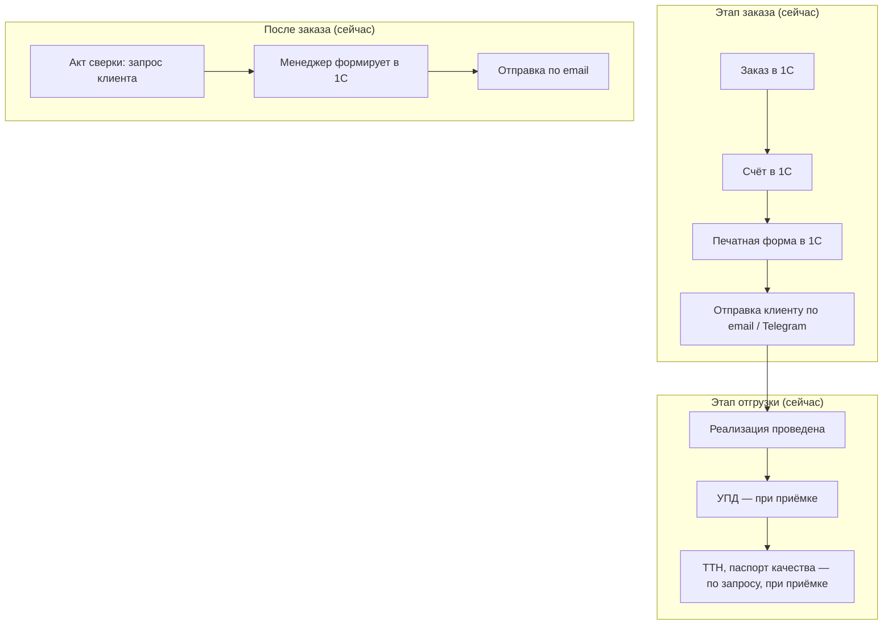
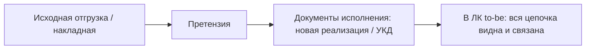

# ЧТЗ: Документооборот

**Статус:** драфт  
**Источники:** Понимание задачи, саммари интервью 2026-02-24 (процесс заказа JTBD), 2026-03-02 (документы, роли, нестандартный заказ), 2026-03-13 (1С обмен данными), 2026-03-17 (претензии), ЧТЗ 09 (интеграция с 1С).  
**As-is / To-be:** as-is — как есть сейчас, **без** ЛК (счёт и документы — по email, при приёмке; акт сверки по запросу менеджеру). to-be — с новым сайтом и ЛК (раздел 4 и целевая схема ниже).

---

## 1. Назначение

Описывает состав документов в рамках заказа, после него и в связанных сценариях исполнения претензий; способы их формирования (`1С`), выдачи клиенту (ЛК, email, в перспективе ЭДО) и запросов со стороны клиента. Цель — обеспечить клиенту доступ к счетам, накладным, актам сверки, сертификатам качества и документам исполнения по претензии без ожидания менеджера.

---

## 2. Термины (общие)

| Термин | Описание |
|--------|----------|
| УПД | Универсальный передаточный документ; обязателен при отгрузке, остаётся у клиента и водителя |
| ТТН | Товарно-транспортная накладная; по запросу клиента |
| Паспорт качества | На партию продукции; формируется в 1С, с печатью/подписью (факсимиле); по запросу или признаку клиента |
| ЭДО | Электронный документооборот; на старте не используется массово; в перспективе — счета, акты сверки (Контур) |
| Акты сверки | Запрашиваются клиентом; формирует менеджер по сопровождению; ожидание формирования — боль клиента (выходной, очередь) |

---

## 3. As-is: выдача документов сейчас (без ЛК)

ЛК и витрины пока нет. Счёт формируется в 1С, печатную форму менеджер отправляет клиенту по email (или в тот же канал — Telegram). При отгрузке УПД/ТТН/паспорт качества вручаются при приёмке; акт сверки — по запросу клиента, формирует менеджер в 1С, отправляет по email. Ожидание формирования акта — боль клиента (очередь, выходной).

### 3.1 To-be: целевой процесс с ЛК

В ЛК клиенту будут доступны счёт, УПД, ТТН, паспорт качества (просмотр/скачивание); запрос акта сверки из ЛК. Для претензий хронология документов должна сохраняться как последовательность связанных сущностей: исходная отгрузка / исходный заказ, сама претензия, документы исполнения по претензии (`новая реализация`, `новая отгрузка`, `УКД`, возврат / корректировка). Исходный документ не заменяется и не перезаписывается.

---

## 4. To-be: требования (драфт)

### 4.1 Счёт на оплату

- Формирование в 1С (менеджер по сопровождению или автоматически по правилам). Печатная форма счёта: доступна в ЛК, отправка на email клиенту.
- В перспективе: генерация черновика счёта в ЭДО (Контур), отправка в ЭДО по согласованию.
- Рабочее допущение по транспортному формату файлов из `1С`: для MVP допустима передача файла как `base64` внутри `JSON` вместе с метаданными (имя, расширение / MIME-тип, размер). По текущим вводным ограничений по размеру не ожидается, документов **более 10 МБ не планируется**.

### 4.2 Документы отгрузки

- **УПД** — обязательный документ при приёмке груза; формируется в 1С при отгрузке (расходный ордер / отправка). **Решение по MVP (2026-03-25, вариант A):** после того как отгрузка отражена в 1С, в ЛК доступно **получение УПД** через **единый понятный сценарий** — действие клиента инициирует **запрос в 1С**, ответ — файл/поток для просмотра или скачивания; **файл УПД на платформе не храним** (как по интервью 2026-03-02). До факта отгрузки в 1С выдача УПД в ЛК недоступна.
- **ТТН** — по запросу; отдельный документ в 1С, печатная форма. В ЛК — возможность запросить ТТН по заказу, если он сформирован.
- **Паспорт качества** — на партию продукции; формируется в 1С. В ЛК: кнопка «Получить паспорта качества» по заказу/отгрузке; по признаку клиента можно автоматически включать паспорта в пакет отгрузочных документов (уточнить с заказчиком).

### 4.3 Акты сверки

- Клиент может запросить акт сверки из ЛК. Заявка уходит менеджеру по сопровождению; формирование в 1С, отправка клиенту (email или ЭДО). Подписание в ЭДО — бухгалтер. **История запросов/формирования актов в ЛК не ведётся** — достаточно хранения самих документов и возможности их скачать (решение по итогам интервью 2026-03-02).
- Для документов, которые формируются по запросу, нужно согласовать технический сценарий интеграции: платформа инициирует запрос в 1С по API, получает готовый файл/ссылку или статус отложенного формирования.

### 4.4 Сертификаты и техническая документация

- Запрос и предоставление сертификатов и связанной документации по оплаченному заказу — по Пониманию задачи:
  - **Паспорт качества** — формируется в 1С; логика запроса/выдачи описана выше.
  - **Паспорт безопасности**, **TDS (лист технических данных) / MSDS**, **СГР (Свидетельство о госрегистрации)**:
    - создаются/поддерживаются маркетингом и профильными подразделениями;
    - сейчас могут храниться вне 1С и рассылаться менеджерами адресно, только подтверждённым/реальным B2B‑клиентам;
    - **to-be:** если эти документы должны быть доступны клиенту в ЛК, они должны быть **предварительно загружены/связаны в 1С** и уже оттуда выдаваться на платформу;
    - если документ не загружен в 1С, он не считается частью автоматизированного контура ЛК и остаётся в ручной выдаче менеджером.

### 4.5 Договоры и допсоглашения (из 1С)

- По итогам интервью 2026-03-13: в 1С к карточке **договора** можно **прикреплять файлы** (сам договор, дополнительные соглашения, иные вложения).
- Платформа получает файлы договора напрямую из 1С — нет отдельного файлового хранилища вне 1С.
- Транспортный формат: JSON + `base64` + метаданные (имя, расширение / MIME-тип, размер) — аналогично остальным документам.
- В ЛК клиенту доступны: действующий договор, допсоглашения, история изменений (если нужно — уточнить scope для MVP).

### 4.6 ЭДО (перспектива)

- Понимание задачи: ЭДО (Контур) — заведение черновиков, счета и акты сверки в одностороннем режиме.
- **«Честный знак»** (саммари 2026-03-13): продукты Palizh (шпатлёвка) уже подпадают под «Честный знак»; передача УПД должна идти через ЭДО. К 2027–2028 годам по остальным ЛКМ требования усилятся → фактически **все контрагенты будут вынуждены перейти к ЭДО**.
- Текущее состояние: ~50/50 клиентов работают по ЭДО; менеджер по сопровождению регулярно подключает клиентов к ЭДО (раз в 1–2 месяца срезы).
- В ЧТЗ заложить возможность подключения ЭДО без переработки базового потока документов; оценить интеграцию платформы с ЭДО как задел, но не делать «в лоб» в MVP.

### 4.6 Документы и хронология при претензии

- В документообороте по претензии нужно различать:
  - **документы подачи претензии**: форма на платформе, вложения клиента (`фото`, `видео`, при необходимости документы);
  - **внутренние документы процесса**: служебная записка, материалы и итоговое письмо во внутреннем контуре `Mass Project`;
  - **клиентские документы исполнения**: новые реализации / новые отгрузки, `УКД`, возвраты, корректировки и иные документы, которые подтверждены в `1С`.
- Для ЛК и автоматизированной выдачи действует правило:
  - документы внутреннего разбора из `Mass Project` не считаются автоматически доступными клиенту;
  - клиентский ЛК получает только те документы, которые подтверждены платформой и/или `1С`;
  - если итоговое письмо по претензии потребуется показывать в ЛК, для него нужно отдельно согласовать источник и способ выдачи.
- Типовые сценарии хронологии:
  - **недопоставка**: исходная отгрузка -> претензия -> новая реализация / новая отгрузка на недостающее количество;
  - **замена по качеству**: исходная отгрузка -> претензия -> `УКД` по исходной реализации + новая реализация / новая отгрузка;
  - **излишек**: исходная отгрузка -> претензия -> возврат / корректировка, при необходимости `УКД`;
  - **бой**: исходная отгрузка -> претензия -> `УКД` и/или новая реализация / новая отгрузка по принятому решению.
- В интерфейсе ЛК нужно показывать не абстрактную строку `претензия закрыта`, а понятную для клиента цепочку связанных документов и событий: что было изначально, какое решение принято и какие документы на исполнение уже выпущены.

---

## 5. Открытые вопросы

- ~~Полный перечень документов для MVP~~ — по итогам интервью 2026-03-02 подтверждено: счёт, УПД, ТТН, паспорт качества, акт сверки.
- ~~В каком виде выдавать документы в ЛК~~ — для MVP выдача документов в ЛК (печатные формы/PDF); ЭДО вынесено в развитие.
- ~~Признак «клиенту нужны паспорта качества по умолчанию»~~ — решено хранить/учитывать на стороне 1С с передачей на платформу.
- Кто чаще инициирует запрос акта сверки — клиент или компания? Приоритет документов для перевода в ЭДО в рамках платформы.
- Какой режим выдачи документов использовать по каждому типу: online по запросу из 1С, хранение копии на платформе, ссылка на ЭДО или комбинация вариантов.
- **Образцы документов для проектирования:** получить от заказчика образцы/шаблоны (счёт, УПД, ТТН, паспорт качества, акт сверки) — см. [Реестр документов для проектирования](../Интервью%20и%20встречи/Реестр_документов_для_проектирования.md); после получения зафиксировать форматы в данном ЧТЗ.
- **Доступ к TDS, паспортам безопасности и СГР:** какие из этих документов должны быть загружены в 1С для выдачи через ЛК, а какие остаются только в ручной выдаче менеджерами; как контролировать доступ (по договору, по роли, по типу клиента).
- Для претензий: нужно ли показывать в ЛК итоговое письмо / заключение по разбору претензии, или клиенту достаточно статуса и документов исполнения из `1С`.
- Формализовать точный контракт транспортного ответа по файлам из `1С`: имя файла, тип / MIME, размер, кодировка и признак, что файл может быть показан inline или только скачан.

---

## 6. Связь с другими ЧТЗ и артефактами

| Блок | Связь |
|------|--------|
| Процесс оформления заказа | Счёт формируется после заказа; доступ в ЛК — часть флоу заказа (ЧТЗ 01) |
| Доставка | УПД/ТТН вручаются при приёмке; статус «документы готовы» может влиять на уведомления (ЧТЗ 03) |
| Претензии | При претензии — форма подачи, вложения, документы исполнения (`новая реализация`, `новая отгрузка`, `УКД`, возврат / корректировка); хронология не заменяется (ЧТЗ 04) |
| Интеграция с 1С | Источник документов, API выдачи, формат печатных форм и запрос документов из ЛК (ЧТЗ 09) |
| Реестр документов для проектирования | [Интервью и встречи / Реестр документов для проектирования](../Интервью%20и%20встречи/Реестр_документов_для_проектирования.md) — список документов, образцы которых нужны для проектирования выдачи в ЛК и обмена с 1С |
| Саммари интервью | [2026-03-02 документы/роли](../Интервью%20и%20встречи/Саммари/2026-03-02_документы_роли_нестандартный_заказ_саммари.md), [2026-03-13 1С обмен](../Интервью%20и%20встречи/Саммари/2026-03-13_1С_обмен_данными_саммари.md) — договоры из 1С, ЭДО, base64, «Честный знак» |
