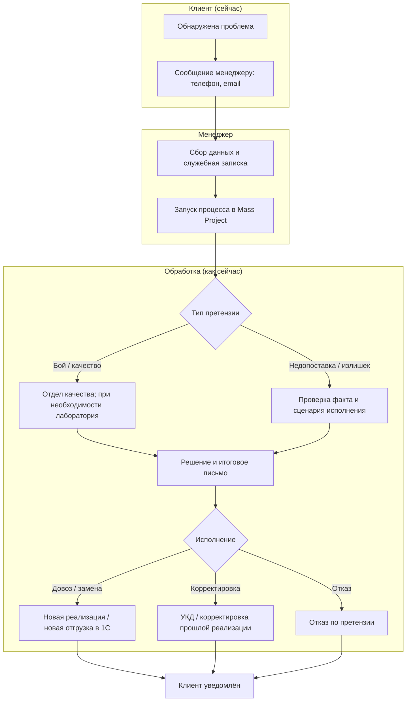
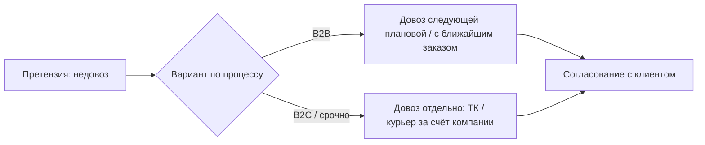

# ЧТЗ: Претензии

**Статус:** драфт  
**Источники:** Понимание задачи, саммари интервью 2026-02-24 (процесс заказа JTBD), саммари интервью 2026-03-17 (претензии), ЧТЗ 09 (интеграция с 1С).  
**As-is / To-be:** as-is — как есть сейчас, **без** ЛК (клиент сообщает о претензии менеджеру по телефону/email/в мессенджере; менеджер оформляет служебную записку и запускает внутренний процесс в `Mass Project`; разбор ведут отдел качества, лаборатория, логистика и смежные участники). to-be — форма претензии в ЛК, компактные статусы в ЛК, хронология документов и исполнение через `1С` (разделы 4–5); интеграция выполняется **только с 1С**, `Mass Project` остаётся чисто внутренним инструментом (без прямой интеграции с платформой).

---

## 1. Назначение

Описывает типы претензий клиента по отгрузке и качеству, способ их подачи через платформу (форма в ЛК **в контексте заказа**, единый раздел с общими обращениями — см. Инфарх), связь с `1С` (документы, статусы, новые отгрузки/реализации) и итоговые действия (довоз, замена, возврат, зачёт). **Нестандартная заявка** (запрос вне типового заказа из каталога) — **не** этот раздел; см. ЧТЗ 01 §4.5. Внутренний процесс разбора претензий в `Mass Project` сохраняется, но **не интегрируется напрямую** с платформой: платформа работает только с теми данными, статусами и документами, которые подтверждены в `1С` или зафиксированы платформой на этапе подачи. Цель — дать клиенту единую точку входа для претензии, прозрачный статус рассмотрения и понятную связь претензии с последующим исполнением.

---

## 2. Термины (общие)

| Термин | Описание |
|--------|----------|
| Претензия | Возражение по продукции или отгрузке: бой, недопоставка, излишек, некачественный продукт и т.д. |
| Mass Project | Внутренняя система, в которой менеджер запускает бизнес‑процесс претензии, прикладывает служебную записку и вложения; прямой интеграции с платформой нет, для ЛК источником данных выступает `1С` и платформа |
| Служебная записка | Внутренняя структурированная форма по претензии; сейчас заполняется менеджером, в будущем может стать основой формы в ЛК |
| Коммерческий акт ТК | Документ транспортной компании, который нужно оформить при бое/повреждении при внешней доставке |
| Отдел качества | Владелец бизнес‑процесса по претензиям; рассматривает материалы и формирует итоговое решение |
| Лаборатория | Подключается по претензиям к качеству и проводит дополнительную проверку продукта |

---

## 3. As-is: классификация и обработка претензий (сейчас)

Клиент сообщает о проблеме менеджеру (телефон, email, мессенджер). Менеджер собирает исходные данные, оформляет служебную записку и запускает претензию во внутренней системе `Mass Project`. Дальше — разбор: по качеству и бою основным владельцем процесса выступает отдел качества, при необходимости подключаются лаборатория, логистика и ТК. Итог: довоз, замена, возврат, зачёт или отказ. Хронологию документов в `1С` не заменяют (исходная отгрузка + корректировка / новая реализация видны отдельно); для ЛК источником документов и клиентских статусов является `1С` и сама платформа на этапе подачи.

### 3.1 Классификация претензий (драфт)

| Тип | Описание | Что обычно прикладывает клиент | Кто разбирает | Итог (типовой) |
|-----|----------|---------------------------------|----------------|-----------------|
| Бой | Повреждение продукции, чаще при доставке ТК | Фото боя; при нарушении целостности — коммерческий акт ТК | Отдел качества; при необходимости ТК и логистика | Замена / довоз / иное решение по регламенту |
| Недопоставка | Клиент получил меньше товара, чем ожидалось | Обычно описание ситуации; фото обычно не обязательны | Менеджер + отдел качества / логистика по ситуации | Новая реализация / новая отгрузка на недостающее количество |
| Излишек / лишняя поставка | Клиент получил больше, чем должен был | Обычно описание ситуации | Менеджер + отдел качества / логистика по ситуации | Клиент оставляет товар или организуется возврат / корректировка |
| Некачественный продукт | Несоответствие качества или результата, в т.ч. по цвету | Фото / видео, описание проблемы | Отдел качества + лаборатория | Замена, корректировка, возврат, отказ |

*Точный перечень обязательных полей формы и вопросов из действующей служебной записки ещё нужно получить от заказчика.*

---

### 3.2 As-is: текущий поток обработки (без формы в ЛК)

### 3.3 Довоз при недовозе (B2B vs B2C — оба варианта)

По интервью: в B2B часто довозят следующей плановой машиной или с ближайшим заказом; в B2C — могут везти отдельно (ТК/курьер) за счёт компании, не дожидаясь следующего заказа. В ЧТЗ описать оба сценария; выбор — по правилам компании/договору.

### 3.4 Возврат товара (лишнее у клиента) — сейчас

Клиент сообщает о лишнем; заказ на возврат оформляет **менеджер** (или помогает отдел качества, ПЭО). Логисты занимаются организацией забора груза. Оформление возврата в 1С — менеджер.

---

## 4. To-be: хронология документов и форма в ЛК

При претензии **не заменять** исходную отгрузку в ЛК — отображать исходный заказ / отгрузку и карточку претензии отдельно. В текущем `MVP` клиент видит форму подачи и карточку со статусом `Отправлена`; дальнейшее исполнение и документы по претензии находятся за пределами платформы. После `MVP` можно вернуться к сценарию, где в ЛК отражаются дополнительные результаты исполнения по данным `1С`. См. ЧТЗ «Документооборот».

---

## 5. To-be: требования (драфт)

### 5.1 Форма претензии в ЛК

- Форма претензии в ЛК должна базироваться на действующей **служебной записке**. Минимально учитывать:
  - тип претензии (`бой`, `недопоставка`, `излишек`, `некачественный продукт`);
  - привязку к заказу / отгрузке / накладной;
  - описание ситуации;
  - обязательные ответы на вопросы из служебной записки;
  - вложения (`фото`, `видео`, при необходимости скан/фото документов).
- Для сценария `бой при доставке ТК` в форме или в подсказках нужно явно сообщать клиенту о необходимости оформить **коммерческий акт ТК**.
- После отправки формы платформа создаёт карточку претензии и внутреннее обращение для команды (без прямой интеграции с `Mass Project`).
- Для текущего `MVP` дальнейшие действия по претензии происходят **за пределами платформы**: команда работает через почту, `Mass Project`, CRM и другие внутренние контуры.
- В момент создания претензии платформа должна отправлять внутреннее уведомление по настроенным каналам / адресатам (см. ЧТЗ 10 и ЧТЗ 12).

#### 5.1.1 Черновой состав полей формы претензии

- Блок `Идентификация претензии`:
  - номер / ID претензии на платформе;
  - дата и время подачи;
  - клиент / компания;
  - контактное лицо;
  - email;
  - телефон.
- Блок `Привязка к отгрузке`:
  - заказ;
  - отгрузка / реализация;
  - накладная / УПД;
  - дата получения товара;
  - способ доставки (`своя машина` / `ТК`);
  - транспортная компания, если применимо.
- Блок `Тип и суть претензии`:
  - тип претензии (`бой`, `недопоставка`, `излишек`, `некачественный продукт`);
  - краткое описание проблемы;
  - подробный комментарий клиента;
  - список проблемных позиций.
- Блок `Позиции и количество`:
  - товар / артикул / наименование;
  - заказанное количество;
  - фактически полученное количество;
  - количество, по которому есть претензия;
  - единица измерения;
  - комментарий по конкретной позиции.
- Блок `Материалы и подтверждения`:
  - фото;
  - видео;
  - сканы / фото документов;
  - дополнительные комментарии;
  - подтверждение, что клиент приложил все имеющиеся материалы.

#### 5.1.2 Условные поля по типу претензии

- Для `бой`:
  - характер повреждения;
  - зафиксировано ли повреждение при приёмке;
  - есть ли **коммерческий акт ТК**;
  - приложены ли фото повреждений.
- Для `недопоставка`:
  - по каким позициям и в каком количестве есть недостача;
  - обнаружена ли недостача сразу при приёмке;
  - есть ли комментарий по упаковкам / местам.
- Для `излишек`:
  - какие позиции получены сверх заказа;
  - сколько единиц лишних;
  - где товар сейчас находится и в каком состоянии.
- Для `некачественный продукт`:
  - в чём выражается проблема качества;
  - когда и в каких условиях она проявилась;
  - фото / видео дефекта;
  - нужно ли дополнительно приложить материалы для лаборатории (`Rub-Out` и др. — уточнить отдельно).

#### 5.1.3 Черновые правила UX для формы

- Пользователь должен выбирать претензию из конкретного заказа / отгрузки, а не вводить всё вручную с нуля.
- После выбора заказа часть данных подставляется автоматически: компания, номер заказа, номер документа, состав заказа, дата отгрузки.
- Для сценария `бой` при доставке `ТК` система должна явно показать подсказку про **коммерческий акт ТК** до отправки формы.
- Форма должна поддерживать несколько строк товаров в одной претензии, если проблема относится к одной отгрузке.
- После отправки клиент должен видеть карточку претензии с ID, датой подачи, статусом `Отправлена` и списком прикреплённых материалов.

### 5.2 Статусы претензии в ЛК

- Для `MVP` в ЛК фиксируется упрощённая модель статуса претензии:
  - `Отправлена`.
- Это означает:
  - клиент видит факт отправки претензии и её сохранение в истории ЛК;
  - платформа **не обновляет** дальнейшие статусы претензии;
  - платформа **не отображает** внутренние этапы разбора, решения и исполнение претензии;
  - дальнейшие действия по претензии происходят за пределами платформы.
- Ранее обсуждавшаяся расширенная модель статусов (`На рассмотрении`, `Удовлетворена / одобрена`, `Отказана`) может рассматриваться как направление после `MVP`, но в текущую реализацию не входит.

### 5.3 Документы при претензии

- По бизнес-процессу вне платформы по итогам рассмотрения претензии могут появляться:
  - **новая реализация / новая отгрузка** на довоз или замену;
  - **УКД / корректировочный счёт-фактура** для корректировки ранее проведённой реализации;
  - иные связанные документы исполнения.
- Однако для текущего `MVP` эти документы и этапы **не отображаются в карточке претензии ЛК**.
- Итоговое письмо / заключение по претензии формируется во внутреннем процессе `Mass Project` и отправляется клиенту менеджером по email вне платформы.
- Для `MVP` претензия в ЛК служит подтверждением факта отправки и хранением материалов клиента, а не интерфейсом дальнейшего сопровождения претензионного процесса.

---

## 6. Открытые вопросы

- ~~Получить точный перечень обязательных полей и вопросов из действующей служебной записки~~ — базовый состав полей зафиксирован в ЧТЗ; детализация UX-формы уточняется на этапе проектирования.
- ~~Подтвердить нормативные сроки рассмотрения~~ — нормативы зафиксированы в рабочих материалах и синхронизированы с реестром.
- После `MVP`: нужно ли возвращаться к расширенной модели статусов претензии в ЛК и как получать эти статусы из внешнего контура.
- После `MVP`: требуется ли показывать клиенту в ЛК итоговое письмо / заключение по претензии и документы исполнения, и через какой подтверждённый источник.
- ~~Какие именно каналы и адресаты внутренних уведомлений должны настраиваться для претензий в админке~~ — в текущем контуре зафиксирован email (прочие каналы post-MVP).
- Формат претензий (в т.ч. `Rub-Out`) — по Пониманию задачи уточнить.

---

## 7. Связь с другими ЧТЗ

| Блок | Связь |
|------|--------|
| Документооборот | Корректировочные документы, хронология накладных (ЧТЗ 02) |
| Доставка | Довоз/забор своей машиной или ТК (ЧТЗ 03) |
| Процесс оформления заказа | Претензия привязана к заказу/отгрузке; исполнение после одобрения может идти как новый заказ / новая отгрузка (ЧТЗ 01) |
| Интеграция с 1С | Корректировочные документы, новые реализации, довозы, возвраты и связи между исходной отгрузкой и претензией (ЧТЗ 09) |
| Уведомления | Клиентские события по претензии и по последующей отгрузке исполнения (ЧТЗ 10) |
| Техническая часть | Прикладной черновик полей формы, UX-правил и API-контракта: [Форма_претензии_UI_API.md](../Техническая%20часть/Форма_претензии_UI_API.md) |
