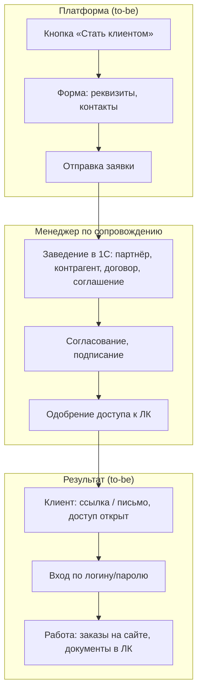
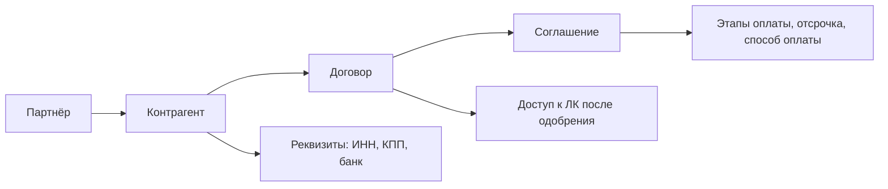

# ЧТЗ: Регистрация и онбординг клиента

**Статус:** драфт  
**Источники:** Понимание задачи, саммари интервью 2026-02-24 (процесс заказа JTBD), 2026-03-02 (документы, роли, нестандартный заказ), 2026-03-13 (1С, обмен данными, регистрация/активация), ЧТЗ 09 (интеграция с 1С).  
**As-is / To-be:** as-is — как сейчас новый клиент попадает в компанию **без** сайта (обращение по телефону/почте, менеджер заводит в 1С, договор подписывают очно и т.д.). to-be — с новым сайтом: кнопка «Стать клиентом», форма заявки (телефон, email, ИНН/КПП), генерация GUID заявки на платформе, передача заявки менеджеру, ручная привязка в 1С и активация контрагента; после этого клиент может завершить регистрацию/авторизацию по email. Заявка связана с 1С: контрагент, договор и соглашение ведутся в 1С; механизм передачи GUID и внешних ID описан совместно с ЧТЗ 09.

---

## 1. Назначение

Описывает процесс «стать клиентом»: от заявки на регистрацию до появления в 1С контрагента, договора и соглашения и до одобрения доступа к ЛК. На старте полноценной саморегистрации с авто-одобрением не предполагается: заявка с платформы уходит менеджеру по сопровождению, который дозаводит данные в 1С и после подписания договора/согласования даёт клиенту доступ к платформе.

---

## 2. Термины (общие)

| Термин | Описание |
|--------|----------|
| Партнёр | Справочник 1С: публичное название, признак (клиент, поставщик и т.д.) |
| Контрагент | Справочник 1С: реквизиты (ИНН, КПП, наименование, банк), взаиморасчёты |
| Договор | В 1С: привязка к контрагенту, отсылка к месту ведения взаиморасчётов (соглашение) |
| Соглашение | В 1С: этапы оплаты, способ оплаты (предоплата/постоплата), проценты, даты сдвига (отсрочка) |
| Менеджер по сопровождению | Заведение контрагента, договора, соглашения в 1С; установка признака активности; согласование с клиентом; одобрение доступа к ЛК |
| GUID заявки на платформе | Уникальный идентификатор заявки/будущего клиента, генерируемый платформой и передаваемый в 1С как внешний ID для привязки |

---

## 3. As-is: как новый клиент появляется сейчас (без сайта)

Нового клиента заводит региональный менеджер: обращение по телефону, почте или личный визит; региональный менеджер запрашивает реквизиты и карточку партнёра, формирует коммерческое предложение (КП без фиксированной формы — счёт или условия в письме). **Договор** заключают от суммы первого заказа **от 120 тыс. руб.**; при сумме меньше — в 1С заводят «строчку по счёту», отгрузка по 100% предоплате без отдельного договора по ставке. Есть несколько шаблонов договора; редактирование шаблона клиентом не допускается — при возражениях клиент оформляет **протокол разногласий** → задача в **MasProject** → юрист (при необходимости ПЭО, отдел качества). Чаще подписывают стандартный договор. После подписания подписанный скан или документ через ЭДО вкладывают в 1С в карточку контрагента/договора; юрист отмечает в программе. **ЭДО:** не у всех клиентов; менеджер по сопровождению ведёт подключение к ЭДО (срезы раз в 1–2 месяца). После подписания клиент получает доступ к работе с компанией (заказы по Telegram/email и т.д.). Отдельного «ЛК» или «входа на сайт» сейчас нет.

### 3.1 To-be: целевой процесс с сайтом (заявка с платформы → доступ к ЛК)

На новом сайте появится кнопка «Стать клиентом» и форма заявки; заявка уйдёт менеджеру; далее — заведение в 1С, подписание договора, одобрение доступа к ЛК; клиент получит ссылку/письмо и вход по логину и паролю.

### 3.2 Сущности в 1С (общие для as-is и to-be)

### 3.3 Варианты онбординга to-be (драфт)

| Вариант | Описание | На старте |
|---------|----------|-----------|
| A. Заявка с платформы | Клиент заполняет форму → заявка менеджеру → менеджер заводит в 1С, подписывает договор, одобряет | Да |
| B. Саморегистрация с авто-одобрением | Клиент вводит ИНН и т.д., система создаёт черновик контрагента, клиент сразу в ЛК с ограничениями до подписания договора | Нет |
| C. Только по приглашению | Менеджер заранее заводит контрагента в 1С и отправляет клиенту ссылку для входа / смены пароля | Уточнить |

---

## 4. To-be: требования (драфт)

### 4.1 Страница / форма «Стать клиентом»

- Публичная опция на сайте (или в ЛК без авторизации): кнопка «Стать клиентом» / «Оставить заявку».
- Форма собирает минимум: наименование организации/ИП, **ИНН, КПП**, контактное лицо, **email и телефон** для связи, при необходимости — адрес, комментарий. Обязательные поля — согласовать с заказчиком (минимум для создания заявки).
- При отправке формы платформа **генерирует GUID заявки/будущего клиента** и сохраняет его как внешний идентификатор для дальнейшей привязки к контрагенту в 1С (см. ЧТЗ 09).
- После отправки: сообщение «Заявка принята, мы свяжемся с вами»; заявка с реквизитами (ИНН, КПП, контакты, GUID) уходит менеджеру по сопровождению (в CRM, почту, админку платформы — уточнить канал).

### 4.2 Роль менеджера по сопровождению и привязка в 1С

- Менеджер получает заявку с ИНН/КПП, телефоном, email и GUID, при необходимости запрашивает карточку предприятия/ИП и дополнительные реквизиты.
- Заведение/привязка в 1С:
  - при отсутствии контрагента — создание партнёра и контрагента (реквизиты, банк, контакты) вручную;
  - создание/привязка договора и соглашения (этапы оплаты, способ оплаты, отсрочка);
  - **запись GUID заявки платформы в карточке контрагента** как внешнего идентификатора для обратной связи с платформой;
  - установка необходимого признака в карточке контрагента (например, флага **«активность»**), который определяет, что клиент может работать через платформу.
- Договор от 120 тыс. руб.; при протоколе разногласий — согласование через MasProject (юрист, при необходимости ПЭО, отдел качества). Подписание — очно или через ЭДО; подписанный скан/документ ЭДО вкладывают в 1С, юрист отмечает. Инициатор отправки договора клиенту — менеджер по сопровождению.
- На MVP заявка с платформы **не создаёт** контрагента автоматически в 1С: она поступает менеджеру как задача/уведомление; далее менеджер вручную заводит/привязывает сущности в 1С и отмечает клиента как активного. Автоматизация «черновика контрагента/договора» по API относится к расширениям (ЧТЗ 09).
- После согласования и подписания договора и активации контрагента в 1С:
  - платформа на основании присутствия GUID и признака активности в 1С считает заявку одобренной;
  - создаётся учётная запись пользователя с логином = указанному в заявке **email**;
  - клиенту отправляется письмо-приглашение с ссылкой на установку пароля/завершение регистрации.

### 4.3 Авторизация после одобрения

- Вход по email (логину) и паролю, где email — тот, который был указан в заявке и по которому пришло приглашение. Возможность смены пароля, восстановление пароля по email — стандартные сценарии.
- Связь учётной записи с контрагентом в 1С осуществляется через **GUID заявки/внешний ID**, записанный в **карточке контрагента**; признак «активность» в карточке контрагента определяет, имеет ли пользователь право авторизоваться и оформлять заказы.
- **Email не используется как единственный ключ связки** (интервью 2026-03-13): email может отличаться между платформой и 1С (корпоративный vs личный директора), быть опечатанным или не совпадать. Основной ключ — **GUID контрагента/заявки**, а ИНН/КПП — атрибуты для поиска и верификации.

### 4.3.1 Пошаговый процесс регистрации клиента (MVP, через email)

1. Гость на сайте нажимает `Стать клиентом` и заполняет форму (ИНН/КПП, контакты, email).
2. Платформа создаёт заявку, присваивает `GUID` и отправляет уведомление менеджеру по сопровождению.
3. Менеджер проверяет заявку, при необходимости уточняет данные, заводит/привязывает контрагента, договор и соглашение в 1С.
4. После подтверждения договора и активации контрагента в 1С платформа разрешает создание учётной записи клиента.
5. Платформа отправляет на email клиента письмо-приглашение со ссылкой на установку пароля.
6. Клиент переходит по ссылке, задаёт пароль, подтверждает вход.
7. После входа клиент получает доступ к ЛК в рамках роли мастер-аккаунта компании (директор/ответственный).

### 4.4 Валидация и отображение статуса

- На этапе «заявка подана, ожидает обработки» клиент может видеть статус в личном кабинете без полного доступа (опционально): «Заявка на рассмотрении» — если дать ограниченный вход по ссылке из письма. Или уведомления только по email: «Ваш доступ к ЛК открыт».
- Валидация реквизитов: проверка ИНН (контрольная сумма), при наличии API ФНС — проверка актуальности организации. Опционально на этапе заявки или при заполнении профиля компании в ЛК.

### 4.5 Работа только с юрлицами

- На старте платформы — только юрлица (ИП, ООО и т.д.) с заключением договора. Полноценного B2C (физлица без юрлица) не предусмотрено — по Пониманию задачи и интервью.

---

## 5. Открытые вопросы

- ~~Нужен ли клиенту ограниченный доступ к ЛК до подписания договора~~ — зафиксировано: доступ в ЛК только после одобрения/активации в 1С.
- ~~Распределение заявок «стать клиентом» между менеджерами~~ — распределение остаётся на стороне 1С и не входит в контур платформы.
- Интеграция с 1С: создание контрагента/договора из платформы (черновик) или только ручное заведение менеджером в 1С после заявки.
- Техническая реализация хранения `GUID заявки` и флага `активность` в карточке контрагента 1С: конкретные поля/реквизиты, формат значения, сценарии повторной заявки и дублей.
- Сроки и объём перевода клиентов на ЭДО (зависит от законодательства; сейчас подключение ведётся активно).
- **Образцы документов для проектирования:** шаблон договора, протокол разногласий, пример КП — см. [Реестр документов для проектирования](../Интервью%20и%20встречи/Реестр_документов_для_проектирования.md) (вопрос в Реестре открытых вопросов № 25).

---

## 6. Связь с другими ЧТЗ

| Блок | Связь |
|------|--------|
| Процесс оформления заказа | Оформление заказа доступно только после одобрения и привязки к контрагенту (ЧТЗ 01) |
| Документооборот | Договор и соглашение определяют условия оплаты и выдачи документов (ЧТЗ 02) |
| Доставка | Адрес доставки и правила из договора/1С (ЧТЗ 03) |
| Интеграция с 1С | Создание/связывание контрагента, договора и соглашения; внешние ID и механизм обмена по заявке (ЧТЗ 09) |
| Реестр документов для проектирования | [Интервью и встречи / Реестр документов для проектирования](../Интервью%20и%20встречи/Реестр_документов_для_проектирования.md) — образцы договора, КП, протокола разногласий для проектирования онбординга |
