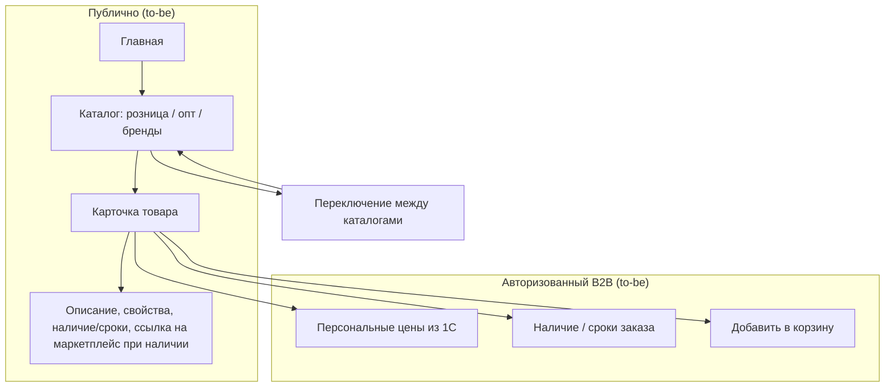

# ЧТЗ: Витрина и каталог

**Статус:** драфт  
**Источники:** Понимание задачи, саммари интервью 2026-02-24, 2026-03-02, 2026-03-03 (маркетинг, витрина, каталог, обучение), 2026-03-04 (цены, поиск), Инфарх (информационная архитектура), ЧТЗ 09 (интеграция с 1С).  
**As-is / To-be:** as-is — как сейчас клиент получает информацию о товарах **без** новой B2B‑платформы: есть витринные каталоги на текущем сайте (`https://palizh.com/catalog/` для B2C и `https://palizh.com/catalog-industry/` для B2B) **без цен**, а каталог и цены для работы менеджеров живут в 1С, прайсы/предложения присылаются по запросу. to-be — новый сайт B2B‑платформы с витриной и каталогами (раздел 4), интегрированный с 1С и ЛК.

---

## 1. Назначение

Описывает публичную часть и каталоги платформы: главная, каталоги (розница, опт, по брендам), карточка товара, фильтры, сортировки. **Каталог «по брендам» — это альтернативное представление того же ассортимента, где навигация начинается с бренда/производителя (не отдельный B2C/B2B‑контур).** Мастер-данные — 1С (PIM); на платформе отображаются остатки, сроки производства, для авторизованного клиента — персональные цены. Цель — единая витрина с переключением между каталогами и корректным отображением ассортимента и условий.

---

## 2. Термины (общие)

| Термин | Описание |
|--------|----------|
| PIM | 1С — хранение и обработка информации о товарах: фото, описания, свойства, категории |
| Каталог (розница / опт / бренды) | Отдельные представления ассортимента с своими категориями, свойствами и набором товаров. **«По брендам»** — представление, где первый уровень навигации/группировки — **бренд/производитель** |
| Архивная / снятая с производства номенклатура | Товар, который больше не должен участвовать в обычной витрине как актуальная позиция, но может сохраняться в истории заказов и, если есть остаток, оставаться доступным к заказу |
| Сроки производства | Для номенклатур «свыше складской программы» — когда товар будет доступен |

---

## 3. As-is: как клиент узнаёт о товарах сейчас (без витрины B2B‑платформы)

Отдельной витрины **B2B‑платформы** сейчас нет. Есть текущий сайт Palizh с витринными каталогами товаров **без цен**:

- для B2C — `https://palizh.com/catalog/`;
- для B2B — `https://palizh.com/catalog-industry/`.

Эти каталоги используются как ознакомительная витрина ассортимента; для фактической работы с заказами и ценами основной источник — 1С. Каталог и цены для менеджеров хранятся в 1С; клиент получает актуальную информацию через менеджера: прайсы, предложения по email/Telegram, обсуждение по телефону. Персональные цены и условия — в 1С по контрагенту; заказ формируется разрозненно (см. ЧТЗ 01 as-is).

### 3.1 To-be: целевая витрина и доступ (новый сайт)

На новом сайте будет главная, каталоги (розница / опт / бренды), карточка товара.

- **Гости (незарегистрированные):** видят открытую витрину **без цен**; доступно название товара, описание, свойства, остатки/сроки, если это допустимо по бизнес-правилам. **Корзина и оформление заказа недоступны**. Для B2B‑продукции — кнопка `Уточнить оптовые условия` / переход в форму/чат. Если из `1С` по товару приходит ссылка на маркетплейс, гость может перейти на маркетплейс прямо из карточки товара.  
- **Авторизованный B2B‑клиент:** персональные цены из 1С по своему соглашению, наличие, кнопка `В корзину`.  

Переключение между каталогами без потери контекста.

---

## 4. To-be: требования (драфт)

### 4.1 Главная и навигация

- Главная: витрина, переключение языка (на старте — русский; заложить мультиязычность), форма обращений, новости, о компании — по Инфарх и Пониманию задачи.
- **Баннерная зона на главной:** управляемые баннеры (маркетинг) для анонса новинок, акций, событий, обучающих мероприятий; по клику — переход либо на страницу конкретной акции/мероприятия, либо в общий раздел «Акции».
- Навигация между каталогами (розница, опт, по брендам) — кросс-платформенное переключение без потери контекста (по возможности).

### 4.2 Каталоги

- Несколько каталогов: розничный, оптовый, по брендам. У каждого — свои категории, свойства и ассортимент (источник — 1С).
- Фильтры и сортировки по атрибутам из 1С (категория, бренд, свойства, цена). Список атрибутов для фильтрации — уточнить с заказчиком и 1С.
- При первом заходе — **поисковая строка** по каталогу; должна поддерживать запросы вида «для полиуретана» и т.п. (поиск по наименованию/артикулу/свойствам; детали — см. ЧТЗ 11).

### 4.2.1 Архивная номенклатура и публикация товара

- Платформа должна различать:
  - активную номенклатуру для обычной витрины;
  - архивную / снятую с производства номенклатуру;
  - историческую номенклатуру, которая нужна для истории заказов и повторного заказа.
- Рабочая логика для MVP:
  - если товар снят с производства, но из `1С` приходит, что остаток **больше 0**, позиция может оставаться доступной к заказу;
  - если товар архивный / снятый с производства и остаток **0**, платформа может убирать его из активной витрины в архив;
  - если на стороне `1С` архивная пометка снята, платформа должна уметь возвращать товар из архива в активный каталог.
- Архивный статус товара не должен разрывать связь с историей заказов клиента: позиция должна оставаться идентифицируемой по внешнему ID `1С`.

### 4.2.2 Цены и персональные скидки

- Из 1С на платформу приходят **виды цен** (в т.ч. розничный и оптовый) и **процент персональной скидки** для контрагента из соглашения.
- Для **гостей**:
  - цены в каталоге и карточке товара **не отображаются**;
  - корзина и оформление заказа недоступны, скидки не применяются;
  - если из `1С` по товару приходит ссылка на маркетплейс, в карточке товара может отображаться переход на соответствующий маркетплейс.
- Для **авторизованных B2B‑клиентов**:
  - отображаются базовые цены по виду цены из их соглашения;
  - **персональная скидка из соглашения применяется в корзине** ко всем товарам (отдельная логика отображения и подсказок — см. ЧТЗ 01 и план интервью по ценам).

### 4.3 Карточка товара

- Отображение: фото, описание, свойства, остатки по складской программе, сроки производства для номенклатур «свыше складской программы».
- Для **гостей**: цены не отображаются; вместо кнопки `В корзину` — `Войти` / `Стать клиентом` и, при необходимости, `Уточнить оптовые условия`. Если для товара из `1С` приходит ссылка на маркетплейс, гость может перейти на маркетплейс из карточки товара.
- Для **авторизованного клиента**: персональные цены по соглашению, наличие или сроки формирования заказа. Кнопка «В корзину» (см. ЧТЗ 01).
- SEO: метатеги, ЧПУ, микроразметка Schema.org — по Пониманию задачи.

### 4.4 Принятые решения по разделам (интервью 2026-03-03)

- **Раздел «Вопрос-ответ» / FAQ:** **не делаем** отдельный раздел. Часть сценариев (где взять документы, статусы и т.п.) покрывается через чат с менеджером и встроенные подсказки по месту в интерфейсе.
- **Раздел «Услуги и сервисы»:** **не нужен** — соответствующие сценарии (обучение, сервисы) покрываются разделом «Обучение» и чат-каналом.
- **Раздел «Новости»:** подтверждён; детали объёма и частоты наполнения — на стороне маркетинга.
- **Акции B2C → B2B:** акции, считающиеся B2C, должны быть **видны и клиентам B2B** — единый пул акций к просмотру; условия применимости задаются в карточке акции и/или в договорных условиях.
- **Мотивация регистрации:** отдельной «маркетинговой мотивации» не требуется; информация подаётся через баннеры (преимущества заказа через платформу).

### 4.5 Маркетинговые разделы (акции, новости, контент)

- **Раздел «Акции»:**
  - Список действующих и, опционально, архивных акций.
  - Карточка акции: заголовок, описание, период действия, условия участия, применимость (категории/товары, при необходимости — тип клиента), ссылка/кнопка перехода в каталог или ЛК.
  - Связь с баннерами на главной: баннер → карточка акции или список акций.
- **Новости и статьи:**
  - Лента новостей с возможностью перехода на страницу новости.
  - Поддержка анонсов материалов с основного сайта/блога (`palizh.com`, в т.ч. [блог](https://palizh.com/blog/)): в новости указывается краткое описание и ссылка «Читать на сайте Palizh».
  - Отдельный большой раздел «Статьи» на платформе не обязателен; базовый сценарий — анонсы + ссылки наружу.

### 4.6 Интеграция с 1С и управление контентом

- **Из 1С на платформу приходят:**
  - номенклатура (товары), категории, свойства;
  - цены и индивидуальные условия (см. ЧТЗ 10, 09); для гостей цены не отображаются, для авторизованных клиентов — вид цены из соглашения;
  - основное (первое) фото товара, базовые описания (по мере доработки 1С);
  - данные об остатках и сроках производства;
  - признак состояния номенклатуры для витрины / истории / повторного заказа (`активна`, `архивна`, `помечена`, `доступна к заказу` — точный контракт уточняется с `1С`).
- Для корректной интеграции нужно отдельно зафиксировать:
  - какие поля 1С являются обязательными для публикации товара на платформе;
  - какие внешние ID/GUID номенклатуры и категорий платформа хранит у себя;
  - как часто обновляются каталог, цены, остатки и атрибуты: по расписанию, по событию или смешанно;
  - как именно передаётся архивность / снятие с производства / пометка на удаление, чтобы платформа могла корректно скрывать товар из витрины, но не терять его в истории заказов.
- **Через админку платформы управляются:**
  - баннеры и промо‑блоки (главная, каталог, карточки);
  - новости, анонсы статей, описания обучающих программ;
  - дополнительные изображения (применение, иллюстрации), если они не могут храниться в 1С;
  - маркетинговые ссылки и вспомогательные материалы, которые не входят в клиентский документооборот ЛК.
- Платформа **не является источником истины по ассортименту и ценам** — эти данные задаёт 1С; админка используется для маркетинговых и вспомогательных материалов. Если `TDS/MSDS`, `СГР`, паспорта безопасности и аналогичные документы должны отображаться в ЛК клиента, они должны выдаваться через 1С; админка не должна становиться альтернативным источником клиентских документов. Детальное разделение ролей и прав в админке — см. ЧТЗ 12.

---

## 5. Открытые вопросы

- ~~Кто отвечает за наполнение: категории, фото, тексты~~ — зафиксировано: владелец контента на стороне маркетинга.
- Какие признаки/поля в 1С определяют публикацию товара в конкретном каталоге, состав карточки товара и доступность товара для B2B/B2C витрины.
- ~~Оборудование и «некаталоговая» номенклатура~~ — в MVP через заявку менеджеру, без отдельного каталожного раздела.
- **Акции:** будут ли акции на платформе дифференцироваться по типам клиентов (B2B/B2C) или показываем единый пул акций? Какие данные по акции нужны в карточке для B2B-клиента (минимум: описание, срок, условия, применимость)?
- **Контент маркетинга:** какой контент маркетинг планирует публиковать на новой площадке: новости, акции, анонсы статей/обучения; какие материалы остаются только на основном сайте/блоге, кто ведёт и с какой частотой обновления?
- **Каталоги и прайсы:** какие каталоги можно показывать публично (B2C), какие — только действующим B2B‑клиентам в ЛК; в каком виде и в каких точках интерфейса может быть доступ к прайс‑листам, если он вообще нужен на платформе.
- Какой состав данных по товару приходит из 1С для поиска и каталога: артикулы, коды поиска, номенклатура контрагента, атрибуты, изображения, публикационные флаги.
- Каким именно полем / набором полей `1С` будет передавать архивность / снятие с производства / пометку на удаление, чтобы платформа корректно управляла активной витриной и сценарием `повтор заказа`.

---

## 6. Связь с другими ЧТЗ

| Блок | Связь |
|------|--------|
| Процесс оформления заказа | Корзина, оформление, порог доставки (ЧТЗ 01) |
| Интеграция с 1С | Товары, цены, остатки, категории (ЧТЗ 09) |
| Система управления | Контент, баннеры, маркетинговые материалы; клиентские документы для ЛК не должны обходить 1С (ЧТЗ 12) |
| Поиск | Поиск по каталогу (ЧТЗ 11) |
| Саммари интервью | [2026-03-03 маркетинг/витрина/каталог/обучение](../Интервью%20и%20встречи/Саммари/2026-03-03_маркетинг_витрина_каталог_обучение_саммари.md) — FAQ, «Услуги», акции B2C→B2B, обучение, TDS/СГР |
