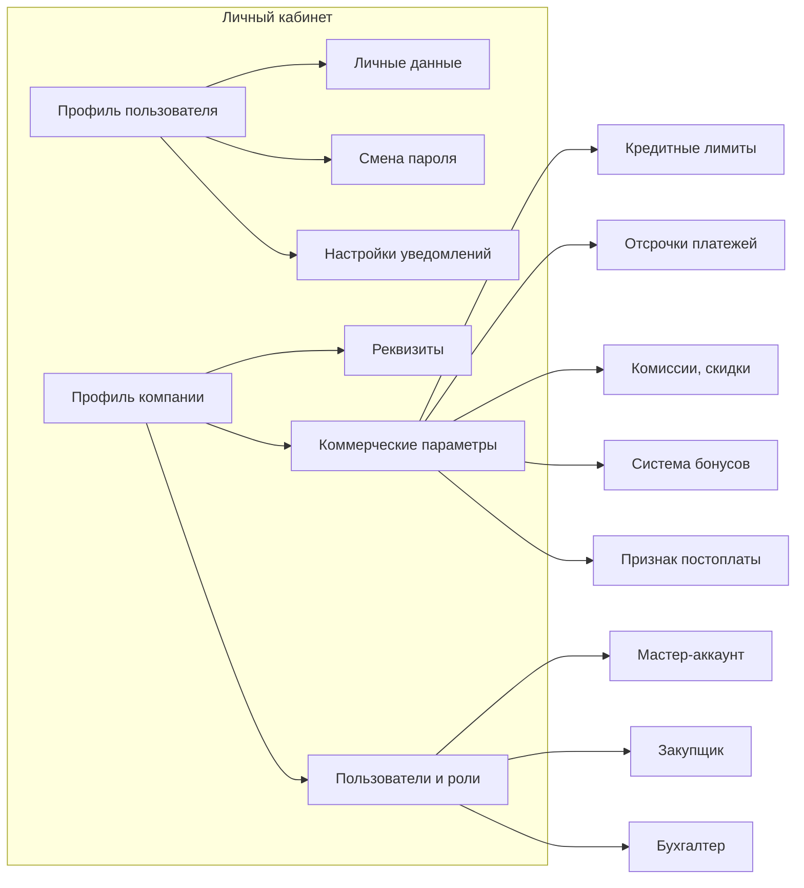

# ЧТЗ: Личный кабинет — профиль пользователя и компании

**Статус:** драфт  
**Источники:** Понимание задачи, ЧТЗ 05 (регистрация и онбординг), саммари 2026-03-02 (роли клиентов), 2026-03-04 (бонусы, цены).  
**As-is / To-be:** as-is — ЛК и раздела «Профиль» **нет**; данные о клиенте и компании хранятся в 1С, клиент узнаёт условия от менеджера. to-be — раздел ЛК «Профиль» (пользователь + компания), данные из 1С (разделы 3–4).

---

## 1. Назначение

Описывает экраны профиля пользователя (личные данные, контакты, смена пароля, настройки уведомлений) и профиля компании (реквизиты, коммерческие параметры: лимиты, отсрочки, скидки, бонусы, признак постоплаты). Данные компании — из 1С (контрагент, договор, соглашение); редактирование реквизитов — только через менеджера или заявку. Цель — прозрачность условий для клиента и единая точка настройки учётной записи.

---

## 2. Термины (общие)

| Термин | Описание |
|--------|----------|
| Профиль пользователя | Учётная запись: ФИО, email, телефон, смена пароля, настройки уведомлений |
| Профиль компании | Реквизиты юрлица и коммерческие параметры из договора/соглашения |
| Соглашение | В 1С: этапы оплаты, отсрочка, способ оплаты; отображаются в ЛК как «условия» |
| Мастер-аккаунт | Основная учётная запись компании-клиента с полным доступом и правом управлять другими пользователями своей компании |
| Под-пользователь | Дополнительная учётная запись сотрудника компании-клиента, созданная внутри одной компании и ограниченная по роли |
| Роль пользователя | Набор доступных разделов и действий в ЛК: что пользователь видит и что может инициировать |

---

## 3. To-be: структура раздела «Профиль» в ЛК (драфт)

---

## 4. To-be: требования (драфт)

### 4.1 Профиль пользователя

- Редактирование: ФИО, контактный email, телефон. Смена пароля и восстановление пароля — стандартные сценарии.
- Учётная запись пользователя создаётся платформой **после одобрения заявки на регистрацию** и активации контрагента в 1С (см. ЧТЗ 05): логином выступает email из заявки, а привязка к компании/контрагенту происходит по внешнему идентификатору (GUID заявки), записанному в 1С.
- Настройки уведомлений: на текущем этапе **только email** — подписка на типы событий (заказ, счёт, доставка и т.д.); SMS и push **не** в плане платформы (ЧТЗ 10).

### 4.2 Профиль компании

- Отображение реквизитов компании (наименование, ИНН, КПП, адрес, банк) — из 1С. Изменение реквизитов — через заявку/обращение к менеджеру или отдельный сценарий (уточнить).
- Коммерческие параметры (только отображение, изменение — через договор/менеджера): кредитные лимиты, отсрочки платежей, комиссии/скидки, система бонусов, признак доступности постоплаты. Источник — 1С (договор, соглашение).
- **Цены в ЛК:** решение принято — **показываем** (интервью 2026-03-04). Уточнить: где именно (каталог, корзина, карточка товара) и как отображать двойные цены (кратно/некратно упаковке). Кратность (количество в коробке/палете) приходит из 1С (НаборУпаковок).
- **Бонусы:** 7 типов (первичные продажи, квартальный/годовой план, своевременная оплата, поддержание ассортимента, разовые акции, предоплата); хранение и начисление — в регистрах 1С, бухгалтерия. **Решение по MVP (2026-03-25):** в ЛК показываем **типы и условия** по бонусам и **текущий баланс**; баланс и условия **получаем из 1С**; **историю начислений/списаний в ЛК не показываем**. Заявка на списание бонусов и автоматическое списание в заказе — **после MVP**.
- В составе профиля компании предусмотреть отдельный блок «Пользователи компании», где мастер-аккаунт видит список сотрудников, их роли, статус доступа и основные контакты.

### 4.3 Роли внутри ЛК

- По итогам интервью 2026-03-02: минимум три роли — (1) **полный доступ** (директор/собственник); (2) **закупщик**; (3) **бухгалтер**. На старте достаточно разграничения по разделам и ключевым сценариям, без сложного RBAC-конструктора.
- Роль назначается на уровне пользователя внутри одной компании. Один пользователь имеет одну базовую роль. Набор ролей фиксированный для MVP.
- **Мастер-аккаунт** (как правило, директор или ответственный со стороны клиента) видит все вкладки ЛК и может создавать под-пользователей своей компании.

### 4.4 Описание ролей и функционала

| Роль | Кто это на стороне клиента | Что видит | Что может делать | Ограничения |
|------|-----------------------------|-----------|------------------|-------------|
| **Полный доступ / мастер-аккаунт** | Директор, собственник, администратор клиента | Все разделы ЛК: профиль, компания, заказы, документы, уведомления, обращения | Просматривать все данные компании; создавать, редактировать, отключать под-пользователей; назначать роли; оформлять и повторять заказы; смотреть документы; отправлять запросы менеджеру/на акт сверки | Не меняет коммерческие условия, договорные параметры и реквизиты напрямую в обход 1С/менеджера |
| **Закупщик** | Снабжение, отдел закупок, менеджер клиента | Каталог, корзина, оформление заказа, история заказов, карточка заказа, часть профиля компании с рабочими данными | Оформлять заказ, повторять заказ, смотреть статусы, отслеживать доставку, отправлять нестандартную заявку, обращаться в чат/к менеджеру | Не управляет пользователями компании; не видит бухгалтерские документы и финансовые параметры, если это не будет отдельно согласовано |
| **Бухгалтер** | Бухгалтерия клиента, финансовый специалист | Документы, профиль компании, при необходимости история заказов в режиме просмотра | Смотреть и скачивать счёт, УПД, ТТН, паспорт качества; запрашивать акт сверки; проверять реквизиты и финансовые условия | Не оформляет заказ, не меняет состав корзины, не управляет каталогом и пользователями |

### 4.5 Матрица доступа по разделам

| Раздел / действие | Полный доступ | Закупщик | Бухгалтер |
|-------------------|---------------|----------|-----------|
| Профиль пользователя | Да | Да | Да |
| Профиль компании: просмотр реквизитов и условий | Да | Ограниченно | Да |
| Пользователи компании и роли | Да | Нет | Нет |
| Каталог и карточка товара | Да | Да | Нет |
| Корзина и оформление заказа | Да | Да | Нет |
| Повтор заказа | Да | Да | Нет |
| История заказов и статусы | Да | Да | Просмотр при необходимости |
| Документы по заказам | Да | Ограниченно / по согласованию | Да |
| Запрос акта сверки | Да | Нет | Да |
| Обращение в чат / связь с менеджером | Да | Да | Да |
| Нестандартная заявка | Да | Да | Нет |

### 4.6 Управление пользователями компании

- Создание под-пользователя инициирует мастер-аккаунт внутри ЛК.
- Для под-пользователя фиксируются минимум: ФИО, email, телефон, роль, статус доступа.
- Базовые действия мастер-аккаунта:
  - создать пользователя;
  - изменить роль пользователя;
  - отключить доступ пользователя;
  - при необходимости повторно отправить приглашение/инструкцию по входу.
- Пользователь всегда привязан к одной компании. Перенос пользователя между компаниями в MVP не предусматривается.
- Для безопасности изменение роли и отключение доступа должны логироваться.

#### 4.6.1 Пошаговый сценарий: директор создаёт учётки закупщику и бухгалтеру (email)

1. Директор (мастер-аккаунт) открывает в ЛК раздел `Профиль компании` → `Пользователи`.
2. Нажимает `Добавить пользователя`.
3. Заполняет поля: `ФИО`, `email`, `телефон` (опционально), выбирает роль (`Закупщик` или `Бухгалтер`).
4. Нажимает `Отправить приглашение`.
5. Платформа создаёт под-пользователя со статусом `Приглашение отправлено` и отправляет письмо на указанный email.
6. Сотрудник переходит по ссылке из письма, задаёт пароль и завершает активацию.
7. После первой успешной авторизации статус меняется на `Активен`, роль применяется автоматически.

#### 4.6.2 Статусы доступа под-пользователя (MVP)

- `Приглашение отправлено` — пользователь создан, письмо отправлено, вход ещё не завершён.
- `Активен` — пользователь принял приглашение и может входить в ЛК.
- `Отключён` — доступ закрыт директором; вход невозможен до повторной активации/инвайта.

#### 4.6.3 Правила email-приглашения (MVP)

- Основной канал — email; ссылка в письме одноразовая и ограничена по времени (TTL задаётся в технической конфигурации).
- Директор может выполнить `Отправить приглашение повторно` для статуса `Приглашение отправлено`.
- Если email уже используется в другой компании, платформа не создаёт доступ и показывает ошибку в форме.
- Смена роли (`Закупщик` ↔ `Бухгалтер`) выполняется директором без повторной регистрации пользователя.

### 4.7 Ограничения и принципы доступа

- Коммерческие условия компании, договорные параметры, отсрочка, лимиты и признаки постоплаты приходят из 1С и в ЛК доступны только для просмотра.
- Роли определяют в первую очередь доступ к разделам, а не тонкие действия внутри каждой страницы. Это упрощает MVP и соответствует обсуждённой логике «разграничение по вкладкам».
- Если позже потребуется более детальная настройка прав (например, бухгалтеру дать просмотр заказов без цен или закупщику доступ к отдельным документам), это выносится в post-MVP.
- Чат и обращения доступны всем ролям, поскольку коммуникация с менеджером по сопровождению является общей сервисной точкой входа.

---

## 5. Открытые вопросы

- Может ли клиент сам менять контактные данные компании (телефон, email для документов) или только через менеджера?
- Нужно ли в профиле компании отображать историю изменений условий (например, смена отсрочки по договору)?
- Нужен ли бухгалтеру просмотр истории заказов полностью или только в привязке к документам?
- Нужно ли показывать закупщику цены и финансовые условия в профиле компании, или только в каталоге/корзине?
- Нужны ли дополнительные роли после MVP: например, «только просмотр», «логист со стороны клиента», «технолог / производство»?

---

## 6. Связь с другими ЧТЗ

| Блок | Связь |
|------|--------|
| Регистрация и онбординг | После одобрения клиент получает доступ к ЛК и профилю (ЧТЗ 05) |
| Уведомления | Настройки каналов и типов уведомлений (ЧТЗ 10) |
| Интеграция с 1С | Контрагент, договор, соглашение — источник данных (ЧТЗ 09) |
| Саммари интервью | [2026-03-02 роли](../Интервью%20и%20встречи/Саммари/2026-03-02_документы_роли_нестандартный_заказ_саммари.md), [2026-03-04 бонусы/цены](../Интервью%20и%20встречи/Саммари/2026-03-04_доставка_бонусы_цены_уведомления_поиск_саммари.md) |
