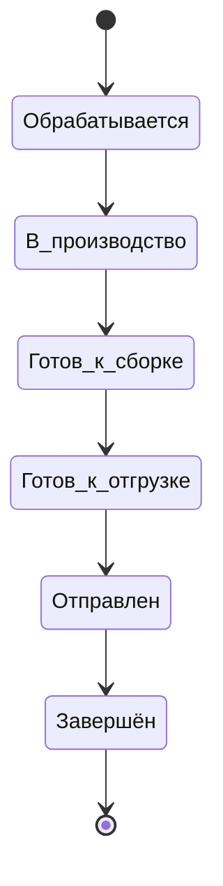

# ЧТЗ: Личный кабинет — заказы и статусы

**Статус:** драфт  
**Источники:** Понимание задачи, ЧТЗ 01 (процесс оформления заказа), ЧТЗ 03 (доставка), ЧТЗ 09 (интеграция с 1С), саммари 2026-03-02 (документы, роли, нестандартный заказ — статусы).  
**As-is / To-be:** as-is — ЛК **нет**; клиент не видит историю заказов в системе, узнаёт статусы от менеджера или по переписке. to-be — раздел ЛК «Заказы»: история, статусы, повтор заказа (разделы 3–4).

---

## 1. Назначение

Описывает раздел ЛК «Заказы»: история заказов (включая заказы до появления ЛК), детализация заказа, список позиций и сроки производства/доставки, повтор заказа (выбор из списка), статусы заказа и доставки, трекинг и контакты водителя. Данные и статусы — из 1С. Цель — единое место, где клиент видит все заказы и их текущее состояние.

---

## 2. Термины (общие)

| Термин | Описание |
|--------|----------|
| История заказов | Список заказов клиента (контрагента), в т.ч. выполненные до запуска ЛК — при наличии выгрузки из 1С |
| Повторить заказ | Копирование состава выбранного заказа в корзину (выбор заказа из списка — по уточнению с клиентом) |
| Archived / архивная номенклатура | Товар, который больше не должен участвовать в обычной витрине как актуальная позиция для новых продаж, но при этом может сохраняться в истории заказов и, если есть остаток, ещё быть доступным к заказу |
| Детали доставки | Данные внутри заказа: способ доставки, ориентировочная дата, маршрут, трек-номер ТК, контакты водителя, события отгрузки/доставки из 1С |

---

## 3. To-be: статусы заказа и доставки для отображения в ЛК

Целевая цепочка статусов (по итогам интервью 2026-03-02 и синхронизации с ЧТЗ 03/09): в ЛК используется **одна верхнеуровневая цепочка из 6 статусов**, а детали доставки отображаются внутри карточки заказа и не образуют отдельную шкалу.

| № | Статус | Пояснение |
|---|--------|-----------|
| 1 | Обрабатывается | Этап жизненного цикла **после** появления заказа в 1С как `Заказ клиента` (маппинг из 1С). Пока заказ только принят платформой и ещё не подтверждён в 1С, или при сбое обмена — используется отдельное поле `integrationSyncState` в API и поясняющий UX (баннер), а не «седьмой статус» (см. `Техническая часть/order_lifecycle_contract.md` §5.2, ЧТЗ 09 §4.2). |
| 2 | В производство / производится | Не хватает товара, создан заказ на производство |
| 3 | Готов к сборке | Реализация создана, расходный ордер ещё не проведён |
| 4 | Готов к отгрузке | Расходный ордер проведён, партия скомплектована |
| 5 | Отправлен | Отгрузка начата; для клиента показываются детали доставки: маршрут/задание на перевозку, трек-номер ТК или контакты водителя |
| 6 | Завершён | Доставка завершена / заказ закрыт в 1С |

### 3.1 Состояние синхронизации с 1С и «требует внимания»

- В ЛК остаётся **ровно шесть** верхнеуровневых статусов заказа; они отражают согласованный маппинг из 1С.
- Ожидание создания заказа в 1С, ошибки HTTP/таймауты и сценарий «обрабатывает поддержка» задаются полем **`integrationSyncState`** (и при необходимости полями ошибки) в контракте заказа — см. `Техническая часть/order_lifecycle_contract.md`, `Техническая часть/openapi_client_mvp.yaml`.
- **UX:** при `integrationSyncState` ≠ `synced` не показывать пользователю формулировки вроде «уже в 1С»; при `failed` / `manual_review_required` — заметный блок/баннер («заказ принят, передача в 1С задерживается / обрабатывается поддержкой») и канал связи с менеджером по правилам продукта.

---

## 4. To-be: требования (драфт)

### 4.1 Список заказов

- История заказов: список с датой, номером, суммой, статусом. Фильтры (период, статус) — опционально. Включить заказы, выполненные до появления ЛК, при наличии данных в 1С.
- Переход в детализацию заказа: состав (позиции, количество, цены), сроки производства и доставки, документы (счёт, УПД — см. ЧТЗ 02), статусы.
- Для загрузки истории заказов платформа должна хранить внешний идентификатор заказа в 1С и уметь связывать его с контрагентом/пользователем ЛК.

### 4.2 Детализация заказа

- На странице заказа: список позиций, сроки производства/доставки (из 1С), верхнеуровневый статус заказа, а также детали доставки. Ссылки на документы (счёт, УПД, ТТН, паспорт качества — по ЧТЗ 02). Трек-номер и контакты водителя при доставке своей машиной; трек ТК при доставке через ТК (ЧТЗ 03).
- Возможность «Повторить заказ»: выбор заказа из списка → копирование состава в корзину (ЧТЗ 01).
- Для документов, которые не хранятся на платформе постоянно, допускается сценарий «запросить из 1С по кнопке» в карточке заказа (например, УПД, акт сверки) — без локального хранения файла.

### 4.3 Повтор заказа и недоступные позиции

- Повтор заказа должен работать не как слепое копирование исторических строк, а как повторная попытка добавить в корзину **актуальные для заказа позиции** по данным `1С`.
- Рабочая логика для MVP:
  - платформа при `Повторить заказ` ищет каждую позицию исторического заказа в актуальной выгрузке каталога / номенклатуры из `1С`;
  - если позиция есть в выгрузке и доступна к заказу, она добавляется в корзину;
  - если позиция помечена как архивная / снятая с производства, но при этом из `1С` приходит, что остаток **больше 0**, такая позиция **должна добавляться в корзину**;
  - если позиция помечена как архивная / снятая с производства и остаток **0**, позиция в корзину **не добавляется**;
  - по завершении операции пользователь получает pop-up: `Часть товаров не смогли добавить в корзину`, со списком исключённых позиций и причиной.
- Для MVP **не блокировать повтор заказа целиком**, если часть позиций недоступна: в корзину должны попадать те позиции, которые можно заказать сейчас.
- История заказа при этом должна сохранять все исходные позиции, даже если часть из них уже недоступна к повторному заказу.

### 4.4 Отображение архивной номенклатуры в истории

- Для истории заказов и повторного заказа платформа должна уметь отличать:
  - актуальную номенклатуру;
  - архивную / снятую с производства номенклатуру;
  - временно скрытую номенклатуру, которая позже может вернуться в продажу.
- Рабочее допущение по обмену с `1С`:
  - номенклатура не должна просто исчезать из интеграционного контура без следа;
  - из `1С` должен приходить признак состояния номенклатуры (например, пометка на удаление / архивность / недоступность к заказу);
  - на стороне платформы допустима логика: если номенклатура помечена в `1С` и остаток `0`, она уходит в архив витрины; если пометка снята, позиция может вернуться из архива.
- Это необходимо не только для повтора заказа, но и для будущей логики подбора аналогов после MVP: без сохранения связи с исторической номенклатурой такой сценарий не построить.

### 4.5 Статусы

- Отображение **шести** верхнеуровневых статусов на основании данных из 1С (заказ клиента, производство, реализация, расходный ордер, отгрузка, завершение доставки), когда заказ **уже синхронизирован** (`integrationSyncState` = `synced`). Наименования и перечень фиксируются единообразно с ЧТЗ 03 и 09.
- До синхронизации или при ошибке обмена — отображение статусной строки согласовано с контрактом (обычно `processing` как плейсхолдер) **вместе** с состоянием `integrationSyncState` и баннером; источник статусов из 1С в этот момент ещё не актуален.
- Трекинг: для ТК — трек-номер и ссылка на отслеживание; для своей доставки — контакты водителя, при наличии — ориентировочная дата и вспомогательные delivery-события (по данным 1С/GPS). Эти данные не создают новых верхнеуровневых статусов ЛК.
- Источник статусов должен быть единым: платформа не рассчитывает статусы самостоятельно, а отображает согласованный маппинг событий/документов 1С → статусы ЛК (см. ЧТЗ 09).

### 4.6 Остатки по заказу

- Возможность посмотреть наличие и остатки по товарам в заказе — по Пониманию задачи. Реализация: запрос к 1С по номенклатуре заказа и отображение актуальных остатков (частота обновления — уточнить).

---

## 5. Открытые вопросы

- ~~Точная привязка шести статусов к событиям/документам в 1С~~ — зафиксировано как интеграционная задача и синхронизировано с ЧТЗ 09.
- Нужна ли фильтрация и поиск по заказам (по номеру, дате, статусу)?
- Какие внешние идентификаторы заказа, реализации, маршрута и документов нужно хранить на платформе для корректной детализации заказа, трекинга и повторных запросов в 1С.
- Каким именно полем / набором полей `1С` будет передавать на платформу состояние номенклатуры для сценария `повтор заказа`: пометка на удаление, архивность, признак доступности к заказу, остаток.
- Нужен ли после MVP механизм подбора аналогов для архивных позиций, и где будет вестись таблица соответствий аналогов (`1С` / платформа).

---

## 6. Связь с другими ЧТЗ

| Блок | Связь |
|------|--------|
| Процесс оформления заказа | Корзина, оформление, повтор заказа (ЧТЗ 01) |
| Документооборот | Счёт, УПД, доступ к документам по заказу (ЧТЗ 02) |
| Доставка | Статусы доставки, трекинг, контакты водителя (ЧТЗ 03) |
| Интеграция с 1С | Заказы, статусы, остатки (ЧТЗ 09) |
