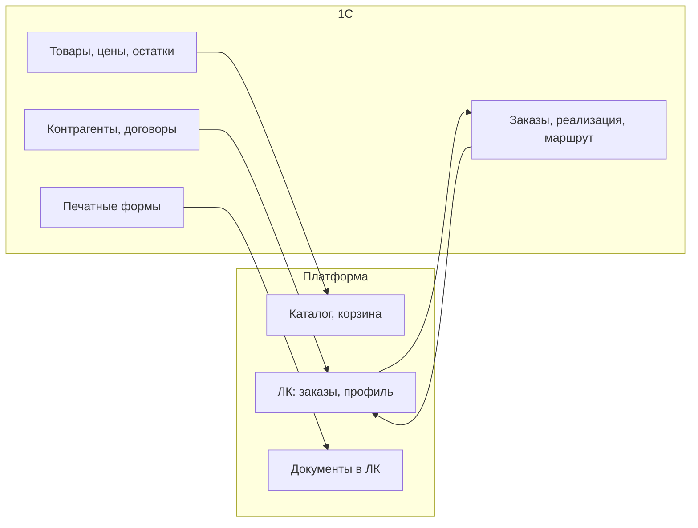

# ЧТЗ: Интеграция с 1С

**Статус:** драфт  
**Источники:** Понимание задачи, ЧТЗ 01–08, саммари интервью 2026-02-24, 2026-03-02 (статусы заказа), 2026-03-04 (доставка, бонусы, цены, поиск), 2026-03-13 (1С обмен данными; по сети см. актуализацию в §4.1 — без VPN, white list IP), 2026-03-17 (претензии), [демо прототипов 2026-04-15](../Интервью%20и%20встречи/Саммари/2026-04-15_демо_прототипов_саммари.md), подготовка к интервью с 1С ([05_процессы_1С_вопросы.md](../Интервью%20и%20встречи/План%20Интервью/05_процессы_1С_вопросы.md)), [Интеграция_1С](../Техническая%20часть/Интеграция_1С.md).  
**As-is / To-be:** as-is — обмена с внешней платформой **нет**; все данные (заказы, документы, контрагенты) только в 1С; заказы поступают от менеджеров. to-be — обмен новым сайтом/ЛК с 1С (разделы 3–4). **Контекст:** ЛК менеджера в системе нет; оперативная переписка с клиентом — через **внешние каналы** (в т.ч. встроенный на сайт чат-виджет стороннего сервиса, почта, мессенджеры); маршрутизация чата **вне scope** платформы. Вся документация по заказу для клиента получается из 1С через платформу; обмен предполагается по API (механизм — уточнить на интервью с 1С).

---

## 1. Назначение

Описывает обмен данными между платформой и 1С: направление потоков, перечень сущностей, базовые правила синхронизации. 1С — источник истины по товарам, ценам, контрагентам, заказам, документам и операционным правилам доставки (маршруты, delivery-детали). **Порог бесплатной доставки для отображения в корзине/оформлении в MVP** задаётся на платформе (админка); в 1С уходит согласованный заказ — см. ЧТЗ 03. Платформа передаёт в 1С заказы и заявки; получает из 1С каталог, остатки, цены, статусы заказов и доставки, документы для ЛК. Цель — единая спецификация обмена для разработки и согласования с командой 1С.

---

## 2. Термины (общие)

| Термин | Описание |
|--------|----------|
| Контрагент | Справочник 1С: реквизиты, договор, соглашение (условия оплаты, отсрочка) |
| Заказ клиента | Документ 1С — заявка на покупку; после обработки — реализация, маршрут |
| Правила доставки | Направления, маршруты, delivery-детали — из 1С; **порог бесплатной доставки для UI в MVP** — настройка платформы (ЧТЗ 03) |
| Внешний идентификатор | GUID/ID сущности в 1С, который платформа хранит для привязки контрагента, договора, заказа, документа и статуса |

---

## 3. To-be: направления обмена платформа ↔ 1С (драфт)

### 3.1 Платформа → 1С

| Сущность | Назначение |
|----------|------------|
| Заказ клиента | Состав (позиции, количество), контрагент, **адрес доставки** (выбранный клиентом из **сохранённых на платформе** и/или **новый** — см. п. 4.8), контакт, способ доставки в терминах, согласованных с ЧТЗ 01 и 03. Создание документа «Заказ клиента» в 1С. |
| Заявка «стать клиентом» | Передача реквизитов (ИНН, КПП, контакты) и **GUID заявки**, сгенерированного на платформе, для ручного заведения/привязки контрагента, договора и соглашения в 1С менеджером. GUID записывается **в карточку контрагента** как внешний ID, по которому платформа в дальнейшем понимает, что заявка одобрена и контрагент активирован. |
| Запрос акта сверки / претензия | **Акт сверки:** передача в `1С` параметров запроса (контрагент, период, идентификатор запроса с платформы) для **инициации формирования** документа; ответ — файл/ссылка/статус отложенного формирования (см. ЧТЗ 02). Целевое развитие после согласования — **минимизировать роль менеджера** как промежуточного канала; текущие формулировки ЧТЗ 02 сохраняются до отдельного решения (п. 4.8 ЧТЗ 02). **Претензия:** передача заявки для инициации процесса. Внутренний разбор претензии может идти вне `1С` (через `Mass Project`), но если для клиента в ЛК нужны подтверждённый результат, новые реализации / отгрузки, `УКД` и иные документы исполнения, они должны быть загружены/сформированы в `1С` и уже оттуда отдаваться на платформу. |
| Запрос документа из ЛК | Инициирование в 1С формирования/выдачи документа по кнопке из ЛК (например, УПД, акт сверки, паспорт качества) без постоянного хранения документа на платформе |
| Заявка на списание бонусов (после MVP) | Запрос от клиента на использование бонусов для оплаты заказа; уходит менеджеру / бухгалтерии для оформления документа списания в 1С (саммари 2026-03-04). |

### 3.2 1С → Платформа

| Сущность | Назначение |
|----------|------------|
| Товары, категории, свойства | Каталог для витрины (ЧТЗ 06). Фото, описания, атрибуты, статус доступности номенклатуры для витрины / заказа / истории, **ссылка на маркетплейс** (если есть — гость может перейти на маркетплейс из карточки товара). |
| Цены | Виды цен (розничные, оптовые и др.), персональная скидка (%) по соглашению и применение в корзине на стороне платформы (саммари 2026-03-13). **Для отображения кратности:** из `1С` на позицию заказа/номенклатуры передаются **два значения цены** — за **единицу при заказе кратно упаковке** и при **некратном** (имена полей и единицы измерения — в техническом контракте API); **логику пересчёта цены платформа не дублирует**, а показывает переданные значения и кратность упаковки (`НаборУпаковок` и связанные справочники). **Для незарегистрированных пользователей цены не отображаются** — только для авторизованных B2B-клиентов. |
| Остатки, сроки производства | Наличие, сроки формирования заказа. |
| Контрагенты, договор, соглашение | Профиль компании, условия оплаты и доставки (ЧТЗ 07). |
| Заказы и статусы | История заказов, статус заказа и доставки (ЧТЗ 01, 08). |
| Документы (счёт, УПД, ТТН, паспорт качества, акт сверки) | Печатные формы или файлы для отображения/скачивания в ЛК (ЧТЗ 02). УПД по запросу из ЛК без хранения на платформе; акт сверки — по заявке из ЛК, формирование в 1С. |
| Правила доставки | Данные по способу доставки, маршруту, delivery-деталям и связанным правилам из 1С; порог бесплатной доставки для MVP хранится как настройка платформы (ЧТЗ 03, 12). |
| Номенклатура контрагента | Связь внутренних кодов с «чужими» кодами клиента — для поиска и подсказок (ЧТЗ 11). |
| Бонусы | Условия и типы бонусов, **текущий баланс** — из регистров 1С; **история операций в ЛК для MVP не передаётся/не показывается** (решение 2026-03-25, ЧТЗ 07). История и заявка на списание — после MVP. |
| Данные об упаковках | НаборУпаковок: количество в коробке/палете; для расчёта двух цен (кратно / некратно упаковке) в корзине (саммари 2026-03-04). |
| Договоры и допсоглашения | Файлы, прикреплённые к карточке договора в 1С; платформа получает их через API без внешнего хранилища (саммари 2026-03-13). |
| Паспорта качества | Печатная форма / PDF по конкретным партиям; в 1С есть признак клиента, для которого паспорта обязательны (саммари 2026-03-17). |

---

## 4. To-be: требования (драфт)

### 4.1 Способ и периодичность обмена

- **Принятое решение (интервью 2026-03-13):** гибридный подход — **регламентные выгрузки по расписанию** для справочников, каталога, цен и остатков + **событийные обновления** (вебхуки / шина сообщений) для критичных изменений (статусы заказа, появление документа). Инициаторами обмена могут быть обе стороны: платформа вызывает HTTP-сервисы 1С и 1С публикует события.
- **Транспорт:** HTTP-сервисы 1С (REST/JSON). В 1С уже есть модуль интеграции с Яндекс.Маркетом, который может быть использован как донор для HTTP-сервисов и обработки ошибок.
- **Периодичность:** real-time для отправки заказа в 1С при оформлении; для каталога, остатков — по расписанию (частота согласуется отдельно); для статусов и документов — по событию.
- **Каталог (номенклатура и категории), согласование с 1С 2026-04-21:**
  - **Первая выгрузка** на платформу — **полная** (весь актуальный состав каталога / дерева).
  - **Далее** при изменениях в 1С на платформу передаются **только изменения (дельты)**, а не полный каталог каждый раз.
  - **Первичное заполнение** обсуждается как **разовая загрузка** с инициативой 1С: JSON с папкой (категорией) и входящей в неё номенклатурой; нужен **входящий метод API платформы** (например `POST` с телом дерева/пакета) — точный контракт и путь фиксируются после развёртывания бэкенда и обкатки.
  - **GET categories** со стороны 1С — отражает папки номенклатуры; для витрины платформа по-прежнему отдаёт категории своим публичным API (`GET /catalogs/.../categories`), наполнение — из импорта.
- **Инициатор 1С → платформа (статусы заказа, документы):** при смене статуса заказа, появлении документов у контрагента/заказа — события на платформу; канонический контур — **входящий API** платформы (см. `Техническая часть/Интеграция_1С.md` §4.3 вебхук `POST /integrations/1c/events`). Для **обкатки** допускается отдельный контракт (например `PUT` по заказу) — реализуется **после развёртывания сервера**; затем сводим к единому событию или оставляем как альтернативу по согласованию.
- **Контрагенты (вызовы платформы к 1С):** передача **одного контрагента по GUID** осмысленна; **массовая выгрузка всех контрагентов** в один запрос для интеграции не требуется (согласование 2026-04-21).
- **Атрибуты товаров:** в ответе по товару в общем случае приходят **идентификаторы атрибутов и значения**; отдельный метод «справочник атрибутов» (**`GET ProductAttributes`** или аналог) **не обязателен**, если метаданные атрибутов (название, тип) встроены в ответ **`GET products`** / карточки товара — выбор удобства для контракта 1С ↔ платформа (согласование 2026-04-21).
- **Тестовая 1С:** подтверждено наличие тестового контура (1С ERP 2.5.22, та же конфигурация и доработки, что в проде). **Сетевой доступ (согласовано с командой заказчика):** к HTTP-сервисам 1С — **без VPN**; со стороны платформы используются **фиксированные исходящие IP** окружений (dev / stage / prod), на стороне заказчика — **белый список IP**; отдельная учётная запись или иной способ аутентификации приложения — по договорённости с ИТ заказчика.
- **Регламентный перезапуск сервера 1С около 05:00** (саммари 2026-03-13): рестарт ОС, SQL, 1С и Apache. Интеграция должна быть толерантна к краткосрочной недоступности (ретраи, буферизация через очередь).
- Остаётся зафиксировать: точную частоту регламентных заданий, формат ответов при ошибках, retry-политику и мониторинг.
- **Техконтракт API (детальные JSON-схемы по сущностям, полное выравнивание с OpenAPI):** финальная проработка **отложена** до появления **базовых HTTP-сервисов на сервере 1С** и приёмочной проверки реальных вызовов; после этого — новые вводные от заказчика/команды 1С и фиксация полей (см. [Реестр открытых вопросов](../Интервью%20и%20встречи/Реестр_открытых_вопросов.md) №18, №49). До этапа готовности 1С достаточно принципов из настоящего ЧТЗ и `Техническая часть/Интеграция_1С.md`.

### 4.2 Идемпотентность и ошибки

- Повторная отправка заказа с тем же идентификатором не должна создавать дубликат в 1С.
- Обработка ошибок (отказ 1С, таймаут): политика повторов (retry/backoff), уведомление менеджерам / поддержке (ЧТЗ 10), опционально — уведомление клиенту после согласования текста.
- **ЛК:** клиентское «требует внимания» реализуется через **`integrationSyncState`** (`failed`, `manual_review_required`) и баннер/блок в карточке заказа, а **не** как седьмое значение `OrderStatus` — см. `Техническая часть/order_lifecycle_contract.md` §5.2, поля заказа в `Техническая часть/openapi_mvp.yaml` (`OrderSummary`).
- Пока заказ не принят в 1С, в API допустимо `oneCOrderGuid: null` и `integrationSyncState: pending`; после успешного создания документа — `synced` и известный GUID.

### 4.3 Безопасность

- Аутентификация и авторизация вызовов к 1С (ключи, сертификаты, токены, **mTLS** и т.п.) в сочетании с **белым списком исходящих IP** платформы на стороне заказчика (**VPN для доступа к 1С не используется** — согласование с командой заказчика).
- Требуется зафиксировать доступы отдельно для `prod` и тестового контура 1С, а также ответственного за выдачу/ротацию доступов.

### 4.4 Маппинг статусов заказа (платформа ↔ 1С)

Шесть статусов заказа в ЛК (см. ЧТЗ 08) должны быть привязаны к событиям/документам в 1С. Требуется зафиксировать соответствие:

| Статус на платформе | Событие/документ в 1С (уточнить) |
|---------------------|-----------------------------------|
| Обрабатывается | Заказ клиента создан |
| В производство / производится | Заказ на производство создан |
| Готов к сборке | Реализация создана, расходный ордер не проведён |
| Готов к отгрузке | Расходный ордер проведён, партия скомплектована |
| Отправлен | Задание на перевозку / маршрут; факт отгрузки |
| Завершён | Доставка завершена (или закрытие заказа) |

Принцип отображения в ЛК:

- перечисленные выше 6 статусов являются **единственной верхнеуровневой шкалой статусов заказа**;
- события доставки (`маршрут создан`, `назначен водитель`, `точка прохождения маршрута`, `трек-номер ТК`) не становятся отдельными верхнеуровневыми статусами, а отображаются как детали внутри заказа;
- передача признака `своя машина` vs `ТК` с 1С на платформу нужна для выбора набора деталей: трек-номер и ссылка ТК либо контакты водителя и данные по своей доставке.

Источник данных водителя (ФИО, телефон, ТС) — документ задания на перевозку в 1С (формируется логистом при планировании машины).

### 4.5 Идентификаторы и связывание сущностей

- Для каждой сущности обмена нужно согласовать внешний идентификатор 1С, который хранится на платформе:
  - контрагент;
  - договор / соглашение;
  - заказ клиента;
  - документ (счёт, УПД, ТТН, паспорт качества, акт сверки);
  - номенклатура и номенклатура контрагента.
- Для сценария онбординга платформа дополнительно генерирует **GUID заявки/будущего клиента**, который передаётся в 1С и хранится в **карточке контрагента** как внешний ID; по нему платформа понимает, к какому контрагенту относится одобренная заявка и можно ли создавать учётную запись ЛК (см. ЧТЗ 05).
- Рабочее допущение для реализации текущего этапа:
  - `GUID заявки` хранится в **карточке контрагента** в 1С;
  - признак `активность`, разрешающий доступ к платформе, также хранится в **карточке контрагента**;
  - договор и соглашение остаются связанными сущностями 1С, но не используются как первичная точка проверки факта одобрения заявки платформой.
- Платформа должна передавать в 1С собственный идентификатор запроса/заказа и хранить ответный ID 1С для исключения дублей и поддержки повторных запросов.
- При повторной отправке заказа с тем же внешним идентификатором 1С не должна создавать дубликат; сценарий идемпотентности требуется согласовать отдельно.

### 4.6 Номенклатура, архив и повтор заказа

- Для сценария `Повторить заказ` платформа должна получать из `1С` не только идентификатор и остаток номенклатуры, но и **признак её текущего состояния**:
  - активна и доступна к заказу;
  - снята с производства / архивная;
  - помечена на удаление;
  - временно недоступна, но сохранена в истории.
- Рабочая логика для MVP:
  - если номенклатура приходит из `1С` и её остаток **больше 0**, позиция может участвовать в повторе заказа, даже если товар снят с производства;
  - если номенклатура помечена как архивная / снятая с производства и остаток **0**, позиция не должна попадать в корзину повторного заказа;
  - при этом сама номенклатура должна сохраняться в истории заказов и в интеграционных связях, чтобы не терять историю клиента и возможность будущего подбора аналогов.
- Рабочее допущение по обмену:
  - `1С` может передавать номенклатуру с признаком пометки / архивности, а платформа уже применяет правило отображения;
  - если на стороне `1С` архивная пометка снята, платформа должна уметь возвращать позицию из архива в активный каталог / сценарий повторного заказа.
- Для MVP не требуется автоматический подбор аналогов, но данные по исторической номенклатуре должны сохраняться так, чтобы после MVP можно было добавить таблицу аналогов.

### 4.7 Источники документов и границы интеграции

- Документы по заказу для MVP (`счёт`, `УПД`, `ТТН`, `паспорт качества`, `акт сверки`) считаются частью интеграции с 1С: либо 1С формирует их по запросу, либо отдаёт ссылку/файл в утверждённом формате.
- Для документов, которые должны отображаться в ЛК клиента, принимается рабочее правило: **источником выдачи для платформы является 1С**. Если `TDS/MSDS`, `паспорта безопасности`, `СГР` или иные дополнительные документы нужны в ЛК, они должны быть предварительно загружены/привязаны в 1С и уже оттуда отдаваться на платформу.
- Если дополнительный документ не загружен в 1С, он остаётся вне автоматизированного контура ЛК и выдаётся менеджером вручную вне платформы.
- Для блока претензий действует то же правило границы: внутренний бизнес‑процесс может вестись в `Mass Project`, но в текущем `MVP` клиентский ЛК получает только факт отправки претензии и хранит карточку в истории.
- Для `MVP` претензия не требует интеграции статусов из `Mass Project` или `1С`: дальнейшие этапы разбора и исполнения происходят за пределами платформы.
- После `MVP` можно вернуться к сценарию, где в платформу приходят документы исполнения (`новые реализации / отгрузки`, `УКД`, возвраты, корректировки и иные объекты исполнения) и обновления по претензии.
- Для каждого документа требуется зафиксировать режим выдачи:
  - online по запросу из ЛК;
  - предварительная выгрузка/кэш на платформе;
  - выдача через ЭДО или только в виде PDF/печатной формы 1С.

### 4.8 Адреса доставки (платформа ↔ 1С)

- **Хранение на платформе:** для авторизованного контрагента хранится **список адресов доставки**, ранее введённых пользователем; при оформлении заказа клиент выбирает один из сохранённых или добавляет **новый** адрес.
- **Передача в 1С:** выбранный/новый адрес **передаётся в составе заказа** (и при необходимости сохраняется на платформе для повторного выбора). Идентификаторы и формат полей адреса — в техническом контракте обмена.
- **Опционально (развитие):** подстановка адреса по умолчанию из карточки партнёра/контрагента в `1С`, если данные там заполнены и согласованы с UX; до согласования **не считать** обязательным для `MVP`.

---

## 5. Открытые вопросы

Часть вопросов по интеграции уже **частично прояснена** по итогам интервью 2026‑03‑13 (см. также `Техническая часть/Интеграция_1С.md`, раздел 5.1, и саммари `2026-03-13_1С_обмен_данными_саммари.md`), но до финальной фиксации деталей реализации они остаются в списке.

- **Механизм обмена:** конкретный способ (REST, файлы, очередь/шина); обмен по расписанию или по вебхукам/событиям; платформа вызывает 1С или общая шина (RabbitMQ и т.п.). Версия/конфигурация 1С и ограничения по API — уточнить на [интервью с 1С](../Интервью%20и%20встречи/План%20Интервью/05_процессы_1С_вопросы.md).
- **Тестовая 1С:** наличие, степень готовности к интеграции, кто выдаёт доступ и согласует форматы.
- ~~Привязка шести статусов заказа к событиям/документам в 1С~~ — зафиксировано как часть интеграционного контура (синхронизировано с ЧТЗ 08 и реестром).
- ~~Передача статусов своей доставки из 1С на платформу~~ — для MVP зафиксирована передача ключевых delivery-данных в карточку заказа (дата/контакты); детализация событий маршрута остаётся на уровне интеграционной спецификации.
- **Синхронизация контрагентов:** частично прояснено (2026-04-21) — запрос контрагента по **одному GUID**, без необходимости отдавать «всех контрагентов» одним вызовом; остаётся детализировать частоту обновления профиля в ЛК при изменениях в 1С (событие vs опрос).
- Какие GUID/внешние ID 1С должны храниться на платформе для контрагента, договора, заказа и документов; как обеспечивать идемпотентность при повторах и сбоях. Рабочее допущение по онбордингу уже принято: `GUID заявки` и флаг `активность` живут в карточке контрагента.
- **Сетевой доступ:** ~~VPN~~ — **не используется**; доступ по **белому списку IP** исходящих запросов платформы (в т.ч. для тестового контура — отдельные IP или отдельное правило списка). **Остаётся зафиксировать:** схема **аутентификации приложения** к HTTP-сервисам 1С (токен, Basic, сертификат и т.д.), ротация секретов, отдельные учётные данные для `test` и `prod`.
- Каким именно полем / контрактом `1С` будет передавать состояние номенклатуры для платформы: пометка на удаление, архивность, признак доступности к заказу, дата снятия с производства и т.д.
- Какие дополнительные документы (`TDS/MSDS`, `паспорта безопасности`, `СГР` и др.) должны быть заведены в 1С для выдачи в ЛК в рамках MVP, а какие остаются вне ЛК и выдаются менеджером вручную.
- Для файлов документов: рабочее допущение на текущем этапе — ограничения по размеру не ожидаются, и документов **более 10 МБ не планируется**. Формат `base64` в JSON допустим для MVP, но точный контракт передачи имени, типа и размера файла всё равно нужно формализовать.
- После `MVP`: нужно ли возвращать на платформу статусы и документы исполнения по претензии, и если да — каким именно объектом / событием `1С` или внешнего контура это подтверждается.
- **Образцы документов для проектирования:** форматы выдачи из 1С (счёт, УПД, ТТН, паспорт качества, акт сверки) — см. [Реестр документов для проектирования](../Интервью%20и%20встречи/Реестр_документов_для_проектирования.md) (Реестр открытых вопросов № 25). Полный перечень документов и данных 1С ↔ платформа — в [05_процессы_1С_вопросы.md](../Интервью%20и%20встречи/План%20Интервью/05_процессы_1С_вопросы.md) (разделы 4–5).

---

## 6. Связь с другими ЧТЗ

| Блок | Связь |
|------|--------|
| Витрина и каталог | Товары, цены, остатки (ЧТЗ 06) |
| Процесс оформления заказа | Отправка заказа в 1С, получение статусов (ЧТЗ 01) |
| Документооборот | Получение печатных форм из 1С (ЧТЗ 02) |
| Доставка | Операционные данные доставки из 1С (маршрут, delivery-детали); порог бесплатной доставки для UI — админка платформы (ЧТЗ 03, 12) |
| ЛК профиль и компания | Контрагент, договор, соглашение (ЧТЗ 07) |
| ЛК заказы и статусы | Заказы, статусы, остатки по заказу (ЧТЗ 08) |
| Реестр документов для проектирования | [Интервью и встречи / Реестр документов для проектирования](../Интервью%20и%20встречи/Реестр_документов_для_проектирования.md) — образцы документов для проектирования обмена (печатные формы, форматы выдачи из 1С) |
| План интервью с 1С | [05_процессы_1С_вопросы.md](../Интервью%20и%20встречи/План%20Интервью/05_процессы_1С_вопросы.md) — контекст (нет ЛК менеджера; внешние каналы и чат-виджет; документы из 1С), вопросы по API/расписанию/вебхукам/шине, тестовая 1С, полный список документов и данных для обмена |
| Техническая часть: интеграция 1С | [Интеграция_1С.md](../Техническая%20часть/Интеграция_1С.md) — архитектурный подход, подготовка к интервью, сводная таблица данных 1С ↔ платформа |
| Саммари интервью | [2026-03-13 1С обмен](../Интервью%20и%20встречи/Саммари/2026-03-13_1С_обмен_данными_саммари.md), [2026-03-04 доставка/бонусы/цены](../Интервью%20и%20встречи/Саммари/2026-03-04_доставка_бонусы_цены_уведомления_поиск_саммари.md), [2026-03-17 претензии](../Интервью%20и%20встречи/Саммари/2026-03-17_претензии_саммари.md), [2026-04-15 демо прототипов](../Интервью%20и%20встречи/Саммари/2026-04-15_демо_прототипов_саммари.md) |
| Примеры печатных заказов из 1С | [Реестр документов для проектирования](../Интервью%20и%20встречи/Реестр_документов_для_проектирования.md) (№ 15, файлы `Заказ_*.pdf`); маппинг полей на OpenAPI — `openapi_mvp.yaml` (`unit`, `vatAmount`, `itemsCount`) |
