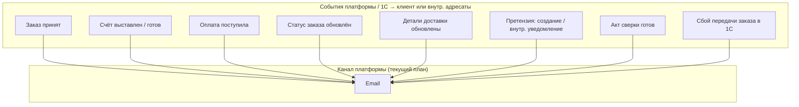

# ЧТЗ: Уведомления

**Статус:** драфт  
**Источники:** Понимание задачи, ЧТЗ 01, 03, 09, саммари интервью 2026-02-24, 2026-03-04 (уведомления, каналы), 2026-03-17 (претензии, уведомления).  
**As-is / To-be:** as-is — информирование **без** платформы: менеджер отправляет счёт по email/Telegram; после отгрузки — рассылка с данными водителя по email; дату доставки клиент уточняет у менеджера. to-be — автоматические уведомления с платформы (события, **канал email**, настройки в ЛК) — разделы 3–4.

**Решение по каналам (актуализация):** на текущем этапе проекта платформа **не планирует** интеграцию **SMS** и **push**; клиентские и внутренние уведомления, инициируемые **платформой**, идут **только в email**. **Уведомления в контуре чат-виджета** (оператору и/или посетителю) обеспечивает **сервис виджета**, не Palizh.

---

## 1. Назначение

Описывает события, по которым клиенту или внутренним адресатам отправляются уведомления **с платформы**, канал **email**, настройки в ЛК и интеграцию с сервисом рассылки email. Цель — клиент своевременно узнаёт о счёте, оплате, отгрузке, доставке и других событиях без необходимости звонить менеджеру.

---

## 2. Термины (общие)

| Термин | Описание |
|--------|----------|
| Событие | Триггер уведомления (новый заказ принят, счёт готов, оплата поступила, заказ отгружен и т.д.) |
| Канал платформы | **Email** — единственный канал, реализуемый платформой на текущем этапе |
| Чат-виджет | Сторонний сервис; push/SMS/email внутри чата — **вне** ЧТЗ платформы |

---

## 3. To-be: события и канал платформы (драфт)

**Вне диаграммы:** SMS, push и иные каналы — **не** входят в текущий план платформы; могут обсуждаться заново при появлении мобильного приложения или отдельного решения заказчика. **Чат-виджет** — уведомления и доставка сообщений по правилам поставщика виджета.

Дополнительная детализация событий и источников — в документе `Матрица_статусов_и_источников.md`.

---

## 4. To-be: требования (драфт)

### 4.1 Список событий (драфт)

- Заказ принят платформой / зарегистрирован в 1С (не путать: подтверждение в 1С может быть позже момента `POST /orders` — см. `integrationSyncState` в `order_lifecycle_contract.md`).
- Счёт выставлен / готов к оплате (доступен в ЛК, отправка на **email**).
- Оплата поступила (при предоплате — для информирования по **email**).
- Изменение одного из **6 верхнеуровневых статусов заказа** в ЛК: `Обрабатывается`, `В производство / производится`, `Готов к сборке`, `Готов к отгрузке`, `Отправлен`, `Завершён`.
- Обновление **деталей доставки** внутри заказа (ориентировочная дата / слот, контакт водителя, трек-номер ТК и т.д.) — уведомление клиенту по **email**, если событие признано значимым.
- Претензия:
  - отправлена клиентом через ЛК;
  - внутренняя команда получает уведомление на настроенные **email**-адреса;
  - **клиенту** — email подтверждения приёма по настраиваемому шаблону в админке (как для нестандартной заявки);
  - дальнейшее сопровождение претензии происходит за пределами платформы.
- **Общее обращение** в ЛК из раздела «Обращения и претензии» (контекст заказа):
  - внутреннее уведомление на email;
  - **клиенту** — подтверждение приёма по шаблону в админке;
  - **история** отправленных обращений в ЛК (как у претензий и нестандартных заявок).
- **Заявка на обучение:**
  - платформа отправляет **внутреннее уведомление** на email адресатов из админки;
  - в ЛК — история со статусом `Отправлено` (статус не меняется).
- **Нестандартная заявка / обращение к менеджеру** из ЛК (обязательный текст запроса, опционально вложения — ЧТЗ 01 §4.5):
  - **внутреннее уведомление** на email по типу маршрутизации «нестандарт / обращение к менеджеру»;
  - **клиенту** — email **подтверждения приёма заявки** по **настраиваемому шаблону** в админке (тема, текст, подстановки: компания, пользователь, дата, при необходимости — номер/ид записи);
  - уточнение деталей, КП и сделка — **вне платформы**;
  - в ЛК — **история** отправленных заявок, у каждой записи статус **`Отправлено`** (без дальнейших обновлений с платформы в MVP).
- Акт сверки сформирован / отправлен.
- Доступ в ЛК одобрен (после онбординга).
- **Сбой доставки заказа в 1С:** внутреннее уведомление на email адресатам из админки; опционально отдельное письмо клиенту после согласования формулировки.

Принцип для текущего этапа:

- не дублировать каждое техническое событие 1С отдельным письмом;
- опираться на верхнеуровневые статусы заказа и значимые delivery-детали.

### 4.2 Чат и обратная связь

- **Онлайн-консультанта на платформе не предусмотрено.** Обращения через **формы** платформы (витрина, ЛК, претензии, нестандартная заявка) маршрутизируются в **email** по настройкам админки (ЧТЗ 12).
- **Чат-виджет** стороннего сервиса: доставка сообщений, **уведомления операторам и посетителям в рамках чата**, возможные SMS/push со стороны виджета — **полностью на стороне поставщика виджета**; в Palizh не настраивается и в ЧТЗ платформы не детализируется.

### 4.3 Каналы

- **Email** — единственный канал уведомлений, реализуемый платформой на текущем этапе; сервис рассылок (интеграция). Шаблоны писем, подпись, отправитель — в админке или конфигурации.
- **SMS и push** — **не планируются** для платформы на текущем этапе; при появлении мобильного приложения или нового решения заказчика — отдельное согласование и правка ЧТЗ.
- В ЛК: раздел «Уведомления» — лента/история информационных сообщений от компании (источник событий — платформа/email-рассылки по Пониманию задачи).
- Для внутренних обращений и заявок — настраиваемая маршрутизация **email** в админке (типы: претензии, нестандарт / обращение к менеджеру, обучение, «стать клиентом», обратная связь, при необходимости документы, сбои синхронизации заказов).
- Для запуска должны быть заданы адресаты как минимум для **претензий** и **заявок на обучение**.

### 4.4 Настройки в ЛК

- Настройки уведомлений хранятся **на платформе**, не в 1С.
- На текущем этапе клиенту в профиле достаточно управления **подпиской на email** по **типам событий** (какие письма получать). Выбор SMS/push **не** показывать, пока каналы не введены в продукт.
- Детализация полей — в ЧТЗ 07; при смене политики каналов — синхронно обновить ЧТЗ 07 и настоящий документ.

### 4.5 Интеграция

- Вызов сервиса **email**-рассылок по событиям с платформы или по данным, пришедшим из 1С. Передача: шаблон, получатель, данные для подстановки.
- Для событий из 1С согласовать: как событие попадает на платформу (API, расписание, вебхук); внешние ID; источник истины по факту отправки письма.
- Претензии, заявки на обучение, **нестандартные заявки** — правила **внутреннего** email при создании; дополнительно для перечисленных типов (и при необходимости для **общего обращения** из ЛК в разделе «Обращения и претензии») — **шаблоны писем клиенту** (подтверждение приёма); клиентские статусы в MVP — в соответствующих ЧТЗ.

---

## 5. Открытые вопросы

- Нужны ли напоминания (например, «оплатите счёт до даты») и повторные письма при просрочке?
- Какие события инициируются из 1С, а какие генерирует платформа без ожидания 1С.
- Какие delivery-детали считаются значимыми для отдельного письма клиенту.
- После появления мобильного приложения: нужны ли push и как согласовать с email.

---

## 6. Связь с другими ЧТЗ

| Блок | Связь |
|------|--------|
| Процесс оформления заказа | События: заказ, счёт, оплата (ЧТЗ 01) |
| Доставка | События: отгрузка, дата доставки, контакты водителя (ЧТЗ 03) |
| ЛК профиль | Настройки уведомлений (ЧТЗ 07) |
| Претензии | Статус претензии (ЧТЗ 04) |
| Интеграция с 1С | Источник событий по заказам, документам, оплате и доставке (ЧТЗ 09) |
| Саммари интервью | [2026-03-04 доставка/бонусы/цены/уведомления](../Интервью%20и%20встречи/Саммари/2026-03-04_доставка_бонусы_цены_уведомления_поиск_саммари.md), [2026-03-17 претензии/уведомления](../Интервью%20и%20встречи/Саммари/2026-03-17_претензии_саммари.md) — исторический контекст каналов; актуальная политика — **только email** на текущем этапе |
