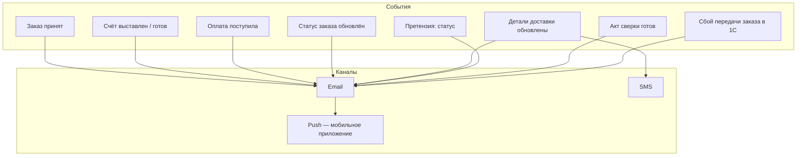

# ЧТЗ: Уведомления

**Статус:** драфт  
**Источники:** Понимание задачи, ЧТЗ 01, 03, 09, саммари интервью 2026-02-24, 2026-03-04 (уведомления, каналы), 2026-03-17 (претензии, уведомления).  
**As-is / To-be:** as-is — информирование **без** платформы: менеджер отправляет счёт по email/Telegram; после отгрузки — рассылка с данными водителя по email; дату доставки клиент уточняет у менеджера. to-be — автоматические уведомления с платформы (события, каналы, настройки в ЛК) — разделы 3–4.

---

## 1. Назначение

Описывает события, по которым клиенту отправляются уведомления, каналы (email, SMS, push), настройки в ЛК и интеграцию с сервисами рассылок. Цель — клиент своевременно узнаёт о счёте, оплате, отгрузке, доставке и других событиях без необходимости звонить менеджеру.

---

## 2. Термины (общие)

| Термин | Описание |
|--------|----------|
| Событие | Триггер уведомления (новый заказ принят, счёт готов, оплата поступила, заказ отгружен и т.д.) |
| Канал | Email, SMS, push (в мобильном приложении); для веб-ЛК на старте — в основном email |

---

## 3. To-be: события и каналы (драфт)

Дополнительная детализация событий и источников — в документе `Матрица_статусов_и_источников.md`.

---

## 4. To-be: требования (драфт)

### 4.1 Список событий (драфт)

- Заказ принят платформой / зарегистрирован в 1С (не путать: подтверждение в 1С может быть позже момента `POST /orders` — см. `integrationSyncState` в `order_lifecycle_contract.md`).
- Счёт выставлен / готов к оплате (доступен в ЛК, отправка на email).
- Оплата поступила (при предоплате — для информирования).
- Изменение одного из **6 верхнеуровневых статусов заказа** в ЛК: `Обрабатывается`, `В производство / производится`, `Готов к сборке`, `Готов к отгрузке`, `Отправлен`, `Завершён`.
- Обновление **деталей доставки** внутри заказа:
  - ориентировочная дата / слот;
  - контакт водителя;
  - трек-номер ТК;
  - иные delivery-события, которые заказчик сочтёт значимыми для клиента.
- Претензия:
  - отправлена клиентом через ЛК;
  - внутренняя команда получает уведомление по настроенным каналам и адресатам;
  - дальнейшее сопровождение претензии происходит за пределами платформы.
- **Заявка на обучение:**
  - клиент отправил заявку из раздела «Обучение»;
  - платформа отправляет **внутреннее уведомление** адресатам (email), настроенным в админке по типу обращения `заявка на обучение`;
  - в MVP заявка фиксируется в ЛК в истории «Заявки на обучение» со статусом `Отправлено` (статус не меняется), дальнейшая обработка — вне платформы.
  - опционально (после MVP): авто‑письмо клиенту «заявка получена» отдельным событием, если заказчик решит, что одного экрана/истории в ЛК недостаточно.
- Акт сверки сформирован / отправлен.
- Доступ в ЛК одобрен (после онбординга).
- **Сбой доставки заказа в 1С** (очередь обмена: исчерпаны ретраи или переход в `manual_review_required`):
  - **внутреннее уведомление** менеджерам / поддержке (настраиваемые адресаты в админке, по аналогии с другими операционными заявками);
  - **опционально для клиента** — отдельное письмо после согласования формулировки (чтобы не дублировать каждый технический retry); триггер — платформа, не 1С.

Принцип для MVP:

- не отправлять уведомление по каждому техническому внутреннему событию 1С;
- использовать верхнеуровневые статусы заказа как основную шкалу клиентских уведомлений;
- отдельные уведомления по доставке отправлять только для реально значимых деталей: `заказ отправлен`, `известна дата доставки`, `появился трек-номер`, `появились контакты водителя`, `доставка завершена`.

Состав событий и приоритет по каналам — согласовать с заказчиком (см. интервью по теме 14).

### 4.2 Чат и обратная связь

- **Онлайн-консультанта не предусмотрено.** Обращения в чат (с витрины и из ЛК) уходят **менеджеру по сопровождению**; единая точка приёма обращений — форма/чат → менеджер по сопровождению. Для неавторизованных и авторизованных клиентов — один канал связи.

### 4.3 Каналы

- **Email** — обязательный канал; сервис рассылок (интеграция). Шаблоны писем, подпись, отправитель — настроить в админке или конфигурации.
- **SMS** — для части событий (например, `Отправлен`, `доставка завтра`, `известны контакты водителя`); сервис SMS (интеграция). Лимиты и стоимость — на стороне заказчика.
- **Push** — для мобильного приложения; только по значимым событиям (заказ, доставка, претензии, документы), не по каждому промежуточному шагу. Реализация в рамках ЧТЗ по мобильному приложению.
- В ЛК: раздел «Уведомления» — лента/история информационных сообщений от компании (по Пониманию задачи).
- Для внутренних обращений и заявок в `MVP` требуется настраиваемая маршрутизация уведомлений в админке:
  - претензии;
  - заявки по оборудованию / нестандартным заказам;
  - заявки на обучение;
  - заявки `Стать клиентом`;
  - общие обращения / формы обратной связи;
  - при необходимости — заявки на документы.
- Для каждого типа обращения админка должна позволять указать один или несколько адресатов (`email`) и, в перспективе, другие каналы.
- Для запуска `MVP` должны быть настроены как минимум адресаты для типов: **претензии** и **заявки на обучение**.
- Для **сбоев синхронизации заказов с 1С** — отдельный тип маршрутизации (или включение в операционный список в админке) с адресатами; событие не смешивать с сменой одного из шести бизнес-статусов заказа.

### 4.4 Настройки в ЛК

- **Решение (саммари 2026-03-04, 2026-03-17):** настройки каналов уведомлений хранятся **на платформе**, а не в 1С. Цель — не делать лишних циклов обмена между платформой и 1С по настройкам рассылок.
- Клиенту даётся **выбор каналов**: push, email, либо комбинация (саммари 2026-03-17).
- В профиле пользователя (ЧТЗ 07): выбор каналов (email / SMS / push) и типов событий, по которым клиент хочет получать уведомления. Хранение настроек на платформе; учёт при отправке через сервисы рассылок.

### 4.5 Интеграция

- Вызов сервисов рассылок (email, SMS) по событиям из платформы или из 1С. Передача: шаблон, получатель, данные для подстановки (номер заказа, дата, ссылка и т.д.).
- Для событий, источником которых является 1С (счёт готов, оплата поступила, переход заказа в один из 6 статусов, обновление delivery-деталей, документ сформирован, документы/результат по претензии), нужно согласовать:
  - как событие попадает на платформу: API, расписание, вебхук/очередь;
  - какие внешние ID заказа/документа передаются вместе с событием;
  - какая система считается источником истины по факту отправки уведомления.
- Для претензий дополнительно зафиксировать правило:
  - платформа отправляет внутреннее уведомление в момент создания карточки претензии;
  - клиентская карточка претензии в `MVP` остаётся в статусе `Отправлена`;
  - дальнейшие этапы разбора и решения по претензии не отражаются в платформе и не требуют интеграции с `Mass Project`.
- Для заявок на обучение дополнительно зафиксировать правило:
  - платформа отправляет внутреннее уведомление (email) в момент создания заявки;
  - заявка в `MVP` отображается в ЛК в истории со статусом `Отправлено` (статус не меняется);
  - синхронизация заявок/статусов с 1С не требуется в `MVP`.

---

## 5. Открытые вопросы

- ~~Кто инициирует рассылки сейчас~~ — зафиксирована гибридная модель триггеров: 1С + платформа.
- Нужны ли напоминания (например, «оплатите счёт до даты») и повторные уведомления при просрочке?
- ~~Список событий для MVP и приоритет каналов~~ — для MVP основной канал email; push в ЛК/мобильном приложении вынесен в следующий этап.
- Какие события должны инициироваться именно из 1С, а какие может генерировать сама платформа без ожидания подтверждения из 1С.
- Какие именно delivery-детали считаются клиентски значимыми для отдельного уведомления: только `дата доставки`, `трек-номер`, `контакты водителя` или также промежуточные события маршрута.
- Для внутренних заявок: какие ещё каналы кроме `email` должны поддерживаться в маршрутизации после `MVP` (CRM webhook, мессенджер, task-system и т.д.).

---

## 6. Связь с другими ЧТЗ

| Блок | Связь |
|------|--------|
| Процесс оформления заказа | События: заказ, счёт, оплата (ЧТЗ 01) |
| Доставка | События: отгрузка, дата доставки, контакты водителя (ЧТЗ 03) |
| ЛК профиль | Настройки уведомлений (ЧТЗ 07) |
| Претензии | Статус претензии (ЧТЗ 04) |
| Интеграция с 1С | Источник событий по заказам, документам, оплате и доставке; механизм передачи триггеров (ЧТЗ 09) |
| Саммари интервью | [2026-03-04 доставка/бонусы/цены/уведомления](../Интервью%20и%20встречи/Саммари/2026-03-04_доставка_бонусы_цены_уведомления_поиск_саммари.md), [2026-03-17 претензии/уведомления](../Интервью%20и%20встречи/Саммари/2026-03-17_претензии_саммари.md) — каналы на платформе, push+email, триггеры из 1С |
