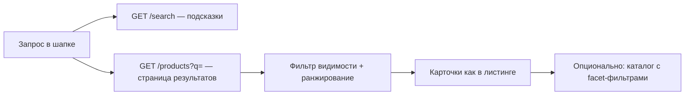

# ЧТЗ: Поиск

**Статус:** актуально  
**Источники:** Понимание задачи, ЧТЗ 06 (витрина и каталог; атрибуты и фильтры — §4.2.0), интервью 2026-03-04 (§5).  
**As-is / To-be:** as-is — раздел 3; to-be — разделы 4–5.

---

## 1. Назначение

Описывает **поведение поиска товаров** на витрине: по каким полям каталога ищем, как формируется выдача, правила видимости, UX и контракт API. **Локальный поиск в ЛК** (заказы, документы) — в ЧТЗ 08 §4.1.1 и ЧТЗ 02 §4.9; граница — §5.11. **Канон стенда (решение W4, 2026-07-06):** подсказки — `GET /search`; **страница результатов** — `GET /products?q=` (§5.8).

**Не входит в этот документ:** выбор и настройка поискового движка (PostgreSQL full-text, `ILIKE`, Laravel Scout и т.д.). **Внешние сервисы** (Ensi Cloud Search, SearchBooster, модуль поиска Bitrix) **на текущем этапе не внедряются** — поиск выполняется **на платформе** по данным каталога, импортированным из 1С.

Цель — клиент быстро находит товар по **артикулу**, **названию**, **бренду** и **свойствам** (например, «для полиуретана», «красный»).

---

## 2. Термины (общие)

| Термин | Описание |
|--------|----------|
| Поисковый запрос (`q`) | Строка, которую вводит пользователь в шапке витрины |
| Поисковая выдача | Список товаров, отсортированный по релевантности (§5.6), с учётом видимости (§5.7) |
| Facet-фильтры | Сужение листинга каталога через `GET /products/filters` — **не** часть поискового запроса (§5.9) |
| Номенклатура контрагента | В 1С: «чужие» названия/артикулы клиента — **post-MVP** для поиска (№34) |

---

## 3. As-is: как ищут товар сейчас (без витрины)

- Клиент ищет через **менеджера**, по **прайсу** или по **артикулу** в своей учётной системе.
- В 1С — по артикулу, наименованию, иногда по цвету и бытовым словам («концентрат», «паста»).
- **Номенклатура контрагента** в 1С связывает внутреннее и клиентское название — на витрине пока не используется.

---

## 4. To-be: контур поиска на витрине

**Граница:** строка поиска → **поиск по каталогу**; сужение на листинге → **facet-фильтры** API (`GET /products/filters`), не смешивать в одном механизме (§5.9).

---

## 5. To-be: требования

### 5.1 Scope MVP

| Входит в MVP | Вне MVP / post-MVP |
|--------------|-------------------|
| Строка поиска в **шапке витрины**, страница результатов | **Глобальный** поиск по заказам и документам из шапки (№46) |
| `GET /search` (подсказки по каталогу) | Единый «умный» поиск по всему ЛК |
| `GET /products?q=` (страница результатов) | Полнотекстовый поиск по содержимому PDF |
| Поиск по полям §5.5 | Внешний поисковый движок (Ensi и др.) |
| Правила видимости §5.7 | **Номенклатура контрагента** в выдаче (№34) |
| Пагинация, сортировка по релевантности | Ручной справочник синонимов в админке |
| | Блок «аналоги» (маркетинг) |
| | «Умный» транслит, исправление опечаток, семантика — **желательно позже** |
| **Локальный** поиск в списке заказов ЛК | — (ЧТЗ 08 §4.1.1) |
| **Локальный** поиск в разделе «Документы» ЛК | — (ЧТЗ 02 §4.9) |

### 5.2 Пользовательские сценарии

| № | Сценарий | Ожидаемое поведение |
|---|----------|---------------------|
| S1 | Ввод **артикула** (`sku`) | Совпадение по `sku` / коду поиска — **в топе** выдачи; полное совпадение выше частичного |
| S2 | Запрос по **названию** Palizh | Совпадение по `name` (и при необходимости `brand`) |
| S3 | Бытовой запрос («концентрат», «красный», «для полиуретана») | Совпадение по **значениям атрибутов** (`attributes[]`), при наличии — по `description` |
| S4 | Несколько слов в запросе | Все значимые токены запроса должны **встретиться** хотя бы в одном из поисковых полей позиции (логика **AND** по словам; см. §5.4) |
| S5 | B2B ищет **персональную** позицию | Видит **общий** ассортимент; **персональная номенклатура контрагента** в поиске — **post-MVP** (№34), как на витрине |
| S6 | **Гость** | Общий ассортимент **без цен**; персональная номенклатура **скрыта** |
| S7 | Сужение после поиска | Переход в каталог с `q` и/или **facet-фильтры** (ЧТЗ 06 §4.2.0) |
| S8 | Ничего не найдено | `items: []`, empty state с подсказкой изменить запрос |

### 5.3 Интерфейс (витрина)

- Поле поиска в **шапке** на публичных страницах (Инфарх: страница «Поиск»).
- **Минимум 3 символа** (после trim) перед вызовом API поиска (`q`); иначе — подсказка в UI, без запроса (согласовано с `public-http-openapi.yaml` и `SEARCH_MIN_QUERY_LENGTH` на стенде).
- **Enter** / «Найти» → страница результатов с `q` в URL; API — **`GET /products?q=`** с `perPage=24` (default в спеке — 10, UI передаёт явно).
- **Suggest (автодополнение):** `GET /search`, от 3 символов, `limit` до 50 на группу.
- **Страница результатов:** те же карточки, что в листинге (`ProductResource` / пагинация Laravel); в ответе при активном `q` — поле **`searchString`** (может отличаться от ввода при исправлении раскладки); заголовок «Результаты поиска: {запрос}».
- **Пагинация:** `page`, `perPage` (UI — **24**).
- **Сортировка при `q`:** релевантность (порядок поискового движка); параметр `sort` при поиске **не использовать** (на стенде — исключение при несовместимом sort).
- **Facet-фильтры на странице поиска:** post-MVP; ссылка «Смотреть в каталоге» с `q` — достаточно для MVP.
- **`catalogCode`:** post-MVP (в `GET /products` на стенде нет); ограничение каталога — через `categorySlug` или переход в каталог.

### 5.4 Обработка запроса `q`

| Правило | Деталь |
|---------|--------|
| Нормализация | `trim`, схлопывание пробелов, **регистр не важен** |
| Длина | Отклонять или обрезать **> 200 символов** → `400` |
| Токены | Разбить по пробелам; игнорировать токены короче **2 символов** (кроме чисто цифровых фрагментов артикула) |
| Логика слов | **AND:** каждый оставшийся токен должен найтись **хотя бы в одном** поле из §5.5 |
| Артикул | Символы `-`, `/`, `.` в `sku` **сохранять**; не ломать поиск по кодам вида `ABC-123` |
| Пустой результат | HTTP `200`, `items: []` |
| Описание | Участвует в поиске, но с **низким весом** (§5.6); длинные тексты не должны доминировать над артикулом/названием |

**MVP не обещает:** автоматическое исправление опечаток, транслит (`kraska` → `краска`), смену раскладки — это **улучшения post-MVP** или отдельное решение по движку.

### 5.5 По каким полям ищем (канон MVP)

Данные — из импорта 1С (`sync.products`, `sync.categories`, `sync.product-attributes`); см. [`Модель_данных_каталог_1С_обмен.md`](../Техническая%20часть/Модель_данных_каталог_1С_обмен.md).

| Приоритет | Поле / источник | Поле в обмене / API | Тип совпадения | Примеры запросов |
|-----------|-----------------|---------------------|----------------|------------------|
| **1** | Артикул | `sku` (`Code`, `КодДляПоиска` в 1С) | Точное и **префиксное**; токен целиком в `sku` | `PU-402`, `12345` |
| **2** | Наименование | `name` | Подстрока / full-text по словам | «акриловая краска», «грунт» |
| **3** | Бренд | `brand` | Подстрока | «Tikkurila» |
| **4** | Значения атрибутов | `attributes[].values[]` | Подстрока по каждому значению | «полиуретан», «фасад» |
| **4** | Подписи атрибутов (справочник) | `sync.product-attributes.label` для кода атрибута | Не ищем отдельно; только для UI | — |
| **5** | Текстовые значения характеристик | Имена/коды из `sync.product-type-characteristics` (`name`, при наличии `ral`, `hex`), если связаны с товаром и попадают в поисковый индекс платформы | Подстрока | «красный», RAL-код |
| **6** | Название категории | `sync.categories.name` (по `parentGuid` товара) | Подстрока | «лаки», «грунты» |
| **7** | Описание | `description` | Подстрока / full-text, **низкий вес** | «для наружных работ» |

**Не участвуют в текстовом поиске (MVP):**

| Поле | Назначение |
|------|------------|
| `guid`, `nomenclatureGuid`, `id` | Идентификация, ссылки |
| `slug` | URL, не поисковое поле для пользователя |
| `price`, остатки | Только **отображение** в карточке выдачи, не критерий поиска |
| `exclusiveCounterpartyGuid` | **Фильтр видимости**, не текстовый индекс |
| `isArchived`, `isAvailableForOrder` | **Фильтр включения** в выдачу |
| Числовые `attrRange` (плотность и т.д.) | Только **facet-фильтры** каталога, не строка поиска |

**Коды атрибутов MVP** (значения которых индексируются): `worktype`, `surface`, `special`, `compatibility`, `tintingMethod`, `density` (текстовая часть / label значений; числовой диапазон — через фильтры) — ЧТЗ 06 §4.2.0.

**Номенклатура контрагента (post-MVP, №34):** при появлении в обмене — отдельные поля «клиентский артикул / название» с фильтром по `counterpartyGuid` сессии; до этого не искать по «чужим» кодам клиента.

### 5.6 Ранжирование выдачи (MVP)

Порядок в `items[]` — от более релевантных к менее. Рекомендуемая шкала (реализация на backend, логика фиксируется в коде/тестах):

1. **Полное совпадение** `sku` с запросом (или с одним из токенов, если запрос — артикул).
2. **Префикс** `sku`.
3. Совпадение **в начале** `name`.
4. Совпадение **внутри** `name`.
5. Совпадение в `brand`.
6. Совпадение в **атрибутах** / характеристиках.
7. Совпадение только в `description`.
8. Совпадение только в **названии категории**.

При равной релевантности — стабильная вторичная сортировка (например, по `name` ASC).

### 5.7 Правила видимости и исключения из выдачи

Те же правила, что для `GET /products` (ЧТЗ 06 §4.2.1–4.2.2):

| Условие | В выдаче |
|---------|----------|
| `exclusiveCounterpartyGuid` задан и ≠ контрагент сессии (или гость) | **Нет** |
| `exclusiveCounterpartyGuid` = контрагент сессии | **Да** |
| `exclusiveCounterpartyGuid` null | **Да** (общий каталог) |
| Архив, остаток 0, недоступен к заказу | **Нет** (как на витрине) |
| `isAvailableForOrder = false` | **Нет** |
| Цены в карточках | Гость — без цен; B2B — по ЧТЗ 06 §4.2.4 |

Поиск **не должен** возвращать позиции, по которым `GET /products/{id}` даст **404** для текущего зрителя.

### 5.8 API платформы

**Решение W4 (2026-07-06):** два endpoint, без отдельного `GET /search/products`.

| Сценарий | Endpoint | Статус на стенде (`f497379`) |
|----------|----------|------------------------------|
| Подсказки в шапке | `GET /search` | **Готово** |
| Страница результатов | **`GET /products?q=`** | **Готово** (`ProductController` + `SearchService::searchProducts`) |

Продуктовый черновик `openapi_client_mvp.yaml` (`GET /search/products`) — **не канон**; ориентир — `public-http-openapi.yaml`.

#### 5.8.1 Подсказки — `GET /search`

| Параметр | Обяз. | Правило |
|----------|-------|---------|
| `q` | да | min **3** символа |
| `limit` | нет | default 10, max 50 на группу (products/categories) |

**Ответ:** `SearchResponse` — `searchString`, `nextTokens[]`, `data.products[]`, `data.categories[]`; в `name` товара возможен HTML-highlight (`<mark>`).

#### 5.8.2 Страница результатов — `GET /products` + `q`

| Параметр | Обяз. | Правило |
|----------|-------|---------|
| `q` | да (на странице поиска) | min **3** символа; нормализация §5.4 |
| `page`, `perPage` | нет | UI: `perPage=**24**`; default в спеке — 10 |
| `categorySlug`, `attr[]`, `attrRange[]` | нет | Facet на странице поиска — **post-MVP**; сужение — переход в каталог |
| `sort` | нет | При активном `q` **не задавать** (релевантность §5.6) |

**Ответ:** пагинация Laravel (`data[]` — те же поля, что `GET /products` без `q`); при `q` — доп. поле **`searchString`** (исправленная строка). Пустая выдача — `data: []`, HTTP `200`.

**Цепочка backend:**

1. Auth (опционально) → контекст контрагента.
2. `SearchService::searchProducts` (Typesense) → id + порядок релевантности (до 100 id).
3. `Product::catalog($user)` + фильтры §5.7.
4. Пагинация, обогащение ценами для B2B (как листинг).

### 5.9 Граница поиска и facet-фильтров каталога

| Механизм | Назначение |
|----------|------------|
| `GET /products?q=` | Текстовый поиск по §5.5 (страница результатов) |
| `GET /search` | Подсказки в шапке (не путать со страницей результатов) |
| `GET /products` + `attr[]`, `attrRange[]` | Facet-фильтры листинга |
| `GET /products/filters` | Схема фильтров для категории |

**Поток:** поиск → список SKU → карточка **или** каталог с `q` + фильтры.

**Локальный поиск в ЛК** (заказы, документы) — **не** этот документ; см. §5.11.

**Актуальность данных:** выдача опирается на те же записи каталога, что и листинг после `sync.products` / `sync.categories` / `sync.product-attributes`; задержка не больше, чем у публичного каталога после обмена с 1С.

### 5.11 Граница: витрина vs ЛК

Данный ЧТЗ описывает **только поиск по каталогу товаров** (витрина, шапка, страница `?q=`). **Не смешивать** с локальными списками в личном кабинете.

| Контекст | Механизм | ЧТЗ | Движок MVP |
|----------|----------|-----|------------|
| Шапка / страница результатов | `GET /search`, `GET /products?q=` | **11** (этот документ) | Typesense + каталог |
| Список **истории заказов** | `GET /api/orders?search=&status=` | **08** §4.1.1 | SQL `LIKE` + разбор дат |
| Раздел **«Документы»** | `GET /api/documents?search=&type=` (целевой) | **02** §4.9 | SQL `LIKE` по метаданным |

**№46 (уточнение 2026-07-09):** из **шапки** пользователь ищет **товары**, не заказы и не PDF. Поиск по заказам и документам — **только внутри соответствующих разделов ЛК**.

**Общие правила:**

- Поле поиска в шапке **не** подставляет `q` в API заказов/документов.
- Min длина запроса: каталог — **3** символа (§5.3); заказы — **1**; документы — **2** (ЧТЗ 02 §4.9.3).
- Typesense / `SearchService` **не** индексируют заказы и документы в MVP.

### 5.10 Нефункциональные требования

| Показатель | Ориентир MVP |
|------------|--------------|
| p95 `GET /products?q=` | ≤ **1,5 с** (уточнить нагрузочным тестом) |
| Консистентность с каталогом | Те же правила видимости и архивности |
| Логирование | `q` (без ПДн), latency; аналитика запросов — post-MVP |

---

## 6. Открытые вопросы

- **№34:** выгрузка **номенклатуры контрагента** из 1С для поиска по клиентским названиям/артикулам.
- **№54:** фактическое **заполнение атрибутов** в 1С — без данных поиск по свойствам (S3) будет слабым.
- ~~Suggest в шапке — отдельный endpoint?~~ — **закрыто (W4):** `GET /search`.
- ~~Страница результатов — отдельный path?~~ — **закрыто (W4, 2026-07-06):** `GET /products?q=`.
- Facet-фильтры на странице результатов — MVP или post-MVP.
- Транслит / опечатки / «умный» поиск — post-MVP или отдельное решение.
- ~~Поиск по заказам в ЛК~~ — **уточнено (№46, 2026-07-09):** глобальный поиск по заказам — **нет**; локальный в списке — **да** (ЧТЗ 08 §4.1.1).
- ~~Поиск в разделе «Документы»~~ — вынесен в ЧТЗ 02 §4.9.
- ~~Ensi Cloud Search как обязательный движок~~ — **снято (2026-06-02):** поиск на платформе; Ensi/Bitrix — не внедряем на текущем этапе.

---

## 7. Связь с другими ЧТЗ

| Блок | Связь |
|------|--------|
| Витрина и каталог | Поля товара, атрибуты, видимость (ЧТЗ 06) |
| Интеграция с 1С | Источник данных для поиска (ЧТЗ 09, `Модель_данных_каталог_1С_обмен.md`) |
| ЛК: заказы, документы | Локальный поиск — ЧТЗ 08 §4.1.1, ЧТЗ 02 §4.9 (§5.11) |
| OpenAPI | `public-http-openapi.yaml` — `GET /search`, `GET /products` + `q`; `GET /orders` + `search`; `GET /documents` — целевой (ЧТЗ 02); черновик `openapi_client_mvp.yaml` (`/search/products`) — не канон |
