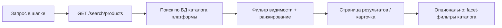

# ЧТЗ: Поиск

**Статус:** актуально  
**Источники:** Понимание задачи, ЧТЗ 06 (витрина и каталог; атрибуты и фильтры — §4.2.0), интервью 2026-03-04 (§5).  
**As-is / To-be:** as-is — раздел 3; to-be — разделы 4–5.

---

## 1. Назначение

Описывает **поведение поиска товаров** на витрине: по каким полям каталога ищем, как формируется выдача, правила видимости, UX и контракт API `GET /search/products`.

**Не входит в этот документ:** выбор и настройка поискового движка (PostgreSQL full-text, `ILIKE`, Laravel Scout и т.д.). **Внешние сервисы** (Ensi Cloud Search, SearchBooster, модуль поиска Bitrix) **на текущем этапе не внедряются** — поиск выполняется **на платформе** по данным каталога, импортированным из 1С.

Цель — клиент быстро находит товар по **артикулу**, **названию**, **бренду** и **свойствам** (например, «для полиуретана», «красный»).

---

## 2. Термины (общие)

| Термин | Описание |
|--------|----------|
| Поисковый запрос (`q`) | Строка, которую вводит пользователь в шапке витрины |
| Поисковая выдача | Список товаров, отсортированный по релевантности (§5.6), с учётом видимости (§5.7) |
| Facet-фильтры | Сужение листинга каталога через `GET /products/filters` — **не** часть поискового запроса (§5.9) |
| Номенклатура контрагента | В 1С: «чужие» названия/артикулы клиента — **post-MVP** для поиска (№34) |

---

## 3. As-is: как ищут товар сейчас (без витрины)

- Клиент ищет через **менеджера**, по **прайсу** или по **артикулу** в своей учётной системе.
- В 1С — по артикулу, наименованию, иногда по цвету и бытовым словам («концентрат», «паста»).
- **Номенклатура контрагента** в 1С связывает внутреннее и клиентское название — на витрине пока не используется.

---

## 4. To-be: контур поиска на витрине

**Граница:** строка поиска → **поиск по каталогу**; сужение на листинге → **facet-фильтры** API (`GET /products/filters`), не смешивать в одном механизме (§5.9).

---

## 5. To-be: требования

### 5.1 Scope MVP

| Входит в MVP | Вне MVP / post-MVP |
|--------------|-------------------|
| Строка поиска в шапке, страница результатов | Поиск по заказам в ЛК (№46 — закрыт) |
| `GET /search/products` | Отдельный поиск внутри ЛК |
| Поиск по полям §5.5 | Ручной справочник синонимов в админке |
| Правила видимости §5.7 | **Номенклатура контрагента** в выдаче (№34) |
| Пагинация, сортировка по релевантности | Блок «аналоги» (маркетинг) |
| | «Умный» транслит, исправление опечаток, семантика — **желательно позже**; для MVP достаточно регистронезависимого поиска по подстроке / full-text (§5.4) |
| | Внешний поисковый движок (Ensi и др.) |

### 5.2 Пользовательские сценарии

| № | Сценарий | Ожидаемое поведение |
|---|----------|---------------------|
| S1 | Ввод **артикула** (`sku`) | Совпадение по `sku` / коду поиска — **в топе** выдачи; полное совпадение выше частичного |
| S2 | Запрос по **названию** Palizh | Совпадение по `name` (и при необходимости `brand`) |
| S3 | Бытовой запрос («концентрат», «красный», «для полиуретана») | Совпадение по **значениям атрибутов** (`attributes[]`), при наличии — по `description` |
| S4 | Несколько слов в запросе | Все значимые токены запроса должны **встретиться** хотя бы в одном из поисковых полей позиции (логика **AND** по словам; см. §5.4) |
| S5 | B2B ищет **персональную** позицию | Видит **общий** ассортимент; **персональная номенклатура контрагента** в поиске — **post-MVP** (№34), как на витрине |
| S6 | **Гость** | Общий ассортимент **без цен**; персональная номенклатура **скрыта** |
| S7 | Сужение после поиска | Переход в каталог с `q` и/или **facet-фильтры** (ЧТЗ 06 §4.2.0) |
| S8 | Ничего не найдено | `items: []`, empty state с подсказкой изменить запрос |

### 5.3 Интерфейс (витрина)

- Поле поиска в **шапке** на публичных страницах (Инфарх: страница «Поиск»).
- **Минимум 2 символа** (после trim) перед вызовом API; иначе — подсказка, без запроса.
- **Enter** / «Найти» → страница результатов, `q` в URL.
- **Suggest (автодополнение):** желательно, не блокер — от 2–3 символов, до 8–10 карточек (`GET /search/products?perPage=10`).
- **Страница результатов:** карточки как в листинге (`ProductCardSummary`); заголовок «Результаты поиска: {запрос}».
- **Пагинация:** `page`, `perPage` (default **24**).
- **Сортировка MVP:** только **релевантность** (§5.6); по цене/новизне — post-MVP.
- **Facet-фильтры на странице поиска:** post-MVP; ссылка «Смотреть в каталоге» с `q` — достаточно для MVP.
- **`catalogCode`:** опционально ограничить выдачу каталогом (розница / опт / бренды), если поиск из его контекста.

### 5.4 Обработка запроса `q`

| Правило | Деталь |
|---------|--------|
| Нормализация | `trim`, схлопывание пробелов, **регистр не важен** |
| Длина | Отклонять или обрезать **> 200 символов** → `400` |
| Токены | Разбить по пробелам; игнорировать токены короче **2 символов** (кроме чисто цифровых фрагментов артикула) |
| Логика слов | **AND:** каждый оставшийся токен должен найтись **хотя бы в одном** поле из §5.5 |
| Артикул | Символы `-`, `/`, `.` в `sku` **сохранять**; не ломать поиск по кодам вида `ABC-123` |
| Пустой результат | HTTP `200`, `items: []` |
| Описание | Участвует в поиске, но с **низким весом** (§5.6); длинные тексты не должны доминировать над артикулом/названием |

**MVP не обещает:** автоматическое исправление опечаток, транслит (`kraska` → `краска`), смену раскладки — это **улучшения post-MVP** или отдельное решение по движку.

### 5.5 По каким полям ищем (канон MVP)

Данные — из импорта 1С (`sync.products`, `sync.categories`, `sync.product-attributes`); см. [`Модель_данных_каталог_1С_обмен.md`](../Техническая%20часть/Модель_данных_каталог_1С_обмен.md).

| Приоритет | Поле / источник | Поле в обмене / API | Тип совпадения | Примеры запросов |
|-----------|-----------------|---------------------|----------------|------------------|
| **1** | Артикул | `sku` (`Code`, `КодДляПоиска` в 1С) | Точное и **префиксное**; токен целиком в `sku` | `PU-402`, `12345` |
| **2** | Наименование | `name` | Подстрока / full-text по словам | «акриловая краска», «грунт» |
| **3** | Бренд | `brand` | Подстрока | «Tikkurila» |
| **4** | Значения атрибутов | `attributes[].values[]` | Подстрока по каждому значению | «полиуретан», «фасад» |
| **4** | Подписи атрибутов (справочник) | `sync.product-attributes.label` для кода атрибута | Не ищем отдельно; только для UI | — |
| **5** | Текстовые значения характеристик | Имена/коды из `sync.product-type-characteristics` (`name`, при наличии `ral`, `hex`), если связаны с товаром и попадают в поисковый индекс платформы | Подстрока | «красный», RAL-код |
| **6** | Название категории | `sync.categories.name` (по `parentGuid` товара) | Подстрока | «лаки», «грунты» |
| **7** | Описание | `description` | Подстрока / full-text, **низкий вес** | «для наружных работ» |

**Не участвуют в текстовом поиске (MVP):**

| Поле | Назначение |
|------|------------|
| `guid`, `nomenclatureGuid`, `id` | Идентификация, ссылки |
| `slug` | URL, не поисковое поле для пользователя |
| `price`, остатки | Только **отображение** в карточке выдачи, не критерий поиска |
| `exclusiveCounterpartyGuid` | **Фильтр видимости**, не текстовый индекс |
| `isArchived`, `isAvailableForOrder` | **Фильтр включения** в выдачу |
| Числовые `attrRange` (плотность и т.д.) | Только **facet-фильтры** каталога, не строка поиска |

**Коды атрибутов MVP** (значения которых индексируются): `worktype`, `surface`, `special`, `compatibility`, `tintingMethod`, `density` (текстовая часть / label значений; числовой диапазон — через фильтры) — ЧТЗ 06 §4.2.0.

**Номенклатура контрагента (post-MVP, №34):** при появлении в обмене — отдельные поля «клиентский артикул / название» с фильтром по `counterpartyGuid` сессии; до этого не искать по «чужим» кодам клиента.

### 5.6 Ранжирование выдачи (MVP)

Порядок в `items[]` — от более релевантных к менее. Рекомендуемая шкала (реализация на backend, логика фиксируется в коде/тестах):

1. **Полное совпадение** `sku` с запросом (или с одним из токенов, если запрос — артикул).
2. **Префикс** `sku`.
3. Совпадение **в начале** `name`.
4. Совпадение **внутри** `name`.
5. Совпадение в `brand`.
6. Совпадение в **атрибутах** / характеристиках.
7. Совпадение только в `description`.
8. Совпадение только в **названии категории**.

При равной релевантности — стабильная вторичная сортировка (например, по `name` ASC).

### 5.7 Правила видимости и исключения из выдачи

Те же правила, что для `GET /products` (ЧТЗ 06 §4.2.1–4.2.2):

| Условие | В выдаче |
|---------|----------|
| `exclusiveCounterpartyGuid` задан и ≠ контрагент сессии (или гость) | **Нет** |
| `exclusiveCounterpartyGuid` = контрагент сессии | **Да** |
| `exclusiveCounterpartyGuid` null | **Да** (общий каталог) |
| Архив, остаток 0, недоступен к заказу | **Нет** (как на витрине) |
| `isAvailableForOrder = false` | **Нет** |
| Цены в карточках | Гость — без цен; B2B — по ЧТЗ 06 §4.2.4 |

Поиск **не должен** возвращать позиции, по которым `GET /products/{id}` даст **404** для текущего зрителя.

### 5.8 API платформы

**Канон стенда:** `GET /search/products` в **`public-http-openapi.yaml`** (GitLab `docs/`). Продуктовый черновик — `openapi_client_mvp.yaml` (синхронизировать при изменении контракта).

| Параметр | Обяз. | Правило |
|----------|-------|---------|
| `q` | да | `minLength: 1`, `maxLength: 200`; UI — не вызывать при &lt; 2 символов |
| `catalogCode` | нет | Ограничение каталога |
| `page`, `perPage` | нет | default 1 / 24, max `perPage` 100 |

**Ответ:** `SearchProductsResponse` — `query`, `items[]` (`ProductCardSummary`), `meta`.

**Цепочка backend (логика, без привязки к движку):**

1. Auth (опционально) → контекст контрагента.
2. Нормализация `q` (§5.4).
3. Поиск по полям §5.5 с фильтрами §5.7.
4. Ранжирование §5.6, пагинация.
5. Обогащение ценами/остатками для B2B (как листинг).

### 5.9 Граница поиска и facet-фильтров каталога

| Механизм | Назначение |
|----------|------------|
| `GET /search/products` | Текстовый поиск по §5.5 |
| `GET /products` + `attr[]`, `attrRange[]` | Facet-фильтры листинга |
| `GET /products/filters` | Схема фильтров для категории |

**Поток:** поиск → список SKU → карточка **или** каталог с `q` + фильтры. Поиск по заказам в ЛК — **вне MVP**.

**Актуальность данных:** выдача опирается на те же записи каталога, что и листинг после `sync.products` / `sync.categories` / `sync.product-attributes`; задержка не больше, чем у публичного каталога после обмена с 1С.

### 5.10 Нефункциональные требования

| Показатель | Ориентир MVP |
|------------|--------------|
| p95 `GET /search/products` | ≤ **1,5 с** (уточнить нагрузочным тестом) |
| Консистентность с каталогом | Те же правила видимости и архивности |
| Логирование | `q` (без ПДн), latency; аналитика запросов — post-MVP |

---

## 6. Открытые вопросы

- **№34:** выгрузка **номенклатуры контрагента** из 1С для поиска по клиентским названиям/артикулам.
- **№54:** фактическое **заполнение атрибутов** в 1С — без данных поиск по свойствам (S3) будет слабым.
- Suggest в шапке — отдельный endpoint или укороченный search.
- Facet-фильтры на странице результатов — MVP или post-MVP.
- Транслит / опечатки / «умный» поиск — post-MVP или отдельное решение.
- ~~Поиск по заказам в ЛК~~ — закрыто (№46): только каталог.
- ~~Ensi Cloud Search как обязательный движок~~ — **снято (2026-06-02):** поиск на платформе; Ensi/Bitrix — не внедряем на текущем этапе.

---

## 7. Связь с другими ЧТЗ

| Блок | Связь |
|------|--------|
| Витрина и каталог | Поля товара, атрибуты, видимость (ЧТЗ 06) |
| Интеграция с 1С | Источник данных для поиска (ЧТЗ 09, `Модель_данных_каталог_1С_обмен.md`) |
| OpenAPI | `openapi_client_mvp.yaml` — `GET /search/products` |
