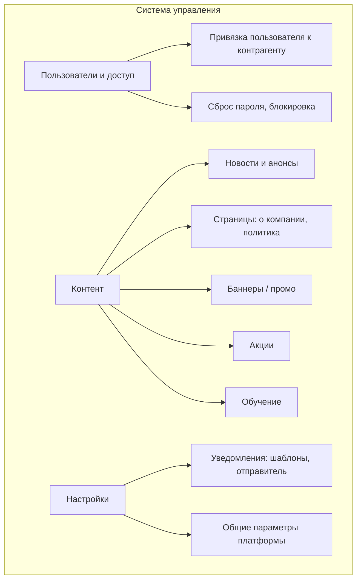

# ЧТЗ: Система управления (админка)

**Статус:** драфт  
**Источники:** Понимание задачи, ЧТЗ 06 (витрина и каталог), ЧТЗ 09 (интеграция с 1С).  
**As-is / To-be:** as-is — админки нового сайта **нет** (текущий сайт не используется). to-be — система управления для сотрудников: пользователи ЛК, контент витрины, настройки (разделы 3–4).

---

## 1. Назначение

Описывает систему управления платформой для сотрудников заказчика: управление контентом витрины, пользователями ЛК (привязка к контрагентам, сброс пароля), базовые настройки уведомлений и общие параметры. Личный кабинет менеджера не предусмотрен; общение с клиентами — в том числе через **внешний чат-виджет** и почту/CRM, настраиваемые **вне** платформы. Цель — минимально необходимый набор функций админки для MVP и последующего расширения.

---

## 2. Термины (общие)

| Термин | Описание |
|--------|----------|
| Админка | Веб-интерфейс для сотрудников компании (не для клиентов) |
| Контент витрины | Новости, страницы «О компании», баннеры, акции, обучающие карточки, тексты форм и др. маркетинговые материалы |

---

## 3. To-be: блоки системы управления (драфт)

---

## 4. To-be: требования (драфт)

### 4.1 Пользователи и доступ

- Просмотр списка пользователей ЛК (привязка к контрагенту из 1С). Создание/редактирование учётных записей при ручном онбординге или при заявке «стать клиентом» (роль оператора).
- Сброс пароля пользователю, блокировка/разблокировка доступа.
- Для MVP фиксируется минимальный контур ролей админки:
  - `суперадмин` — полный доступ ко всем разделам админки и настройкам платформы;
  - `оператор / поддержка` — работа с пользователями ЛК и (при наличии в релизе) служебным мониторингом без доступа к критичным системным настройкам; **без** обязательной очереди тикетов обращений в MVP;
  - `контент-менеджер` — управление новостями, баннерами, акциями, обучающими карточками и статическими страницами.
- Детализированную матрицу прав по операциям и полям можно вынести на следующий этап после MVP.
- Админка не должна становиться вторым источником истины по контрагентам, договорам и коммерческим условиям: эти данные приходят из 1С; в админке допускается только просмотр связки и служебные действия с доступом пользователя.

### 4.2 Контент

- Управление новостями и анонсами: создание, редактирование, публикация, снятие с публикации. Отображение на витрине (раздел «Новости» и/или блоки на главной); возможность указывать ссылку на материалы на основном сайте/в блоге.
- Редактирование статических страниц: о компании, политика конфиденциальности и т.д. (по Инфарх).
- Управление баннерами и промо-блоками на главной/каталоге:
  - загрузка изображений, настройка заголовка/текста, ссылок (на акции, обучение, разделы сайта);
  - управление порядком и периодом показа.
- Управление разделом «Акции»:
  - создание/редактирование карточек акций (описание, период, условия, применимость, ссылка в каталог/ЛК);
  - привязка акций к баннерам и витрине.
- Управление разделом «Обучение»:
  - карточки курсов/мероприятий/активностей (курсы, форум, квартирники, **экскурсии/вебинары** и т.п.) как контентные сущности, управляемые из админки;
  - поддержка **rich content**: форматирование текста, вставка ссылок, видео, прикрепление файлов (КП/презентации), изображения;
  - публикация/снятие с публикации карточек; карточки в MVP **публично видимы** на витрине, а «оставить заявку» доступно только авторизованным пользователям (проверка на клиентской стороне, не в админке);
  - параметры для заявки: список **доступных форматов** (онлайн/офлайн/гибрид), базовые поля отображения (название, категория/тип, описание).

### 4.3 Настройки

- Настройки уведомлений: шаблоны писем (**email**), отправитель. **SMS и push платформой на текущем этапе не планируются** (ЧТЗ 10). При необходимости — управление через конфигурацию/переменные окружения.
- Для `MVP` в админке должна быть доступна настройка **маршрутизации внутренних обращений**:
  - тип обращения / заявки;
  - один или несколько адресатов (`email`);
  - на текущем этапе канал маршрутизации с платформы — **только email** (ЧТЗ 10).
- Маршрутизация по типам является обязательной для `MVP`, чтобы операционная команда могла менять получателей **без разработки**.
- Минимальный набор типов обращений для настройки:
  - претензии;
  - нестандартные заявки / обращение к менеджеру (свободная форма из ЛК);
  - заявки на обучение;
  - заявки `Стать клиентом`;
  - общие обращения / обратная связь;
  - при необходимости — запросы документов.
  - Для типа **«претензии»** и **«заявки на обучение»** настройки адресатов обязательны к заполнению при запуске.
- Общие параметры MVP, которые редактируются в админке платформы:
  - название платформы;
  - контакты поддержки;
  - общие тексты и ссылки в клиентских формах и уведомлениях;
  - **порог бесплатной доставки** как параметр платформы.
- Порог бесплатной доставки для MVP фиксируется как настройка платформы в админке, а не как обязательный параметр, приходящий из `1С`.
- Настройки интеграции с 1С и, при необходимости, внешними хранилищами для маркетинговых материалов. Для клиентских документов в ЛК источником выдачи должна оставаться 1С.
- Для каталогов и документов нужно явно разделить:
  - что приходит из 1С и в админке только просматривается;
  - что редактируется в админке как маркетинговый или вспомогательный контент;
  - какие дополнительные документы (`TDS/MSDS`, `СГР`, паспорта безопасности) должны быть заведены в 1С для выдачи в ЛК, а какие вообще не входят в контур ЛК и остаются только во внешней ручной выдаче.

### 4.4 Заявки и обращения

- **Управление заявками в админке (MVP):** полноценной тикет-системы, статусов обращений, переписки и очереди обработки **нет**. Обязательна только **настройка маршрутизации уведомлений** (email-адресаты по типам обращений, см. §4.3) и отправка писем/уведомлений с платформы. Операционная обработка заявок — в почте, 1С и внешних системах (в т.ч. канал, в который уходит **внешний чат-виджет**).
- **Просмотр списков заявок в админке** (претензии, «стать клиентом», обратная связь, обучение, нестандарт) в MVP **не является обязательным требованием**; допускается **опционально** как технический журнал / аудит для поддержки, если заказчик и команда разработки сочтут нужным — без workflow и без обязанности вести учёт только через админку.
- **Заказы с сбоем синхронизации с 1С:** точка контроля очереди обмена на платформе **желательна** — операционный список или фильтр по заказам с `integrationSyncState` в состояниях `failed` / `manual_review_required` (см. `order_lifecycle_contract.md` §5.2, ЧТЗ 09 §4.2), чтобы не смешивать с клиентской шкалой из шести статусов; дублирование полного учёта заказов из 1С не требуется.
- Для претензий в `MVP` админка не управляет жизненным циклом самой претензии на платформе: карточка в ЛК остаётся в статусе `Отправлена`, а дальнейшая обработка ведётся вне платформы.

### 4.5 Отчётность и аудит

- Логирование действий в админке (кто, когда, что изменил) — рекомендуется для аудита. Отчёты по заказам, клиентам — в 1С или выгрузка; в админке только при явном требовании.

---

## 5. Открытые вопросы

- Нужен ли в админке просмотр заказов и документов клиентов (дублирование 1С) или достаточно работы в 1С?
- ~~Детальная матрица прав в админке по разделам и действиям после MVP~~ — базовая ролевая модель зафиксирована; дальнейшая детализация относится к post-MVP.
- После `MVP`: нужен ли полноценный workflow обработки обращений и претензий прямо в админке, или достаточно маршрутизации уведомлений и опционального журнала отправок.
- Нужна ли админке только настройка видимости/описаний для дополнительных документов, если сами файлы для ЛК должны отдаваться из 1С; или требуется отдельный контур только для маркетинговых файлов, не относящихся к клиентскому документообороту.
- Какие интеграционные настройки 1С допустимо отображать/менять в админке, а какие должны оставаться только в технической конфигурации.

---

## 6. Связь с другими ЧТЗ

| Блок | Связь |
|------|--------|
| Регистрация и онбординг | Одобрение доступа, создание учётной записи (ЧТЗ 05) |
| Витрина | Контент: новости, страницы (ЧТЗ 06) |
| Уведомления | Шаблоны и настройки рассылок (ЧТЗ 10) |
| Интеграция с 1С | Привязка пользователей к контрагентам, источники данных каталога и документов, границы редактирования в админке (ЧТЗ 09) |
