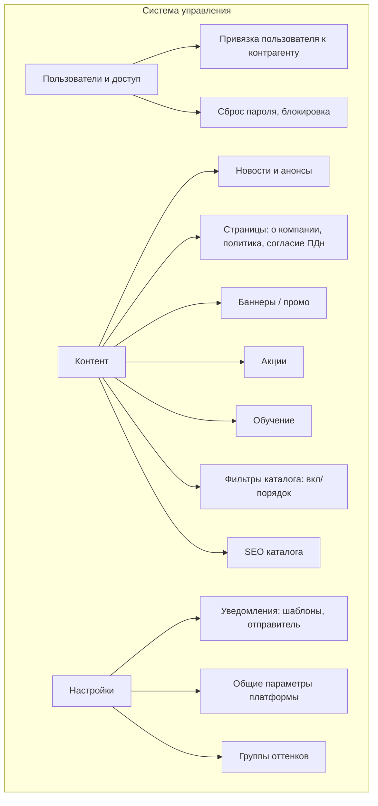

# ЧТЗ: Система управления (админка)

**Статус:** актуально
**Источники:** Понимание задачи, ЧТЗ 06 (витрина и каталог), ЧТЗ 09 (интеграция с 1С).  
**As-is / To-be:** as-is — админки нового сайта **нет** (текущий сайт не используется). to-be — система управления для сотрудников: пользователи ЛК, контент витрины, настройки (разделы 3–4).

---

## 1. Назначение

Описывает систему управления платформой для сотрудников заказчика: управление контентом витрины, **фильтрами каталога** (вкл/выкл, порядок), **SEO каталога**, пользователями ЛК (привязка к контрагентам, сброс пароля), базовые настройки уведомлений и общие параметры. Личный кабинет менеджера не предусмотрен; общение с клиентами — в том числе через **внешний чат-виджет** и почту/CRM, настраиваемые **вне** платформы. Цель — минимально необходимый набор функций админки для MVP и последующего расширения.

---

## 2. Термины (общие)

| Термин | Описание |
|--------|----------|
| Админка | Веб-интерфейс для сотрудников компании (не для клиентов) |
| Контент витрины | Новости, страницы «О компании», баннеры, акции, обучающие карточки, тексты форм и др. маркетинговые материалы |

---

## 3. To-be: блоки системы управления

```mermaid
flowchart TB
    subgraph Админка["Система управления"]
        A[Пользователи и доступ] --> A1[Привязка пользователя к контрагенту]
        A --> A2[Сброс пароля, блокировка]
        B[Контент] --> B1[Новости и анонсы]
        B --> B2[Страницы: о компании, политика, согласие ПДн]
        B --> B3[Баннеры / промо]
        B --> B4[Акции]
        B --> B5[Обучение]
        B --> B6[Фильтры каталога: вкл/порядок]
        B --> B7[SEO каталога]
        C[Настройки] --> C1[Уведомления: шаблоны, отправитель]
        C --> C2[Общие параметры платформы]
        C --> C3[Группы оттенков]
    end
```

---

## 4. To-be: требования

### 4.1 Пользователи и доступ

- Просмотр списка пользователей ЛК (привязка к контрагенту из 1С). Создание/редактирование учётных записей при ручном онбординге или при заявке «стать клиентом» (роль оператора).
- Сброс пароля пользователю, блокировка/разблокировка доступа.
- Для MVP фиксируется минимальный контур ролей админки:
  - `суперадмин` — полный доступ ко всем разделам админки и настройкам платформы;
  - `оператор / поддержка` — работа с пользователями ЛК и (при наличии в релизе) служебным мониторингом без доступа к критичным системным настройкам; **без** обязательной очереди тикетов обращений в MVP;
  - `контент-менеджер` — управление новостями, баннерами, акциями, обучающими карточками и статическими страницами.
- Детализированную матрицу прав по операциям и полям можно вынести на следующий этап после MVP.
- Админка не должна становиться вторым источником истины по контрагентам, договорам и коммерческим условиям: эти данные приходят из 1С; в админке допускается только просмотр связки и служебные действия с доступом пользователя.

### 4.2 Контент

- Управление новостями и анонсами: создание, редактирование, публикация, снятие с публикации. Отображение на витрине (раздел «Новости» и/или блоки на главной); возможность указывать ссылку на материалы на основном сайте/в блоге.
- Редактирование статических (юридических и информационных) страниц витрины. **В MVP обязательны** (тексты предоставляет заказчик / юрист; платформа — публикация, версия, slug, SEO-поля):
  - **«О компании»**;
  - **Политика конфиденциальности**;
  - **Согласие на обработку персональных данных** (отдельная страница или явный раздел политики — по решению юриста заказчика; на формах должен быть кликабельный документ);
  - при необходимости — пользовательское соглашение / оферта (если юрист заказчика включит в комплект).
- Для статических страниц и новостей — поля **`metaTitle` / `metaDescription` / `metaKeywords`** (и slug) для SEO и Open Graph (ЧТЗ 06 §4.7).
- Страницы политики и согласия на ПДн должны быть доступны **без авторизации**; ссылки на них — в футере витрины и в формах, собирающих ПДн (ЧТЗ 05, 13 §4.9).
- Управление баннерами и промо-блоками на главной/каталоге:
  - загрузка изображений, настройка заголовка/текста, ссылок (на акции, обучение, разделы сайта);
  - управление порядком и периодом показа.
- Управление разделом «Акции»:
  - создание/редактирование карточек акций (описание, период, условия, применимость, ссылка в каталог/ЛК — на публичной витрине отдаётся как поле **`ctaUrl`** в [`public-http-openapi.yaml`](../Техническая%20часть/public-http-openapi.yaml), см. схемы `Promotion` / `PromotionListItem`);
  - связь с баннерами: **достаточно URL** (баннер `targetUrl` → страница акции или сразу в каталог); жёсткая связь сущностей «баннер ↔ акция» в админке **не обязательна**, если переход задан прямой ссылкой (см. также [`admin_role_and_routing_matrix.md`](../Техническая%20часть/admin_role_and_routing_matrix.md)).
- Управление разделом «Обучение»:
  - карточки курсов/мероприятий/активностей (курсы, форум, квартирники, **экскурсии/вебинары** и т.п.) как контентные сущности, управляемые из админки;
  - поддержка **rich content**: форматирование текста, вставка ссылок, видео, прикрепление файлов (КП/презентации), изображения;
  - публикация/снятие с публикации карточек; карточки в MVP **публично видимы** на витрине, а «оставить заявку» доступно только авторизованным пользователям (проверка на клиентской стороне, не в админке);
  - параметры для заявки: список **доступных форматов** (онлайн/офлайн/гибрид), базовые поля отображения (название, категория/тип, описание).

### 4.2.1 Справочник групп оттенков (фильтр «Оттенки цветов»)

**Назначение:** оператор задаёт группы фильтра витрины (ЧТЗ 06 §4.2.5). Цвет — **характеристика** из 1С (HEX, название, RAL); один оттенок может быть у **нескольких товаров**. **Группы** («Красные» и т.п.) — только платформа.

**Кто:** роль **`оператор / поддержка`** и `суперадмин` (CRUD). Контент-менеджер в MVP **не** редактирует этот справочник.

**UI админки (MVP):**

1. Выбор **категории витрины**, для которой настраивается набор групп (фильтр оттенков — **на категорию**).
2. Список групп категории: название, плашка (`swatchHex`), порядок, признак «Прочие».
3. Создание / редактирование группы:
   - **название** (label для UI);
   - **HEX** плашки группы (отображение полосы в фильтре);
   - **диапазон HSL от–до** (минимум Hue; при необходимости Saturation и Lightness — если нужны для белых/серых);
   - для hue через 0° — два диапазона на группу или wrap в форме.
4. Служебная группа **«Прочие»** (`isCatchAll`) — одна на категорию; товары вне диапазонов попадают сюда автоматически.
5. Кнопка **«Пересчитать привязки»** (или автопересчёт после сохранения) — обновление membership **характеристика цвета → группа** (товары наследуют через ссылку на характеристику).
6. Просмотр (read-only) числа **товаров** (и опционально уникальных оттенков) в группе после пересчёта — желательно для контроля диапазонов.

**Вне scope админки:** правка HEX/RAL характеристики цвета (источник — 1С); ручной override «эта характеристика → другая группа» — **вариант C**, post-MVP.

### 4.2.2 Управление фильтрами каталога (по характеристикам / атрибутам)

**Назначение:** фильтры листинга строятся из **характеристик (атрибутов) товара**, приходящих из 1С (`sync.product-attributes` / `attributes[]` на товаре, ЧТЗ 06 §4.2.0). В админке оператор **не создаёт** справочник атрибутов вместо 1С, а управляет **отображением** фильтров на витрине. **SEO листингов** — отдельный раздел **§4.2.3** (не здесь).

**Кто:** `суперадмин` и роль с правом настройки каталога / контента витрины (как минимум `оператор / поддержка`).

**Источник данных vs настройки платформы:**

| Слой | Источник | Что делает админка |
|------|----------|-------------------|
| Код, тип, опции значений, привязка к категориям | 1С | Только просмотр / использование как справочника |
| Включён / выключен на витрине | Платформа | Вкл/выкл фильтра (override поверх `isFilterable` из 1С, если пришёл) |
| Порядок блоков фильтров | Платформа | Drag-and-drop или числовой `sortOrder` |
| Override подписи в UI | Платформа | Опционально — `label` поверх значения из 1С |

**UI админки (MVP):**

1. Список фильтров (атрибутов с `filterType` select/range и т.п.), доступных для витрины; опционально — **в разрезе категории**, если порядок/видимость зависят от категории (согласовать с UX: глобальный порядок + исключения по категории **или** только на категорию).
2. Для каждой строки фильтра:
   - **включить / отключить** показ на витрине (отключённый не отдаётся в `GET /products/filters` и не показывается в UI, даже если в 1С атрибут filterable);
   - **порядок отображения** среди блоков фильтров (в т.ч. относительно спецблока «Оттенки цветов», §4.2.1);
   - отображаемое имя в UI — по умолчанию `label` из 1С; **override подписи** на платформе — желательно в MVP, если маркетинг правит формулировки без правки 1С.
3. Сохранение без перезагрузки каталога из 1С; изменения видимости/порядка сразу влияют на `GET /products/filters`.

**Не входит в этот раздел:** SEO-профили листингов (§4.2.3); редактирование значений атрибутов в 1С; конструктор «произвольных» фильтров не из обмена. Группы оттенков — §4.2.1 (отдельный UI), но **порядок** блока оттенков среди прочих фильтров — здесь.

**Связь:** ЧТЗ 06 §4.2.0; публичный API — `GET /products/filters`.

### 4.2.3 SEO каталога (админка, MVP, 2026-08-18)

**Назначение:** управление **SEO-профилями листингов** каталога — мета-теги, SEO-текст и флаг индексации для категорий и заранее заведённых landing «категория + один facet». Бизнес-правила и поведение на витрине — ЧТЗ 06 §4.2.6.

**Кто:** `суперадмин`, **`контент-менеджер`**; `оператор / поддержка` — просмотр (по матрице прав).

**Отдельный раздел меню админки:** **«SEO каталога»** (не внутри экрана «Фильтры каталога»).

#### Экран 1: SEO категорий

1. Дерево категорий витрины (read-only из 1С, `sync.categories`).
2. Выбор категории → форма SEO-профиля типа **«категория»**:
   - **`seoTitle`** (используется и как `<title>`, и как **H1**);
   - **`seoDescription`**;
   - **`seoText`** (rich text);
   - **`isIndexable`** (по умолчанию `true` для категории; при снятии — `noindex`).
3. Read-only подсказки: `categorySlug`, название из 1С, **preview URL** (`/catalog?categorySlug=…`), preview title при пустых полях (fallback §4.2.6).
4. Пустые `seoTitle` / `seoDescription` → на витрине fallback из названия категории 1С и шаблона платформы.

#### Экран 2: Landing по facet (curated)

Таблица / мастер **SEO-профилей «категория + один facet»**:

1. **Создать профиль:** выбор категории → атрибут (`code` из 1С) → **одно** значение опции (`optionId`).
2. Поля: `seoTitle`, `seoDescription`, `seoText`, **`isIndexable`** (по умолчанию `false` до явного включения оператором).
3. Read-only: preview URL (`/catalog?categorySlug=…&attr[<code>][]=…`), fallback title при пустом `seoTitle`.
4. Список: фильтр по категории / атрибуту / фрагменту title; индикатор `isIndexable`.

**Не создавать через этот UI:** landings для групп оттенков §4.2.1; комбинации 2+ facet; произвольные query-состояния.

#### Сохранение и API

- Изменения **не требуют** перезагрузки каталога из 1С.
- Публичный API для SEO-профилей — зафиксировать в `public-http-openapi.yaml` при реализации (ориентир: метаданные в ответе листинга или отдельный endpoint по ключу профиля).
- Аудит изменений SEO-профилей — желательно (§4.5).

**Связь:** ЧТЗ 06 §4.2.6, §4.7; §4.2.2 — только видимость фильтров.

### 4.3 Настройки

- Настройки уведомлений: шаблоны писем (**email**), отправитель. **SMS и push платформой на текущем этапе не планируются** (ЧТЗ 10). При необходимости — управление через конфигурацию/переменные окружения.
- Для типов заявок и обращений с форм на платформе (в т.ч. **нестандартная заявка**, заявка на обучение, претензия, при необходимости — **общее обращение** из ЛК) в админке настраиваются не только **внутренние** шаблоны (адресатам компании), но и **шаблоны писем клиенту** — подтверждение о приёме обращения (ЧТЗ 10).
- Для `MVP` в админке должна быть доступна настройка **маршрутизации внутренних обращений**:
  - тип обращения / заявки;
  - один или несколько адресатов (`email`);
  - на текущем этапе канал маршрутизации с платформы — **только email** (ЧТЗ 10).
- Маршрутизация по типам является обязательной для `MVP`, чтобы операционная команда могла менять получателей **без разработки**.
- Минимальный набор типов обращений для настройки:
  - претензии;
  - нестандартные заявки / обращение к менеджеру (свободная форма из ЛК);
  - заявки на обучение;
  - заявки `Стать клиентом`;
  - общие обращения / обратная связь;
  - при необходимости — запросы документов.
  - Для типа **«претензии»** и **«заявки на обучение»** настройки адресатов обязательны к заполнению при запуске.
- Общие параметры MVP, которые редактируются в админке платформы:
  - название платформы;
  - контакты поддержки;
  - общие тексты и ссылки в клиентских формах и уведомлениях;
  - **порог бесплатной доставки** как параметр платформы.
- Порог бесплатной доставки для MVP фиксируется как настройка платформы в админке, а не как обязательный параметр, приходящий из `1С`.
- Настройки интеграции с 1С и, при необходимости, внешними хранилищами для маркетинговых материалов. Для клиентских документов в ЛК источником выдачи должна оставаться 1С.
- Для каталогов и документов нужно явно разделить:
  - что приходит из 1С и в админке только просматривается;
  - что редактируется в админке как маркетинговый или вспомогательный контент;
  - какие дополнительные документы (`TDS/MSDS`, `СГР`, паспорта безопасности) должны быть заведены в 1С для выдачи в ЛК, а какие вообще не входят в контур ЛК и остаются только во внешней ручной выдаче.

### 4.4 Заявки и обращения

- **Управление заявками в админке (MVP):** полноценной тикет-системы, статусов обращений, переписки и очереди обработки **нет**. Обязательна только **настройка маршрутизации уведомлений** (email-адресаты по типам обращений, см. §4.3) и отправка писем/уведомлений с платформы. Операционная обработка заявок — в почте, 1С и внешних системах (в т.ч. канал, в который уходит **внешний чат-виджет**).
- **Просмотр списков заявок в админке** (претензии, «стать клиентом», обратная связь, обучение, нестандарт) в MVP **не является обязательным требованием**; допускается **опционально** как технический журнал / аудит для поддержки, если заказчик и команда разработки сочтут нужным — без workflow и без обязанности вести учёт только через админку.
- **Заказы с сбоем синхронизации с 1С:** точка контроля очереди обмена на платформе **желательна** — операционный список или фильтр по заказам с `integrationSyncState` в состояниях `failed` / `manual_review_required` (см. `order_lifecycle_contract.md` §5.2, ЧТЗ 09 §4.2), чтобы не смешивать с клиентской шкалой из шести статусов; дублирование полного учёта заказов из 1С не требуется.
- Для претензий в `MVP` админка не управляет жизненным циклом самой претензии на платформе: карточка в ЛК остаётся в статусе `Отправлена`, а дальнейшая обработка ведётся вне платформы.

### 4.5 Отчётность и аудит

- Логирование действий в админке (кто, когда, что изменил) — рекомендуется для аудита. Отчёты по заказам, клиентам — в 1С или выгрузка; в админке только при явном требовании.

---

## 5. Открытые вопросы

- Нужен ли в админке просмотр заказов и документов клиентов (дублирование 1С) или достаточно работы в 1С?
- ~~Детальная матрица прав в админке по разделам и действиям после MVP~~ — базовая ролевая модель зафиксирована; дальнейшая детализация относится к post-MVP.
- После `MVP`: нужен ли полноценный workflow обработки обращений и претензий прямо в админке, или достаточно маршрутизации уведомлений и опционального журнала отправок.
- Нужна ли админке только настройка видимости/описаний для дополнительных документов, если сами файлы для ЛК должны отдаваться из 1С; или требуется отдельный контур только для маркетинговых файлов, не относящихся к клиентскому документообороту.
- Какие интеграционные настройки 1С допустимо отображать/менять в админке, а какие должны оставаться только в технической конфигурации.
- Управление фильтрами (§4.2.2): порядок/видимость **глобально** или **на категорию**.
- ~~Модель индексируемых URL фильтров~~ — **закрыто (2026-08-18):** ЧТЗ 06 §4.2.6 (query, curated профили).

---

## 6. Связь с другими ЧТЗ

| Блок | Связь |
|------|--------|
| Регистрация и онбординг | Одобрение доступа, создание учётной записи; согласие на ПДн на форме (ЧТЗ 05) |
| Витрина | Контент: новости, страницы; SEO/Open Graph (ЧТЗ 06 §4.7); **SEO каталога** (§4.2.3 ↔ ЧТЗ 06 §4.2.6); **управление фильтрами каталога** (§4.2.2 ↔ ЧТЗ 06 §4.2.0); **группы оттенков** (§4.2.1 ↔ ЧТЗ 06 §4.2.5) |
| Нефункциональные требования | Юридические документы и согласия (ЧТЗ 13 §4.9) |
| Уведомления | Шаблоны и настройки рассылок (ЧТЗ 10) |
| Интеграция с 1С | Привязка пользователей к контрагентам, источники данных каталога и документов, границы редактирования в админке (ЧТЗ 09) |
